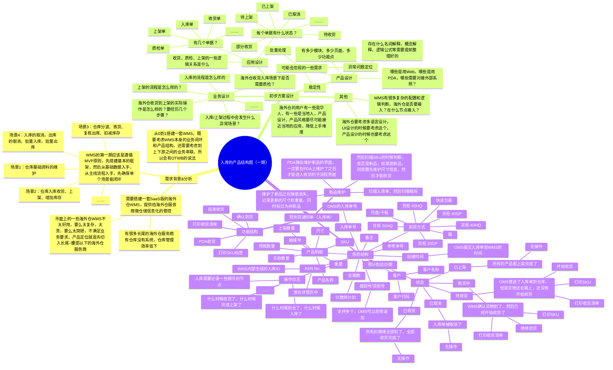
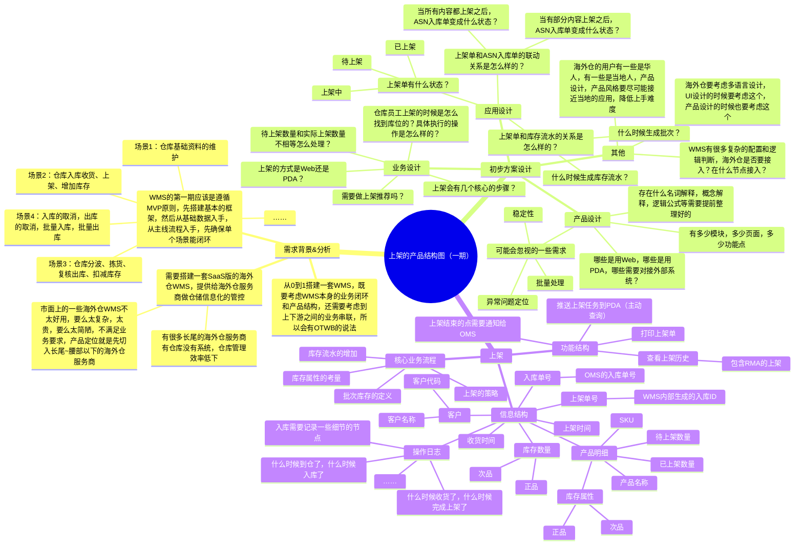

## 前言

经过前面几节课的铺垫，我们采用“从宏观到微观”的拆解思路，给大家一层一层地拆解了海外仓WMS相关的内容，这节课就是是大家跃跃欲试的项目实战讲解的课程了。

本节课我会从WMS的收货、上架、库存这三个维度给大家细致地讲解海外仓WMS的入库这个模块的业务，同时也会在课程中间穿插一些对业务知识的补充说明，帮助大家更有画面感的理解这一块的业务。

虽然本节课是重点讲解海外仓的WMS入库环节，但是**该方案也同样适用于国内仓WMS**，所以我也会顺带讲解一些国内仓的业务知识，帮助大家同步提升。

如果你完成了进销存的实战作业，那么这节课的作业有很多“组件”和“方案”都是可以迁移复用的，这将大大地提升我们输出作业的效率，同时进一步加深对业务和产品细节的了解。

> 本节课为录播课程，没有腾讯会议邀请链接，可以先查看下方的课程文稿，然后再学习课程视频，最后完成相关的课后作业即可。

## 课件详细内容

本节课的内容大概会分成4个部分：

1.  海外仓入库收货的业务介绍；
2.  海外仓WMS收货的产品设计；
3.  海外仓WMS上架的产品设计；
4.  海外仓WMS的库存产品设计；

### Part1 海外仓入库收货的业务介绍

1.  货物是怎么送到海外仓的？

> 从国内将货物送到海外仓这一段路程称之为“头程”，干线运输方式可能是“海陆空”，但是最后将货物从港口/机场拉到海外仓，一般都是用卡车/货车，少量的情况下会用快递。
> 
> 国内仓库，货物可能会从供应商工厂送过来，可能会用快递寄过来，所以国内大的仓库收货之前会需要进行月台预约，因为可能仓库月台不够，人手也不够，造成送货车队拥堵在仓库门口。
> 
> _海外仓WMS的收货,上架,库存等产品设计-1.png)

2.  货物是怎么样的形式达到海外仓的？

> 一般来说，整柜送达的形式最多，整柜中可能已经打好了拖，可能是整箱，一般来说整箱的多。除了整柜送达之外，也会有散箱送达，或者快递包裹的形式送达。

| 列 1 | 列 2 | 列 3 |
| --- | --- | --- |
| _海外仓WMS的收货,上架,库存等产品设计-2.png) | _海外仓WMS的收货,上架,库存等产品设计-3.png) | _海外仓WMS的收货,上架,库存等产品设计-4.png) |

3.  海外仓收到货之后大概要执行哪些操作？

> 货物送到了海外仓之后，海外仓需要拆卸货物（拆柜），理货（整理分类），清点（收货），再登记数量，最后签字确认送达。
> 
> 想象一下，一个大仓库，有很多个货主的货物，每天都会来来往往很多车送货过来，有一些是整车送过来，有些是送部分箱子，还有一些是快递包裹，还有一些客户退货的产品，所以仓库的收货会有很多种形式。
> 
> 1.  备货入库，可能是整柜/散货送达，需要清点最细的粒度，确认数量没问题
> 2.  拆柜型入库，整柜送达，送到了之后可能立马就发走，不需要拆箱清点，也可以称之为“Cross-Docking 交叉转运”
> 3.  退货入库，买家购买了商品之后感觉不满意，然后都是很零碎的退回到仓库（处理很麻烦）

| 列 1 | 列 2 |
| --- | --- |
| _海外仓WMS的收货,上架,库存等产品设计-5.png) | 一家制造商需要从深圳将20个货物托盘运送到北京、上海和重庆。这20个货物托盘首先被运到武汉的一个第三方仓库。  几天后，20个托盘中的5个货物托盘被送到上海，10个货物托盘被送到重庆，5个货物托盘被送到北京。由于这些货物托盘从未被打开，而且只在仓库内停留了足够短的时间，它们是从一辆卡车转移到另一辆卡车上（从一个装卸区到另一个装卸区），因此它们就被进行了交叉转运。 |

| 列 1 | 列 2 |
| --- | --- |
| _海外仓WMS的收货,上架,库存等产品设计-6.png) | 一家制造商的5个供应商将一年的零部件运送到仓库。这些零部件被存放，直到需要时，仓库挑选它们，将它们组装成一个单一的货物批次，然后运送到制造工厂。  转运是对物品进行分类和重新装托盘，一般会在仓库中存放比较久的时间，是需要进行上架和下架操作的。 |

4.  仓库怎么知道这票货物是属于系统里的哪个单据？

> 仓库每天会收到很多货物，我怎么知道这个货物送的对不对？怎么知道这票货物是属于系统中的哪个单？海外仓为了解决这种“无主货”场景，都会要求货物送达海外仓的时候在外箱上贴箱唛，箱唛上有关键信息可以告知单号，货主，货物信息等。所以箱唛是一个很关键的概念，也是一个很必需的东西。

| 列 1 | 列 2 |
| --- | --- |
| _海外仓WMS的收货,上架,库存等产品设计-7.png) | _海外仓WMS的收货,上架,库存等产品设计-8.png) |

5.  收货的时候怎么录入数据？

> 仓库在收货的时候，怎么记录某个箱子，某个SKU收了多少？因为凭借记忆力是很容易会被忘记的，所以就需要使用纸质单据或者PDA来帮助快速录入数据。
> 
> 在收货的时候提前打印纸质单据，然后收货的时候收了多少就记录在纸上，最后再将纸上的数据录入到系统中，这个称之为Web收货，也就是在Web录入结果。
> 
> 在收货的时候不需要提前打印纸质单据，直接在收货的时候录入数据在PDA中，这种边点数边录入数据的方式，称之为PDA收货或者RF收货，需要额外开发安卓APP或者H5。

| 列 1 | 列 2 |
| --- | --- |
| _海外仓WMS的收货,上架,库存等产品设计-9.png) | _海外仓WMS的收货,上架,库存等产品设计-10.png) |

6.  收货多了或者少了怎么办？

> 仓库收货的时候一般来说会有这么几种常见的场景：
> 
> 1.  货物对得上，但是数量对不上，例如数量多了或者数量少了；
> 2.  货物对不上，数量无所谓了，例如预报的时候说送过来了iPhone，结果实物是iPad；
> 
> 针对第1种情况，一般来说仓库都是支持多收，少收，而且支持分多批次收货的，具体每家WMS都不太一样，要看业务情况而定。
> 
> 针对第2种情况，这种异常处理往往会比较麻烦，一般会单独拿出来额外处理，需要提前和货主沟通这种情况，例如让货主重新创建一个新的入库单，然后再另外收货。
> 
> 货物多了，少了，货物对不上，这些都算是异常场景，一般WMS的收货单的状态不会自动流转到下一步，需要人工确认，然后才能进入到下一步。例如手动关单，手动确认完结单据等。

7.  WMS系统的几个核心点介绍

> _海外仓WMS的收货,上架,库存等产品设计-11.png)

### Part2 海外仓WMS收货的产品设计

#### 2.1 流程图、ER图、状态机图等

_海外仓WMS的收货,上架,库存等产品设计-12.png)

一般仓库收货到上架会分成3大步骤，分别是收货，质检，上架。其中收货和质检的顺序可以调整，可以先收后质检，也可以先质检再收货。

> 海外仓一般质检用的比较少，基本上在系统中不会做质检的模块。都是到货的时候清点，然后有问题的直接反馈给客户，没问题的就正常上架。
> 
> 有问题的商品要征得客户的同意，要么收货然后判定为次品，然后上架到次品区域；要么就是不收货，直接拒收处理（比较少）。
> 
> 如果WMS中有质检模块，那么就会需要录入质检结果：
> 
> 1.  良品有多少，次品有多少；
> 2.  次品的原因是什么，照片是什么；
> 3.  检查的方式，检查的人，还有一些检查记录等；
> 
> 如果WMS没有质检模块，那么就只需要在收货的时候录入：良品多少，次品多少即可，这种不算是质检，只是简单的结果录入。

| 列 1 | 列 2 |
| --- | --- |
| #### _海外仓WMS的收货,上架,库存等产品设计-13.png) | _海外仓WMS的收货,上架,库存等产品设计-14.png)  _海外仓WMS的收货,上架,库存等产品设计-15.png) |

由于质检模块用的比较少，所以后续我们在讲解的过程中都是采用“**入库收货之后直接生成上架单**”的方式，跳过质检这一块。

_海外仓WMS的收货,上架,库存等产品设计-16.png)

#### 2.2 产品结构图

_海外仓WMS的收货,上架,库存等产品设计-17.png)

_海外仓WMS的收货,上架,库存等产品设计-白板-1.svg)

#### 2.3 产品原型图

[http://43.138.173.42/FAKKCY](http://43.138.173.42/FAKKCY)（最原始版本的原型示例图）

[http://43.138.173.42/W54921/#id=ouv54s](http://43.138.173.42/W54921/#id=ouv54s)（往期优秀学员的作业）

### Part3 海外仓WMS上架的产品设计

#### 3.1 一些补充知识介绍

1.  什么是上架?

> 在产品进入仓库，在仓库的工作人员核对无误后，把产品摆放到指定的库位，这一动作，我们称之为上架。最常见的上架动作就是把货物从收货/卸货平台，搬运到最终存储库位上。
> 
> 上架操作，不影响库存数量，仅涉及到产品的储位变化（由收货暂存库位变更为具体存储库位）。但系统为了避免仓库内作业混乱，一般来说未上架库存不可出库，因此上架完成后，库存将由入库冻结（入库暂存）情况自动释放为可用库存。

_海外仓WMS的收货,上架,库存等产品设计-18.png)

2.  什么是上架规则?

> 决定产品在仓库中如何存放的业务管理规则，我们称之为上架规则。每一个客户或产品可以分别定义对应的上架规则。

_海外仓WMS的收货,上架,库存等产品设计-19.png)

_海外仓WMS的收货,上架,库存等产品设计-20.png)

3.  上架规则需要考虑的一些因素

-   库位限制，说明每个候选库位类型必须满足的限制条件。如果一个库位不能满足所有的限制条件，它就不能被用于候选存储，包括是否能够能够混放批次、产品，是否根据产品组信息判断等。
-   空间限制，为每一个候选库位说明空间尺寸要求，如体积、重量等，过滤可用的库位。 
-   订单类型，限定此上架规则执行的订单类型。可以达成不同类型订单分流处理的效果。例如正常订单上架到存储库区，退货订单上架到QC库区等。 
-   包装级别，限定此上架规则执行的包装级别。能够实现不同包装级别的产品分流上架的目的。例如零散产品上架到拣货位，整托盘上架到存储区。 
-   产品循环级别，限定此上架规则执行的产品所属的循环级别，便于根据产品周转情况安排仓库存储及操作路线。 
-   批次属性，限定此上架规则执行对应的批次属性内容。

> 上架规则属于WMS进阶的部分内容，对于很多小仓库来说，上架规则不是必须的，很多时候会依赖员工的经验来操作，让员工自行选择放在什么库位上。
> 
> 建议新手学习WMS的时候，先把基本功修炼扎实，后面再考虑深入研究上架规则的内容。

#### 3.2 流程图、ER图、状态机图等

_海外仓WMS的收货,上架,库存等产品设计-21.png)

_海外仓WMS的收货,上架,库存等产品设计-22.png)

_海外仓WMS的收货,上架,库存等产品设计-23.png)

#### 3.3 产品结构图

_海外仓WMS的收货,上架,库存等产品设计-白板-2.svg)

#### 3.4 产品原型图

[http://43.138.173.42/FAKKCY](http://43.138.173.42/FAKKCY)（最原始版本的原型示例图）

[http://43.138.173.42/W54921/#id=ouv54s](http://43.138.173.42/W54921/#id=ouv54s)（往期优秀学员的作业）

### Part4 海外仓WMS的库存产品设计

#### 4.1 批次相关的介绍

> 同一个SKU（产品）但是因为某些“微小区别”不一样而需要作出一些区分，就会考虑引入批次的概念。  
> 例如根据不同的入库时间，生成不同的批次；根据不同的供应商，生成不同的批次；根据不同的生产日期，生成不同的批次。

要深入理解批次，得要结合“批次属性”来讲解才会更清楚，这个部分需要大量的篇幅，后续大家可以阅读电子书中相应的模块。

这里我们可以先简化批次，把上架日期当做一个批次属性，即**不同日期上架的相同商品会有不同的批次**。

_海外仓WMS的收货,上架,库存等产品设计-24.png)

_海外仓WMS的收货,上架,库存等产品设计-25.png)

#### 4.2 WMS的库存核心知识拆解

| 列 1 | 列 2 |
| --- | --- |
| _海外仓WMS的收货,上架,库存等产品设计-26.png) | _海外仓WMS的收货,上架,库存等产品设计-27.png) |

#### 4.3 WMS侧库存展示

_海外仓WMS的收货,上架,库存等产品设计-28.png)

按“产品”查询库存：**SKU+客户+正/次品+数量**

> 总库存：可用库存+锁定库存  
> 可用库存：可用于接收OMS推送过来的订单的库存  
> 锁定库存：接收了OMS推送过来的订单而锁定的库存，但是还没有出库，出库了就会锁定转为扣减

_海外仓WMS的收货,上架,库存等产品设计-29.png)

按“产品+库位”查询库存：**SKU+客户+正/次品+库位+数量**

> 引入了一个“库位”的概念，WMS需要记录某个库位上分别放了什么产品，数量是多少，批次是什么。
> 
> 总库存：可用库存+锁定库存  
> 可用库存：可用于出库扣减的库存  
> 锁定库存：被波次单或者其他单据占用锁定的库存

_海外仓WMS的收货,上架,库存等产品设计-30.png)

按“产品+库位+批次”查询库存：**SKU+客户+正/次品+批次号+库位+数量**

> XLWMS没有做这个维度的库存查询，实际上底层的结构是支持这样做的，只是页面上没有做展示而已。

按“产品+库位+批次”查询库存流水：**SKU+客户+正/次品+批次号+库位+数量**

> 引入了一个“批次号+库位”的概念，WMS需要记录在什么时候增加了SKU的库存，这个SKU批次是什么，放在了什么库位；同理，出库的时候也需要记录什么时候扣减，从什么库位拿走的，然后拿走的批次是什么。

_海外仓WMS的收货,上架,库存等产品设计-31.png)

## 课后作业

> 完成海外仓WMS入库和上架模块的产品设计，输出对应的业务流程图，产品结构图和原型图。其中核心点是业务流程图和原型图，产品结构图可以轻量化，节省时间。同时要多关注一下库存方面的变动，后面在讲解出库的时候也会涉及到这一块的内容。

## **课程答疑或补充知识**

### 答疑

1.  对WMS入库、库存等方面的知识还不太熟悉，可以看哪些知识？

> 这一块的知识我在电子书《📚 跨境供应链：海外仓OTWB项目实战》中有详细的介绍，可以点击此链接查看。  
> [4.2 海外仓WMS的入库功能模块](https://www.yuque.com/jiaowovitamin/dgugdp/qgrsy2h4b3trymcf)
> 
> [4.5 海外仓WMS的库存模块](https://www.yuque.com/jiaowovitamin/dgugdp/tun9m4r2iws7qorq)

### 补充知识

[易仓2023海外仓白皮书.pdf](https://www.yuque.com/attachments/yuque/0/2025/pdf/48385069/1738735842101-9ab4b727-6f10-4c78-9c75-b51911de71c6.pdf)