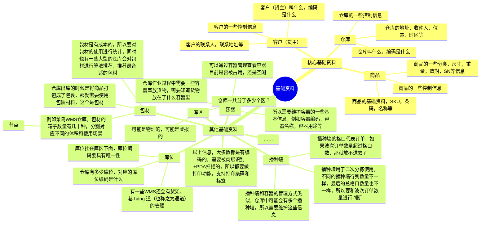

## 前言

上一节课和大家讲了海外仓WMS的入库收货、上架、库存方面的业务知识和产品设计，让大家对海外仓WMS有了一个更深刻的了解。本来接下来应该是直接讲解海外仓的出库、分波、拣货相关的内容的，但是我怕有一些知识没有提前铺垫会让大家看不太懂，所以这节课我们引入一个基础数据和出库库存的处理，来给大家铺垫讲解一下海外仓基础数据，出库的库存方面的内容，让大家更加深入了解海外仓WMS的相关模块。

供应链系统中的最常见的基础数据就是商品，供应商，客户，仓库，物流等，而在03-WMS系统中，最常见的基础数据，除了商品之外，还有货主，仓库，库区，库位，库内设备等，了解这些基础数据是怎么创建的，怎么在业务环节中串联起来的，对我们掌握WMS有非常重要的作用。

本课的开课时间是`**2024/06/30（周日）晚上8:30**`，开课的方式是使用腾讯会议，所以请大家提前准备好相应的软件，会议链接如下：

> 维他命 邀请您参加腾讯会议
> 
> 会议主题：课程12（直播课）：海外仓基础数据和出库库存的处理等产品设计
> 
> 会议时间：2024/06/30 20:30-22:30 (GMT+08:00) 中国标准时间 - 北京
> 
> 点击链接入会，或添加至会议列表：
> 
> [https://meeting.tencent.com/dm/z4tW0QqKjLRJ](https://meeting.tencent.com/dm/z4tW0QqKjLRJ)
> 
> #腾讯会议：704-947-651
> 
> 复制该信息，打开手机腾讯会议即可参与

## 课件详细内容

本节课的内容大概会分成4个部分：

1.  WMS的基础资料；
2.  WMS的一些策略和规则；
3.  WMS的多层库存讲解；
4.  海外仓WMS入库和出库的库存变化讲解；

### Part1 WMS的基础资料

#### 1.1 基础资料讲解

_海外仓基础数据和出入库库存的处理等产品设计-白板-1.svg)

基础资料的产品设计需要注意的几个点：

> 1.  基础资料是谁创建的，从哪里来？有多少方使用？谁可以修改更新？
> 
> 1.  WMS的基础资料有一些是上游推送的，有一些是自己创建的
> 
> 2.  基础资料有更新的时候怎么处理？对方主动推，还是我定期去拉，数据的流向是怎么样的？
> 
> 1.  上游推送过来的数据，WMS接收
> 2.  但是有一些更新可能不及时，WMS也可以主动去拉数据
> 
> 3.  基础资料要考虑多方联动关系的场景，如果我要删除这个资料，别人在用怎么办？如果我要解除关联关系，使用方会不会出问题？
> 
> 1.  例如容器被使用了，那就不能删除了，播种墙也是如此
> 2.  有些数据不允许删除，即使不用了，那就只能作废或者标记取消

#### 1.2 仓库中的拣货路径讲解

  

_海外仓基础数据和出入库库存的处理等产品设计-1.png)

| 列 1 | 列 2 |
| --- | --- |
| _海外仓基础数据和出入库库存的处理等产品设计-2.png) | _海外仓基础数据和出入库库存的处理等产品设计-3.png) |

_海外仓基础数据和出入库库存的处理等产品设计-4.png)

_海外仓基础数据和出入库库存的处理等产品设计-5.png)

_海外仓基础数据和出入库库存的处理等产品设计-6.png)

_海外仓基础数据和出入库库存的处理等产品设计-7.png)

### Part2 WMS的一些策略和规则

#### 2.1 货主，库区，库位，商品的关系

_海外仓基础数据和出入库库存的处理等产品设计-8.png)

> 1.  一个货主会有多个商品，仓库会有多个货主，也就会有多个商品；
> 2.  一个仓库会有多个库区，一个库区会有多个库位，所以仓库中会有多个库区和多个库位；
> 3.  商品是需要放在库位上的，库位会有不同的规则和要求，所以商品能不能放到库位上有很多判断条件；
> 4.  货主可以和库区关联一些控制信息，例如某个货主的货物只能放在A库区，其他库区不能放；
> 5.  货主也可以和一些库位关联一些控制信息，例如某个货主的货物只能放在某个库位，其他库位不能放；
> 6.  仓库中的很多控制信息、策略等，可以分别挂在货主，库区，库位，还有商品上，所以关系链就很复杂；
> 7.  如果有多个控制信息的情况下，一般会需要遵循优先级的玩法，例如“产品->货主->库位->库区”；

#### 2.2 一些常见的策略或者规则

1.  批次属性策略

> SKU的批次号生成规则是怎么样的，通过哪些批次属性可以来生成不同的批次。
> 
> _海外仓基础数据和出入库库存的处理等产品设计-9.png)
> 
> 常见的批次属性：
> 
> 1.  生产日期
> 2.  失效日期
> 3.  入库日期
> 4.  供应商
> 5.  外部批号（包装批号）
> 6.  ……

2.  混放规则

> 一般的混放规则都是挂在库位维度上的，在创建库位的时候，可以维护这个库位上是否支持商品混放和批次混放。
> 
> 商品混放，即不同的SKU可以放在一个库位上；
> 
> 批次混放，即不同的批次可以混放在不同的库位，一般来说不同的商品批次号是会不一样的，所以批次不混放也就是意味着商品也不会混放；
> 
> _海外仓基础数据和出入库库存的处理等产品设计-10.png)
> 
> _海外仓基础数据和出入库库存的处理等产品设计-11.png)

3.  序列号规则

> 在序列号采集过程中，为了保证序列号的合法性，扫描过程中往往会对序列号的长度、前缀等进行校验。但不同客户、不同产品的序列号组合要求通常各不相同。
> 
> 系统通过序列号规则表对序列号的合法性规则进行约定，以支持不同业务的需要。维护后的序列号规则，在产品档案中选择从而与产品相关联、生效。
> 
> 序列号规则一般和货主、商品关联，最精细化的粒度就是SKU维度了。
> 
> _海外仓基础数据和出入库库存的处理等产品设计-12.png)

4.  上架规则

> 由于同一产品在不同仓库内的存储布局要求有可能不同，因此在进行上架规则配置时，可以为每个仓库分别配置上架规则。
> 
> 遵循上架规则执行上架计算，需要的前提是产品配置为系统计算库位（不能是人工指定库位）， 并且收货库位是过渡库位。否则系统视为人工收货到存放库位，无需系统进行上架计算、推荐库位。
> 
> _海外仓基础数据和出入库库存的处理等产品设计-13.png)
> 
> _海外仓基础数据和出入库库存的处理等产品设计-14.png)

5.  波次规则

> 波次规则是系统通过预设的规则，自动定时将满足条件的订单划分到波次中，从而提高作业效率和准确性。波次规则的设定可以根据多种因素，例如货物的属性、客户订单、运输计划等，或者根据订单的数量和相似性将订单分组为波次，以便进行集中处理。
> 
> 波次规则的MVP版是手动波次，即用户手动筛选一些条件，然后将满足条件的订单分成组成波次，可能是一个，也可能是多个。
> 
> _海外仓基础数据和出入库库存的处理等产品设计-15.png)
> 
> _海外仓基础数据和出入库库存的处理等产品设计-16.png)

6.  库存周转规则

> 库存周转规则是出货时所考虑的产品周转排序。通常来讲，仓库在出库时货主经常会有指定的出库要求，例如某个产品要求发货指定的生产批号，或者指定的供应商的货物。但符合要求的货物很可能不止一个批次，或者货主没有指定具体的要求，此时就需要利用到库存周转规则，对符合要求的货物进行排序，然后按一定顺序出库。
> 
> 通常所说的**产品先进先出（FIFO）**，就是一种常见的库存周转规则。库存周转规则是用于库存分配环节的。在产品出库操作中，每一次分配都会利用到库存周转规则中的设置。
> 
> _海外仓基础数据和出入库库存的处理等产品设计-17.png)
> 
> _海外仓基础数据和出入库库存的处理等产品设计-18.png)

7.  WMS有非常多的规则和策略可以配置，主要还是看实际业务场景是否需要，同时也要考虑配置规则和策略的成本和收益之间的平衡……

1.  如果想要对这些规则和策略有更深入的了解，可以去看富勒WMS的内容
2.  _海外仓基础数据和出入库库存的处理等产品设计-19.png)

#### 2.3 控制信息有哪些？

1.  仓库的控制信息

> 针对整个仓库默认的一些控制信息，用来做兜底使用，如果货主，商品都不配置一些控制信息，那么就按仓库的控制信息来兜底。
> 
> _海外仓基础数据和出入库库存的处理等产品设计-20.png)

2.  客户的控制信息

> 可以在客户（货主）的维度上配置一些控制信息，大体上和仓库端的控制信息是类似的，同时也可以针对客户（货主）做一些特殊的业务规则配置，也挂在客户的基础资料这个位置，便于统一管理。
> 
> _海外仓基础数据和出入库库存的处理等产品设计-21.png)_海外仓基础数据和出入库库存的处理等产品设计-22.png)

3.  商品的控制信息

> 也可以在商品的的维度上配置相应的控制信息，商品涉及的内容就比较多了，例如控制信息，效期，序列号，药品监管，进出口海关申报等信息都可以放在商品维度上。
> 
> _海外仓基础数据和出入库库存的处理等产品设计-23.png)
> 
> _海外仓基础数据和出入库库存的处理等产品设计-24.png)
> 
> _海外仓基础数据和出入库库存的处理等产品设计-25.png)

4.  库位的控制信息

> 在库位的维度，也会有相应的控制信息，例如体积，重量，箱数，托盘数等，还有相关的坐标信息（XYZ），同时也可以绑定一些混放策略，是否支持商品混放，还是批次混放等。
> 
> _海外仓基础数据和出入库库存的处理等产品设计-26.png)
> 
> _海外仓基础数据和出入库库存的处理等产品设计-27.png)

### Part3 WMS的多层库存讲解

在WMS中，会存在多层库存，即多种维度、颗粒度的库存。对于初学者来说，由于没去过仓库，所以比较难get到这些名词背后的含义，我用一个通俗易懂的案例，让大家5分钟就搞懂这几层库存的含义。

| **名词** | **解释说明** | **类比案例** |
| --- | --- | --- |
| 仓库库存 | 整个仓库中一共有多少库存数量，包含所有SKU的数量 | 整个学校有多少学生人数，包含大一到大三的所有男生和女生 |
| SKU库存 | 仓库中的某个SKU有多少库存数量 | 学校中男生（SKU1）一共有多少人数 |
| 库位库存 | 仓库中的某个库位上有多少库存数量 | 学校中某个教室中有多少学生数量 |
| 批次库存 | 仓库中的某个批次有多少库存数量 | 学校中大一的学生有多少人数 |
| SN库存 | 仓库中某个SN码的库存，一般都是1，更关注状态 | 学校中学号为20200001的学生人数，是1，已毕业 |
| SKU-库位库存 | 某个SKU在某个库位上有多少库存数量 | 学校中男生（SKU1）在某个教室中有多少人数 |
| SKU-批次库存 | 某个SKU的某个批次有多少库存数量 | 学校中男生（SKU1）是大一的有多少人数 |
| SKU-批次-库位库存 | 某个SKU的某个批次在某个库位上有多少库存数量 | 学校中男生（SKU1）是大一的在某个教室中有多少人数 |
| SKU-SN库存 | 某个SKU且SN码是XXX的库存状态是怎么样的 | 学校中男生（SKU1）且学号为20200001的状态是怎么样的 |

| 列 1 | 列 2 |
| --- | --- |
| _海外仓基础数据和出入库库存的处理等产品设计-28.png) | _海外仓基础数据和出入库库存的处理等产品设计-29.png) |

> WMS的多层库存，核心的是**SKU库存，库位库存，SKU批次库存**这三个，其他的基本上都是基于这个的基础进行衍生、拓展、变化而来的。

### Part4 海外仓WMS入库和出库的库存变化讲解

#### 4.1 入库场景（引入暂存库位）

_海外仓基础数据和出入库库存的处理等产品设计-30.png)

#### 4.2 入库场景（最简化作业的场景，例如海外仓）

_海外仓基础数据和出入库库存的处理等产品设计-31.png)

#### 4.3 出库场景（通过波次分配库位库存的场景-“先波后分”）

> 先波后分，就是在生成波次的时候去分配“SKU-库位-批次”的库存。

_海外仓基础数据和出入库库存的处理等产品设计-32.png)

#### 4.4 出库场景（推单的时候则分配库位库存的场景-“先分后波”）

> 先分后波，就是在出库单推送到WMS的时候就分配“SKU-库位-批次”的库存，等到时候分波的时候就不需要再去锁定占用库存了。

_海外仓基础数据和出入库库存的处理等产品设计-33.png)

通过上面的讲解，我们可以更加清晰地了解“先波后分”和“先分后波”的区别是什么，其中最大的区别就是：

> **分配预占库位层的库存的时机不一样，“先波后分”是在分波的时候进行库位库存的分配预占，而“先分后波”则是在进单到WMS的时候就进行库位库存分配预占。**

除了库位层的库存分配预占的时机和还有分配预占的取消方式这两点不一样之外，其他的库存变化逻辑，例如拣货下架，确认出库等都是一样的。

先波后分在分配策略和效率提升上有更大的空间，因为分配结果就是作业员需要执行的库位，这里可以做的很复杂，比如用到算法。而先分后波因为分配是针对订单的，所以策略相对固定，无法考虑整体作业效率的提升。

特别是在一些波次拆分较细的场景下，先分后波会导致同一库位的货品被拆分到多个波次，导致作业效率较低（海外仓大件仓这个场景特别明显），好处就是系统处理逻辑相对更简单。

**无论是国内仓还是海外仓WMS，选择先波后分的还是占大多数。**

## 课后作业

> 本节课没有作业，请大家继续完成上节课的“海外仓WMS入库和上架模块的产品设计”，同时也可以开始阅读电子书相关的内容，掌握更多课程中没有提及到的细节知识。

## **课程答疑或补充知识**

### 答疑

1.  对仓库中的一些基础资料是干嘛用的还不太熟悉，可以看哪些知识？

> 这一块的知识我在电子书《📚 跨境供应链：海外仓OTWB项目实战》中有详细的介绍，可以点击此链接查看。
> 
> [2.2 WMS中的基础数据](https://www.yuque.com/jiaowovitamin/dgugdp/dldtgkcfnm2767g2)

2.  对仓库中的拣货路径和优先级的分配逻辑还是不太清楚，应该怎么办？

> 这一块的知识我在电子书《📚 跨境供应链：海外仓OTWB项目实战》中有详细的介绍，可以点击此链接查看。
> 
> [4.4 海外仓WMS的拣货业务](https://www.yuque.com/jiaowovitamin/dgugdp/hbvecws8bg1038hh)

### 补充知识

> 波次策略的配置：
> 
> [https://www.jackyun.com/pages/space.html](https://www.jackyun.com/pages/space.html)
> 
> 仓储->作业策略->拣货波次生成
> 上架库位推荐策略/规则的配置：
> 
> [https://www.jackyun.com/pages/space.html](https://www.jackyun.com/pages/space.html)
> 
> 仓储->作业策略->货位推荐策略
> 拣货库位推荐策略/规则的配置：
> 
> [https://www.jackyun.com/pages/space.html](https://www.jackyun.com/pages/space.html)
> 
> 仓储->作业策略->拣货货位分配