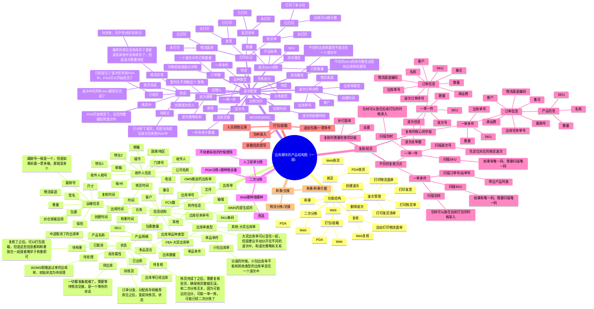
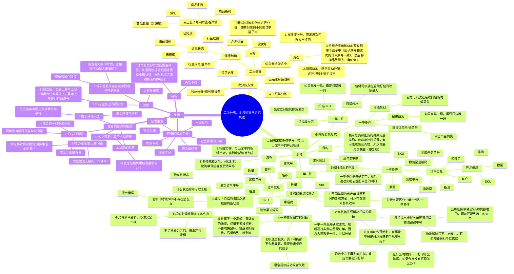
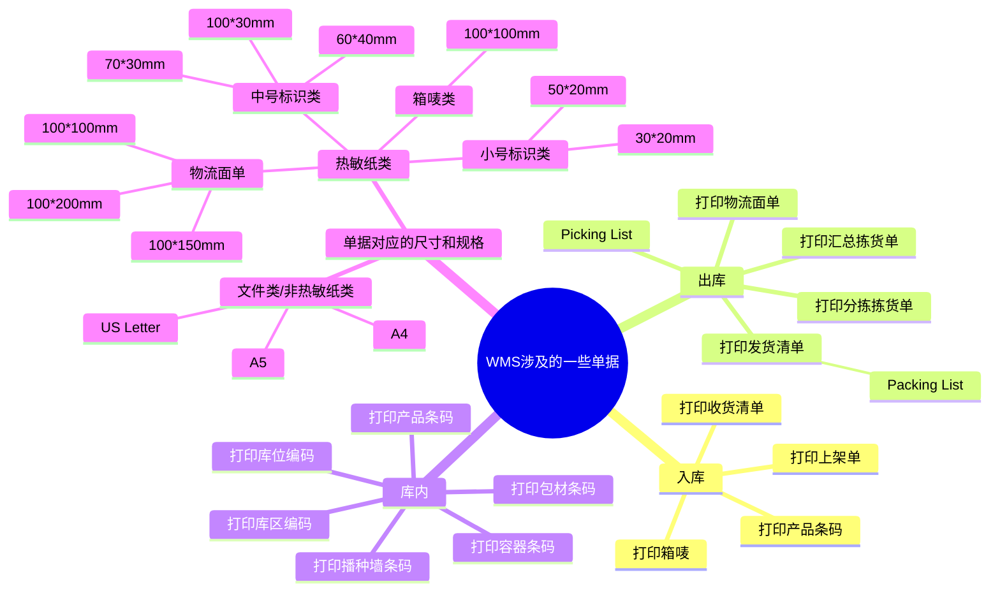

## 前言

经过了前面几节课的学习，我们对仓库的业务场景，还有WMS的产品设计等有了一些画面感和熟悉感，可以发现WMS可以做的简单，也可以做的复杂，核心还是要看具体的业务要求，业务流程等。

无论是海外仓还是国内仓库，对于WMS来说主要核心的业务场景和功能模块主要可以分成：

1.  基础数据模块，包含商品资料，货主资料，仓库资料，库位库区资料，容器/设备资料等；
2.  业务规则模块，包含上架规则，波次规则，库存周转规则，分配规则，质检规则，其他业务规则等；
3.  入库模块，包含入库预约，收货，质检，上架等；
4.  出库模块，包含波次，拣货，分拣，复核，称重，出库等；
5.  库存模块，包含库存查询，盘点，移位移库，库存调整等；

本套课程会重点讲一些通用且底层的东西，一些和业务有强关联，不一定具有普适性且有一定上手难度的则会跳过，这样更利于新手学习WMS。前面我们已经讲过了基础数据模块，业务规则模块（简单提及），入库模块，库存模块，接下来这节课我们则**开始讲解我们的出库模块相关**的内容。

在后续的课程中我们还会对WMS的内容做补充讲解，做一些总结串讲等，所以一遍没听懂，没看懂的朋友也不用担心，后续还有机会继续学习、理解的。

> 本节课为录播课程，没有腾讯会议邀请链接，可以先查看下方的课程文稿，然后再学习课程视频，最后完成相关的课后作业即可。

## 课件详细内容

本节课的内容大概会分成4个部分：

1.  WMS出库相关的一些业务知识介绍；
2.  出库单和波次单的产品设计；
3.  二次分拣复核验货的产品设计；
4.  其他一些业务知识介绍；

### Part1 WMS出库相关的一些业务知识介绍

1.  什么是波次？

> 波次，就是对出库单一波波地进行处理。如果一单一单作业，效率很慢，可以通过波次将一些有共性的出库单汇总起来，这样集中处理的时候可以有效地提升作业的效率。
> 
> 想象一下，大学的时候帮室友去超市买东西，每个室友的需求都是一笔“订单”，波次就是把多笔订单所需要的“商品”汇总集中，然后一次性拣货、取到。
> 
> _海外仓WMS的出库,波次,播种,复核,称重等产品设计-1.png)

2.  什么是订单品种类型？波次品种类型？

> _海外仓WMS的出库,波次,播种,复核,称重等产品设计-2.png)
> 
> 如果一个波次中，所有的订单都是“单品单件”的，那么这种波次品种类型，可以称之为“一单一件”。
> 
> 如果一个波次中，所有的订单是混合的，各种类型的都有，那么这种波次品种类型，可以称之为“一单多件”。
> 
> **一般来说，订单的品种类型可以分成4种，而波次的品种类型只需要区分为“一单一件”和“一单多件”即可。**

3.  什么是播种式拣货和摘果式拣货？

> 普通的电商销售出库，每个客户订单中的SKU数量不多（大多数不超过5个），如果拣货员针对每个订单都在仓库里跑一大圈拣货，来回跑动的时间无疑是非常浪费的，此类订单适合将多单合并为一个大的合拣单（也叫批拣单或者波次拣货单等），一次拣完多张订单的商品，然后按照订单对所拣商品进行分拣，类似播种，此类拣货方式称为播种式拣货。
> 
> 门店请货出库、退供应商出库、调拨出库、B2B销售出库业务，每张出库单中的商品数量比较多，通常是成百上千个，每一单都需要拣很久，所以合拣的意义不大，更适合按订单中的商品明细到每个货位上拣选，就像摘果子一样，此类拣货方式称为摘果式拣货。
> 
> _海外仓WMS的出库,波次,播种,复核,称重等产品设计-3.png)

4.  什么是边拣边分和先拣后分？

> 无论是边拣边分，还是先拣后分，都是针对“播种式拣选”或者是“波次拣选”这种情况，因为摘果式一次只操作一单，不需要分拣了。
> 
> **边拣边分：**在拣货的时候，把拣出的货物分配到对应的拣货车中的篮子（订单）中，因为一个波次中一般会有多个订单，也就会有多个篮子。（例如去超市买东西的时候帮室友带一些，拣货的时候就区分好是张三还是李四的东西）
> 
> **先拣后分：**在拣货的时候，一次性把整个波次中要拣货的货物拣出来，然后再去一个专门的区域进行二次分拣，把对应的货物放入到代表订单的篮子中。这个动作叫做二次分拣，也可以叫做播种。（例如去超市买东西的时候帮室友带一些，拣货的时候只管拿，买完之后再回去分）

5.  什么是播种/二次分拣？

> 播种和二次分拣是一个东西，播种是一个形象的说法，而二次分拣是一个偏术语的说法。指的就是当批量拣货之后，需要对拣回来的货物做分拣，不同的订单需要的商品不一样，假如拣回来了8个商品，分别对应3个订单，那么就要将这8个商品按订单的明细去分配，最后的结果不能多也不能少，否则就是拣货异常了。
> 
> _海外仓WMS的出库,波次,播种,复核,称重等产品设计-4.png)

6.  什么是复核/验货？

> 复核/验货就是指重复审核、检查。如果是边拣边分，可能在拣货的时候出错了或者分货的时候分错了；如果是先拣后分也是，大概率在播种的时候会出错。所以需要有一个兜底的环节，就是复核/验货环节。通过扫描单据，然后扫描实物的信息，一个一个确认是否正确，最后才能将商品交给下游去打包。
> 
> 因为商品打包之后，肉眼就看不到里面的货物到底对不对了，所以复核环节很重要，发错货对于仓库来说损失的成本很高，需要非常注意这一块的内容。

7.  什么是称重？为什么需要称重？

> 当订单复核通过了之后就会给下游去打包，打包之后就需要称重了。为什么要对包裹进行称重？
> 
> 1.  计算物流成本，因为包裹是通过快递物流送走的，那么包裹的重量是很重要的信息，可以留底核查；
> 2.  再次确认货物没有搞错，打包的时候由于没有系统监控可能也会出问题，例如多打包了，少打包了，可以通过称重，结合包材的重量+商品的重量预估出包裹的重量，如果称重的实际重量和预估的重量有差异，那么可能打包就有问题；

### Part2 出库单和波次单的产品设计

#### 2.1 流程图、ER图、状态机图等

_海外仓WMS的出库,波次,播种,复核,称重等产品设计-5.png)

_海外仓WMS的出库,波次,播种,复核,称重等产品设计-6.png)

_海外仓WMS的出库,波次,播种,复核,称重等产品设计-7.png)

_海外仓WMS的出库,波次,播种,复核,称重等产品设计-8.png)

#### 2.2 产品结构图

_海外仓WMS的出库,波次,播种,复核,称重等产品设计-白板-1.svg)

#### 2.3 产品原型图

[http://43.138.173.42/FAKKCY](http://43.138.173.42/FAKKCY)（最原始版本的原型示例图）

[http://43.138.173.42/W54921/#id=ouv54s](http://43.138.173.42/W54921/#id=ouv54s)（往期优秀学员的作业）

### Part3 二次分拣，复核验货的产品设计

#### 3.1 流程图、ER图、状态机图等

1.  二次分拣不一定要用系统来做，本质上是因为波次拣货将所有的货物聚合在了一起，然后需要对货物进行分类，已确定货物所属什么订单，所以也可以用肉眼来区分。

_海外仓WMS的出库,波次,播种,复核,称重等产品设计-9.png)

2.  一般来说，只有先拣后分的模式，才需要二次分拣，如果在拣货的时候选择了用边拣边分的模式，那么就不需要二次分拣。所以先拣后分和边拣边分一般是互斥的，**选择了前者就不需要用后者了**。
3.  什么时候确定用先拣后分，还是边拣边分呢？这个没有标准玩法，一般来说以下这几个节点都可以控制：

1.  分波的时候，选择或者配置好拣货方式
2.  推送拣货任务到PDA或者生成拣货任务的时候，选择拣货方式
3.  PDA拣货的时候自己选择拣货方式

| 列 1 | 列 2 |
| --- | --- |
| _海外仓WMS的出库,波次,播种,复核,称重等产品设计-10.png) | _海外仓WMS的出库,波次,播种,复核,称重等产品设计-11.png) |

4.  无论是采用什么拣货/分拣方式，都不影响主线的拣货流程，本质上无非就是怎么能加快效率而已。
5.  二次分拣的核心就是通过扫描波次，带出波次中的商品，然后通过扫描商品去反查订单，每一个商品都要扫描完成，然后每次都会分配给具体的订单。一个播种墙的格子就代表一个订单，波次的订单数不能超过格子数，不然就分拣的时候就会有订单没有格子分配了。

_海外仓WMS的出库,波次,播种,复核,称重等产品设计-12.png)

6.  复核的本质是扫描订单，带出订单的商品，然后通过扫描实物商品条码和系统中展示的商品进行比对。一单一件的复核是扫描波次号，然后扫描商品，通过商品去反选订单；而一单多件的复核则是扫描出库单号，然后扫描商品，通过实物和出库单的商品进行比对，进行验证。前者是货找单，后者是单匹配货。

_海外仓WMS的出库,波次,播种,复核,称重等产品设计-13.png)

_海外仓WMS的出库,波次,播种,复核,称重等产品设计-14.png)

#### 3.2 产品结构图

_海外仓WMS的出库,波次,播种,复核,称重等产品设计-白板-2.svg)

#### 3.3 产品原型图

[p://43.138.173.42/FAKKCY](http://43.138.173.42/FAKKCY)（最原始版本的原型示例图）

[http://43.138.173.42/W54921/#id=ouv54s](http://43.138.173.42/W54921/#id=ouv54s)（往期优秀学员的作业）

### Part4 其他一些业务知识介绍

#### 4.1 出库单的库存变化

1.  了解WMS的多层库存，重点是WMS层库存（仓库-SKU）和库位层库存（SKU-库位-批次）；
2.  先锁WMS层库存，再锁库位层库存，释放的时候先释放库位层，再释放WMS层库存；
3.  了解什么是“先波后分”，什么是“先分后波”，它们的区别是什么？

_海外仓WMS的出库,波次,播种,复核,称重等产品设计-15.png)

#### 4.2 库位推荐的逻辑

1.  先确认拣什么批次，有对应的商品分配策略（库存周转规则），再确认从什么库位拣货，也有对应的库位分配策略（分配规则）；
2.  海外仓一般都是按先进先出的原则进行分配，然后再选择清空库位优先或者最少库位优先；

_海外仓WMS的出库,波次,播种,复核,称重等产品设计-16.png)

#### 4.3 PDA拣货的流程介绍

_海外仓WMS的出库,波次,播种,复核,称重等产品设计-17.png)

| 列 1 | 列 2 |
| --- | --- |
| _海外仓WMS的出库,波次,播种,复核,称重等产品设计-18.png) | _海外仓WMS的出库,波次,播种,复核,称重等产品设计-19.png) |

  

_海外仓WMS的出库,波次,播种,复核,称重等产品设计-20.png)

| 列 1 | 列 2 |
| --- | --- |
| _海外仓WMS的出库,波次,播种,复核,称重等产品设计-21.png) | _海外仓WMS的出库,波次,播种,复核,称重等产品设计-22.png) |

#### 4.4 WMS的单据打印

_海外仓WMS的出库,波次,播种,复核,称重等产品设计-白板-3.svg)

## 课后作业

> 完成海外仓WMS出库单、波次单、还有库存模块的产品设计，输出对应的业务流程，产品结构图和原型图。其中核心点是业务流程图和原型图，产品结构图可以轻量化，节省时间。

## **课程答疑或补充知识**

### 答疑

1.  关于WMS出库这一块的细节知识还不太懂？

> 这一块的知识我在电子书《📚 跨境供应链：海外仓OTWB项目实战》中有详细的介绍，可以点击此链接查看。
> 
> [4.3 海外仓WMS的出库功能模块](https://www.yuque.com/jiaowovitamin/dgugdp/uyld1rlnmh47kst5)
> 
> [4.4 海外仓WMS的拣货业务](https://www.yuque.com/jiaowovitamin/dgugdp/hbvecws8bg1038hh)

2.  对仓库出库的时候要做什么操作不太懂，我可以看哪些内容呢？

> 如果是要深入学习WMS，那么肯定是要懂业务知识的，所以一定要有仓库端实操的画面感，我整理了这些链接给大家，帮助你更好地吸收这些业务知识。
> 
> [入门WMS必须掌握的仓库业务知识介绍（合集）](https://www.yuque.com/jiaowovitamin/seventh/tpyb1uukwtgfb1x8)（吉客云三种波次拣货类型说明）
> 
> [入门WMS必须掌握的仓库业务知识介绍（合集）](https://www.yuque.com/jiaowovitamin/seventh/tpyb1uukwtgfb1x8)（PDA按单拣货）
> 
> [入门WMS必须掌握的仓库业务知识介绍（合集）](https://www.yuque.com/jiaowovitamin/seventh/tpyb1uukwtgfb1x8)（电子播种墙（二次分拣）介绍）
> 
> [吉客云_PDA出库验货流程_哔哩哔哩_bilibili](https://www.bilibili.com/video/BV1sp4y1C7M2/?spm_id_from=333.999.0.0&vd_source=610e391e2cf86c2841d101ff237109fa)
> 
> [吉客云_PDA二次分拣操作流程_哔哩哔哩_bilibili](https://www.bilibili.com/video/BV1Ge41147wL/?spm_id_from=333.999.0.0&vd_source=610e391e2cf86c2841d101ff237109fa)