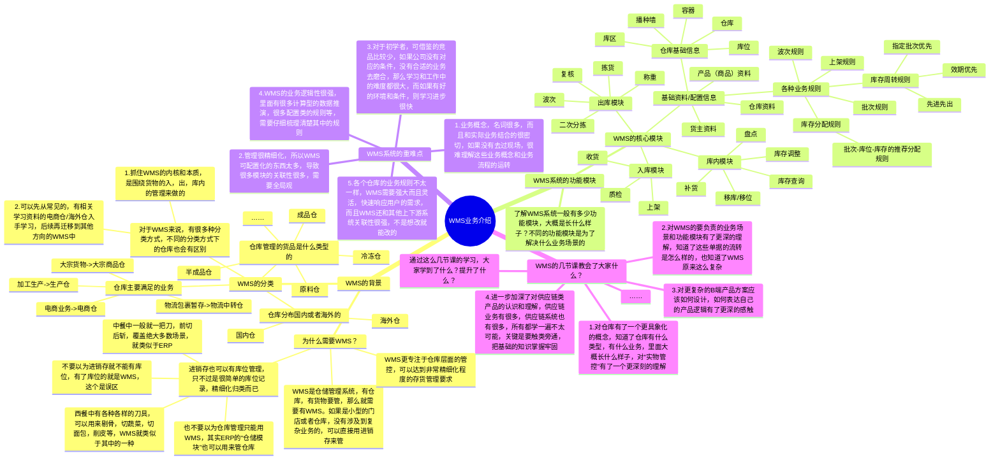
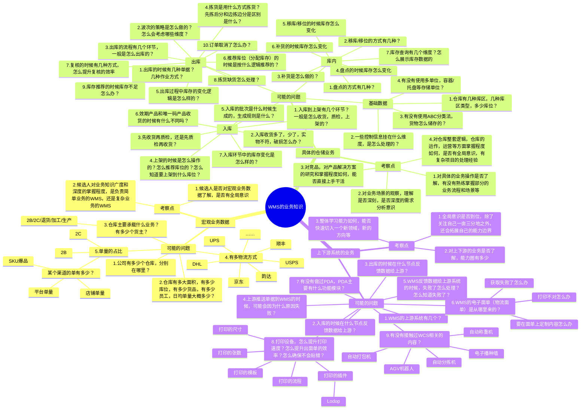

**前言**  
课程8到课程14都是关于WMS项目的课程，有一些朋友看完了之后会感觉WMS太复杂了，虽然多看了两遍视频看似好像搞懂了其中的一些逻辑，但是自己真正去做作业的时候还是会有点懵逼，而且对WMS的上游（OMS）的一些事情理解还不是很透彻，导致多个系统的业务交互串联起来的时候会有点模模糊糊的感觉。  
所以我就安排了这么一节课，也是一节承上启下的课程，我会对WMS的项目知识做一个串讲，同时也会对下一个项目的内容做一个大概的介绍，帮助大家更好地进入下一阶段的课程学习。  
本课的开课时间是**2024/07/07（周日）晚上8:30**，开课的方式是使用腾讯会议，所以请大家提前准备好相应的软件，会议链接如下：  
维他命 邀请您参加腾讯会议  
会议主题：课程15（直播课）：WMS和OMS项目的相关知识串讲  
会议时间：2024/07/07 20:30-22:30 (GMT+08:00) 中国标准时间 - 北京  
点击链接入会，或添加至会议列表：  
[https://meeting.tencent.com/dm/d1asRXoAiAVE](https://meeting.tencent.com/dm/d1asRXoAiAVE)  
#腾讯会议：487-840-473  
复制该信息，打开手机腾讯会议即可参与  
**课件详细内容**  
本节课的内容大概会分成4个部分：  
1WMS业务知识的回顾；  
2WMS非主线业务的讲解；  
3WMS岗位面试的时会涉及的业务知识；  
4下一阶段OMS的学习介绍；  
**Part1 WMS业务知识的回顾**

1.  下一阶段OMS的学习介绍；

### Part1 WMS业务知识的回顾

_WMS和OMS项目的相关知识串讲-白板-1.svg)

  

  
**Part2 WMS的主线与非主线业务的讲解**  
1WMS的业务模块分类有哪些？  
一般WMS的核心大模块分成四块：  
1入库相关（课程11）  
2出库相关（课程13）  
3库内相关（课程11和课程12）  
4基础数据/策略相关（课程12）  
其中入库、出库是讲解的最多的，基础数据和策略讲了一点点，库内相关则重点是介绍了库存查询和库存流水，但是还有例如盘点，移位，补货，库存调整，正次品转化等业务没有讲解。  
2WMS的非主线业务有什么？  
库内相关的盘点，移位，补货，库存调整，正次品转化这些都算是非主线业务。  
还有基础数据的管理和维护，业务规则的配置和运用等都算非主线业务。  
但是这些对于初学WMS来说场景有些小众，而且关联的业务知识非常多，如果早期学习的时候花费太多的时间在这方面就容易分散自己的精力，不容易消化更重要的知识。  
所以本章节只是增加一些业务说明和介绍，帮助大家更好地理解这些概念，而不会讲具体的产品设计。  
  

_WMS和OMS项目的相关知识串讲-1.png)

  
  

_WMS和OMS项目的相关知识串讲-2.png)

  
**2.1 库内（库存）相关的业务介绍（库存移位/移动）**  
移库，也有一些仓库中叫作移位，是指对已经存放在仓库中的商品的位置进行变化，例如从A库位移到B库位，也可以从A区域移到B区域。  
  

_WMS和OMS项目的相关知识串讲-3.png)

快速移位

  
  

_WMS和OMS项目的相关知识串讲-4.png)

  
  

_WMS和OMS项目的相关知识串讲-5.png)

库存移位单

  
快速移位是一种短平快的做法，可以快速将某个商品从A库位移到B库位上去，但是也会有一定的风险，就是系统可能无法监控到位，例如说在Web端去执行了这个单据之后，还需要仓库人员去实际的货物上处理。  
而创建库存移位单则是一种相对来说更加保险的做法，也可以称之为“2步移库法”，其实就是先下架，再上架的做法。  
无论是快速移库还是创建库存移库单的方式，核心还是要关注“下架和上架的规则”和“库存的变化”，库存不足不能移库下架，上架的库位有限制那就不能移库上架，然后库存会产生两条流水，一条下架的，一条上架的。  
**2.2 库内（库存）相关的业务介绍（盘点）**  
盘点是仓库中的相关人员对商品实物库存进行定期清点，并与系统库存进行比对，保证系统库存与实物库存一致的库内操作业务。  
库内盘点的方式有很多，按照盘点形式，分为盲盘（不告知系统数量）和明盘（告知系统数量）；按照盘点时机，分为动态盘点（作业过程中盘点）和静态盘点（作业静止后盘点）；按照盘点周期，分为周期盘点（定期做全库盘点）和循环盘点（按照计划每次盘点一个区域）。  
  

_WMS和OMS项目的相关知识串讲-6.png)

盘点单和盘点任务单的状态流转图

  
  

_WMS和OMS项目的相关知识串讲-7.png)

  
  

_WMS和OMS项目的相关知识串讲-8.png)

摘自《实战供应链》

  
**2.3 库内（库存）相关的业务介绍（补货）**  
补货，就是当零散库库存缺货时，从整件库区进行补货的流程。一般这种玩法叫作“存拣分离”，在国内仓用的比较多，海外仓则用的比较少，因为存拣分离对库内管理还有WMS系统的要求都比较高一些。  
想象一下，走进一家“美宜佳便利店”，顾客可以看到货架上的是拆零了的商品，而顾客看不到的还有一部分存货是放在后面的小仓库中，一般是整箱的存储（“前店后仓”的概念）。  
在实际的仓库中也是一样，有存储区，一般是按箱垒放在托盘上，也有拣选区，一般是按单品（拆零）放在货架上，而补货就是从存储区移动到拣选区，把整箱拆开，按单品放在货架上。  
  

_WMS和OMS项目的相关知识串讲-9.png)

补货的状态流转图

  
根据补货的触发时机，分为主动补货和被动补货两种。主动补货是由仓库管理员定期清理零拣库区库存低于下限的商品，主动发起的补货，一般在空闲期发起；被动补货是当出库单下发仓库后，在波次分配时发现零拣库存不能满足订单需求，由系统自动发起的补货任务。  
补货这一块做得比较少，所以也没怎么深入研究，所以这一块就不做过多的深入讲解，如果有需要的了解的话，可以看看吉客云的补货功能和富勒WMS的补货介绍。  
  

_WMS和OMS项目的相关知识串讲-10.png)

https://jackyun.com/pages/space.html

  
**2.4 库内（库存）相关的业务介绍（库存调整）**  
在仓库操作和管理中，难免会发生一些不可避免的人为错误或库存异常，例如收货数量输入错误或者盘点时发现某库存产品短少。为了尽可能的达成系统数据准确，进而保障系统操作的正确性， 需要及时将系统数量与实际库存调整一致。  
有些时候如果需要快速修改系统中的库存数据，例如增加或者扣减某些库存，则需要使用“库存调整单”来完成。库存调整单就是对库存进行调整的一个单据记录，可以知道是谁调整的，什么时候调整的，调整了什么商品，调整了多少数据等。  
  

_WMS和OMS项目的相关知识串讲-11.png)

库存调整单状态流转图

  
新建调整单的时候比较核心的字段有：  
1调整原因  
2调整商品明细  
a商品SKU  
b商品的批次，库位，当前库存，可用库存  
c调整数量（增加多少，减少多少）  
  

_WMS和OMS项目的相关知识串讲-12.png)

富勒的库存调整单

  
**Part3 WMS岗位面试的时会涉及的业务知识**  
如果想要求职WMS方向的产品经理，那么除了要对WMS的功能模块和产品设计方案了解，也需要掌握很多业务方面的知识，这些业务知识一部分是可以通过课程学习到的，另一部分可能就是要通过自己的拓展学习、面试反馈或者是亲自经历才能学会。  
下面的这些业务知识是可能在面试过程中会比较高频问到的，如果要面WMS方向的产品，则需要提前做好相关的准备。  
  

_WMS和OMS项目的相关知识串讲-13.png)

  

_WMS和OMS项目的相关知识串讲-白板-2.svg)

### ​  

  

  
**Part4 下一阶段OMS的学习介绍**  
WMS项目我们花了很多时间去学习和做作业，终于算是“稍微熟悉和理解了”，但是如果只有这么一些的知识还是不够打，出去找工作也有很大的局限性。因为供应链系统一般来说都不是单打独斗型的，还有很多上下游的系统需要我们也学习和掌握，所以下节课开始，我们就要来学习OMS相关的知识了。  
OMS有很多种定义，这套课程中的OMS是指WMS的客户端，也就是WMS的上游系统，而在其他领域的OMS和我们这里的OMS定义有所不同，对应的功能清单和业务场景也会有所不同，所以大家要注意区分一下。  
课程16，看似是一节比较突兀的课程，突然引入了一个“销售订单”的模块，但是核心是让大家明白“订单”是具有广义性的，对应的“订单管理”或者是“OMS”等也是会有很多种可能性的，我们不能狭隘地就认为订单管理一定是怎么样的，OMS是怎么样的，而是要“看山不是山，看山还是山”。  
课程17，继续回到海外仓的OTWB内容，给大家大家介绍一下什么是OMS，什么是OMP，这么几个系统和WMS是怎么联动的，业务是怎么跑起来的，让大家的有一个画面感。虽然在之前的课程10中，我们已经讲过了大概，但是具体的实操和演示当时没细讲，这节课我们就开始细讲。  
课程18，则是把OMS的入库，出库，库存等功能一起都快速讲了一遍，OMS的入库也会和WMS的入库对应，OMS的出库则与WMS的出库对应，库存也是对应的，所以掌握了WMS之后再去看OMS学习难度就没有那么大了，所以我们就只设置了一节课的时间。  
课程19，稍微做一个拓展延伸，讲解了一下SaaS的WMS是怎么实施，这些系统都是怎么串联起来的，同时也简单拆解了一下“海管家”这一款产品，了解它的前后台架构设计，初始化流程，还有一些不错的产品设计方案等。  
课程20，是对整个海外仓OMS和WMS项目中的库存做了一个总结和补充，把我们常提到，常听到的“批次管理”给讲透彻，让你既能懂WMS的批次管理，又能懂OMS的批次管理。  
**课后作业**  
课程8~14虽然介绍了很多海外仓和WMS相关的内容，但是有一些产品设计方面的细节可能还是会有遗漏，所以建议大家完成配套电子书的阅读。  
完成“第一章：海外仓宏观业务知识介绍”和“第四章：WMS业务介绍&产品设计方案”的阅读。  
  

_WMS和OMS项目的相关知识串讲-14.png)

  
  

_WMS和OMS项目的相关知识串讲-15.png)

  
**课程答疑或补充知识**  
**答疑**  
1补货、移库、盘点等的业务知识可以去哪里看？  
可以看看《实战供应链》，也可以看看吉客云的帮助手册，同时也可以看看富勒的操作手册。  
2我没做过WMS，不知道有哪些具体的业务细节怎么办？  
只能通过做作业的时候遇到一些具体的问题，然后发散性地去找相关的资料，不断地提升自己的画面感。例如采购入库会有什么场景，会有什么问题，别人是怎么解决的，然后通过这种具体的问题去找解决方案，来提升自己对业务的熟悉程度。  
仅靠课程是无法将这些业务知识都讲解完全，吸收完全的，还是要多靠其他一些资料的查询。  
也可以使用AI，把你的理解，你的问题丢给它，让他给你讲一个通俗易懂的例子。  
**补充知识**  
  

[富勒WMS系统用户手册_V6_高清版（维他命）.pdf](https://www.yuque.com/attachments/yuque/0/2025/pdf/48385069/1738735834445-0fc81737-458f-4f03-95b7-dcdf535f4801.pdf)

​  

[吉客云用户手册](https://jackyun.com/pages/space.html)

  

[帮助中心](https://hupun-service.cus.dingtalk.com/page/knowledge?pageId=6&category=1003118607&language=zh)

  
  

  

