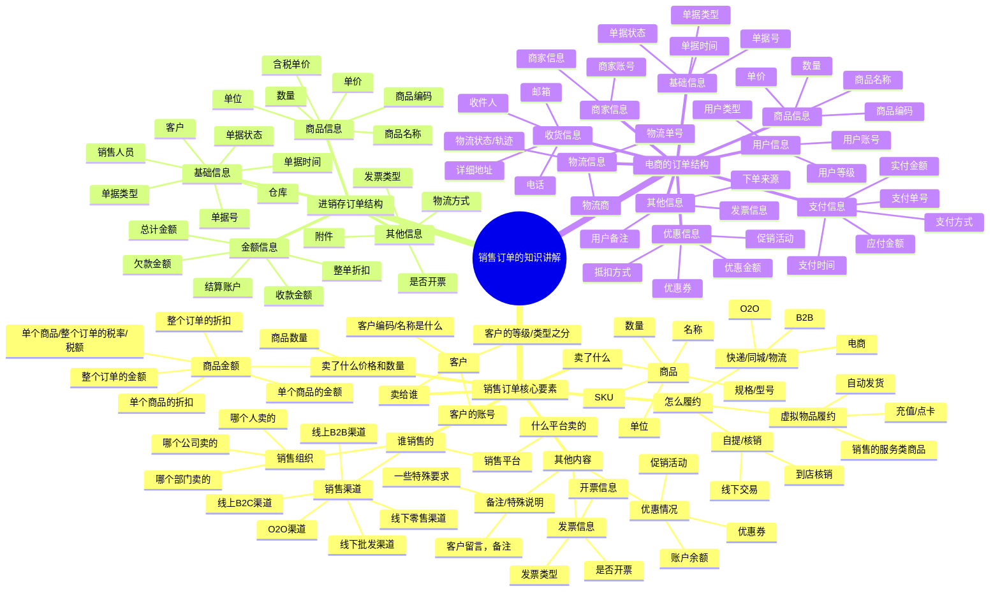
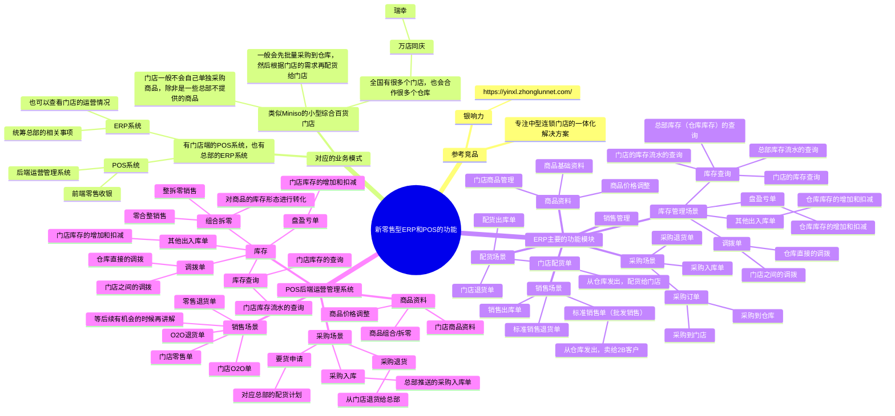

## 前言

学习完了前面的课程之后，我们对供应链系统有了一个大概的了解。知道了什么是采购，什么是销售，什么是库存，也知道了进销存和WMS等系统中商品的实物流，信息流大概是怎么运转起来的。

如果只是掌握这些知识只能说对供应链系统稍稍入了点门而已，要成为一名“合格”的供应链产品经理还需要持续深入地历练，这里的历练包含了业务层面和产品专业能力层面。

对业务层面来说，之前所讲的进销存系统涉及的业务深度和广度不太够，所以我们还需要持续拓展业务知识面，接触一些更深层、更复杂的的业务场景。

对产品专业能力层面来说，除了要掌握产品基本功之外，也要掌握基于多业务主体，多业务流程，多业务诉求等复杂业务场景下，输出相关产品方案的能力。简单来说，就是：**先广泛学习，然后再深入具体领域学习**。

由于后面的课程我们会讲解到OMS和ERP相关的内容，所以本节课，我们就先基于进销存的订单知识作为背景，来深入学习一下“销售订单”相关的业务知识，同时也对B端产品方案设计中常用到的基本功（“主支辅异”的知识）进行案例的讲解，帮助大家既能学业务，又能学产品，还能实操起来。

> 本节课为录播课程，没有腾讯会议邀请链接，可以先查看下方的课程文稿，然后再学习课程视频，最后完成相关的课后作业即可。

## 课件详细内容

本节课的内容大概会分成4个部分：

1.  销售订单的介绍；
2.  新零售型业务&主支辅异概念介绍；
3.  订单管理中的主支辅异；
4.  订单背后的“库存知识”；

### Part1 销售订单的介绍

1.  什么是订单管理系统？

> 订单管理系统也叫作OMS（Order Management System），在不同公司，不同领域有不同的定义。
> 
> 主要原因就是因为大家对「订单」这个词的定义是有区别的，例如说点的外卖也叫做订单，滴滴打车也叫订单，寄快递也叫订单，然后在淘宝、天猫、京东电商平台购物也叫订单，线下客户下单然后在系统中记录的单据也叫作订单……
> 
> 有一些公司会将处理订单相关的功能模块统一放在一个系统中，称之为OMS，也就是这个系统最核心的功能就是处理订单。例如说海外仓WMS的客户端，是用户用来下订单和管理自己订单的一个系统，会称之为海外仓OMS；还有物流TMS相关也会有对应的客户端，就会称之为物流的OMS……
> 
> 同时也会有很多公司则会将相关的内容放在系统中的一个模块，称之为“订单模块”或者“订单管理模块”，例如说ERP中就会有订单管理模块，电商的商家后台管理也会有订单管理模块……
> 
> 无论是OMS还是订单管理模块，其实本质上都是一样的，都是来处理订单相关的业务。

2.  “订单”的准确定义应该是是“销售订单”

> 严格来说“订单”这个词是会有歧义的，因为采购订单，退货订单，换货订单，维修订单等这些都称之为订单，但是我们在聊OMS或者订单管理的时候，其实默认是指“销售订单”，也就是从销售方卖给客户，涉及到这么一些信息：
> 
> 1.  销售方，也可以称之为销售组织，销售主体，销售公司等；
> 2.  客户，卖给了谁，是谁下的单
> 3.  商品，卖的商品是什么
> 4.  价格与数量，商品的价格和数量，价格可能还要确定是否含税，单价还是总价等
> 5.  履约的方式，仓储和物流方式等
> 6.  其他条件，字段等

3.  销售订单包含的内容模块讲解

_结合“主支辅异法”拆解学习销售订单-白板-1.svg)

| 列 1 | 列 2 |
| --- | --- |
| _结合“主支辅异法”拆解学习销售订单-1.png) | _结合“主支辅异法”拆解学习销售订单-2.png) |

| 列 1 | 列 2 |
| --- | --- |
| _结合“主支辅异法”拆解学习销售订单-3.png) | _结合“主支辅异法”拆解学习销售订单-4.png) |

4.  不同的订单来源对应不同的订单管理方式

> 销售订单会有不同的来源，会有不同的创建方式，不同的管理要求，所以要先区分大概有哪些来源，然后不同的来源大概会有怎么样的管理要求。
> 
> 1.  电商平台的销售订单，来源是C端用户下单；
> 2.  批发/手动建单的销售订单，来源是销售线下成单，然后在线上建单补数据；
> 3.  零售收银的销售订单，来源是收银台收银生成的订单；
> 4.  其他订单来源……
> 
> _结合“主支辅异法”拆解学习销售订单-5.png)

### Part2 新零售型业务&主支辅异概念介绍

#### 新零售型公司的业务介绍

由于订单或者销售订单是一个很有歧义，也在很多领域都会存在的一个名词，所以要讲清楚订单管理的产品设计其实得要先确定一个赛道和方向，这样才能有对应的参考场景。

这里我以“**新零售型ERP**”作为参考，为大家拆解一下订单管理中的“主支辅异”流程，帮助大家深入理解订单管理中的一些业务知识和产品设计的知识。

_结合“主支辅异法”拆解学习销售订单-6.png)

_结合“主支辅异法”拆解学习销售订单-白板-2.svg)

#### “主支辅异”流程的介绍

> 主线流程：最核心的诉求，最高频发生的场景
> 
> 分支流程：其他重要但是不一定必须的流程和场景
> 
> 辅助流程：可以完善体验，达到锦上添花效果的流程
> 
> 异常流程：一些极端情况或者比较小几率出现的流程
> 
> ​  
> 
> 我们常见的“逆向流程”其实不是异常流程，而是分支流程。例如订单取消，订单退货，订单售后……
> 
> 不过很多时候在日常沟通的时候会用“异常流程”或者“其他流程”来表达而已，但是我希望大家可以借鉴学习这个“主支辅异”的思路来梳理工作中的一些业务流程和场景，帮助自己更有结构化地梳理和呈现这些内容。

| **业务介绍** | 酒店针对客户入住需要准备的相关流程和解决方案 |  |
| --- | --- | --- |
| **主业务流程** | 办理入住流程 | 最核心，最重要的诉求 |
| **分支流程** | 换房流程，续住流程 | 很重要，但不一定的必需的诉求 |
| **辅助流程** | 投诉流程，咨询流程，行李寄存，叫醒服务，代叫车 | 完善体验，锦上添花的作用 |
| **异常流程** | 消防火灾，扫黄打非，财产丢失 | 比较少见的特殊情况，但是也需提前做好预案 |

### Part3 订单管理中的主支辅异

| **业务介绍** | “新零售型ERP”-订单管理中的主支辅异流程讲解 |  |
| --- | --- | --- |
| **主业务流程** | 订单销售给2B客户，订单配货给门店 | 最核心，最重要的诉求 |
| **分支流程** | 标准销售订单退货，门店配货的退货，订单取消，销售价格调整…… | 也很重要，但是可以稍微降低优先级 |
| **辅助流程** | 批量导入订单，批量更新订单，订单复制，订单导出，打印订单明细…… | 可以完善体验，提升效率，降低人工操作成本等 |
| **异常流程** | 库存占用失败，订单推送仓库失败，仓库回传数据无法接收，缺量出库处理…… | 一些可预见的偶发性的问题，要提前做好解决方案 |

#### 3.1 “新零售型ERP”的订单主线流程

对于这种类型的ERP来说，主要的销售有3种方式：

1.  标准销售（批发/2B）给外部的客户，一般是在ERP上手动创建/导入订单，然后推送到下游的WMS系统中，让仓库发货给2B的客户；
2.  通过配货的方式给门店；一般也是在ERP上手动创建/导入订单，然后推送到下游的WMS系统中，让仓库发货给门店，当仓库发出了之后，同时也会在门店的POS运营端生成对应的采购入库单；
3.  通过在线渠道下单，然后拉取订单到ERP中，再推送到下游的WMS中，让仓库发货给2C的消费者。这种操作和电商的ERP的玩法的一样是，在这里就先不做过多讲解了，后续会有专门的内容讲解。

| 列 1 | 列 2 |
| --- | --- |
| _结合“主支辅异法”拆解学习销售订单-7.png) | _结合“主支辅异法”拆解学习销售订单-8.png) |

_结合“主支辅异法”拆解学习销售订单-9.png)

#### 3.2 “新零售型ERP”的订单支线流程

供应商三流：“物流，资金流，信息流”。

供应链五流：“物流，资金流，信息流，逆向物流，逆向资金流”。

_结合“主支辅异法”拆解学习销售订单-10.png)

> 对于供应链产品经理来说，一定要多关注逆向流程，差异流程的习惯，这些都是很重要的“支线流程”或者“支线业务”，在设计相关的产品方案的时候都要考虑到，不要遗漏和忽视了。

| 列 1 | 列 2 |
| --- | --- |
| _结合“主支辅异法”拆解学习销售订单-11.png) | _结合“主支辅异法”拆解学习销售订单-12.png) |

_结合“主支辅异法”拆解学习销售订单-13.png)

> 除了销售退货、门店配货退货，还有订单的取消，销售价格的配置和管理等，都可以算作是分支流程，此处暂时省略相关的讲解，但是大家在交付产品方案的时候，是需要将对应的场景和待办事项都梳理完成的……

#### 3.3 “新零售型ERP”的订单辅助流程

辅助流程，也可以称之为“锦上添花”的诉求和相关业务流程，也就是没有这个功能，业务也能跑起来，只不过是有点麻烦，容易出错，效率不够高。

这一部分的需求可以穿插在日常的迭代中逐步完善，不一定要一次性全部满足，可以灵活响应。

> 批量导入订单
> 
> 批量导出订单，导出模板设置
> 
> 批量更新订单
> 
> 订单单个复制
> 
> 打印订单发货清单，打印单据信息……

#### 3.4 “新零售型ERP”的订单异常流程

异常流程，一般来说能预见的产品就应该提前去设计好对应的方案，而一些不能预见的，则是常常会在评审或者研发出技术方案、实际写代码的时候发现，然后再反馈给产品经理。产品经理根据实际的情况，再输出对应的异常流程解决方案。

> 库存不足/占用失败的时候怎么处理？
> 
> 仓库缺量出库怎么处理？是否支持缺量回传？
> 
> 订单推送仓库失败怎么处理？接口重试几次？
> 
> 基础数据没有拉取/推送成功怎么处理……

### Part4 订单背后的“库存知识”

1.  为什么要锁定库存？

> 一般业务系统（ERP/进销存/WMS）中的库存都是根据实物的真实数量变动而进行变动的，例如说虽然客户下单了10个手机，但是实物还没有发走，如果直接扣减10个库存，那么就会导致系统库存和实物库存对不上。
> 
> 为了解决这种问题，普遍的做法是引入“锁定库存”这个概念，当客户下单之后，需要10个手机，那么我先锁定10个，先让可用库存变少，防止超卖；当实物库存真的出库、扣减了之后，再扣减这10个锁定的库存。
> 
> _结合“主支辅异法”拆解学习销售订单-14.png)

2.  订单场景下库存的变化有几种？

> 在订单的场景下，一般就是和出库有关，和扣减库存有关系，所以一共会有：
> 
> “锁定库存，释放锁定的库存，扣减锁定”的库存这三个场景
> 
> _结合“主支辅异法”拆解学习销售订单-15.png)

3.  库存和库存流水的区别？

> 如果不能理解库存和库存流水的区别，可以想象一下自己的“微信钱包”的逻辑是怎么样的。
> 
> _结合“主支辅异法”拆解学习销售订单-16.png)
> 
> **库存**是指当前的库存余额，库存情况，可以理解为是快照或者一个结果，它和查询的时间有关系，不同时间的库存余额就好像钱包里的钱一样，是不一样的。
> 
> **库存流水**是指库存的变动日志，在什么时候，因为什么原因，变动了多少，然后导致了什么结果，每次影响了库存的数量之后，都需要记录一条流水，哪怕是一增一减最后库存数量好像没变化，也需要记录流水。

4.  为什么会有多层库存？

> 在电商领域中，会有3层库存体系的说法，也会有中央库存的说法，理清楚了背后的逻辑之后就很好理解这个概念了。
> 
> _结合“主支辅异法”拆解学习销售订单-17.png)
> 
> **销售层库存**：就是指电商平台上可以销售的库存数量，一般来说客户下单了一个之后就会扣减掉一个库存，所以当销售层库存不足之后，客户就无法下单。所以就需要有电商运营或者系统，及时地将可销售的库存去更新，去修改，这个过程一般用系统来做，就是电商ERP中的“库存同步”功能，而且此刻的“库存同步”一般是“设置模式”，而不是“按流水加减模式”。
> 
> **调度层库存**：一般是指电商ERP或者库存系统中记录的库存数量，这一层都是计算和调度运算出来的库存，处于承上启下的作用，因为下游可能会有多个仓库，多个门店，上游会有多个平台，多个渠道。既能反馈实际货物的库存数量，又能根据库存需求来反馈更新到销售平台或者其他系统中。
> 
> **实物层库存**：指仓库/门店中的实物库存数量，一般是在WMS层面展示，表示具体的实物库存情况。

5.  什么是库存的“设置模式”和“按流水加减模式”？

> 实物库存数量源于各仓库库存数量和门店库存数量的同步，系统提供两种库存的计算方式：流水加减模式和设置库存模式：
> 
> ① 设置库存模式，适用于和外部合作的门店，此类门店直接通过商家端或系统对接的方式同步库存，更新实物库存数量。设置模式不需要关注库存的变化过程，只需要用最新的库存数量覆盖原库存数量即可。
> 
> ② 流水加减模式，适用于自营的仓库和门店，所有的库存变化均通过业务流水回传中央库存系统，按照入库加库存，出库减库存的方式变更实物库存。库存的加减对应着库存成本的变化，所以每一条与仓库库存和门店库存变更相关的业务流水都必须及时回传中央库存系统。
> 
> _结合“主支辅异法”拆解学习销售订单-18.png)

## 课后作业

> 根据课程所讲的内容，仔细体验一下“金蝶·星辰”和“银响力”相关的内容。
> 
> 金蝶则重点关注“销售订单”，“销售出库单”，“销售退货单”的内容
> 
> 银响力则重点关注“批发”，“库存”，“总部和门店”的内容

## **课程答疑或补充知识**

### 答疑

1.  在实际的工作中，“主支辅异”用的多吗？一定要这样操作吗？

> 主支辅异是一种产品方法论，针对一些复杂业务和场景下，建议用这种方式去分析需求和场景，这样不容易遗漏，但是实际工作中如果是一些简单的需求，是可以做删减和修改的。

2.  销售订单好像每家的产品做的都不太一样？我怎么学习这一块的知识？

> 销售订单确实是一个比较有业务代表性的单据，不同的业务场景下销售订单的核心点会不太一样。所以如果要学习这一块的知识，那么建议是先确定好自己的业务是什么模式？
> 
> 电商模式的订单，那么就看电商ERP和电商OMS
> 
> 零售批发的订单，那么就看进销存和通用型ERP的订单
> 
> 外卖订单，那么就要看外卖类型的订单系统模块
> 
> ……

### 补充知识

[【罗戈网】写给供应链产品经理：浅谈订单系统的设计](https://www.logclub.com/articleInfo/NDAwODI=)

[销售订单执行过程的全流程管理 - 简道云 - 解决方案](https://hc.jiandaoyun.com/solution/17341)

## **​**