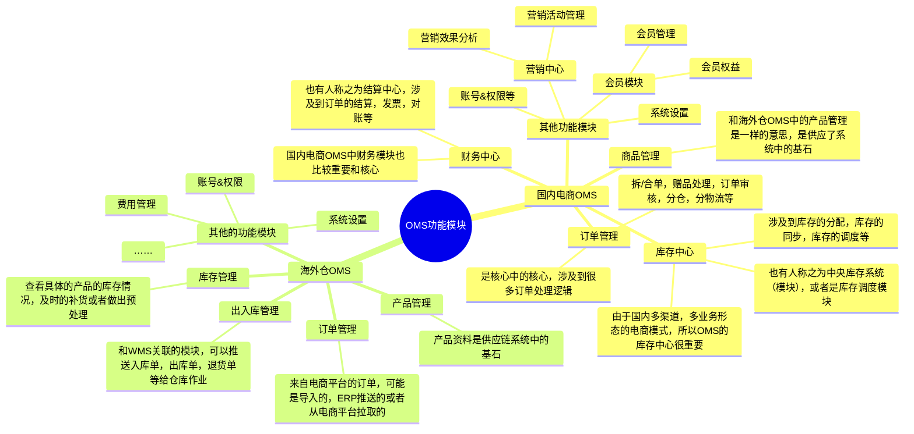
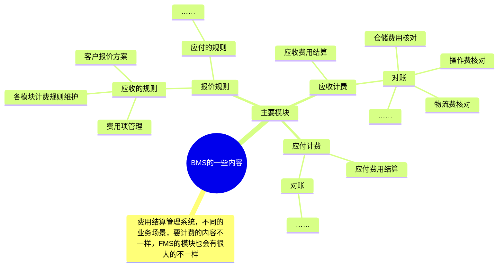

## 前言

前面的课程我们花了很多的时间来讲解海外仓WMS的业务，但是其实海外仓系统中除了WMS之外，还有其他的一些系统也很重要，所以本节课我们就基于对WMS的熟悉，来看看其他的关联的系统是长什么样的，它们的作用是干嘛的。

本节课会跟大家大概介绍一下XL的OMS和OMP这两个系统，在介绍OMP的时候，我顺带也会补充聊到TMS和BMS相关的内容，让大家对OTWB有一个更加深入的了解。

本课的开课时间是`**2024/07/07（周日）晚上8:30**`，开课的方式是使用腾讯会议，所以请大家提前准备好相应的软件，会议链接如下：

> 维他命 邀请您参加腾讯会议
> 
> 会议主题：课程17（直播课）：海外仓OMS&OMP的业务介绍和系统拆解
> 
> 会议时间：2024/07/14 20:30-22:30 (GMT+08:00) 中国标准时间 - 北京
> 
> 点击链接入会，或添加至会议列表：
> 
> [https://meeting.tencent.com/dm/nYGCbqZhCOk3](https://meeting.tencent.com/dm/nYGCbqZhCOk3)
> 
> #腾讯会议：182-188-122
> 
> 复制该信息，打开手机腾讯会议即可参与

## 课件详细内容

本节课的内容大概会分成4个部分：

1.  OMS的核心业务流程和场景的讲解；
2.  OMP的核心业务流程和场景的讲解
3.  OMP中的TMS内容讲解；
4.  OMP中的BMS内容讲解；

### Part1 OMS的核心业务流程和场景的讲解

1.  什么是OMS？

> 订单管理系统（OMS，Order Management System）即处理订单的系统，主要管理订单的输入，处理，输出，并跟踪整个系统的每一个订单跟踪，通过对客户下达的订单进行管理及跟踪，动态掌握订单的进展和完成情况，提升物流过程中的作业效率，从而节省运作时间和作业成本，提高物流企业的市场竞争力。OMS衔接着商品中心、WMS、促销系统、物流系统等，是电子商务的基础模块。
> 
> 由于“订单”这个词比较广泛，所以对应的OMS的定义也比较广泛，除了常见的电商中的订单，外卖，酒店，虚拟服务，出行，物流等领域都有订单，也会有对应的OMS。
> 
> 本文提到的OMS指的是WMS的客户端，也有称之为“商家工作台”或者“商家中心”。

2.  OMS的作用是什么？谁使用它？

> 对于仓储系统领域OTWB中的OMS，它的用户一般是某些电商卖家/零售商的仓储物流部的人员，因为他们需要登录到仓储服务商的客户端中，去查看仓库的作业情况，去查看使用仓库的一些费用和报表数据等。
> 
> 站在仓储服务商的视角来看，WMS的他们自己内部的系统，而OMS则是开放给他的客户所使用的系统，而他的客户往往就是电商卖家，或者一些零售商，批发商等。

3.  国内电商领域的OMS和文中提到的OMS有什么区别？

> 国内电商领域的OMS，是指专门用来处理电商业务相关的单据，尤其是电商的销售订单，这一类系统基本上和电商ERP是类似的。可以参考[商派OMS](https://www.shopex.cn/solution/brand_intellect)，[巨益OMS](https://www.greatonce.com/)，[伯俊OMS](https://www.burgeon.cn/)，[百胜OMS](https://www.baison.com.cn/)等。
> 
> 文中提到的OMS是指WMS的客户端，主要是用来承上启下的。承上是指承接上游ERP或者客户自研系统的单据推送，而启下则是将相关的单据推送到WMS中去作业生产。可以参考[易仓OMS](https://www.eccang.com/wms.html)，[谷仓OMS](https://oms.goodcang.com/login)，[4PX OMS](https://b.4px.com/dist/)，[Shipout WMS](https://support.wms.shipout.com/docs/support/user-manual/shipout-wms-user-guide/)等。

#### 1.1 业务流程图（关系梳理图）

| 列 1 | 列 2 |
| --- | --- |
| _海外仓OMS&amp;OMP(含TMS_BMS)的业务介绍-1.png)  _海外仓OMS&amp;OMP(含TMS_BMS)的业务介绍-2.png) | _海外仓OMS&amp;OMP(含TMS_BMS)的业务介绍-3.png) |

| 列 1 | 列 2 |
| --- | --- |
| _海外仓OMS&amp;OMP(含TMS_BMS)的业务介绍-4.png) | _海外仓OMS&amp;OMP(含TMS_BMS)的业务介绍-5.png) |

| 列 1 | 列 2 |
| --- | --- |
| _海外仓OMS&amp;OMP(含TMS_BMS)的业务介绍-6.png) | _海外仓OMS&amp;OMP(含TMS_BMS)的业务介绍-7.png) |

  

_海外仓OMS&amp;OMP(含TMS_BMS)的业务介绍-8.png)

_海外仓OMS&amp;OMP(含TMS_BMS)的业务介绍-9.png)

#### 1.2 功能模块说明

_海外仓OMS&amp;OMP(含TMS_BMS)的业务介绍-白板-1.svg)

### Part2 OMP的核心业务流程和场景的讲解

1.  什么是OMP？

> OMP（Operation Management Platform）叫作运营管理平台，是一种通用类的系统，其实就是综合类的后台管理系统。对于SaaS WMS来说，由于存在一些基础数据和运营类的数据的管理，这些数据可能和多个系统都有关联，如果分别散落在不同的系统中，用起来就比较麻烦。
> 
> 所以就搭建了一个OMP系统，将这些数据都汇总在了一起，集中化的管理。

2.  OMP的作用是什么？谁使用它

> OMP是综合类的后台管理系统，使用它的用户是**SaaS的租户**。当某个租户购买了SaaS WMS的服务之后，我只需要给它开一个OMP的账号权限即可，然后租户可以在OMP上创建仓库，登录WMS；创建用户，登录OMS。
> 
> _海外仓OMS&amp;OMP(含TMS_BMS)的业务介绍-10.png)

3.  OMP和其他系统的交互流程是怎么样的？

> OMP->OMS
> 
> OMP->WMS
> 
> OMP包含了运营管理的内容，还有BMS和LMS（TMS）的内容都整合在了一起
> 
> _海外仓OMS&amp;OMP(含TMS_BMS)的业务介绍-11.png)

#### 2.1 业务流程图（关系梳理图）

基础数据的分发流程

_海外仓OMS&amp;OMP(含TMS_BMS)的业务介绍-12.png)

> 客户管理（与OMS的联动）
> 
> OMP创建客户资料，为每一个客户初始化一套新的OMS管理员账号体系。

_海外仓OMS&amp;OMP(含TMS_BMS)的业务介绍-13.png)

> 仓库管理（与WMS的联动）
> 
> OMP创建仓库资料，为WMS生成一个新的仓库，可以在WMS的右上角切换不同的仓库使用。

_海外仓OMS&amp;OMP(含TMS_BMS)的业务介绍-14.png)

#### 2.2 功能模块说明

_海外仓OMS&amp;OMP(含TMS_BMS)的业务介绍-15.png)

### Part3 OMP中的TMS内容讲解

1.  什么是跨境TMS/LMS？

> 跨境的TMS或者LMS一般就是指物流相关的系统，包含头程物流和尾程物流这两个方面。头程方面信息化系统做得不太好，不够成熟，所以一般是对尾程方面的物流进行信息化的管理较多。例如尾程物流的渠道对接，渠道下单，渠道轨迹跟踪，渠道规则管理等。

2.  国内的TMS有哪些功能模块？

> 国内的TMS和跨境的TMS不太一样，为了区别这个内容我一般都是把跨境的TMS称之为“LMS，也就是Logistics Management System”。国内的TMS一般是指车辆运输管理系统，主要有运单管理，线路规划，运输调度，运输监控等。

3.  OTWB和OTB的区别

> 一般来说，国内的TMS中不太涉及具体的仓库管理方面的内容，但是会有库存相关的内容，只是偏宏观层的数据统计和展示。所以对于TMS来说，业务系统关系是这样的：OMS->TMS->BMS。  
>   
> 而对于仓库管理系统（WMS）来说，出库履约的场景下一般都会用到物流/快递相关的内容，所以一般会有TMS或者LMS，所以OTWB其实是针对仓储服务场景来设计的。业务系统的关系是这样的：OMS->LMS->WMS->BMS或者OMS->WMS->LMS->BMS。
> 
> ​  
> 
> **总结一下：****OTWB，是以WMS为主，为核心；OTB，是以TMS为主，为核心。**

| 列 1 | 列 2 |
| --- | --- |
| _海外仓OMS&amp;OMP(含TMS_BMS)的业务介绍-16.png) | _海外仓OMS&amp;OMP(含TMS_BMS)的业务介绍-17.png) |

_海外仓OMS&amp;OMP(含TMS_BMS)的业务介绍-18.png)

| 列 1 | 列 2 |
| --- | --- |
| _海外仓OMS&amp;OMP(含TMS_BMS)的业务介绍-19.png) | _海外仓OMS&amp;OMP(含TMS_BMS)的业务介绍-20.png) |

_海外仓OMS&amp;OMP(含TMS_BMS)的业务介绍-21.png)

_海外仓OMS&amp;OMP(含TMS_BMS)的业务介绍-22.png)

跨境TMS是属于底层支撑类系统，在ERP中一般都是以“**物流管理**”模块单独存在的，对于仓储类系统来说，由于业内一直有“OTWB”的说法，所以有一些公司会单独抽出一个系统来承载TMS的一些内容。

从我过往的经验来看，如果对物流这一块没有太复杂的业务需要，那么可以考虑做成一个单独的模块放在运营管理类的系统中即可，例如我之前就是将TMS和BMS的内容放在了OMP（运营管理系统）中，这样更加简洁清爽，也能满足相应的业务需求。

TMS包含的功能不算很多，大概可以分成四类：

1.  物流商对接和物流渠道管理，TMS的很多工作都是在对接物流商，对接物流商，需要一个一个接口文档去看，然后对接、调试、正式上线，然后再创建对应的物流渠道，才可以交付给业务系统去使用；
2.  物流轨迹的跟踪，TMS需要对接物流商官方的轨迹或者通过第三方工具去抓取轨迹，然后对轨迹的内容进行分析，判断物流是否妥投，是否退货，准确率和及时率等情况；
3.  物流的数据分析，每天都会有多个物流订单生成，会产生大量的数据，TMS需要从多个维度去分析这些物流订单的数据，同时也要结合物流商的一些考核指标，对物流商进行评分考核；
4.  物流的相关规则配置，国家物流中涉及到多个国家，多种语言，多种物流规则，所以TMS需要支持配置和维护一些复杂的规则，减轻人工处理异常的频率，提升出库单获取物流面单的成功率；

### Part4 OMP中的BMS内容讲解

1.  什么是BMS？

> BMS是费用管理系统，一般是指计费管理系统，而这个**计费主要是针对仓储、物流来计费的，而不是电商订单的费用**。所以，一般有WMS或者有TMS的场景下，就会有BMS，因为需要对仓储和物流相关的服务进行计费。  
> ERP一般是没有BMS这种说法的。

2.  BMS一般是怎么存在的？

> 用OTWB的视角来看，BMS一般是单独设计一个系统，但是由于相关的系统实在是太多了，很多公司会将一些系统整合在一个综合系统中，将BMS弱化为相应的功能菜单或者功能模块。所以，虽然是叫作BMS，但是也不一定是说一定要独立一个系统。
> 
> _海外仓OMS&amp;OMP(含TMS_BMS)的业务介绍-23.png)

3.  BMS的核心公式是什么？

> BMS叫作结算管理系统，核心其实就是计费。而计费的核心公式就是下面这个。
> 
> _海外仓OMS&amp;OMP(含TMS_BMS)的业务介绍-24.png)
> 
> 我们想要算出费用，那么需要先知道计费的数据什么，这些数据一般是业务系统提供的，所以BMS需要和其他业务系统打通，从其他系统中抽取数据。拿到了数据之后，还需要知道应该怎么计算，这个就是计费公式的配置，公式的配置是需要人工去设置规则的。
> 
> 例如说：我们乘坐出租车的时候，要计算最终的车费。我们需要知道一共行驶了多少公里（业务数据），然后我们要知道起步价是多少，每公里的单价是多少（这些就是公式），最后才能算出最终的费用。

  

_海外仓OMS&amp;OMP(含TMS_BMS)的业务介绍-白板-2.svg)

_海外仓OMS&amp;OMP(含TMS_BMS)的业务介绍-25.png)

## 课后作业

> 体验一下OMP的一些操作，例如创建客户，然后登录OMS。创建仓库，然后登录WMS。创建物流，然后在OMS使用……

## **课程答疑或补充知识**

### 答疑

1.  对OMS和OMP的一些业务和细节不太熟悉，可以看哪些补充知识？

> 这一块的知识我在电子书《📚 跨境供应链：海外仓OTWB项目实战》中有详细的介绍，可以点击此链接查看。
> 
> [3.1 什么是OMS？](https://www.yuque.com/jiaowovitamin/dgugdp/stb6lbgzzg1acfw2)  
> [7.1 什么是OMP？](https://www.yuque.com/jiaowovitamin/dgugdp/ch3max3ab04ygkat)

2.  海外仓OMS是不是很简单？

> 相对来说，海外仓OMS确实比较简单，因为它就是一个WMS的客户端，是为后面的WMS接单而设计的。用户使用OMS，然后推送订单给WMS，OMS就是WMS的上游，OMS是客户端，WMS就是对应的服务/管理端。