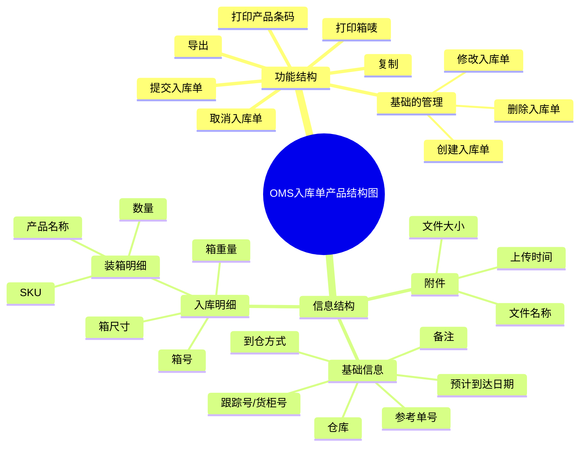
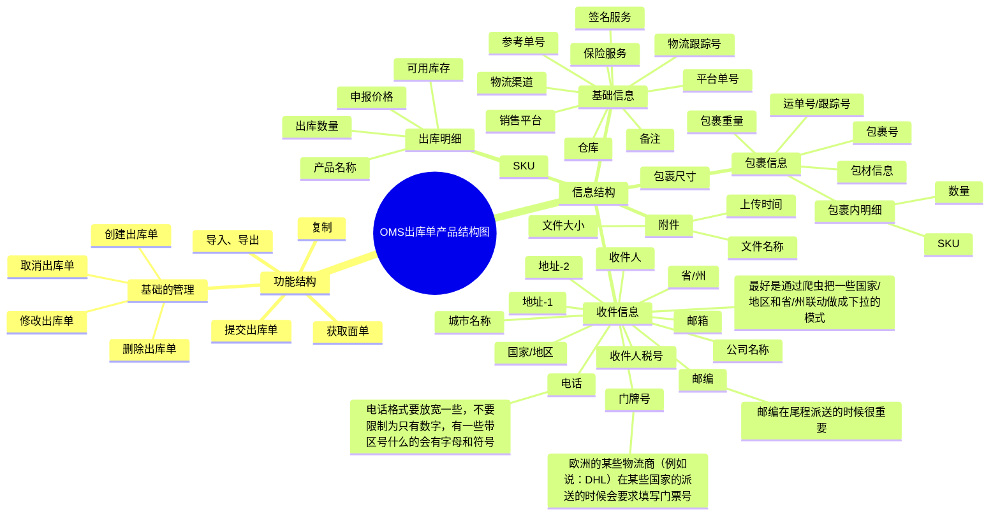

## 前言

前面的课程我们讲了WMS，销售订单，通过这些课程的积累，我们对仓储业务，对订单业务，有了一个更深刻的认知。上一节课讲了OMP和OMS，让大家知道了什么是OTWB，同时也知道了这些系统之间的数据交互关系是怎么样的。

在OTWB中，OMS和WMS的关系是最密切的，也是最重要的。客户使用OMS，然后将单据和指令推送给WMS，然后仓库的人员使用WMS完成了一系列的任务操作之后，再将数据反馈给OMS中，用户可以通过OMS在线查看到最新的单据动态。

所以，本节课我们会更加重点地去讲解OMS和WMS之间的关系，掌握OMS有哪些功能模块，然后这些功能模块和WMS是怎么联动的，也可以知道OMS自身有什么难点或者关键业务逻辑有哪些等。

> 本节课为录播课程，没有腾讯会议邀请链接，可以先查看下方的课程文稿，然后再学习课程视频，最后登录对应的进销存系统进行深度的体验学习。

## 课件详细内容

本节课的内容大概会分成5个部分：

1.  OMS的业务知识介绍
2.  OMS基础资料的产品设计；
3.  OMS入库单的产品设计；
4.  OMS订单和出库单的产品设计；
5.  OMS库存的产品设计；

### Part1 OMS的业务知识介绍

1.  海外仓的OMS给谁用？

> 海外仓的OMS是给海外仓服务商的客户使用的，这些客户用了海外仓的仓库服务，然后需要一个系统推送单据和一些指令给仓库，所以就有了这个系统。相当于OMS是海外仓WMS的客户端，而WMS就是海外仓的服务端。
> 
> 注意：大多数提供服务的业务场景下，系统都会有客户端和服务端。例如说，打车，订酒店，点外卖，寄快递，购买下单，充值话费，仓储物流等。

2.  海外仓WMS必须要有OMS吗？

> 一般的订单数据流向是：平台->ERP->OMS->WMS，然后就会有朋友问，能不能跳过OMS层，直接从ERP到WMS？
> 
> 其实是可以的，WMS可以直接对接外部的ERP，然后让外部的ERP推送单据到WMS中，不过这种玩法一般都是国内单独卖WMS的服务商搞出来的，例如富勒。而海外仓WMS，一般都是会配套一个自己的OMS，因为有一些外部ERP没有对接，客户需要手动录入单据的时候就没有办法了，而且没有客户端OMS，那么海外仓的客户就只能使用自己的ERP了，如果客户没有ERP那业务就跑不起来了。

3.  海外仓OMS的订单管理模块必须要有吗？

> 上节课聊到国内电商OMS和跨境电商OMS的一些区别，其中国内电商OMS的订单管理模块是核心，因为系统叫做OMS，那么自然就是要管理订单了。
> 
> _海外仓OMS入库、出库和库存等产品设计-1.png)
> 
> 那么海外仓OMS的订单管理模块是必须的吗？核心也是要处理订单吗？
> 
> 其实不是的，这就是海外仓OMS一些特殊的点，其实海外仓OMS严格来说不能算是OMS，只是一个WMS的客户端而已，也可以称之为商家平台或者是商家中心，它承担了很多功能和业务场景，反而订单管理这一块做得比较弱。
> 
> 真正的跨境OMS应该是跨境ERP中的订单管理模块，它才和国内电商OMS的订单中心的内容很相似，都有拉单，订单审核，拆合单，规则等。
> 
> _海外仓OMS入库、出库和库存等产品设计-2.png)
> 
> _海外仓OMS入库、出库和库存等产品设计-3.png)

4.  海外仓OMS的库存和WMS的库存是两套吗？

> 海外仓OMS的用户是电商卖家，而WMS的用户是海外仓的工作人员。对于电商卖家来说，它可能会同时使用多个仓库，例如美东仓，美西仓，英国仓等，但是对于海外仓的工作人员来说，每个仓库都是实际存在的，货物都是真实的放在仓库中的。所以OMS看到的库存是多个实际仓库统计之后汇总的库存，而WMS看到的库存是实际的库存。
> 
> OMS和WMS的库存是两套，如果有ERP的话，ERP和OMS和WMS都是独立的一套库存体系，三者互相有数据关系，但是不是同一套。而且ERP，OMS和WMS管理的库存维度和粒度也不一样，所以是分开设计的。
> 
> _海外仓OMS入库、出库和库存等产品设计-4.png)
> 
> 注意：大多数情况下，ERP、OMS、WMS的库存是两套，但是如果是自营海外仓，内部自用的业务场景下，可以直接通过接口调用下游的库存。一般来说WMS的库存肯定是有的，OMS和ERP都可以通过接口来调用WMS的库存，具体的实现方式还是要看具体的业务场景。

5.  海外仓OMS的产品方案（产品工作）难度在哪里？

> 海外仓OMS的业务场景和功能相对国内电商的OMS来说算是比较简单，然后就会有朋友有疑问，如果自己来负责这一块的业务，那么难度和挑战的点会在哪里？长期做这个会不会让自己的产品能力退后等？我个人认为难度在这么几个地方：
> 
> 1.  OMS要对接多个上游系统，最常见的就是ERP和平台，这些比较费时间，需要掌握OpenAPI平台的搭建，同时兼容多家上游系统的业务；
> 2.  OMS和TMS的联动细节比较多，海外仓OMS一般都支持前置预报（在OMS获取电子面单），跨境物流的电子面单获取失败的几率很大，因为账号，费用，还有参数等报错是很常见的事情；
> 3.  OMS的库存处理细节比较多，虽然OMS管理的库存维度比较粗，但是由于不同的订单来源，不同的上下游，所以库存处理的逻辑比较多。有多个节点锁定库存，释放库存；
> 4.  OMS处于中间系统，所以要考虑很多上下游兼容的问题，例如条码问题，字段问题，还有一些业务逻辑的处理也受限于上下游系统的支持，对产品架构设计还有抽象能力的要求也比较高；
> 
> 综合来说，海外仓OMS适合初中级的朋友，是一个很好的练手的项目，既可以掌握广度和深度的业务知识，也可以锻炼自己分析业务需求，探索崭新知识的能力。

### Part2 OMS基础资料的产品设计

> 供应链领域有一个“三流”的说法，分别是“物流”，“资金流”，“信息流”。其中“物流”是指物品的流动，也可以理解为货物的流动，货物只有流动起来了才会产生交易，才会产生价值。
> 
> 货物是供应链管理中的血液，没有货物那么供应链也就没办法串起来了，于是乎，在很多供应链系统都会有相关的管理模块，用来管理这些货物的基础信息，以及一些业务配置等。有些称之为“货品管理”，有些称之为“商品管理”，还有一些称之为“产品管理”，虽然名词不一样，但是表示的意思都是一样的。**​**

| 列 1 | 列 2 |
| --- | --- |
| _海外仓OMS入库、出库和库存等产品设计-5.png) | OMS/ERP/进销存系统中的商品资料管理或者产品资料管理都是类似的，如果对这一块不太确定的可以直接借鉴竞品的方案设计即可，当然前提是要知道每个字段大概的用途是什么？  基础资料：大多数信息是必填的，用来定义描述货品，其中要注意条码的一些内容，因为OMS要和WMS交互，所以条码信息要注意不要太长，不要有特殊字符。  报关资料：跨境业务专属的，如果不做跨境业务，那么这一部分就没必要。  其他信息：一些补充信息，一般来说随着业务的变化而变化即可，逐步完善就好了。 |

​  

_海外仓OMS入库、出库和库存等产品设计-6.png)

| 列 1 | 列 2 | 列 3 |
| --- | --- | --- |
| _海外仓OMS入库、出库和库存等产品设计-7.png) | _海外仓OMS入库、出库和库存等产品设计-8.png) | _海外仓OMS入库、出库和库存等产品设计-9.png) |

| 列 1 | 列 2 | 列 3 |
| --- | --- | --- |
| _海外仓OMS入库、出库和库存等产品设计-10.png) | _海外仓OMS入库、出库和库存等产品设计-11.png) | _海外仓OMS入库、出库和库存等产品设计-12.png) |

[链接](https://www.yuque.com/jiaowovitamin/dgugdp/la886ucbplm1cuw4)

### Part3 OMS入库单的产品设计

#### 3.1 流程图、ER图、状态机图等

对于海外仓OMS来说，创建入库单的时候不是直接以产品明细为粒度管理，而是会在产品的基础上加一个箱子的维度。将产品装在箱子中，然后每个箱子贴上对应的箱唛，当货物送到海外仓之后，可以通过外箱的箱唛快速定位入库单和对应的箱子中的产品明细，亚马逊的FBA仓库是这样玩的，目前主流的海外仓也是这样玩的，这点和国内的仓储入库要求是不一样的。

_海外仓OMS入库、出库和库存等产品设计-13.png)

当创建好了入库单之后，需要打印出对应的箱唛标签，然后贴在对应的箱子上，需要注意下箱唛标签和实物的对应关系，所以在贴码的时候要注意核对，别搞错了。这一部分比较费时间和人力，所以一般都是会在国内仓库去提前做好，目的就是为了降低海外仓的操作成本。

| 列 1 | 列 2 |
| --- | --- |
| _海外仓OMS入库、出库和库存等产品设计-14.jpeg) | _海外仓OMS入库、出库和库存等产品设计-15.jpeg) |

#### _海外仓OMS入库、出库和库存等产品设计-16.png)​

_海外仓OMS入库、出库和库存等产品设计-17.png)

_海外仓OMS入库、出库和库存等产品设计-18.png)

#### 3.2 产品结构图

_海外仓OMS入库、出库和库存等产品设计-白板-1.svg)

#### 3.3 产品原型图

[http://43.138.173.42/F3H7BU/#id=owel5p](http://43.138.173.42/F3H7BU/#id=owel5p)

[链接](https://www.yuque.com/jiaowovitamin/dgugdp/bqt11wserc15pr0t)

### Part4 OMS订单和出库单的产品设计

#### 4.1 流程图、ER图、状态机图等

无论是国内电商OMS还是跨境海外仓的OMS，一般来说大家都会特别刻意地去区分“订单”和“出库单”，当然有一些系统也将“出库单”定义为“发货单”。

**总之，“订单”和“出库单/发货单”是两个不同的单据，是一种解耦的做法，也是一种主流的做法。**订单和出库单的实体关系应该是1对1或者1对多的，一个平台订单可以拆分成1个或者多个出库单，拆分可能是通过仓库，通过物流或者是通过商品结构等原因来拆分，具体示意图如下所示：

_海外仓OMS入库、出库和库存等产品设计-19.png)

_海外仓OMS入库、出库和库存等产品设计-20.png)

_海外仓OMS入库、出库和库存等产品设计-21.png)

_海外仓OMS入库、出库和库存等产品设计-22.png)_海外仓OMS入库、出库和库存等产品设计-23.png)

对于海外仓的物流面单获取来说，一般会有两种做法，一个叫作“前置预报”，一个叫作“后置预报”。

前置预报就是在OMS层去向物流系统（LMS/TMS）预报物流面单；后置预报就是在WMS层去向物流系统（LMS/TMS）预报物流面单。

_海外仓OMS入库、出库和库存等产品设计-24.png)

_海外仓OMS入库、出库和库存等产品设计-25.png)

> 对于供应链系统中的出库业务，产品经理要养成敏感度，但凡涉及到出库一定是和库存有关系，那么就一定要关注库存的锁定、释放、扣减等方面的内容， 可以输出一个库存变化表来阐述这一块的逻辑。

_海外仓OMS入库、出库和库存等产品设计-26.png)

_海外仓OMS入库、出库和库存等产品设计-27.png)

#### 4.2 产品结构图

_海外仓OMS入库、出库和库存等产品设计-白板-2.svg)

#### 4.3 产品原型图

[http://43.138.173.42/F3H7BU/#id=pvv2bv](http://43.138.173.42/F3H7BU/#id=pvv2bv)

[链接](https://www.yuque.com/jiaowovitamin/dgugdp/etmn7esi97c233n1)

### Part5 OMS库存的产品设计

#### 5.1 OMS的库存

OMS的库存设计相对WMS来说就简单很多了，如果只是简单的业务场景之下，那么OMS的库存就只需要有SKU维度即可。

_海外仓OMS入库、出库和库存等产品设计-28.png)

考虑到有一些场景下，OMS会记录也一些**逻辑批次**用来计算库龄，所以也会有海外仓OMS去记录**SKU+批次维度**的库存。这里的批次不完全等于WMS的批次，只是一个逻辑批次，一般是以库存增加的日期作为批次号，所以通常会用WMS回传库存的时间（日期）去做批次的划分。

_海外仓OMS入库、出库和库存等产品设计-29.png)

#### 5.2 OMS的库龄

库龄是什么？

> 库龄即**库存账龄**。用以衡量一定时期内存货资产的周转速度，是反映企业的供应链的整体效率的绩效指标之一，而且很多企业都把它作为整体经营业绩的考核指标之一。
> 
> 通俗的理解：**货物存放的天数或者时长**。

用统计的时间减去入库时间，就是可以得到当前的库龄，所以我们要知道：

1.  某个库存什么时候入库的？统计时间是什么？
2.  库存的区分粒度是什么？单SKU，还是SKU+逻辑批次，还是SKU+上架日期？

_海外仓OMS入库、出库和库存等产品设计-30.png)

库龄统计，可以在OMS端，也可以在WMS端，如果是仅仅为了**计算仓租**，那么建议**放在OMS端会比较好**，适用于梯度仓租计费的仓库。

因为如果库龄的统计是放在WMS端，WMS是按批次号去计算库龄，那么当仓库不遵守先进先出的逻辑时，会导致库龄统计的不准确或者不能满足客户精准算仓库的要求。如果WMS不依赖批次号而且通过上架日期去计算库龄，则WMS的库存统计中又要增加一层上架日期的单独记录，整体体验不太好。

如果把库龄的统计放在OMS中，则OMS可以通过自己记录一套逻辑批次或者上架日期，然后去统计相关的批次对应的库龄天数是什么。

_海外仓OMS入库、出库和库存等产品设计-31.png)

[链接](https://www.yuque.com/jiaowovitamin/dgugdp/asmdklrn1zc7y504)[链接](https://www.yuque.com/jiaowovitamin/dgugdp/tt1dnwwazsgrgd04)

## 课后作业

> 完成OMS入库或者出库模块产品设计，输出对应的业务流程，产品结构图和原型图。由于OMS的内容和WMS有很多是有联动的，所以在设计OMS的一些业务模块的时候，可以和之前的WMS作业联动一下。

## **课程答疑或补充知识**

### 答疑

1.  对OMS的一些业务和细节不太熟悉，可以看哪些补充知识？

> 这一块的知识我在电子书《📚 跨境供应链：海外仓OTWB项目实战》中有详细的介绍，可以点击此链接查看。
> 
> [3.2 海外仓OMS的货品管理](https://www.yuque.com/jiaowovitamin/dgugdp/la886ucbplm1cuw4)
> 
> [3.3 海外仓OMS的入库功能模块](https://www.yuque.com/jiaowovitamin/dgugdp/bqt11wserc15pr0t)
> 
> [3.4 海外仓OMS的出库功能模块](https://www.yuque.com/jiaowovitamin/dgugdp/etmn7esi97c233n1)
> 
> [3.5 海外仓OMS的库存模块](https://www.yuque.com/jiaowovitamin/dgugdp/asmdklrn1zc7y504)

2.  想看看其他的OMS的界面，有哪些竞品？

> 相关的竞品建议可以看看魔方云仓和谷仓的OMS，在体验OMS的时候，要思考背后的WMS的是怎么衔接的，怎么操作和处理订单的。

### 补充知识

[TS.I7-谷仓仓储用户手册V7.1.pdf](https://www.yuque.com/attachments/yuque/0/2025/pdf/48385069/1738735828951-19a9a7d9-54bb-462c-a462-1d9699871470.pdf)