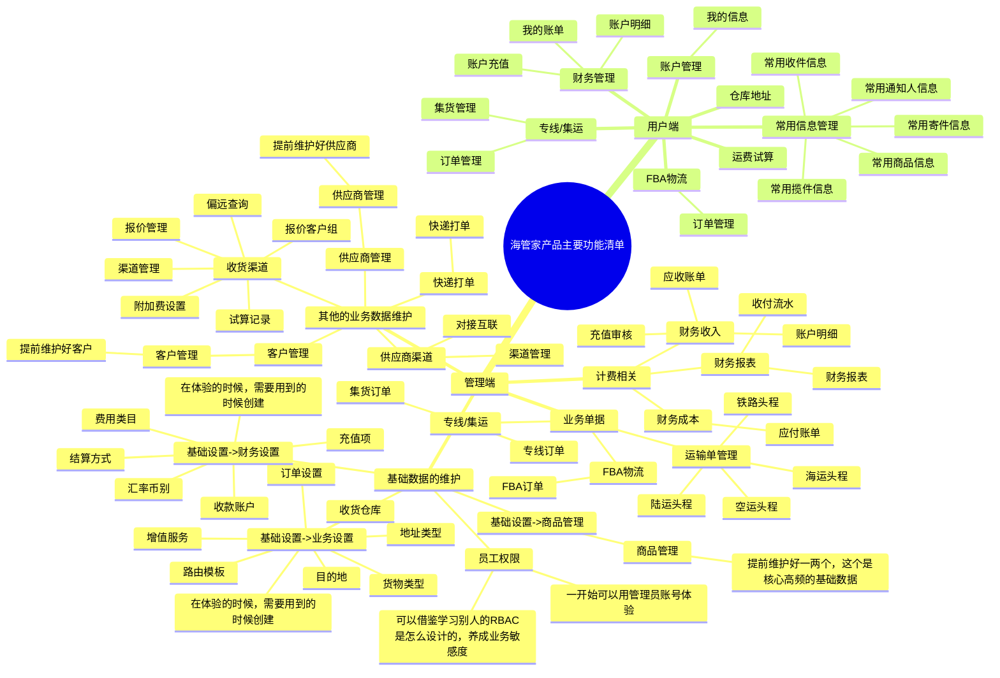

## 前言

前面的一系列课程我们讲解了海外仓的WMS，OMS，OMP等多个系统，其中WMS花了最多的时间和篇幅，其次是OMS，最后是OMP。OMP这个系统虽然篇幅很少，但是它也是非常重要的，刚好有一些学员反馈说这一块的内容没怎么听懂，希望能出一节课把这些知识点都串起来，所以就有了这一节课程。

我来给大家讲解一下SaaS WMS的交付实施和落地的流程，同时也借助这种初始化的过程来把之前学习的内容全部串联一遍。除了落地实施XLWMS之外，我还顺带讲解一下“海管家”这款产品的初始化使用，前者是以一个实施者的视角，后者则是以一个体验者的视角。

> 本节课为录播课程，没有腾讯会议邀请链接，可以先查看下方的课程文稿，然后再学习课程视频，最后完成相关的课后作业即可。

## 课件详细内容

本节课的内容大概会分成5个部分：

1.  OMP基础数据的初始化配置；
2.  WMS的初始化配置；
3.  OMS的初始化配置；
4.  海管家的产品体验&初始化的讲解；
5.  SaaS WMS的业务和产品架构总结；

### Part1 OMP基础数据的初始化配置

#### 1.1 OMP的介绍

OMP是综合类的后台管理系统，使用它的用户是**SaaS的租户**。当某个租户购买了SaaS WMS的服务之后，我只需要给它开一个OMP的账号权限即可。OMP虽然是一个单独的系统，但是其中包含了三个部分，分别是：

1.  基础数据
2.  BMS
3.  LMS

这里将LMS和BMS的内容作为功能模块一起放在了OMP中，是因为如果按OTWB的系统架构设计方式，会让用户要使用多个系统，无形中就提升了认知和使用的门槛，所以整合在一个模块中会更加简洁高效一些，同时也能用户快速上手，集中化管理一些业务数据。

_海外仓WMS&amp;海管家的实施和初始化落地拆解-1.png)

_海外仓WMS&amp;海管家的实施和初始化落地拆解-2.png)

#### 1.2 OMP相关的初始化流程

OMP的初始化流程，大体上可以分成这么几块：

1.  维护仓库的信息，确认有多少个仓库，仓库的编码是什么等；
2.  维护客户的信息，明确有多少个客户，客户的编码是什么，因为有一些服务都是要和客户挂钩的；
3.  维护物流的信息，绑定相关的物流商，确保仓库可以使用某些物流；
4.  维护报价相关的内容，明确使用某个仓库和物流的费用是怎么样的；
5.  维护账号和权限的内容等，这样可以确保租户内部的业务人员使用的时候可以用不同的账号和角色；

##### 1）初始化仓库

海外仓服务商会经营多个仓库，所以当拿到了OMP的主账号之后，第一步要做的就是先维护好自己的仓库信息，所以就需要先在OMP上去创建相关的仓库。 仓库创建的同时，系统会将这些仓库代码等信息提交给WMS，后续登录WMS之后就可以在右上角下拉切换选中新创建好的仓库。

_海外仓WMS&amp;海管家的实施和初始化落地拆解-3.png)

##### 2）初始化客户

海外仓服务商除了会有多个仓库之外，也会有多个客户，这里的客户是指使用海外仓仓储服务的客户，一般就是跨境电商的卖家。一个仓库会有多个卖家，一个卖家也会使用多个仓库，所以仓库和客户之间的关系是多对多的关系。创建客户的时候，也会将客户的一些系统推送给OMS，初始化一套专属于该客户的账号和密码等，然后客户就可以拿到这些信息登录OMS中去使用。

_海外仓WMS&amp;海管家的实施和初始化落地拆解-4.png)

在创建客户的时候，也可以同时配置该客户可以使用的仓库信息，因为客户需要关联仓库才可以使用，所以第一步需要做的是初始化仓库，然后第二步就是初始化客户。

_海外仓WMS&amp;海管家的实施和初始化落地拆解-5.png)

##### 3）配置物流

创建好了仓库和客户之后，客户可以推送入库单给海外仓去收货、上架，但是如果要推送出库单给仓库去拣货，打包发货等，那么就还需要在OMP中先配置好物流的信息。

首先，海外仓能提供什么物流方式，其次，这些物流方式是哪些客户可以使用。所以第一步就是在OMP中授权物流商，输入自己的物流账号和密码等，这一步的前提是这些SaaS服务公司提前完成好了API的对接。授权了物流商之后就是创建或者激活物流服务，创建（映射）为本地的一个物流渠道，然后对物流渠道进行一些关联性数据的配置，例如物流渠道是在什么仓库下使用，给什么客户使用，发货地址是什么，有什么渠道规则要维护的等，这些具体细节可以看“第五章：TMS业务介绍&产品设计方案”，里面有详细的介绍。

_海外仓WMS&amp;海管家的实施和初始化落地拆解-6.png)

##### 4）配置报价

完成了仓库，客户，物流等基础信息的维护之后，接下来就是要配置报价相关的内容了。如果海外仓并不打算使用系统对它的用户（电商卖家）计算费用，例如说是合作共建仓库的模式或者是内部自用的模式，那么就可以省略这个部分。如果是需要对外经营服务的，那么就需要在这个环节去配置对应的价格，然后后续系统才能自动完成相关费用的计算。这一块的内容可以看“第六章：BMS业务介绍&产品设计方案”，在此就不过多介绍了。

_海外仓WMS&amp;海管家的实施和初始化落地拆解-7.png)

##### 5）维护账号和权限的内容

OMP的账号和权限相关的内容和上面的初始化内容没有必然的关系，这个属于B端系统中最常见的基础功能之一。在设计OMP的时候，考虑到WMS只用来操作和执行，所以一些管理类的功能也放在OMP中，所以在OMP的账号和权限管理模块，除了可以管理OMP的账号和权限，也可以管理WMS的。

如果自己的业务有要求希望WMS可以单独有自己的账号和权限体系，那么也可以将WMS的账号和权限内容单独抽出来放在WMS中，不一定非要参考放在OMP中。

### Part2 WMS的初始化配置

当SaaS租户在OMP创建好了仓库之后，有权限的用户就可以登录WMS进入到对应的仓库中去了。

> 仓库管理（与WMS的联动）
> 
> OMP创建仓库资料，为WMS生成一个新的仓库，可以在WMS的右上角切换不同的仓库使用。

_海外仓WMS&amp;海管家的实施和初始化落地拆解-8.png)

进入了WMS之后，需要完成一些简单的初始化配置，这里主要包含有：

| 列 1 | 列 2 |
| --- | --- |
| 1.  维护库区（必须）  2.  维护库位（必须）  3.  维护容器（可选）  4.  维护包材（可选）  5.  维护播种墙（可选） | _海外仓WMS&amp;海管家的实施和初始化落地拆解-9.png) |

​  

### Part3 OMS的初始化配置

当SaaS租户在OMP创建好了客户之后，会默认初始化一个OMS的管理员账号和密码，然后使用这个账号和密码就可以登录到OMS。

> 客户管理（与OMS的联动）
> 
> OMP创建客户资料，为每一个客户初始化一套新的OMS管理员账号体系。

_海外仓WMS&amp;海管家的实施和初始化落地拆解-10.png)

登录了OMS之后，需要执行以下的初始化操作：

1.  配置OMS的账号和角色
2.  为OMS的账号充值，大多数海外仓都是使用预充值模式，要先充值才能开展业务
3.  创建产品资料，供应链系统中产品资料是最基础、最重要的一环，创建好了产品才能开展后续的工作

_海外仓WMS&amp;海管家的实施和初始化落地拆解-11.png)

### Part4 海管家的产品体验&初始化的讲解

#### 4.1 什么是海管家？

1.  海管家的介绍

> 苏州海管家物流科技有限公司（简称：海管家）成立于2015年，是货代自主可控的服务平台，打造了多款物流云系统和工具产品，为物流企业提供高效的操作流程服务。  
> 旗下的预配舱单发送系统，海外舱单发送系统、E-BOOKING 系统、港口业务风控推送系统、智能货代SAAS（货代企业操作系统）、全国货运车辆定位系统已实现国际物流信息化服务的全方位覆盖，客户涵盖物流、生产制造商、外贸等行业，服务客户数量达百万级，遍布全国各地。

2.  本次体验并讲解的产品是什么？

> 本次体验并讲解的产品是海管家的**跨境物流系统**，它适用于FBA、国际专线、集运小包等**跨境货代**企业，为中小跨境货代提供简单、高效的操作系统。
> 
> 地址为：[https://kj.hgj.com/official/home](https://kj.hgj.com/official/home)
> 
> 可以免费注册并体验，不过注册之后好像试用时间只有3天，3天后就需要联系销售去延长体验时间了。

3.  海管家的跨境物流系统，面向什么用户？大概的业务流程是怎么样的？

> 此套系统面向的租户主要是货代，货代使用的是海管家的管理端；而货代的客户，可能是一些同行（也是货代），也可能是一些跨境电商卖家，也可能是一些有跨境物流需求的用户，这些客户使用的是客户端。
> 
> 这里的管理端，类似于海外仓的OMP；而客户端，则类似于海外仓的OMS。
> 
> ​  
> 
> 海管家跨境物流系统主要支持3大跨境业务流程，FBA物流，国际专线，集运小包。
> 
> _海外仓WMS&amp;海管家的实施和初始化落地拆解-12.png)
> 
> _海外仓WMS&amp;海管家的实施和初始化落地拆解-13.png)
> 
> _海外仓WMS&amp;海管家的实施和初始化落地拆解-14.png)

#### 4.2 海管家的客户创建和管理

_海外仓WMS&amp;海管家的实施和初始化落地拆解-15.png)

_海外仓WMS&amp;海管家的实施和初始化落地拆解-16.png)

_海外仓WMS&amp;海管家的实施和初始化落地拆解-17.png)

#### 4.3 海管家的主要功能清单讲解

海管家的管理端，类似于我们所讲的“OMP+WMS”的概念，它是将业务的操作响应和信息的管理维护都放在一个系统中。

这里除了可以接收和处理客户的提交的业务单据之外（类似于操作执行的部分，**对标WMS**），还可以维护基础数据，客户信息，供应商信息，渠道报价，财务应收和应付等内容（类似于基础信息的维护，**对标OMP**）。

_海外仓WMS&amp;海管家的实施和初始化落地拆解-白板-1.svg)

#### 4.4 海管家一些优秀的产品设计

在体验海管家跨境物流这款产品的时候，我也发现了挺多它做的不错的地方，所以我把这些内容记录下来，希望对大家有所启发。同时也希望让大家意识到，B端产品经理的“见多识广”是很重要的，只有看过很多优秀的案例，自己才有可能成为做出优秀案例的那个产品经理。

| 序号 | 所属模块 | 亮点讲解 | 截图 |
| --- | --- | --- | --- |
| 1 | 客户管理->新增客户 | 在创建完成了客户之后，会弹窗提醒，然后有一个复制信息的按钮。而且还考虑到了电脑端和移动端，这样复制信息给客户，客户自己就知道怎么去登录和打开了。 | _海外仓WMS&amp;海管家的实施和初始化落地拆解-18.png) |
| 2 | 顶部信息栏 | 如果创建客户之后没有及时复制相关的信息就关闭了弹窗，也可以在顶部的右上角去查看客户端的访问地址信息 | _海外仓WMS&amp;海管家的实施和初始化落地拆解-19.png) |
| 3 | 收货渠道->新增渠道 | 在创建渠道的时候，有一些输入框的内容是有参考值的，例如说计泡系数一般就是5000或者6000，然后它用了一个输入框的组件，但是聚焦了之后会展示一个下拉选择的组件，可以手动输入，也可以直接选择想要的数据 | _海外仓WMS&amp;海管家的实施和初始化落地拆解-20.png) |
| 4 | 收货渠道->创建报价 | 在维护报价的分区的时候，添加分区和选择分区的交互都做得比较清晰系统，这个组件让新手学习成本降低了很多 | _海外仓WMS&amp;海管家的实施和初始化落地拆解-21.png) _海外仓WMS&amp;海管家的实施和初始化落地拆解-22.png) |
| 5 | 收货渠道->创建报价 | 在维护报价的分区梯度的时候，计费区间类型可能是按重量划分，可能是按密度划分，然后鼠标悬浮在Tips的图标上之后，会展示对应的报价图片，让用户更清晰的知道这两者是什么区别 | _海外仓WMS&amp;海管家的实施和初始化落地拆解-23.png) |
| 6 | 收货渠道->创建报价 | 在维护客户价时候，这个计费区间-分区价格表的展示也做得很通俗移动，这一块可能要做过物流计费的朋友才有更深的体感，怎么让用户更好地导入报价，查看报价，是一个挺难做的交互 | _海外仓WMS&amp;海管家的实施和初始化落地拆解-24.png) |
| 7 | FBA订单->查询组件 | 一个批量查询的输入框，由于支持换行符，空格，逗号，分号等分割，所以当在输入框输入这些符号的时候，会自动断行，然后在input组件展示的时候会用英文逗号分割 | _海外仓WMS&amp;海管家的实施和初始化落地拆解-25.png) |
| 8 | FBA订单->查询组件 | 由于这个地方会有很多字段的查询，理论上可以做很复杂的查询组件，但是这里用了一个最轻量的可配置化的设置来解决，也是一个讨巧的做法。 如果要做到很复杂，很全面的查询组件，那么可以参考金蝶的做法。但是复杂不一定代表好用，还是要量力而行，评估成本和收益 | _海外仓WMS&amp;海管家的实施和初始化落地拆解-26.png) _海外仓WMS&amp;海管家的实施和初始化落地拆解-27.png) |
| 9 | FBA订单->查询组件 | 在布局多个不同的查询组件的时候，很多时候都会被输入框的Label（说明文本）给影响，导致不够对齐， 不够美观，海管家用了一个隐藏Label的紧凑型布局方式，然后hover之后才能看到当前的筛选项是什么，这也是一个讨巧的做法 | _海外仓WMS&amp;海管家的实施和初始化落地拆解-28.png)_海外仓WMS&amp;海管家的实施和初始化落地拆解-29.png) |
| 10 | FBA订单->创建FBA订单 | 在填写一些输入表单的时候，有些字段可能没有提前维护，海管家基本上都会预留一个创建的入口，可以跳转/弹窗快速创建 而且创建完成了之后，点击原来的Tab页，数据还保留了，没有被刷新掉 | _海外仓WMS&amp;海管家的实施和初始化落地拆解-30.png) ​ |
| 11 | FBA订单->创建FBA订单 | 在提交表单的时候，如果有一些必填项没有填写，而且这些内容在屏幕的下方，会自动滚动到对应的位置，然后红字提示 | _海外仓WMS&amp;海管家的实施和初始化落地拆解-31.png) |
| 12 | FBA订单->查看FBA订单 | 双击数据行可以直接打开详情，有点小惊喜 | _海外仓WMS&amp;海管家的实施和初始化落地拆解-32.png) |
| 13 | FBA订单->导出FBA订单 | 导出数据到Excel的时候，可以选择字段，可以排序，也可以保存配置项，不过只有一个配置项，下一次会覆盖上一次的配置 | _海外仓WMS&amp;海管家的实施和初始化落地拆解-33.png) _海外仓WMS&amp;海管家的实施和初始化落地拆解-34.png) |
| 14 | 顶部信息栏 | 顶部信息栏，有一个全局搜索单号的功能，这个体验也不错 | _海外仓WMS&amp;海管家的实施和初始化落地拆解-35.png) |
| 15 | 员工权限->角色管理 | 角色管理的权限配置中，支持菜单权限，功能权限和数据权限的解耦，这个也是很多B端产品需要的基础功能 | _海外仓WMS&amp;海管家的实施和初始化落地拆解-36.png) |

### Part5 SaaS WMS的业务和产品架构总结

截止到目前为止我们大概花了10节课的时间来讲解海外仓WMS，海外仓OMS，海外仓OMP等，基本上该讲的内容都讲到位了，所以在此处我们再对这些内容做一个总结和收尾，希望大家能进一步地掌握和理解这一块的知识。

#### 5.1 业务知识的总结

海外仓WMS主要是围绕着仓储业务而进行的，常见的业务类型有：

1.  一件代发
2.  备货中转
3.  拆柜转运
4.  FBA退货换标
5.  客户退货/售后

基于上述的业务场景，我们的系统需要满足相关的业务流程，所以就会有对应的功能模块。从研发的角度来看，WMS可以分成SaaS WMS和自研WMS，这两者在核心业务场景的支持上没有什么明显的区别，主要还是在系统的部署方式还是一些交付方式的差异。例如SaaS WMS可能会有OMP这样的概念，但是自研WMS可能就是OTWB四个系统直接拆开。

抛开OMP的概念，无论是SaaS还是自研，都是需要OTWB这四个系统或者模块的支持的。

-   OMS，是WMS的客户端，一般是给海外仓服务商的用户使用的，这些用户一般是卖家；
-   WMS，是WMS的作业端，一般是给海外仓的工作人员使用的，用来管理实际的仓库作业流程；
-   TMS，是物流管理系统，是搭配WMS而使用的，需要对接物流，获取面单，跟踪轨迹等；
-   BMS，是费用管理系统，是用来计算仓储费和物流费的，所以需要和WMS还有TMS都要打通，一般来说直接和OMS对接即可，因为OMS是一个枢纽类的系统。

WMS的核心知识不仅仅适用于海外仓，国内仓也适用，所以WMS的内容要重点学习。OMS的话和国内的订单管理系统确实有一些少量的差异，但是在跨境领域用的比较多。TMS则和国内的TMS有明显的差别，因为跨境的TMS本质上一个物流管理模块。BMS则和国内的BMS大差不差，因为计费这个事情本质上都是用数据公式去计算，所以和跨境还是国内业务关系不是很大。而最后的OMP则比较特殊，它是一个综合的后端管理系统，所以没有什么相似的竞品，基本上是结合具体的业务场景需求来设计的。

#### 5.2 产品架构的总结

_海外仓WMS&amp;海管家的实施和初始化落地拆解-37.png)

## 课后作业

> 建议有空的时候可以注册并体验一下海管家这个系统，把一些优秀的设计思路整理一下，海管家的体验账号信息如下：
> 
> [https://login.hgj.com/register](https://login.hgj.com/register)
> 
> 自己去注册一下，一般来说可以免费注册体验3天左右的时间，如果遇到了销售打你电话，你就说想要体验他们的产品，想要求职入职他们公司。

## **课程答疑或补充知识**

### 答疑

1.  SaaS产品的实施方式有哪些？

> 一般来说实施是毕竟费时间，费人力物力的，所以一般来说轻量级的SaaS都是在线实施，如果是偏重量级的SaaS都要线下实施，而且可能还需要提前做一些调研和方案的输出，评审之后才去实施。

2.  SaaS产品的初始化流程和实施的流程，这些需要产品经理考虑吗？

> 要的，对于产品经理来说，并不是说设计完产品，然后交付开发、测试、上线就完事了。初始化和实施这个事情也是产品体验的一个环节，而且还很重要，需要高度重视。
> 
> 如果你花了100分的努力去设计一款产品，但是在实施交付的临门一脚上翻车，用户弃单、拒绝购买了，那就是真实功亏一篑了。所以，实施和交付是一个很重要的环节，不亚于产品设计。产品做得好不好是一回事，能不能卖出去是一回事，能不能实施好、交付好又是另外一回事了。