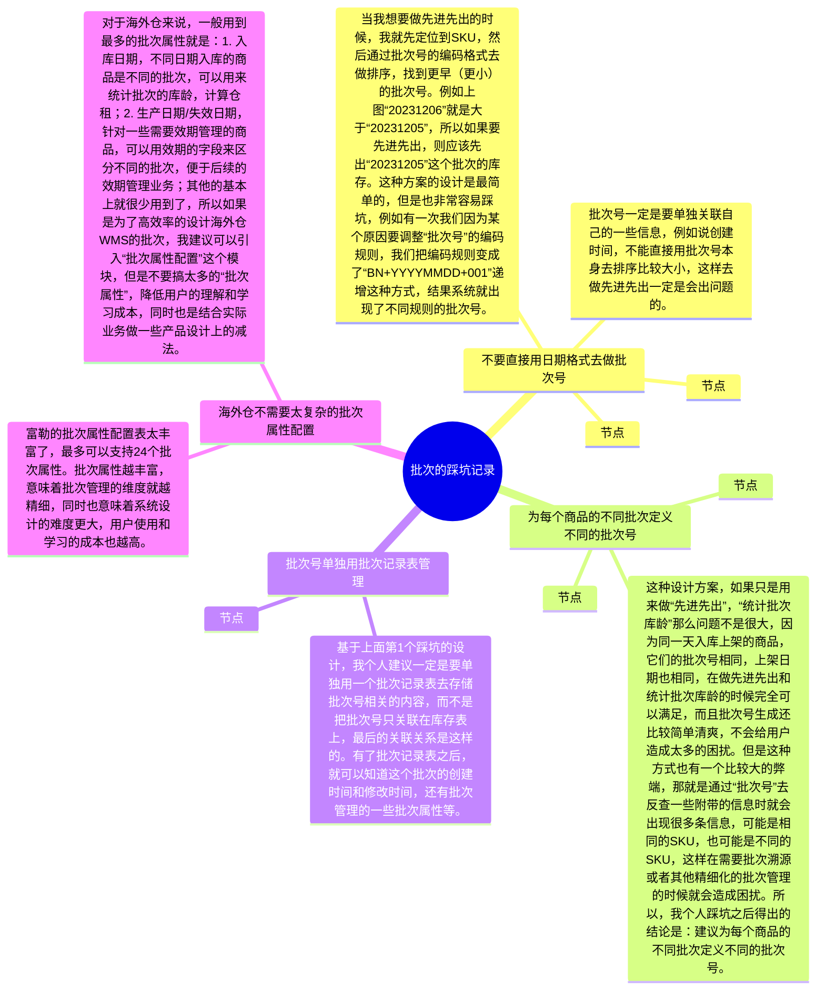

## 前言

前面的进销存， WMS，销售订单，OMS等课程中，我们陆续讲了很多次关于库存的知识，其中也稍微提到了“**批次库存**”这个名词，但是我们一直没有深入来讲解这一块的内容。

一方面是批次库存相对来说是一个高阶一些的知识，如果直接上来就讲解批次库存，很容易让大家接受不来，CPU都要烧坏；另一方面是批次库存其实在不同的系统中用法会有一些不太一样，所以我希望把进销存，WMS，OMS这几个项目都讲完了之后，再来统一讲解批次相关的知识。这样可以直接串联起之前的所学知识，让大家更能吃透这些理论和概念，也能融入到不同的业务场景中去仔细体会批次管理的价值。

本课的开课时间是`**7月21日（周日） 晚上8:30**`，开课的方式是使用腾讯会议，所以请大家提前准备好相应的软件，会议链接如下：

> 维他命 邀请您参加腾讯会议
> 
> 会议主题：课程20（直播课）：拆解OMS和WMS的批次管理
> 
> 会议时间：2024/07/21 20:30-22:30 (GMT+08:00) 中国标准时间 - 北京
> 
> 点击链接入会，或添加至会议列表：
> 
> [https://meeting.tencent.com/dm/OzDhiOjVS4Hy](https://meeting.tencent.com/dm/OzDhiOjVS4Hy)
> 
> #腾讯会议：592-347-250
> 
> 复制该信息，打开手机腾讯会议即可参与

## 课件详细内容

本节课的内容大概会分成5个部分：

1.  什么是批次管理？为什么要做批次管理？
2.  什么是批次属性？
3.  WMS的批次管理；
4.  OMS的批次管理；
5.  批次库存的相关知识讲解；

### Part1 什么是批次管理？为什么要做批次管理？

1.  什么是批次？怎么通俗易懂地理解批次？

> 想象一下，你经营一家面包店。每天你的门店都会烘焙很多新鲜的面包，虽然面包是同一种（即相同SKU），但是由于烘焙出炉的时间不一样，制作的师傅不一样，放的一些配料也会有一些不太一样，所以每一批还是会有细微的区别。
> 
> 如果按出炉时间来区分批次，某个面包（SKU）一天一共出炉了10次，那就会有10个批次，可以为每一个批次贴上一个标签，记录批次号，出炉时间，制作的师傅姓名等。这样，当我们识别到了批次号的时候，就可以知道这一批次背后的一些信息。
> 
> 所以在供应链系统中，我们经常会用“批次号”来表示：**相同SKU但是有细微区别，需要区分管理或对待**。

2.  SKU和批次号是什么关系？

> 如果单独来看批次号的话，它就是一个自增的流水号而已，没有什么特殊的意义。例如说：
> 
> -   20240415-01，就是2024年04月15日的第一批
> -   20240415-02，就是2024年04月15日的第二批
> -   20240415-03，就是2024年04月15日的第三批
> -   ……
> 
> 我们在聊批次号的时候，往往是说“某个SKU的批次号”，“某个SKU的批次”，所以**SKU和批次号是需要关联起来**的，这样才有实际的价值和意义。
> 
> _OMS和WMS中的批次管理-1.png)

3.  如果不同的SKU，有相同的批次号，为什么问题吗？

> SKU A001，可以有20240415-01，20240415-02，20240415-03这么几个批次
> 
> SKU B002，也可以有20240415-01，20240415-02，20240415-03这么几个批次
> 
> 单独看批次号，其实是没什么价值和意义的，它们很大可能性会重复，我们需要结合SKU来看。
> 
> 不能只说“XX批次”，而是要说“某某SKU的XX批次”。如果有条件的情况下，自己的系统可以自定义生成批次号，那么可以考虑让**批次号唯一**，即不同的SKU对应的批次号不会重复，这样就可以通过批次号去反查SKU了。
> 
> _OMS和WMS中的批次管理-2.png)
> 
> _OMS和WMS中的批次管理-3.png)

4.  批次号和批号/生产批号有什么区别？

> 在WMS中，批次号和批号是两个不同的概念，虽然看文字实在是很像，但是如果我们换过另外一种称呼来看这两组词，就会发现还是有不一样的点。
> 
> WMS中的批次号一般称之为“内部批次号”或者“批次流水号”，而批号则一般称之为“包装批号”或者“生产批号”，我们这里以“生产批号”来举例，会更加容易理解。
> 
> “内部批次号”就是上面我们讲到的，WMS为了区分相同的商品库存但是有一些细微区别而生成的批次号，这个是WMS根据批次属性，结合自定义的编码规则生成的。字符类型，文本长度等都是自定义的，一般WMS会用“LT”或者“BN”开头，LT是“Lot”的缩写，有表示批次的意思。
> 
> _OMS和WMS中的批次管理-4.png)
> 
> “生产批号”是产品生产的时候在外包装上印刷的一串文本，一般以数字居多，常见于药品，保健品，化妆品等对产品质量要求有要求的行业。生产批号一般是没有条码的，往往和生产日期和有效期等字段印刷在一起，所以仓库在入库采集信息的时候，可以很方便地采集这几个字段。
> 
> _OMS和WMS中的批次管理-5.png)_OMS和WMS中的批次管理-6.png)

5.  为什么要做批次管理？

> 1.  **追踪和质量控制**：通过批次管理，企业可以追踪产品的来源和去向。当出现质量问题时，可以快速确定受影响的产品批次，从而进行有效的召回或隔离，减少损失和风险。
> 2.  **库存管理**：批次管理有助于更精确地管理库存。企业可以根据每个批次的特性，比如保质期限，来优化库存水平，确保产品的新鲜度和减少过期产品的浪费。
> 3.  **客户需求满足**：不同客户可能对产品有不同的要求，比如特定的生产日期或质量标准。通过批次管理，企业可以满足这些个性化需求，提供定制化的服务。
> 4.  **合规性**：在某些行业，如食品、医药等，批次管理是法律法规的要求。企业必须遵守相关法规，记录每个批次的详细信息，以备监管部门审查。
> 5.  **成本控制**：批次管理可以帮助企业更好地控制成本。通过分析不同批次的成本数据，企业可以找到成本节约的机会，提高生产效率。
> 6.  **供应链协同**：批次管理有助于整个供应链的协同工作。供应商、生产商、分销商和零售商可以通过共享批次信息，实现信息透明，提高供应链的整体效率。

### Part2 什么是批次属性？

> 批次属性（Batch Attributes）是指和产品批次相关的一系列信息集合，这些信息有助于识别、追踪和管理该批次的产品。

不同的采购入库单，虽然采购的SKU是一样的，但是采购的供应商不一样，所以也可以通过“供应商”来区分不同的批次。

不同的采购入库单，虽然采购的SKU和供应商都是一样的，但是采购的时间不一样，入库的时间不一样，这期间可能厂商生产的工艺可能发生了升级，所以也可以通过“入库日期”来区分不同的批次。

相同的采购入库单，SKU和供应商也是相同的，但是有一些商品在生产日期/失效日期上会有一些差异，所以也可以用“生产日期/失效日期”来区分不同的批次。

……

供应商，入库日期，生产日期，失效日期等这些决定了“批次号”不一样的属性，就被称之为：**批次属性**。

_OMS和WMS中的批次管理-7.png)​

> 如果出库时不需要区分货物，一般不建议增加过多的批次属性跟踪信息，越多的信息会对进出库操作带来更加精细的指令要求。
> 
> 货主可以用收到货的日期、批号（生产商指定的）、颜色、截止日期、生产日期等等信息来定义批次属性。
> 
> 而批次号是 FLUX WMS 系统在收到货物时根据不同的批属性而自动产生的流水号。
> 
> 自动的批次号＝客户＋产品＋12个标准批次属性+12个扩展批次属性。
> 
> 只要客户、产品和 24 个批次属性内容这些信息中有一个与库存已有记录不同，系统就会生成一个新的流水批次号表示这一系列的内容，以便同其他货物加以区分。

通过上面富勒的案例，我们可以知道，当仓库收货的时候，为了区分不同的批次，可以通过配置的批次属性来控制。**针对同一个SKU来说，只要在收货的时候发现批次属性中有一个属性不一样，那么就会生成一个新的“批次号”。**

_OMS和WMS中的批次管理-8.png)

批次属性配置的越多，那么就意味着仓库的一次收货入库可能会生成很多个批次（同一个SKU），对应的就要对批次进行精细化管理，那么成本也会变得很高。所以一般的仓库，在维护批次属性的时候，不会搞太多。这样仓库在收货的时候要采集的信息不会很多，生成的批次号也不会很多，有利于仓库实际的管理。一般来说，仓库的批次属性配置中，最常用的三个是：

1.  收货日期，仓库不同时间点收货，会导致生成的WMS内部批次号不一样；
2.  生产日期/失效日期，一般生产日期/失效日期是只需要知道一个即可，因为可以结合“保质期天数”算出另外一个，同一个商品，有不同的生产日期，也意味着失效日期也不一样；
3.  生产批号，针对医疗器械类，保健品，药品类等一般外包装上会印刷生产批号，仓库入库的时候要做数据采集；

_OMS和WMS中的批次管理-9.png)

摘自C-WMS操作手册

海外仓常见的效期产品一般有保健品，奶粉，化妆品，电子烟等，而国内全品类仓库则更多的是食品，酒水饮料，生鲜，还有比较特殊的药品等。以上产品的特点就是在产品包装上会印有生产日期，保质期，失效日期等信息，这些就是最常见的一些批次属性的代表。

| 列 1 | 列 2 |
| --- | --- |
| _OMS和WMS中的批次管理-10.png) | _OMS和WMS中的批次管理-11.png) |

### Part3 WMS的批次管理？

1.  WMS中的货品（不考虑批次）流动说明

> 仓库收货，然后质检（可选），接着上架，此时系统中就会增加SKU的库存。
> 
> 仓库分波、拣货、复核、称重、出库完成之后，此时系统就会扣减SKU的库存。
> 
> _OMS和WMS中的批次管理-12.png)

2.  WMS中的货品（考虑批次）流动说明

> 当货品已经采用了批次管理的时候，说明无论是入库，出库，还是库内的调整，但凡涉及到库存调整的环节，都要考虑到批次。
> 
> _OMS和WMS中的批次管理-13.png)
> 
> 增加库存的时候：要考虑采集哪些批次属性？批次号怎么生成？
> 
> 扣减库存的时候：要考虑应该扣减哪个批次的库存？
> 
> _OMS和WMS中的批次管理-14.png)

3.  WMS的批次管理操作讲解

> 入库-上架环节：
> 
> 1.  收货清点数量，然后录入数量；
> 2.  如果是需要批次管理的商品，还需要在收货的时候采集批次属性，例如说生产日期，生产批号等，需要逐个/逐批采集；
> 3.  采集了批次属性之后，可以在收货的时候就先生成批次号，也可以在上架的时候生成批次号；
> 4.  上架之后货物会放在库位上，此时就可以生成“SKU-库位-批次”库存。需要注意，上架的时候同种商品的不同批次号需要用不同的容器区分或者是按不同的上架单区分；
> 
> _OMS和WMS中的批次管理-15.png)
> 
> 出库-波次推荐、拣货的环节：
> 
> 1.  分波的时候会根据“库存周转规则”推荐合适的批次，可能是先进先出，可能是临期先出；
> 2.  推荐了合适的批次库存之后，再根据库位的拣货路径，确定具体的库位库存，此时就可以确定占用锁定哪些“SKU-库位-批次”的库存；
> 3.  拣货员根据推荐的库位去拣货，如果实物上没有具体的批次编码，那么拣货的时候很容易拿错，所以一般仓库会配置“不允许批次混放”，意思就是同一个商品，但是不同批次不能放在一个库位上；
> 4.  拣货之后就会将批次库存从库位上扣减，转移到“拣货暂存库位”或者是“拣货周转库位”上；
> 
> _OMS和WMS中的批次管理-16.png)
> 
> _OMS和WMS中的批次管理-17.png)

4.  WMS的批次号生成时机和逻辑

> 1.  WMS先维护批次属性配置，可以知道确认某个SKU是需要采集哪些属性，有哪些属性会导致批次号不一样；
> 2.  接着在WMS收货的时候，根据要求采集一些批次属性，然后结合配置属性表去生成唯一的批次号（收货后生成批次号）；
> 3.  当SKU完成上架之后，需要将批次号和“SKU-库位库存”关联起来，就可以得到“SKU-库位-批次库存”；
> 
> _OMS和WMS中的批次管理-18.png)

5.  WMS的批次属性配置

> _OMS和WMS中的批次管理-19.png)
> 
> **RF 标签**－在 RF 终端设备上显示的批次属性名称。可以与 WMS 界面显示不同。主要原因是RF界面位置有限，经常需要以缩写形式显示。
> 
> **RF 是否显示**－有些批次属性信息，在原始单证上已经存在，不需要作业人员现场核对或者录入，可以在 RF 界面上隐藏，从而避免错误修改。通过 RF 显示字段控制哪些批次属性 RF 上可见。
> 
> **输入控制**－控制相对应的批次属性的输入情况，系统提供禁用、必输、可选、只读几种选择。必输字段，在收货时如果批次属性内容为空，会提示并不可收货。只读主要用在接口递的信息，现场不允许修改的业务情况。
> 
> **属性格式**－相对应的批次属性的格式，系统提供字符、数字、日期、日期时间 4 种选择。
> 
> **属性选项**－相对应的批次属性的可输入值，如启用该字段能够限定输入的内容，以下拉列表的模式提供选择，避免相同信息不同操作员输入内容不同（如红色，输入为红、大红、 RED 等），导致批次拆分。
> 
> **关键属性**－针对上架规则中，“不允许混放批次”和“库位内必须有相同批号的库存” 等控制项。在判断批次是否混放或者是否相同时，有时仅需要根据批次属性中的某一个或某几个进行判断，而批次号可能不同，例如相同供应商的货物可以放置在同一库位，不需考虑入库日期是否相同。此时可将这个批次属性项设置为关键属性，系统在上架规则判断中，根据勾选的批次属性关键项进行混放或相同判断，而不是根据批次号进行判断。
> 
> **验证属性**－某些货物对批次敏感，在出库、移动等作业时需要对货物的批次属性信息进行验证、比对。但通常情况下并不需要比对全部批次属性，仅对关键信息进行比对即可。例如电子元件，出库时需要比对生产批号信息，避免拣错批次，但无需比对入库日期、供应商批次属性内容。这些属性可以标记为验证，作业时会要求录入，由系统比对、校验。
> 
> _OMS和WMS中的批次管理-20.png)
> 
> _OMS和WMS中的批次管理-21.png)
> 
> 在收货的时候要采集一些批次属性，有一些批次属性是可以自动带出来的（例如“入库日期”），有一些是需要收货的时候逐个采集录入的。

6.  WMS的批次设计中踩过的一些坑

_OMS和WMS中的批次管理-白板-1.svg)

### Part4 OMS的批次管理？

1.  OMS为什么要批次管理？

> 站在海外仓OMS的角度，批次管理可以要，也可以不要，因为**批次管理是属于一种精细化的商品库存管控方式**。
> 
> 如果说客户不需要或者仓库端做不到这么精细化的管控粒度，那么就不会有批次管理，反之就会有批次管理。
> 
> 那么什么情况下会需要有批次管理呢？站在海外仓的角度来看，常见的场景一般是：
> 
> -   商品是有保质期管理的，例如说食品，饮料等；
> -   商品是有外部批号（生产批号）的，例如说医疗器械，化妆品，保健品等；
> -   商品是有多个供应商且需要溯源的，例如说商品的采购来源渠道多，各个渠道的质量和品控需要严格把关；（用的很少）

2.  OMS怎么启用批次管理？

> 如果OMS需要启用批次管理，那么在OMS创建商品的时候就要启用相关的配置项，一般是勾选“批次管理”，然后再勾选相关的“批次属性”。
> 
> _OMS和WMS中的批次管理-22.png)

3.  OMS启用批次之后，怎么下达精细化的指令？

> 当商品是有保质期的时候，仓库在入库的时候需要采集效期的信息，会生成对应的批次库存。然后OMS推送出库单给WMS的时候可能会存在“指定效期信息出库”的场景，例如说，指定商品的“**生产日期=XXX**”时才能出库。
> 
> 当商品是有外部批号的，仓库在入库的时候也会采集产品外包装上的生产批号，并生成对应的批次库存。当OMS推送出库单给WMS的时候，可以指定商品的“**生产批号=XXX**”时才能出库。
> 
> 当商品有多个供应商且需要溯源的时候，货主希望在OMS指定先出某个采购单入库的商品或者是指定出某个供应商采购的商品，这个时候需要OMS支持指定商品的**“采购订单=XXX**”或者是“**供应商=XXX**”才能出库。
> 
> _OMS和WMS中的批次管理-23.png)

4.  海外仓最常见的效期商品的批次管理

> 对于效期类型的产品（食品、化妆品、保健品）来说，只需要能够做到指定“效期类型”出库，就已经足够满足绝大多数的海外仓客户的批次管控需求了；而针对一些特殊的批次管控要求（指定生产批号，采购订单，供应商等），由于业务发生的频率很低，所以这部分可以通过线下和仓库沟通去处理。
> 
> 效期类型的产品，当启用了“批次管理”并且勾选了“生产日期”之后，就需要维护相关的保质期信息，主要是：
> 
> 1.  保质期天数，该商品有多少天的保质期；
> 2.  允许入库天数，当商品的剩余保质期天数低于此天数的时候就不允许入库了；
> 3.  预警天数，当商品的剩余保质期低于此天数就会产生预警，可以通过邮件或者其他方式告知仓库和客户；
> 4.  临期天数，当商品的剩余保质期低于此天数就会转为临期商品，可以通过邮件或者其他方式告知仓库和客户；
> 
> _OMS和WMS中的批次管理-24.png)
> 
> _OMS和WMS中的批次管理-25.png)
> 
> 当OMS支持用户指定效期状态的出库的时候，需要注意最好是**要支持多选效期状态，也就是同时出库多个效期状态的商品**。因为有一些客户对效期的管控没有那么精细化，正常、预警状态的商品都可以正常出库，甚至临期的商品也可以和正常的商品一起出库，支持多选可以兼容更多的场景。
> 
> _OMS和WMS中的批次管理-26.png)

5.  OMS启用批次管理的一些核心步骤

> 综合上述的分析，我们可以得出结论：
> 
> 1.  OMS需要批次管理的原因，是因为某些商品需要进行精细化的管理，所以要用到批次管理的功能；
> 2.  OMS的精细化批次管理一般是指OMS可以在某些单据的指令上，细化到商品的批次属性维度，而不是仅仅是商品维度；
> 3.  在OMS创建商品的时候就配置好启用批次管理，并勾选批次属性的参数，这样可以直接把OMS的配置推送到WMS中；
> 4.  OMS的批次管理启用了之后，那么WMS在执行的时候也要配合对应的配置参数，这样才可以达到最终的精细化管控目的；

### Part5 批次库存的相关知识讲解

1.  WMS的批次库存

> 根据之前提到的“维他大学”的库存案例，WMS的库存可以分成这几个维度：
> 
> 1.  SKU库存
> 2.  SKU-库位库存
> 3.  SKU-批次库存
> 4.  SKU-批次-库位库存
> 5.  SKU-SN库存
> 
> WMS的批次库存一般是需要和库位挂钩的，因为入库的商品没有贴批次条码，当相同的货物但是不同的批次混放在一起之后，就没办法从实物上去区分对应的批次了，所以一般都会用“库位-批次”的方式来跟踪批次，确保一个库位上只有一种批次，就不会混了。
> 
> _OMS和WMS中的批次管理-27.png)

2.  OMS的**批次库存**背后的2种意思

> 对于OMS来说，OMS的批次库存容易产生歧义，一般来说它有两种意思：
> 
> 1.  指的是WMS的批次库存，只不过是在OMS端去查看，因为OMS是客户端，可以通过接口去查看服务端的数据；
> 2.  指的是OMS的批次库存，OMS通过自己的批次规则去生成批次库存，然后记录在OMS端；
> 
> OMS展示的批次库存是指代1还是2，可以从业务的角度去思考……

3.  OMS为什么需要批次库存？

> “对于效期类型的产品（食品、化妆品、保健品）来说，只需要能够做到指定“效期类型”出库，就已经足够满足绝大多数的海外仓客户的批次管控需求了；而针对一些特殊的批次管控要求（指定生产批号，采购订单，供应商等），由于业务发生的频率很低，所以这部分可以通过线下和仓库沟通去处理。”
> 
> OMS需要指定“效期类型”或者其他批次属性的库存出库，那么就要知道批次库存是否足够，如果批次库存不够，就无法下推，所以OMS需要知道批次库存的数量。
> 
> 请问：此时OMS查看的是WMS的批次库存，还是OMS自己的？（待回答）

4.  OMS需要记录和WMS同频的批次库存吗？

> 可以做到，但是难度很大，意味着所有的数据交互都是要精细化到批次。
> 
> OMS推送入库单给WMS，WMS上架后要告知OMS上架了什么批次属性的库存，批次号是什么；
> 
> OMS推送出库单给WMS，WMS出库了要告知OMS出了什么批次属性的库存，批次号是什么；
> 
> WMS发起了库内的盘点，库存调整，库存状态（良品->不良）等调整，也要反馈批次属性的细节给OMS；
> 
> ……
> 
> _OMS和WMS中的批次管理-28.png)
> 
> 这些数据并不是OMS自己记录的，而是通过接口从WMS中获取到的。从WMS的批次库存中可以获取到所有的批次属性信息，但是有一些批次属性可能对OMS来说用途不大，所以可以省略一些。针对海外仓的业务场景下，推荐重点获取“生产日期”，“失效日期”，“收货日期”，“效期状态”即可。

5.  OMS按自己的批次规则去生成批次号

> 第2点的时候提到了OMS的批次库存有2种意思，第2种的意思就是OMS自己根据批次规则去生成批次号，那么OMS自己生成批次的意义是什么呢？
> 
> 主要的意义和价值是：
> 
> 1.  逻辑批次的成本核算，例如说“先进先出法”核算成本；
> 2.  通过批次来计算库龄，从而去计算仓租；
> 
> 海外仓一般不需要去核算成本，所以就一般用来计算库龄……

6.  OMS统计库龄

> 用统计的时间减去入库时间，就是可以得到当前的库龄，所以我们要知道：
> 
> 1.  某个库存什么时候入库的？统计时间是什么？
> 2.  库存的区分粒度是什么？单SKU，还是SKU+逻辑批次，还是SKU+上架日期？
> 
> SKU+逻辑批次，就是用来区分同一个SKU但是不同日期增加库存数据，每一行表示一个最小粒度
> 
> _OMS和WMS中的批次管理-29.png)
> 
> 如果为了表示最小粒度，好像也不一定要有这个逻辑批次，只要有上架日期即可，按SKU+上架日期作为最小粒度的划分也可以达到这个效果。
> 
> _OMS和WMS中的批次管理-30.png)
> 
> 综上分析：**海外仓OMS的逻辑批次号其实并不一定必须要存在（库龄统计场景下），只要在统计库龄的时候可以按****SKU+上架日期****作为划分粒度的依据即可。**

7.  最后OMS的库存有哪几种呢？

> 1）SKU库存查询，指的是查询货主的SKU在仓库中的数量，可用数量，锁定数量，在途数量等，这些数据都是OMS自己记录的，入库之后，出库之后，仓库盘点之后等，OMS都会对应更新库存。
> 
> _OMS和WMS中的批次管理-31.png)
> 
> 2）SKU库龄查询，指的是查询货主的SKU在仓库中存放了多久，库龄分别是多少天，因为计算仓租的时候需要使用到库龄的数据。这些数据都是OMS自己记录的，也是根据入库、出库、仓库库存调整等单据而更新记录的。
> 
> 在库龄查询的界面中，可以省略“逻辑批次”的概念，而是用“上架日期”来做批次的划分，这样可以避免05-OMS系统中出现多个“批次”而让用户搞不清楚区别。因为只要SKU+仓库+上架日期相同，那么就意味着是可以合并为一行数据的，即同一天入库上架。
> 
> _OMS和WMS中的批次管理-32.png)
> 
> 3）批次库存查询，指的是查询货主的SKU在仓库中更细一层维度的库存数量，可用数量等，这些数据并不是OMS自己记录的，而是通过接口从WMS中获取到的。从WMS的批次库存中可以获取到所有的批次属性信息，但是有一些批次属性可能对OMS来说用途不大，所以可以省略一些。针对海外仓的业务场景下，推荐重点获取“生产日期”，“失效日期”，“收货日期”，“效期状态”即可。
> 
> _OMS和WMS中的批次管理-33.png)

8.  库龄统计为什么要放OMS端？

> 1.  库龄统计可以放在WMS端，也可以放在OMS端，在海外仓的业务场景下建议放在OMS端会更好；
> 2.  WMS的库龄统计，也可以使用批次号去划分粒度，也可以用上架日期去划分，但是用批次号去划分会比较准，比较真实；
> 3.  但是如果用WMS的批次号去划分颗粒度，就没办法实现“**库龄的统计要遵循先进先出**”的原则，因为WMS的批次库存周转策略可能是**按效期先出**，**先进后出**等，不一定能满足先进先出；
> 4.  OMS层面根据上架日期或者OMS自己的逻辑批次去统计库龄，就可以做到逻辑层面的先进先出，便于统计出“最符合用户需求”的库龄，规避一些没必要的业务解释；

## 课后作业

> 根据之前所学的内容，在体验相关的竞品的时候多关注一下OMS和WMS的批次库存，同时也可以关注一下库龄的统计，看它们都是怎么做的。竞品包含国内仓的WMS/OMS，也包含海外仓是WMS/OMS。

## **课程答疑或补充知识**

### 答疑

1.  对WMS和OMS的批次业务和细节不太熟悉，可以看哪些补充知识？

> 这一块的知识我在电子书《📚 跨境供应链：海外仓OTWB项目实战》中有详细的介绍，可以点击此链接查看。
> 
> [3.6 海外仓OMS的批次管理](https://www.yuque.com/jiaowovitamin/dgugdp/tt1dnwwazsgrgd04)
> 
> [4.8 海外仓WMS的批次管理介绍](https://www.yuque.com/jiaowovitamin/dgugdp/pywkhlppgbpr169c)
> 
> [8.7 ERP的批次管理](https://www.yuque.com/jiaowovitamin/dgugdp/gpqeh0e3evsgytgu)

### 补充知识

[富勒03-WMS系统用户手册_V6_高清版（维他命）.pdf](https://www.yuque.com/attachments/yuque/0/2025/pdf/48385069/1738735825166-6d86a91b-e533-4a26-b4fd-4703f3d9d848.pdf)[多批次管理&先进先出实现方案 - 简道云 - 解决方案](https://hc.jiandaoyun.com/solution/19198)