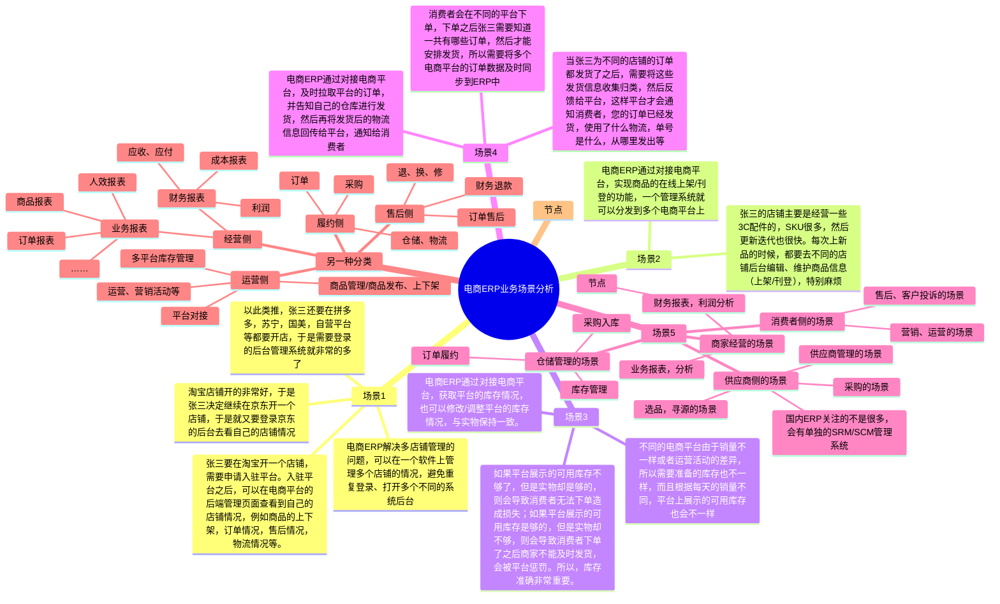
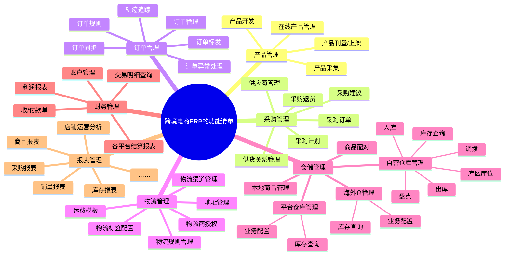
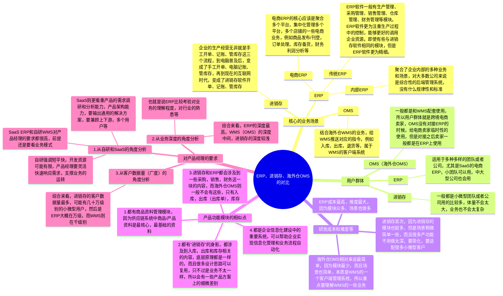

## 前言

前面我们分别学习了进销存，海外仓OMS，WMS，OMP等相关的内容，从这节课开始我们来讲讲ERP这一块的知识。

当我们学习了之前的进销存、WMS和OMS之后，再来学习ERP的内容速度就会比较快了，因为很多模块都是相通的，甚至有一些内容几乎都一模一样。ERP的功能模块相对来说比较复杂，因为用户群体是不同的岗位，要解决的业务问题也有很多，所以在学习ERP的时候重点还是要多关注干系人和业务场景，而产品设计这一块则要稍微的弱化一些。

> 本节课为录播课程，没有腾讯会议邀请链接，可以先查看下方的课程文稿，然后再学习课程视频，最后完成相关的课后作业即可。

## 课件详细内容

本节课的内容大概会分成4个部分：

1.  ERP的业务知识讲解；
2.  国内ERP和跨境ERP的区别；
3.  ERP系统（国内/跨境）实操演示；
4.  ERP、进销存、海外仓OMS的对比；

### Part1 ERP的业务知识讲解

#### 什么是ERP？

> ERP是企业资源计划（Enterprise Resource Planning）的缩写，是一种管理软件系统，旨在帮助企业管理和整合各种业务流程和资源，包括财务、人力资源、采购、生产、物流等方面。ERP系统通常由各种模块组成，可根据企业的需求进行定制和配置。通过集成各种业务流程和数据，ERP系统可以帮助企业实现更高效、更协调的运营，提高生产效率和利润率。
> 
> 基于我个人对ERP的理解，我觉得最常见的ERP分成大概三大类：
> 
> 1.  传统ERP，类似于SAP，Oracle（Netsuite），Infor，金蝶，用友等，主要是包含了财务，人力资源，采购，生产，制造，物流等各个模块；
> 2.  电商ERP，类似与旺店通，聚水潭，领星，店小秘等，主要是围绕电商订单履约业务而设计，常见的就是订单，物流，仓储，财务，采购，商品等各个模块；
> 3.  公司内部ERP，很多公司自己内部会有后台管理系统，具有很丰富、很多元的功能模块，有时候不知道怎么定义这些系统，所以会把这些系统统一称之为“ERP”，一般也会包含采购，销售，库存，仓库，物流，商品等模块；
> 
> _电商ERP的系统拆解&amp;与海外仓OMS的对比-1.png)
> 
> _电商ERP的系统拆解&amp;与海外仓OMS的对比-2.png)
> 
> _电商ERP的系统拆解&amp;与海外仓OMS的对比-3.png)
> 
> _电商ERP的系统拆解&amp;与海外仓OMS的对比-4.png)

#### 什么是电商ERP？

> “电子商务ERP把传统ERP中的采购、生产、销售、库存管理等物流及资金流模块与电子商务中的网上采购、网上销售、资金支付等模块整合在一起”  
>   
> 旺店通电商ERP针对电商经营场景中订单、仓储管理等业务，为您提供数字化智能化的解决方案，是为电商量身定做的ERP，涵盖多平台多店铺管理、订单管理、货品管理、仓储管理、客户管理、财务对账等电商各主流模块，无论您是大型企业、知名品牌、小微商家或者境电商，仓库备货或档口模式，店铺运营或直播电商，我们都有对应的ERP产品，覆盖您的业务场景。
> 跨境电商ERP系统是一个协助企业业务运营的辅助工具，通过ERP来管理企业运营中的各个环节，实现跨部门信息同步，提升员工效率，更好的协助企业业务运作。所以我们常说ERP系统是不能直接增加店铺销售额。
> 
> 一套专业跨境电商ERP系统一般会具备以下功能（仅供参考）：
> 
> 1、多平台管理
> 
> 已对接多个常见跨境电商，例如：亚马逊、eBay、速卖通、Wish、Shopee、Lazada等，集中获取订单信息，统一进行订单管理，避免错发漏发等情况出现。
> 
> 2、多业务模式支持
> 
> 可支持海外仓与自发货等多种运营模式，卖家根据业务模式选择适合自己的发货方式，
> 
> 3、多仓储物流渠道对接
> 
> 系统可以支持多渠道物流比价，根据已有数据可智能分配最优拣货路线，最有渠道降低成本，辅助提升企业核心竞争力。
> 
> 4、客服管理
> 
> 支持一站式邮件管理，自动归类邮件及业绩通知，自定义客服模板，轻松应对各类邮件。
> 
> 5、财务管理
> 
> 能够在跨平台、多店铺、全链路收支费项的完整取数基础上，为卖家提供自定义费用构成和灵活分摊逻辑设置，满足不同团队个性化、自动化的财务核算需求。

#### 电商ERP的主要业务场景？

1.  电商ERP是服务支撑类系统，那么要明确服务的是什么？ 支撑的是什么？可以简单理解为：**电商业务中高频的场景**。
2.  那么电商业务中高频的业务场景有哪些？可以从平台，商家和消费者，三个角度去分析，里面可以拆解出非常多的业务流程。
3.  电商ERP主要服务于商家，是商家与平台中间的桥梁。

_电商ERP的系统拆解&amp;与海外仓OMS的对比-5.png)

对于电商ERP的一些常见业务场景，可以见下方的脑图，加深对业务的理解。

_电商ERP的系统拆解&amp;与海外仓OMS的对比-白板-1.svg)

_电商ERP的系统拆解&amp;与海外仓OMS的对比-白板-2.svg)

### Part2 国内ERP和跨境ERP的区别

#### 2.1 国内电商ERP分享

| **ERP名称** | **功能介绍** | **备注/说明** |
| --- | --- | --- |
| 聚水潭ERP | _电商ERP的系统拆解&amp;与海外仓OMS的对比-6.png) | 聚水潭ERP应该是国内电商SaaS ERP的领头羊，用户多，单量多，产品功能也是最全的。 聚水潭的帮助手册可以查看这个。 |
| 旺店通ERP | _电商ERP的系统拆解&amp;与海外仓OMS的对比-7.png) | 旺店通ERP是国内电商ERP第二的位置，成立的时间比较早，用户数量，产品线等也比较丰富。 成立之初，慧策最先以旺店通ERP切入商家核心管理痛点——订单管理， 之后围绕电商经营管理中的核心管理诉求，先后布局流量获取、会员管理、仓库管理等其他重要经营模块。当前旗下拥有旺店通ERP旗舰版、旺店通ERP企业版、旺店通ERP极速版、旺店通WMS等多个PaaS、SaaS产品，从前端吸引流量到后端集约化管理，助力企业智慧决策。 |
| 管家婆ERP | _电商ERP的系统拆解&amp;与海外仓OMS的对比-8.png) | 成都任我行软件股份有限公司是中国中小企业管理软件行业的创始者和领导者，长期专注于中小企业信息化，为处于不同成长阶段的中小企业提供信息化解决方案。目前，任我行旗下的管家婆软件在国内乃至海外拥有80万家中小企业用户。 |
| 超级店长 | _电商ERP的系统拆解&amp;与海外仓OMS的对比-9.png) | 超级店长是光云科技旗下的一款中小商家SaaS工具，应该是国内电商ERP的Top3左右。 光云科技，A股电商SaaS第一股（股票代码：688365），成立于2009年，总部位于中国电商之都杭州。作为中国首批电商SaaS服务商，光云科技秉承“让企业经营更卓越”的使命，专注于为企业提供电商运营的全链路解决方案，致力于成为全球企业软件服务领域的领跑者。 |
| 万里牛 | _电商ERP的系统拆解&amp;与海外仓OMS的对比-10.png)_电商ERP的系统拆解&amp;与海外仓OMS的对比-11.png) | 万里牛是杭州湖畔网络技术有限公司旗下SaaS软件品牌，主要针对电商、外贸、实体门店等业务群体，帮助企业快速布局新零售，提升订单处理效率，实现数据化业务管理，为企业降本增效。 万里牛的大多数产品都可以免费注册使用。 |
| 吉客云 | _电商ERP的系统拆解&amp;与海外仓OMS的对比-12.png) | 杭州吉客云网络技术有限公司是经国家认定的高新技术企业，是国内领先的SaaS ERP软件服务商，致力于为企业提供安全稳定、高可用性和高扩展性的一站式数字化解决方案。 吉客云的很多帮助手册写的很细节，可以参考学习 |

#### 2.2 跨境电商ERP

| **ERP名称** | **功能介绍** | **备注/说明** |
| --- | --- | --- |
| 店小秘 | _电商ERP的系统拆解&amp;与海外仓OMS的对比-13.png) | 目前跨境电商ERP的的Top1，刚拿了D轮融资，产品矩阵比较全，然后用户量也是最多的，在深圳天安云谷这里 可以免费注册使用，但是有些功能需要绑定店铺 |
| 马帮 | _电商ERP的系统拆解&amp;与海外仓OMS的对比-14.png) | 比较老牌的一个跨境ERP，属于被光云投资了，算是光云系列的产品了。成立的比较早，有一些先发优势，然后又是在上海，对长三角的卖家来说比较熟悉 |
| 领星 | _电商ERP的系统拆解&amp;与海外仓OMS的对比-15.png) | 成立时间比较短，但是因为专注于亚马逊平台，然后20年的时候赶上了风口，21年拿了B轮和C轮融资，所以起步的非常快 可以免费注册使用，用户体验应该是行业内第一，被诸多友商对着抄功能和体验 |
| 易仓 | _电商ERP的系统拆解&amp;与海外仓OMS的对比-16.png) | 也是比较老牌的一个跨境ERP，早期的时候做WMS，后面转型做SaaS ERP。总体来说，WMS比ERP更知名，ERP的数据情况不太清楚，公司就在领星隔壁。 也可以免费注册使用，有Demo版本 |
| 妙手 | _电商ERP的系统拆解&amp;与海外仓OMS的对比-17.png) | 专注于东南亚电商和小众类的ERP，主要是Shopee，Lazada，Tiktok，OZON，速卖通，Temu等平台。 可以免费注册，整体用户体验还不错，而且价格比较便宜。 |

#### 2.3 补充知识

1.  国内电商ERP的情况，可以从服务市场去了解 [服务市场](https://fuwu.taobao.com/)
2.  跨境的电商平台因为没有这种风气，所以服务市场没找到，不过Shopify有对应的商店 [Shopify 应用商店](https://apps.shopify.com/search?locale=zh-CN&q=ERP) [速卖通服务市场首页](https://sell.aliexpress.com/zh/__pc/alltoolapps.htm)
3.  如果要找竞品信息或者手册等，也可以使用云市场的方式

-   [云商店_SaaS商品_软件_硬件_建站服务_企业应用-华为云](https://marketplace.huaweicloud.com/)
-   [云市场_镜像市场_软件商店_建站软件_服务器软件_API接口_应用市场 - 阿里云](https://market.aliyun.com/)
-   [云市场_企业应用_微信小程序_网站建设_镜像服务_API服务_开发者工具_应用市场_腾讯云](https://market.cloud.tencent.com/)

### Part3 ERP系统（国内/跨境）实操演示

#### 3.1 国内ERP：万里牛ERP

[电商ERP 就选万里牛,内外贸一体化解决方案专家](https://www.hupun.com/product/erp/index.html)

##### 采购业务

采购单->入库单->库存增加

_电商ERP的系统拆解&amp;与海外仓OMS的对比-18.png)

##### 销售业务

销售单->出库单->库存减少

_电商ERP的系统拆解&amp;与海外仓OMS的对比-19.png)

##### 库存模块

_电商ERP的系统拆解&amp;与海外仓OMS的对比-20.png)

库存查询和库存流水

_电商ERP的系统拆解&amp;与海外仓OMS的对比-21.png)

_电商ERP的系统拆解&amp;与海外仓OMS的对比-22.png)

#### 3.2 跨境ERP：领星ERP

[领星ERP官网-跨境电商ERP软件平台_亚马逊ERP管理系统](https://www.lingxing.com/)

##### 采购业务

1.创建采购计划，采购计划可以多个汇总成一个采购单，也可以一个采购计划生成多个采购单；

2.采购单创建之后，会有一系列的审核流，确认之后才会到具体的采购；

3.采购到货前，采购人员可以将采购单生成收货单，推送到仓库，让仓库人员提前准备好收货；

4.采购人员点击结束到货之后，采购单就会完结；

_电商ERP的系统拆解&amp;与海外仓OMS的对比-23.png)

##### 销售业务

1.创建自发货订单，然后提交审核，审核主要是看仓库，物流，库存等信息分配是否正常；

2.审核通过后，会自动提交给物流下单（获取面单），如果获取成功了，就直接推送到了自发货模块；如果失败了，则需要截单打回或者重试；

3.发货单推送到了自发货模块之后，类似于WMS模块中的出库，然后可以分波，拣货，复核，称重，出库；这一块都是相似的流程，不过ERP没有做PDA的库位拣货这么细节的操作；

_电商ERP的系统拆解&amp;与海外仓OMS的对比-24.png)

_电商ERP的系统拆解&amp;与海外仓OMS的对比-25.png)

##### 订单审核规则

对于ERP或者OMS来说，订单审核规则是灵魂，强大的审核规则可以释放人力，减轻人工运营的成本，同时也能提升订单自动化处理的时效，尽快完成履约。

订单审核的作用一般有：

> 1.检查仓库（该商品是否有库存）  
> 2.审核买家的需求（如物流公司、地址修改、包装要求、发票等）  
> 3.客户备注（是否有赠品，替换颜色尺码等）  
> 4.审查商品价格、运费设置等是否符合店铺要求（防止价格错误）  
> 5.检查是否有订单可以合并（未处理过的订单会自动合并，其他订单如果可以合并，会提示可合并）  
> 6.审核通过后才可以提交下一环节

常见的订单审核规则有这么几个子项：

| 列 1 | 列 2 |
| --- | --- |
| 1.  分配仓库规则；  2.  分配物流规则；  3.  订单审核规则；  4.  拆合单规则；  5.  地址校验/修正规则；  6.  赠品规则；  7.  其他规则……  电商OMS/ERP的订单处理一般会包含以下内容，国内和跨境ERP基本上是类似的，少量的平台和业务要求不一样，所以功能上会有些微的差异。 | _电商ERP的系统拆解&amp;与海外仓OMS的对比-26.png) |

  

_电商ERP的系统拆解&amp;与海外仓OMS的对比-27.png)

##### 库存模块

库存查询和库存流水

| 列 1 | 列 2 |
| --- | --- |
| _电商ERP的系统拆解&amp;与海外仓OMS的对比-28.png) | _电商ERP的系统拆解&amp;与海外仓OMS的对比-29.png) |

_电商ERP的系统拆解&amp;与海外仓OMS的对比-30.png)

库存相关的其他操作：

1.  加工单，分成组装和拆卸，组装就是单品SKU组装成组合SKU，拆卸就是组合SKU拆卸成单品SKU；
2.  调拨单，从A仓库调拨到B仓库，A仓库扣减库存，B仓库增加库存；
3.  调整单，调整某些SKU的库存，用单据的形式体现，便于追溯；
4.  盘点单，对SKU进行盘点，确保账实平衡；

### Part4 电商ERP、进销存、海外仓OMS的对比

_电商ERP的系统拆解&amp;与海外仓OMS的对比-白板-3.svg)

## 课后作业

> 分别体验一下跨境ERP和国内电商ERP，对比相关的功能菜单，理解大概的业务模式是怎么样的，后续有需要做这一块的时候再深入学习。

## **课程答疑或补充知识**

### 答疑

1.  Netsuite长什么样子？有学习教程吗？

> [https://www.youtube.com/watch?v=goVHYdvLtP4&list=PLSFKmbMc2o6Z1y6P7gT-ACOs8OqYQns4t](https://www.youtube.com/watch?v=goVHYdvLtP4&list=PLSFKmbMc2o6Z1y6P7gT-ACOs8OqYQns4t)
> 
> _电商ERP的系统拆解&amp;与海外仓OMS的对比-31.png)

2.  万里牛的帮助手册

> [https://hupun-service.cus.dingtalk.com/page/knowledge?pageId=6&language=zh](https://hupun-service.cus.dingtalk.com/page/knowledge?pageId=6&language=zh)

3.  吉客云的帮助手册

> [https://jackyun.com/pages/space.html](https://jackyun.com/pages/space.html)

### 补充知识

| 列 1 | 列 2 |
| --- | --- |
| > 万里牛ERP的账号，可以自行注册，注册后就可以直接使用了，后续销售可能会联系  >  > | > 领星ERP的账号，可以自行注册，销售会联系，然后帮你激活账号，后续才能体验 |

[万里牛ERP产品原型完整版.rp](https://www.yuque.com/attachments/yuque/0/2025/rp/48385069/1738735822980-ae50e023-9540-4ac1-bfbb-49b8ea0fd2c0.rp)