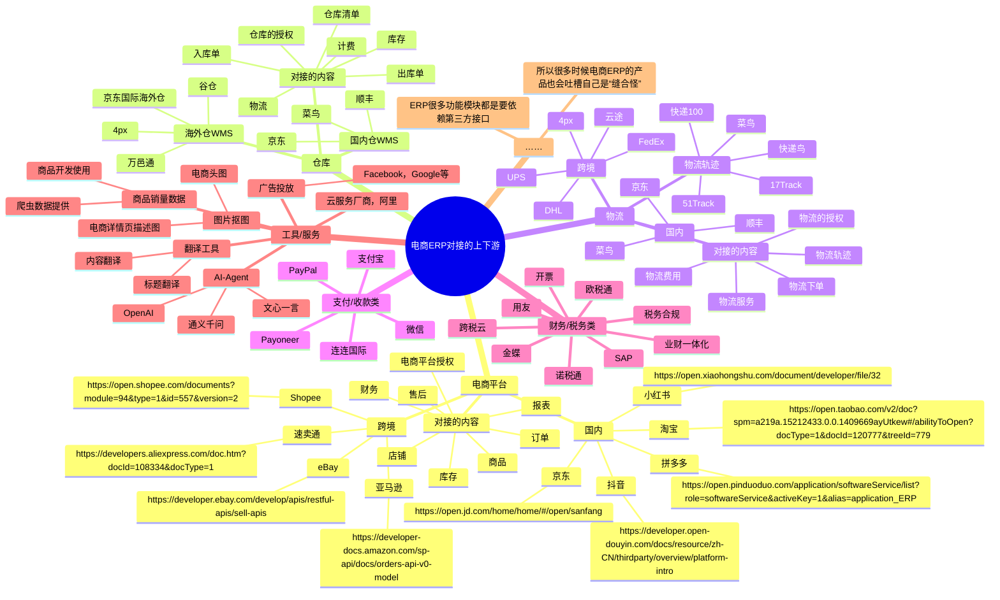
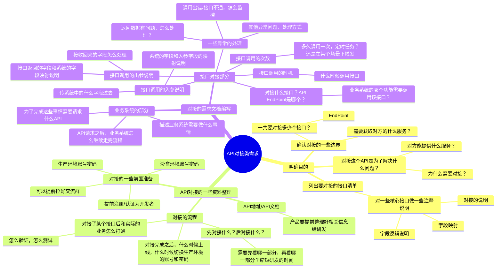

## 前言

大多数产品经理首次接触电商ERP，基本上看到最多的就是订单，库存，商品，采购，财务，报表等业务模块。对于电商ERP的产品经理来说，虽然表层上看到的也是这些功能模块，但是实际去设计相关的产品方案的时候会发现ERP有非常多的地方都要依赖外部的系统，日常要处理的API对接事项非常之多。

对于B端产品经理来说，日常工作时或多或少都会需要对接一些第三方API，电商ERP就尤其的多。有一些刚接触B端领域/供应链领域的朋友认为自己没有技术背景，之前也没怎么接触过这一块的业务，所以会对API对接这个事情有一定的恐惧感，担心自己做不来。

所以这节课，我就以电商ERP的一些功能模块和业务场景为引子，既给大家讲讲电商ERP的一些业务，同时也给大家讲讲API的对接和API开放平台的搭建，让你也成为“懂技术的产品经理”。

> 本节课为录播课程，没有腾讯会议邀请链接，可以先查看下方的课程文稿，然后再学习课程视频，最后完成相关的课后作业即可。

## 课件详细内容

本节课的内容大概会分成5个部分：

1.  电商ERP要对接哪些外部接口？
2.  API对接前要掌握的一些技术基础
3.  API对接类的需求怎么写？
4.  API调试讲解
5.  API开放平台的搭建分享

### Part1 电商ERP要对接哪些外部接口？



_API对接与API开放平台的搭建-白板-1.svg)

### Part2 API对接前要掌握的一些技术基础

1.  什么是API？

> API(Application Programming Interface,应用程序编程接口)是一些预先定义的函数，目的是提供应用程序与开发人员基于某软件或硬件的以访问一组例程的能力，而又无需访问源码，或理解内部工作机制的细节。API除了有应用“应用程序接口”的意思外，还特指 API的说明文档，也称为帮助文档。
> 
> API 架构通常从客户端和服务端的角度来解释。发送请求的应用程序称为客户端，发送响应的应用程序称为服务端。以天气为例，气象局的天气数据库是服务端，而移动应用程序是客户端。  
> _API对接与API开放平台的搭建-1.png)
> 
> 当你使用一个手机应用程序来查看天气预报时，这个应用程序需要获取天气数据来显示在屏幕上。这时，这个应用程序可以通过调用一个天气API来获取所需的数据。
> 
> 天气API是一个公开的接口，它允许不同的应用程序通过互联网连接到一个服务器，从而获取实时的天气数据。应用程序可以通过发送请求来调用API，请求中包含了应用程序所需要的参数（例如地理位置、时间等）。然后，API会返回一个响应，其中包含了所需的数据（例如温度、湿度、风速等）。
> 
> 这个天气API可以被不同的应用程序使用，例如天气应用程序、新闻应用程序、旅游应用程序等等。通过使用这个API，这些应用程序可以方便地获取实时的天气数据，而无需自己开发和维护一个天气数据源。

2.  什么是API Point，和API有什么区别？

> 一般来说，"Endpoint"是指通信通道的一端，即两个系统进行交互的地方。
> 
> 在网络编程中，Endpoint通常指代访问服务的地址，可以是URL、IP地址或其他形式的网络地址。Endpoint是客户端和服务器之间进行通信的入口点。
> 
> 在Web服务中，Endpoint通常表示一个URL，这些URL在API的文档中被描述，客户端通过这些URL访问服务器上的资源。
> 
> Endpoint是API的具体实现之一，用于访问API的特定功能，可以将其视为API的子集。API接口可以包含多个端点（Endpoint），每个端点对应特定的功能或资源。
> 
> _API对接与API开放平台的搭建-2.png)

3.  接口对接时，要区分“你对接我，还是我对接你”，有什么区别？

> 谁对接谁，主要看谁是服务商，一般是服务商提供接口，然后使用者来调用接口获得这些服务。
> 
> _API对接与API开放平台的搭建-3.png)
> 
> ERP要获取电商平台的一些信息，所以ERP对接电商平台，电商平台提供API；
> 
> ERP要推送数据给仓库入库、出库，所以ERP要对接仓库，仓库提供API；
> 
> ……

4.  API文档中的常见的一些内容/模块？

> 接口描述：简单描述接口的逻辑和作用。例如说明这是一个发送消息的接口、查询天气的接口
> 
> 请求地址：也就是URL，注意区分不同的环境而导致的地址不同
> 
> 请求方法：常见的有“GET,POST,PUT,DELETE,PATCH”，具体区别产品可以不用深入研究
> 
> 请求参数：用来传递信息的变量。即需要请求的字段名的名称和规则：都是哪些字段，字段的类型是什么，是否必填字段等等；
> 
> -   URL传参
> -   Headers 请求头
> -   Body 请求内容
> 
> 响应参数：最好区分成功和失败等不同情况的响应内容
> 
> 请求示例：这部分可选，有的话能让对方更好的理解怎么使用
> 
> 响应示例：这部分可选，有的话能让对方更好的理解怎么使用
> 
> ​  
> 
> 可以看看虾皮和Aftership的接口文档：
> 
> [Shopee Open Platform](https://open.shopee.com/documents/v2/v2.product.get_category?module=89&type=1)
> 
> [Get shipper accounts - Postmen API - AfterShip Docs](https://www.aftership.com/docs/postmen/5742112a2c755-get-shipper-accounts)

5.  API接口请求参数（Request）和响应参数（Response）的格式？

> 获取天气数据的API可以返回不同的数据格式，包括JSON（JavaScript Object Notation）和XML（eXtensible Markup Language）。
> 
> JSON是一种轻量级的数据交换格式，它使用键值对的方式来表示数据。JSON的语法非常简洁，易于阅读和编写。例如，一个返回天气数据的JSON格式可能如下所示：
> 
> {  
> "temperature": 20,  
> "humidity": 50,  
> "wind\_speed": 5,  
> "air\_quality": "good"  
> }
> 
> XML是一种通用的标记语言，它使用标签来表示数据。XML的语法相对比较复杂，但是XML具有更好的可扩展性和兼容性。例如，一个返回天气数据的XML格式可能如下所示：
> 
> <weather>  
> <temperature>20</temperature>  
> <humidity>50</humidity>  
> <wind\_speed>5</wind\_speed>  
> <air\_quality>good</air\_quality>  
> </weather>
> 
> JSON和XML的主要区别在于语法结构和数据格式。JSON使用键值对表示数据，而XML使用标签表示数据。相对来说，JSON的语法更加简洁，易于阅读和编写，而且它的数据格式更加紧凑，适合网络传输。
> 
> 相比之下，XML的语法相对更加复杂，但是它具有更好的可扩展性和兼容性，适合于处理复杂的数据结构和文档。
> 
> _API对接与API开放平台的搭建-4.png)

6.  什么是沙盒环境和生产环境？

> 沙盒环境（Sandbox）又称测试环境和开发环境，是提供给开发者开发和测试用的环境。有一些API平台会开放沙盒环境，让开发者方便联调测试，等沙盒环境测试通过之后，再切换到对应的生产环境中。  
>   
> 沙盒环境和生产环境的**API文档描述**都是一样的，只不过是请求的地址不一样，如下图所示：
> 
> _API对接与API开放平台的搭建-5.png)
> 
> _API对接与API开放平台的搭建-6.png)

7.  接口的版本号的作用是？

> 一般来说，API接口是提供给其他系统或是其他公司使用，不能随意频繁的变更。然而，需求和业务不断变化，接口和参数也会发生相应的变化。如果直接对原来的接口进行修改，势必会影响线其他系统的正常运行。这就必须对API接口进行有效的版本控制。
> 
> 例如，添加用户的接口，由于业务需求变化，接口的字段属性也发生了变化而且可能和之前的功能不兼容。为了保证原有的接口调用方不受影响，只能重新定义一个新的接口。
> 
> -   [http://localhost:8080/api/v1/user](http://localhost:8080/v1/my/test)
> -   [http://localhost:8080/api/v2/user](http://localhost:8080/v2/my/test)
> 
> API版本控制的方式：
> 
> 1.域名区分管理，即不同的版本使用不同的域名，v1.api.test.com，v2.api.test.com
> 
> 2.请求url 路径区分，在同一个域名下使用不同的url路径，test.com/api/v1/，test.com/api/v2
> 
> 3.请求参数区分，在同一url路径下，增加version=v1或v2 等，然后根据不同的版本，选择执行不同的方法。
> 
> 实际项目中，一般选择第二种：请求url路径区分。因为第二种既能保证水平扩展，有不影响以前的老版本
> 
> _API对接与API开放平台的搭建-7.png)

8.  API和SDK的区别是什么？

> 1\. API（应用程序编程接口）
> 
> 想象一下，你走进一家餐厅（我们称之为“API餐厅”），这家餐厅提供一份菜单（API文档），上面列出了你可以点的所有菜品（API功能）。当你想点一道菜时，你需要按照菜单上的说明来点菜，比如告诉服务员你想要“宫保鸡丁”，并指定“微辣”。服务员（API接口）会将你的点餐信息传递给厨房（后端服务），然后厨房会准备你的菜品并最终由服务员端上桌。
> 
> 在这个例子中，API就像餐厅的菜单和服务员，它允许你（开发者）通过特定的方式（点菜）来请求后厨（服务提供者）为你准备你想要的菜品（功能或数据）。
> 
> 2\. SDK（软件开发工具包）
> 
> 现在，让我们看看SDK。假设你是一位厨师，你想在自己的餐厅提供“API餐厅”的某些菜品，但你没有他们的食谱和烹饪技巧。于是，“API餐厅”提供了一个“烹饪工具箱”（SDK），里面包含了他们所有菜品的食谱、烹饪指南、特殊的烹饪工具，甚至可能还有一些已经处理好的食材。
> 
> 你作为厨师，可以使用这个“烹饪工具箱”来学习如何制作这些菜品，并在你的餐厅提供相同的菜品，而不需要从头开始发明轮子。
> 
> 区别：
> 
> -   **API** 是一种请求和服务的交互方式，它定义了一组规则和协议，允许不同的软件应用程序之间进行通信。API通常是一组HTTP请求，通过这些请求，你可以获取数据或执行特定的功能。
> -   **SDK** 是一组工具、库、文档和样本代码的集合，它允许开发者快速开发特定平台或服务的应用程序。SDK通常包含了API的访问权限，但还提供了额外的便利性，如预先构建的组件、开发工具和示例代码。
> 
> 简而言之，API是让你与服务进行交互的规则和方法，而SDK是一套工具，帮助你更容易地使用这些API，并且可能还提供了一些额外的资源和支持。
> 
> [抖店开放平台](https://op.jinritemai.com/docs/guide-docs/87/1072)

9.  一些接口文档推荐？

> Shopee的订单获取接口：
> 
> [https://open.shopee.com/documents/v2/v2.order.get\_order\_list?module=94&type=1](https://open.shopee.com/documents/v2/v2.order.get_order_list?module=94&type=1)
> 
> 支付宝手机支付接入的接口：
> 
> [https://opendocs.alipay.com/open/02ivbs?scene=21&ref=api](https://opendocs.alipay.com/open/02ivbs?scene=21&ref=api)
> 
> 抖店开放平台：
> 
> [https://op.jinritemai.com/docs/api-docs/13/1510](https://op.jinritemai.com/docs/api-docs/13/1510)

### Part3 API对接类的需求怎么写？



_API对接与API开放平台的搭建-白板-2.svg)
[链接](https://www.yuque.com/jiaowovitamin/sixth/ug2twp9gks6vw1q0)

### Part4 API调试讲解

#### API调试工具

1.  Postman（老牌，功能强大，但是上手难度较大）
2.  Apipost（国产新起的API调试工具）
3.  Apifox（推荐，比较简洁清爽，功能也够用）

_API对接与API开放平台的搭建-8.png)

#### API调试入门的几个案例

[Apifox Echo - Apifox Echo](https://echo.apifox.cn/doc-1406337)

| 案例 | 实际请求（cURL） |
| --- | --- |
| 使用Query参数 | ```powershell<br>curl --location --request GET 'https://echo.apifox.com/get?q1=v1&q2=v2' \<br>--header 'User-Agent: Apifox/1.0.0 (https://apifox.com)' \<br>--header 'Accept: */*' \<br>--header 'Host: echo.apifox.com' \<br>--header 'Connection: keep-alive'<br>``` |
| 使用POST参数 | ```powershell<br>curl --location --request POST 'https://echo.apifox.com/post?q1=v1&q2=v2' \<br>--header 'User-Agent: Apifox/1.0.0 (https://apifox.com)' \<br>--header 'Content-Type: application/json' \<br>--header 'Accept: */*' \<br>--header 'Host: echo.apifox.com' \<br>--header 'Connection: keep-alive' \<br>--data-raw '{<br>    "d": "deserunt",<br>    "dd": "adipisicing enim deserunt Duis"<br>}'<br>``` |
| 使用DELETE参数 | ```powershell<br>curl --location --request DELETE 'https://echo.apifox.com/delete?q1=v1' \<br>--header 'User-Agent: Apifox/1.0.0 (https://apifox.com)' \<br>--header 'Accept: */*' \<br>--header 'Host: echo.apifox.com' \<br>--header 'Connection: keep-alive' \<br>--form 'b1="v1"' \<br>--form 'b2="v2"'<br>``` |
| 使用PUT参数 | ```powershell<br>curl --location --request PUT 'https://echo.apifox.com/put?q1=v1' \<br>--header 'User-Agent: Apifox/1.0.0 (https://apifox.com)' \<br>--header 'Content-Type: text/plain' \<br>--header 'Accept: */*' \<br>--header 'Host: echo.apifox.com' \<br>--header 'Connection: keep-alive' \<br>--data-raw 'test value'<br>``` |
| 使用PATCH参数 | ```powershell<br>curl --location --request PATCH 'https://echo.apifox.com/patch?q1=v1' \<br>--header 'User-Agent: Apifox/1.0.0 (https://apifox.com)' \<br>--header 'Content-Type: application/json' \<br>--header 'Accept: */*' \<br>--header 'Host: echo.apifox.com' \<br>--header 'Connection: keep-alive' \<br>--data-raw ''<br>``` |

RESTful API 设计遵循的是一种资源导向的架构风格，其中使用不同的 HTTP 方法来执行不同的操作。以下是 HTTP 方法的表格，包括它们的基本区别以及是否幂等：

| HTTP 方法 | 描述 | 是否幂等 |
| --- | --- | --- |
| GET | 用于获取资源的表示。GET 请求应该是安全的，不会改变服务器上的状态，因此它们是幂等的，意味着多次执行相同的GET请求，服务器的状态不会改变。 | 是 |
| POST | 用于创建新的资源或触发服务端操作。由于每次POST请求都可能在服务器上创建新资源或触发某些操作，因此POST不是幂等的。多次执行相同的POST请求可能会产生多个资源或多次执行同一个操作。 | 否 |
| PUT | 用于创建新的资源（如果不存在）或替换更新现有资源。PUT 请求是幂等的，因为多次执行相同的PUT请求（相同的URI和相同的数据）应该保持资源状态不变。 | 是 |
| PATCH | 用于对资源进行部分更新。由于它修改的是资源的一部分，所以PATCH不是幂等的。多次执行相同的PATCH请求可能会导致资源状态的累积变化。 | 否 |
| DELETE | 用于删除资源。DELETE 请求是幂等的，因为即使多次执行相同的DELETE请求，资源已经被删除，服务器的状态不会因此而改变。 | 是 |

幂等性意味着无论请求被执行多少次，结果都是相同的，不会影响系统的其他部分。这在分布式系统中特别重要，因为它可以减少重复请求带来的副作用。

#### 荣昇海外仓的API接入

_API对接与API开放平台的搭建-9.png)

[荣昇海外仓API文档](https://open.wingsing.com/#/api/catalog/guide)

> SandBox环境下的ID和Secret  
> APP ID：B090D402D47C4E3AB9FC47FCAEBEDD022837  
> APP SECRET：925B1E85F92746EE8A13BC7AC5475BEB2837
```plain
接口地址：https://openapi-sandbox.wingsingglobal.com/token/get/v1
接口文档：https://open.wingsing.com/#/api/developerRead/signature
请求方式：POST
请求参数：{
	"appId":"B090D402D47C4E3AB9FC47FCAEBEDD022837",
	"secretKey":"925B1E85F92746EE8A13BC7AC5475BEB2837"
}
```

_API对接与API开放平台的搭建-10.png)

  

```plain
接口地址：https://openapi-sandbox.wingsingglobal.com/warehouse/get/v1
接口文档：https://open.wingsing.com/#/api/interface/basic/warehouse
请求方式：POST
请求参数：{
	"accessToken":"使用上一步获取到的Token"
}
```

_API对接与API开放平台的搭建-11.png)

```plain
接口地址：https://openapi-sandbox.wingsingglobal.com/product/create/v1
接口文档：https://open.wingsing.com/#/api/interface/basic/warehouse
请求方式：POST
请求参数：{
    "accessToken":"FF74CD17032F4BA990243F9CAD88F57E",
    "data": [
    	{
            "skuCode": "692266454295",
            "cnName": "清风面巾纸",
            "enName": "Qingfeng Paper",
            "hsCode": "4803000000",
            "length": 12.00,
            "width": 7.50,
            "height": 5.00,
            "weight": 0.30,
            "description": "description",
            "price": 2,
            "customCode": "692266454295",
            "currency": "USD",
            "declareCnname": "清风面巾纸",
            "declareEnname": "Qingfeng Paper",
            "declarePrice": 1.10,
            "ean": "692266454295",
            "defSign" : false,
            "isExpirable" : false,
            "validityPeriod" : 30,
            "countryOfOrigin":"CN",
            "labelCode" : "LabelWS004",
            "productBattery": {
            	"code":"UN3480",
            	"type":"PI965",
            	"name":"Lithium Ion Batteries",
            	"section":"",
            	"groupCapacity":"1",
            	"coreCapacity":"1",
            	"groupWeight":"",
            	"coreWeight":"90",
            	"batteryNum":"90",
            	"weight":9
            }
        }
    ]
}
```

### Part5 OpenAPI开放平台的搭建

1.什么是OpenAPI开放平台？

> 在互联网时代，把网站的服务封装成一系列计算机易识别的数据接口开放出去，供第三方开发者使用，这种行为就叫做Open API，提供开放API的平台本身就被称为开放平台。
> 
> [微信开放平台](https://open.weixin.qq.com/)
> 
> [Shopee Open Platform](https://open.shopee.com/)
> 
> [wingsing开放平台](https://open.wingsing.com/#/home)
> 
> [谷仓海外仓开放平台](https://open.goodcang.com/)
> 
> [跨越速运 开放平台](https://open.ky-express.com/#/)
> 
> [宙斯开发者中心 | API列表](https://jos.jd.com/apilist?apiGroupId=138&apiId=13152&apiName=jingdong.eclp.checkstock.queryCheckStockProfit)
> 
> [递四方开放平台](https://open.4px.com/)

2.为什么要搭建OpenAPI开放平台？

> 1.产品自身有很多丰富的能力，所以通过开放平台去对外提供能力，例如支付宝支付和微信支付
> 
> 2.产品自身提供的功能有限，可以通过开放平台引入很多第三方的独立开发者（ISV），然后补充产品本身所欠缺的场景或功能够，例如Shopify的插件，淘宝的服务市场
> 
> 3.产品的用户需要在其他场景下使用自己的数据，可以通过开放平台对接多个外部系统，然后外部系统通过接口拉取相应的业务数据存储下来，例如电商ERP，电商OMS等
> 
> 4.其他一些场景的需求……

3.OpenAPI开放平台一般包含哪些内容？

> 开放平台一般有以下特点：
> 
> 1.  二级域名通常使用open，例如：open.xxx.com
> 2.  使用人群和用户对象主要是开发者，因此需要开发者申请入驻
> 3.  开放平台核心提供的是OpenAPI，不同开发者或不同应用，拥有不同的接口调用权限
> 4.  开放平台还需要为开发者用户提供配套完成的产品功能体系，以便让开发者可以在平台上查看和管理账号、核心业务数据，甚至订单信息
> 5.  需要提供在线的接口文档，即便是游客也能访问查看
> 6.  一个账号可以创建或申请多个应用
> 7.  平台侧，需要有一个内部管理后台，对开发者账号、应用、API接口权限、流量统计等进行通用的管理
> 
> _API对接与API开放平台的搭建-12.png)
> 
> _API对接与API开放平台的搭建-13.png)
> 
> _API对接与API开放平台的搭建-14.png)
> 
> _API对接与API开放平台的搭建-15.png)

4.产品经理在搭建OpenAPI开放平台过程中一般要做什么？

> 1.  把OpenAPI开放平台也当做一个产品来看待，一般是有两个端，一个是用户端（开放平台），一个是管理端（API管理后台），需要输出两个端的产品需求
> 2.  针对用户端（OpenAPI），可以参考其他竞品的内容，设计好相应的模块，开发者入驻的流程，审核的流程，然后要对外开放的API有哪些，对应的API的文档的设计等……
> 3.  针对管理端（API管理后台），这一块的参考竞品比较少，主要是结合具体的业务需求进行具体的设计。例如开发者入驻需要审核，开发者开发的应用需要审核，需要监控管理，同时也承担一些CMS（内容管理系统）的内容，可以快速修改调整API文档
> 4.  关于API文档方面，产品经理可以不用考虑过多的技术设计的内容，但是一定要知道具体的接口有哪些，然后分别的入参和出参是什么，一些案例或者是文档介绍要亲自参与走查完善，一般都需要持续打磨才能让开发者很顺畅的接入
> 
> [PhalApi Pro 专业版技术文档](https://www.yesx2.com/wiki/#/README)

5.OpenAPI的搭建一定需要有技术背景吗？

> 坦白说，OpenAPI的搭建过程中，其实涉及到技术相关的内容还是挺多的，所以如果是有技术背景的产品经理来做这个确实是会更省力一些。但是如果你没有相关的技术背景，但是又不得不去做相关的工作，那么建议多求助于相关研发人员。如果研发人员给力，那么产品经理其实只需要整理一些大纲即可，例如开放什么接口，暴露哪些出参等，具体的细节都可以研发自行搞定，产品最后做一个走查即可。
> 
> 很多时候，小公司，产品经理要输出的接口稳定就是一个Word或者PDF，产品输出框架，研发输出具体的内容。

## 课后作业

> 下载一个[Apifox](https://www.apifox.cn/?utm_source=baidu_pinzhuan&utm_medium=sem&utm_term=pinzhuan)，然后在网络上找一些免费的接口，自己尝试去调用一下，体验一下接口调试的过程是怎么样的。  
> [https://apifox.com/apihub/](https://apifox.com/apihub/)  
> [https://open.wingsing.com/#/api/developerRead/description](https://open.wingsing.com/#/api/developerRead/description)

## **课程答疑或补充知识**

### 答疑

1.  对接大平台的时候如果踩坑了怎么处理？

> 可以考虑在社区的论坛或者直接联系官方人员，加入一些交流群去解决问题。

2.  什么是JSON？

> 可以查看这一篇文章，去实际操作一下：[JSON](https://www.liaoxuefeng.com/wiki/1022910821149312/1023021554858080)

3.  想要自己搭建仓储物流类的OpenAPI，有什么其他补充资料可以看看吗？

> 这一块的知识建议可以看看电子书当中的内容，我之前也做过类似的功能模块。
> 
> [7.3 海外仓的OpenAPI平台搭建](https://www.yuque.com/jiaowovitamin/dgugdp/kwlvfsho5h96uxcu)

4.  想要系统性学习API对接的知识，推荐看什么书呢？

> 可以看看这一本书《Web API的设计与开发》

### 补充知识

[RESTful API 设计指南 - 阮一峰的网络日志](https://www.ruanyifeng.com/blog/2014/05/restful_api.html)

[21分钟学会Apifox_哔哩哔哩_bilibili](https://www.bilibili.com/video/BV1ae4y1y7bf/?spm_id_from=333.788.recommend_more_video.6&vd_source=610e391e2cf86c2841d101ff237109fa)

[免费API - 提供免费接口调用平台](https://api.aa1.cn/)

[零七生活API - 提供免费接口调用平台](https://api.oick.cn/)

[接口大师[旗舰版演示\]](http://www.yesx2.com/)

[JSON基础应用与实战视频教程-慕课网](https://www.imooc.com/learn/68/)