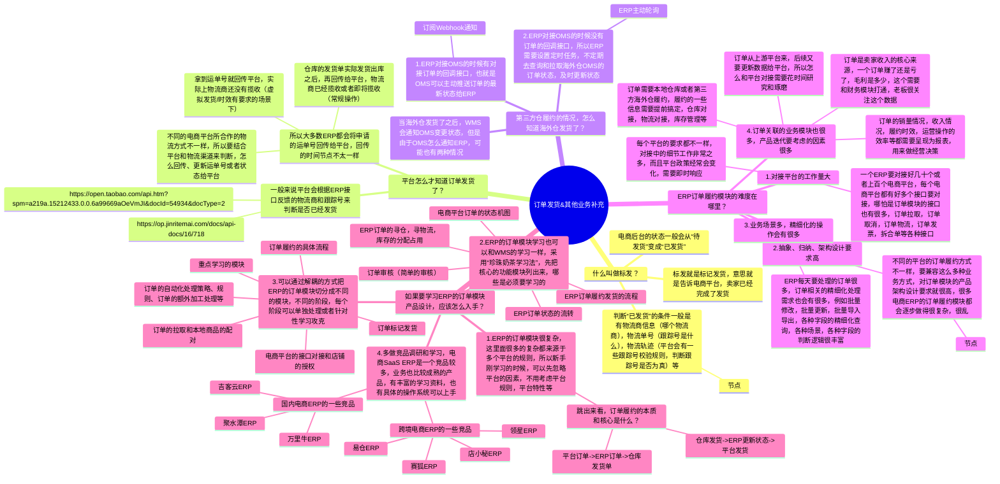
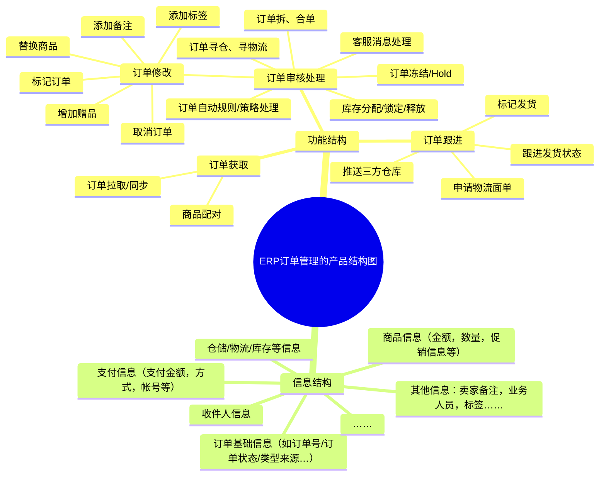

## 前言

在前面的课程中，我们拆解了国内/跨境电商ERP的一些业务知识和系统的功能模块，同时也对电商ERP的物流模块进行了一波深入的讲解，接下来我们来聊聊电商ERP中最常见，也相对来说最复杂的“订单模块”。

电商ERP很核心的一个功能/作用，就是可以集中处理多个电商平台，多个电商店铺的日常业务，包含商品上架，库存同步，订单履约等，其中订单履约对用户体验来说至关重要，电商平台侧也对这一块的重视程度很高。

所以，对电商ERP来说，“订单模块”的重要性就更加明显了。订单管理模块相对来说虽然复杂，但是市面上成熟的竞品也多，方案也多，所以在实际的工作中可以多做竞品调研，多做一些方案的挖掘，对比。

国内电商和跨境电商ERP中的订单管理，在实际的系统产品设计上会略有差异，主要是因为电商平台的规则，接口，还有实际履约的仓储物流等方式不一样。但是内核其实都是想通的，不用担心学了跨境的电商ERP知识，到时候做国内电商ERP就用不上了，因为这两者本质都是：**集中管理来自多个平台的订单，然后推送单据到下游仓储去完成履约发货，最后回传数据给到电商平台。**

本课的开课时间是`**2024/07/31（周三）晚上9:00**`，开课的方式是使用腾讯会议，所以请大家提前准备好相应的软件，会议链接如下：

> 维他命 邀请您参加腾讯会议
> 
> 会议主题：课程24（直播课）：电商ERP订单模块的产品设计
> 
> 会议时间：2024/07/31 21:00-22:30 (GMT+08:00) 中国标准时间 - 北京
> 
> 点击链接入会，或添加至会议列表：
> 
> [https://meeting.tencent.com/dm/MpJr6twefD4K](https://meeting.tencent.com/dm/MpJr6twefD4K)
> 
> #腾讯会议：349-855-314
> 
> 复制该信息，打开手机腾讯会议即可参与

## 课件详细内容

本节课的内容大概会分成5个部分：

1.  订单的获取和本地商品的配对；
2.  订单的处理和审核；
3.  订单发货履约流程；
4.  订单标记发货及其他业务补充；
5.  订单管理的产品设计；

### Part1 订单的获取和本地商品的配对

当消费者在电商平台购物下单之后，电商平台会先有一层自己的订单处理逻辑，例如消费者可能是在多个店铺内购买了多个商品，然后集中下单支付的，电商平台会根据店铺拆分订单，然后把订单推送给卖家的后台，**在电商卖家后台看到的订单已经是平台拆过一次单**了。（电商平台的OMS和电商ERP的OMS虽然都叫OMS，但是效果并不一样）

_电商ERP订单模块的产品设计-1.png)

ERP需要获取电商平台的订单，就需要提前和电商平台进行API对接，对接的流程和细节就比较多了，这里不做详细的介绍，先了解大概的流程即可：

1.  申请成为电商平台的开发者；
2.  对接电商平台的业务接口，完成接口对接工作；
3.  在电商ERP上授权店铺，获得访问店铺数据的权限；
4.  在ERP上拉取已授权店铺的订单数据；

> 卖家将自己的店铺授权在ERP上之后，就可以通过ERP去拉取店铺中的订单信息，订单信息拉取一般有三种方式：
> 
> 1.电商平台通过消息推送的方式，通知给ERP，然后ERP接收到了通知之后再触发任务去拉取订单；
> 
> 2.ERP自己设置定时任务，例如每10分钟拉取一次，从电商平台上拉取订单数据到ERP上；
> 
> 3.在ERP上做一个“手动拉取”的功能，当想要拉取新的信息的时候，点击一下“手动拉取”就会自动拉取最新的数据到ERP上；

_电商ERP订单模块的产品设计-2.png)

_电商ERP订单模块的产品设计-3.png)

> 订单拉取到了ERP之后，一般订单中的信息会包含这些：
> 
> 1.  平台订单的信息：平台名称，店铺名称、平台订单号、下单时间、买家留言/备注，订单状态……
> 2.  买家/用户的信息：用户ID，用户名称，用户等级，收件地址……
> 3.  订单的产品信息：平台SKU、商品编码、商品名称，数量，单价，总价，优惠金额……
> 4.  其他信息：卖家备注，业务人员，标签……

| 列 1 | 列 2 |
| --- | --- |
| _电商ERP订单模块的产品设计-4.png) | _电商ERP订单模块的产品设计-5.png) |

当电商平台订单拉取到了ERP之后，还需要对平台SKU进行“商品配对”处理，也就是要用平台SKU去匹配一下本地的SKU，便于后续履约的时候判断库存相关的信息。

> 为什么要做商品配对呢？
> 
> 因为在电商平台上销售的商品，对应的SKU或者编码可能和实际仓库中（库存商品）定义的SKU并不太一样。
> 
> 每个电商平台会有自己的商品上架要求，有些时候在平台上的商品SKU会有自己的定义规则，所以就会导致订单拉取到了本地之后，需要通过配对映射才知道具体仓库要发什么商品。

_电商ERP订单模块的产品设计-6.png)订单拉取到了ERP，并完成了商品配对之后，订单的处理就完成了第一步。

| 列 1 | 列 2 |
| --- | --- |
| _电商ERP订单模块的产品设计-7.png) | _电商ERP订单模块的产品设计-8.png) |

| 列 1 | 列 2 |
| --- | --- |
| _电商ERP订单模块的产品设计-9.png) | _电商ERP订单模块的产品设计-10.png) |

### Part2 订单的处理和审核等

#### 2.1 订单寻仓、寻物流

订单要完成履约发货，首先需要确认从什么仓库发，用什么物流方式发，这两个是履约的核心信息，而电商平台拉下来的订单是没有指定仓库和物流的，所以在订单管理的界面需要有“设定仓库和物流”的功能。

_电商ERP订单模块的产品设计-11.png)

_电商ERP订单模块的产品设计-12.png)

仓库和物流的信息需要提前在相关的模块维护好，例如仓库的创建和配置，对接物流商，创建物流渠道，完成货物的采购入库等。

_电商ERP订单模块的产品设计-13.png)​

订单拉到了ERP之后，可能会有一些客户留言，运营备注，业务标签，黑名单，风控规则，业务规则等需要处理，所以订单一般会先跑一遍审核规则，这个审核规则是需要提前人工创建好的，创建好了的规则可以进单之后自动跑一遍，也可以手动点击之后再跑一遍。

_电商ERP订单模块的产品设计-14.png)

_电商ERP订单模块的产品设计-15.png)

#### 2.2 订单拆单、合单、Hold单

平台的订单已经到了ERP后，ERP可以对订单再进行一次拆分处理，也可以不做拆分处理。

ERP在审核处理订单的时候，拆合单是一个高频的动作，一般来说拆单是为了更好地履约，例如说仓库库存不够，某个订单中的商品缺货了部分商品要先发出，商品数量太多，体积太大等拆分。而合单则是为了减少履约成本，把相同客户，相同店铺，相同地址的订单合并为一个去履约，减少物流的成本。

_电商ERP订单模块的产品设计-16.png)

| 列 1 | 列 2 |
| --- | --- |
| _电商ERP订单模块的产品设计-17.png) | _电商ERP订单模块的产品设计-18.png) |

_电商ERP订单模块的产品设计-19.png)

有一些订单拉取到了ERP之后，由于未到发货时间，或者是因为平台的要求需要延迟发货、等待后发货，所以需要对订单进行挂起/Hold，于是就会有Hold规则和策略。

_电商ERP订单模块的产品设计-20.png)

> 根据“珍珠奶茶学习法”，我建议大家在刚开始学习的时候先不要考虑拆单，合单，Hold单的问题，而是关注ERP的订单信息怎么流转，怎么处理，这些是主线的流程，也是更加适合新手学习的流程。

电商订单履约的核心：**就是把电商平台的订单转化为仓库可作业的发货单/出库单，当仓库发货之后再回传物流信息给ERP，ERP再推送给电商平台即算完成了订单履约的流程**。

_电商ERP订单模块的产品设计-21.png)

当这些“待审核”的内容都完成了之后，订单就可以进入履约状态（发货中），而这个就是我们所熟悉的“订单履约环节”了，大体思路和海外仓OMS->WMS的业务逻辑是类似的。

#### 2.3 订单审核规则的补充说明

对于ERP或者OMS来说，订单审核规则也可以称之为订单策略，订单规则，是非常重要的核心模块之一，因为强大的审核规则可以释放人力，减轻人工运营的成本，同时也能提升订单自动化处理的时效，尽快完成履约。

订单审核的作用一般有：

> 1.检查仓库（该商品是否有库存）  
> 2.审核买家的需求（如物流公司、地址修改、包装要求、发票等）  
> 3.客户备注（是否有赠品，替换颜色尺码等）  
> 4.审查商品价格、运费设置等是否符合店铺要求（防止价格错误）  
> 5.检查是否有订单可以合并（未处理过的订单会自动合并，其他订单如果可以合并，会提示可合并）  
> 6.审核通过后才可以提交下一环节

常见的订单审核规则有这么几个子项：

| 列 1 | 列 2 |
| --- | --- |
| 1.  分配仓库规则；  2.  分配物流规则；  3.  订单审核规则；  4.  拆合单规则；  5.  地址校验/修正规则；  6.  赠品规则；  7.  其他规则……  OMS/ERP的订单处理一般会包含以上内容，国内和跨境ERP基本上是类似的，少量的平台和业务要求不一样，所以功能上会有些微的差异。 | _电商ERP订单模块的产品设计-22.png) |

_电商ERP订单模块的产品设计-23.png)

### Part3 订单发货履约流程

对于ERP的订单履约来说，根据履约仓库的不同，大致可以分成这么2种履约方式：

1.  ERP的本地仓履约，即履约的仓库是通过ERP直接管理的这些仓库，所以在ERP上可以直接查看到仓库的信息，可以执行履约的操作，比较适用于仓库不大，也不是很精细化管理的那种，一套ERP软件就搞定了各种业务；
2.  第三方仓的履约，即履约的仓库不是ERP直接管理的仓库，例如跨境ERP一般对接的就是第三方海外仓，需要将订单信息推送给第三方海外仓去完成履约，也就是我们之前讲过的海外仓OMS->WMS的玩法；

_电商ERP订单模块的产品设计-24.png)

#### 3.1 ERP的本地仓库履约

如果通过ERP的本地仓库进行履约，那么就要在ERP中对本地仓库的实物进行管理，和WMS的一样的玩法，需要有入库，质检，上架，出库，波次，拣货，复核，称重等功能模块，一般来说出库履约的功能ERP会放在“仓储”，“仓库”，“销售-发货履约”，“订单-发货”等位置。

| 列 1 | 列 2 |
| --- | --- |
| _电商ERP订单模块的产品设计-25.png) | _电商ERP订单模块的产品设计-26.png) |

订单申请了运单号之后，会在ERP的发货模块生成一个“发货单”或者“出库单”，使用这个模块的人一般是仓库的操作员，这个仓库是电商卖家自己经营的仓库，例如深圳的一些电商卖家的自有仓一般会设立在深圳或者东莞。

ERP可以开设不同的子账号，通过权限控制的方式让仓库人员只能登录ERP的发货模块，然后去完成这些待处理的发货单，具体的操作流程和WMS是一样的，就不做过多介绍了。

ERP的发货也会涉及到库存的锁定和扣减，具体锁定的节点可以根据业务不一样而调整，例如赛狐ERP会有一个“待配货”的状态，如果分配库存成功，则会进入到“待打单”的状态，如果分配库存失败，则会提示“缺货”。

_电商ERP订单模块的产品设计-27.png)

_电商ERP订单模块的产品设计-28.png)

而领星ERP则是在【审核】订单的时候去判断库存是否足够，只有库存足够了之后，才可以进行下一步申请运单号。

_电商ERP订单模块的产品设计-29.png)

_电商ERP订单模块的产品设计-30.png)

> 这两种方式都可以，取决于产品方案怎么设计，一般来说锁库的节点都会有多个，因为需要支持不同的业务场景，有一些场景是先锁定库存再去申请运单号，有一些场景则是先申请运单号再去锁定库存，还有一些可能是虚拟出库或者不需要严格的实体库存管理，那么就不用锁库了。

ERP发货的库存扣减一般来说就是发货单流入终态的时候扣减，例如说“已出库”，“已发货”，“已交运”等。

#### 3.2 第三方仓库的履约

如果是采用第三方仓库来履约，那么对于ERP来说就只需要将审核后的订单数据推送给第三方仓，然后接收第三方仓作业之后的结果数据即可。

_电商ERP订单模块的产品设计-31.png)

ERP需要提前和第三方仓库进行对接，这个一般是一个大工程，因为第三方海外仓有很多，需要逐个去对接，然后一些业务流转需要加上配置化的东西，所以对接、调试、跑通的周期可能还比较长。

ERP推送单据到第三方仓库之前，也会先锁定库存，因为ERP需要统计第三方仓有多少库存，是否可以推送订单给第三方仓。虽然ERP自己推送订单之前会做一次库存的校验和锁定，但是实际单据推送到了下游的海外仓OMS之后可能也会失败，因为海外仓OMS的库存可能是不足的。

> ERP能否推送到第三方仓库，即要看ERP自己的一些规则条件校验是否通过，也要看三方仓是否校验通过，两者都没问题的情况下，单据才可以正常流转。

ERP订单推送给第三方海外仓的时候也需要注意SKU的映射和转化，在ERP的系统中SKU可能叫做“苹果”，但是在海外仓的系统中SKU可能叫做“Apple”，所以ERP推送单据给海外仓的时候需要将自己本地的SKU映射为对方的SKU，这里的关系是这样的。

_电商ERP订单模块的产品设计-32.png)

### Part4 订单标记发货及其他业务补充

_电商ERP订单模块的产品设计-白板-1.svg)

### Part5 订单管理的产品设计

#### 5.1 业务流程图（关系梳理图）

_电商ERP订单模块的产品设计-33.png)

电商ERP的订单处理业务流程要比海外仓OMS的处理流程更加复杂一些，有以下几个方面的原因：

1.  不同的电商平台的要求不太一样，ERP的订单处理模块要兼容足够多的电商平台的履约要求；
2.  ERP涉及的部门、业务角色也比较多，除了订单履约本身，还要考虑订单收入，发票相关，客服，运营，仓储物流等部门的需求；
3.  ERP履约的方式也比较多元化，例如说亚马逊平台的订单有FBA履约方式和FBM的履约方式，而FBM（自发货履约）也可以从自己仓库去履约，也可以从第三方仓库去履约，仓库可能在本地也可能在海外……对应还有不同的物流方式等，所以综合起来之后履约也更复杂了；

_电商ERP订单模块的产品设计-34.png)

_电商ERP订单模块的产品设计-35.png)

  

  
  

_电商ERP订单模块的产品设计-36.png)

聚水潭的订单处理流程

  
  

_电商ERP订单模块的产品设计-37.png)

商派OMS订单处理流程

  
**5.2 状态机图**  
  

_电商ERP订单模块的产品设计-38.png)

ERP订单处理的状态机

  
不同的ERP会采用不同的订单状态机进行处理，所以这里以**店小秘和妙手ERP**的的状态机作为参考对象，便于大家快速理解和上手。  
大多数的ERP都支持自有仓库发货和第三方仓库发货，对第三方仓库来说，只需要将订单推送到第三方库系统之后，详细的操作并不需要由ERP来负责管理；对于自有仓库发货来说，有一些ERP的仓库发货模块是和订单处理模块解耦的，而有一些则是没有解耦，直接在ERP订单的“待打单发货”状态下进行相关的拣货，打单，发货等，针对于不需要精细化处理的业务场景。  
  

_电商ERP订单模块的产品设计-39.png)

订单处理和仓库处理解耦的模式

​  

**5.3 产品结构图**

_电商ERP订单模块的产品设计-白板-2.svg)
[链接](https://www.yuque.com/jiaowovitamin/seventh/qgznkkwza1gdaun5)

#### 5.4 产品原型图

[某跨境电商后台.rp](https://www.yuque.com/attachments/yuque/0/2025/rp/48385069/1738735817208-a0ee13f1-3dfa-429e-9e53-9f3112b90893.rp)[万里牛ERP产品原型完整版.rp](https://www.yuque.com/attachments/yuque/0/2025/rp/48385069/1738735817408-85806b8b-8755-438d-b6b7-8b79a25a53cd.rp)[新版ERP管理系统 V1.0.rp](https://www.yuque.com/attachments/yuque/0/2025/rp/48385069/1738735817518-533f08d1-f019-4858-ba7a-26c6c2476a3a.rp)

  

如果是跨境的ERP，建议可以参考“店小秘ERP”，“妙手ERP”和“领星ERP”等。

如果是国内电商的ERP，建议可以参考“万里牛”，“吉客云”和“聚水潭”等。

其中聚水潭比较复杂，上手难度比较大，而店小秘、妙手、万里牛的上手难度比较低，帮助手册也比较完善，适合新人学习。

## 课后作业

> 如果对电商ERP的订单处理感兴趣的朋友，可以深入去做一下作业，复刻一下店小秘、万里牛的订单处理模块，输出对应的产品方案核心要求（业务流程图，系统流程图，ER图，状态流转图，产品结构图等），我们后续找时间进行评审。
> 
> 如果只是对ERP这一块先了解一下，长长见识的朋友，可以分别体验一下跨境ERP和国内电商ERP，对比相关的功能菜单，理解大概的业务模式是怎么样的，后续有需要做这一块的时候再深入学习。

## **​**