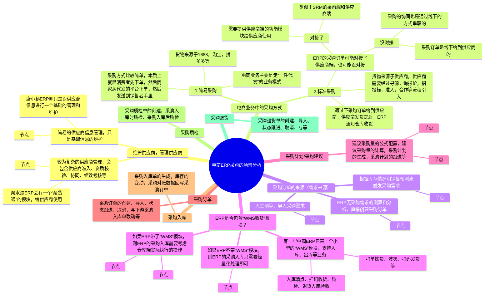
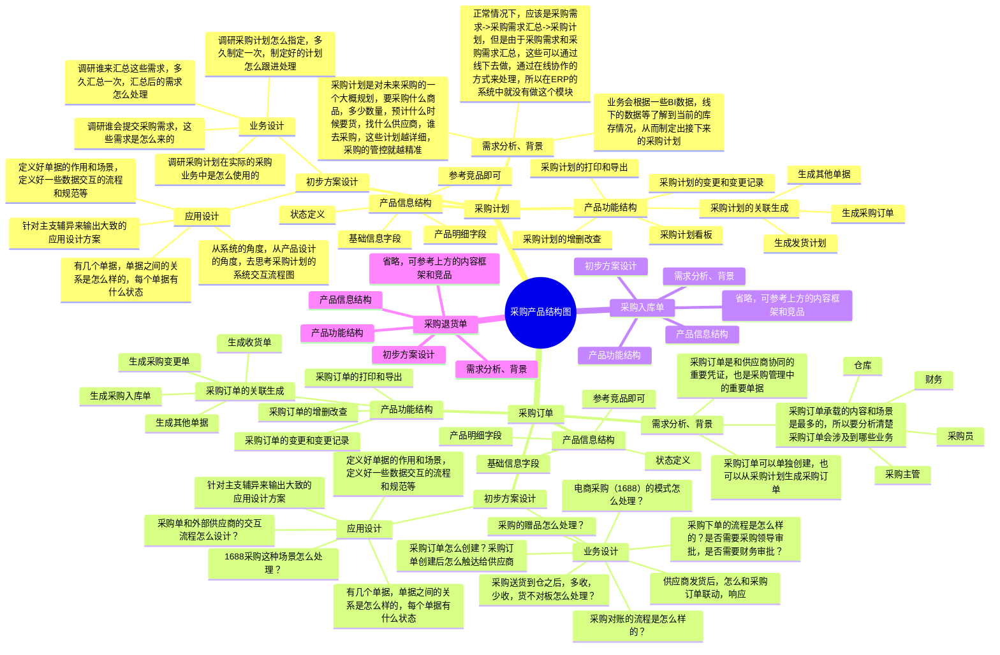
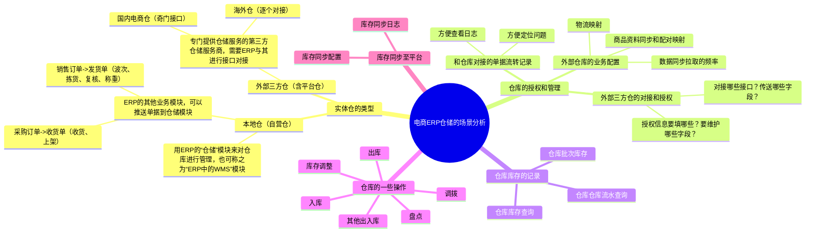
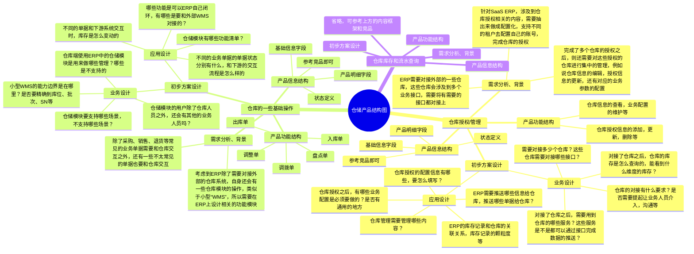
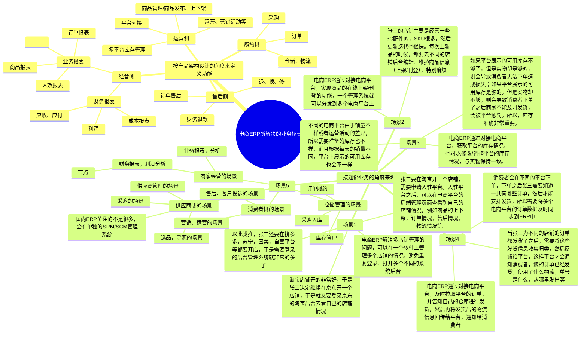
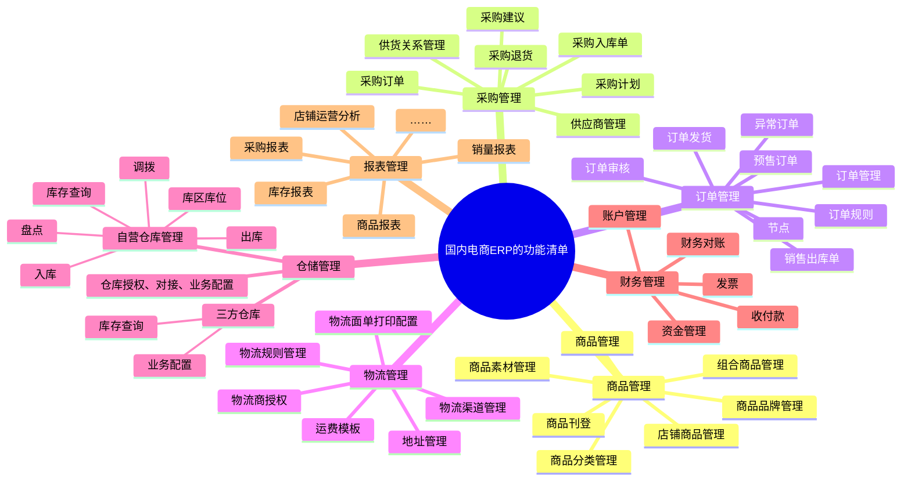
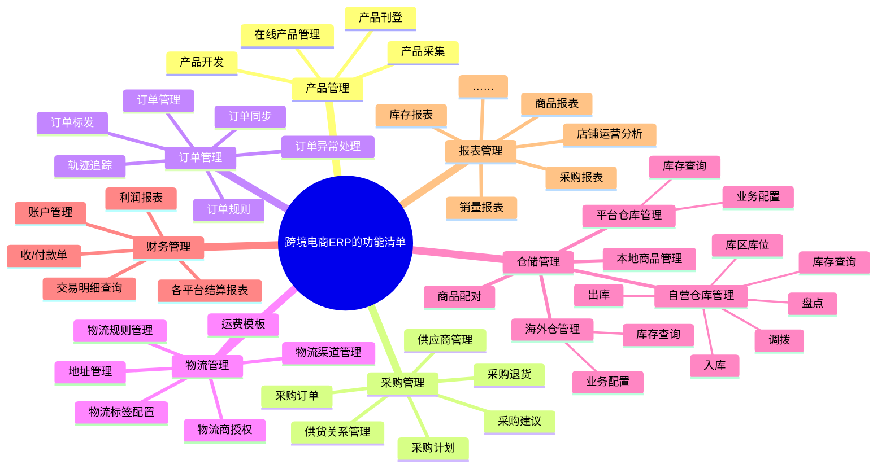
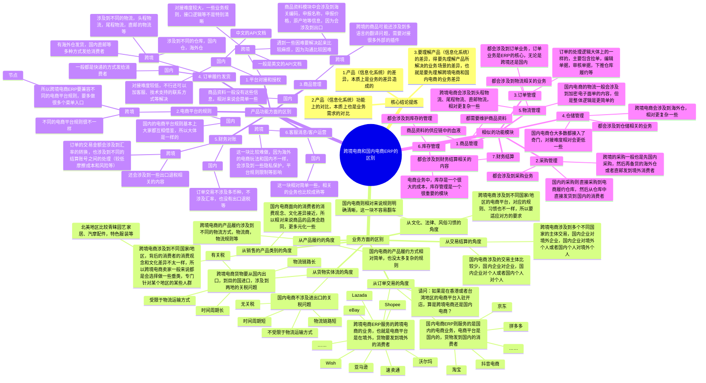

## 前言

在前面的课程中，我们讲解了什么是电商ERP，电商ERP有什么作用，也讲解了电商ERP的物流模块和订单模块，因为ERP涉及到的内容非常多，全部讲完也不太现实，所以我们还是重点围绕“供应链相关”的模块来讲解。

从“进销存”的角度来看，我们还有采购模块、仓储库存模块没有讲解，所以本节课就围绕这方面的知识来讲解，同时再通过一小节的知识串讲，把ERP项目中涉及到的业务知识都串联起来。

无论是跨境电商ERP，还是国内电商ERP，供应链相关的模块都离不开“进销存”，只要掌握了进销存系统的产品设计，那要掌握ERP的“进销存”模块的设计就不难了，无非就是增加了更多的业务场景，要考虑的上下游更多一些而已。

本课的开课时间是`**8月11日（周日） 晚上8:30**`，开课的方式是使用腾讯会议，所以请大家提前准备好相应的软件，会议链接如下：

> 维他命 邀请您参加腾讯会议
> 
> 会议主题：课程25（直播课）：电商ERP的相关知识串讲
> 
> 会议时间：2024/08/11 20:30-22:30 (GMT+08:00) 中国标准时间 - 北京
> 
> 点击链接入会，或添加至会议列表：
> 
> [https://meeting.tencent.com/dm/98nDrVLjbgQG](https://meeting.tencent.com/dm/98nDrVLjbgQG)
> 
> #腾讯会议：124-345-387
> 
> 复制该信息，打开手机腾讯会议即可参与

## 课件详细内容

本节课的内容大概会分成3个部分：

1.  电商ERP的采购模块；
2.  电商ERP的仓储库存模块；
3.  电商ERP的知识串讲；

### Part1 电商ERP的采购模块

#### 1.1 电商ERP采购的场景分析

_电商ERP的相关知识串讲-白板-1.svg)

ERP的采购模块中，最常见，最高频的单据和场景应该是：

1.  采购需求->采购计划->采购订单
2.  采购订单->采购入库单->采购完成
3.  采购入库单->采购退货单-> 采购退货完成

#### 1.2 流程图、ER图、状态机图等

_电商ERP的相关知识串讲-1.png)

采购订单推送到了仓库，可能会有两种情况，即：本地仓和三方仓。

1.  如果是本地仓，则需要在ERP的“仓储”模块中，执行相关的收货、清点、质检等，最后录入相关的数据之后再回传到采购订单中；
2.  如果是三方仓，则需要接口和三方仓对接打通，等三方仓入库之后，再回传结果给采购订单；

_电商ERP的相关知识串讲-2.png)

_电商ERP的相关知识串讲-3.png)

> 领星ERP和聚水潭ERP，针对采购入库的收货、入库模块都放在了“仓库/库存”模块下，即由仓库端的人员来操作，而不是采购端的人员操作。

| 列 1 | 列 2 |
| --- | --- |
| _电商ERP的相关知识串讲-4.png) | _电商ERP的相关知识串讲-5.png) |

_电商ERP的相关知识串讲-6.png)

| **单据** | **单据说明** | **相关逻辑** |
| --- | --- | --- |
| 采购计划 | 采购计划单是指企业为规范采购流程，精确计划采购活动而制定的一份清单，用于规划并安排采购过程。它涵盖了从识别需求到完成采购整个过程中的策略、时间和资源安排 | 一般和数据分析，销量统计，需求预测等系统挂钩，用来制定一些可预测的采购计划，减轻人工采购的工作量 采购计划单主要包括商品和服务的需求量及其对应的日期、需求分类、需求的预测和补充信息。 |
| 采购订单 | 当确认了要采购的内容后，根据相关内容创建采购订单，采购订单审核后则交给供应商，让其按订单内容进行履约 | 一个采购订单对应一个供应商，如果需要向多个供应商采购则需要创建多个采购订单；采购订单一般具有多个状态，可以便于采购人员根据不同状态的采购订单来做出后续的操作 |
| 采购收货单 | 采购收货单是指供应商发货之后，仓库按收货单进行收货、清点、并录入收货结果，等同于WMS中的ASN单 | 采购收货单一般是ERP自己包含了“WMS”模块，所以需要推送一个作业单据给该模块去执行收货处理。如果ERP不包含“WMS”模块，则可以省略此单据 |
| 采购入库单 | 采购入库单用来记录本次采购入库的明细，表示采购的货品已经入库，它也是用来生成财务应付的凭证 | 采购订单和采购入库单的关系是1:N，有些系统会采购订单直接生成采购入库单，有一些则是通过供应商的发货通知单来生成采购入库单 |
| 采购退货单 | 采购退货单是企业因商品质量问题、规格不符等原因，向供应商发起退货后完成商品出库、接收供应商退款的单据 | 采购退货单与采购单操作及功能相似，但其逻辑为退货出库，与采购单的逻辑（采购入库）相反。 采购退货单一般不会再生成采购退货出库单，而是把采购退货单既当成业务单据，也当成库存扣减的记录单据 |

_电商ERP的相关知识串讲-7.png)

#### 1.3 产品结构图

_电商ERP的相关知识串讲-白板-2.svg)

#### 1.4 产品原型图

[采购管理-含销售订单和发货订单）-西贝.rp](https://www.yuque.com/attachments/yuque/0/2025/rp/48385069/1738735812969-cd097d07-48b6-4bef-88a1-e0a5300a9bd5.rp)[万里牛ERP产品原型完整版 (1).rp](https://www.yuque.com/attachments/yuque/0/2025/rp/48385069/1738735813210-7df21959-a584-4e87-85a8-e4654f8433a4.rp)[新版ERP管理系统 V1.0.rp](https://www.yuque.com/attachments/yuque/0/2025/rp/48385069/1738735813376-35f85733-fe45-4908-bf2c-67b5c8bbeb07.rp)

### Part2 电商ERP的仓储模块

#### 2.1 电商ERP仓储的场景分析

_电商ERP的相关知识串讲-白板-3.svg)

ERP的仓库模块中，最常见，最高频的单据和场景应该是：

1.  仓库对接、授权和管理
2.  仓库的库存流水生成和库存查询
3.  仓库的一些基础操作

#### 2.2 流程图、ER图、状态机图等

_电商ERP的相关知识串讲-8.png)

_电商ERP的相关知识串讲-9.png)

> 在电商ERP中，会有2种类型的仓库：
> 
> 1.  自营实体仓/本地仓，指的是用ERP的“仓储”模块来管理自营的实体仓的业务
> 
> 1.  ERP不需要进行外部API的对接，是属于内部系统模块直接的单据联动
> 
> 2.  外部三方仓，指的是用第三方仓储来满足所需的仓储业务，如果是自己的实体仓但是外采三方WMS，也算是外部三方仓
> 
> 1.  ERP需要进行外部API的对接，要对接的接口视三方仓WMS所提供的API能力而定

| **对比维度** | **外部三方仓库** | **ERP“仓储”模块** |
| --- | --- | --- |
| **系统的使用人员** | 三方仓库的仓储人员 自营仓库的仓储人员（外采系统） | 自营仓库的仓储人员 |
| **系统集成** | 需要与第三方仓库管理系统进行集成涉及到API接口的开发与维护 | 直接集成到电商平台ERP系统 系统间数据交换更为直接和高效 |
| **功能定制** | 定制化服务可能受限，需与第三方服务商协商，依赖于API所提供的能力 | 可以根据业务需求灵活定制功能模块 更好地满足特定业务流程，不太受限于API |
| **数据处理能力** | 数据处理速度和准确性取决于第三方系统性能 | 可以优化数据处理流程，提高效率和准确性 |
| **实时性** | 实时数据更新可能受限于第三方系统的响应时间 | 实时数据更新和监控，便于快速决策 |
| **功能复杂性** | 三方仓库的WMS功能强大，可以满足很多精细化的业务需求 | 不会做太垂直、太深的功能，相对会简化、普适性很多，不太能满足过于精细化的场景 |

#### 2.3 产品结构图

_电商ERP的相关知识串讲-白板-4.svg)

#### 2.4 产品原型图

原型暂无，可参考领星和聚水潭的相关模块。

| 列 1 | 列 2 |
| --- | --- |
| _电商ERP的相关知识串讲-10.png) | _电商ERP的相关知识串讲-11.png) |

### Part3 电商ERP的知识串讲

#### 3.1 为什么需要电商ERP？

1.  电商ERP所处的位置和承担的作用。

> 电商ERP是平台和商家的桥梁，如果没有电商ERP，商家只能直接登录平台去管理自己的店铺，而有了电商ERP之后，就可以通过电商ERP去管理平台及店铺，而且可以同时管理多个。
> 
> _电商ERP的相关知识串讲-12.png)

2.  电商ERP是服务支持类系统，除了作为平台和商家的桥梁之外，自身也有很多可以拓展的业务。

> 电商ERP可以支撑电商公司的采购业务，订单履约业务（仓储、物流），财务结算业务，库存管理的业务，客户营销，商品资料管理等业务。
> 
> 这些业务都是电商上下游相关的业务，也是电商公司日常必需的业务，所以可以通俗地理解：**做电商相关的业务，一旦规模大了一些之后，必然是会需要用到ERP的，要么用自研，要么用三方SaaS产品，要么外包请人研发。**
> 
> 所以延伸一下，有很多SaaS公司都会做电商ERP类的SaaS产品，因为用户群体足够多，产品可支撑的场景也足够丰富，客单价就不会太低。

3.  通过一个“开网店”的案例，了解电商ERP能做哪些事情？

> 店长小明想开一家网店，在商品上架销售前，小明做了以下准备工作，①在淘宝注册一个店铺；②选择想要做的品类和卖的商品，并维护商品信息；③找合作快递公司，用于发货给客户；④找仓库，用于存储采购的商品；⑤店长还需要关注店铺各业务的运转情况，即查看销售、采购、库存、资金的报表。
> 
> 除此之外，还招了6个岗位一起合作：①采购员，负责采购商品补充库存；②售前客服，主要为买家介绍商品特性和解答销售方面的问题，买家下单后审核订单；③发货员，对通过审核的订单进行配货打包，进行发货；④售后客服，主要为买家解答售后方面的问题，并审核买家发起的退换货申请；⑤仓库管理员，记录商品的出入库和管理商品库存；⑥财务员，记录销售订单和采购的资金出入。
> 
> 团队到位了，可以开展工作了。采购员根据店长选好的商品进行采购工作，联系供应商采购商品，即提交采购订单。采购订单的货品到了之后，需要仓库管理员记录采购入库单，并为商品安排库位和增加商品的库存。商品入库后，采购员和供应商登记结算单。如果到货的商品有问题则进行退货处理，即提交采购退货单，采购商品出库时需要仓库管理员记录采购退货出库单，并减少退货商品的库存。
> 
> 至此，把商品上架在淘宝，就可以开始接单了。
> 
> 当买家在淘宝下单并支付后，订单的处理就交给售前客服和发货员了。首先售前客服会审核订单，如有注意事项可对订单进行备注，例如有什么赠品、指定发什么快递等，通过审核的订单即流转给发货员。发货员在仓库中进行配货并打包，最后打印快递单，进行发货。发货时，需要仓库管理员记录销售出库单，并减少销售商品的库存。
> 
> 另外小明还希望发展一下线下大客户，所以有的售前客服在线下开拓客户。客户可直接和售前客服下单，售前客服创建订单，然后流转给发货员。发货员在仓库中进行配货并打包，最后打印快递单，进行发货。发货时，需要仓库管理员记录销售出库单，并减少销售商品的库存。
> 
> 以上是正向的交易流程，买家下单，商家发货。当买家提出退换货的时候，就需要售后客服介入。买家在淘宝提交了退换货申请，售后客服进行审核是否同意退换货，审核通过后，买家寄回商品。寄回商品到达指定退货仓库后，仓库管理员记录退货入库单，并更新商品库存。如果是退货，售后客服进行退款处理，如果是换货，售后客服根据售后单，手动创建销售订单，然后该销售订单正常发货。
> 
> 仓库管理员日常工作除了记录销售订单、采购订单的出入库单外，平时需要维护仓库的基础数据，库区、库位等，并且记录商品的摆放位置。每次商品出入库都会更新库存，定期查看各商品的库存数量。还会为了保证商品数量安全，定期对仓库的商品数量进行盘点。如果商品的成本近期发生变化，还会对商品进行调价。当前小明拥有两个地方的仓库，有时候需要进行商品调拨，即仓库管理员把A商品从甲仓库调拨到乙仓库，调拨出库和入库时也都需要记录调拨出库单和入库单。
> 
> 以上是采购订单和销售订单的场景，每次商品出入库，都伴随着资金的收支变化，所以财务员有以下日常工作。首先，财务员需要维护资金账户基础数据，其他主要工作就是收款、付款、账目对账检查。
> 
> 收款主要是收取销售订单的钱，有三种收款方式：现金收款、充值款消费（预收款）、赊账（记录应收款）。现金收款是买家下单时进行支付费用，例如淘宝订单。充值款消费是买家提前充值费用存在该客户的账户上，然后下单时进行扣减，主要适用于线下订单。赊账是买家下单时不进行付款，客户账上也没有充值款可以扣减，这样就会记录该客户的应收款，然后定期收款，并记录收款单，适用于月结的客户。
> 
> 付款是支付给供应商采购订单的货款和支付给快递公司的快递费。有三种支付方式：现金支付、充值款支付（预付款）、赊账（记录应付款）。现金支付是采购订单到货后现金支付货款给供应商。充值款支付是预存充值费用在某个供应商那，每次采购单到货后选择使用充值款支付货款。赊账是采购订单到货后不支付货款给供应商，然后记录该供应商的应付款，定期付款，并记录付款单，适用于月结的供应商。
> 
> 快递费目前是选择月结的方式结算。为了保证账目的准确，财务员会定期进行快递单对账。
> 
> 有时候需要转移资金，即财务员把资金从A账户转到B账户，则进行转账。财务员在有资金往来的时候都会记录资金流水。

_电商ERP的相关知识串讲-13.webp)

2.  电商ERP能解决的主要业务场景是哪些？

_电商ERP的相关知识串讲-白板-5.svg)

#### 3.2 国内电商ERP的主要功能模块（待补充）

_电商ERP的相关知识串讲-白板-6.svg)

| 列 1 | 列 2 | 列 3 |
| --- | --- | --- |
| _电商ERP的相关知识串讲-14.png) | _电商ERP的相关知识串讲-15.png) | _电商ERP的相关知识串讲-16.png) |

#### 3.3 跨境电商ERP的主要功能模块

_电商ERP的相关知识串讲-白板-7.svg)

| 列 1 | 列 2 | 列 3 | 列 4 |
| --- | --- | --- | --- |
| _电商ERP的相关知识串讲-17.png) | _电商ERP的相关知识串讲-18.png) | _电商ERP的相关知识串讲-19.png) | _电商ERP的相关知识串讲-20.png) |

#### 3.4 跨境电商和国内电商ERP的区别

_电商ERP的相关知识串讲-白板-8.svg)

## 课后作业

> 分别体验一下跨境电商ERP和国内电商ERP，对比相关的功能菜单，理解大概的业务模式是怎么样的，后续有需要做这一块的时候再深入学习。
> 
> 从跨境ERP和国内电商ERP中各挑选一个代表，整理出他们的功能模块以及补充功能模块解决了什么问题，用脑图的形式梳理一遍，加深印象。
> 
> 国内电商ERP：聚水潭，万里牛，吉客云
> 
> 跨境电商ERP：店小秘，领星，妙手

## **​**