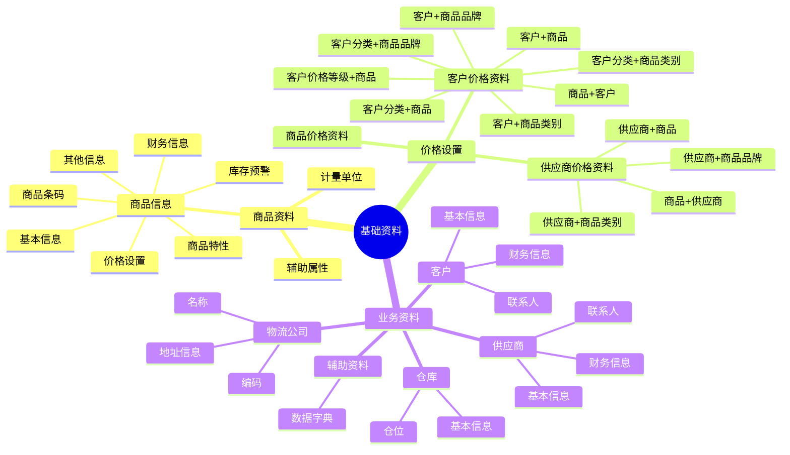
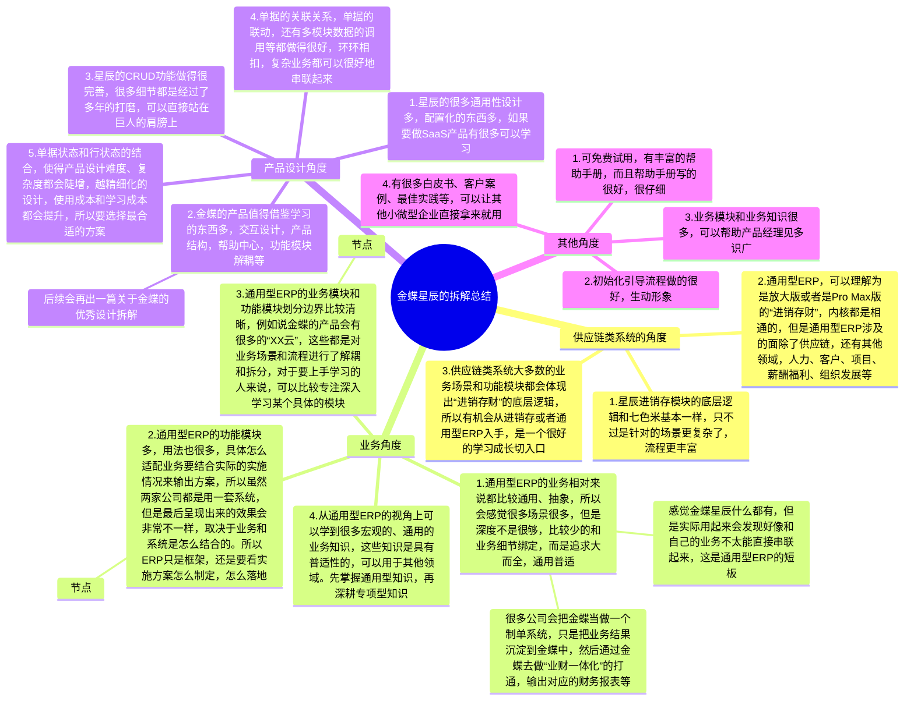

**前言**  
通过前面的课程学习，我们知道了ERP系统在现在已经演化成了一个“很宽泛”的系统，大家都在说ERP，但是ERP里的功能和支撑的业务可能各不相同。所以我们一般会加一些定语来让自己的表达更加的清晰，例如说：  
1电商ERP，例如说旺店通ERP，聚水潭ERP，万里牛ERP等；  
2跨境电商ERP，例如说领星ERP，店小秘ERP，马帮ERP等；  
3通用型ERP，例如说SAP，Oracle，金蝶，用友等；  
4生产型ERP，例如说SAP，Oracle，鼎捷等；  
5财务型ERP，例如说金蝶，用友等；  
6公司自用型ERP，各公司内部使用的综合型后台管理系统；  
7……  
不同领域，不同类型的ERP基本上都会有“进销存财”的身影，当然具体到更细节的业务流程和产品功能模块还是会有一些不太一样。所以本节课我们就以通用型ERP的典型代表“金蝶ERP”作为我们的拆解对象，一起来学习一下金蝶ERP中的“进销存模块”是怎么设计的，有什么优秀的地方是值得借鉴参考的。  
本节课为录播课程，没有腾讯会议邀请链接，可以先查看下方的课程文稿，然后再学习课程视频，最后完成相关的课后作业即可。  
**课件详细内容**  
本节课的内容大概会分成4个部分：  
1金蝶ERP·星辰的产品介绍；  
2金蝶ERP·星辰的相关操作演示；  
3金蝶ERP·星辰的进销存功能模块拆解；  
4金蝶ERP·星辰的拆解总结；  
**Part1 金蝶ERP·星辰的产品介绍**  
**1.1 金蝶的介绍**  
金蝶集团，成立于1993年，是中国领先的企业管理软件和互联网服务提供商之一。由徐少春先生创立，公司总部位于中国深圳。  
金蝶的业务发展经历了多个阶段。最初，金蝶专注于为中小企业提供财务管理软件，随后逐步扩展到企业资源计划（ERP）系统。随着互联网技术的发展，金蝶进一步将业务拓展到云计算服务，推出了金蝶云等一系列云服务产品，以满足企业在不同发展阶段的需求。  
金蝶目前的重心都在发力“云产品”，之前的老版本（K/3、KIS、EAS等）会逐步淘汰，所以我们就重点介绍一下它的云产品，包含以下：  
  

| **适用的公司规格** | **对应的云产品** | **官网介绍截图** |
| --- | --- | --- |
| 微型（初创）企业 | 精斗云 云会计 | _拆解金蝶ERP·星辰的进销存模块-1.png) |
| 小型企业 | 云星辰 | _拆解金蝶ERP·星辰的进销存模块-2.png) |
| 中型（高成长型）企业 | 云星空 | _拆解金蝶ERP·星辰的进销存模块-3.png) |
| 大型企业 | 云星瀚 | _拆解金蝶ERP·星辰的进销存模块-4.png) |

  
  

  
  

  
  

  
  

金蝶的优势在于其深厚的行业经验和对本土市场的深刻理解。金蝶的软件和服务紧密结合中国企业的管理实践，能够提供定制化的解决方案。此外，金蝶在技术创新方面也不断投入，推动产品的持续升级和优化。金蝶云服务的推出，更是体现了金蝶在适应数字化转型趋势上的努力。  
然而，金蝶也面临着一些风险和挑战。随着国际巨头如SAP、Oracle等在中国市场的竞争加剧，金蝶需要不断提升自身的竞争力。同时，随着云计算、大数据等技术的快速发展，金蝶需要持续创新，以保持其在行业中的领先地位。此外，数据安全和隐私保护也是金蝶需要重点关注的问题，特别是在提供云服务的过程中。  
**1.2 金蝶云星辰的介绍**  
金蝶云·星辰基于金蝶云·苍穹云原生PaaS平台构建，聚焦小型企业在线经营和数字化管理，提供财务云、税务云、进销存云、零售云、订货商城等SaaS服务，支持企业拓客开源、智能管理、实时决策；金蝶云·星辰还提供轻量级PaaS平台和全面的API接口，广泛连接生态伙伴，为小微企业提供一站式服务，助力企业快速成长。  
  

_拆解金蝶ERP·星辰的进销存模块-5.png)

  
金蝶云星辰面向的是小微型公司/企业，包含的内容模块比七色米进销存要多，能适配和兼容的行业、领域也更多。而且金蝶一直主打的就是“业财一体化”，所以会有很多财务相关的内容，财务、税务模块做得也会相对更加专业一些。  
同时，金蝶云星辰也有零售、在线商城，生产管理等业务场景，所以基本具备通用型ERP的相关模块。  
  

_拆解金蝶ERP·星辰的进销存模块-6.png)

  
  

_拆解金蝶ERP·星辰的进销存模块-7.png)

  
星辰会有专业版、标准版、旗舰版三个版本，如果我们想要研究多一些的功能模块，那么选择“专业版”；如果想要简单清爽，那么就用“标准版”。  
  

_拆解金蝶ERP·星辰的进销存模块-8.png)

  
  

_拆解金蝶ERP·星辰的进销存模块-9.png)[开启金蝶精斗云帐套-100万家企业用户的共同选择 \_ 金蝶精斗云欢迎加入精斗云大家庭，超过100万家中小企业在精斗云高效管理生意，IDC认证：小微企业财务云服务市场占有率第一金蝶小微企业云服务平台,提供财务软件\_金蝶云星辰\_ERP软件\_ERP财务软件等SaaS服务](https://www.jdy.com/regwork/)

### Part2 金蝶ERP·星辰的相关操作演示

#### 2.1 体验供应链类系统的流程

### _拆解金蝶ERP·星辰的进销存模块-10.png)

1.  登录后查看首页，侧边栏，顶部导航栏，侧边悬浮框等信息，大概扫一眼有多少菜单，有哪些目录，模块等；
2.  先从基础设置和基础数据（资料）入手，大概看一下配置项有哪些，基础数据维护是否复杂；
3.  供应链类的系统一般先创建基础资料，例如说：商品资料，供应商资料，客户资料，维护仓库和物流等信息；
4.  然后分别快速跑完“进销存”三大核心业务流程；

1.  进：进货（也就是采购）到入库的流程；
2.  销：销售订单到出库的流程；
3.  存：库存查询，库存出入库，库存调整，库存盘点等流程；

5.  快速跑完相关的流程之后，则可以进入第二轮的深度体验和拆解了。可以针对单个模块进行深入挖掘，尽量按从大到小的方式进行拆解、记录。（具体可以看下方的功能模块设计讲解）

1.  单据流转关系是怎么样的？先从哪个模块操作，然后会流转到哪个模块？
2.  各种业务实体的关系，是一对一还是一对多，其中业务实体可以是客户和客户分类，采购单和入库单，单据和单据明细等；
3.  单据有哪些状态，状态流转关系是怎么样的？画出状态机图，也称之为状态流转图，状态对应的操作项；
4.  具体的单据中有哪些字段，哪些业务逻辑，哪些校验逻辑，哪些交互设计、文案设计，UI设计的亮点和可借鉴学习的点等；

#### 2.2 基础设置和基础资料

| 列 1 | 列 2 |
| --- | --- |
| _拆解金蝶ERP·星辰的进销存模块-11.png)  基础设置就是大概扫一眼，可以知道会有哪些设置，然后大概分成了几大类即可，不需要深入去研究和体验。 | _拆解金蝶ERP·星辰的进销存模块-12.png)  基础资料比较重要，重点还是商品、供应商、客户、仓库、物流、价格等。 |

#### 2.3 采购相关的业务

| 列 1 | 列 2 |
| --- | --- |
| _拆解金蝶ERP·星辰的进销存模块-13.png) | 采购申请，采购订单，采购入库，采购退货，这些单据的业务流转关系是怎么样的？实体关系图是怎么样的？  采购明细表，采购汇总表，采购订单汇总表，分别是干嘛用的？ |

#### 2.4 销售相关的业务

| 列 1 | 列 2 |
| --- | --- |
| _拆解金蝶ERP·星辰的进销存模块-14.png) | 销售报价，销售订单，销售出库，销售退货，销售退货申请，销售换货申请，这些单据的业务流转关系是怎么样的？实体关系图是怎么样的？  销售明细表，销售汇总表，销售订单跟踪表，销售订单汇总表，分别是干嘛用的？ |

#### 2.5 库存相关的业务

| 列 1 | 列 2 |
| --- | --- |
| _拆解金蝶ERP·星辰的进销存模块-15.png) | 库存相关的单据有哪些？这些单据是怎么影响库存？  库存的查询有多少个维度，是怎么展示库存数据的？ |

### Part3 金蝶ERP·星辰的进销存功能模块拆解

#### 基础资料

_拆解金蝶ERP·星辰的进销存模块-白板-1.svg)

#### 采购相关功能模块拆解​

| 单据 | 单据介绍 | 特殊说明/备注 |
| --- | --- | --- |
| [采购申请单](https://vip.kingdee.com/article/513376029944043520?productLineId=35&isKnowledge=2&lang=zh-CN) | 用于正式采购前，需要发起申请，等相关部门审核通过后才正式下采购订单的环节。 | 1）企业设置专门的采购部门，负责库存商品及内部办公用品的采购。当其他部门能有采购需求时，提交“采购申请单”给采购部门。 2）采购部门接收到来自其他各部门的采购申请后，集中进行采购。 3）采购员根据以销定购、智能补货、库存预警等各种分析数据得出需要补货的商品数量后，录入采购申请单，提交管理员审核。 |
| [采购订单](https://vip.kingdee.com/article/517339995603175168?productLineId=35&isKnowledge=2&lang=zh-CN) | 可以理解为是采购合同，用于记录与供应商确认好的采购商品明细、价格、交货时间、账期等信息，作为双方交易的依据，后续交货入库也是基于这个订单做下推。​ | 当采购下单与收到商品入库不是同时进行时，建议使用采购订单。当采购员根据企业的采购需求，向供应商发出采购要求后，供应商可能需要一段时间后才能发货或者发货后途中运输几天才能到达仓库，此时需要录制采购订单，当实际到货后，将采购订单转为采购入库单，增加仓库的库存。采购订单不影响实际的库存，只是记录预期的交易。 |
| [采购入库单](https://vip.kingdee.com/article/517340891674281728?productLineId=35&isKnowledge=2&lang=zh-CN) | 用于采购订单下达后，货物到仓，需要把采购订单下推成采购[入库](https://www.kingdee.com/product/stellar_inventory.html?utm_source=shequ)，填写到库商品的信息，完成库存的更新及影响应付款。或者无需下采购订单，直接增加库存及应付的入库场景。 | 在金蝶的体系中，采购入库单是增加库存的凭证，只有入库单生成了才会增加库存，表示货物已经入库了 |
| [采购退货单](https://vip.kingdee.com/article/517354340223550720?productLineId=35&isKnowledge=2&lang=zh-CN) | 用于当商品[入库](https://www.kingdee.com/product/stellar_inventory.html?utm_source=shequ)完成后，由于质量问题或者其他原因，需要将货物退货给供应商，减少库存的场景。 | 星辰提供三种方式进行采购退货业务处理： 一是直接打开【[采购管理](https://www.kingdee.com/product/stellar_inventory.html?utm_source=shequ)】→【采购退货单】，手工录入供应商，退货商品及数量、金额。 二是在采购入库单列表中，找到对应的采购入库单，勾选后点“退货”。 三是打开采购退货单，选择供应商后点“选源单”，打开采购入库单选择窗口，选择对应的采购入库单。 |

_拆解金蝶ERP·星辰的进销存模块-16.png)

#### 销售相关功能模块拆解

| 单据 | 单据介绍 | 特殊说明/备注 |
| --- | --- | --- |
| [销售订单](https://vip.kingdee.com/article/426101358354140416?productLineId=35&isKnowledge=2&lang=zh-CN) | 销售订单是购销双方共同签署的、确认购销活动的标志，是详细记录企业物资的循环流动轨迹、累积[企业管理](https://www.kingdee.com/product/small?utm_source=shequ)决策所需要的经营运作信息的关键。 | 当销售下单与商品[出库](https://www.kingdee.com/product/stellar_inventory.html?utm_source=shequ)不是同时进行时，建议使用销售订单。当业务员接到客户订单后，可能需要主管审核价格等信息后，订单才能生效，或者仓库可能需要一段备货时间后才能发货，此时需要录制销售订单，当实际发货时，仓库销售订单转为销售出库单，减少仓库的库存。销售订单不影响实际的库存，只是记录预期的交易。 |
| [销售出库单](https://vip.kingdee.com/article/426102064473860352?productLineId=35&isKnowledge=2&lang=zh-CN) | 销售[出库](https://www.kingdee.com/product/stellar_inventory.html?utm_source=shequ)主要应用于销售下单后发出货物的场景，同时还能完成收款/抵扣/抹零的动作。 | 在金蝶的体系中，销售出库单单是扣减库存的凭证，只有出库单生成了才会扣减库存，表示货物已经出库了 |
| [销售退货单](https://vip.kingdee.com/article/426111334673955584?productLineId=35&isKnowledge=2&lang=zh-CN) | 销售完成之后，由于客户不满意或者其他原因而发起的退货，货物会重新回到仓库，增加库存 | 1）关联源单的销售退货单，也就是先做了销售[出库](https://www.kingdee.com/product/stellar_inventory.html?utm_source=shequ)，再针对销售出库做销售退货，适用于常规的售后管理场景，只能退之前发出的商品。 2）无源单的销售退货，也就是没有源单，是直接手动新增的销售退货。 例如：出库单是录在其他系统，后面切换了星辰，需要在星辰里做退货 |
| [销售退货申请](https://vip.kingdee.com/article/426104390903348992?productLineId=35&isKnowledge=2&lang=zh-CN) | 销售退货申请主要应用于销售发货后，如需发起退货要先发起申请，申请通过才允许退货的场景。 | 某些企业处理退货业务比较谨慎，需要先申请，审批通过后才能进行退货，当客户提出退货时，业务员可以通过销售退货申请单记录客户的退货需求，审批通过后，通知客户进行退货，仓库收到退货，下推生成正式的销售退货单，验收[入库](https://www.kingdee.com/product/stellar_inventory.html?utm_source=shequ)。 |
| [销售换货申请](https://vip.kingdee.com/article/426103032535747840?productLineId=35&isKnowledge=2&lang=zh-CN) | 企业在接到客户的换货申请时，若同意对方的换货申请，可以在《销售换货申请》单中，录入客户的退换货原因，退回（换入）的商品明细和换出的商品明细。 | 企业在发生换货业务时，可通过销售换货申请单进行处理。 本单可以处理以下三种业务场景： 1、 先退货（换入）、后发货（换出）。 2、 先发货（换出）、后退货（换入）。 3、 现场换货，同时发货（换出）和退货（换入）。 |

_拆解金蝶ERP·星辰的进销存模块-17.png)

#### 库存相关功能模块拆解

| 单据 | 单据介绍 | 特殊说明/备注 |
| --- | --- | --- |
| [库存查询表](https://vip.kingdee.com/article/522834052488142592?productLineId=35&isKnowledge=2&lang=zh-CN) | 库存查询表是根据当前的过滤条件，展示筛选出的商品库存情况，包括即时库存和可用库存。 | _拆解金蝶ERP·星辰的进销存模块-18.png) |
| [库存横向查询表](https://vip.kingdee.com/article/523086366029135616?productLineId=35&isKnowledge=2&lang=zh-CN) | 作为用户，想要在查询库存的时候按照横向展示仓库的样式看到仓库的库存情况，在有多个仓库的情况下，这样的展示会比较简单直观。【库存查询表】是按照仓库竖向展示的，【库存横向查询表】是按照仓库横向展示的，提供了不同的查询展示方式，满足不同客户的需求。 | _拆解金蝶ERP·星辰的进销存模块-19.png) |
| [预计可用库存表](https://vip.kingdee.com/article/523096432358715648?productLineId=35&isKnowledge=2&lang=zh-CN) | 预计可用库存表是根据当前的过滤条件，展示筛选出的商品库存情况，包括即时库存、预计可用库存、待入库存和待[出库](https://www.kingdee.com/product/stellar_inventory.html?utm_source=shequ)存。 | _拆解金蝶ERP·星辰的进销存模块-20.png) |
| [商品收发明细表](https://vip.kingdee.com/article/523098665993553664?productLineId=35&isKnowledge=2&lang=zh-CN) | 商品收发明细表根据当前的过滤条件，按单据展示筛选出的商品的出入库业务明细情况，是[进销存](https://www.kingdee.com/product/stellar_inventory.html?utm_source=shequ)最常用的报表之一。 ​ 等同于“库存流水表” | _拆解金蝶ERP·星辰的进销存模块-21.png) |
| [商品收发汇总表](https://vip.kingdee.com/article/523099651856320256?productLineId=35&isKnowledge=2&lang=zh-CN) | 商品收发汇总表是根据当前的过滤条件，展示筛选出的商品的出入库数据统计，是[进销存](https://www.kingdee.com/product/stellar_inventory.html?utm_source=shequ)最常用的报表之一。 等同于“时间段内商品的汇总变化表” | _拆解金蝶ERP·星辰的进销存模块-22.png) |
| [批次跟踪表](https://vip.kingdee.com/article/525319764743593728?productLineId=35&isKnowledge=2&lang=zh-CN) | 由于批次商品在管理上的特殊性，批次商品在业务流程中往往需要单独进行跟进。跟踪批次商品的全流程，包括[入库](https://www.kingdee.com/product/stellar_inventory.html?utm_source=shequ)（采购、盘盈、调拨、其他入库等）、[出库](https://www.kingdee.com/product/stellar_inventory.html?utm_source=shequ)（销售、盘亏、调拨、其他出库等）。 ​ 等同于“批次库存流水表” | _拆解金蝶ERP·星辰的进销存模块-23.png) |
| [批次状态表](https://vip.kingdee.com/article/380458185909506816?productLineId=35&isKnowledge=2&lang=zh-CN) | 是用于展示批次商品的库存状态，同时支持查询保质期商品的库存状态，起到保质期预警的作用。可查看： （1）批次对应的保质期时间 （2）商品各批次的剩余库存数量 ​ 等同于“批次库存查询表” | _拆解金蝶ERP·星辰的进销存模块-24.png) |
| [序列号跟踪表](https://vip.kingdee.com/article/371721854522117632?productLineId=35&isKnowledge=2&lang=zh-CN) | 序列号商品一般都是价值比较高，需要重点跟踪出[入库](https://www.kingdee.com/product/stellar_inventory.html?utm_source=shequ)情况的商品，序列号跟踪表可以用于查询序列号商品的一个出入库详细情况，详细记录每一个序列号的[出库](https://www.kingdee.com/product/stellar_inventory.html?utm_source=shequ)和入库详情。 ​ 等同于“SN库存流水表” | _拆解金蝶ERP·星辰的进销存模块-25.png) |
| [序列号状态表](https://vip.kingdee.com/article/371720739977455360?productLineId=35&isKnowledge=2&lang=zh-CN) | 启用了序列号管理的商品，一般都是需要重点关注的商品（如单价比较高），序列号状态表是用于快速查询序列号商品是否在库或者被占用，用于跟踪序列号商品的在库状态的报表，便于用户追踪序列号商品流程过程、价格。 ​ 等同于“SN库存查询表” ​ | _拆解金蝶ERP·星辰的进销存模块-26.png) |
| [锁库表](https://vip.kingdee.com/article/525331635295002368?productLineId=35&isKnowledge=2&lang=zh-CN) | 客户下完销售订单后，需要对订单的库存进行锁定，不能挪为他用，若商品启用批次，需要能针对批次进行锁定；部分商贸型企业，根据现有库存量和采购在途量来录销售订单并对订单进行锁定（基于可用库存进行锁定，举例场景可用库存=即时库存+采购在途） ​ | _拆解金蝶ERP·星辰的进销存模块-27.png) |

### Part4 金蝶ERP·星辰的拆解总结

_拆解金蝶ERP·星辰的进销存模块-白板-2.svg)

## 课后作业

> 注册体验一下金蝶星辰ERP，结合课程所讲的内容走一遍相关的业务流程，同时自己梳理一遍业务流程图和单据的实体关系图。同时也记录下你觉得不错的产品功能设计，或者是让你感觉很惊艳、很受启发的一些东西。