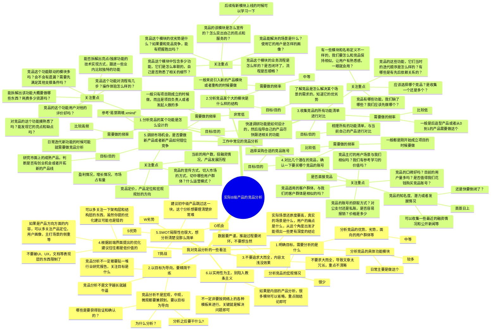

## 前言

从2023年开始，因为工作的原因我开始频繁接触金蝶相关的产品，包含金蝶的星辰、星瀚、苍穹等，然后随着深入的体验和钻研学习，我发现金蝶有非常多做得很棒，很突出的点，这些点解答了很多我刚入产品经理行业时遇到的困扰和疑惑，同时也让我意识到了“见多识广”的重要性。

产品经理经常会去做竞品调研，去学习和借鉴竞品的方案等，如果能找到一个合适的、优秀的竞品，无疑就是直接站在了巨人的肩膀上，可以达到事半功倍的效果。

而金蝶的诸多云产品，都是可以作为大多数供应链产品或者B端产品经理直接参考借鉴的竞品，也就是说金蝶的产品其实就是我们想要找到的那个“巨人”。

所以我提出了一个口号：**遇事不决学金蝶**。鼓励大家多研究金蝶，多体验金蝶，多向金蝶学习，那么这节课就来给大家拆解一下金蝶的产品到底哪里做得好，有哪些是值得我们学习的。

> 本节课为录播课程，没有腾讯会议邀请链接，可以先查看下方的课程文稿，然后再学习课程视频，最后完成相关的课后作业即可。

## 课件详细内容

本节课的内容大概会分成4个部分：

1.  金蝶及其主要产品的介绍；
2.  产品经理的竞品调研主要调研什么？
3.  金蝶可学之处及演示分享等；
4.  金蝶的一些优质资源分享；

### Part1 金蝶及其主要产品的介绍

金蝶集团，成立于1993年，是中国领先的企业管理软件和互联网服务提供商之一。由徐少春先生创立，公司总部位于中国深圳。

金蝶的业务发展经历了多个阶段。最初，金蝶专注于为中小企业提供财务管理软件，随后逐步扩展到企业资源计划（ERP）系统。随着互联网技术的发展，金蝶进一步将业务拓展到云计算服务，推出了金蝶云等一系列云服务产品，以满足企业在不同发展阶段的需求。

[这只金色蝴蝶，穿越了30年](https://mp.weixin.qq.com/s/bkqXR3uqGiRIsU75daWspw)

| **时间轴** | **重点信息** | **备注** |
| --- | --- | --- |
| 1993-2001 | 第一次转型：从DOC到Windows | 1994年，金蝶打出“用金蝶软件，打天下算盘”的广告语 |
| 1996 | 1996年，金蝶发布中国第一个基于Windows平台的财务软件一金蝶财务软件V2.51 For Windows，被中国软件评测中心评为中国首家优秀级Windows版财务软件 |  |
| 2001-2011 | 第二次转型：从财务软件到ERP | 2002年，金蝶并购开思，稳居中国ERP龙头地位 |
| 2001 | 2001年金蝶在香港联交所创业板挂牌上市，成为国内第一个在海外上市、登陆国际资本市场的独立软件厂商。并在2005年转主板，股票代码0268.HK | ​ |
| 2007 | 2007年，金蝶旗下在线记账及商务管理平台“youshang.com” 正式上线，率先试水Saas云服务市场 | “youshang.com”正式上线 |
| 2011--至今 | 第三次转型：从ERP到企业云服务 | ​ |
| 2011 | 2011年金蝶提出了以移动互联网、社交网络、云计算等新兴技术为依托的“云管理战略”，进行第三次转型 | ​ |
| 2014 | 从2014年起，徐少春化身五四热血青年，不断破旧立新，砸掉过往陈旧的产品和观念，发布新技术、新产品、新理念 | 砸掉PC：发布云之家移动工作平台 砸掉传统ERP：推出金蝶云ERP |
| 2018 | 2018年，金蝶正式推出PaaS平台“金蝶云•苍穹” | ​ |
| 2021 | 2021年，发布大型企业SaaS应用"金蝶云•星瀚” | ​ |
| 2022年 | 2022年，金蝶正式对外发布重量级HR SadS产品一一金蝶云•星瀚人力云 | ​ |

金蝶目前的重心都在发力“云产品”，之前的老版本（K/3、KIS、EAS等）会逐步淘汰，所以我们就重点介绍一下它的云产品，包含以下：

| **适用的公司规格** | **对应的云产品** | **官网介绍截图** |
| --- | --- | --- |
| 微型（初创）企业 | 精斗云 云会计 | _遇事不决学金蝶--金蝶ERP有何可学之处_-1.png) |
| 小型企业 | 云星辰 | _遇事不决学金蝶--金蝶ERP有何可学之处_-2.png) |
| 中型（高成长型）企业 | 云星空 | _遇事不决学金蝶--金蝶ERP有何可学之处_-3.png) |
| 大型企业 | 云星瀚 | _遇事不决学金蝶--金蝶ERP有何可学之处_-4.png) |
| 大型企业 | 苍穹 金蝶的PaaS平台（低代码平台） | _遇事不决学金蝶--金蝶ERP有何可学之处_-5.png) |
| 其他企业（其他产品） | 其他产品 | _遇事不决学金蝶--金蝶ERP有何可学之处_-6.png) |

### Part2 产品经理的竞品调研主要调研什么？

#### 2.1 为什么做竞品调研？主要会调研什么？

产品经理进行竞品调研是因为他们需要了解市场上的竞争对手，以及他们提供的产品或服务。竞品调研的目的是多方面的，以下是一些主要的目的和帮助：

1.  **了解市场**：通过竞品调研，产品经理可以了解当前市场上的产品或服务，以及它们如何满足用户需求。
2.  **识别优势和劣势**：通过比较，产品经理可以识别自己产品的优势和劣势，从而制定策略来强化优势或改进劣势。
3.  **发现机会**：调研可以帮助产品经理发现市场中未被满足的需求，或者竞争对手的弱点，从而找到新的市场机会。
4.  **创新启示**：竞品调研可以为产品经理提供创新的灵感，包括产品设计、功能、营销策略等。
5.  **用户洞察**：通过分析竞品的用户反馈，产品经理可以更好地理解目标用户群体的偏好和需求。
6.  **市场趋势**：竞品调研有助于产品经理把握市场趋势和发展方向，从而做出更前瞻性的决策。
7.  **建立基准**：通过竞品调研，可以建立性能、功能和用户体验等方面的基准，用以衡量和提升自己的产品。

竞品调研是一个持续的过程，需要定期进行以适应市场的变化。产品经理应该使用各种工具和方法，如市场报告、用户访谈、在线分析等，来收集和分析竞品信息。

> 我的一个观察和想法：
> 
> “人人都是产品经理”或者其他同类的产品社区网站中，分享的竞品报告或者拆解报告，绝大多数在日常工作中都用不上。
> 
> 关于实际中的竞品分析一般是怎么做的，我建议看一下这一篇文章：
> 
> [1.5万字深度雄文：这才是实际工作中的竞品分析](https://coffee.pmcaff.com/article/3410368600815744/pmcaff?utm_source=forum&newwindow=1)

我个人总结的，实际工作中B端产品经理会做的竞品分析：

_遇事不决学金蝶--金蝶ERP有何可学之处_-白板-1.svg)

#### 2.2 从金蝶的产品上可以调研到什么？

1.  调研某些产品方案、功能模块应该如何设计

> 这是产品经理做竞品调研最常做的事情，说白了就是“找参考，找借鉴”……
> 
> 要做一个B端产品的首页应该怎么做？
> 
> 要做一个新用户指引应该怎么做？
> 
> 要做一个消息通知，消息中心应该怎么做？
> 
> 要做一个权限管理的功能，应该怎么做？
> 
> 要做一个进销存的功能，参考一下金蝶是怎么设计的？
> 
> 要做一个自定义打印的功能，参考一下金蝶是怎么设计的？
> 
> ……

2.  调研某些功能模块的UI/交互设计、表现形式应该如何设计

> 在一些团队中，没有专业的UI和交互，产品经理需要自己设计一些表现层的东西，需要参考借鉴竞品
> 
> 要做一个自定义列的功能，要怎么设计？
> 
> 要做一个异步导入和异步导出的交互设计，要怎么设计？
> 
> 要做一个自定义查询方案的功能，要怎么设计？
> 
> 要做一个条件配置，规则配置的功能，要怎么设计？

3.  调研某些业务逻辑的实现方式

> 要做一个“可用库存”的配置化功能，用户可以自定义配置库存的计算逻辑
> 
> 调研一下批次库存，SN库存，还有库存成本的核算方式
> 
> 调研一下采购价、销售价的维护管理，还有单据引用的逻辑等
> 
> 调研一下供应商、客户和相关的单据的联动关系，自动核销对账等逻辑
> 
> ……

4.  调研SaaS型产品应该怎么做到低成本的在线交付

> 怎么让用户快速学习上手使用系统？
> 
> 怎么降低用户使用的难度，遇到问题之后快速帮助用户解决？
> 
> 怎么搭建产品社区、产品社群，提升用户粘性，增加用户体验度等？
> 
> 怎么通过官网、社媒或者其他手段，更全面地宣传、推广自己的产品，达到引流的效果？
> 
> 怎么给自己的SaaS产品定价，怎么引入客户，怎么交付实施等？

金蝶的云产品，既是SaaS产品，又是围绕ERP/进销存/财务类场景的而设计的产品。所以当我们在研究金蝶的时候，也可以有很多个切入点。

1.  以SaaS竞品的角度去调研；
2.  以ERP竞品的角度去调研；
3.  以供应链/进销存产品的角度去调研；
4.  ……

**只有先明确自己的目的，才能制定自己的调研计划，最后执行落地的时候才能拿到想要的结果。**

### Part3 金蝶可学之处及演示分享等

#### 交互/产品组件方案

这个是最容易让用户感知到的，也是很多没怎么做过复杂业务的B端产品经理比较薄弱的技能。

交互不等于UI，交互是一个比较宽泛的词，交互设计关注用户如何与产品进行交流互动，强调用户体验的流畅性和效率，倾向于考虑当用户单击按钮、在搜索栏中输入短语或将鼠标悬停在图像上时会发生什么。

在B端管理系统中，一般来说这些需要花时间去做交互设计的，往往都可以抽象出成为“产品设计组件”或者“产品组件”，具有可复用，可迁移，可多领域使用的特点。

一个输入框是一个组件，一个下拉框是一个组件，一个搜索区是一个组合的组件（大组件），一个表格展示也是一个组合的组件（大组件）。

金蝶星辰·专业版，小组件和大组件都有很多值得学习的地方，我把它们都归类到交互/产品组件方案。

| 列 1 | 列 2 |
| --- | --- |
| _遇事不决学金蝶--金蝶ERP有何可学之处_-7.png) | _遇事不决学金蝶--金蝶ERP有何可学之处_-8.png) |

| 列 1 | 列 2 |
| --- | --- |
| _遇事不决学金蝶--金蝶ERP有何可学之处_-9.png) | _遇事不决学金蝶--金蝶ERP有何可学之处_-10.png) |

| 列 1 | 列 2 |
| --- | --- |
| _遇事不决学金蝶--金蝶ERP有何可学之处_-11.png) | _遇事不决学金蝶--金蝶ERP有何可学之处_-12.png) |

| 列 1 | 列 2 |
| --- | --- |
| _遇事不决学金蝶--金蝶ERP有何可学之处_-13.png) | _遇事不决学金蝶--金蝶ERP有何可学之处_-14.png) |

#### 系统设置和业务规则

金蝶有很多配置项，很多业务规则，也有很多系统设置，这些东西该怎么设计，怎么用都可以借鉴和学习。

通用化的一些配置项

业务规则（库存统计的配置）

支持自定义字段

支持配置字段是否必填，是否修改，单据操作的权限控制等

_遇事不决学金蝶--金蝶ERP有何可学之处_-15.png)

_遇事不决学金蝶--金蝶ERP有何可学之处_-16.png)

_遇事不决学金蝶--金蝶ERP有何可学之处_-17.png)_遇事不决学金蝶--金蝶ERP有何可学之处_-18.png)

#### 多模块之间的联动，串联

1.  全流程跟踪（上查，下查）
2.  选源单，重新取价，提取库存等
3.  业务逻辑的关联关系清晰，虽然强大但是实体关系的联动做得相对清晰易懂
4.  页面层级关系，信息导航的设计

#### 帮助手册和导航设计做的出色

1.  初始化引导
2.  业务流程图指导
3.  首页的布局导航
4.  帮助中心和菜单/功能搜索

#### 业务逻辑和业务流程抽象

> “人们无法想象自己没有见过的东西”，对于产品经理来说也是如此，很多产品方案的设计其实看似简单，但是如果没有给你足够多的时间，足够多的竞品和案例去参考学习，让我们去从0开始做，也是会非常痛苦和低效率的。
> 
> 所以“见多识广”，是提升我们产品工作效率的一个核心要求。金蝶有很多业务逻辑和业务流程的抽象，可以让我们见识到一些听过但是没见过、用过的功能。

### Part4 金蝶的一些优质资源分享

| **模块/事项** | **地址** | **推荐理由** |
| --- | --- | --- |
| 社区/帮助中心 | [https://vip.kingdee.com/?productId=9&productLineId=35&lang=zh-CN](https://vip.kingdee.com/?productId=9&productLineId=35&lang=zh-CN) | _遇事不决学金蝶--金蝶ERP有何可学之处_-19.png) |
| 交互/UI设计 | [https://kingdee.design/](https://kingdee.design/) | _遇事不决学金蝶--金蝶ERP有何可学之处_-20.png) |
| 低代码设计课程 | [https://vip.kingdee.com/school/newList?cty=topic&productLineId=29&lang=zh-CN&fl=510743406788900352](https://vip.kingdee.com/school/newList?cty=topic&productLineId=29&lang=zh-CN&fl=510743406788900352) | _遇事不决学金蝶--金蝶ERP有何可学之处_-21.png) |
| 金蝶的竞品导航站 | [https://ueclub.kingdee.com/resource](https://ueclub.kingdee.com/resource) | _遇事不决学金蝶--金蝶ERP有何可学之处_-22.png) |
| 金蝶资料下载 | [https://www.kingdee.com/download/](https://www.kingdee.com/download/) | _遇事不决学金蝶--金蝶ERP有何可学之处_-23.png) |
| 金蝶星辰 | [https://www.jdy.com/regwork/](https://www.jdy.com/regwork/) | _遇事不决学金蝶--金蝶ERP有何可学之处_-24.png) |
| 金蝶星空 | [https://uec.kingdee.com/ec/productSelect](https://uec.kingdee.com/ec/productSelect) | _遇事不决学金蝶--金蝶ERP有何可学之处_-25.png) |
| 金蝶国际化的方案 | [https://vip.kingdee.com/knowledge/specialDetail/226749837180928512?category=226753443661382144&id=244409246811965440&productLineId=29&lang=zh-CN](https://vip.kingdee.com/knowledge/specialDetail/226749837180928512?category=226753443661382144&id=244409246811965440&productLineId=29&lang=zh-CN) | _遇事不决学金蝶--金蝶ERP有何可学之处_-26.png) |

## 课后作业

> 1.  访问、浏览并收藏Part4分享的一些优质资源
> 2.  结合课程所讲的内容，花一周左右的时间去深入体验一下金蝶的产品（星辰），输出自己的一些学习心得

## **​**