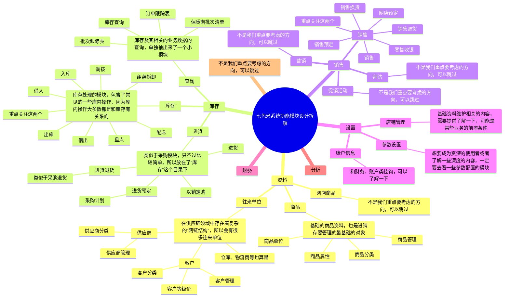
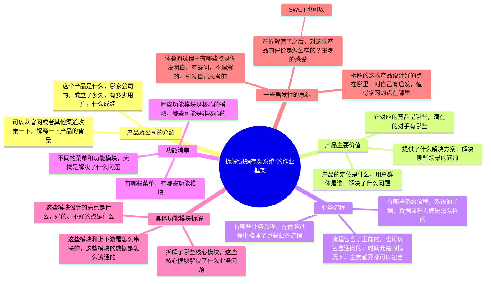

## 前言

本课是供应链项目实战的第3节课，这是一节录播课，大家可以在学习完了第2节课之后就开始学习此节课程。

前面2节课，我们大概知道了什么是供应链，供应链的一些概念和名词，还有供应链系统有哪些，在什么场景下会需要使用不同的系统等。其中最普遍、需求量最大的进销存，ERP和WMS分别有什么区别，这些系统大概长什么样子，同时还提到了**供应链系统的入门学习路径应该是要从进销存起步**。

所以，本节课我就跟大家拆解一下进销存系统的一些功能模块，以及这些功能模块能解决的业务场景等，通过这样的一节拆解，可以帮助大家对进销存系统有一个更加深刻的理解，同时也能顺带学习一下如何去上手体验以一个新的B端系统，这种体验的思路、框架应该是怎么样的。

当我们学完了这节课之后，就需要自己去注册、体验对应的系统，同时将相关的业务流程，功能模块等梳理沉淀，在下一节课我们就要开始动手“复刻”一个进销存系统了。**通过实战来提升自己的产品方案设计能力，然后通过作业的评审来反映自己对知识的掌握情况。**

> 本节课为录播课程，没有腾讯会议邀请链接，可以先查看下方的课程文稿，然后再学习课程视频，最后登录对应的进销存系统进行深度的体验学习。

## 课件详细内容

本节课的内容大概会分成4个部分：

1.  七色米产品介绍；
2.  七色米系统操作演示；
3.  七色米系统功能模块设计拆解；
4.  拆解的总结；

### Part1 七色米产品介绍

安徽七色米信息科技有限公司成立于2014年，深耕商贸流通领域小微企业的管理信息化服务近10年，集研发、运营、销售、服务一体化，七色米系列产品包含有：

1.  七色米进销存：由智慧商贸进销存升级而来，集销售、库存、财务与分析于一体，帮助商贸企业实现数字化转型；
2.  七色米ERP：由订货佳升级而来，集生产管理、进销存与订货商城于一体，实现业务数字化、数据驱动企业转型；
3.  七色米家电数码版：专为家电数码行业打造，集进销存、订货商城、售后管理及营销获客于一体，提升商家的内部管理效率、售后服务水平、全渠道营销能力；
4.  七色米·连锁版：专为有多个门店的连锁直营企业或大型商户打造，实施“总部统一管控+分店独立经营”模式，连锁经营更灵活高效。
5.  七色米SCRM：是一款基于企业微信的客户管理系统，与七色米进销存及ERP产品数据互相打通，助力企业实现客户沉淀、自动标签和自动化营销，提升业绩增长；
6.  七色米BI：专为批发商打造的自助式智能分析平台，帮助批发商分析数据、辅助决策并改善业务，真正实现数据赋能商业。

本次拆解的是“七色米进销存专业版-单店版-家电数码行业”，如下图所示：

| 列 1 | 列 2 |
| --- | --- |
| _拆解进销存类系统(以七色米为例)-1.png) | _拆解进销存类系统(以七色米为例)-2.png) |

[七色米](https://web.qisemiyun.com/login?AppType=1)

### Part2 七色米系统操作演示_拆解进销存类系统(以七色米为例)-3.png)

1.  登录后查看首页，侧边栏，顶部导航栏，侧边悬浮框等信息，大概扫一眼有多少菜单，有哪些目录，模块等；
2.  先从基础设置和基础数据（资料）入手，大概看一下配置项有哪些，基础数据维护是否复杂；
3.  供应链类的系统一般先创建基础资料，例如说：商品资料，供应商资料，客户资料，维护仓库和物流等信息；
4.  然后分别快速跑完“进销存”三大核心业务流程；

1.  进：进货（也就是采购）到入库的流程；
2.  销：销售订单到出库的流程；
3.  存：库存查询，库存出入库，库存调整，库存盘点等流程；

5.  快速跑完相关的流程之后，则可以进入第二轮的深度体验和拆解了。可以针对单个模块进行深入挖掘，尽量按从大到小的方式进行拆解、记录。（具体可以看下方的功能模块设计讲解）

1.  单据流转关系是怎么样的？先从哪个模块操作，然后会流转到哪个模块？
2.  各种业务实体的关系，是一对一还是一对多，其中业务实体可以是客户和客户分类，采购单和入库单，单据和单据明细等；
3.  单据有哪些状态，状态流转关系是怎么样的？画出状态机图，也称之为状态流转图，状态对应的操作项；
4.  具体的单据中有哪些字段，哪些业务逻辑，哪些校验逻辑，哪些交互设计、文案设计，UI设计的亮点和可借鉴学习的点等；

### Part3 七色米系统功能模块设计讲解

| 列 1 | 列 2 | 列 3 |
| --- | --- | --- |
| _拆解进销存类系统(以七色米为例)-4.png) | _拆解进销存类系统(以七色米为例)-5.png) | _拆解进销存类系统(以七色米为例)-6.png) |

_拆解进销存类系统(以七色米为例)-白板-1.svg)

  

> 商品名称：倍思数据线三合一充电线6A快充66W充电器线
> 
> 商品编码：100008437221
> 
> 零售价：39.00
> 
> 商品毛重：120.00g

### Part4 拆解的总结

1.  通过本课程可以学习拆解一个业务系统大概的流程、步骤是什么，可以养成一些好的习惯，沉淀为自己的工作方法论；
2.  通过拆解视频可以了解进销存系统大概能解决什么问题，有哪些功能模块，对进销存系统有一个大概的了解；
3.  七色米进销存基本上包含了入门供应链系统产品经理这个方向所具备的很多核心业务，这也是我之前提到的“珍珠奶茶学习法”中最重要的奶茶基底；
4.  接下来要做的事情就是深入体验要重点关注的一些核心模块，同时复刻相关的产品方案设计，加深自己的业务理解和产品方案设计能力；

## 课后作业

> 注册体验一下七色米或管家婆进销存软件，走一遍相关的业务流程，在走的时候把一些业务流程图画出来。同时在体验产品的时候，记录一些对方做的好点，可能是具体的业务流程，方案设计等，可能是交互上的，也可能是文案上的细节，帮助手册的编辑等。最后将记录的结果放在课程的评论区中。

## **课程答疑或补充知识**

### 答疑

1.  竞品账号去哪里获取？

> 供应链类的产品一般能找到竞品账号的都是SaaS型产品，也就是它本身就是对外提供免费注册或者试用的。这一块的内容我在课程2中已经分享了，大家可以前往去查看。
> 
> [课程2（直播课）：“强盛科技”的发展故事与背后的供应链系统](https://www.yuque.com/jiaowovitamin/seventh/shu26ag860y3s9c3)

2.  在体验一个系统的时候不知道这个功能模块是干嘛用的怎么办？

> 第一次接触一个新系统的时候不知道某些功能模块是干嘛用的，这个是很正常的，尤其是初次接触供应链领域的朋友。
> 
> 供应链领域有很多新名词，如果遇到一些不懂的新名词，需要先自己搜索查询一下；其次是一些功能模块如果不知道用途，可以去看一下相关的帮助手册，一般来说会有基础的业务场景介绍；如果是一些比较隐性的内容，那么就需要自己动脑筋猜测或者是实验论证了，这个就是B端产品经理后续要做的竞品调研工作。
> 
> 七色米的帮助手册地址如下：
> 
> [七色米·进销存](https://www.yuque.com/u123456-0zuft/kmx09m)

3.  在体验一个系统的时候不知道这个功能模块是干嘛用的怎么办？

> 如果要输出自己拆解的某个系统的成果，那么有什么大纲或者思路可以分享吗？
> 
> 针对初学者的进销项系统拆解，我个人总结了一个大概的大纲，有需要的朋友可以参考下图看看。

_拆解进销存类系统(以七色米为例)-白板-2.svg)

### 补充知识（珍珠奶茶学习法）

不同的仓库有不同的业务模式，就会有不同的系统解决方案，所以对应的03-WMS系统设计也会不一样。国内仓和海外仓的一些差异比较大，国内仓与国内仓之间的差异也有不少，不同的WMS会有不同的解决方案，如果想要全面的掌握WMS的一些内容，一定是需要多接触不同的业务模式的。

> 不同的WMS的玩法，就好像奶茶店的各种奶茶一样，基底都是一样的，但是加的料不一样，就会变成不同的产品。所以，学习WMS的时候应该先掌握基础核心且通用的内容（奶茶），然后根据业务的不一样而增加不同的处理逻辑（加的小料），最后得到一个能吻合实际业务的WMS。

​  

_拆解进销存类系统(以七色米为例)-7.png)

WMS的业务模块有很多，而且往往一些精细化管控的模块都比较复杂，很难快上手。所以，对于新人朋友来说，一定要分辨清楚，哪些模块是必须掌握的（基底），哪些模块是可选掌握的（加料），有不同的侧重点，学习起来才会稍微平滑一些。

​  

​  

​  

​  

​  

评论内容：

  

_拆解进销存类系统(以七色米为例)-8.png)

  
  

  

感觉把采购和销售放在一起去表达，容易看的有点乱，建议还是采购和销售分开来画  
  

  

采购入库流程和资料模块深度拆解  
  

_拆解进销存类系统(以七色米为例)-9.png)

  
  

_拆解进销存类系统(以七色米为例)-10.png)

  
  

_拆解进销存类系统(以七色米为例)-11.png)

  
  

_拆解进销存类系统(以七色米为例)-12.png)

  
  

  

哈哈，感觉这个作业应该是课程4和5的部分了  
  

  

嘿嘿 之前星球和b站看过v总你的产品方法论，就按上面的要求来了（工作上也有意识的往这个标准看齐）。我感觉4、5节我的学习重点是怎么做产品规划  
  

  

_拆解进销存类系统(以七色米为例)-13.jpeg)

_拆解进销存类系统(以七色米为例)-14.jpeg)

  
  

  

流程图上最好还是要写上一些文案描述，不然这样看起来有点不好理解  
  

  

  

拆解七色米的一点感悟  
1、一个进销存产品的功能结构取决于它的用户受众群，是否可以定义为好产品不是取决于功能有多强大，而是取决于你有多了解用户受众群的需求。  
2、不做业财一体，成本按移动加权平均计算并不难实现（好奇了很久的问题）。这反映了一个事实，大公司（对外披露财务报表）和小公司（不对外披露财务报表）对财务的需求完全不一样。  
大公司注重财务合规，要求可追溯业务，每笔业务的成本计算过程可以梳理出来可对审计解释。  
小公司注重业务经营，财务是辅助（先填饱肚子优先解决活下去的问题，做大做强后再考虑合规问题）。  
3、进销存+行业适配，好的进销存可以适配更多的行业需求，这要求产品经理在做0-1规划时，有两点要求。  
第一，找到一个健壮的行业切入  
第二，考虑多行业的产品解决方案后，再做底层设计（便于从1-n的迭代拓展）  
4、用户的使用成本做定制化项目时可以不考虑，有对应团队培训。  
但做产品时，如何让用户快速上手使用产品至关重要。登陆后20分钟没搞明白怎么操作，可能就失去了一个潜在客户。  
5、拆解进销存系统时，在基础资料和业务设置是值得花时间思考的，因为可以帮你了解这个产品的功能边界，辅助你快速了解其他模块的设计思想。  
6、如果没有供应链的相关经验，找到一个好产品按字段拆解是比较好的学习方式，less is more，一个精了，再去看其他产品很容易对比出差异，触类旁通，甚至可以反推用户画像。  
  

  

业财一体化确实是对一些大公司或者要上市的公司来说会很看重，但是对于小公司来说，他们的会有一套财务账，也会有一套业务账。业务账在其他系统上，而财务账是人工用金蝶、用友算出来的，不讲究所谓的溯源，只要能合理解释即可。  
  

  

_拆解进销存类系统(以七色米为例)-15.png)