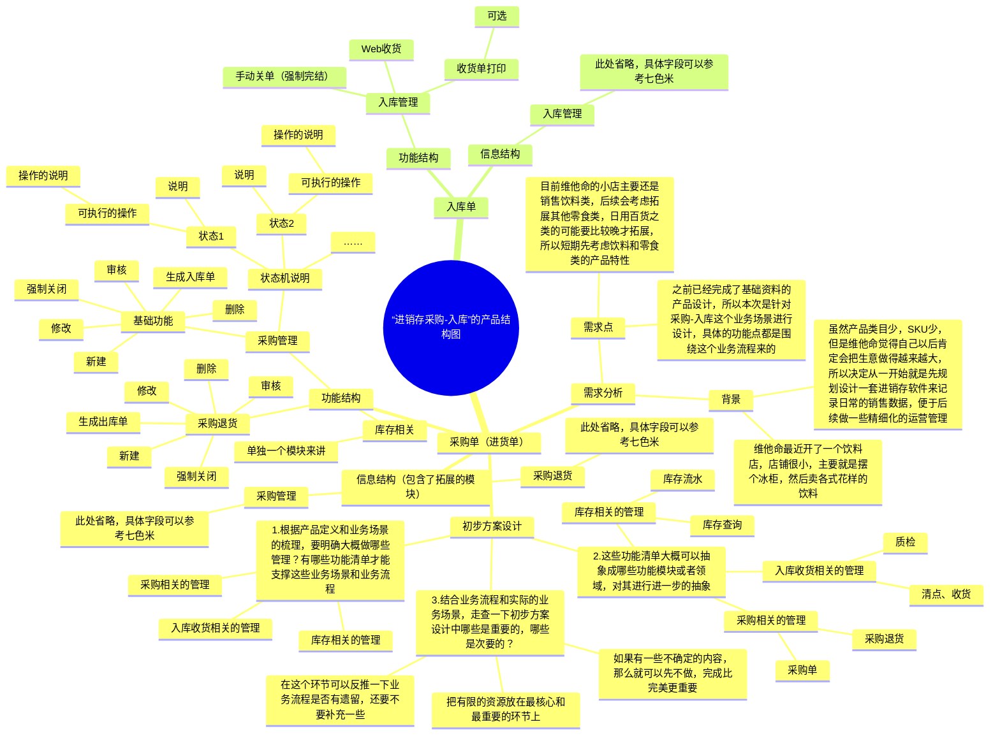
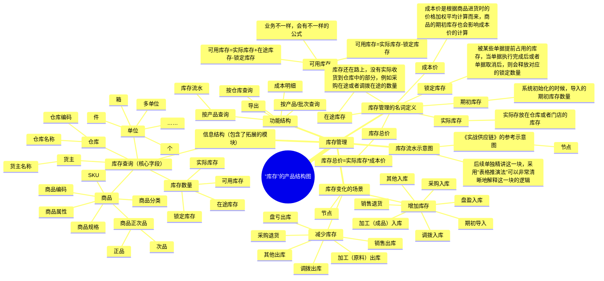

**前言**  
前面的课程我们花了不少时间介绍了什么是供应链，在企业发展的过程中会经历哪些供应链的系统，同时也提到了进销存系统是入门供应链方向最好的一个方式。也通过了一节拆解课程，知道了进销存系统长什么样子， 进销存系统有哪些功能模块，进销存系统供应链模块的业务流转是怎么样的，差不多对这个系统有了熟悉感和亲切感。  
**但是看再多遍的系统，用再多遍的系统，还是不如自己去亲手设计一款产品来的印象深刻一些**。所以本节课我将会亲自动手为大家演示一下进销存系统供应链模块的产品设计，一方面让大家更加深入地了解进销存系统的功能设计，另一方面也让大家学习一下日常工作中产品经理一般是怎么输出自己的产品方案的。  
虽然进销存系统的功能模块相对来说比较简单，但是要将这些内容和场景全部设计完成也是需要挺多的时间，短短地两节课肯定是不够的，所以我重点还关注在主要的、核心的场景和业务流程，而一些支线流程，辅助流程，异常流程等则会简单带过，大家也不用纠结，后续还会有很多实践的机会，可以慢慢地把这些内容补上去。  
由于课程内容比较多，所以分成了上下两篇，本节课是上篇，主要讲解进销存的：  
1基础资料  
2进货（采购）单和入库相关  
3库存的变化  
而在下篇，则会讲解进销存的：  
1销售单和出库相关  
2采购退货和销售退货相关  
3库存和库内操作相关  
本节课为录播课程，没有腾讯会议邀请链接，可以先查看下方的课程文稿，然后再学习课程视频，最后登录对应的进销存系统进行深度的体验学习。  
**课件详细内容**  
本节课的内容大概会分成5个部分：  
1进销存业务知识的介绍；  
2基础资料的产品设计；  
3进货和入库的产品设计；  
4库存模块的产品设计；  
5产品设计的一些经验分享和总结；  
**Part1 进销存业务知识的介绍**  
**1.1 进销存业务知识介绍**  
  

[《进销存零代码信息化白皮书》.pdf](https://www.yuque.com/attachments/yuque/0/2025/pdf/48385069/1738735855388-7473f537-c872-4315-8ede-50cf9722fbc7.pdf)

**1.2 进销存系统的介绍**  
**Part2 基础资料的产品设计**  
**2.1 关系梳理图**  
供应链系统中有很多基础资料，这些也可以称之为主数据，意思就是比较核心和重要的数据，遍布在供应链系统中。其中最常见的、用的最多就是：  
1商品资料  
2客户资料  
3供应商资料  
4仓库资料  
5物流资料  
由于进销存系统对仓库和物流这一块的关注度不是很高，所以我们重点就放在前3个基础资料上即可。  
  

_进销存基础资料、采购、入库等产品设计-1.png)

三个最常见的基础资料

  
**2.2 产品结构图**  
**维他命的产品方法论分享：**  
在接到了一个新需求，一个新任务的时候，我一般会用思维导图做一些信息的整理和分类，一方面可以做发散性思考、挖掘、分析，另一方面也可以沉淀自己的一些结论，并输出待办的内容。  
  

[我的B端产品方法论：产品方案设计落地全流程解析](https://www.yuque.com/jiaowovitamin/seventh/ha76a1yevlo3xe7v)

  
产品结构图可以拆分为：**功能结构图和信息结构图**。功能结构就是这个产品，这个模块有哪些功能清单，有哪些重要的操作项；而信息结构，就是这个产品和模块中，有哪些重要的字段、内容等。  
  

_进销存基础资料、采购、入库等产品设计-2.png)

狭义的产品结构图和广义的产品结构图

  
  

_进销存基础资料、采购、入库等产品设计-3.png)

谁、在什么场景下，遇到了什么问题，有什么诉求，想要怎么办，怎么解决

```mermaid
mindmap
  root((思维导图))
    “进销存基础资料”的产品结构图
      商品管理
        需求分析
          背景
            维他命最近开了一个饮料店，店铺很小，主要就是摆个冰柜，然后卖各式花样的饮料
            虽然产品类目少，SKU少，但是维他命觉得自己以后肯定会把生意做得越来越大，所以决定从一开始就是先规划设计一套进销存软件来记录日常的销售数据，便于后续做一些精细化的运营管理
          需求点
            本次的需求是先设计进销存系统的“商品管理”模块，因为商品是基础数据，需要先搭建好框架，后续才能将其他环节串起来
            目前维他命的小店主要还是销售饮料类，后续会考虑拓展其他零食类，日用百货之类的可能要比较晚才拓展，所以短期先考虑饮料和零食类的产品特性
        初步方案设计
          1.先确认商品有哪些属性，这样才能搭建一个基础的商品资料表
            SKU/商品编码
              自动生成
            商品名称
            商品分类
              需要有类目管理（拓展的模块）
                国产饮料
                  高糖分
                  低糖分
                  无糖版
                进口饮料
                  高糖分
                  低糖分
                  无糖版
            计量单位
              需要计量单位的管理（拓展的模块）
                个
                只
                条
                瓶
                箱
                多单位
                  多单位管理（拓展的模块或功能）
            商品条码
            图片
            价格管理
              销售价
                销售价和多单位挂钩
              采购价
                采购价和多单位挂钩
            效期管理
            备注
          2.确认了商品的属性之后，再考虑一下商品需要做哪些管理
            新增商品
              手动新增
              批量新增
            修改商品
            复制商品
            删除商品
            导出商品
          3.商品管理功能搞定之后，要怎么同步到其他模块？毕竟商品是基础数据，需要供其他模块使用的
            初步能想到的关联的模块
              采购模块
                采购的时候选择产品，调用产品基础数据，并带出采购价
              销售模块
                销售的时候选择产品，调用产品基础数据，并带出销售价
              入库模块
                入库的时候选择产品数据，调用产品基础数据，增加库存
              出库模块
                出库的时候选择产品数据，调用产品基础数据，扣减库存
              库存模块
                库存的统计
                库存盘点
                库存调拨
                库内加工
              报表统计
        功能结构
          新建
            新页面创建
          批量导入
            一期不做
          编辑
            新页面编辑
          复制
            一期不做
          启用/停用
            新建/编辑页面不做状态的启用和停用
            在列表页批量操作的时候，启用/停用
          删除
            支持批量删除，最多支持一个分页（100条）的删除
            商品被单据引用后不允许删除
              需要反查被哪些单据引用了
              产品要列出系统中存在的单据
          ……
        信息结构（包含了拓展的模块）
          商品主要数据
            商品编码（SKU）
              需要具有唯一性
              可以自动生成，也可以手动修改
              自动生成则默认为6位纯数字，从100001开始递增
              手动修改则仅支持字母，数字，而且不超过6位字符，不能与已有的SKU重复
            商品名称
              用户自定义填写，不做字符限制，长度不超过100位字符
            商品分类
              选择商品分类，预设一个默认分类
              分类是树状层级结构，最多支持4层结构
            规格
              用户自定义填写，不做字符限制，长度不超过20位字符
            商品单位
              选择商品单位，默认不选则为空
              如果没有合适的单位，可以提示去”计量单位“页面维护
            商品条码
              仅支持字母，数字，空格，下划线，小数点
              长度不超过20位字符
            图片
              最多支持上传5张图片，每张图不超过5MB
              图片格式为：.png, .jpg, .jpeg, .gif
            备注
              用户自定义填写，不做字符限制，长度不超过100位字符
            价格
              零售价
                最多支持2位小数，默认货币单位为”元“
                数值范围为0.00~999999999.99，超过最小/最大则不允许输入
              采购价
                最多支持2位小数，默认货币单位为”元“
                数值范围为0.00~999999999.99，超过最小/最大则不允许输入
            效期配置
              保质期
              预警天数
            库存预警
              最低库存
              最高库存
          商品分类
            分类名称
              用户自定义填写，不超过8字符
              同一父分类的下的子分类名称不能重复
            分类层级
              分类不能超过4层
            操作
              新增子类
              编辑
              删除
              拖拽排序
          计量单位
            单位名称
              用户自定义填写，不超过8字符
              单位名称不能重复
            状态
              启用
              停用
            备注
              用户自定义填写，不超过255字符
            排序
            操作
              新增
              修改
              删除
                被使用了的单位不能删除
              拖拽排序
      客户管理
        需求分析
          进销存管理中需要和客户打交道，需要知道具体的销售订单是关联到了哪个客户上，会需要对客户的一些基础信息进行管理，所以需要客户管理的模块
          客户是供应链环节中很常见的一个对象，客户的管理可以做得复杂，也可以做得简单，我们先从简单的版本做起，满足基本的信息管理要求
        初步方案设计
          1.根据产品定义和业务场景的梳理，要明确大概做哪些管理？有哪些功能清单才能支撑这些业务场景和业务流程
            新增客户
            修改客户
            导入客户
            删除客户
            统计客户的订单量
            向客户催/收款
            ……
            不属于基础信息的模块
          2.这些功能清单大概可以抽象成哪些功能模块或者领域，对其进行进一步的抽象
            客户管理
              新增
              修改
              删除
            客户统计
              分析/报表模块
            客户收款
              财务模块
          3.客户相关的信息是基础数据，可能会在哪些模块需要调用？
            销售相关的模块
              正向销售
              逆向售后
            报表统计的模块
            财务收款的模块
            ……
        功能结构
          客户管理
            新增客户
            修改客户
            导入客户
            删除客户
          客户分类管理
            新增分类
            修改分类
            删除分类
            分类排序
        信息结构
          客户资料的主要信息
            客户名称
              用户自定义填写，不做字符限制，长度不超过30位字符
            客户编码
              可以自动生成，也可以手动修改
              自动生成则默认为“KH+yyyymmdd+001”自增
              手动修改则仅支持字母，数字，而且不超过13位字符，不能与已有的客户编码重复
            关联业务员
              下拉选择员工账号，一个客户只能关联一个业务员
              员工信息需要支持维护，要有数据来源
            客户分类
              需要支持分类管理
              一个客户只支持一个分类
              分类是树状层级结构，最多支持4层结构
            客户标签
              需要支持标签管理
              一个客户支持多个标签
              暂时没有标签的需求，该字段可以待定
            客户图片
              门店信息
              营业执照
              其他证明类信息等
              图片上传，要限制图片的格式，大小，张数等
                .jpg .png .jpeg
                每张不超过5MB
                最多8张图，可以支持批量上传
            联系人
              用户自定义填写，不做字符限制，长度不超过30位字符
            联系电话
              用户自定义填写，不做字符限制，长度不超过30位字符
            联系地址
              用户自定义填写，不做字符限制，长度不超过100位字符
            微信/QQ
              用户自定义填写，不做字符限制，长度不超过30位字符
            邮箱
              用户自定义填写，不做字符限制，长度不超过30位字符
            联系信息模块
          客户分类管理
            思路和操作方法同“商品管理”模块
            此处省略详细的介绍了
      供应商管理
        需求和背景
          进销存管理中，和采购有关系的模块都会需要和供应商打交道，所以需要对供应商的一些进行管理维护，这个和客户管理是类似的
        初步方案设计
          思路和操作方法同“客户管理”模块
          此处省略详细的介绍了
        功能结构
          思路和操作方法同“客户管理”模块
          此处省略详细的介绍了
        信息结构
          思路和操作方法同“客户管理”模块
          此处省略详细的介绍了
      仓库管理
        需求和背景
          进销存系统中，需要对货物进行管理，统计库存等，那么就需要有一个仓库或者门店的基础信息，通过仓库或者门店来管理具体的实物，而且进销存系统一般可以支持多仓库或多门店，所以这个功能模块也非常重要
        初步方案设计
          思路和操作方法同“客户管理”模块
          此处省略详细的介绍了
        功能结构
          思路和操作方法同“客户管理”模块
          此处省略详细的介绍了
        信息结构
          思路和操作方法同“客户管理”模块
          此处省略详细的介绍了
```

_进销存基础资料、采购、入库等产品设计-4.png)

_进销存基础资料、采购、入库等产品设计-白板-1.svg)

  
**2.3 产品原型图**  
[http://43.138.173.42/UQO7YK/#id=bb43hy](http://43.138.173.42/UQO7YK/#id=bb43hy)  
**Part3 进货和入库的产品设计**  
**3.1 流程图、ER图、状态机图等**  
输出流程图，原型图，Excel，需求文档等，这些都是手段，都是服务于“沟通和表达”。  
工具是手段，是过程，而不是目的。我们的目的是清晰、高效、准确地沟通和表达，包含和业务方的沟通，和客户的沟通，和研发团队的沟通等。  
所以，作为初学者不要陷入一种：为了追求规范而盲目依赖规范，为了追求细节而去陷入细节的怪圈。  
  

_进销存基础资料、采购、入库等产品设计-5.png)

业务流程图

  
  

_进销存基础资料、采购、入库等产品设计-6.png)

系统流程图

  
1业务流程图，侧重点在业务的流转，核心就是部门、角色、动作、行为，一般和系统关系不大，属于“业务设计”的环节；  
2系统流程图，侧重点在系统与系统的交互，系统模块与模块的交互，涉及到一些单据、状态、字段、逻辑计算，判断条件等，属于“应用设计”的环节；  
3在日常的工作中，不一定要严格区分什么是业务流程图，什么是系统流程图，大多数简单业务的场景下，一张图就可以解决，记住：**工具不是目的，它只是手段**；  
4需要区分“业务设计”和“应用设计”的场景一般是复杂业务，复杂系统，涉及到多个业务场景，业务角色，然后系统很多，模块很多，判断的条件等都很多时候，会进行解耦操作，先做业务设计，再做应用设计；  
  

_进销存基础资料、采购、入库等产品设计-7.png)

ER图和状态流转图

  
“待入库单”的不同状态下的操作说明：  
  

| **状态** | **说明** | **可执行的操作** | **操作说明** |
| --- | --- | --- | --- |
| 未入库 | 单据最初始的状态 | 入库 | 进入入库操作页面，执行入库操作 |
|  |  | 导出 | 导出单据数据到Excel中 |
|  |  | 打印商品 | 调用打印模板，对商品清单进行打印 |
|  |  | 强制完结 | 强制结束收货，单据变成“已完成” |
| 部分入库 | 产生了部分商品的入库数据，但是没有全部商品入库完成 | 入库 | 进入入库操作页面，执行入库操作 |
|  |  | 导出 | 导出单据数据到Excel中 |
|  |  | 打印商品 | 调用打印模板，对商品清单进行打印 |
|  |  | 强制完结 | 强制结束收货，单据变成“已完成” |
| 已完成 | 全部商品入库完成，或者强制完结入库 | 无操作 | 只是用来记录单据的最终状态，不会在页面上展示“已完成”的单据 |

**3.2 产品结构图**

_进销存基础资料、采购、入库等产品设计-白板-2.svg)

  
**3.3 产品原型图**  
[http://43.138.173.42/UQO7YK/#id=ilz1qn](http://43.138.173.42/UQO7YK/#id=ilz1qn)  
**Part4 库存模块的产品设计**  
**4.1 关系梳理图**  
  

_进销存基础资料、采购、入库等产品设计-8.png)

库存的一些基础概念

  
向供应商去采购商品，入库到了仓库中之后，那么仓库中就会增加相关商品的库存；反过来，如果客户下单，需要从仓库发货出去，那么就会扣减仓库中商品的库存……  
增加库存，扣减库存，**都是通过库存流水来动态计算的，而不是直接更新修改数据**，如果不能理解库存和库存流水的区别，可以想象一下自己的“微信钱包”的逻辑是怎么样的。  
  

_进销存基础资料、采购、入库等产品设计-9.png)

  
**库存**是指当前的库存余额，库存情况，可以理解为是快照或者一个结果，它和查询的时间有关系，不同时间的库存余额就好像钱包里的钱一样，是不一样的。  
**库存流水**是指库存的变动日志，在什么时候，因为什么原因，变动了多少，然后导致了什么结果，每次影响了库存的数量之后，都需要记录一条流水，哪怕是一增一减最后库存数量好像没变化，也需要记录流水。  
**先掌握最基础的库存概念，后续我们会基于库存做更精细化、更深入的讲解，这里会有非常多的花样可以操作。**  
  

_进销存基础资料、采购、入库等产品设计-10.png)

库存查询示意图

  
  

_进销存基础资料、采购、入库等产品设计-11.png)

库存流水示意图

  
**4.2 产品结构图**

#### ​  

_进销存基础资料、采购、入库等产品设计-白板-3.svg)

  
**4.3 产品原型图**  
[http://43.138.173.42/UQO7YK/#id=hnfe6s](http://43.138.173.42/UQO7YK/#id=hnfe6s)  
**Part5 产品设计的一些经验分享和总结**  
1但凡遇到输入，都要做校验  
不要轻易相信用户，所有的输入、数据提交类的表单，都要做字段校验，产品经理要多这些信息有足够的敏感度。  
2有下拉项，必须要说明顺序和单选/多选  
无论是输入类的表单，还是查询类的条件，遇到下拉项都要指明顺序和单选/多选，这些细节是基本功。  
3数字类的输入要明确极值，这样才能减少Bug的出现  
例如输入金额的时候，不能输入负数，非法字符；输入数量的时候，可能只能输入整数，而且是有范围上限的，这些都要有意识地去说明。  
4名称和编码单号的使用方式要自己总结方案的优劣势  
例如客户名称和客户编码，到底哪个是必填的？哪个是可以作为唯一判定的？如果是用客户名称做唯一判定，那么名称就要做限制，精确查询或者不能重复，这样遇到一些数据调用或者展示的时候，才会让用户不迷糊。  
5产品方案设计中，输出原型和PRD是后置工作，一定是先分析好了框架之后再动手，不要本末倒置  
很多人觉得产品方案设计是交付原型和PRD，那么我就直接画原型和写PRD就完事了，这个思路是明显有问题的。产品方案设计重点在过程，体现自己的思考和分析的动作，如果只是为了交付，那么最后做出来的方案一定是会有遗漏，甚至很多错误的。  
当然，如果是非常简单的设计，可以直接一步到位，把分析的过程融入到原型和PRD中。  
6产品方案的输出非常考验产品经理的基本功，不要觉得这些看起来好简单就不去练习  
Axure是一个比较简单的原型工具，但是很多人画出的原型并不好看；网络上的PRD模板有很多，但是很多人写出来的文档依然丢三落四，看的云里雾里……  
清晰、高效、准确地表达清楚一个事情，一个逻辑，一个流程，这些**都是需要通过刻意练习**来达成的。  
产品成长之路，切勿眼高手低，走马观花，而是要脚踏实地，深入钻研！  
**课后作业**  
根据课程所讲的内容，完成七色米进销存的基础资料，进货，入库，库存等功能模块的产品设计，要求输出对应的业务流程图（关系梳理图），产品结构图，还有产品原型图等。 如果有条件的朋友可以整合这些信息放在语雀或者飞书，输出对应的PRD，后续可以作为求职项目使用。  
**课程答疑或补充知识**  
**答疑**  
1商品编码，条形码，SN码的区别是什么？  
1编码。它可以是任何形式的编码，如数字、字母或符号，通常是由制造商或供应商分配的。商品编码可以用于标识商品的种类、尺寸、颜色等信息，以便在销售和库存管理中使用。  
2条形码：条形码是一种特殊的商品编码，常用于零售和物流行业。条形码是一组垂直的线和空白，可以被扫描器读取并转换为数字或字符形式。条形码可以包含商品的各种信息，如品牌、型号、价格等，以便快速准确地识别商品。  
3SN码：SN码是指序列号码，通常用于追踪和识别唯一的商品。SN码是由制造商或供应商分配的一组唯一的数字或字符，用于标识一个特定的商品。SN码通常用于高价值商品、电子设备和汽车等领域，以便在售后服务、保修和召回等方面使用。  
  

_进销存基础资料、采购、入库等产品设计-12.png)

  
2一般情况下是否允许超量出库和超量入库？  
超量出库和超量入库，如果只是考虑库存维度的因素是没什么问题的，因为一般都是按实际入库和实际出库的数量来更新库存。  
但是如果考虑到财务的因素，考虑到库存的成本方面，那么一般业务都不会支持超量出库和超量入库，因为会导致库存的成本发生变化，财务对账会更麻烦。  
针对入库，可以等量收货，可以少收，但是不能超收；  
针对出库，可以等量出库，可以少出，但是不能超出；  
3怎么理解多单位管理？  
在进销存系统中，多单位是指同一种商品可以使用不同的计量单位进行进出货，例如：米、千克、件、箱等。这种做法可以更好地满足不同客户的需求和不同销售渠道的要求，同时也可以更方便地管理库存和进行采购。  
多单位的实现需要在系统中设置商品的基本单位和辅助单位，同时还需要考虑单位之间的换算关系。例如，一个商品的基本单位是千克，辅助单位是袋，那么系统需要提供一个换算比例，比如1袋=25千克，这样在进行采购、销售和库存管理时，系统就可以自动地进行单位转换，避免了手动计算错误的风险。  
具体的操作，可以参考“七色米进销存”中的“商品管理”模块，自己去操作体验一下。  
4精细化的原型比较费时间，有些时候没有那么多时间完成怎么办？  
原型交付是给研发看的，所以要和研发进行沟通，询问他们的意见，是否要输出这么精细的内容。和研发形成了默契之后，原型交付就可以简单一些，如果没有形成默契的时候还是要精细一些，因为沟通失误导致的偏差，成本会更高一些。  
**补充知识（业务设计和应用设计）**  
产品经理在应对一些复杂业务，复杂需求，复杂系统的时候，很容易在产品设计的时候被过多的信息给干扰了。例如：  
1在梳理业务的时候，去想页面怎么交互，怎么设计……  
2在调研需求和分析需求的时候，去想字段限制，组件规范……  
3在梳理产品结构图的时候，又去想需求场景和需求真伪的问题……  
4在画原型的时候，再去想用户是谁，业务流程是怎么样的……  
当我们处理一些简单需求的时候，可以一把梭，反正都可以解决问题；但是应对复杂需求的时候，一定要做工作流的解耦，就是不同阶段做不同的事情，而不是交叉在一起做。  
先业务设计，再应用设计，就是对工作流的解耦，也是应对复杂需求的最佳实践。

_进销存基础资料、采购、入库等产品设计-13.png)

产品设计方案落地的流程

  
**业务设计**：首先是对客户的业务“流程”进行梳理、优化、完善（架构层），再对业务的“操作”（功能层）进行设计，最后对业务的操作“结果”（数据层）进行设计。业务设计，是将“需求”放在“业务”这个背景中去思考、设计的。  
**应用设计：**是将业务设计成果结合技术实现的要求，给出系统开发完成后的应用样式和应用模式。应用设计是将业务设计成果转换为系统的功能；  
**技术设计**：根据业务设计和应用设计的内容，为了实现这些效果而需要使用的一些技术方案，技术架构等。技术设计部分的目的是实现业务设计和应用设计的成果。  
  

_进销存基础资料、采购、入库等产品设计-14.png)

  
我之前输出过一篇关于“业务设计”和“应用设计”的文章，建议感兴趣的朋友去看看。  
  

_进销存基础资料、采购、入库等产品设计-15.jpeg)

[浅谈B端产品工作中的业务设计和应用设计](https://mp.weixin.qq.com/s/6j6-i0aBEk52GtqJ-N-Zbw)