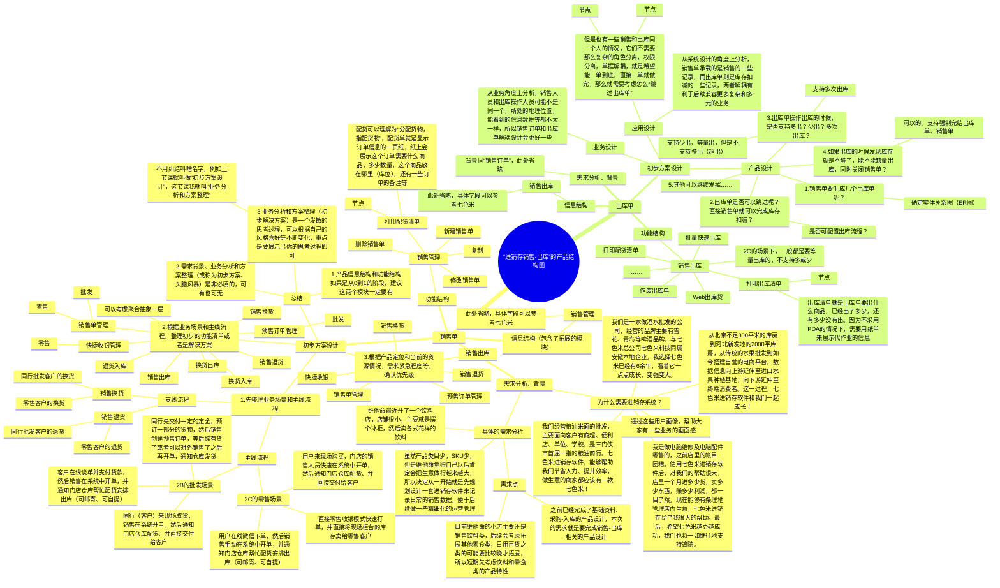
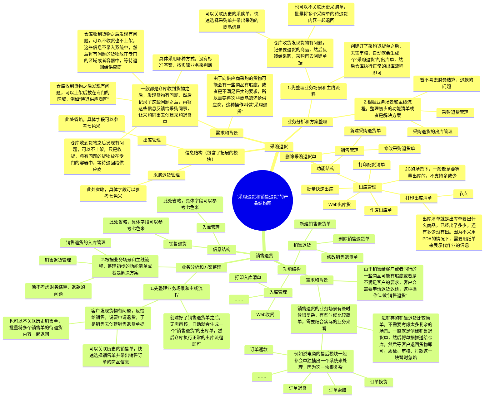

## 前言

上一节课，我们讲解了进销存的基础资料，还有进销存的进货，入库和库存模块的产品设计，知道了在输出一个产品需求文档之前要思考哪些东西，整理哪些东西，同时也对进销存的产品结构有了更加清晰的了解。

本节课我们将继续进销存项目实战，趁热打铁把剩下的销售、出库、退货相关和库内操作的部分给讲解完成。供应链项目的实战，除了要输出对应的流程图，产品结构图，原型图和一些PRD文档之外，其实还有很重要的就是要通过实战过程去进一步领悟供应链的一些业务知识，同时也对自己的产品方案设计能力做一个走查和提升。

无论你现在是有经验的产品经理，还是没有经验的产品经理，都别封闭自己学习的心态，多学习、多接触肯定是会有好处的。

本篇主要是讲解进销存以下方面的内容：

1.  销售单和出库相关
2.  采购退货和销售退货相关
3.  库存和库内操作相关

> 本节课为录播课程，没有腾讯会议邀请链接，可以先查看下方的课程文稿，然后再学习课程视频，最后登录对应的进销存系统进行深度的体验学习。

## 课件详细内容

本节课的内容大概会分成4个部分：

1.  销售单和出库单的产品设计；
2.  采购退货和销售退货的产品设计；
3.  库存和库内操作的产品设计；
4.  进销存项目实战的总结；

### Part1 销售单和出库单的产品设计

#### 1.1 流程图、ER图、状态机图等

| 列 1 | 列 2 |
| --- | --- |
| _进销存销售、出库、库内操作等产品设计-1.png) | _进销存销售、出库、库内操作等产品设计-2.png) |

_进销存销售、出库、库内操作等产品设计-3.png)

“待出库单”的不同状态下的操作说明：

| **状态** | **说明** | **可执行的操作** | **操作说明** |
| --- | --- | --- | --- |
| 未出库 | 单据最初始的状态 | 出库 | 进入“新增出库单”操作页面，执行出库操作 |
|  |  | 导出 | 导出单据数据到Excel中 |
|  |  | 打印商品 | 调用打印模板，对商品清单进行打印 |
|  |  | 强制完结 | 强制结束出库，单据变成“已完成” |
| 部分出库 | 产生了部分商品的入库数据，但是没有全部商品入库完成 | 出库 | 进入“新增出库单”操作页面，执行出库操作 |
|  |  | 导出 | 导出单据数据到Excel中 |
|  |  | 打印商品 | 调用打印模板，对商品清单进行打印 |
|  |  | 强制完结 | 强制结束出库，单据变成“已完成” |
| 已完成 | 全部商品入库完成，或者强制完结入库 | 无操作 | 只是用来记录单据的最终状态，不会在页面上展示“已完成”的单据 |

销售单审核之后会锁定库存，作废/取消了已审核的销售单之后又会释放被锁定的库存，关于出库单的库存变化逻辑，可以通过下方的推演表来展示说明：

_进销存销售、出库、库内操作等产品设计-4.png)

> SKU A001：初始库存有100个，即可用库存100，锁定库存0，在途库存0
> 
> 此时，创建一个销售单，销售单的商品明细中只有一个SKU（A001），出库的数量为5

| 序号 | 动作/单据状态 | 可用库存 | 锁定库存 | 在途库存 | 说明 |
| --- | --- | --- | --- | --- | --- |
| 1 | 创建销售单（未审核） | 100 | 0 | 0 | 此时销售单的状态是未审核，没有触发库存校验的逻辑 |
| 2 | 审核销售单（已审核） | 95 | 5 | 0 | 此时销售单的状态是已审核，会触发库存校验的逻辑 |
| 3 | 作废已审核的销售单 | 100 (95->100) | 0 (5->0) | 0 | 如果此时作废/取消这张销售单，那么就需要释放被锁定的库存 |
| 4 | 出库单已出库 | 95 | 0 (5->0) | 0 | 如果没有作废/取消已审核的销售单，那么会正常生成出库单，出库单出库之后就会扣减锁定的库存 |

> 锁定：为了防止库存被别的订单商品给强占，所以会锁定相关的库存，即对应的“锁定库存”会增加
> 
> 扣减：可以扣减可用库存，也可以扣减锁定库存，意味着库存从多变成了少，被扣减掉了
> 
> 释放：释放是锁定的反义词，当锁定了库存之后会增加“锁定库存”的数量，但是当释放了锁定库存之后，则会减少“锁定库存”的数量
> 
> ​  
> 
> **锁定->释放，锁定->扣减**。锁定后可以释放，相当于撤销、回滚；锁定后也可以扣减，相当于锁定的部分被用掉了。当明白了这些概念之后，其实就不用深究这些名词了，只要关注“XX库存”是增加还是减少即可。

#### 1.2 产品结构图

_进销存销售、出库、库内操作等产品设计-白板-1.svg)

#### 1.3 产品原型图

[http://43.138.173.42/UQO7YK/#id=1b2hzl](http://43.138.173.42/UQO7YK/#id=1b2hzl)

### Part2 采购退货和销售退货的产品设计

#### 2.1 流程图、ER图、状态机图等

| 列 1 | 列 2 |
| --- | --- |
| _进销存销售、出库、库内操作等产品设计-5.png) | _进销存销售、出库、库内操作等产品设计-6.png) |

> 采购是供应商->仓库/门店，所以仓库/门店会对应增加库存，而采购退货就是仓库/门店->供应商，所以会仓库/门店扣减库存，是通过“采购退货出库单”来处理的，这里的“采购退货出库单”和“正常销售出库单”大体功能都是相似的，所以抽象出来都统称为“出库单”，然后关联的**业务单据类型**不一样。
> 
> 同理可得，销售退货就是客户->仓库/门店，所以会仓库/门店增加库存，也是通过“入库单”来增加库存的。

| 列 1 | 列 2 |
| --- | --- |
| _进销存销售、出库、库内操作等产品设计-7.png) | _进销存销售、出库、库内操作等产品设计-8.png) |

“待入库单”和“待出库单”在不同状态下对应的操作和说明，和之前讲解的内容是一样的，这里直接搬运过来即可。

_进销存销售、出库、库内操作等产品设计-9.png)

_进销存销售、出库、库内操作等产品设计-10.png)

> 采购退货，客户退货都是逆向流程，在实际的业务中，一般要考虑溯源的需求。即原单是什么？原供应商或者原客户是什么，会有这么一些好处：
> 
> 1.  **提高效率**：通过关联原始订单，系统可以自动提取相关的采购信息，如供应商、商品编码、价格等，减少了手动输入数据的工作量，提高了处理退货的效率。
> 2.  **减少错误**：自动提取的信息减少了人为输入错误的可能性，确保了退货信息的准确性。
> 3.  **质量控制**：退货通常与质量问题相关，关联原始订单有助于追踪质量问题，便于质量控制和改进。
> 4.  **合规性**：在某些行业，如医药、食品等，退货处理需要严格遵守法规要求，关联原始订单有助于确保退货流程的合规性。
> 5.  **数据分析**：关联原始订单的数据可以用于后续的采购分析，帮助企业优化采购策略，比如通过分析退货原因来改进采购决策。
> 6.  **财务红冲/对账**：我们向供应商采购的时候，供应商会给我们开发票，如果我们退货了，那么供应商就要把那张发票做红冲抵消，需要知道具体的红冲哪个单据。同样的道理，我们开票给客户之后，客户发生了退货我们也要去做发票的红冲。

| 列 1 | 列 2 |
| --- | --- |
| _进销存销售、出库、库内操作等产品设计-11.png) | _进销存销售、出库、库内操作等产品设计-12.png) |

#### 2.2 产品结构图

_进销存销售、出库、库内操作等产品设计-白板-2.svg)

#### 2.3 产品原型图

[http://43.138.173.42/F8ZOFH/#id=d6efm9](http://43.138.173.42/F8ZOFH/#id=d6efm9)（采购退货）

[http://43.138.173.42/F8ZOFH/#id=gkeysd](http://43.138.173.42/F8ZOFH/#id=gkeysd)（销售退货）

### Part3 库存和库内操作的产品设计

#### 3.1 业务介绍图

| 列 1 | 列 2 | 列 3 |
| --- | --- | --- |
| _进销存销售、出库、库内操作等产品设计-13.png) | _进销存销售、出库、库内操作等产品设计-14.png) | _进销存销售、出库、库内操作等产品设计-15.png) |

#### 3.2 库存核心信息拆解

_进销存销售、出库、库内操作等产品设计-16.png)

**库存表：**

_进销存销售、出库、库内操作等产品设计-17.png)

**库存流水表：**

_进销存销售、出库、库内操作等产品设计-18.png)

**批次库存表：**

_进销存销售、出库、库内操作等产品设计-19.png)

**批次库存流水表：**

_进销存销售、出库、库内操作等产品设计-20.png)

**库存锁定明细表：**

_进销存销售、出库、库内操作等产品设计-21.png)

**批次库存锁定表：**

_进销存销售、出库、库内操作等产品设计-22.png)

### Part4 进销存项目实战的总结

1.  进销存不是简单的“入库，出库和库存”这样狭隘的定义

> 进销存系统虽然简单，但是要把简单的事情做好，做到通用和标准，体验又很好，还能满足多个用户需求也是一件难事。
> 
> 进销存的核心业务就是“采购业务”，“销售业务”，“库存管理业务”，“资金和财务业务”，这些分别体现出了供应链的“物流”，“逆向物流”，“信息流”，“资金流”和“逆向资金流”。围绕这些业务场景和流程，会有挺多的功能要做，我们这两节课只是把核心且重要的内容挑出来了讲，其他的分支业务也要后续花时间了解。

2.  进销存系统是供应链类系统的核心基座，所以基本功要打牢固

> 无论是进销存，还有ERP，还有WMS或者是其他的供应链类系统，一定是可以看到“进销存”的身影的，所以关于这一块的项目练习作业一定要去完成，自己在实战的过程中感受一些具体的业务细节和思考逻辑。

3.  产品方法论是通过实践然后抽象出来总结的，量变之后就会质变

> 很多朋友说自己做了好多年的产品，但是一些业务细节和产品深度的东西都没怎么思考过，没有形成方法论。那么怎么才能形成方法论呢？我认为要有这么几个步骤：
> 
> -   思考，在日常的工作中一定要多思考
> -   实战，平时要多做，多动手，广度和深度都可以
> -   复盘总结，做完一定要复盘总结，一定要想还有没有更好的方式解决
> -   内化迭代，思考和总结之后就会大大提升内化吸收的效果

4.  最后是大家的提问环节

> 现在课程已经进行了第5节了，有什么收获？有什么思考？有什么感触？都可以聊聊

## 课后作业

> 该节课的作业和第四节课的作业是一样的。根据课程所讲的内容，完成七色米进销存的基础资料，进货，入库，销售，出库，库存等功能模块的产品设计，要求输出对应的业务流程图（关系梳理图），产品结构图，还有产品原型图等。  
> 如果有条件的朋友可以整合这些信息放在语雀或者飞书，输出对应的PRD，后续可以作为求职项目使用。

## **课程答疑或补充知识**

### 答疑

1.  盘亏出库的出库单是放到出库生成一个单据吗？盘盈的入库单是放到入库单生成一个单据吗？

> 一般来说，盘亏还是盘盈都会单独生成一个调整单，然后对调整单进行确认执行，就会生成对应的库存增加或者修改的流水。库存调整单是专门用来解决“不实际操作货物，但是要变更系统库存数据”的一种单据，盘盈和盘亏都是属于这种类型。

2.  配货清单和出库清单，在实际的业务中，使用的人，分别是谁？如果都是仓储的某个人，是不是可以合并？还是说，在行业经验里，这确实是两个完全不同的概念？

> 在WMS或者仓储领域，一般会用装箱清单（Packing List或Packing Slip）来表示某个订单需要什么商品，而用拣货单（Picking List）来表示要拣货的数量和商品的位置等。

3.  收货和上架的区别是什么，在系统中是怎么体现区别的？

> 收货是收到货物，然后清点数量，确保货物名称和数量没问题；而上架是指将收完的货物，放置到对应的货架库位上去，需要记录什么商品，放在了什么库位上，放了多少数量。

### 补充知识

| 列 1 | 列 2 |
| --- | --- |
| _进销存销售、出库、库内操作等产品设计-23.png) | _进销存销售、出库、库内操作等产品设计-24.png) |

| 列 1 | 列 2 |
| --- | --- |
| _进销存销售、出库、库内操作等产品设计-25.png) | _进销存销售、出库、库内操作等产品设计-26.png) |