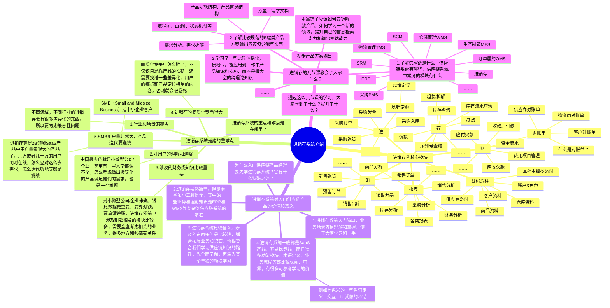
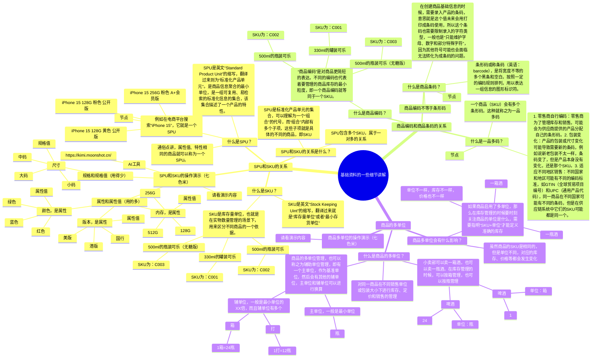
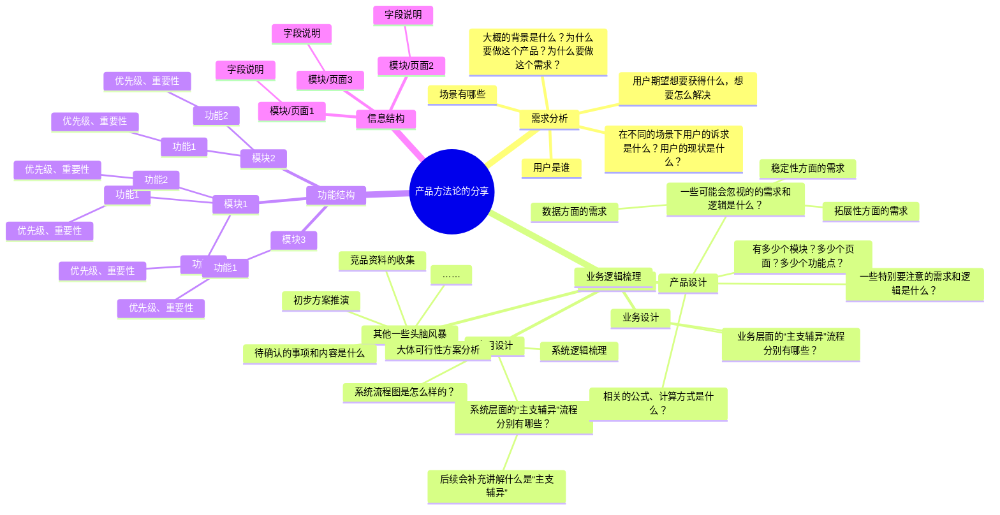
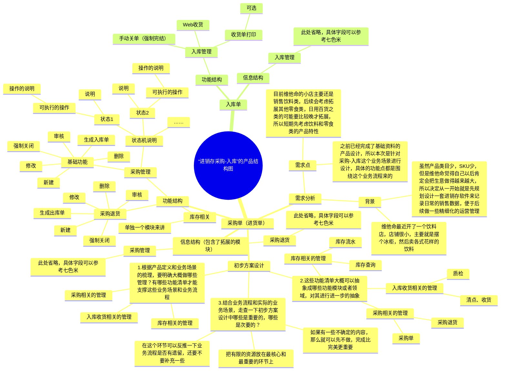

## 前言

虽然前面我们花了不少的时间来讲解进销存，对于一些初入供应链领域的朋友来说，如果只是听一遍相关的知识，那么很容易就会忘记。而且进销存系统中包含的一些细节知识，业务知识等都比较多，考虑到有一些朋友在做具体的项目实战作业的时候可能会有点困惑，或者是似懂非懂的。

所以本节课我来对前面讲过的进销存项目做一个知识串讲和业务细节的补充，同时也会做一些供应链知识的普及和拓展，帮助大家更好地吸收和掌握相关的知识。**我还是再强调一下，项目实战作业还是建议大家一定要动手去做一遍，拆解一遍，哪怕是复刻一个和竞品一样的项目也会让你更有收获。**

本课的开课时间是`**2024/06/13（周四）晚上9:00**`，开课的方式是使用腾讯会议，所以请大家提前准备好相应的软件，会议链接如下：

> 维他命 邀请您参加腾讯会议
> 
> 会议主题：课程6（直播课）：进销存项目知识串讲&回顾总结
> 
> 会议时间：2024/06/13 21:00-22:30 (GMT+08:00) 中国标准时间 - 北京
> 
> 点击链接入会，或添加至会议列表：
> 
> [https://meeting.tencent.com/dm/nR3zy4icSgAw](https://meeting.tencent.com/dm/nR3zy4icSgAw)
> 
> #腾讯会议：176-859-153
> 
> 复制该信息，打开手机腾讯会议即可参与

## 课件详细内容

本节课的内容大概会分成4个部分：

1.  进销存业务知识的回顾；
2.  七色米和金蝶星辰的体验对比；
3.  进销存核心的业务知识总结；
4.  产品方法论的总结；

### Part1 进销存业务知识的回顾

#### 1.1 进销存业务知识介绍

1.  进销项的基本概念

> 进：指询价、采购到入库与付款的整个链路过程。
> 
> 销：指报价、销售到出库与收款的整个链路过程。
> 
> 存：指出入库外的，涉及到领料、退货、盘点、损益、借入、借出、调拔等影响库存数量的动作。
> 
> 除了“进销存”之外，一般还会有“财”相关的内容，因为采购会和“应付”有关系，销售会和“应收”有关系，存货和“成本”有关系，但是一般来说，进销存的财务相关内容相对来说比较简单一些，不至于到业财一体化那么严谨。
> 
> 所以一般都是业务一套账，财务一套账，业务的账在进销存系统上，而财务的的账在金蝶、用友等财务软件中，两者通过财务人员手动处理进行关联，而不是系统直接打通。

2.  在一些小微型公司/企业的供应链管理中会遇到一些痛点，这些痛点可以借助进销存系统来解决

> 采购管理：
> 
> 1.  盲目采购，货品的价值判断没有依据，采购成本高
> 2.  采购申批流转、物流状态、质检进展等无法及时掌握
> 
> 销售管理：
> 
> 1.  销售过程缺乏有效监督，价格无统一标准
> 2.  经销商、客户数量多，信息管理不到位
> 3.  销售报价查询、合同开具繁琐，签约效率低
> 
> 仓库管理：
> 
> 1.  管理多仓库/多店铺，库存不清
> 2.  库存控制不合理，出现滞销/脱销
> 3.  库存盘点时间长，数据不准确
> 
> 财务管理：
> 
> 1.  进货、销售与财务脱节，账务不清
> 2.  供应商、客户对账繁琐，易错账漏账
> 
> 经营决策：
> 
> 1.  销售数据不能实时查看，缺乏对成本、利润的核算
> 2.  门店各自为营，总部无法及时掌握门店的经营状况
> 3.  总部的销售目标和指令不能快速、准确的下达

| 列 1 | 列 2 |
| --- | --- |
| _进销存项目知识串讲&amp;回顾总结-1.png) | _进销存项目知识串讲&amp;回顾总结-2.png) |

#### 1.2 进销存系统介绍

_进销存项目知识串讲&amp;回顾总结-白板-1.svg)

### Part2 七色米和金蝶·星辰两款进销存的体验对比

#### 2.1 七色米和金蝶星辰·进销存说明

> 前面第三节课的时候分享了“七色米”进销存的拆解，这次还是借用之前的拆解逻辑和步骤，再给大家演示拆解一些金蝶的精斗云进销存。
> 
> 通过一个快速粗略地拆解和演示，让大家一方面了解一下金蝶星辰·进销存的功能模块，另一方面也可以和七色米进销存进行对比，增强对进销存类软件的认知和理解。

[开启金蝶精斗云帐套-100万家企业用户的共同选择 _ 金蝶精斗云](https://www.jdy.com/regwork/)

[七色米进销存软件-进销存管理软件-进销存软件免费版-库存仓库管理软件好](https://qisemiyun.com/)

> 金蝶云星辰面向的是小微型公司/企业，包含的内容模块比七色米进销存要多，能适配和兼容的行业、领域也更多。而且金蝶一直主打的就是“业财一体化”，所以会有很多财务相关的内容，财务、税务模块做得也会相对更加专业一些。
> 
> 同时，金蝶云星辰也有零售、在线商城，生产管理等业务场景，所以基本具备通用型ERP的相关模块。

_进销存项目知识串讲&amp;回顾总结-3.png)

#### 2.2 体验一个新系统的流程

### ​_进销存项目知识串讲&amp;回顾总结-4.png)

1.  登录后查看首页，侧边栏，顶部导航栏，侧边悬浮框等信息，大概扫一眼有多少菜单，有哪些目录，模块等；
2.  先从基础设置和基础数据（资料）入手，大概看一下配置项有哪些，基础数据维护是否复杂；
3.  供应链类的系统一般先创建基础资料，例如说：商品资料，供应商资料，客户资料，维护仓库和物流等信息；
4.  然后分别快速跑完“进销存”三大核心业务流程；

1.  进：进货（也就是采购）到入库的流程；
2.  销：销售订单到出库的流程；
3.  存：库存查询，库存出入库，库存调整，库存盘点等流程；

5.  快速跑完相关的流程之后，则可以进入第二轮的深度体验和拆解了。可以针对单个模块进行深入挖掘，尽量按从大到小的方式进行拆解、记录。（具体可以看下方的功能模块设计讲解）

1.  单据流转关系是怎么样的？先从哪个模块操作，然后会流转到哪个模块？
2.  各种业务实体的关系，是一对一还是一对多，其中业务实体可以是客户和客户分类，采购单和入库单，单据和单据明细等；
3.  单据有哪些状态，状态流转关系是怎么样的？画出状态机图，也称之为状态流转图，状态对应的操作项；
4.  具体的单据中有哪些字段，哪些业务逻辑，哪些校验逻辑，哪些交互设计、文案设计，UI设计的亮点和可借鉴学习的点等；

### Part3 进销存核心的业务知识总结

#### 3.1 进销存之“基础资料”相关的业务

_进销存项目知识串讲&amp;回顾总结-5.png)商品资料是供应链类系统的核心基石（血液），无论是进销项，ERP，WMS，OMS都会涉及到产品资料的管理，有些地方也叫作产品管理，货品管理等。

> 一些可能需要拓展了解的知识：
> 
> 1.  SKU和SPU的关系，会涉及到产品多规格的一些知识，这一块一般和电商关系比较多，如果是零售或者库存管理，一般只需要考虑SKU即可；如果是需要多规格管理的，就要考虑SPU和SKU的关系；
> 2.  商品编码，商品条码的关系，了解什么是一品多码，了解为什么需要条码；
> 3.  商品多单位管理，了解箱规，单品的区别，了解多单位的转化，了解多单位的库存统计方式；

  

_进销存项目知识串讲&amp;回顾总结-白板-2.svg)

#### 3.2 进销存之“进”相关的业务

_进销存项目知识串讲&amp;回顾总结-6.png)

#### 3.3 进销存之“销”相关的业务

_进销存项目知识串讲&amp;回顾总结-7.png)

#### 3.4 进销存之“存”相关的业务

_进销存项目知识串讲&amp;回顾总结-8.png)

> 建议初学进销存/WMS/ERP等供应链系统的时候，先不考虑财务相关的内容，先确保把“实物流”和“信息流”相关的内容掌握扎实，后续再进阶拓展学习“资金流”相关的知识。

### Part4 产品方法论的总结

_进销存项目知识串讲&amp;回顾总结-9.png)

_进销存项目知识串讲&amp;回顾总结-白板-3.svg)

#### 4.1 流程图、ER图、状态机图等

| 列 1 | 列 2 |
| --- | --- |
| _进销存项目知识串讲&amp;回顾总结-10.png) | _进销存项目知识串讲&amp;回顾总结-11.png) |

1.  业务流程图，侧重点在业务的流转，核心就是部门、角色、动作、行为，一般和系统关系不大，属于“业务设计”的环节；
2.  系统流程图，侧重点在系统与系统的交互，系统模块与模块的交互，涉及到一些单据、状态、字段、逻辑计算，判断条件等，属于“应用设计”的环节；
3.  在日常的工作中，不一定要严格区分什么是业务流程图，什么是系统流程图，大多数简单业务的场景下，一张图就可以解决，记住：**工具不是目的，它只是手段**；
4.  需要区分“业务设计”和“应用设计”的场景一般是复杂业务，复杂系统，涉及到多个业务场景，业务角色，然后系统很多，模块很多，判断的条件等都很多时候，会进行解耦操作，先做业务设计，再做应用设计；

_进销存项目知识串讲&amp;回顾总结-12.png)

“待入库单”的不同状态下的操作说明：

| **状态** | **说明** | **可执行的操作** | **操作说明** |
| --- | --- | --- | --- |
| 未入库 | 单据最初始的状态 | 入库 | 进入入库操作页面，执行入库操作 |
|  |  | 导出 | 导出单据数据到Excel中 |
|  |  | 打印商品 | 调用打印模板，对商品清单进行打印 |
|  |  | 强制完结 | 强制结束收货，单据变成“已完成” |
| 部分入库 | 产生了部分商品的入库数据，但是没有全部商品入库完成 | 入库 | 进入入库操作页面，执行入库操作 |
|  |  | 导出 | 导出单据数据到Excel中 |
|  |  | 打印商品 | 调用打印模板，对商品清单进行打印 |
|  |  | 强制完结 | 强制结束收货，单据变成“已完成” |
| 已完成 | 全部商品入库完成，或者强制完结入库 | 无操作 | 只是用来记录单据的最终状态，不会在页面上展示“已完成”的单据 |

#### 4.2 产品结构图

_进销存项目知识串讲&amp;回顾总结-白板-4.svg)

#### 4.3 产品原型图

[http://43.138.173.42/UQO7YK/#id=ilz1qn](http://43.138.173.42/UQO7YK/#id=ilz1qn)

#### 4.4 产品原型/需求文档中要包含的核心要素

之前我做过一节关于产品原型/需求文档中要包含的核心要素的视频讲解，这节课也是方法论的分享，和之前课程4和课程5上分享的东西是类似的，这里我带大家再快速回顾一下。

[链接](https://www.yuque.com/jiaowovitamin/seventh/pqz75vg4bw0wq8gl)

## 课后作业

> 本节课无课后作业，请大家完成之前布置的课后作业即可。

## **课程答疑或补充知识**

### 答疑

1.  七色米和金蝶星辰都是进销存软件，我应该重点学习哪个？

> 如果是刚接触进销存的朋友，我建议先看七色米，因为七色米比较简单，适合新手；
> 
> 如果是接触过进销存或者供应链其他系统的朋友，我建议可以看金蝶星辰，因为金蝶系的软件有很多设计都是有共通性的，后续我们去研究金蝶的ERP的时候，会更容易上手一些；

2.  进销存系统粗略总结之后，感觉还是挺简单的，那我还是要去做相关的实战项目吗？

> **拆解软件、讲解软件设计，和设计软件，定义产品的角度和工作量都是不太一样的**。很多东西看起来很简单，但是实际操作起来，实际去做的时候会发现还是有很多细节，很多可学习的东西，所以我会建议大家还是要静下心，抱着开放的心态脚踏实地去做这个项目，然后参与需求评审
[简道云-进销存-解决方案.pdf](https://www.yuque.com/attachments/yuque/0/2025/pdf/48385069/1738735851676-99a66eb8-60a3-474b-8ed0-4af38b11ec09.pdf)[金蝶云·星辰进销存云解决方案.pdf](https://www.yuque.com/attachments/yuque/0/2025/pdf/48385069/1738735851820-7480b4be-2aec-45f8-a559-7ee713caecd8.pdf)