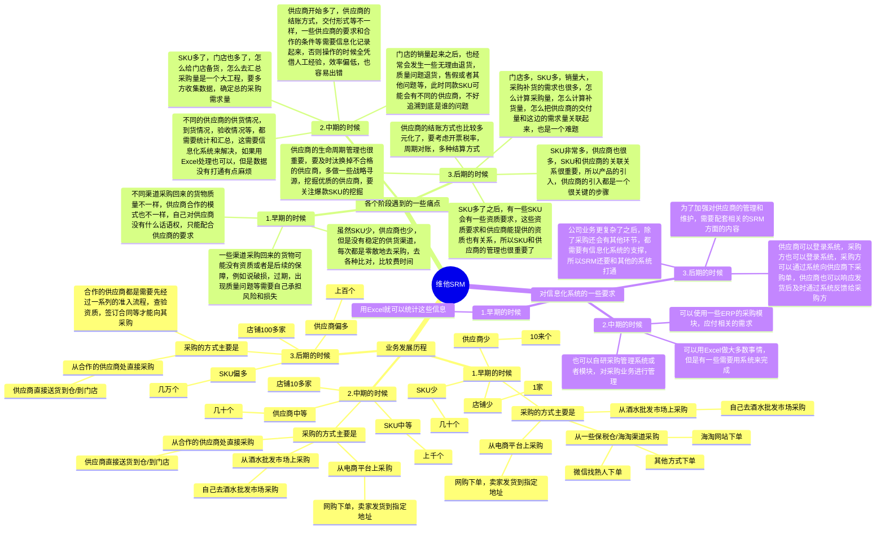
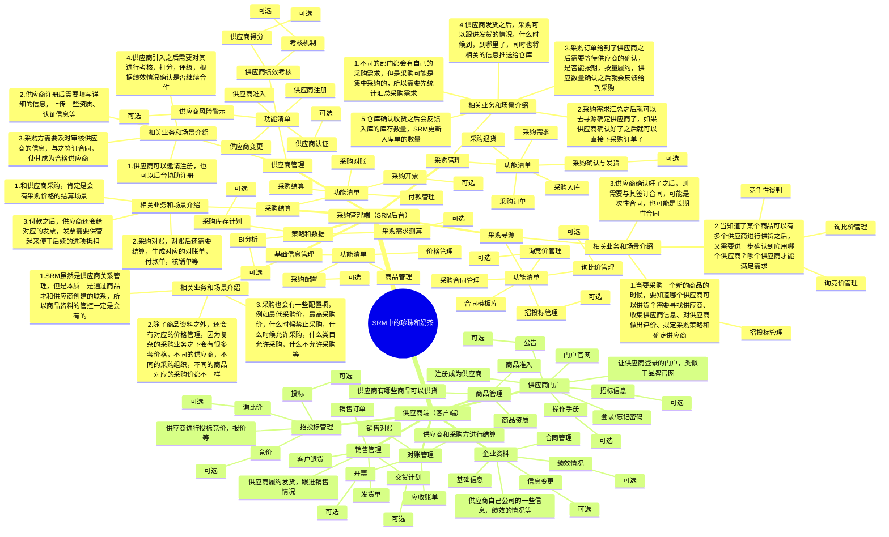
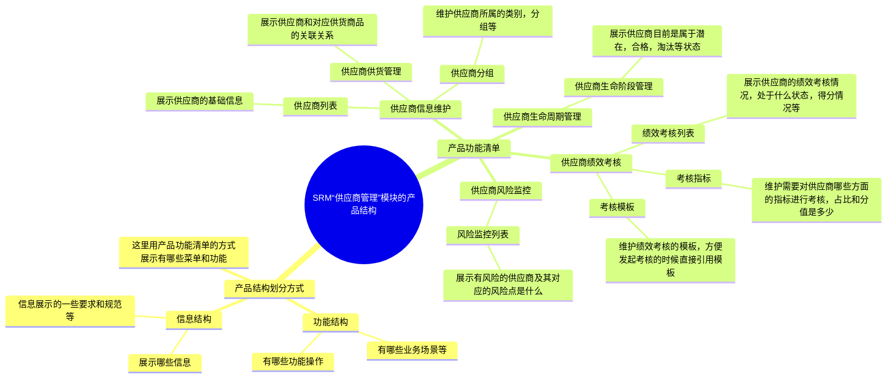
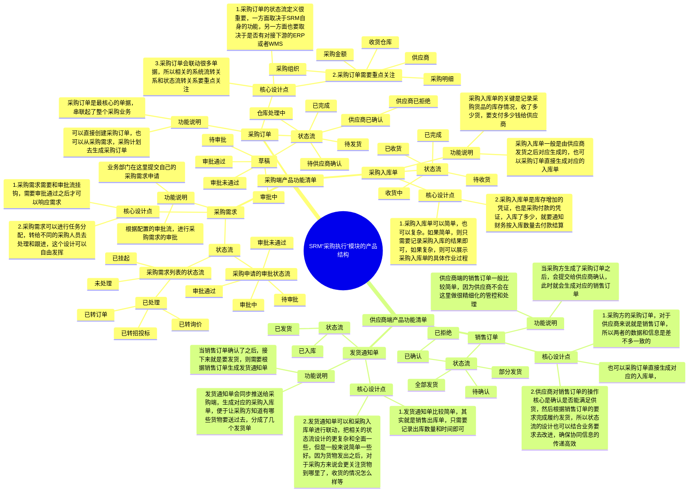

## 前言

学习完了进销存之后，我们对供应链类系统有了一个大概的了解。知道了什么是采购，什么是销售，什么是库存，也知道了进销存中商品的实物流，信息流，资金流大概是怎么运转起来的。

如果只是掌握这些知识只能说对供应链系统稍稍入了点门而已，要成为一名“合格”的供应链系统还需要持续深入地历练，这里的历练包含了业务层面和产品专业能力层面。

**对业务层面来说，进销存系统的业务深度和广度不太够，所以我们还需要持续拓展业务知识面，接触一些更深层、更复杂的的业务场景。**

对产品专业能力层面来说，除了要掌握产品基本功之外，也要掌握基于多业务主体，多业务流程，多业务诉求等复杂业务场景下，输出相关产品方案的能力。

简单来说，就是：**先广泛学习，然后再深入具体领域学习**。本节课，我们就基于简易版SRM系统来深入学习一些采购方面的知识，让大家更好地理解采购的业务知识，业务流程设计，系统功能设计等。

> 本节课为录播课程，没有腾讯会议邀请链接，可以先查看下方的课程文稿，然后再学习课程视频，最后登录对应的进销存系统进行深度的体验学习。

## 课件详细内容

本节课的内容大概会分成5个部分：

1.  业务背景的铺垫；
2.  什么是SRM？
3.  SRM中的“珍珠奶茶”；
4.  供应商管理的业务知识和产品设计；
5.  采购执行的业务知识和产品设计；

### Part1 业务背景的铺垫

维他命很喜欢喝各种各样的饮料、酒水等，然后他基于自己比较丰富的“吃货经验”，走上了创业的道路，起初的时候主要是通过开线下门店，然后去采购各种新奇有意思的酒水饮料；后来业务逐渐有了起色之后他开始涉足一些其他零食和潮玩品类，把自己的线下门店打扮的非常有个性，满足年轻人的猎奇心理；同时也将一些业务搬到了线上，用户可以通过电商平台去下单，满足了一些当地没有线下门店的用户需求……

小P很早的时候就加入了“维他集团”这家公司，一直在协助维他命做相关的信息化系统，本节课，小P将以一个产品经理的视角，为大家拆解一下关于采购和供应商管理相关的信息化系统，即SRM系统是怎么搭建的，它的演进过程是怎么样的。

_从简易版SRM系统着手深入学习采购-白板-1.svg)

### Part2 什么是SRM？

#### 2.1 什么是SRM？

> SRM是 Supplier Relationship Management 的英文缩写，即供应商关系管理。

供应商管理系统以供应商信息管理为核心，以标准化的采购流程以及先进的管理思想，从供应商的基本信息、组织架构信息、联系信息、法律信息、财务信息和资质信息等多方面考察供应商的实力，再通过对供应商的供货能力，交易记录、绩效等信息综合管理，达到优化管理，降低成本的目的。

可以简单理解为：**SRM和ERP一样，首先是一种管理思想、理念，然后也是一种****企业管理软件****，主要是采购方和供应商方相关的一些业务的管理。**​

_从简易版SRM系统着手深入学习采购-1.png)

#### 2.2 SRM包含哪些功能模块？

每家SRM包含的内容都不太一样，为了方便大家学习和理解，降低大家的学习难度，本节内容都是以简道云协作型SRM为参考学习对象，然后加上一些补充的知识。

_从简易版SRM系统着手深入学习采购-2.png)

#### 2.3 SRM中主要的业务流程是什么？

1.  供应商的准入，考核，退出

> 执行采购之前，必须得要知道要采购什么东西，然后这个东西是哪个供应商提供的？
> 
> 供应商茫茫多，并不是谁都可以成为采购方的供应商，所以供应商需要邀请合作，注册，审核，考察资质，样品试用，最后通过一系列的审核流程之后才可以成为合格供应商。
> 
> 成为了供应商之后并不意味着一劳永逸，采购方会对供应商考核，通过对供应商过往的表现进行打分，最后进行优胜劣汰，所以供应商也有退出机制。
> 
> 从一开始是引入，到中间的合作，最后退出，这一系列流程就可以称之为“供应商生命周期管理”。
> 
> 陌生供应商->潜在供应商->供应商准入->合格供应商->合作供应商->供应商评估->供应商分级->供应商淘汰。
> 
> _从简易版SRM系统着手深入学习采购-3.png)

2.  寻源流程介绍及合同管理

> 简单地说，Souring(寻源）是指寻找供应商资源，就是找到合格的供应商，其中包含符合资质的新供应商以及新产品的供应商，企业采购寻源主要应用在这几个方面：
> 
> -   为企业新品找到合适的供应商
> -   由于企业产品生产转移到异地而就近寻找低成本供应商
> -   优化采购成本而进行采购战略调整
> 
> _从简易版SRM系统着手深入学习采购-4.png)_从简易版SRM系统着手深入学习采购-5.png)

3.  订单协同，交货协同，财务协同

> 采购需求->采购订单->供应商确认订单
> 
> _从简易版SRM系统着手深入学习采购-6.png)
> 
> _从简易版SRM系统着手深入学习采购-7.png)
> 
> ​  
> 
> 供应商确认发货->随货附带发货单->录入发货物流信息->SRM跟踪物流轨迹->通知仓库收货->收货完成->生成应付账单
> 
> _从简易版SRM系统着手深入学习采购-8.png)
> 
> _从简易版SRM系统着手深入学习采购-9.png)
> 
> 应付账单->对账单->确认对账，供应商开票->发票推送SRM->SRM确认发票->发票留底->采购方付款

4.  SRM和外部系统的集成

> SRM不是一个孤立的系统，它可以和其他供应链系统集成在一起，也就是互相打通。
> 
> SRM除了有供应商信息外，肯定会有商品资料的信息，所以可能会和PMS对接；
> 
> SRM的一些单据状态，数据流等需要及时处理，可能会和OA打通，便于业务方及时响应；
> 
> SRM还会有财务相关的单据和文件等，需要和财务系统打通；
> 
> SRM和ERP连接比较紧密，因为ERP是供应链系统中的中枢，所以大概率会和ERP对接；
> 
> SRM可能会直接和WMS对接，也可能先和ERP对接，然后让ERP去对接WMS，这样可以让WMS只和一个系统交互，降低WMS的复杂度；
> 
> _从简易版SRM系统着手深入学习采购-10.png)

### Part3 SRM中的“珍珠”和“奶茶”

#### 3.1 SRM的珍珠奶茶介绍

SRM和WMS一样，会有很多功能模块，可以支持很多业务场景，解决很多业务需求。但是对于初学者来说，如果初次接触一个复杂系统就想要把所有内容都吃透，都学会，这是不现实的，而且效率是比较低的。

所以，我会推荐大家在学习的时候，使用“珍珠奶茶”学习法，也就是先明确一下哪些是必学的，核心的内容，中，这些是属于“奶茶”，而一些可选的，辅助的，有一定定制化的，这些就是属于“珍珠”。

> 先把最核心的，最高频，最常见的模块和业务流程学完，然后在后续的学习过程中逐步补充完善其他的内容，最后连点成线，连线成面，逐步吃透整套系统。

_从简易版SRM系统着手深入学习采购-白板-2.svg)

| 列 1 | 列 2 |
| --- | --- |
| [比亚迪供应商门户](https://sp.byd.com.cn/cdc-app/portalex/bydmh_zh_CN/index6.html)  [供应商门户-南玻集团](https://srm.csgholding.com/ELSServer_NANBO/portalLogin/login.html)  [吉利供应商关系管理系统登录](https://srm.geely.com/web/default.jsp)  [DJI大疆供应商门户 - 大疆采购政策、采购流程、大疆供应商协同](https://srm.dji.com/process)  [e-SP供应商协同系统](https://gsp.goertek.com:8443/login?service=https%3A%2F%2Fsrm.goertek.com%2Fsignin-cas%3Fstate%3DCfDJ8CkTs_Ce-QJKsVH02iKUhubvwp6_IrVDnUv_rHy3bNtlULhekXzfCMJWJqWO_Z3vNWiNMI8Ao1ZoZU-FVUZgGwaiKQYt3VjvP5dTLxAsn2OPUxL6FUmoBBhoPPbK16Fex2XWvNmlJ8r2qTAhGH6dXEgZkDosWmNa4N7ZGH6LE1cDqwkd5oYIcsfEsOngh4HK_EfwlvVzGLnm9-YR-Deb-RY) | _从简易版SRM系统着手深入学习采购-11.png)_从简易版SRM系统着手深入学习采购-12.png) |

#### 3.2 SRM的供应商门户系统和采购管理系统

_从简易版SRM系统着手深入学习采购-13.png)

| 列 1 | 列 2 |
| --- | --- |
| _从简易版SRM系统着手深入学习采购-14.png) | _从简易版SRM系统着手深入学习采购-15.png) |

后续在学习海外仓OMS和WMS的时候也是类似的思路，OMS是客户端，给电商卖家使用，给需要委托仓库作业的人使用；WMS是仓库端，给仓库执行人员，仓库的管理人员使用。

### Part4 供应商管理的业务知识和产品设计

#### 4.1 业务流程和系统流程图

_从简易版SRM系统着手深入学习采购-16.png)

供应商引入一般来说是一个偏线下的操作，很多公司的引入过程都是线下完成，最后在系统里面录入数据，所以对应的SRM系统中“供应商管理”的模块的功能就会比较简单，只需要记录结果即可，没有太多的系统交互流程。

_从简易版SRM系统着手深入学习采购-17.png)

#### 4.2 产品结构图

_从简易版SRM系统着手深入学习采购-白板-3.svg)

#### 4.3 产品拆解

简道云：[简道云 - 登录](https://www.jiandaoyun.com/dashboard#/)

京桥通：[全程数字化采购管理系统-泛微SRM·京桥通](https://www.jingqiaotong.com/)

### Part5 采购执行的业务知识和产品设计

#### 5.1 业务流程和系统流程图

_从简易版SRM系统着手深入学习采购-18.png)

采购的业务可以很复杂，也可以很简单。一般来说核心的点就是采购给供应商下单，供应商确认没问题，可以按订单的要求（数量要求，时间要求，质量要求，价格要求等）进行供货，就会反馈给采购方。然后供应商按要求送货到指定的仓库，等采购方确认收到货物之后，再联系财务进行对账和结算。

> 需要特别注意，采购一般涉及的金额比较大，而且是属于花钱的行为，所以一般采购都会和**审批流**结合的比较密切。

_从简易版SRM系统着手深入学习采购-19.png)

_从简易版SRM系统着手深入学习采购-20.png)

| **单据** | **单据说明** | **相关逻辑** |
| --- | --- | --- |
| 采购计划 | 以年度或季度为周期做的采购计划，一般基于历史数据估算而来，产生于做年度采购计划或季度采购计划时。 | 一般和数据分析，销量统计，需求预测等系统挂钩，用来制定一些可预测的采购计划，减轻人工采购的工作量 |
| 采购需求 | 企业内部各个部门根据自己的需要而提交的采购需求，也可以称之为采购申请，当收集了一批需求之后就可以集中去进行采购 | 采购需求一般需要审批后才生效，采购需求和采购订单的关系是N:N |
| 采购订单 | 当确认了要采购的内容后，根据相关内容创建采购订单，采购订单审核后则交给供应商，让其按订单内容进行履约 | 一个采购订单对应一个供应商，如果需要向多个供应商采购则需要创建多个采购订单；采购订单一般具有多个状态，可以便于采购人员根据不同状态的采购订单来做出后续的操作 |
| 采购入库单 | 采购入库单用来记录本次采购入库的明细，表示采购的货品已经入库，它也是用来生成财务应付的凭证 | 采购订单和采购入库单的关系是1:N，有些系统会采购订单直接生成采购入库单，有一些则是通过供应商的发货通知单来生成采购入库单 |
| 销售订单 | 采购方生成了采购订单订单之后会同步推送给供应商端，对供应商来说就是销售订单，需要对订单进行履约发货 | 采购订单会对应一个供应商的销售订单，而且销售订单的状态也会和采购订单的状态联动 |
| 发货通知单 | 供应商对销售订单履约，结合自己的实际生产情况，库存情况生成对应的发货通知单，即告知采购方自己已经发货，分了几个批次发货 | 销售订单和发货通知单的关系是1:N，供应商可以针对一个销售订单多次发货，生成多个发货通知单 |

_从简易版SRM系统着手深入学习采购-21.png)

_从简易版SRM系统着手深入学习采购-22.png)

  

#### 5.2 产品结构图

_从简易版SRM系统着手深入学习采购-白板-4.svg)

#### 5.3 产品拆解

简道云：[简道云 - 登录](https://www.jiandaoyun.com/dashboard#/)

京桥通：[全程数字化采购管理系统-泛微SRM·京桥通](https://www.jingqiaotong.com/)

## 课后作业

> 根据课程所讲的内容，仔细体验一下简道云和京桥通相关的内容，感受一下SRM和进销存系统中的采购有什么相同以及有什么不同。
> 
> 输出一份你对SRM系统的理解，包含它的目标用户，核心业务场景，核心业务流程，系统功能清单等。

## **课程答疑或补充知识**

### 答疑

1.  SRM系统方向的产品机会多吗？

> 采购或者SRM方向的产品机会相对来说比较垂直，和WMS比较类似，整体来说有缺口，但是没有那么大。所以供应链方向的产品经理一般都要接触好几个领域，触类旁通之后几乎相关的方向都可以做。例如说，采购，订单，库存，仓储，物流等。

2.  SRM方向的SaaS产品有哪些呢？

> [企企通-数字化采购管理平台领导品牌,专注SRM采购供应链解决方案](https://www.51qqt.com/)
> 
> [集中采购系统-采购数字化-电子采购平台-srm系统-商越科技](https://www.sunyur.com/)
> 
> [甄云科技-采购管理系统-SRM平台-询价管理系统-供应商管理软件](https://www.going-link.com/)

3.  简道云和京桥通的账号怎么获取？

> 简道云：
> 
> [https://www.jiandaoyun.com/dashboard#/](https://www.jiandaoyun.com/dashboard#/)
> 
> 登录之后，直接新建一个应用，然后选择SRM的模板，就可以体验了。
> 
> 京桥通：
> 
> [https://www.jingqiaotong.com/](https://www.jingqiaotong.com/)
> 
> 打开之后，点击“马上试用”，然后填写一个手机号和一些信息就可以体验了。

4.  有关于SRM系统的一些操作手册或者资料吗？

> SRM操作手册或者资料可以查看星球，里面有蛮多相关的资料。
> 
> _从简易版SRM系统着手深入学习采购-23.png)

  

### 补充知识

大疆的供应链引入流程示意图：

_从简易版SRM系统着手深入学习采购-24.png)