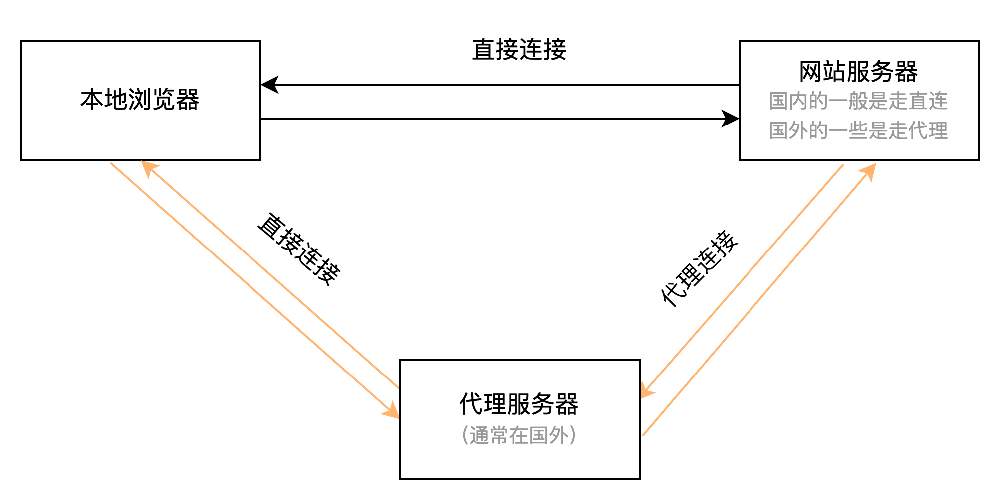

## 为什么要学这个？

> 我之前跟朋友说过一句话：会不会用Google是判断一个产品经理能力上限的分水岭。 话可能有点极端，但是我个人是这样的评判标准。你可以早期不会用，但是我都这样说了，你还是意识不到它的重要性，那我就只能说，天花板就差不多顶那里了。

工具不该有优越性，用百度也好，用Google也好，只要能解决问题即可。但是我亲身经历来看，作为一款搜索引擎工具，Google优越性还是很显著的，也许大家都能解决问题，但是它更快，更高效，更全。

同时，能用Google搜索，也意味着你会体验到Gmail，Chrome扩展商店，Google Drive，油管，脸书等产品，你的信息获取来源一下子就打开了。

## 为什么要叫张良计？

众所周知的原因，我们是不能直接打开Google的，所以我们需要借助一个工具，这个工具有很多种叫法，但是我愿意称之为“张良计”，因为一句谚语“你有张良计，我有过墙梯”。

关于这方面我不能说太多内容，否则语雀就会和谐这一篇文章了。要完成张良计的效果，我们只需要两步即可：

1.  下载客户端，这些客户端是开源的，不同的操作系统对应不同的客户端，常见的就是安卓，iOS，Windows，Mac这四类；
2.  导入订阅地址，这个是最难的，也是不能展开讲的，如需帮助最好是咨询身边的朋友。简单来说，就是你找相关的服务商购买了虚拟服务后，它会给你一个订阅地址，你复制后导入到客户端即可。

> 私享课的群友可以使用这个订阅地址，这个是我自己购买的，可以小范围提供给大家使用。
> 
> 一共只有1T的流量，所以大家请勿对外传播，因为用完就没了（2024/03/29更新）：
> 
> https://sub.speed17sub.com/api/v1/client/subscribe?token=cff7e1032b4c2a68eb9567b4da85bbf9

## 流程示意图

## 客户端使用教程

### Windows

[https://d.fxy.pw/myasset/clash\_for\_windows.gif](https://d.fxy.pw/myasset/clash_for_windows.gif)

### Mac

[https://d.fxy.pw/myasset/clashx.gif](https://d.fxy.pw/myasset/clashx.gif)

### 安卓

[https://d.fxy.pw/myasset/clash\_for\_android.gif](https://d.fxy.pw/myasset/clash_for_android.gif)

### iOS

[第2节：iOS注册美区AppleID、下载和使用小火箭](https://www.yuque.com/jiaowovitamin/uizu4s/mkb3vvlyvygodgnr)

## 客户端下载

​  

[cfa-2.5.9-foss-universal-release.apk.zip](https://www.yuque.com/attachments/yuque/0/2025/zip/48385069/1738735797312-729332c5-6760-471a-b992-74bb9a8e63e0.zip)

[Clash.for.Windows.Setup.0.19.27.exe.zip](https://www.yuque.com/attachments/yuque/0/2025/zip/48385069/1738735797493-0a87482d-af88-4c43-a654-8b87a1cd309a.zip)

[ClashX-1.94.dmg.zip](https://www.yuque.com/attachments/yuque/0/2025/zip/48385069/1738735797657-20234c14-e74c-44df-b1a4-517608cbe1d5.zip)