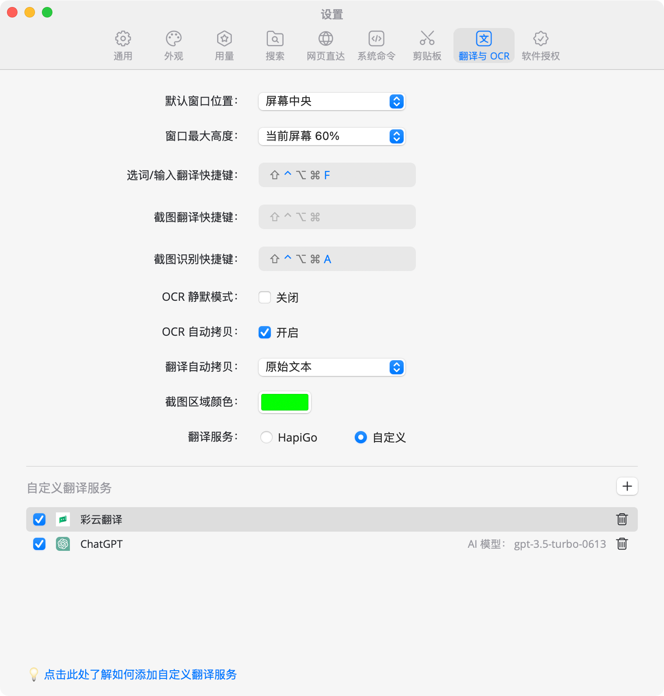
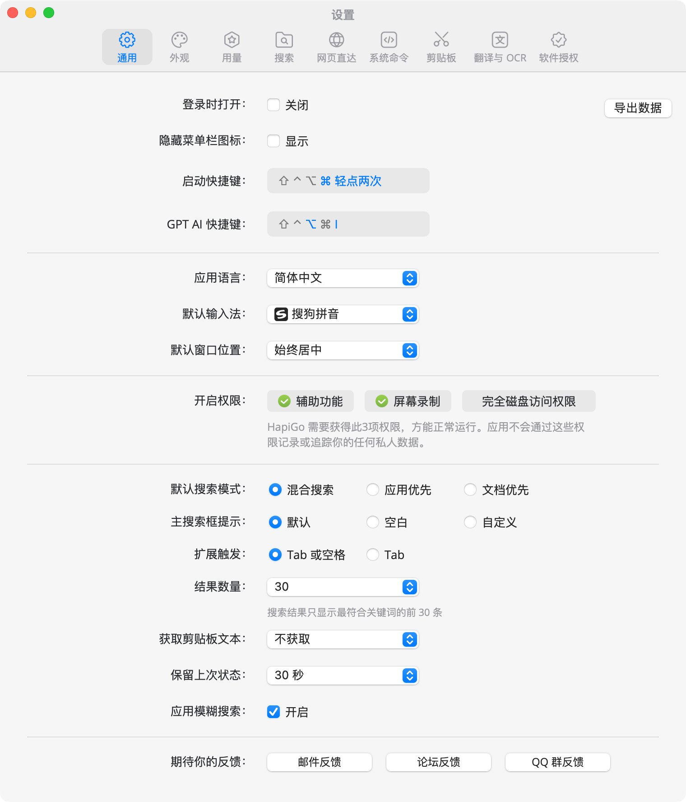
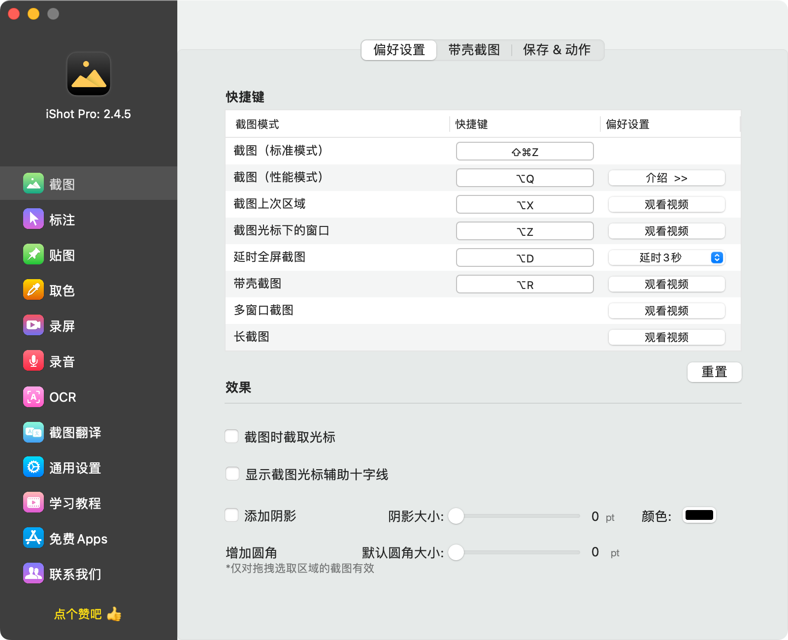
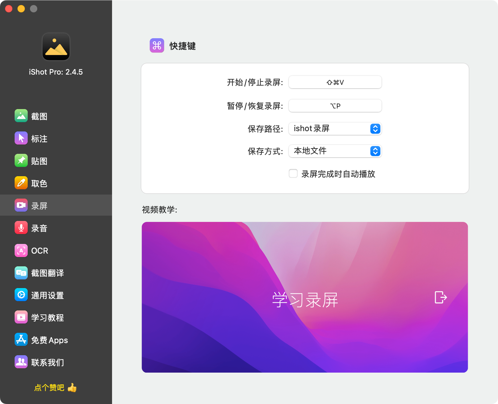
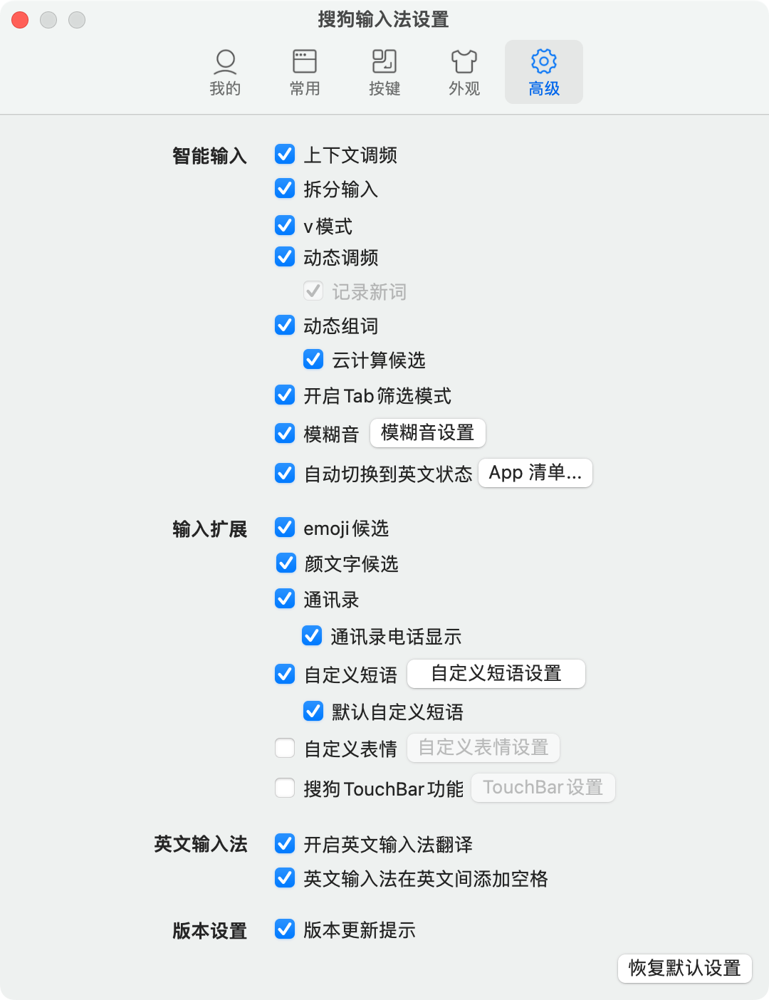
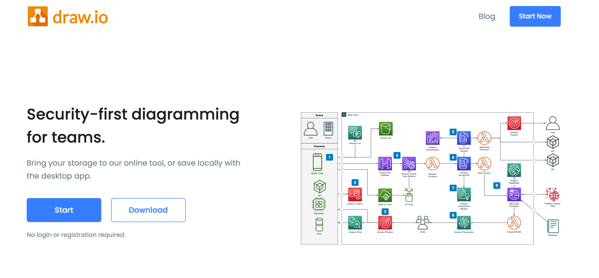
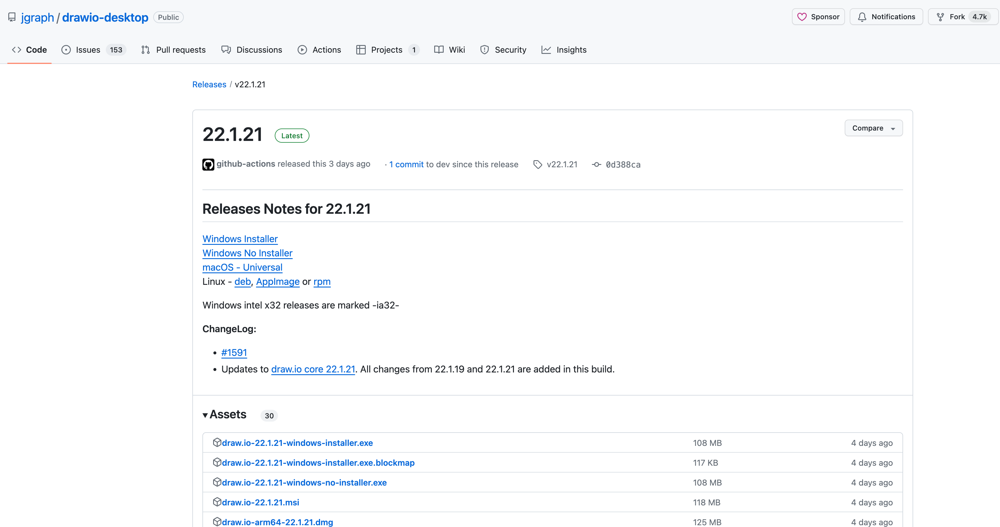
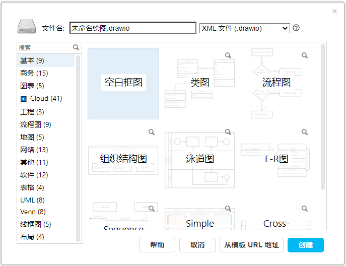

# 实践练习2：效率类工具的推荐和使用

在过往的工作当中，我经常会跟一些业务部门的人打交道，或者说我也有一个习惯，就是会经常关注一下别的人是怎么样用电脑，用软件，用工具，他有什么技巧，有什么好的方式我是可以学习的。  
通过这种习惯我慢慢地就观察到了一些有意思的现象，就是很多公司会给员工配一个屏幕很小的笔记本，然后也不会主动考虑给员工配置外接显示器，那么很多员工在使用这些电脑去办公的时候呢，就会发现屏幕很小，屏幕缩放比又很大，工作起来非常不方便。  
再加上一些员工自己本身又没有掌握一些高效率的处理事情的方式，也没有一些高效率的工具，就会导致工作起来有很多低效率的表现。对于产品经理来说，我觉得掌握高效率的工具和技巧，既能够提升自己的工作效率，避免长时间的加班，同时也能有效地提升自己的产品专业能力，通过刻意练习这些技巧来训练自己学习能力和发掘好产品的能力。  
本篇文章就是想跟大家分享一下，我自己在产品工作当中常用的一些提升自己工作效率的工具，还有小技巧。这些都是我日常在使用的，而且都比较高频，我觉得价值挺高的，应该会有很多朋友没有用过相关的东西，所以收获还是会比较大的。  
**清单合集**  
  

| 大类 | 工具/技巧名称 | 推荐理由 |
| --- | --- | --- |
| 桌面端应用软件 | Hapigo | Mac用户必备，效率启动器，就是开启提升效率的钥匙 |
|  | iShot | Mac用户截图必备，功能强大，能打十个 |
|  | 搜狗输入法 | Mac和Windows用户都推荐，让键盘输入快起来 |
|  | drawio | Mac和Windows用户都推荐，多画图，多输出 |
| 浏览器插件 | 见下方第二点 | 各种好用的浏览器插件推荐，提升浏览器的战斗力 |
| 网站/网址 | 见下方第三点 | 各种有价值的，能解决实际工作问题的网站推荐 |
| 产品设计 | 浏览器的一些技巧 | 浏览器的开发者工具Chrome DevTools使用技巧教学 |
|  | Axure的一些技巧 | Axure画原型的一些经验总结 |

**一、桌面端应用软件**  
我自己是使用的Mac，所以这里会以MacOS上面的软件为主，如果有Windows上面平替的内容，我也会在上面说明一下，如果没有说明的，大家可以根据自己的需要去搜索一下Windows是否有类似的平替型产品。  
**1****快速查找文件和APP**  
日常工作的时候经常需要快速查找一些文件，启动一些应用等，这个时候一个个翻查文件夹，效率就比较慢，这个时候就推荐使用“快捷启动器”型的软件。  
MacOS推荐使用HapiGo或者Alfred，我自己用[HapiGo](https://www.hapigo.com/)比较多，除了可以支持快速搜索之外，还有历史剪贴板，翻译和OCR等功能，一款抵多款，非常好用。  
  

推荐指数：⭐️⭐️⭐️⭐️⭐️

  
  

  
Windows可以使用Everything，Listary或者Utools，我自己之前用Listary比较多，我觉得很好用。  
**2****截图，长截图，贴图和序号笔**  
在日常的工作中，截图的操作肯定是用的最多的了，微信或者钉钉自带的截图只能说能用，但是不能说好用。我认为一款好用的截图工具起码要具备这么一些功能，才能有效地提升工作效率。  
1支持长截图，有些时候页面太长了，一屏截不下，就需要滚动页面来长截图；  
2支持OCR，截图和OCR功能天然就是结对出现的，OCR就是将图片中的文字转化为可复制，可编辑的文本格式；  
3支持贴图，截图之后的内容并不一定是要粘贴在某个地方，可能也需要贴在屏幕上，便于对比和观察，所以贴图功能也是非常有价值的一个点；  
4支持序号笔工具，当我们要写一些操作手册，帮助手册的时候，序号笔工具可以很方便地给出顺序和文字，指引效果更好；  
5支持取色，在画原型、做设计的时候需要用某个颜色，那么用截图工具来取色必然是最快的方式了；  
MacOS推荐的截图软件是[iShot](https://www.better365.cn/ishot.html)，需要付费，可以支持永久买断，也不是很贵；如果是Windows则使用QQ截图就够了，它的功能也很强大。  
  

推荐指数：⭐️⭐️⭐️⭐️⭐️

  
  

iShot的录屏功能也很强大

  
**3****搜狗输入法**  
很多人不喜欢安装第三方输入法，希望能用系统自带的输入法，但是从我过往的使用体验来看，第三方输入法带来的便捷和体验还是远远超乎系统自带的输入法的，所以我还是会强烈推荐大家去安装第三方输入法。这里我比较推荐的就是[搜狗输入法](https://shurufa.sogou.com/)，功能强大，各种词库和皮肤也很完善，Mac端的功能比较简单清爽。  
我常用的一些功能是：  
1自定义短语，快速输入邮箱，字符，地址等信息；  
2快速输入时间，日期等信息，这个在画原型，写文档的时候非常有用；  
3使用V模式，还有U模式等功能；  
4使用搜狗输入法的输入统计功能，了解自己每天的输入量；  
  

推荐指数：⭐️⭐️⭐️⭐️⭐️

  
  

  
感兴趣的朋友也可以试试[微信输入法](https://z.weixin.qq.com/)  
**4****流程图画图工具**  
当我们提到要画流程图的时候，Windows中比较常用的是Visio，但是Mac上大家可能就会有比较多的分歧，不能确定到底用哪个好。无论是Windows，还是Mac，我最推荐的流程图绘制工具就是[draw.io](https://github.com/jgraph/drawio-desktop/releases/tag/v20.3.0)，因为它不仅仅好用，功能强大，支持多客户端，而且还完全免费，更新速度极快。  
由于它是开源的产品，而且是基于网页端开发的，所以可以很好地和一些大厂的文档工具（钉钉，飞书，TAPD）等联动使用，从客户端中直接复制流程图然后粘贴在文档工具中的流程图画板中，直接就能保留相关的格式，非常的方便。  
  

推荐指数：⭐️⭐️⭐️⭐️⭐️

  
  

  
  

[Draw.io的使用技巧总结（摘录）原文地址：Draw.io实用技巧小结 - 十一度 - 博客园摘录时间：2023-11-17 22:37摘要原因：我一直都很喜欢draw.io这款产品，日常工作中也会有的很多，虽然我也花了一些时间去研究一些高级用法，但是当我看到了这一篇文章的一些介绍的时候还是让我感觉很兴奋“原来还有这种用法”，...🎁 维他入我心，价值抵万金](https://www.yuque.com/jiaowovitamin/uizu4s/vp1r3t9slht2r5m8)

**二、浏览器插件推荐**  
  

| **插件名称** | **推荐理由** | **安装地址** |
| --- | --- | --- |
| 广告终结者 | 去除一些国产流氓网站上的贴片广告，让你的浏览器更加清爽，同时也推荐大家使用Chrome或者Edge浏览器，不要使用360安全，QQ，2345等国产浏览器 | [前往Chrome商店](https://chrome.google.com/webstore/detail/%E5%B9%BF%E5%91%8A%E7%BB%88%E7%BB%93%E8%80%85/fpdnjdlbdmifoocedhkighhlbchbiikl) |
| 沉浸式翻译 | 访问全是英文的网站，想要逐行翻译查看其中的意思，那么就得要用沉浸式翻译这个插件了，它可以保留原文的同时再增加翻译的内容，方便你一边看资料，一边还能学英语 |  [双语对照网页翻译插件_PDF文档翻译工具 \| 沉浸式翻译](https://immersivetranslate.com/) |
| 沙拉查词 | 英文看不懂？划一下就可以查询了，非常方便，而且需要翻译的时候直接点击一下自动读取你的剪贴板，非常方便 | [前往Chrome商店](https://chrome.google.com/webstore/detail/%E6%B2%99%E6%8B%89%E6%9F%A5%E8%AF%8D-%E8%81%9A%E5%90%88%E8%AF%8D%E5%85%B8%E5%88%92%E8%AF%8D%E7%BF%BB%E8%AF%91/cdonnmffkdaoajfknoeeecmchibpmkmg) |
| Chrono下载管理器 | 解决Chrome浏览器下载进度不方便查阅的问题 | [前往Chrome商店](https://chrome.google.com/webstore/detail/chrono-download-manager/mciiogijehkdemklbdcbfkefimifhecn) |
| FigmaCN | 解决Figma太多英文术语，自己看不懂，用不习惯的问题 | [前往Chrome商店](https://chrome.google.com/webstore/detail/figmacn/japkpjkpfdakpkbcehooampdjfgefndj) |
| Tampermonkey | 传说中的油猴脚本，安装了之后还需要去脚本网站下载一些脚本，例如什么百度重新定向，CSDN免复制登录，商品历史价格走势，免登录下载，免VIP观看视频…… | [前往Chrome商店](https://chrome.google.com/webstore/detail/tampermonkey/dhdgffkkebhmkfjojejmpbldmpobfkfo)  [前往油猴脚本网站](https://greasyfork.org/zh-CN) |
| Tampermonkey脚本 （AC-baidu） | 这个脚本是必须推荐的，可以优化调整百度，Google搜索结果的展示，可以过滤广告，可以自动翻页等 |  [AC-baidu-重定向优化百度搜狗谷歌](https://greasyfork.org/zh-CN/scripts/14178-ac-baidu-%E9%87%8D%E5%AE%9A%E5%90%91%E4%BC%98%E5%8C%96%E7%99%BE%E5%BA%A6%E6%90%9C%E7%8B%97%E8%B0%B7%E6%AD%8C%E5%BF%85%E5%BA%94%E6%90%9C%E7%B4%A2-favicon-%E5%8F%8C%E5%88%97) |
| Tampermonkey脚本 （网盘直链下载助手） | 有一些分享的网盘链接在下载的时候需要安装客户端，很麻烦，可以通过这个脚本直接提取对应的下载链接，用浏览器自带的下载工具就可以下载了 |  [网盘直链下载助手](https://greasyfork.org/zh-CN/scripts/436446-%E7%BD%91%E7%9B%98%E7%9B%B4%E9%93%BE%E4%B8%8B%E8%BD%BD%E5%8A%A9%E6%89%8B) |
| Tampermonkey脚本 （CSDN广告过滤） | 经常登录CSDN的时候就会发现很多广告，然后每次看一些文章都要你登录，这个脚本可以移除这些烦人的东西 |  [CSDN广告完全过滤、人性化脚本优化](https://greasyfork.org/zh-CN/scripts/378351-%E6%8C%81%E7%BB%AD%E6%9B%B4%E6%96%B0-csdn%E5%B9%BF%E5%91%8A%E5%AE%8C%E5%85%A8%E8%BF%87%E6%BB%A4-%E4%BA%BA%E6%80%A7%E5%8C%96%E8%84%9A%E6%9C%AC%E4%BC%98%E5%8C%96-%E4%B8%8D%E7%94%A8%E5%86%8D%E7%99%BB%E5%BD%95%E4%BA%86-%E8%AE%A9%E4%BD%A0%E4%BD%93%E9%AA%8C%E4%BB%A4%E4%BA%BA%E6%83%8A%E5%96%9C%E7%9A%84%E5%B4%AD%E6%96%B0csdn) |
| 图片助手(ImageAssistant) | 遇到一些图片不能右键复制，不能查看大图的， 可以用这个插件直接提取本页的所有图片，小到一些logo、动图，大到一些大图等都可以提取出来 | [前往Chrome商店](https://chrome.google.com/webstore/detail/imageassistant-batch-imag/dbjbempljhcmhlfpfacalomonjpalpko) |
| Wappalyzer - Technology profiler | Wappalyzer是一个跨平台的实用程序，可以发现网站上使用的技术。它可以检测内容管理系统、电子商务平台、web框架、服务器软件、分析工具等等。可以查看竞品的技术栈，用的是什么框架等 | [前往Chrome商店](https://chrome.google.com/webstore/detail/wappalyzer-technology-pro/gppongmhjkpfnbhagpmjfkannfbllamg) |
| Similarweb - 流量排名和网站分析 | 快速获取网站的流量，访问数据等统计信息，可以判断对方的日活，流量情况怎么样 | [前往Chrome商店](https://chrome.google.com/webstore/detail/similarweb-traffic-rank-w/hoklmmgfnpapgjgcpechhaamimifchmp) |
| Video Speed Controller | 解决一些网页内嵌视频的加速问题，可以自定义播放速度 | [前往Chrome商店](https://chrome.google.com/webstore/detail/video-speed-controller/nffaoalbilbmmfgbnbgppjihopabppdk) |
| Axure RP Extension for Chrome | Axure RP文件生成的HTML文件，如果直接打开则会要求安装浏览器插件，所以有需要的时候可以先安装好这个插件 | [前往Chrome商店](https://chrome.google.com/webstore/detail/axure-rp-extension-for-ch/dogkpdfcklifaemcdfbildhcofnopogp) |
| 自选基金助手 | 上班的时候不方便看基金涨跌，那么就直接安装一个浏览器插件，偷偷点开看一眼就好了 | [前往Chrome商店](https://chrome.google.com/webstore/detail/%E8%87%AA%E9%80%89%E5%9F%BA%E9%87%91%E5%8A%A9%E6%89%8B-%E5%AE%9E%E6%97%B6%E6%9F%A5%E7%9C%8B%E5%9F%BA%E9%87%91%E6%B6%A8%E8%B7%8C%E5%B9%85/dhdelcemeednchdmijiocipbjlknndff) |
| Proxy SwitchyOmega | 有一定的技术门槛的插件，如果不会用可以多查一下教程。大概的用途就是可以通过这个插件来判断某个网站上要走代理还是有直连，适合与代理软件搭配使用 | [前往Chrome商店](https://chrome.google.com/webstore/detail/proxy-switchyomega/padekgcemlokbadohgkifijomclgjgif) |
| iTab | 安装了这个插件之后，点击浏览器的新建tab页之后就会自动打开这个页面，这个页面有一些小组件挺有意思的，属于一种新式的导航页工具 | [前往Chrome商店](https://chromewebstore.google.com/detail/itab%E6%96%B0%E6%A0%87%E7%AD%BE%E9%A1%B5%E5%85%8D%E8%B4%B9chatgpt/mhloojimgilafopcmlcikiidgbbnelip?hl=zh-CN) |

**三、工具型网站推荐**  
  

| **网站名称** | **网站地址** | **推荐理由** |
| --- | --- | --- |
| PDF爱好者的在线工具 | [https://www.ilovepdf.com/zh-cn](https://www.ilovepdf.com/zh-cn) | 当需要免费的工具来处理一些PDF的时候，就可以用这个网站，比一堆的国产辣鸡工具网站好用多了，很多功能都是免费的 |
| Tinypng | [https://tinypng.com/](https://tinypng.com/) | 当需要压缩图片大小的时候，可以用这个网站，上传图片然后处理后就下载，不用注册，没有广告，不用收费 |
| JSON处理 | [https://www.json.cn/](https://www.json.cn/) | 当研发丢了一串JSON文件给你的时候，可以打开这个网站，对JSON进行格式化，美化等，同时也可以很好地查看对应的结构关系，在对接接口的时候很有帮助，同时站内也有其他的一些工具可以使用，记得去打开看看 |
| 通义听悟 | [https://tingwu.aliyun.com/home](https://tingwu.aliyun.com/home) | 1.语音转文字，可以快速识别音频 2.根据语音内容自动提取关键词，整理会议纪要等 3.适用于开会录音记录，还有一些播客的内容转为文字稿 |
| KimiChat | [https://kimi.moonshot.cn/](https://kimi.moonshot.cn/) | 1可以帮助你快速总结分析长篇文档，提取关键信息，节省阅读和整理的时间。 2如果你需要处理财务报告、市场分析等数据密集型文档，Kimi Chat 可以提供关键信息的快速提取和分析。 3对于大量的发票、收据等需要整理的信息，Kimi Chat 可以协助你进行快速整理和分类。 4如果你在学习新的技能或知识，Kimi Chat 可以帮助你理解复杂的概念，提供学习材料的总结和关键点的提炼。 |
| deepl | [https://www.deepl.com/translator](https://www.deepl.com/translator) | DeepL翻译是2017年8月由总部位于德国科隆的DeepL GmbH推出的免费神经机器翻译服务。评论家对于它的评价普遍正面，认为它的翻译比起Google翻译更为准确自然。 |
| poe | [https://poe.com/](https://poe.com/) | Poe 是国外问答社区 Quora 推出的一款 AI 问答应用，Poe 并没有自己的大语言模型，而是将目前最强大的一些 AI 聊天机器人集合到一起，形成了一个 AI 问答互动平台，用户可以同时对多个聊天机器人提出问题，并快速获得相应的回答。 |
| Mac软件集合站 | [https://www.macat.vip/](https://www.macat.vip/) | 有一些Mac的软件付费太贵，想要找免费版或者破解版，我经常会登录这个网站去找，有一些特别好用的但是没有破解的就可以用付费版了 |

**四、产品设计过程的一些知识**  
1查看一些已经保存的网站的密码，可以通过“设置”，也可以用F12修改input的type="password"，删除“password”。  
2进入某些新的网站的时候要下意识去观察域名是什么，下次要再次进入的时候，如果没有添加到收藏夹，那么可以直接在地址栏中输入域名，然后浏览器会联想出相应内容，日积月累可以节省很多时间。例如我常用此方式去访问TPAD，语雀，知乎，苹果官网，Google，PMcaff，人人都是产品经理，Figma等。  
3Axure设置一套元件样式库和页面样式库，先定义好一些样式库，这样组件在使用的时候可以很方便就做出相应的高保真原型。  
4Axure可以复制svg粘贴进来，单击右键->变换图片->转svg图片为形状，就会变成一个可编辑的icon，而不是用截图的方式来处理icon，很多人都不知道这一点，经常采用直接截图的方式来处理，就容易有违和感。  
5如果网速够快的话，也可以使用内联框架（iframe）嵌套一些在线的流程图或者思维脑图，例如Processon或者语雀的内容都可以嵌套在原型中，这样可以在原型中看到其他的文件内容，就不用分别去打开其他的文件了。  
6Axure可以收藏喜欢的颜色，当UI设计好了规范之后或者没有UI的时候，可以设置一套颜色库，便于统一设计。  
7Axure有很多隐藏按钮或者功能在顶部的菜单栏中，例如辅助线，格式刷，自动保存时间，网格对齐等，别只盯着一些交互功能学习，这些基础的配置项可以多了解了解。同样地，以后有类似的软件，想要快速上手和学习的时候，也依次去了解各个隐藏的菜单项，然后体验一下，很快就能上手了。  
8当需要说明一些复杂的业务逻辑的时候，要谨记口诀：**文不如表，表不如图**。能画图就画图，能用表格表示就不要用纯文字。无论是在Axure中，还是TAPD中，还是产品文档、说明手册中，都可以使用这个口诀，换位思考，对比一下就会纯文字看起来真的太吃力了。  
9当团队没有UI的时候，产品需要输出高保真原型，带交互，也带标注。此时此刻，最佳的实践方式是产品经理需要将工作内容按岗位拆解成多轮，前一轮完成了之后才能继续下一轮。先将自己定位成产品，然后输出草稿版原型，用来做示意图和逻辑说明，当表达清楚了内容之后。再进入下一轮，将自己定义为UI或者交互，然后再输出高保真版的原型，给出细节的标注，可能还需要切图。最开始的时候我就是想着一步到位直接上高保真，结果发现一旦出错，要改的东西太多了，而且在画细节的时候还要考虑逻辑，处理逻辑的时候还要考虑UI，反而把自己陷入了两难的境地。