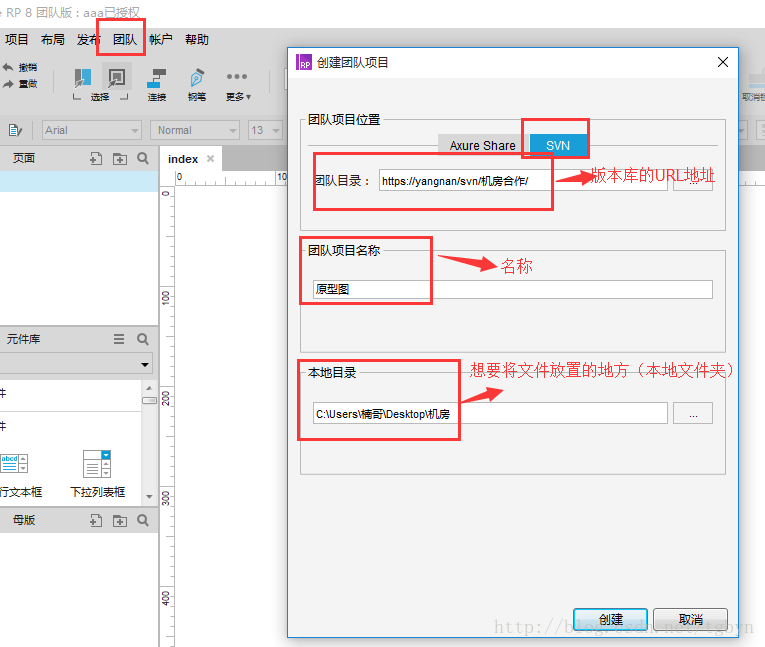
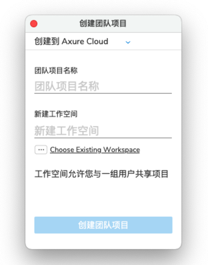
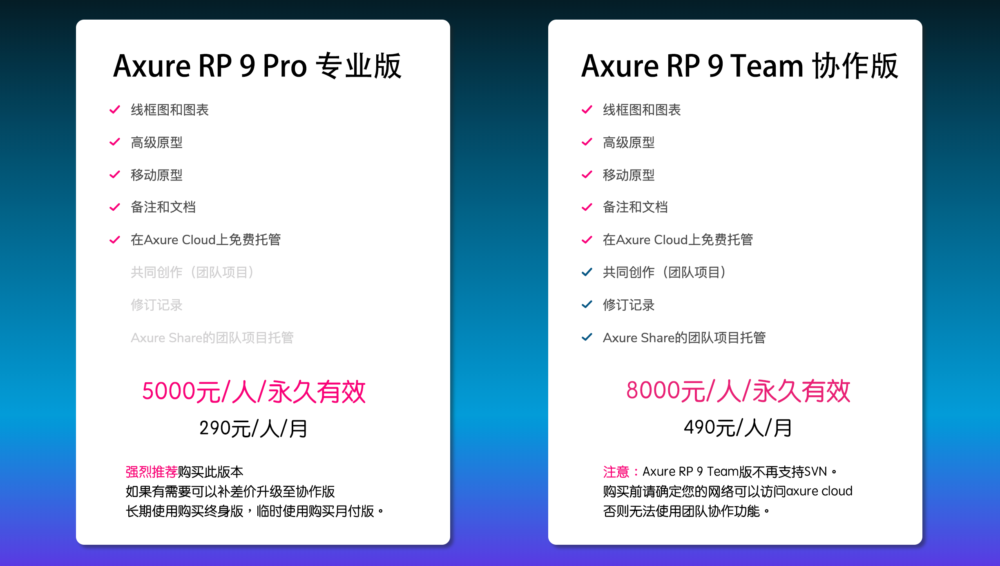
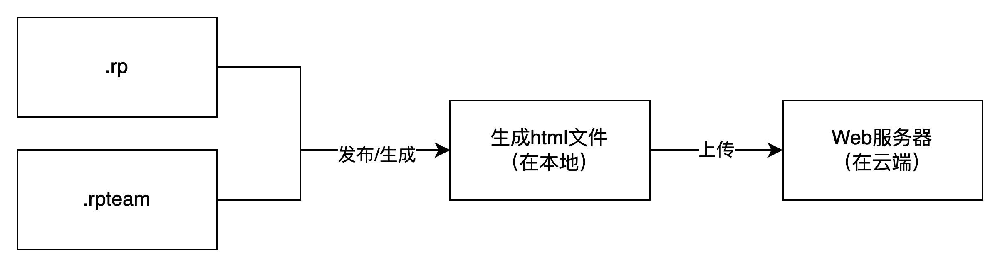
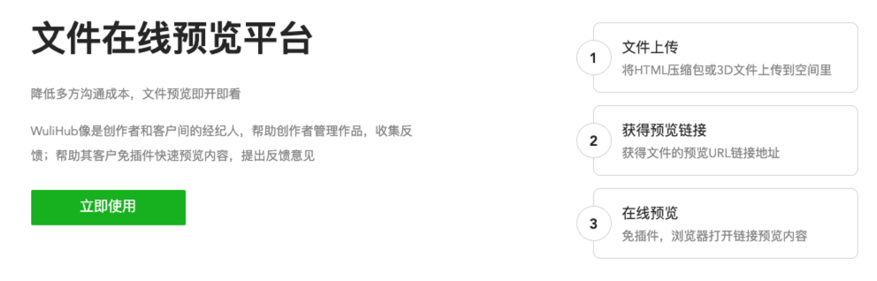
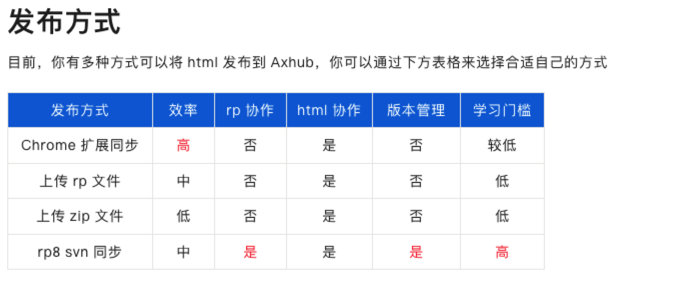
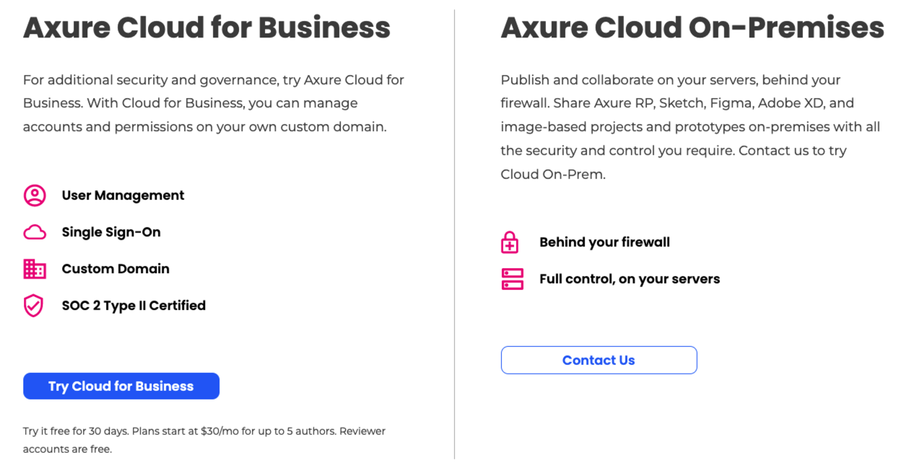
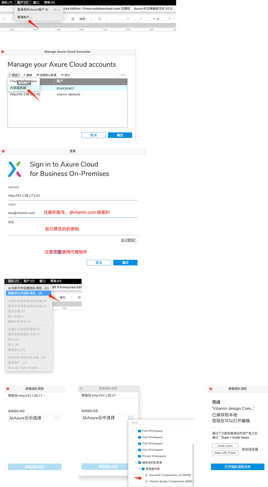

**什么是Axure协同绘制？**  
Axure协同是指类似于在线文档或者在线设计工具一样，可以多人同时一起编辑一个Axure文件。  
从我接触过的产品团队以及和其他朋友的沟通交流来看，到目前为止大家用Axure的还是多，而且挺多产品用Axure都是：**一个人编辑一个文件，一个版本编辑一个原型文件。**  
关于原型文件是一个版本一份，还是多个版本一份，后续我会写一篇相关的文章来分析我自己的看法，在此先不展开说了。  
一个产品编辑一个rp文件，最大的弊端就是不太方便协作，同时也不太能提升效率。如果多个人负责同一个系统，然后不同的模块之间有关联关系的时候，要么自己截图说明，要么找同事要他的原型文件，然后粘贴相应的模块到自己的原型上。同样的，也有可能同事会要找你要原型文件，然后粘贴到他的原型上。  
Axure rp8之前，是可以支持用SVN或者Axure Share来进行协同绘制的，也就是创建“团队项目”。一般团队都会让技术人员搭建一个SVN服务器，然后在Axure rp8中填写对应的SVN地址就可以进行相应的协作了。  
  

  
  
到了Axure rp9之后，Axure砍掉了SVN的协作方式，也将Axure Share改成了Axure Cloud。需要先创建一个团队项目，创建完项目之后，管理员通过网页邀请团队成员参与该项目，填写被邀请项目成员的注册使用的邮箱账号，项目成员收到管理员邀请邮件之后，点击收到的邮件链接，点击接受，即可加入到该项目中。  
  

  
Axure Cloud服务器在海外，国内的用户访问速度比较慢，一般是需要梯子速度才会快一些的。如果想要本地化部署，Axure Cloud也是有的，就是价格有点贵。  
  

  
Axure rp9怎么协作，可以看这一篇文章：  
[https://blog.csdn.net/qq\_15211883/article/details/91349056](https://blog.csdn.net/qq_15211883/article/details/91349056)  
**什么是Axure原型托管？**  
很多人以为原型的团队协作和原型托管就是一回事，但是其实这两者并不一样，有本质的区别。  
团队协作是多个人共同编辑一个文件，编辑的文件是以“.rpteam”结尾的，如果是非团队项目（个人项目）则是以“.rp”结尾的。  
原型托管是指将Axure生成的HTML文件托管在Web服务器上，以便于使用浏览器可以随时访问和浏览。  
  

原型托管（上传到Web服务器）

  
Axure客户端发布/生成的HTML文件是放在本地的，如果需要将其托管到云端，则需要将这些HTML文件上传到服务器上。  
目前市面上主流的几个原型托管软件，蓝湖，Wulihub，Axhub大多数都是采用这种HTML的发布方式。有些需要安装桌面端软件，有些需要安装浏览器插件，还有一些是直接使用压缩/解压缩的方式实现HTML文件的解析。  
  

  
  

  
还有另外一种比较牛逼的方式，是直接上传.rp文件，然后直接解析，例如目前语雀就可以做到。具体的实现方式网络上没找到，但是根据我之前的研究，大概率是后端装了解析器，所以比较耗资源，生成的速度也慢一些。  
  

  
  
以上的原型托管方式或多或少都有点麻烦，不够优雅。  
**最优雅的方式，应该是直接使用Axure自带的“共享到云”的功能，直接一键点击就可以上传到云了。**这个方案最核心要解决的就是网络的问题，需要梯子来帮忙，不仅仅发布者需要梯子，访问者也需要梯子，适合拉了专线或者全局部署了VPN的那种公司/团队使用。  
**怎么兼容Axure协同绘制和原型托管？**  
上面提到了，如果要使用Axure的协同功能（团队项目），则必须依赖于Axure Cloud或者SVN，而且Axure rp9是不支持SVN的，所以被迫只能使用Axure Cloud了；但是光解决协同还不够，还需要解决托管的问题，托管的方案中最优雅的还是Axure自带的云服务（Axure Cloud）。  
**所以结合上述的分析，Axure Cloud依然是最优解，只要能解决网络的问题。**  
那么如果解决不了网络的问题，还有没有其他的方案呢？  
**有的，那就是独立部署方案。但是我好像没有看到国内有卖独立部署版的方案的，只有美国的官网是有告知的。**  
  

  
然后无意中，我Google到了一篇关于Axure Cloud的破解教程，于是尝试了一下发现竟然真的可以完美解决这个问题。所以我就是去腾讯云买了服务器，然后一通操作之后搭建好了相关的原型服务器。  
破解教程暂时不对外发布，有兴趣的小伙伴自己私聊我哈。  
**Axure Cloud协同（客户端）怎么操作？**  
前面讲完了一些前因后果和方案决策，现在教大家怎么在自己的Axure客户端上，绑定账号，然后使用Axure Cloud进行项目的协同。  
1在Axure的“账户”，找到“管理账户...”，打开账户管理的弹窗界面；  
2左上角选择“添加”，然后选择“内部服务器”，因为我们是独立部署的；  
3内部服务器需要填写三个字段，一个是Server地址，一个是账号，一个是密码；  
aServer地址是 [http://43.138.173.42](http://43.138.173.42/app/) （注意，数字最后不需要留反斜杠，否则可能会出错）  
bUser是我给大家创建并私发的账号，一般是@vitamin.com结尾的，如果没有账号请联系我开通  
c密码是发给大家的账号密码，一般初始化的密码是1Qaz2Wsx，首次登录网页的Axure Cloud的时候会要求重置修改密码，可以先登录网页看看初始秘密是否正确  
4内部服务器的字段都填写对了之后，就会授权成功，如果授权失败注意检查这几点：  
a是否开了全局代理或者局部代理，好像这个会出错  
bServer地址是有填错，记得结尾不要有反斜杠  
c偶尔网络波动会导致授权失败，可以重试几次  
d账号密码错误，可以先在网页版使用账号密码登录试一下，网页版地址也是： [http://43.138.173.42](http://43.138.173.42/app/)  
5账号授权成功之后，记得将此账户设置为默认（选中，然后点击“创建默认配置”），这样每次发布的时候就会使用这个账户去发布，也就是上传到Axure Cloud中；  
6获取并打开团队项目，即从云端拉取团队项目下来，然后进行修改，修改完了可以再上传回去；拉取到本地的动作叫做“签出”，上传到云端的动作叫做“签入”；  
7如果要创建团队项目，就从“文件”->“新建团队项目”，然后按要求填写内容即可；  
  
  

  
  
**Q&A**  
**Q1. Axure怎么协作，不同的图标分别表示什么意思？**  
Axure rp9怎么协作，可以看这一篇文章：  
[https://blog.csdn.net/qq\_15211883/article/details/91349056](https://blog.csdn.net/qq_15211883/article/details/91349056)  
**Q2. Axure账号（非内部服务器账号）一定要登录吗？**  
可以不登录的，这个不影响内部协作使用。  
**Q3. 一定要使用Axure rp9吗？**  
是的，只有Axure rp9才可以，我使用的是Axure rp9（3740）这个版本，建议大家使用一样的。  
  

