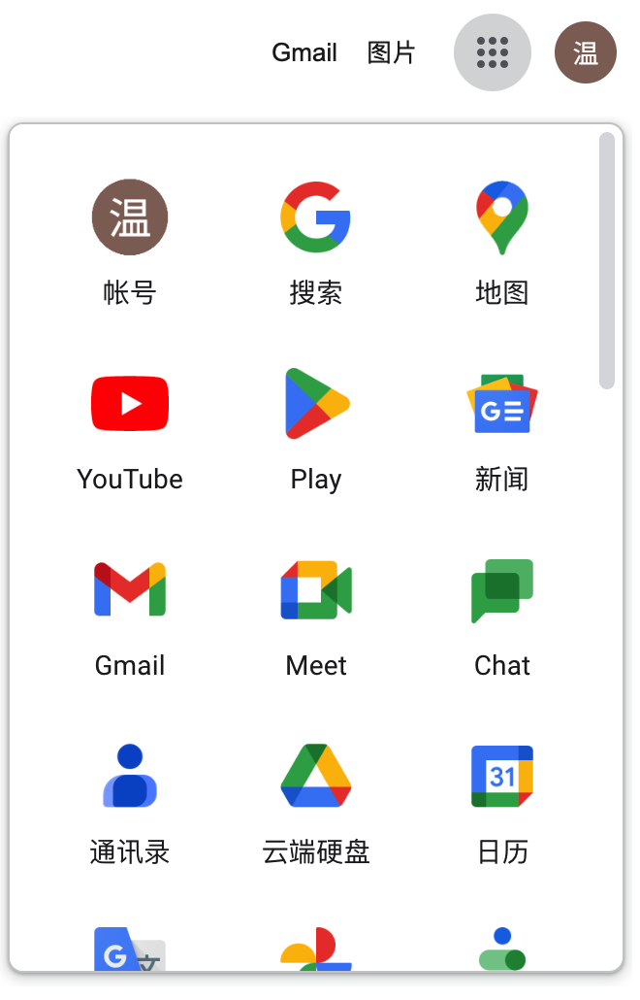
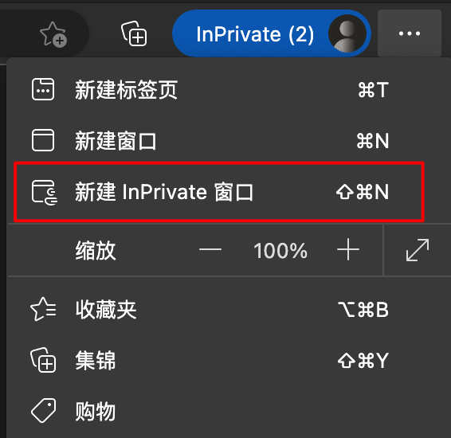
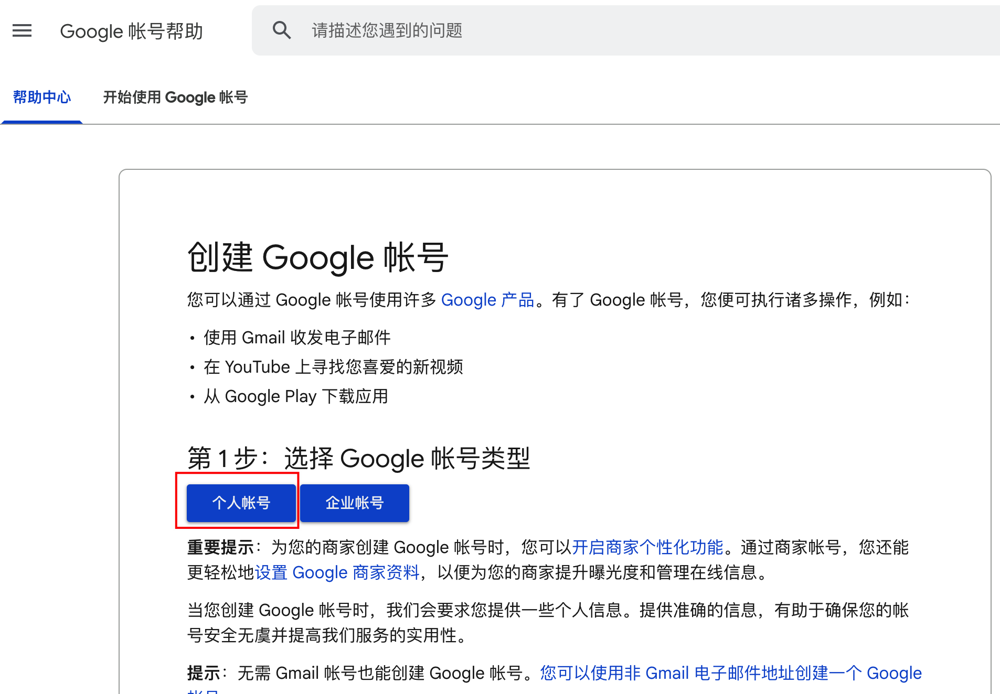
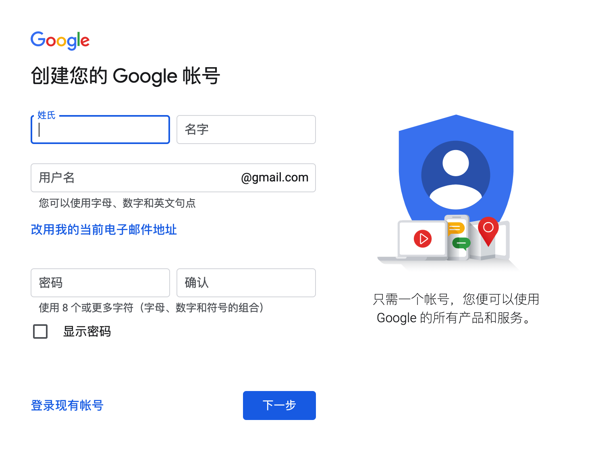
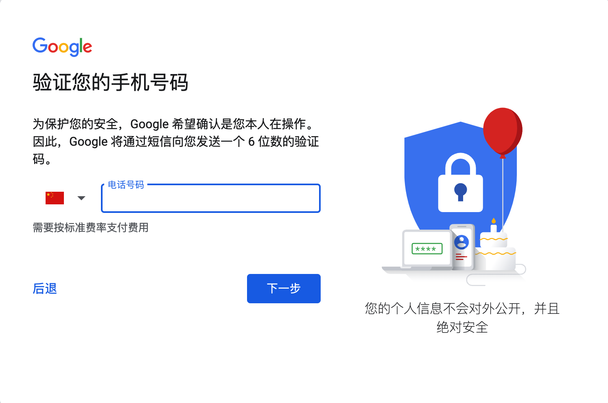
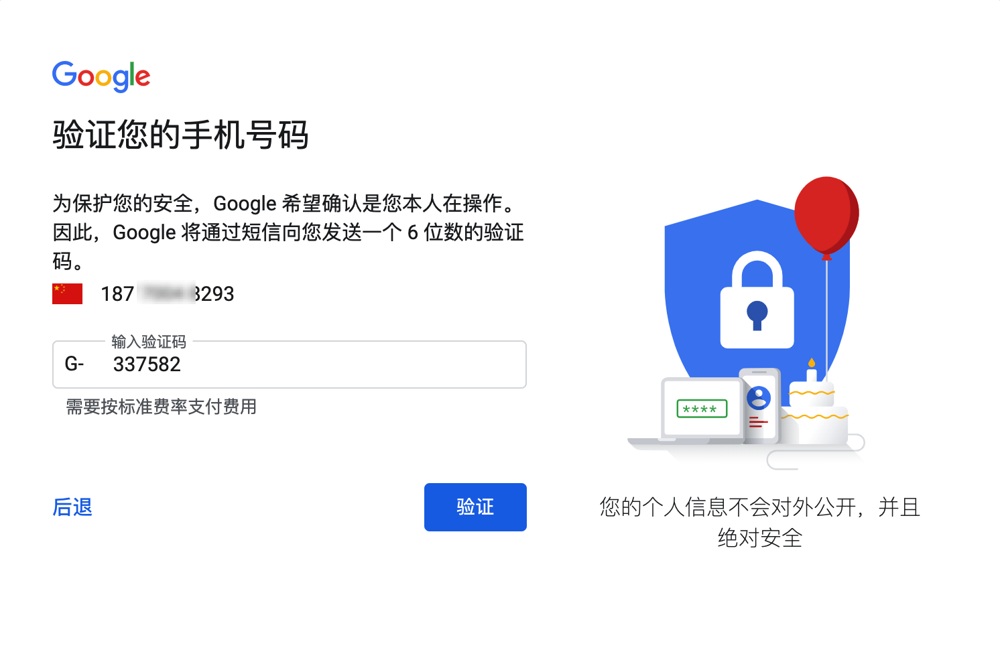
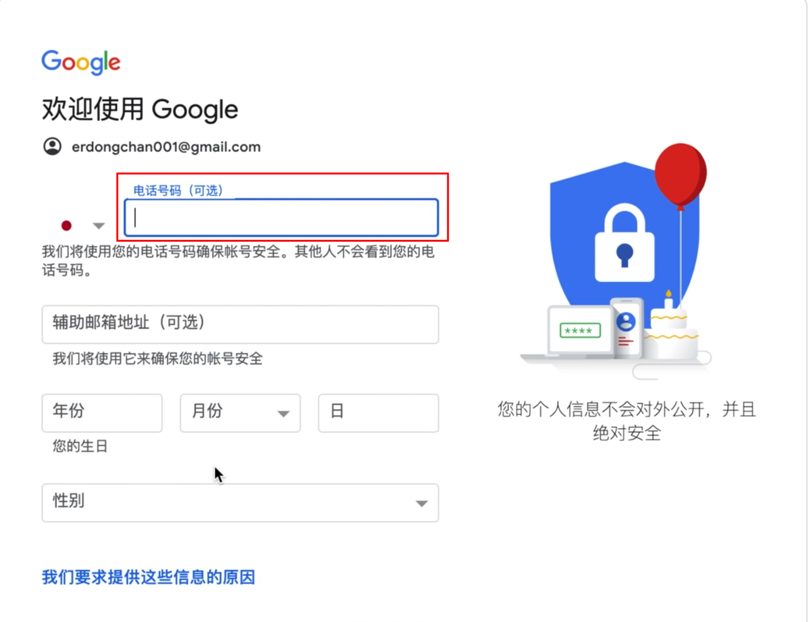

**为什么要学这个？**  
之前在第一节的课的时候，我强调了多次“产品经理要学会使用张良计”，而且也算是给出了一些很通俗易懂的教程了，帮助了不少的产品朋友打开了新世界的大门。  
但是不久前有一个朋友跑过来问我，听说Google的账号很好用，但是我一直注册不下来，那很多好用的功能我都不能体验了。而且很多国外的网站、产品等都可以支持Google快速登录，我没有这个账号每次都感觉很别扭……  
然后我想到了我当时注册Google账号的时候，也确实看了不少教程，最后一番折腾才搞定。所以我就去找了一下教程，看看2023年了有什么简单的办法去注册Google账号吗？  
于是就有了这一篇文章。  
**为什么需要Google账号？**  
这里说的Google账号，其实可以称之为Gmail邮箱账号，因为注册Google账号的时候就会注册一个Gmail邮箱，然后其他的Google产品都是用这个账号去登录的。  
Google的产品线很多，其生态地位类似于国内的QQ和微信，很多第三方的网站都会接入Google快捷登录，所以注册一个Google账号非常的必要。  
  

  
1不同设备的Chrome浏览器，登录同一个账号，可以实现收藏夹，账号密码，浏览记录共享等；  
2可以多一个Gmail邮箱，有一些时候邮箱不够用了，就可以考虑用这个；  
3Google的云盘和Google的在线文档协作等也非常好用，这些都需要一个账号；  
4一些第三方快捷登录的时候，可以使用Google账号关联，非常便捷；  
5其他场景……  
**Google账号注册之难是什么？**  
按理说一个账号的注册没什么难的，卡住很多人的点就在于短信验证这一步，自己注册Gmail账号的时候，需要填写手机号。而填写+86的手机号则收不到验证码，可能是Google屏蔽了这个注册发送短信验证码的接口……  
所以我们要解决的问题就是：怎么接受Google的验证码？  
1想办法绕开短信验证码，让短信验证码变成可选项，而不是必选项。之前我注册Google账号的时候就是用的这种方法；  
2搞一个其他地区的手机号，可以接收短信验证码的。例如之前我也找一个澳门的朋友帮忙接一个验证码，注册之后就可以换绑了；也可以自己选择用接码平台去搞定手机号的事情；  
3最简单的一个办法就是去闲鱼或者PDD等平台购买已经注册好了的，用钱换时间一定的最简单的办法；  
**注册方式（2023/03/18）**  
  

| 1使用Edge浏览器，同时打开无痕模式的窗口。如果之前登录过Google的账号，可以先退出原来的账号，清除缓存 |  |
| --- | --- |
| 2在无痕模式下打开这个注册链接 [https://support.google.com/accounts/answer/27441?hl=zh-Hans](https://support.google.com/accounts/answer/27441?hl=zh-Hans) 如果打不开链接，请先开启张良计，注意别那种太便宜的、太多人用的节点，这种节点往往很多人用，很容易触发风控 |  |
| 3正常填写对应的内容项即可 |  |
| 4如果这里看到手机号是必填的，那么就说明可能的节点有问题或者是浏览器的环境有问题，会需要强制要求输入手机号进行验证，可以切换其他节点或者换个浏览器的隐私模式 |  |
| 5我换了一个浏览器之后，我发现还是要继续输入手机号，然后我输入了自己的手机号后发现好像可以直接接码 |  |
| 6如果这里看到手机号是可选的，那么就说明可以不要求验证手机号了，只需要填写一个辅助邮箱地址验证就好了 |  |
| 7 后续就按流程下一步一步就好了，建议有条件的情况下多注册两个Google账号，留着备用 | 为了写这个教程，我发现折腾下来之后，我自己一共有5个Google的账号了🤣 |

**其他教程**  
[https://www.youtube.com/watch?v=gxw8JgmLZCY](https://www.youtube.com/watch?v=gxw8JgmLZCY)  
[https://www.youtube.com/watch?v=SDbM7\_hEZOg](https://www.youtube.com/watch?v=SDbM7_hEZOg)