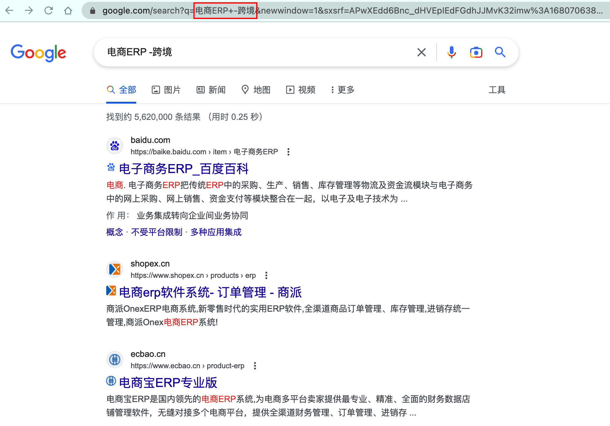
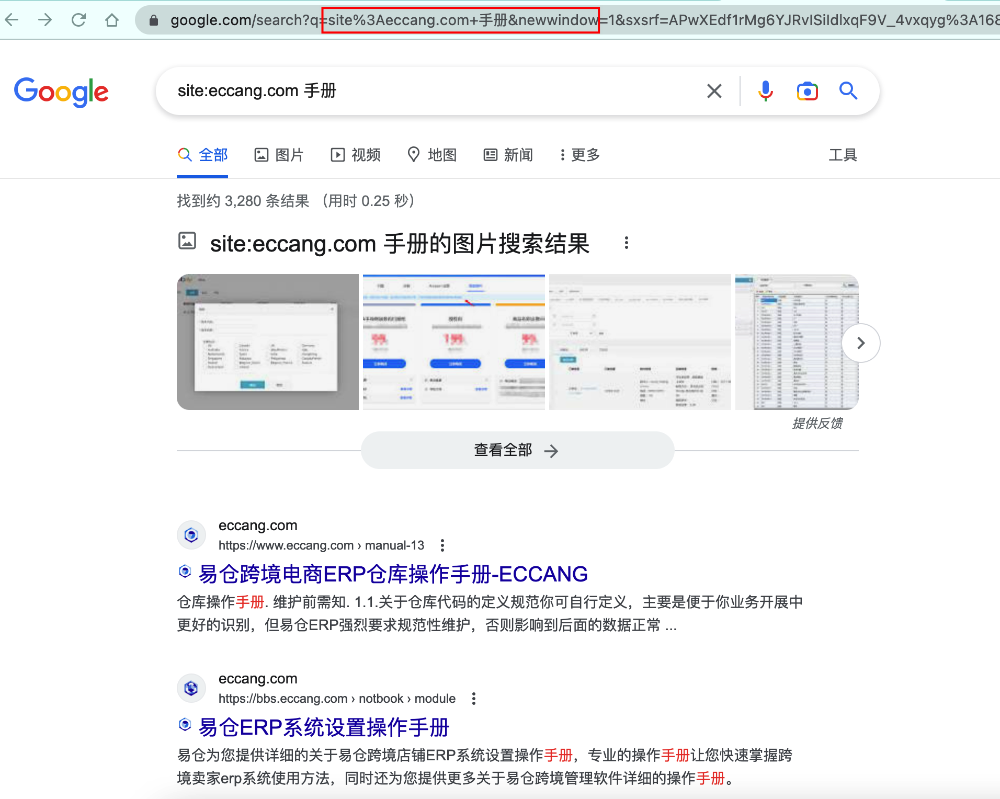
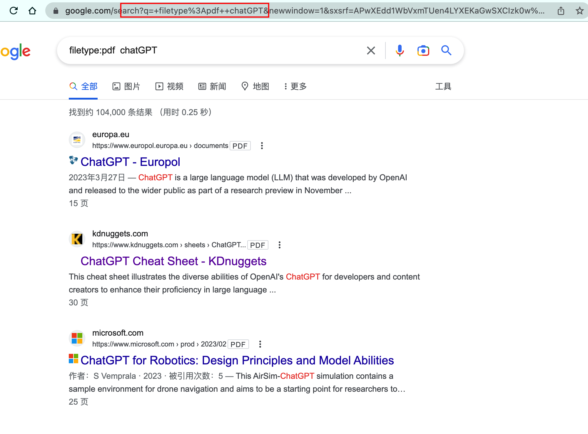
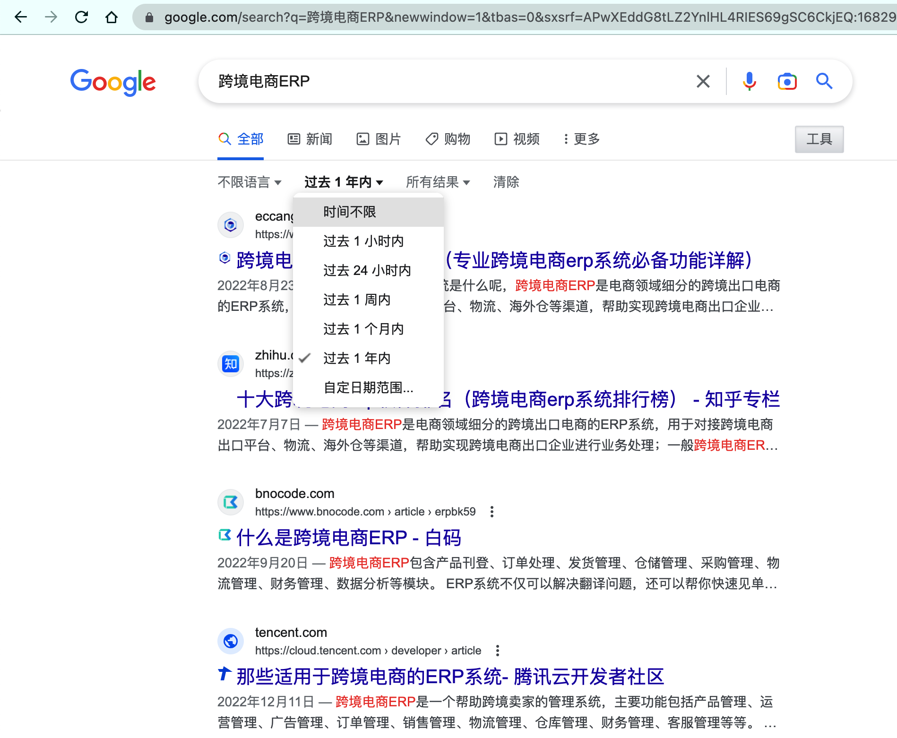
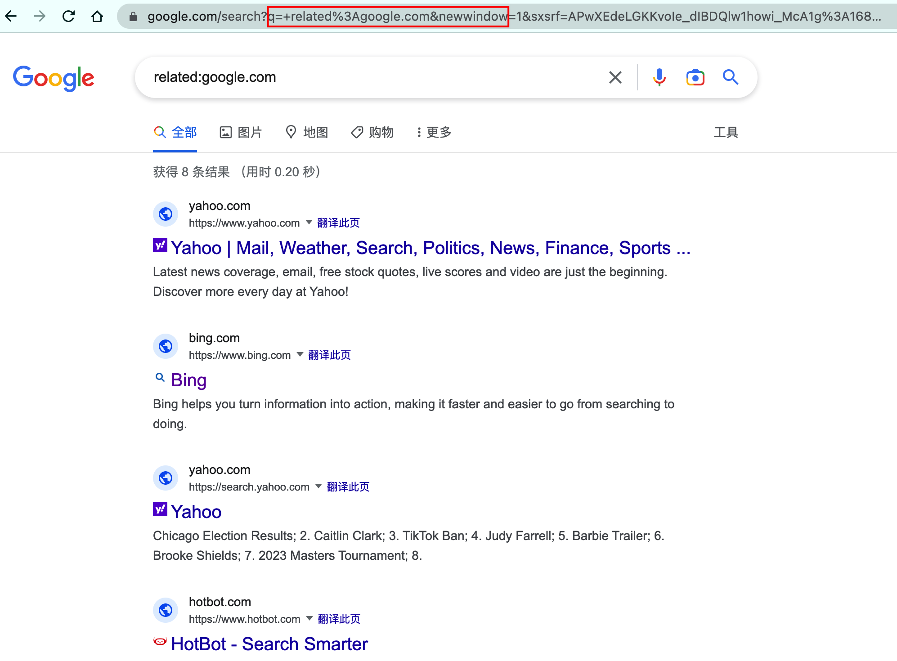
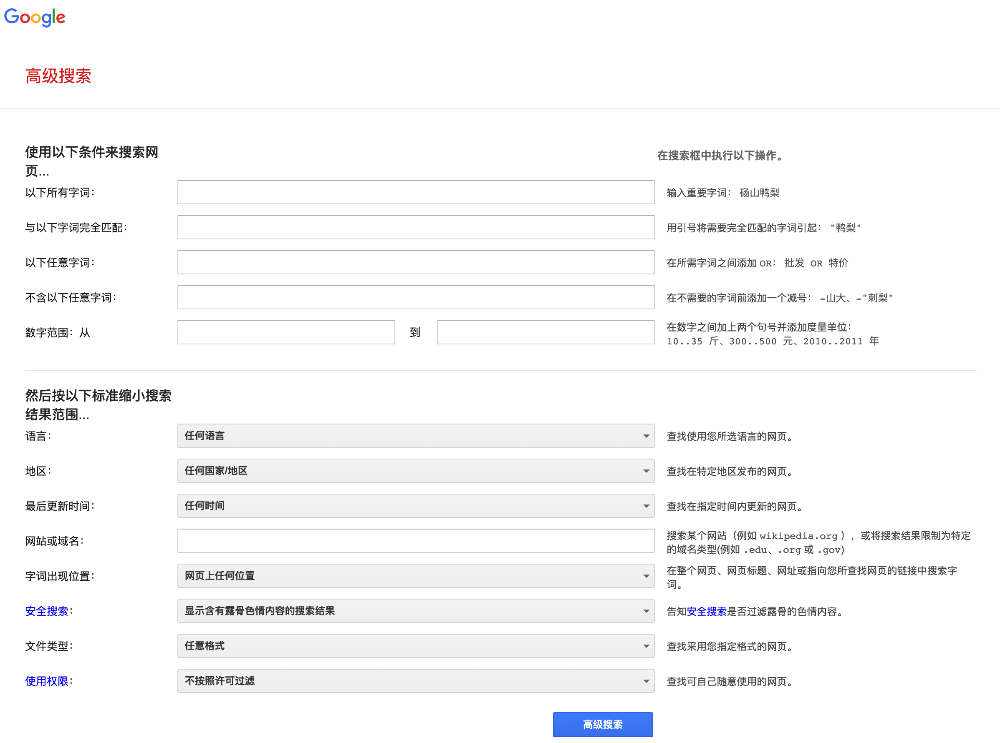

## 为什么要学？

很多朋友最早使用的搜索工具就是“百度”，遇事不决，百度一下就可以搞定了。百度或者Google的主页看起来就只有一个简单的输入框，输入了一些内容之后就可以查询出很多的信息，于是我们就慢慢地就养成了习惯：

> 直接输入问题，然后在返回的一大串数据中一个一个翻阅查找……

其实无论是百度也好，Google也好，都是会有一些高级搜索的，这个东西并不是很高深的内容，只不过是我们平时用简单版的用得太多了，对越熟悉的东西反而越不知道还有其他的用法。

所以我找了一些资料，把常用的一些Google搜索技巧整理了一下，同时给了示例和截图，帮助大家更好地学习掌握这些技巧，然后用在我们的日常工作和学习中。

虽然标题和正文都是写的Google，但是百度，Bing等搜索引擎也是适用的，不过就是Google的搜索做得更专业、受众更广，所以就用了它来举例子。

## 常用的技巧有哪些？

| 技巧 | 说明 | 示例 | 截图 |
| --- | --- | --- | --- |
| 使用完全匹配，更精准搜索一些关键词 | 用引号将需要完全匹配的字词引起： "苹果手机" | “苹果手机” |  |
| 搜索的内容中不包含某些内容，需要去掉某些内容 | 在不需要的字词前添加一个减号： -山大、-"鸭梨" | 电商ERP -跨境 |  |
| 只搜索某个网站的内容，快速了解该网站中网页内容 | 搜索某个网站（例如 wikipedia.org ），或将搜索结果限制为特定的域名类型(例如 .edu、.org 或 .gov) | site:eccang.com 手册 |  |
| 只搜索某种格式的文件 | filetype:搜寻结果为包含某个关键词的固定文件格式 | filetype:pdf ChatGPT |  |
| 对查询结果进行过滤 | 点击右侧的工具，可以对查询出来的结果进一步的过滤筛选，我常用的就是把搜索时间改成最近一年或者最近一个月 | 一共有三个筛选项： 不限语言时间不限所有结果 |  |
| 查询类似的相关网站，用来找竞品类的网站很方便 | 如果你想知道和某个特定网站相关的其他网站，可以使用related:标签。 例如，你搜索 **related:google.com** 就会得到所有和Google类似的网站，如：Bing、Yahoo、DuckDuckGo等。 | related:google.com related:shopify.com |   |
| 以图搜图 | 如果别人发了一个图片给你，你想知道这个图片的出入，是不是网图，可以使用此功能 | 上传对应的图片即可查询搜索 |  |
| **高级搜索** | 以上所有的技巧都可以在Google的高级搜索中看到对应的方式 | 如果觉得这些技巧记忆比较困难，就记得用“高级搜索”就好了 |  |

## 一些拓展延伸

1.  如果是做一些用户量级比较大的产品，先保证基础功能、常用功能是简单易上手的，同时也要给专业用户留一个口子，让这些专业用户的需求也可以得到满足；
2.  上手一些新产品、新软件、新系统的时候，可以考虑先看看基础设置或者高级设置，还有关联的帮助手册等，这样可以帮助我们打开思路，知道这个产品有哪些边界，哪些是可以修改优化的；
3.  自己在设计产品的时候，尽量给用户勾选上一些简单的默认设置项，不要做太多用户自定义的配置，一方面的会使用的用户比较少，另一方面是用户学习成本也非常高。

## 所有技巧整理

### 1.使用Tab面板

使用谷歌使用结果完成后，在搜索栏的下面会出现多个Tab面板，默认分别是全部，新闻，图片，视频，地图，更多等，这里面如果我们已经知道我们要搜索的分类是某个类目的时候，可以直接点击Tab面板将搜索结果限定在大的类目中，这样更方便我们定位检索的资源。

### 2.使用双引号

比如我想搜索宠物狗穿的毛衣，我在输入框里面输入了三个关键词pet dog sweaters，默认情况下谷歌返回的内容是包含这个三个词可任意调换顺序的命中结果，如果我们认为这三个词是一个整体，搜索的结果里面必须保持和搜索关键字一样的出现顺序，这个时候我们双引号来告诉谷歌，我们想要更精确的查询： "pet dog sweaters"。

### 3.使用连字符排除指定搜索内容

有时候我们搜索的关键词本身可能有多种含义，这个时候通过连字符可以排除我们不需要出现的结果。比如我们搜 apple 这个词，在谷歌里面可能是水果的意思，也能是iPhone手机相关的含义，如果我们搜的是iPhone相关的内容，这个时候可以设置搜索关键词为： apple -fruit，这样以来就可以排除掉与水果有关的apple信息。

### 4.使用site关键词

site关键字是google索引的一个内置字段，有时我们已经明确我们要搜索的内容就在某个网站，这个时候这个关键字就会很有用。比如说我在谷歌搜索hadoop，但是我只想看官网文档的内容，不想看其他乱七八糟的网站的东西，那么我们就可以这样搜索： hadoop site:apache.org ，这样就能够只检索我们想看的目标网站的内容。

### 5.使用link关键词

使用link关键词限定是另外一个使用比较少的功能，这个功能可以让我们找到含有指定关键词的网页是否链接了我们指定的网站，例如，我们搜索的关键词如下： csdn link:stackoverflow ， 这个关键词的含义代表含有csdn关键词的网页里面，那些有引用可以链接到stackoverflow这个网站。

### 6.使用通配符检索

通配符检索也就是所谓的模糊检索，比如我们可以这样在google中搜索世界最大的国家， "\* is the largest country in the world"。或者我们想检索"sp\*"开头的单词，通过通配符我们使用占位的方式来检索特定内容的结果集。

### 7.使用related关键词

related关键字可以搜索内容相关或者类似的网站，比如我们天天用淘宝购物，现在想知道做电商的其他的网站有哪些，我们的搜索关键词可以这么输入：related:taobao.com

### 8.使用google去做数学运算

这个特性可以在让我们在谷歌搜索框直接输入数学计算表达式，然后谷歌会直接返回一个第一条是个计算器的页面，并且计算结果也显示在计算器里面。例如直接搜索：PI , 1+2+3 , 5\*100+3 , 10/3(结构是浮点数)等表达式。

### 9.一次搜索多个关键词

注意，这里有个强调关键词的概念，大部分情况下，如果我们在谷歌搜索框输入的关键词越多，那么命中的结果集就会越来越小，有可能直接导致搜索不到数据，所以在搜索中尽量找到一个或多个关键词，默认情况谷歌使用的AND逻辑，多个关键词都必须出现才能命中结果，但一些情况下我们想要只出现其中任意一个关键词命中就可以，我们就可以使用OR关键词，例如：dog OR cat wiki，一下检索两个关键词的维基百科，注意OR必须大写。

### 10.搜索使用数字范围搜索

范围限制功能使用也非常简单，使用两个点号就可以了，举个例子，比如我要搜索java在2013-2014年有关的文章，输入的语法如下：java 2013..2014 就可以了。如果我们不写任何关键词，直接输入比如： 33..35，那么google就会广泛的搜索在33和35之间任何有关的东西。

### 11.关键字尽量简单

谷歌检索其实是依据关键词来检索的，这就要求描述尽量精简和准确而并不是描述详细和冗长，比如你想搜索附近的肯德基餐厅有哪些？

如果直接输入： 我想知道附近的肯德基餐厅有哪些？ 其实是没必要的。

可以直接替换为： 肯德基 附近

就行了，这样以来既精简又准确。

### 12.逐步增加搜索关键词

有时候，简单的关键词可能描述的确实不够完善，这个时候我们应该逐步的增加关键字来获取更好的搜索效果。比如你要进行一次演讲而不知道如何准备，那么你可以在谷歌里面搜索的阶段如下：

a. 演讲

b. 准备 演讲

c. 如何 准备 演讲

注意这里面没有从第一步直接过度到第三步的原因是如果缺少了第二步，可能会漏掉某些我们想要的结果。因为很多网站描述同一件事使用不同的方式，我们通过这种方式可以尽可能全的，准的找到我们想要的信息。

### 13.描述替换

这是一个非常重要的原则，有时候我们说的话表达同一个意思，但可能使用不同的描述。 不同的描述，虽然意思或者目的可能相同，但谷歌搜索的结果却是不一样。举个例子，某一天你开的车的轮胎坏了，如果你直接在谷歌搜索：

我的车的轮胎坏了，可能解决不了你的问题，而你真实的意思表达的是想修理轮胎，所以这个时候你应该这样描述： 修理 轮胎。

另外一个例子，如果你的头受伤了，如果你直接搜： 我的头受伤了这可能不是你真实的目的，其实你可能想要找如何减轻头痛或者缓解的方式，这个时候你应该检索： 头痛 缓解。通过这样的转换，可以帮助我们找到更准确的结果。

### 14.只使用最重要的关键词

这个原则其实很前面说的几条有点类似，默认情况下输入谷歌搜索的关键词越多，返回的结果就会越少，如果找不到最重要的关键词，那么反而会浪费时间在切换尝试上。举个例子如果你搜索： 我在哪里可以找到一个海底捞餐厅。这样反而可能搜不到结果。相反替换成：

海底捞 餐厅 附近

可能效果会好的多。总之使用谷歌搜索的时候，尽量保持关键词简单和重要。

### 15.快捷搜索命令

在谷歌上有一些常用的快速检索出结果的关键词，比如你搜下面的几个关键词：

中国邮政编码 中国高校 中国首都 中国历史古都 圆周率 miles to km 人民币汇率

等等都可以直接出对应的结果

### 16.拼写自动纠正

这个功能我们在很多软件里面都有，比如word，ppt里面，当然谷歌里面也一样，如果某个单词的某个字母写错了，不管是缺少字母，还是多字母或者顺序不对，都基本不影响我们的使用。

### 17.使用描述性词语

这个技巧和前面的几条其实是有关系的，简单的说，如果搜索某个关键词没有命中的时候，我们可以使用其同义词，或者意思相近的描述来增加搜索范围，这样就会有更多可能找到我们想要的。

举个例子，比如搜：

如何给windows系统装驱动 ？

可以替换描述为：

解决windows驱动问题。 等等类似的。

### 18.使用filetype关键词

filetype也是一个非常使用的功能，在寻找或者下载某一类文件时候能够快速检索我们需要的文件后缀的资源。比如搜索：

深入理解计算机系统 filetype:pdf

就可以找到某些电子书的pdf版本，同样的我们可以用来搜索ppt，word，mp3等各种格式的资源。

​  

## 练习作业

> 学习实践上述提到的一些常用技巧及所有技巧中感兴趣的部分，然后分别使用Google和baidu去尝试搜索一下自己感兴趣的内容，同时也分别体验一下Google和Baidu的高级搜索，然后将这些方法整理成一个自己的搜索技巧文档。