## 为什么要用draw.io？

在日常的工作中，产品经理必然需要经常画一些图来表达某些逻辑或者说明，例如说流程图、ER图、用例图、时序图等，一个好用的画图工具不仅仅可以高效完成工作，节省时间，也可以画出优雅简洁的图例来呈现表达信息。

很多产品初次接触或者使用的画图工具是Visio，但是Visio是付费软件，需要破解，比较麻烦，而且安装包也很大，比较笨重。还有一个很关键的点，就是Visio不支持Mac系统，所以如果是Mac用户是没办法使用Visio的。

我个人最推荐大家学习和使用的画图工具是**draw.io**，它适配多种系统（Windows，MacOS，Linux），也有网页版，而且功能也很强大，完全可以代替Visio来使用。

[https://www.drawio.com/](https://www.drawio.com/)

## 为什么要学一些用法技巧

虽然说draw.io很好用，很高效，但是对于初次使用它的用户来说，肯定还是有一定的学习成本的，而且如果使用不当很有可能还会降低自己的画图效率。

所以，以下推荐的这些高效率的用法技巧大家一定要去亲身实践一下，对着操作说明来实操一下，只需要不到1小时的时间，你就能高效率的掌握这一块工具，画出优雅简洁的图例。

## 用法技巧的分享

### 移动画布

-   方式一：拖动画布界面的滚动条  
    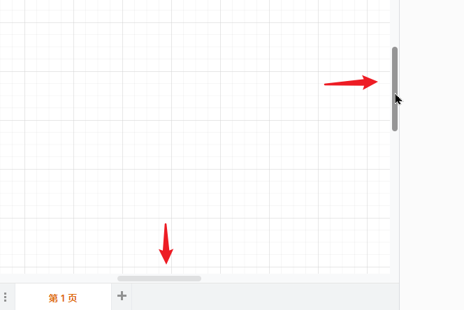
-   方式二：按住键盘空格键，搭配鼠标左键进行拖动
-   方式三：直接使用鼠标中键（滚轮），按下去进行拖动画布
-   方式四：

-   左右移动画布：按住Shift后滚动鼠标滚轮
-   上下移动画布：直接使用鼠标滚轮即可

### 缩放画布

-   方式一： 使用工具栏的固定数值、放大缩小按钮  
    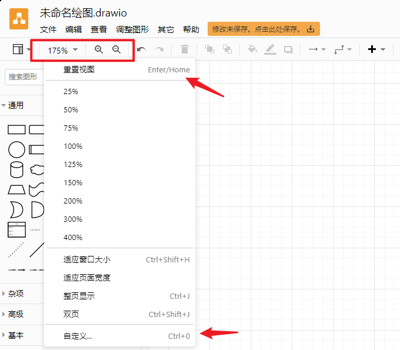

从上面的截图可以看到提供的一些快捷键，其中Enter可以实现100%显示和当前缩放比例的切换，比Home更强大。  
其他的快捷键可以自行操作记忆。

-   方式二：按住Alt或Ctrl后，再滚动鼠标滚轮，可实现以鼠标指针为中心进行缩放

### 形状基础操作

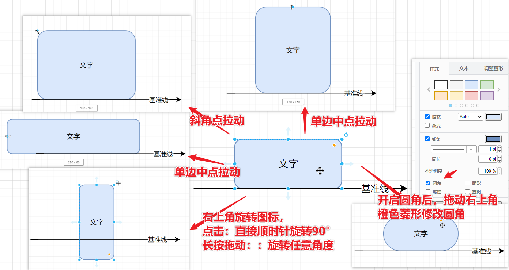

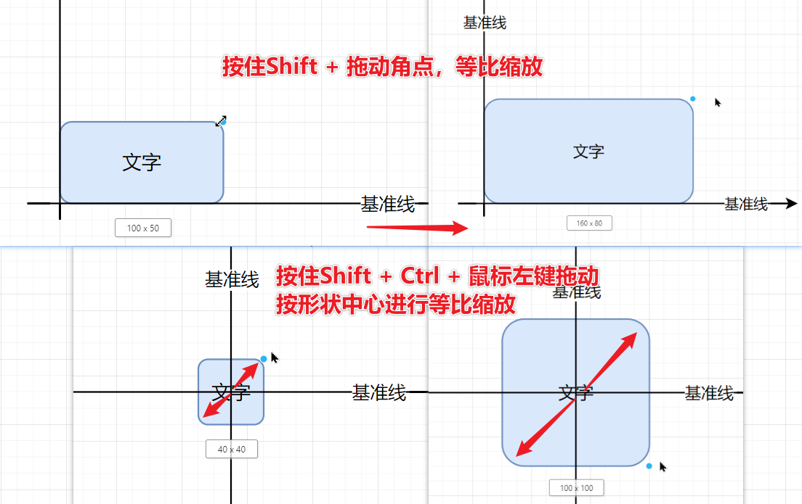

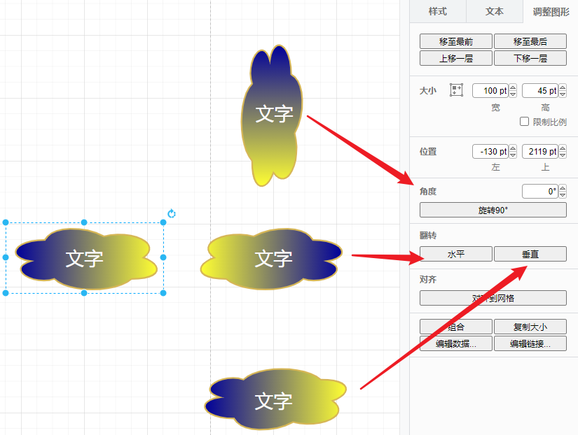

-   键盘调整形状大小：

-   选中形状后，使用Ctrl + 上下左右箭头，可实现1pt步长的大小变换
-   选中形状后，使用Shift + Ctrl + 上下左右箭头，可实现10pt步长的大小变换

-   统一调整大小：按住Shift + Ctrl + i

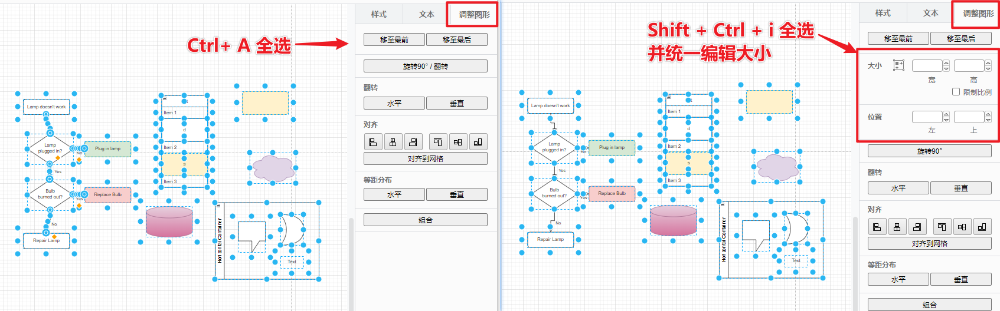

-   自动调整大小：选中某一个形状，Shift + Ctrl + Y

### 复制形状

-   方式一：选中形状后，直接Ctrl + D或者Ctrl + Enter，即可错位复制
-   方式二：选中形状按住Ctrl并拖动鼠标左键，即可拖出克隆出来的形状
-   方式三：在连接点处选择首个形状，即可复制所选形状并将两者进行**连接**
-   方式四：选中形状后，Shift + Alt + 上下左右箭头，即可复制所选形状并将两者进行**连接**

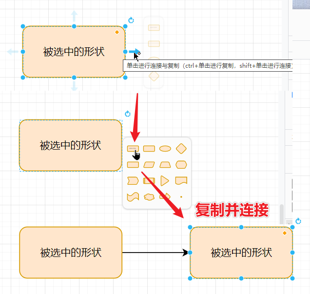

### 删除形状

-   保留连接线：直接选中形状，点击Delete或者Backspace
-   一并删除连接线：选中形状后，点击Ctrl + Delete/Backspace

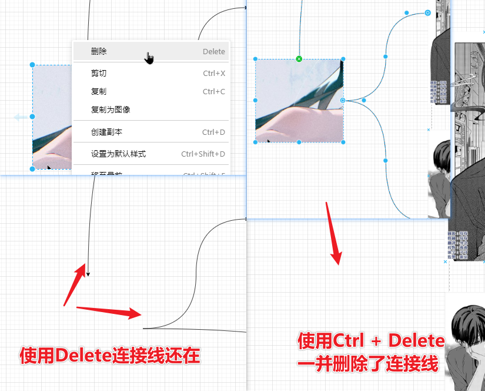

### 快速替换形状（非常好用）

-   方式一：从形状库中将形状拖到对应的需要被替换的形状上，当出现蓝色的圆后，松开鼠标即可完成替换

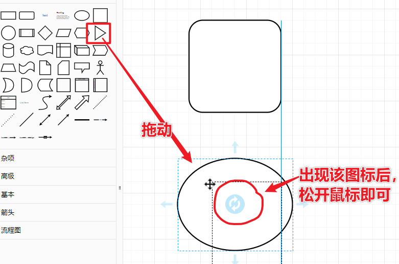

-   方式二：选中需要被替换的形状后，直接在形状库中对形状Shift + 鼠标左键单击，即可完成替换  
    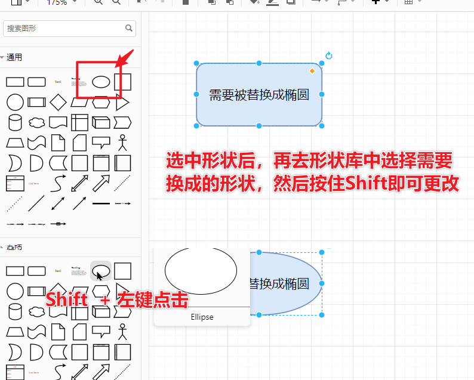

### 编组、解组、锁定、解锁

-   编组：选中形状后，Ctrl + G
-   解组：选中已经编组的组合形状，Ctrl + Shift + U
-   锁定：选中形状后，Ctrl + L
-   解锁：对锁定的形状再次Ctrl + L

### 快速插入图片

-   方式一：使用菜单栏的【调整图形-插入-图片】，或工具栏的插入图片

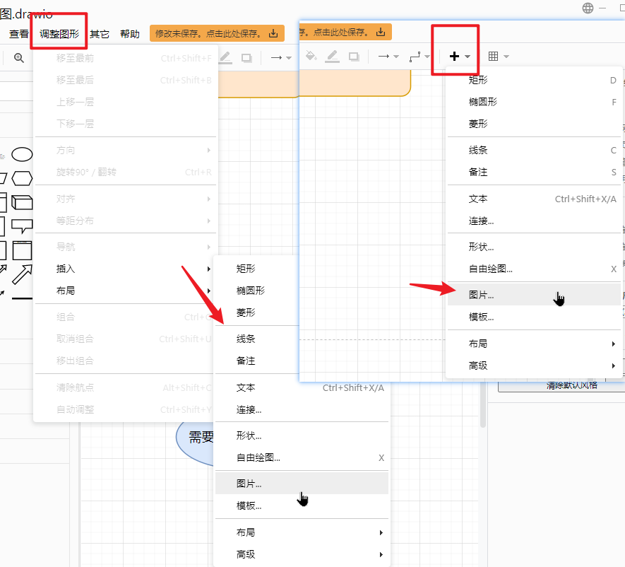

-   方式二：直接从外部拖入本地图片
-   方式三：直接对外部图片Ctrl+C复制，再到draw.io中Ctrl+V
-   方式四：直接从截图中选择复制后，再到draw.io中Ctrl+V
-   方式五：从浏览器中图片右键选择【复制图片】，再到draw.io中Ctrl+V
-   方式六：直接从浏览器中将图片拖入draw.io画布界面

### 快速插入文本

-   在形状中输入文字：选中形状后，直接键盘输入即可
-   在连接线中插入文字：选中连接线/直线后，直接键盘输入即可

### 快速复制形状样式

-   方式一：选中需要被复制样式的源形状，Shift + Ctrl + C，再选中新形状，Shift + Ctrl + V
-   方式二：或者使用**样式面板**中提供的【复制样式】和【粘贴样式】

### 导出或给其他办公软件使用

-   导出/另存为：直接使用菜单栏中提供的另存为和导出

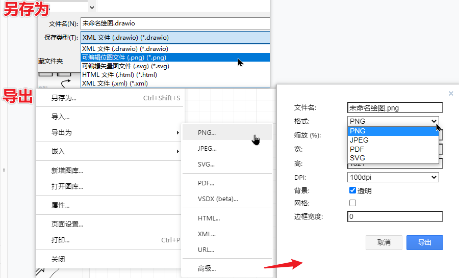  
在draw.io中找到该地址：

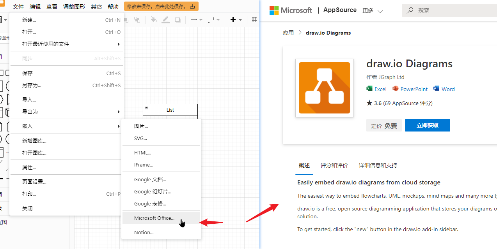

-   在微软Office三件套中使用draw.io的图  
    可以参考[draw如何在Microsoft Word，Excel或Powerpoint中使用图表](https://www.drawzh.com/2813.html)。  
    个人使用感受：以加载项的方式添加，在Office 2016版需要单独选择加载项，再去选择draw.io的加载项；在Office 2019版本中虽然可以直接在顶部导航栏点击draw.io的加载项，但还是需要再进行选择、等待载入，体验感不是很好，不如visio直接复制即粘贴的方便，而且加载项的可操作选项不同版本还不一样 o(￣┰￣\*)ゞ

---

因此，可以采用另外一个方式：  
选中需要复制的部分，然后鼠标右键-复制为图像，然后到Office中进行Ctrl + V粘贴即可，粘贴后的图依旧是可以变换大小，且清晰度比直接导出的要好。

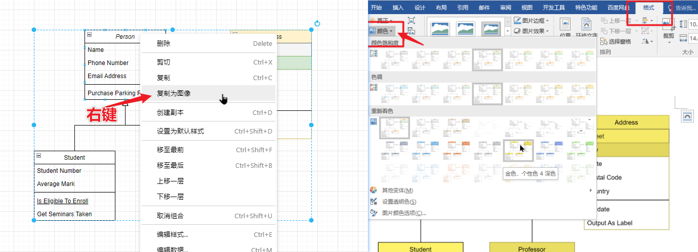

注：  
粘贴到Office中的图，同样可以使用【格式-颜色】进行再上色。  
若需要修改图片内容，还是和visio一样，需要重新打开draw.io，只是需要再次鼠标右键-复制为图像进行粘贴。

### 标签、图层

作用：可以设置标签，对内容进行选择性展示；可以分图层绘制 ，可以分图层进行展示

#### 打开

打开标签：Ctrl + K  
打开图层：Ctrl + Shift + L

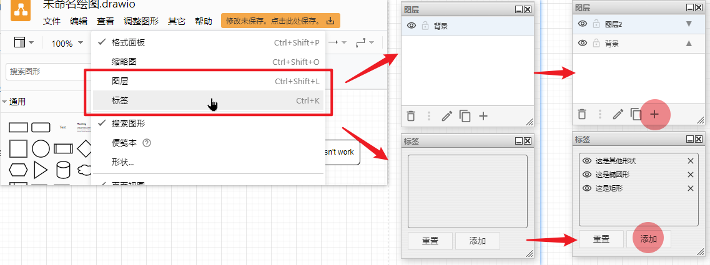

#### 操作

创建好需要的标签，然后开始给形状或容器或组添加标签。  
新建好图层，然后在图层中进行绘制（可以适当关闭相应图层避免干扰）。

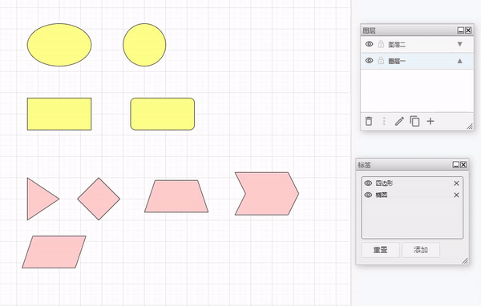

即使是对已加标签的形状们进行编组，原有的标签关系依旧保持不变。  
标签删除，并不影响原有的形状。  
图层删除，则会删除该图层上所有的内容。

### 页面间链接跳转

打开外部网页链接，或在该draw.io的不同页面之间跳转。

#### 打开

使用快捷键Alt + Shift + L

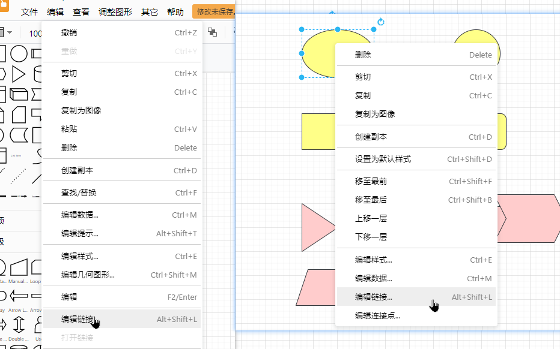

#### 操作

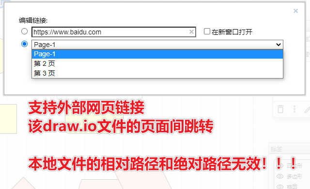

## 其他内容分享

任何一款软件最好的学习方式，一定是去看官网的一些图例或者是操作说明，draw.io也不例外，如果你想要知道它能做什么，有什么高级的用法，可以去官网查看对应的案例说明。

[https://www.drawio.com/example-diagrams](https://www.drawio.com/example-diagrams)