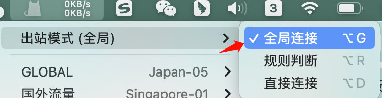
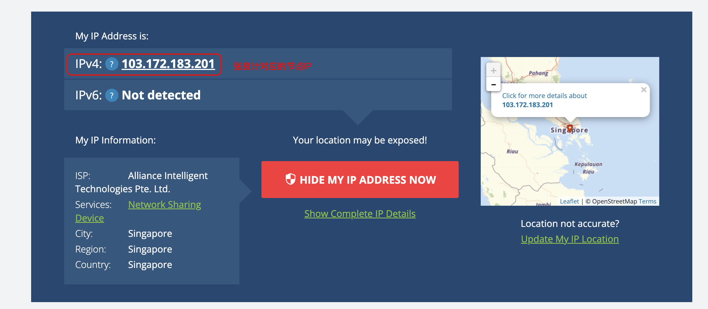
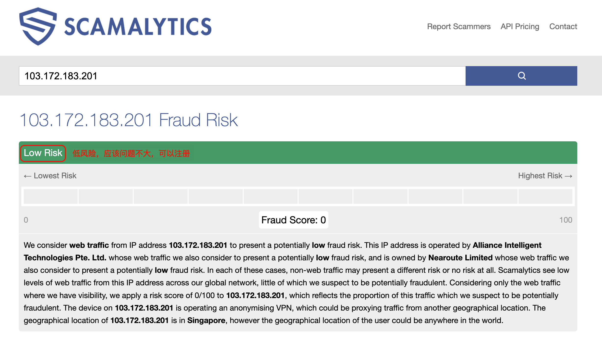
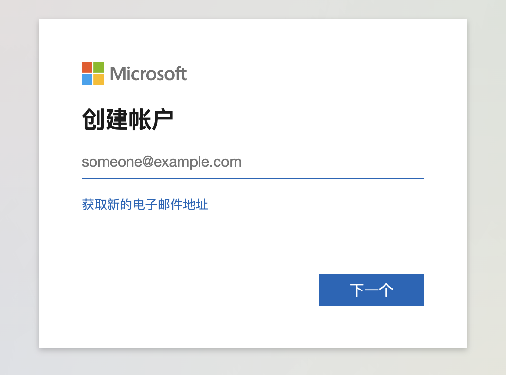
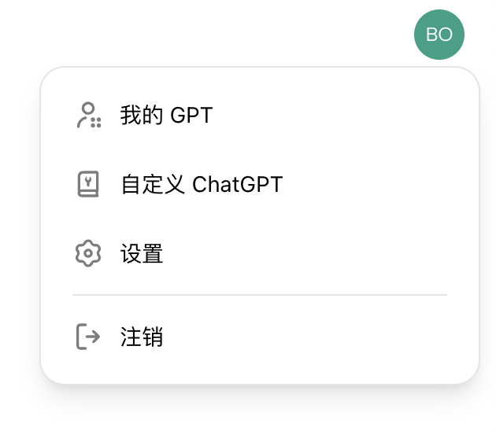
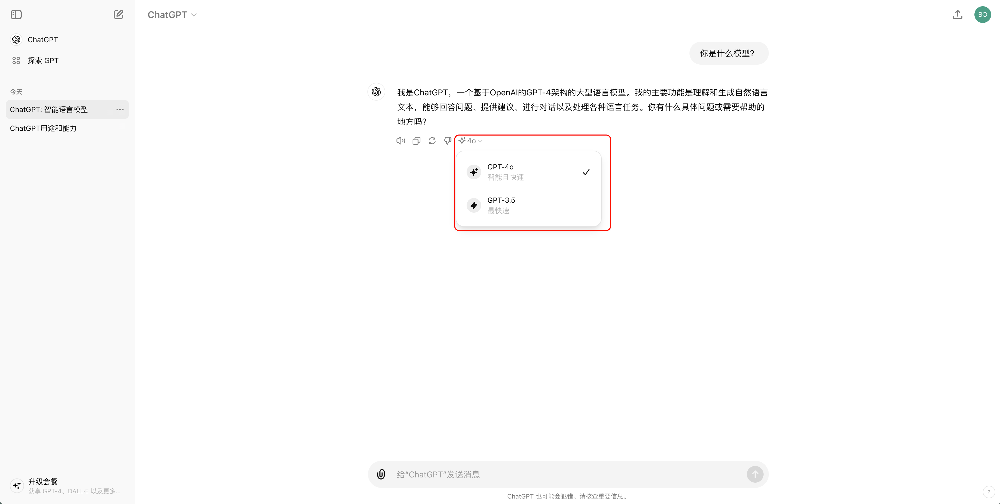

## 什么是ChatGPT

ChatGPT是由OpenAI开发的一种人工智能语言模型，基于GPT（Generative Pre-trained Transformer）架构。它利用了大量的文本数据进行训练，能够理解和生成自然语言。这使得ChatGPT可以在很多方面发挥作用，包括但不限于以下几种用途：

1.  **文本生成**：ChatGPT可以根据输入生成连贯和有意义的文本。例如，写故事、文章、诗歌等。
2.  **对话和客服**：它可以充当虚拟客服代表，回答用户的问题，提供帮助和支持。
3.  **语言翻译**：尽管它不是专门的翻译工具，但ChatGPT可以进行多种语言之间的翻译。
4.  **教育和学习**：学生和教师可以使用它来解答问题、解释概念或提供学习材料。
5.  **代码编写和调试**：开发者可以利用ChatGPT生成代码片段、调试代码或提供编程建议。
6.  **内容创作**：内容创作者可以利用ChatGPT生成博客文章、产品描述、社交媒体帖子等。
7.  **头脑风暴和创意生成**：它可以帮助用户生成创意想法，进行头脑风暴。
8.  **个人助理**：ChatGPT可以帮助用户管理日常任务，例如安排日程、设置提醒、提供建议等。

ChatGPT的能力使得它在很多领域都能提供帮助，但需要注意的是，它并不是完美的，可能会生成不准确或不适当的内容。因此，在使用时需要对生成的内容进行审查和验证。

## 为什么要学这个？

很多时候我们使用国内的AI模型，例如说KIMI就够用了，但是有些时候可能KIMI在某些领域，某些话题上回答的并不太好，所以我们还是需要使用ChatGPT来作为补充工具使用。

ChatGPT 4o的能力很强，而且现在是免费对外开放，再加上ChatGPT的注册门槛低了很多，所以建议大家花个几分钟的时间，都注册一个账号用一下。

## 注册流程

现在可以无需手机号码注册 ChatGPT 账号了，也就意味着没有境外手机号码也可以注册ChatGPT 账号了，我们只需要使用邮箱即可注册成功。我在2024/06/03晚上实测了一下，只要节点没问题，然后按流程注册大概3-5分钟就可以搞定。

| 步骤 | 说明 | 截图 |
| --- | --- | --- |
| 1 | 需要启用张良计，同时设置为“全局模式”，因为ChatGPT对IP会有要求，如果你的IP是在国内或者其他不能使用的国家，则无法注册 |  |
| 2 | 点击 [这里](https://whatismyipaddress.com/) 查询你的 IP 是否是国外 IP，最好是使用美国，日本，新加坡等地区的IP，不要使用台湾，香港等地的IP |  |
| 3 | 点击 [这里](https://scamalytics.com/) 查询你的 IP 纯净度，复制第2步的IPV4的IP地址，查询一下是否干净 如果的低风险，那就应该问题不大；如果是中高风险，则可以切换不同的节点，再试试 |  |
| 4 | 点击 [这里](https://signup.live.com/) 注册一个Outlook邮箱，Outlook的邮箱是微软的，国内也可以直接使用，这个邮箱注册比较简单 |  |
| 5 | 注册好了Outlook邮箱之后，前往ChatGPT的官网去注册即可，ChatGPT的 [注册页面](https://chat.openai.com/auth/login)，然后按要求填写邮箱，密码，然后邮箱查收验证码即可 | ​ |
| 6 | 注册成功之后，可以访问 [ChatGPT](https://chatgpt.com/?oai-dm=1) 的地址，进行登录，即可使用ChatGPT的3.5模型和4o的模型了 |  |

