## 什么是Mermaid

Mermaid 是一个基于 JavaScript 的图表绘制工具，它使用 Markdown 启发的文本定义和渲染器来创建和修改复杂的图表。 Mermaid 的主要目的是帮助文档跟上开发的步伐，图表和文档会耗费开发人员宝贵的时间，并且很快就会过时。但没有图表或文档会破坏生产力并损害组织学习。Mermaid 通过使用户能够创建易于修改的图表来解决这个问题，它也可以成为生产脚本（和其他代码段）的一部分。Mermaid 甚至允许非程序员通过 Mermaid 实时编辑器轻松创建详细信息和图表。

[https://mermaid.js.org/](https://mermaid.js.org/)

简单来说，Mermaid是一个类似于Markdown的通过文本描述就可以绘制出对应的图表的工具，这样我们就可以通过一些文本描述或者代码等来快速更新、修改表格。

Mermaid可以绘制很多种图表，但是**对于产品经理来说，最好用的，最实用的，我个人觉得是“时序图”**。因为用画图工具来绘制时序图，经常会因为间距，对齐，格式等问题耗费比较多的时间精力，而使用Mermaid来绘制就不用担忧样式和格式的问题，程序会帮你自动搞定。

其他的图表我建议直接用draw.io自行绘制就可以了，速度应该是比用Mermaid快的。

## 什么是时序图？

时序图(Sequence Diagram)，又名序列图、循序图，是一种UML交互图。它通过描述对象之间发送消息的时间顺序显示多个对象之间的动态协作。

时序图的使用场景非常广泛，几乎各行各业都可以使用。在产品经理梳理多系统、多角色、多模块之间的交互逻辑和顺序的时候，就可以使用这个时序图来表达。可以做到简洁有力，清晰明了，对着时序图来讲解业务和逻辑就会非常的顺畅。

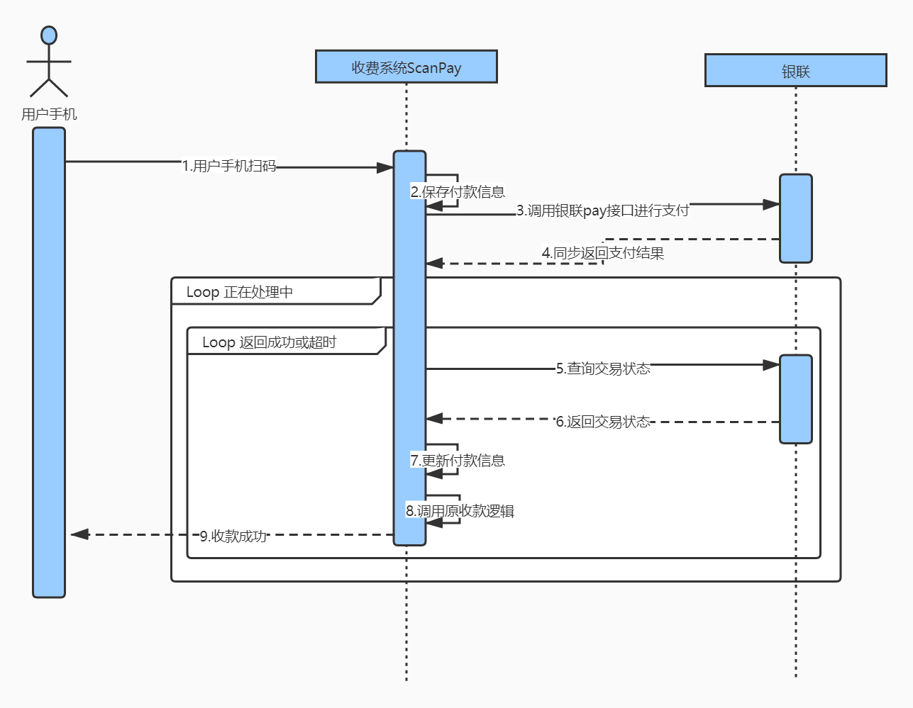

## Mermaid绘制时序图

可以使用官方自带的实时编辑器进行绘制，好处就是可以直接校验你的语法是否正确，然后绘制出来的图可以直接查看效果。

[https://mermaid.live/edit](https://mermaid.live/edit)

如果无法访问，记得要启用张良计；如果不知道语法，那么就先看看对应的文档手册。[https://mermaid.js.org/](https://mermaid.js.org/)

---

也可以使用语雀的“文本绘图”组件进行绘制，输入“/”，然后选择“文本绘图”。语雀的绘制，如果你的语法出错了就不会显示结果，也不知道哪里出错了，所以比较适合老手直接用。

| 列 1 | 列 2 |
| --- | --- |
| 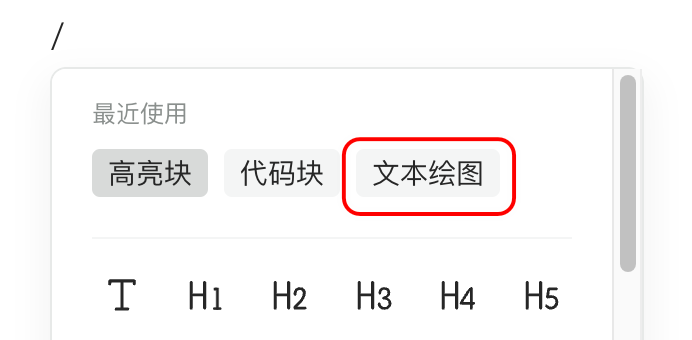 | 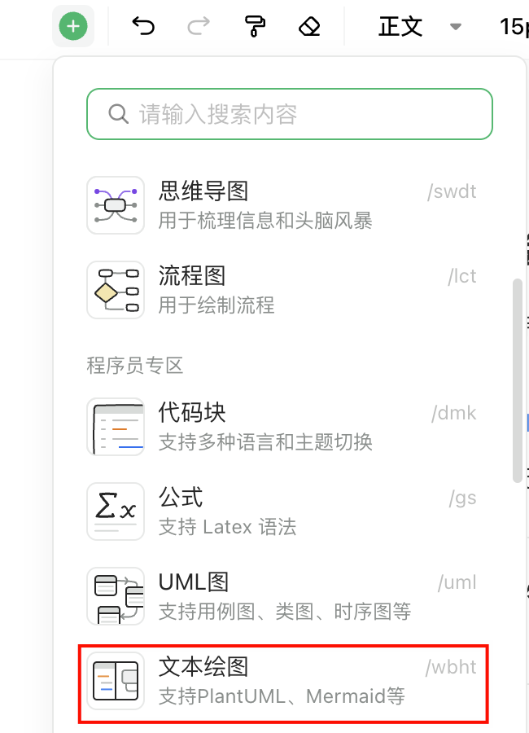 |

## 常见的案例

### 表达多个系统之间的单据/数据交互

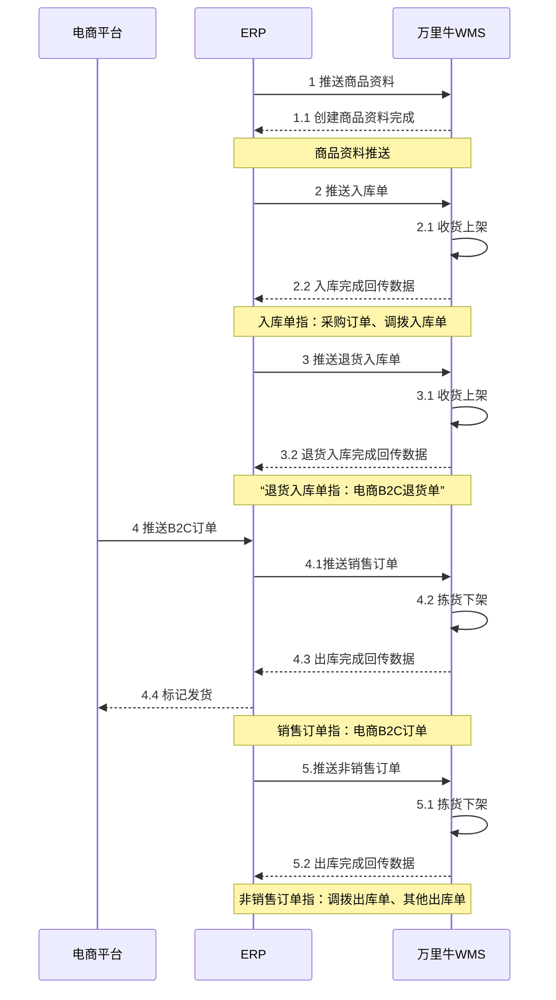

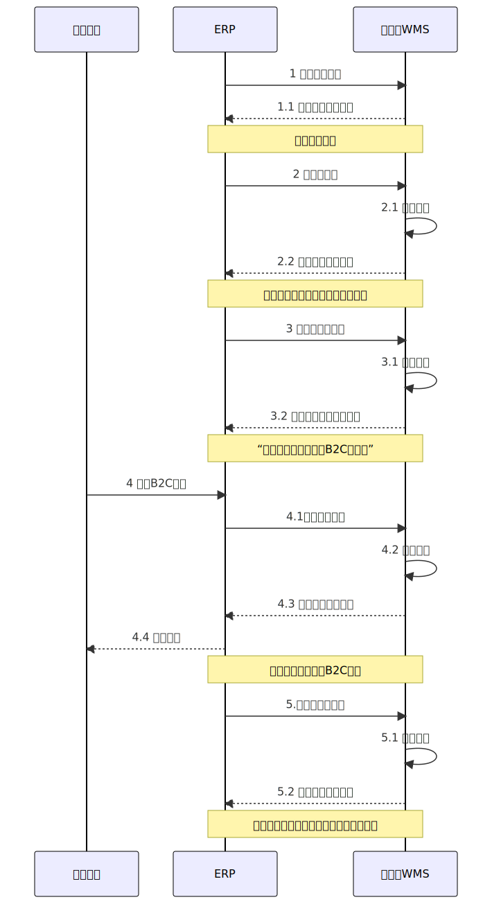

### 使用alt和opt进行判断

alt类似于if...else...，表示如果满足什么条件就怎么样，否则就怎么样

opt类似于switch，表示一种可选的条件，可用可不用

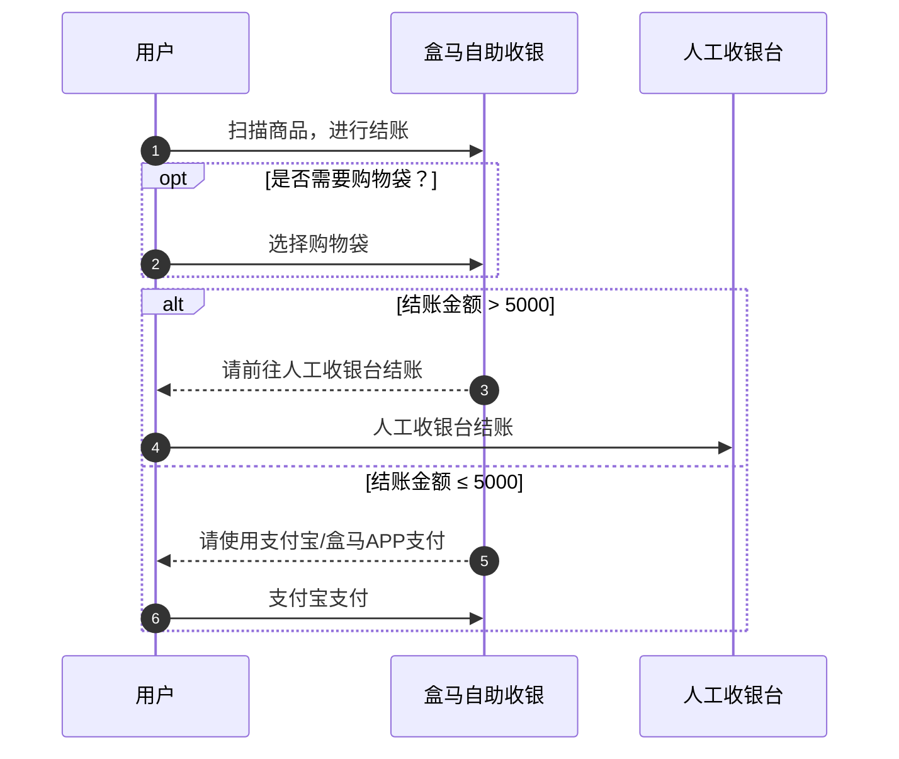

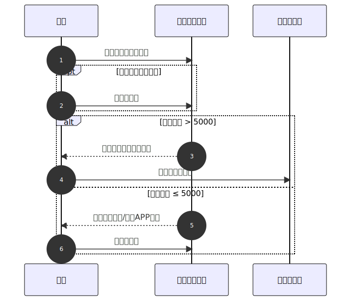

### 使用Kimi/ChatGPT重新绘制高清版的时序图

当在网络上找到了一张不太清晰的时序图，然后自己也需要绘制一张类似的图时，可以上传图片给Kimi或者ChatGPT，让它用Mermaid语法帮你重新绘制一张一样的图。AI不一定能百分百还原，但是可以还原大概的内容，剩下的自己手动修改即可。

> 我将提供一个时序图给你，请你识别这张时序图，并严格按照图片中的顺序，文字等，用Mermaid的格式重新绘制一个时序图。要求如下：  
> 1\. 不要使用AS别名，而是直接用图片中的文字作为参与者；  
> 2\. 严格按照图片中的箭头方向和箭头样式（实线？虚线）进行绘制；

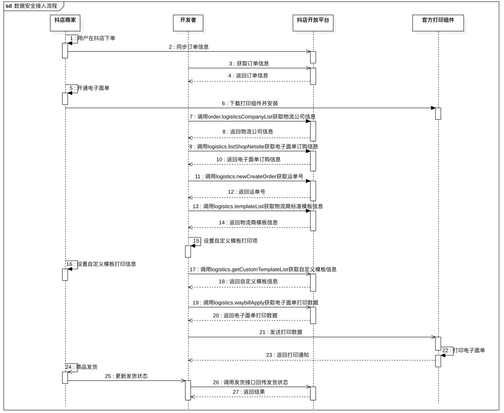​

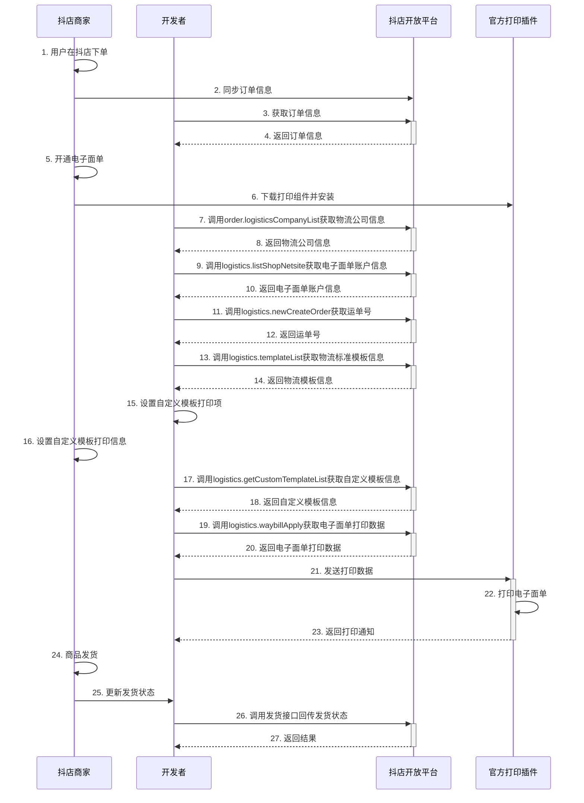

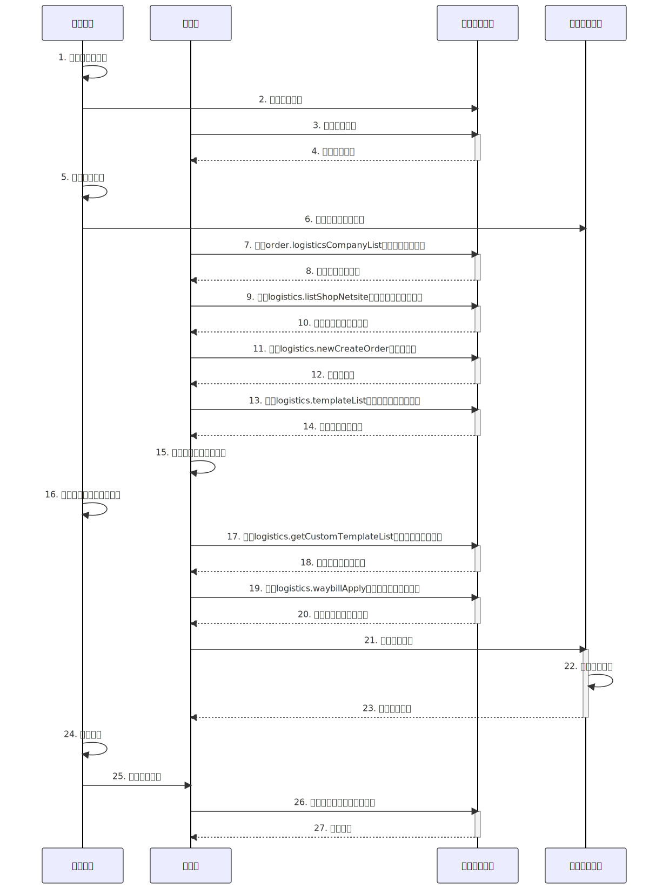

### 在draw.io中导入Mermaid的内容

draw.io也是支持Mermaid，所以当你写好了Mermaid的绘图代码片段之后，就可以复制，然后打开draw.io，导入到里面，再进行二次修改。

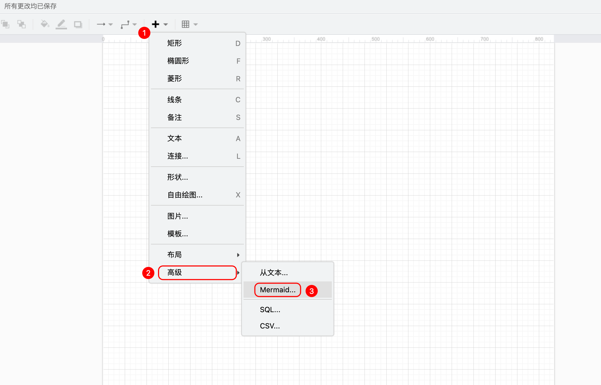

| 列 1 | 列 2 |
| --- | --- |
| 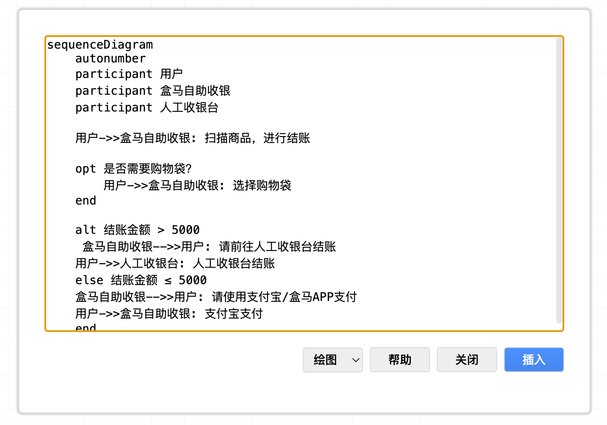 | 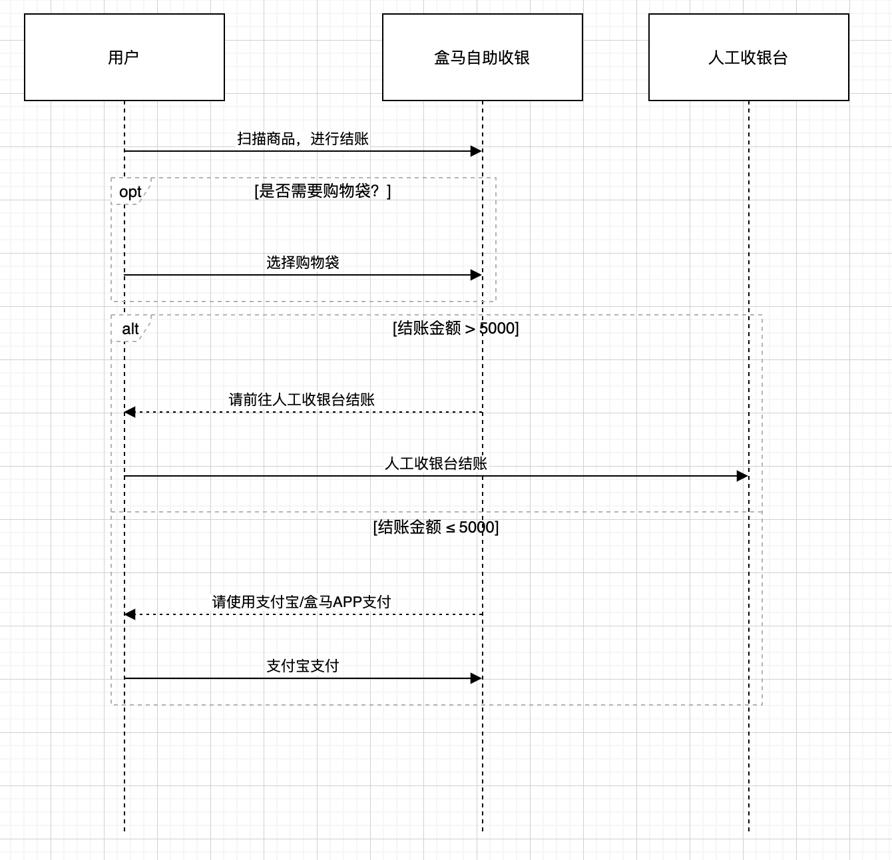 |