**我与海外仓**  
我是从2017年10月份左右开始接触海外仓的，当时入职了一家专门做3C类、高价值类产品的海外仓公司，为一些出海品牌提供全流程的履约服务，当时最主要、也是最知名的客户就是“一加手机”，智能手表“出门问问”等。  
早期刚接触海外仓的时候，对海外仓没有什么特别的概念，认为海外仓就是“设立在海外的一个仓库，由海外的人员负责管理”。后面开始接触了具体的业务之后发现，其实还是有很多细节并不是想象中的那么简单，可以一笔带过的。  
接下来我从几个方面来与大家分享一下，我对海外仓的一些认识和理解，也为大家揭开海外仓的神秘面纱，让大家对海外仓有一个更加深入和全面的理解。  
**什么是海外仓？能提供什么服务？**  
海外仓是指跨境电商企业在海外设立的仓储物流基地，目的是为了更快速地向消费者提供商品和服务。通过海外仓，企业可以将商品提前放在目标市场附近，减少物流时间和成本，提高客户满意度。  
海外仓的主要作用有以下几点：  
●缩短交货时间：通过提前将商品存储在海外仓，企业可以大幅缩短商品从发货到消费者手中的时间。  
●降低物流成本：海外仓降低了长途运输的次数，从而减少了物流成本，货物先大批量集中运送到海外仓，然后再由海外仓拆零后发到海外的消费者手里。  
●提高客户满意度：海外仓使商品更快地送达消费者，从而提高客户满意度。  
●便于退货处理：海外仓可以方便地处理退货，减轻企业的退货压力。  
●减轻库存压力：海外仓可以根据市场需求动态调整库存，降低库存压力。  
海外仓能够支持以下几种服务：  
●一件代发，一般指2C类的销售订单，从仓库直接发到消费者手上。  
●备货中转，一般指2B类的订单，例如中转到亚马逊的FBA仓库或者调拨到其他的仓库中。  
●退货换标，一般指亚马逊FBA的退货，需要更换产品标签，然后重新发到FBA仓库或者上架到仓库后重新销售出库。  
●拆柜转运，一般指对整个海运柜进行拆柜，分装后，按货物的目的地要求使用卡车或者尾程快递送达。  
●退货处理/售后服务：一般指接受客户退货，物流派送失败的而退回的商品，进行质量检查和后续处理。  
  

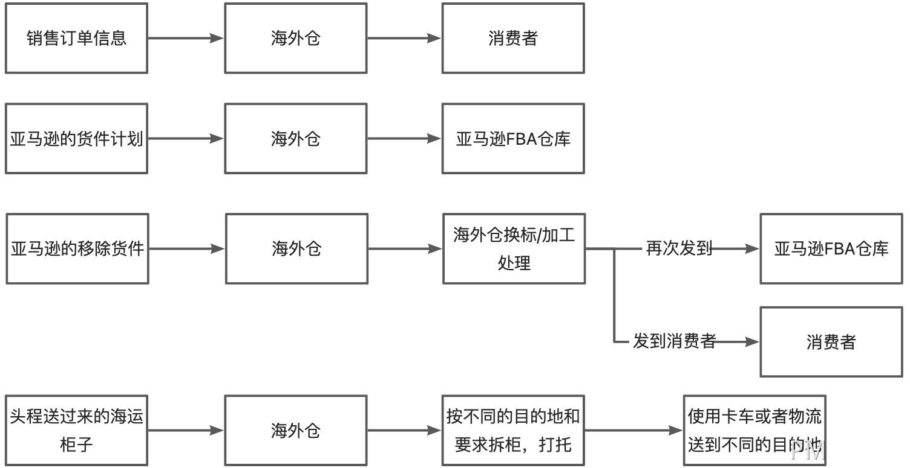

海外仓主流的业务介绍

  
**1****什么是一件代发？**  
之前我写过了一篇文章《[什么是一件代发？你真的懂了吗？](http://mp.weixin.qq.com/s?__biz=MjM5MjIzNjk0Ng==&mid=2651659926&idx=1&sn=081b38621a2996b41283b96424969f96&chksm=bd50ea6b8a27637d255374241cf2de7a4bce6e40019d5ebefec312b84abe2c26a2c51966d051#rd)》讨论过关于一件代发事情，不了解的朋友可以查缺补漏一下，不愿意查缺补漏的也没关系，我简单提炼一下最终的结论。  
关于一件代发，不同的人的初印象都不一样，一般来说会有三种理解：  
1非行业从业者，听到一件代发，第一印象就是指供应商给代理商（分销商）做代发，哪怕是一件的量也做。就是上文提到的1688的那种玩法或者是DropShipping的玩法。  
2行业从业者，但是由于业务的特殊性，所以认为一件代发就专指那种有预包装好的一单一品的货品，拣货后贴物流Label就能直接发走的那种订单。  
3行业从业者，跟随大众的定义和理解，哪怕是错误的。认为一件代发其实就是指海外仓的正常的订单履行操作，哪怕一个货主只有一个订单也给他发出。  
如果是在海外仓行业，“一件代发”这个词已经被行业人士歪曲了本意，它指的就是指海外仓正常的订单履约流程，也可以理解为标准出入库业务。  
因为仓库本来就是要按单作业的，和单据数量没关系，多件能发，一件也能发，所以不用过多的纠结这个词准不准确了，毕竟在这一行不准确的名词多了去了。  
**2****什么是转运？**  
在主流的跨境电商平台中，亚马逊无疑是最火爆，从业人数最多的一个平台。这也催生出了，很多与亚马逊相关的特色业务。而转运，就是其中之一。  
如果单看「转运」二字，很容易就让人感觉懵逼，啥是转运？转运是谁转运给谁？  
业内人士为了安抚咱们这些「门外汉」，于是就会在转运二字旁边加上FBA几个字，标识它是和亚马逊的仓库有关系的业务。  
于是乎有人叫做「FBA转运」，有人叫做「转运FBA」，也有人叫做「FBA中转」或者「中转FBA」，结果一堆名词看了下来之后，发现更晕乎了……  
从Google上的查询结果来看，总体而已应该是叫做「转运FBA」的比较多，也比较符合词语表面的意思：**转运FBA，即转运至FBA**。  
  

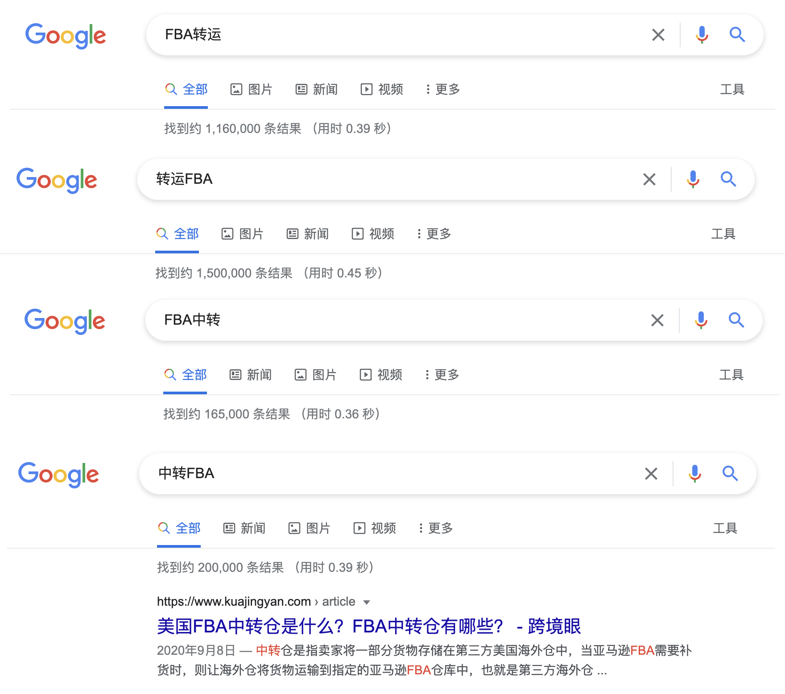

  
对比几个词的搜索结果  
但是从我个人工作经历来看，其实行业内大家叫「FBA转运」的比较多，简直离谱到家。但是我已经坦然了，毕竟这个行业真的贼多一些奇奇怪怪的名词，见得多了就不再纠结了……  
转运就是指以海外仓为中转点，货物从国内到了海外仓之后，经过短暂的停留就会被转运到它的目的地。如果目的地是亚马逊的FBA仓库，那么就是「FBA转运」；如果目的地是其他知名的第三方海外仓或者国外本土的仓库，那就是「第三方仓转运」……  
  

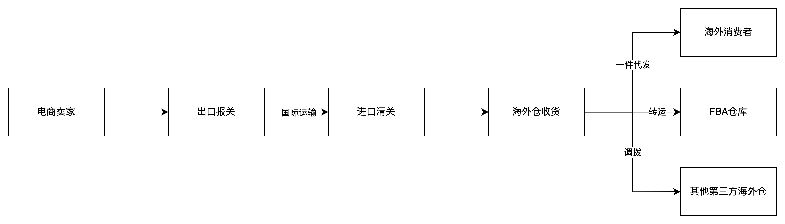

  
**3****什么是退货/换标？**  
退货是一件代发和中转的逆向过程，货物从海外仓发出去了之后，由于某些原因又退货回到了海外仓中。  
根据退货的来源不同，一般会分成FBA退货，客户退货，第三方仓库退货。分别是指从亚马逊FBA仓发货到海外仓，从客户手里发货到海外仓，从第三方仓发货到海外仓……  
  

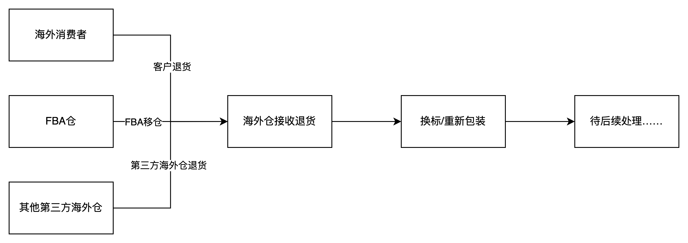

  
而换标就如字面意思一样，对产品重新更换标签，这里的新标签一般会跟旧标签不一样。  
换标的原因大多数都和亚马逊平台有关系，可能是卖家的店铺被封了或者产品被下架了，那么已经在FBA仓库的一些产品就不能再卖了，亚马逊会将这批货退到你指定的仓库中。  
这些产品并非是质量有问题，很多可能都是全新还没有从原箱中拆过，只不过就是因为产品Listing被下架了，所以FBA仓库就不能再发这些产品了。所以货物退到了海外仓之后，海外仓会根据卖家的要求，对这些产品进行换标的操作，新的标签SKU变了，可能产品名称或者一些描述也变了，但是实物还是原来的那一批或者也仅仅是换了一个外包装。  
**换好了标签之后，相当于换了新的一套衣服，这些产品又可以重新发到FBA仓库中了。**  
  

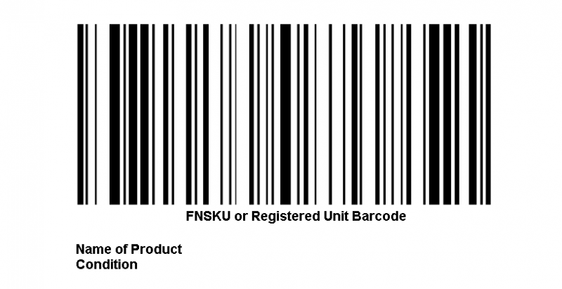

  
亚马逊的FNSKU标签示意图  
**4****什么是拆柜转运**  
海外仓入库的货物都是从国内工厂或者集货仓装柜送过去的，其中海运装柜的量是最大的，一个海运柜可以承载很多货物。  
如果一个海运柜中装的都是一个客户的货物或者一个订单的货物，那么这种叫作整柜业务，英文是FCL（Full Container-Load）。  
如果一个海运柜中装的可能是多个客户的货物或者多个订单的货物，那么这种叫作拼柜业务或者散货业务，英文是LCL（Less than Container-Load）。  
  

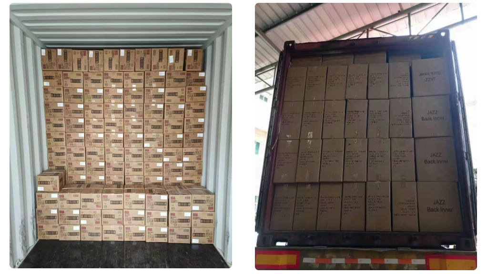

装柜后的图片

  
针对拼柜业务，由于一个柜子中有多个客户的货物，但是不同客户的货物可能要去的目的地不太一样，于是就会将这种柜子从港口提柜到海外仓，然后在海外仓进行拆柜分发，根据不同的客户、不同的目的地，对货物进行分类整理，然后再使用卡车、快递等尾程物流将这些货物运送到对应的目的地，这种业务就称之为“拆柜转运”。  
拆柜后的货物，可能是需要运到FBA仓库的，也可能是送到其他私人地址或者其他第三方海外仓等。这里送到FBA的方式和FBA转运的业务是一样的，不过区别就是看仓库会不会记录这一块的库存。一般来说拆柜都是快进快出的，不会产生库存，也不需要记录，而备货中转（FBA转运）一般来说是会将货物存储在海外仓，然后等到有需要的时候再运送过去，所以是会有库存的。  
**5****一件代发与转运的区别是什么**  
一件代发更加强调仓储的作用，货物到仓之后一般会在仓库中储存比较久的时间，后续再根据上游的订单指令再拆零发出。所以电商卖家会比较重视库存数据，而且这个库存数据也是精确到SKU的，因为SKU的意思就是Stock Keeping Unit(库存量单位)。这也是我们常见的仓库的标准服务，只不过在海外仓领域被误打误撞称为了「一件代发」。  
转运则更加强调中转的作用，货物到仓了之后不会过多的停留，只是简单的拆柜，整理，然后立马就发出到FBA仓库中。此过程中可能压根不会涉及收货，上架，库存变化等业务，了解仓储行业的朋友可能听过一个名词叫做「越库」，其实这种转运就是越库的一种形式。  
转运如果都是以越库的形式发出，那么对一些不太大的仓库来说，其实压根就不需要用系统，直接用Excel就能解决。目前有很多海外仓服务商，特别是主做转运业务的，确实还是在用Excel来管理仓库。  
可是实际的海外仓业务中并不是这么泾渭分明，条理清晰的。有些货物到了仓库之后，部分需要转运到FBA仓库，部分需要去第三方海外仓，还有部分需要上架到仓库中囤着备用。  
这个时候，如果再去定义一件代发和转运，就会发现开始边界不清晰了。因为有些入库单是纯转运的，不需要收货上架，而有些入库单是一件代发的，需要收货上架，还有一些两者都有，仓库就容易懵逼了……  
**海外仓的分布**  
商务部在2021年12月30日发布的数据显示，我国海外仓的数量超过2000个，总面积超过1600万平方米。  
据《2022海外仓蓝皮书》的调研显示，截至2021年12月，海外仓数量排名前十的国家为美国、英国、德国、日本、澳大利亚、加拿大、俄罗斯、西班牙、法国、意大利。  
  

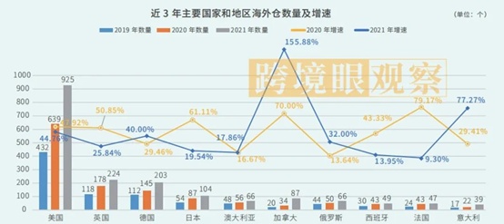

  
从上图可以知道，美国的海外仓数量是最多的，所以这一块的海外仓需求也是最旺盛的。如果想要做海外仓相关的系统，那么优先要考虑的就是美国市场，例如海外仓领域比较有名的“魔方云仓”和“Shipout”就是主打一个美国的海外仓市场，产研团队或者相关负责人就身处美国，对美国本土的一些仓储玩法有很深的理解，所以研发出来的系统也非常的“Native”，用户数量增长的很快。  
而我们当时在做海外仓WMS的时候，由于自己身处国内，对美国、欧洲海外仓的一些操作习惯洞察的不够，所以做出来的东西不够“Native”，更多的是一种融合派，还是适用于自己已有的几个小仓库，如果拿出去给其他仓库试用的话，很多仓库的用户会表示学习难度比较大，一时间不太好上手。  
但是反过来看，虽然他们在仓储实操部分更具有一些洞察，能做出更让仓库执行层叫好的产品设计方案，但是由于海外仓不只有WMS一个系统，还有客户端，运营端等多个系统，而这些系统方案我们身处国内的产品经理们就反而有优势了，因为用户在国内，我们可以很方便调研这一块的需求，从而做出更接地气的客户端和运营端的系统。  
**海外仓的分类**  
海外仓的从大的业务类型上来划分，一般海外仓会分成三类：  
1卖家自建海外仓，由跨境电商卖家自己搭建的仓库，例如乐歌海外仓；  
2电商平台官方仓，由电商平台运营的仓库，例如亚马逊的FBA仓；  
3第三方海外仓，由第三方服务商搭建的仓库，例如谷仓海外仓，万邑通海外仓，4PX海外仓等；  
这三类海外仓分别覆盖不同的业务场景，供不同的电商卖家选择使用，互相补充，也有很多业务联动。  
例如电商卖家自建的海外仓往往只是会集中在某些国家或者地区，不会覆盖所有的地区，所以在没有覆盖自建海外仓的地方还是会选择平台官方仓和第三方海外仓。  
例如平台官方仓（以FBA举例）虽然对卖家来说有诸多优势，但是也因为平台的一些限制和约束，费用也比较高，卖家们出于降本增效，完善自己的订单履约闭环，规避风险等理由，卖家不敢轻易将所有的货物都备货到FBA仓库，还是会选择部分放在第三方海外仓，部分放在平台仓中。  
  

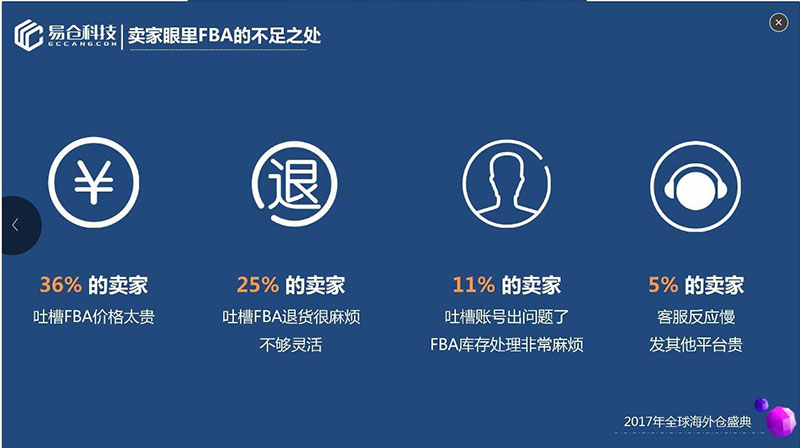

摘自《跨境眼：中国第三方海外仓市场分析调研报告》

  
**所以很多第三方海外仓或者海外仓系统的卖点一般都会提到FBA中转备货，FBA退货/换标/重发等业务，这是海外仓作为FBA仓的「补充」，最常见的一些方式。**  
之前我初入海外仓领域的那家公司，就是以第三方海外仓的角色给跨境电商卖家提供服务。第三方海外仓搭建成本比较高，例如仓库的租金，仓库设备的采购，人员的招聘，一些合规性的手续等都比较花钱，而第三方海外仓盈利点则主要还是在**尾程物流**方面，至于一些仓租，操作费，服务费等都是蝇头小利。  
**对第三方海外仓来说，拿到具有价格优势的尾程物流账号才是关键。**  
如果是自建的海外仓，而且也只是用来满足自身的订单业务的话，那么除了尾程物流的价格之外，也得要考虑整个供应链体系的流程优化。因为海外仓的运营成本还是很高，如果只是满足自身订单业务，那么意味着所有的成本负担都要自己扛，风险比较大。  
  

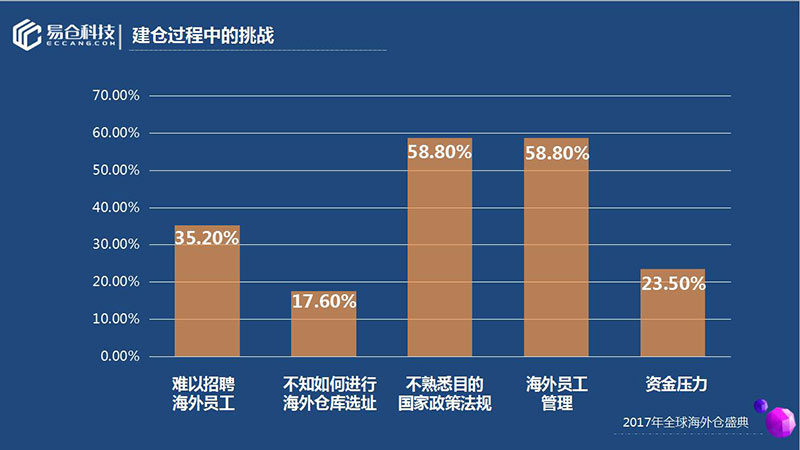

摘自《跨境眼：中国第三方海外仓市场分析调研报告》

  
无论是第三方海外仓还是自建海外仓，海外仓这种重资产的业务模式，想盈利或者降低成本都不是一件简单的事情。要么降本，要么增效，要么开源，要么节流，要么就是一套组合拳……  
所以精打细算，算清楚账还挺重要的，这个时候就需要借助一套信息化系统来做一些精细化的管控，也就是海外仓03-WMS系统及相关配套的一些系统，这一整套系统业内一般称之为“OTWB”或者“OTWBP”，后续本书就会详细介绍这一块的内容。  
**海外仓的建设和运营**  
如果要做海外仓业务，首先就需要一个海外仓，那么海外仓从哪里来呢？  
很多人的第一想法，就是自己带人去海外，去选址，去采购设备，去招聘员工，再去解决一系列合规运营的问题，最后把一个仓库搞定。  
但是这个方法显然有太多可预见的困难，以及成本非常的高昂，所以并不太可行。即使是什么土豪老板，也不会这样去造作自己口袋的钱。  
所以，大多数的海外仓都是国内公司委托某些海外的公司帮忙租赁仓库，并帮助招聘员工，以及解决一些合规运营等问题。也有一些是更加深度的合作，双方一起出资，一方提供系统和客户资源，另一方面提供仓库，员工和一些本土化的经营管理等。  
总而言之，海外仓的建设其实是一个比较复杂且庞大的工程，很多个环节都需要依赖专业性人才或者是本土化的资源。所以评判一个海外仓的综合实力怎么样的时候，其实也可以从这角度去侧面打探一下，问问对方的仓库面积有多大，租赁了多久，是合作制的还是仓中仓模式，然后运营管理人员是属于哪方的，以此来判定对方对海外仓这一块的投入度有多少。  
海外仓建设完成了之后，寻找一个合适的管理团队非常的重要。从我过去接触的项目案例来说，海外仓的管理人员水平高低，对整个仓库的效能影响非常之大。  
很多时候，客户吐槽海外仓发错货，响应慢，旺季容易爆仓拥堵，无法提供太多增值服务等，都和海外仓的管理运营团队有很大的直接关系。  
个人认为，仓库经理或者仓库主管还是选用有仓储方面经验的华人比较好，和国内团队沟通会比较顺畅，同时也能很好地响应一些比较紧急或者是重要的事情。而且对于产品经理来说，在调研和收集仓库需求的时候，与华人主管的沟通会更加顺畅，不太会因为语言、文化、风格习俗等因素的影响，而导致传递错误的需求或者反复低效率的沟通。  
当然，很多时候公司也没太多选择，毕竟仓库建在当地，招聘合适的仓库主管肯定是从当地人里去选择会更容易一些。如果是海外当地的人作为仓库主管，那么懂英语或者懂当地语言的产品经理的优势就会更加明显，如果产品经理这方面的能力并不够的话，则需要在国内团队配置比较专业的运营经理或者运营主管，来做双方沟通的桥梁。  
也就是说：**会外语的产品经理在做海外仓这一块的业务还是会有一定的优势的**。例如Shopee和Lazada的电商产品或仓储产品的招聘描述中，就会明确地要求最好是留学过，能将英语作为工作语言。  
**海外仓的货物怎么来**  
货物从国内工厂或者国内卖家仓库运送到海外仓大概需要经历6个步骤，这6个步骤分别是“揽、仓、关，干、关，转”。即从国内的供应商工厂揽收，国内仓（货代的仓库）集货装柜，国内段报关，国际段干线运输，目的国清关，目的国转运到海外仓。  
这里面主要的业务知识就是头程和报关这一块，其中的一些细节我做得也不多，所以也不是很清楚，就不展开讲了。但是一般的海外仓都会包含这一块的服务，有实力的海外仓可能自己也会做头程和清关这一块的业务，而没有这一块能力的海外仓一般就是直接找一些供应商来帮忙解决即可。  
最常见的一个角色就是：**货代**。  
货代，从字面来看是货运代理的简称，国际货运代理。 从工作内容来看是接受客户的委托完成货物运输的某一个环节或与此有关的环节，涉及这方面的工作都可以直接或间接的找货代来完成，以节省成本。  
市面上的货代，价格优势和服务水平等都是参差不齐的，所以对于海外仓国内段的运营人员来说，很多时候都需要一些供应商考核，对比的工作，以确保能最大化的提升自己的利润，同时也保障对客户的服务。  
**海外仓有哪些供应商或服务商？**  
对海外仓来说，本质的工作就是为客户提供订单履约服务，简单点说就是：**帮客户在海外收、发货。**  
但是海外仓要帮助客户收、发货，其实整个环节还是串联了很多业务链路的，其中也需要依赖很多供应商或者服务商才能完成。  
从货物运输的角度来看，货物从国内送到海外仓，然后海外仓进行存储和管理，最后再将货物发到本土的目的地。行业内将这三段业务分别称之为“头程”，“海外仓”和“尾程”。  
  

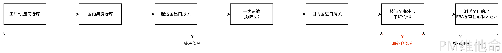

头程、海外仓、尾程的介绍

  
头程段的供应商或者服务商，常见的有：货代，报关行，拖车行，国内仓库服务商等。  
海外仓段的供应商或者服务商，常见的有：货代，报关行，拖车行，海外的仓库合作商等。  
尾程段的供应商或者服务商，常见的有：卡车公司，物流/快递公司等。  
**海外仓系统**  
大多数时候，我们在聊海外仓系统的时候都是指WMS（仓储管理系统），但是实际上一套海外仓系统要想跑通业务，那么大概率是需要研发“OTWBP”这五个系统的。  
什么是“OTWBP”？我之前的文章中有讲到过，在此我直接搬运过来，便于大家都快速理解。  
  

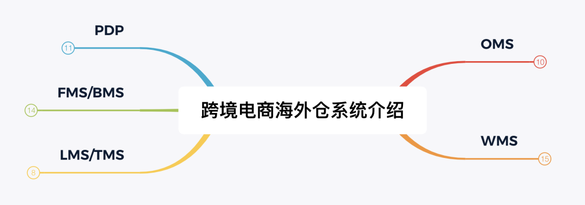

OTWBP

  
**OMS**  
OMS叫作订单管理系统（Order Management System），在不同公司，不同领域有不同的定义。主要原因就是因为大家对「订单」这个词的定义是有区别的，例如说点外卖也叫做订单，滴滴打车也叫订单，寄快递也叫订单，然后在淘宝、天猫、京东电商平台购物也叫订单……  
海外仓领域中的订单管理系统，这里的订单是指来自电商平台的订单，无论是直接从API推进来的，还是从ERP接进来，亦或者是手动创建/导入进来的，本质上这些订单都是来自于Amazon，eBay，Wish，Shopify等电商平台，所以很多订单数据结构和操作方式等都是相似的。  
  

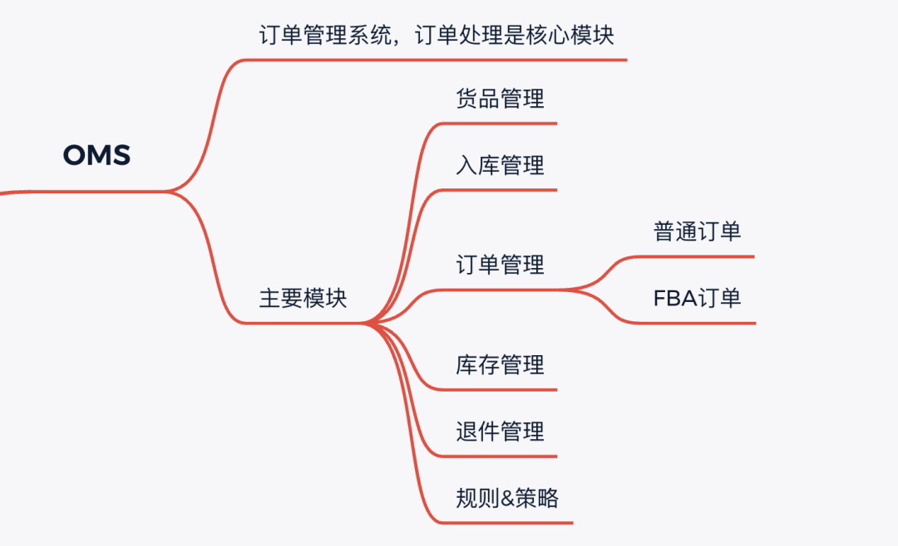

OMS介绍

  
**TMS**  
TMS叫做运输管理系统（Transportation Management System），一般在国内物流领域用的比较多。在跨境电商领域也有这个词，应该是某位大佬从国内物流的管理经验中借鉴过来的，但其实我觉得叫TMS不太准确。  
因为一说到TMS大家普遍认知里就会觉得TMS应该是有车辆五维状态管理，车辆调度，GPS，配载路径算法等，但是跨境领域的TMS其实更多的是一些物流服务商的管理，物流渠道的对接，轨迹的抓取与分析，渠道派送时效统计分析，小包专线，空海派渠道管理等之类，和国内的TMS其实完全不搭边。  
所以我之前做的项目就把TMS改名叫做了LMS（Logistics Management System），感觉这个定义会更加准确一点，也有意于区分开国内的TMS，避免理解上有歧义。  
  

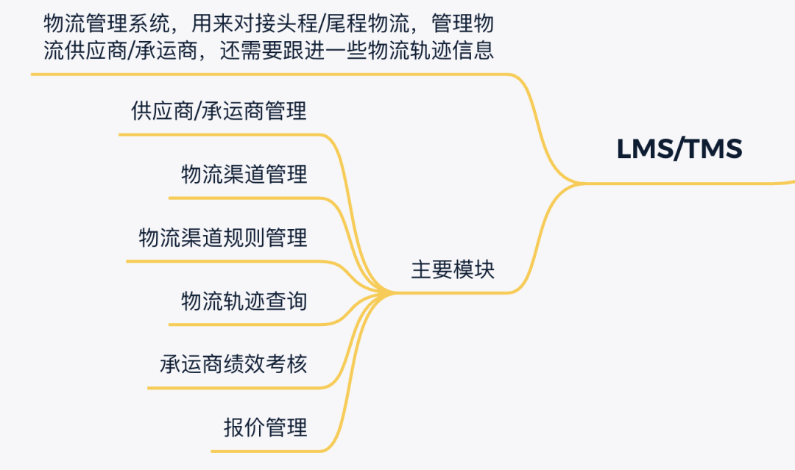

TMS介绍

  
**WMS**  
WMS叫做仓库管理系统（Warehouse Management System），WMS是比较标准的一套系统，只要大家叫做仓库管理系统，那么里面涉及到的一些功能模块和实际操作流程都大同小异，不管是国内的电商仓库，还是海外仓。  
WMS的行业经验是最容易复用的，而且通用性最强的，所以这一块反而是比较清晰简单的，一提到WMS大家的潜意识理解基本不会相差太大。  
  

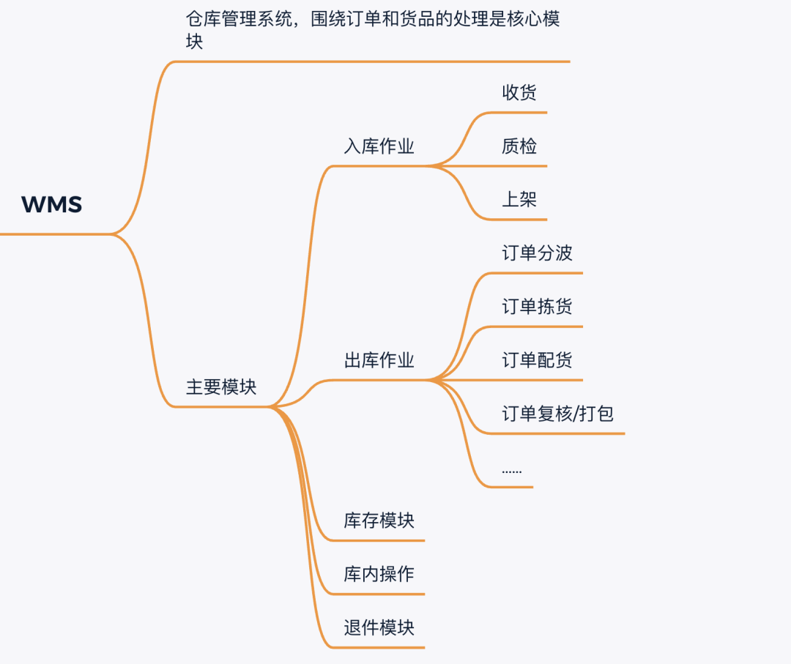

WMS介绍

  
**BMS**  
BMS叫做费用结算管理系统（Billing Management System），有些公司也会叫做FMS，意思是指财务管理系统（Financial Management System）。BMS和TMS一样很有具有行业特色，也比较容易有歧义。很多公司对BMS的定义是基于物流行业繁冗的计费模式，针对物流仓储各环节的计费复杂性与重复性，制定多种计费模型的仓储计费系统。可根据客户需求配置不同计费标准，从而清楚计算并记录仓储各环节费用，解决人工计费误差、超时、繁琐易出错等问题。  
在海外仓系统中，BMS主要也是用于费用的结算管理，这一块的费用主要分两大方向：应收和应付。应收就是对客户的计费，应付就是对供应商（物流承运商和仓库供应商）的计费。  
而主要收费的模块一般是仓租费，运费还有仓储操作费（拆板，上架，拣货，打包等）这三大块，其中还有一些琐碎的内容一般都会放在杂费中。  
  

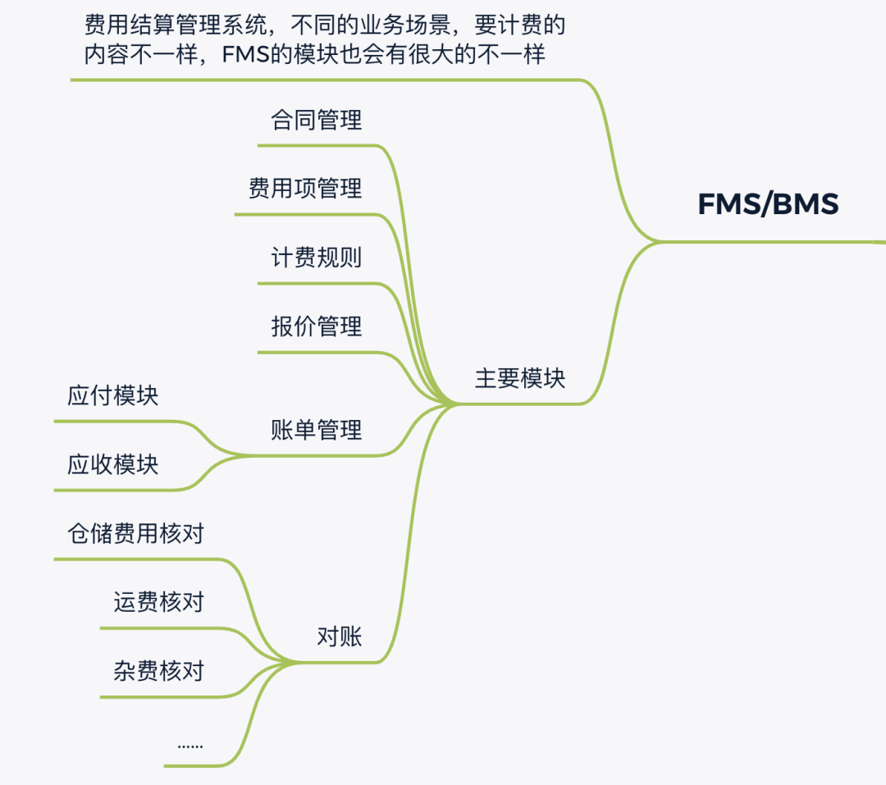

BMS介绍

  
**PDP**  
最后再介绍一个我自己定义的系统，叫作PDP（Public Data Platform）。之前调研竞品的时候有看到类似的系统，但并不是叫做这个名字，为了便于团队统一认知，所以我给它定了一个名字叫PDP。  
公共数据平台可以算是数据中台，也可以算是公共数据池。由于「OTWB」的存在，多个系统间其实有很强的业务关联性，必然就会有很多数据是冗余的，例如说货品资料，货主资料，仓库资料，渠道资料，还有一些基础信息（国家/地区，省州，城市，地址，币种，汇率等），这些信息在OMS中，在BMS中有，在WMS中也可能有，有些数据需要在多个系统保留多份副本，不便于后期的维护和管理，而且海外仓由于地域的问题，还需要考虑多国分别部署服务……  
于是就抽象出一些公共的数据对象，将其放在PDP中，提供给多个系统使用。例如货主资料只要在PDP中创建一次，然后OMS，WMS，BMS则会自动同步拉取，避免在多个系统维护相同的数据。  
  

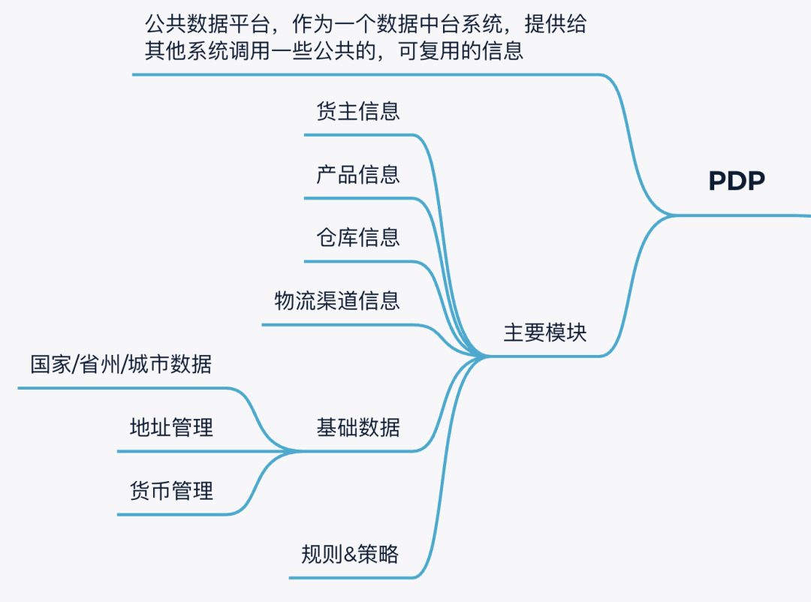

PDP介绍

  
**令人又爱又恨的海外仓系统**  
从2021年开始，海外仓的数量不断增加，其中有一部分是原来的第三方海外仓扩张，一部分是原来的大卖家开始自建海外仓为已有的电商业务做补充，也有一部分是看中了海外仓的市场而涌入的新人们，也想尝一会做「仓主」的滋味。  
  

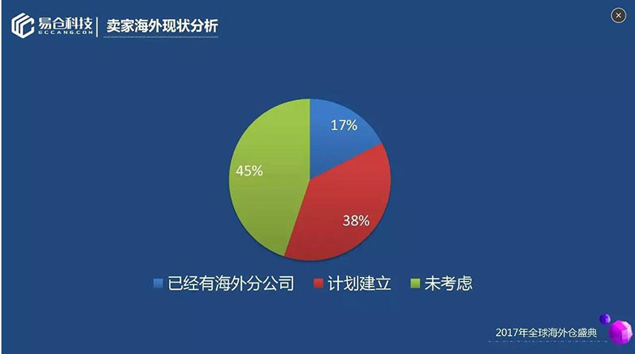

摘自《跨境眼：中国第三方海外仓市场分析调研报告》

  
抛开仓库建设的一些硬性要求，选择一套合适的海外仓管理系统（WMS）也是很多海外仓服务商重点考量的点。到了这一步，一般就只有两个选择：  
1自研海外仓系统；  
2采购第三方海外仓系统；  
自研有自研的好，外采有外采的好，其中要考量的一些因素还是挺麻烦的。  
海外仓03-WMS系统其实到目前为止发展也没有很久的历史，不同的WMS的很多作业方式，计费逻辑，数据交互等都不太一样。而且WMS其实本来就不是一个很通用系统，表面上看本质都是进销存+精细化管控，但是实际运作起来受限于很多因素，例如不同国际/地区的文化差异，不同尾程物流的奇葩要求，不同平台的数据结构，甚至还有各个国家地区工作时间的差异，休假时间的差异等……  
所以很多第三方海外仓系统看起来很好用，但是用着用着，业务壮大变化了，可能就不太能满足自身的业务了。而自研系统则灵活地根据自身业务来设计，适配自己独特的业务场景，同时也能跟公司业务成长而一同成长。  
当然，也不是说第三方海外仓系统就完全不能打。对于一些业务单量小，同时业务方向扩展也不快，同时也符合第三方海外仓系统精准画像的那些「仓主」们，刚开始起步的时候选择第三方海外仓系统是省时省钱的最佳办法，至于后续业务发展起来，可能有些变化，那就后续再说吧。  
简单对比一下，可以知道：  
1想省钱，并快速开展业务的，尽量考虑先选择第三方海外仓系统；  
2想长远发展，而且对系统要求比较高的，也不是很差钱的，建议自研海外仓系统；  
3又想省钱，又想后续对系统的把控性强一些的，建议骑驴找马，先用第三方海外仓系统，后续再看情况自研系统，做一个迁移；  
关于自研海外仓系统的成本，很多「外行」的朋友可能算的有点不严谨。一套较为完善的海外仓系统其实不仅仅只有WMS，而是我之前说过的OTWBP几个系统，甚至可能还有更多，例如安卓PDA系统，播种车，WCS等，这些都需要研发成本。  
所以大家在算自研系统的成本的时候，一定要注意把这整套系统的成本算进去。即使有些公司会将OTWBP几个系统合在一个或者两个系统中，但是相应的工作量肯定也远超乎大家起初以为只要做个WMS就完事的那种。  
下一篇文章，我来给大家介绍一下关于海外仓OTWB项目大概的研发经费应该有多少，如果你是一个打算自研海外仓系统的公司老板或者负责人，也可以通过这篇文章大致地去算一下自己的系统研发成本支出。