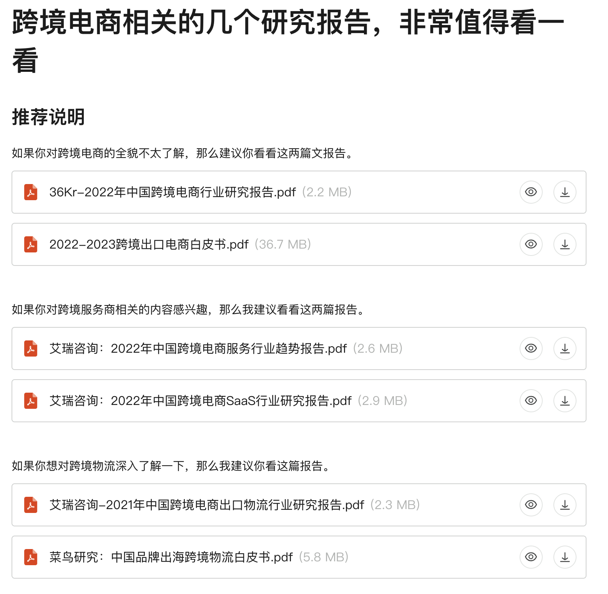
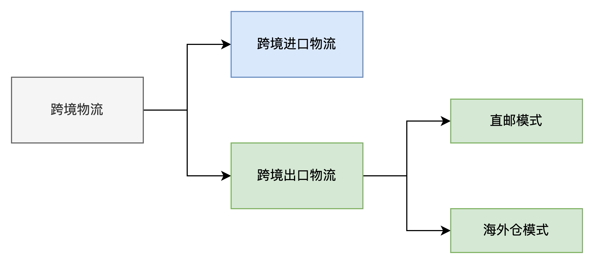
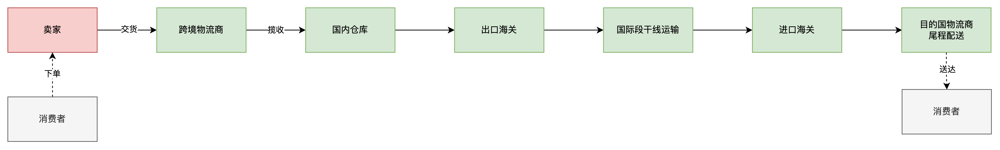
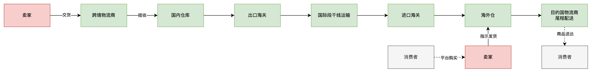
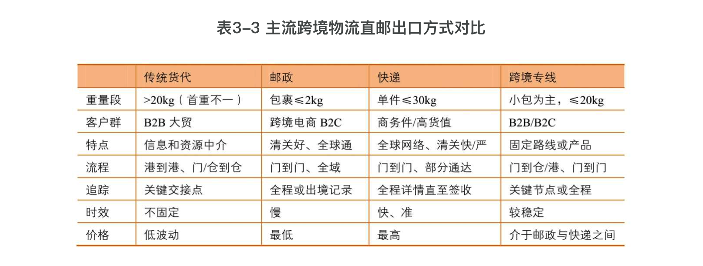
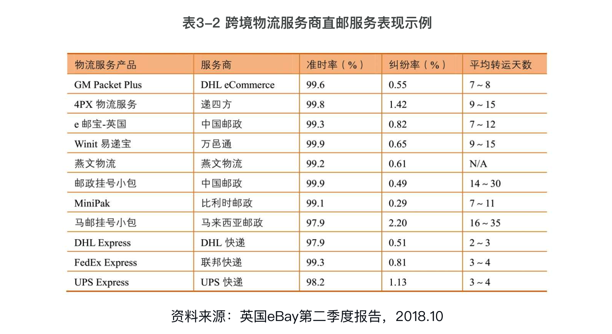
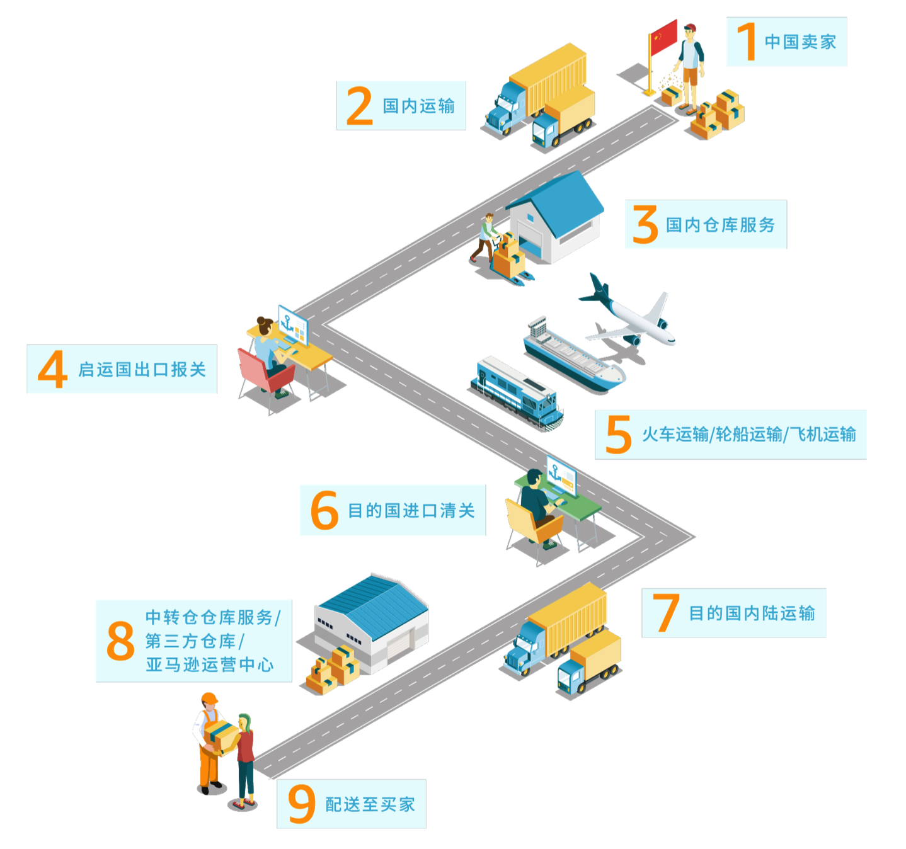
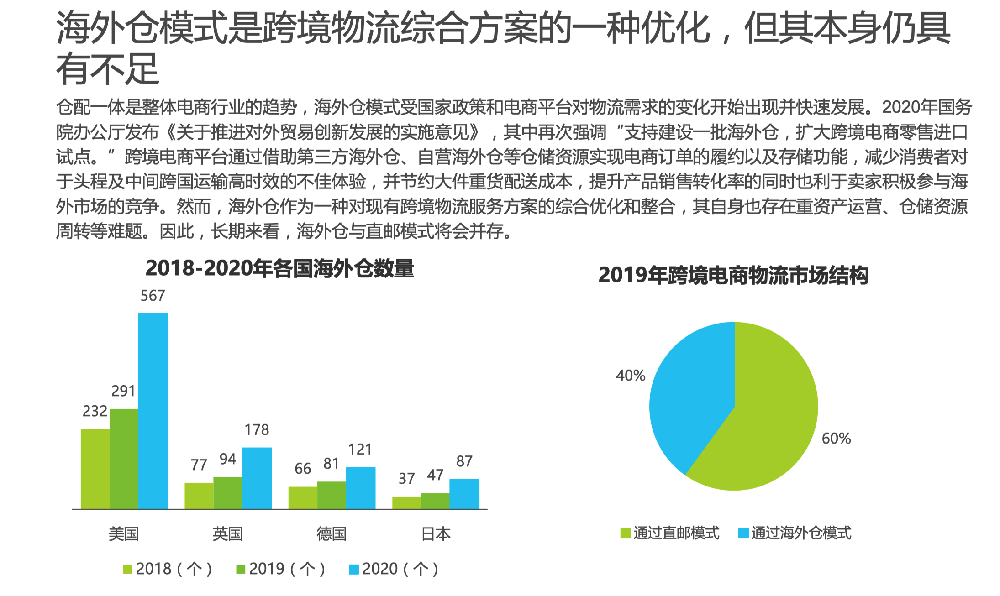

早期的时候，我一直闷头在做海外仓领域的产品，对跨境电商物流这一块似懂非懂，很多名词和业务模式大概听过，也知道一些区别和使用场景，但是遇到一些需要高度概括总结的场合的时候，总是感觉自己的知识太过零碎，不够系统化，不够结构化。  
所以，总体来说，我对跨境物流的熟悉程度是一个不上不下的尴尬境地，直到前段时间我去认真看了好几个跨境物流的研究报告，才豁然开朗，对相关的知识有了一个更深层次的认知，也开始形成了系统化、结构化的知识框架。  
我看的行业研究报告有以下几个：  
●艾瑞咨询-2021年中国跨境电商出口物流行业研究报告  
●艾瑞咨询：2022年中国跨境电商服务行业趋势报告  
●36Kr-2022年中国跨境电商行业研究报告  
●菜鸟研究：中国品牌出海跨境物流白皮书  
这些内容，我都分享在了我的语雀知识库中，感兴趣的朋友可以去找找，或者直接使用搜索引擎按标题去查询也可以。  
[https://www.yuque.com/jiaowovitamin/uizu4s/zw60gh](https://www.yuque.com/jiaowovitamin/uizu4s/zw60gh)  
  

跨境电商领域的一些行业研究报告

  
很多时候我们想要快速地了解一个行业的宏观知识，看行业研究报告是一个非常不错的选择，一方面行业研究报告会有比较全的数据库和资料库，所以展示出来的数据很丰富；另一方面是行业研究报告的调研人员一般也是外行人，所以外行人输出这些报告的时候会以一个新用户的视角去阐述，反而更容易接地气，更好理解。  
**什么是跨境物流？**  
“跨境物流是指以海关关境两侧为端点的实物和信息有效流动和存储的计划，实施和控制管理过程。结合跨境电商及物流的概念与特点，跨境电商物流定义为：在电子商务环境下，依靠互联网、大数据、信息化与计算机等先进技术，物品从跨境电商企业流向跨境消费者的跨越不同国家或地区的物流活动。”——摘自百度百科  
跨境物流从商品的流通方向上来分，可以分成“跨境进口物流”和“跨境出口物流”。“跨境进口物流”的业务规模和资料比较少，本人也没怎么负责过相关的工作，故不做过多介绍。**所以本文或者是本书所提到的跨境物流其实都是指狭隘的“跨境出口物流”方式，简称“跨境物流”**。  
  

跨境物流分类

  
  
按业界的主流判定方式，一般认为跨境出口物流有两种模式，分别是：**直邮模式和海外仓模式**。  
直邮模式是指从国内的仓库或者工厂直接发货到国外的消费者手里；而海外仓模式则是指从国内的仓库或者工厂备货到海外仓， 再根据销售情况从海外仓发货到国外的消费者手里。  
无论是直邮模式，还是海外仓模式，其实都算作是跨境出口物流下的一个分支，即跨境出口物流是一个比较宏大的概念，包含的业务模式比较多。  
根据一些行业研究报告显示，截止到2022年左右，直邮模式和海外仓模式的市场占比大约是**6比4**，而且随着跨境电商业务模式的普及和多方因素的共同作用之下，海外仓模式的一些优势逐渐凸显，所以占比正在逐步升高。  
**跨境出口物流的两种模式对比**  
中国跨境电商物流环节包括前端揽收、运输分拣、国内报关、干线运输、 海外清关、海外仓储、尾程派送七个环节，环节多，流程复杂，直接受海外关务、税务政策影响。大部分的跨境电商物流企业没有办法完整地串联这七个环节，需要协同第三方物流等多方资源来分别承担各自环节。 **因此，资源整合能力对于跨境电商物流公司来说十分重要。**在这些环节 中，干线运输是血液，关系到整个链条的顺利完成，在销售旺季，跨境电商物流往往遭遇运力短缺问题，叠加疫情影响，干线运输更加重要。  
直邮模式和海外仓模式的的核心流程拆解如下图所示，总体来看核心环节都是相似的，主要的区别有：  
1直邮模式是消费者下单之后再响应发货，而海外仓模式则是需要提前备货到海外仓，然后等消费者下单之后再响应发货；  
2直邮模式一般是直发小包裹的方式居多，所以干线运输往往采用空运的方式较多；而海外仓模式则是大批量备货，干线运输一般以海运的方式居多；  
3直邮模式和海外仓模式的报关方式也会有所不同，例如直邮模式出口一般是采用“9610”的海关监管代码，而海外仓模式出口则是使用“9810”的海关监管代码，不同的海关监管代码，对应的报关手续和流程也会有差异；  
  

直邮模式

  
  

海外仓模式

  
**直邮模式**  
对于直邮模式，一般来说也会分成三种具体的方式，它们分别是：  
1邮政包裹  
2跨境专线  
3国际商业快递  
邮政包裹模式是指邮政公司通过自行揽收或第三方物流服务商揽收后再交由邮政企业负责出关、国际运输及目的国清关配送等环节的模式，如E邮宝等。  
跨境专线模式是指跨境物流服务商通过自营及整合外部物流资源的方式，对外推出某些特定的线路，已达高时效、高品质、高性价比的物流服务。如美国专线，欧洲专线，澳洲专线等。  
国际商业快递模式是指国际三大商业快递公司（DHL、Fedex、UPS） 通过第三方物流服务商或自行揽收等途径取得货物订单后，自行组织出关、国际运输及目的国清关配送等环节的模式，如DHL全球达等。  
从时效上来说，一般国际商业快递＞跨境专线＞邮政包裹，而从费用上来看也是如此，想要速度和服务，那就不得不付更多的钱。所以，一般针对高价值且时效要求也高的产品，会使用国际商业快递来发；而一些高价值但是时效不是那么紧急的产品，可以选择跨境专线；如果是一些低价值且时效性也要求不高的产品，那么最便宜的邮政包裹则是性价比之选。  
  

摘自《跨境物流与海外仓》

  
  

摘自《跨境物流与海外仓》

  
顺带提一句，邮政包裹也有分平邮包裹和挂号包裹之分，当时入门的时候这两个概念把我整的有点晕乎，但是实际上多了解一些业务之后发现这些概念也比较简单。  
1平邮小包，简称平包，是资费水平最低的跨境物流产品，只计实重，不计首重，按克计费，平均重量在70～80克，没有单票处理费。由于没有邮寄凭据所以不可追踪查询，包裹的安全性相对较低，丢失后邮局不会赔偿和任何处理。所以平邮小包邮寄的价格也相对较低，没有挂号费。  
2出口邮政挂号小包，适用于货值低、重量较轻、时效性要求不高的商品。平台对订单有跟踪率的考核。它时限稳定，计费方式统一，清关能力强，覆盖全球，一单一件，挂包服务的准时运达率不及快递或专线，但签收纠纷比率最低。有邮寄凭据可以上网追踪查询，拥有全程物流信息。正常情况丢失的有一定赔偿，所以挂号小包的价格较平邮要高，有挂号费。因此客户在邮寄产品时，一定要注意是挂号还是平邮。  
**海外仓模式**  
海外仓也是一个比较笼统的概念，很多时候我们把设立在海外且主要用于跨境出口电商履约的仓库就统称为海外仓，这个视角是以中国出发，相当于在中国大陆境外的地区开设的仓库，对我们来说都算是海外仓。  
从类型上来划分，一般海外仓会分成三类：  
1卖家自建海外仓，由跨境电商卖家自己搭建的仓库，例如乐歌海外仓；  
2电商平台官方仓，由电商平台运营的仓库，例如亚马逊的FBA仓；  
3第三方海外仓，由第三方服务商搭建的仓库，例如谷仓海外仓，万邑通海外仓，4PX海外仓等；  
**这三类海外仓分别覆盖不同的业务场景，供不同的电商卖家选择使用，互相补充，也有很多业务联动。**  
例如电商卖家自建的海外仓往往只是会集中在某些国家或者地区，不会覆盖所有的地区，所以在没有覆盖自建海外仓的地方还是会选择平台官方仓和第三方海外仓。  
例如平台官方仓（以FBA举例）虽然对卖家来说有诸多优势，但是也因为平台的一些限制和约束，导致卖家不敢轻易将所有的货物都备货到FBA仓库，还是会选择部分放在第三方海外仓，部分放在平台仓中。  
上文说到，直邮模式与海外仓模式的市场占比大约是6比4，且海外仓模式的份额有递增的迹象。接下来，我们一起来看一下海外仓模式的优势有哪些：  
1最明显的一个优势就是时效短、速度快，直邮是从国内发到目的国，需要经历跨境出口的“7大流程”，而海外仓则是直接本土发本土，自然时效就短多了；  
2如果备货计划准确，且动销率高，那么相应的物流成本也会很低，这也是比直邮更省钱的一个地方；但是如果备货计划不准确，商品动销也一般，再加上高昂的仓储费和海外操作费，那和直邮相比就不一定更省钱了；  
3具有很强的灵活性，海外仓除了可以直接发到消费者手里之外，还可以与多个仓库间进行货品的调拨，方便灵活调整库存；  
4为卖家提供更多的增值服务，例如FBA的退货换标，海外仓的库内加工，还有客户退货，海外售后等，这些都是直邮模式做不到的；  
5提升店铺销量，对于平台和消费者来说，可以支持本土发货的商家往往会更有优势一些。对于平台来说，会扶持使用官方平台仓的卖家多一些，对于消费者来说更青睐于本土发货的卖家，这样时效性和售后体验等都有保障；  
  

跨境出口的7大流程：“揽仓关干关转配”

  
说完了海外仓的一些优势，那么也要聊聊海外仓的一些劣势，毕竟人无完人，业务模式自然也是如此。总体来说，与直邮模式相比，海外仓的劣势有这么几个：  
1最明显的一个劣势就是库存积压成本高，资金周转不方便。对于直邮来说，消费者下单购买了，卖家再发货，可以不用积压太多库存，甚至可以找供应商一件代发；而对于海外仓来说，必须要提前备货到海外仓，备货多了卖不动，则会带来很多的库存积压，资金压力就大多了；  
2海外仓的管理能力一般，能支持的业务模式也比较单一，没有国内仓库完善和丰富。很多海外仓至今为止都没有用上信息化系统，使用Excel管理的大有人在；即使有一些用了信息化系统，也是只能处理一些简单的业务场景，很难做到国内仓库的精细化运作；例如促销组合发货，库内加工发货，赠品发货，定制化发货清单，序列号管理等，很多海外仓都做不到；  
3海外仓不规范导致的一些乱收费或者欺诈等，这几年海外仓突然爆火，涌入了很多想赚快钱的海外仓服务商，其中有很多仓库的作业不规范，收费也不规范，出现货物丢失或者损坏而不赔偿，更有甚者直接威胁携货跑路的；而且由于海外仓都经营成本比较高，所以羊毛要出在羊身上，所以有一些海外仓就会巧立名目，借机多收取卖家的费用，导致卖家物流成本逐步升高；  
**该选择什么模式？**  
对于跨境电商卖家来说，是选择用直邮还是选择用海外仓，要考虑的因素有很多，但是从本质上来看，核心还是：**成本**。  
直邮的方式，降低了销售计划不准确或者对市场判断不准确而造成的积压库存的成本，但是直邮的时效慢，物流服务体验不佳，同时也受限于一些平台政策的扶持。所以想要选择直邮的方式去履约，首先要看自己经营的是什么电商平台，平台是否支持直邮，其次再考虑货物的特性，运输的成本等因素。  
而海外仓发货的模式，时效快，成本低，而且也受很多平台的推崇和青睐，逐渐地成为了大家的共同选择，尤其是在2021年亚马逊封店潮+线上经济爆火的那段时间。很多人发现了海外仓蕴含了很多潜力和机会，于是那段时间掀起来了一波“建仓潮”，也是基于这个点我当时才去加入做海外仓的SaaS WMS。  
虽然在现在的时间点来看，海外仓的热度有所下降，但是作为身经百战的电商卖家，它们已经摸索出了一套“降本增效”的方法论，绝大多数的卖家开始意识到要做本土店，要做品牌出海，于是直邮和海外仓“二选一”的局面逐步变成了“成年人全都要”。  
  

摘自《艾瑞咨询-2021年中国跨境电商出口物流行业研究报告》

  
**纷繁复杂的跨境物流**  
跨境物流领域是一个比较宏大的概念，涉及的受众多，链路长，时间周期也长，想要通过一文就讲透这个领域还是比较困难的。本书重点虽然是在海外仓相关的信息化系统的设计，但是从我个人的实际工作情况来看，跨境物流的链条很长，涉及的节点、角色也很多，所以或多或少还是会接触到其他的上游或者下游，我非常建议相关的产品经理或者业务人员们不要只关注自己眼前的一亩三分地，也可以将眼光放的长远一些，把其他领域的知识也一同学习和掌握一下。  
**对于跨境行业的产品经理来说，无论是做SaaS ERP领域，还是做海外仓，还是做物流，亦或是做卖家侧和平台侧的内部产品，物流领域的业务知识都是必须要掌握的，因为电商行业的下游一定是会和仓储物流挂钩的。**  
如果想对跨境物流有更进一步的认知，欢迎下载上文提到的一些行业报告进行阅读。当然，本文一些定义与引用文均来自上文提到的几篇研究报告，感兴趣的读者朋友可以看看报告的原文。