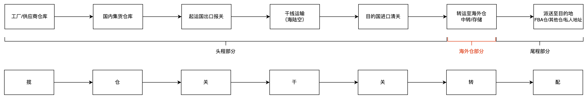

**1\. 什么是头程和尾程？**  
头程和尾程是跨境物流的关键环节，它们共同构成了整个跨境物流的过程。头程是指商品从国内发往国外的运输过程，通常包括了货物从出口国仓库出库到进口国仓库入库这一段的运输过程。而尾程则是指货物从进口国的仓库或集散中心发往最终收货人地址的运输过程。  
除了头程和尾程之外，一般还会在中间夹杂一个“海外仓”的环节，意味着在这个跨境出口物流环节中，还有一部分的操作是在海外仓进行的。  
  

头程、海外仓、尾程的介绍

  
行业内常常会提到一个词“FBA头程”，其实就是指将货物从国内仓库运输到亚马逊的FBA仓库这一段运输过程。与之相对应的，是大家称呼的比较少的“海外仓头程”，即指将货物从国内仓库运输到海外仓的这一段过程。  
**2\. 头程运输包含了哪些内容？**  
头程运输是指从货物起始地到目的地国家的运输过程，通常包括海运、空运和陆运三种方式。下面分别介绍这三种运输方式的具体细节、优缺点以及适用场景。  
**2.1 海运**  
海运是指利用各种船舶在国际或沿海航线上进行货物运输的一种方式。  
●**优点**：海运成本相对较低，适合大批量、重量较重的货物运输。同时，海运的承载能力强，可以运输大量货物。  
●**缺点**：海运速度较慢，受天气、航线等因素影响较大。此外，海关清关程序相对繁琐，可能导致货物延误。  
●**适用场景**：适合运输大宗商品、重型设备等重量较大、对运输时间要求较低的货物。  
海运运输包括海运整箱和海运拼箱。  
●海运整箱：即Full Container Load，简称为 FCL。指整箱货物仅有一个发货人，并由发货人来负责装箱、计数、积载并加以铅封的货运；国际统一标准的集装箱常见尺寸为20'GP，40'GP，40'HQ 和45'HQ；  
●海运拼箱：即 Less Container Load，简称为LCL。指发货人托运的货物为不足整箱的小票货，通过代理人(或承运人）分类整理货物，把发往同一目的地的货物集中到一定数量拼装入箱。  
海运运输一般包括 “海加卡”和“海加派”两种形式：  
●海加卡：指头程物流使用海运，通过普通海运方式进行目的国清关，货物到达目的港后使用卡车运送至仓库。  
●海加派：指头程物流使用海运，通过快递公司进行目的国清关，货物到达目的港后使用快递或邮政快递运送至仓库。  
**2.2 空运**  
空运是指通过飞机进行货物运输的一种方式，通常在国际货运中占有重要地位。  
●**优点**：空运速度快，可实现全球范围内短时间内货物运输。同时，空运的安全性较高，货物损毁的风险较低。  
●**缺点**：空运成本较高，对货物尺寸、重量和类型有限制。此外，航班受天气等因素影响，可能导致运输延误。  
●**适用场景**：适合运输价值较高、对运输时间要求较高、重量较轻的货物，如电子产品、时尚服装等。  
与海运运输相同，空运运输也可分为 “空加卡”和“空加派” 两种形式。  
●空加卡：指头程物流使用空运，通过普通空运的方式进行目的国清关，再用卡车运输货物。  
●空加派：指头程物流使用空运，通过快递公司来进行目的国清关，再用快递或邮政快递运输货物。  
**2.3 陆运**  
陆运是指利用铁路、公路等陆地交通工具进行货物运输的一种方式。  
●**优点**：陆运成本适中，运输距离较近时具有较强的竞争力。同时，陆运具有较强的运输灵活性，可实现门到门的服务。  
●**缺点**：陆运受路况、交通管制等因素影响，可能导致运输时间较长。此外，陆运跨境过程中可能面临多次清关，增加了货物延误的风险。  
●**适用场景**：适合运输距离较近、对运输时间要求适中的货物，同时可作为海运和空运的补充方式，实现多式联运。  
总之，在选择头程运输方式时，需根据货物特性、成本和时间要求等因素进行综合考虑。每种运输方式都有其适用场景和优缺点，因此选择合适的运输方式对于确保货物顺利到达目的地非常重要。  
**2.4 头程运输的几个环节**  
货物从出口国运送到进口国，其中涉及了诸多个环节，接下来我们就简单介绍一下头程运输主要包含的一些环节：  
1揽货段，货物从出口方的工厂或者仓库自行送到货代的集货仓，也可以货代上门揽收，然后在货代的集货仓中进行商品验收、拼柜，装柜等动作；  
2出口报关，货代完成了订舱之后安排拖车装货，将货物运送至码头堆场，货物正式接受海关监管，然后再根据相关法规和要求，向出口国海关申报货物信息，报关完成之后，货物放行，则再进行装船；  
3国际运输，通过海运、空运、铁路运输等方式将货物运输至进口国；  
4进口国清关，货物到达进口国后，需要进行进口的申报清关，依据当地法规缴纳关税和增值税；  
5提柜转运入仓，完成报关后，货代安排前往港口提柜，然后货物会运输至进口国的仓库（海外仓）或集散中心，海外仓的拆柜业务就是发生在提柜送达仓库之后；  
**2.5 计费方式**  
头程物流的计费方式通常包括以下几种：  
●重量计费：根据货物实际重量计算运费；  
●体积计费：根据货物体积计算运费，适用于轻质大体积的货物；  
●固定费用：对于某些特定类型的货物，可能会有固定的费用，如关税、燃油附加费等。  
头程的报价中，直接用重量计费去报价，然后包含一系列的杂费，打包成一口价的比较多，例如：  
本报价为人民币报价，价格适用于普货，包含头程运费、进出口买单报关费、文件费（不含出单费）、仓库卸货费、托盘费、目的港清关、派送等费用；不包含保险费、商检费、熏蒸费、进出口海关查验费、仓库增值服务费、超期费和仓储费等  
**3\. 尾程物流包含了哪些内容？**  
尾程运输是指货物从海外仓运送至本土或者周边国家（例如美国仓发加拿大），通常包括卡车和快递这两种方式。  
**3.1 卡车**  
拿美国海外仓为例，一般仓库会在大批量调拨、运输大、重物等场景下选择使用卡车作为尾程的运输方式，例如海外仓备货中转送到就近的FBA仓库，还有一些大物件（浴缸、家具）运输等。  
**优点**：卡车通常有较大的载货能力，可以承载大量货物，适用于大规模的物流运输需求。卡车运输在长途运输中通常比快递运输更经济，尤其对于大宗货物或长距离运输，成本相对较低。  
**缺点**：与快递相比，卡车运输通常速度较慢，特别是在远距离运输中，需要更长的时间来完成交货。卡车的轨迹不好获取：有一些卡车公司并不是很专业的那种，对于轨迹这一块的信息化处理不是很好，没办法通过系统直观地了解到运输的实时进展。  
**适用场景**：大批量货物的长距离运输：卡车运输适用于大规模的货物运输需求，特别是对于长距离运输。对交货时间不敏感的情况：如果交货时间对业务不是非常关键，卡车运输是一个经济实惠的选择。  
**3.2 快递**  
海外仓大多数2C的单一般都会选择使用快递作为尾程物流运输的运输方式，例如美国的USPS，UPS，FedEx等，也有一些海外仓会选择使用UPS Ground服务来寄送一些散箱货物到FBA仓库补货，因为时效会快一些，也比较灵活。  
**优点**：快递公司提供专业的物流服务，包括包装、分拣、保险等，能够提供一体化的服务解决方案。快递运输通常以快速交货为特点，适合对交货时间敏感的业务需求。快递运输通常提供实时的货物跟踪系统，买家和卖家可以随时了解货物的位置和运输状态。  
**缺点**：相对于卡车运输，快递运输的成本通常较高，特别是对于大宗货物或长距离运输。快递运输通常有一定的限制，如重量限制、尺寸限制等，不适合运输特别大型或特殊形状的货物。  
**适用场景**：快递运输适用于对交货时间要求较高的业务需求，如电商订单、紧急货物等。对于小批量的货物运输，快递运输更加便捷和经济。  
**3.3 计费方式**  
尾程物流的计费方式主要有以下几种：  
●按重量计费：根据货物实际重量，再结合目的地分区计算运费；  
●按体积计费：根据货物体积，再结合目的地分区计算运费；  
欧美地区的尾程物流一般都会包含一些附加费，而且名目还比较多，例如燃油附加费，住宅/偏远地址派送费，超长/超重/Oversize服务费等，这些会在基础运费的基础上再进行额外加收。