**前言**  
头程物流相对尾程来说，涉及的环节多，业务复杂，时间周期长，运输链路也长，难度和复杂度都是明显高于尾程物流的。正因为如此，所以很多人初入头程物流这个赛道的时候，很容易被诸多繁杂的术语，概念和业务流程等吓到，要花很多时间才能达到入门的水平。而且市面上对于头程物流的介绍和科普大多数都很浅层，碎片化的，更可怕的是很多都是互相抄袭、洗稿，所以就会在不同的网站上看到很多“重复性的错误”，这也加深了新手入门的学习难度。  
我过往的所深入接触的业务知识主要还是在尾程物流这一块，对于头程物流只能说大概了解或者半知半解，所以本文的目的还是给一些新手朋友们做一些术语科普和宏观流程的介绍。  
我会以一个初学者的视角来对一些业务流程做概括和说明，同时也会对一些术语和概念做一些通俗化的理解和解答，最后，也会在文章末尾附上一些优质的信息来源，让大家可以更加深入和详细地学习优质的“一手信息”。  
此文是我为数不多的有大量搬运，摘录他人内容的文章，具体的参考资料和出处等我都放在了文末，因为内容较多，所以没有一一指明出处，望大家理解。  
再此，感谢这些前辈们的输出，让我享受到了“站在巨人肩膀上”的便利。  
**海运出口流程介绍**  
海运出口的流程会包含很多环节和节点，对于新入行的朋友来说会被很多名词给搞混，所以我建议抓住一些核心的节点流程去理解，然后适当地忽略一些不太重要或者太零碎的内容会更好一些。  
  

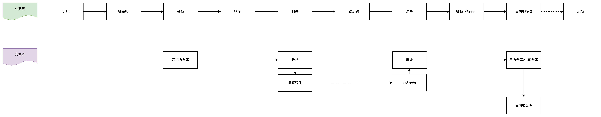

海运出口的业务流和实物流介绍

  
其中比较核心和关键的流程有：  
1订舱，意思是向船公司预定舱位，获得船公司的配舱回单，一般华南地区称之为SO（Shipping Order），华东地区则称为预配单。一般情况下，出口商（卖家）会先向货代预定舱位，要说清楚自己运输的货物类型、重量、单证方面的要求等等，然后货代根据卖家的要求向船公司进行订舱。船公司确认有舱位之后就会放S/O给货代，车队可以凭借S/O进行打单，然后去指定地点进行提空柜。打单完成后，才可以产生柜号和封条号。柜号其实就是集装箱的11位箱号，说明了箱主、经营人、集装箱类型、箱体注册码、校验码等信息。  
2提空柜/装柜/还柜，联系拖车取得设备交接单，并到堆场提取集装箱到客户仓库装货或客户直接将货物送至指定堆场或仓库。  
3出口报关，装柜前提供装箱清单，以确保报关手续的顺利进行。装柜完成后，需要提供更为详细的货物清单，即补料，以便海关进行核对和查验。补料包括货物的品名、数量、重量、尺寸、价值等信息，确保货物的合规性和准确性；补料完成后船公司签发MBL（船公司提单）给货运代理，货代签发HBL（货代提单）给发货人。  
4干线运输，干线运输过程，由船公司负责。  
5进口清关，货船即将到达目的地港口时，需要准备清关资料，提前向当地海关申报，获得通行审批。  
6提柜/还柜，货物到港之后会卸船，然后存放在专门的堆场，需要安排拖车凭借MBL（船公司提单）去提柜，货物提柜送达目的地并卸货之后，需要将空柜子还到指定的位置。  
**海运的航线和航司介绍**  
中国是全球最大的出口国之一，而美国是中国的重要贸易伙伴。这里以中国海运出口到美国为例，讲解一下海运出口过程中包含的一些业务知识。  
**1****航线介绍**  
航线是指轮船航行的线路规划，会有具体的航行方向，起点，途经点和终点等信息。一般来说主航线是国际机构统一定义好的，不同的船司都会遵循某个主航线的规划进行运输。但是各家船司在同一条航线上所运行的船舶类型不一样，装载的货物不一样，挂靠的码头不太一样，所以各家船司会基于主航线再定义一个属于自己的航司线路，例如说美森的CLX，长荣的CPS。  
中国-美国的海运航线大致分为美东和美西航线。美西航线一般会从中国港口出发（盐田、厦门、宁波、上海等），经太平洋到达美西各港口。美西的主要港口有洛杉矶（LA/Los Angeles）、长滩（LB/Long Beach）、奥克兰（CA/O[akland](https://www.5688.cn/ports/us/oakland6ca.html)）等。中国的跨境电商货物一般会停靠在长滩港或洛杉矶港，这两大港口也是美西最繁忙的两个港口，例如长荣海运、达飞轮船等都会在这些港口停靠。  
  

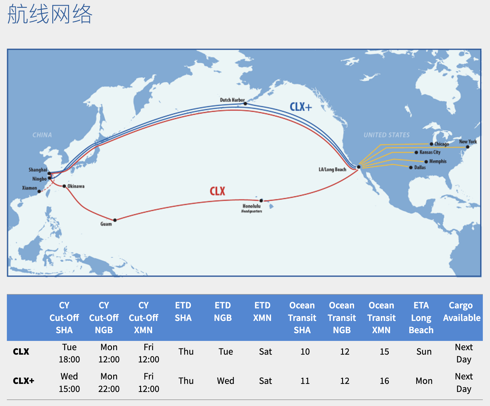

美森CLX/CLX+航线网络

  
美东航线则细分为东行航线以及西行航线。东行航线需要经过太平洋，然后通过巴拿马运河到达大西洋再到美东港口。西行航线则要经过马六甲海峡、再通过苏伊士运河到达地中海、最后经过大西洋到达美东。美东的主要港口例如，纽约（New York）、萨凡纳（Savanah）、查尔斯顿（Charleston）等。  
  

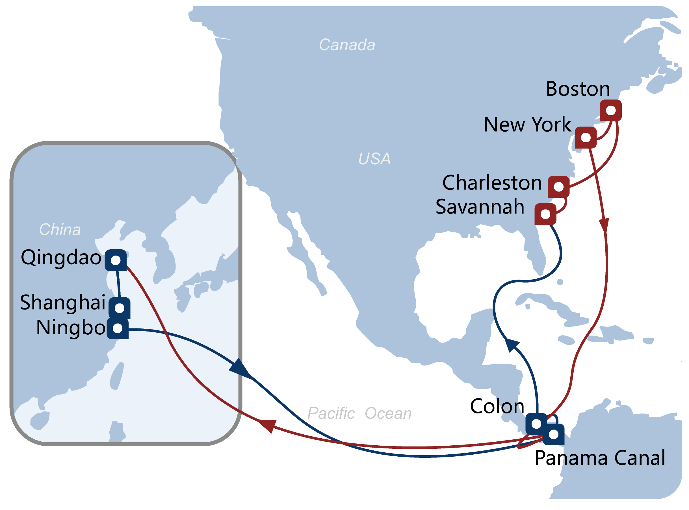

Cosco跨太平洋航线-AWE1

  
对比美东航线以及美西航线的海上航线时间，美西航线的海上航行时间远比美东航线的要短。根据不同船公司的航线安排，上海港至洛杉矶港的海上航行时间会在14天左右，但是上海港至纽约港的海上航行时间则会到30天左右。  
**2** **船公司介绍**  
海洋船只运输是国际贸易中最主要的运输方式，国际贸易总运量中的三分之二以上，我国绝大部分进出口货物，都是通过海洋运输方式运输的。海洋运输的运量大，海运费用低，航道四通八达，是其优势所在。但速度慢，航行风险大，航行日期不易准确，是其不足之处。我从网络上找了一个全球主要的船运公司的排行，摘录了一些信息来简单介绍一些这些船公司。  
1马士基航运（MAERSK）  
马士基集团成立于1904年，总部设在丹麦哥本哈根，在全球100多个国家设有数百间办事机构，雇员逾六万多名，服务遍及世界各地。除航运业外，集团多元化的业务范围广及物流，石油及天然气之勘探和生产，造船业，航空业，工业生产，超级市场零售业和IT等范围。  
  
2地中海航运(MSC)  
地中海航运有限公司 ( Mediterranean Shipping Company S.A. ，MSC）成立于1970年，总部位于瑞士，在世界十大集装箱航运公司中排名第二，业务网络遍布世界各地。七十年代，地中海航运专注发展非洲及地中海之间的航运服务。至一九八五年 ，地中海航运拓展业务到欧洲，及后更开办泛大西洋航线。虽然，地中海航运在九十年代才踏足远东区，但在这个朝气蓬勃的市场内，已经占有一个重要的地位。  
  
3达飞轮船(CMA-CGM)  
总部设在法国马赛的达飞海运集团始建于1978年，经营初期主要承接 黑海地区业务，进入90年代后期，达飞集团不仅开通了地中海至北欧、红海、东南亚、东亚的直达航线，还分别于1996年、1999年成功收购了法国最大的国营船公司——法国国家航运公司（CGM）和澳大利亚国家航运公司（ANL），正式更名为“CMA CGM ”。  
  
4赫伯罗特(Hapag-Lloyd)  
赫伯罗特公司诞生于1970年9月1日，其前身为总部设在汉堡的哈帕格和不来梅的北德意志商船（ NDL ）。在经济一体化的时候，这两个分别成立于1847年和1857年的公司，一直在海洋运输上活跃了一个多世纪。 第一次世界大战前不久，哈帕格和北德意志商船的班轮服务网络增长到遍及全球。在第一次和第二次世界大战期间，两家公司都失去了他们的船队，但在战后仍能够重新建立起来并大大扩展。随着上世纪60年代末集装箱运输的繁荣，这两个组织于1970年合并成赫伯罗特公司。 1997年，该公司成为一家全资附属公司。 2005年，赫伯罗特收购了加拿大太平洋航运公司，从而成为世界五大集装箱船公司之一，并大大扩展其船队合服务网络。  
  
5中国远洋(COSCO)  
中远集装箱运输有限公司，简称中远集运，是中国远洋运输集团（中远集团）所属专门从事海上集装箱运输的核心企业。截至2011年底，中远集运拥有150艘全集装箱船，总箱位超过61万标准箱；公司经营着75条国际航线，9条国际支线，以及70条珠江三角洲和长江支线。船舶在全球44个国家和地区的144个港口挂靠。集装箱运输业务遍及全球，在全球拥有400多个代理及分支机构。在中国本土，拥有货运机构近300个。在境外，网点遍及欧、美、亚、非、澳五大洲，做到了全方位、全天候“无障碍”服务。承运能力排名世界前列。  
  
6长荣海运(EMC)  
长荣海运股份有限公司创立於1968年9月1日，是一家台湾的公司。成立之初，仅以一艘十五年船龄的杂货船刻苦经营，虽创业维艰，但长荣海运凭借著「创造利闰、照顾员工、回馈社会」的经营理念，缔造了许多航运史上的佳绩；发展至今，共经营约160艘全货柜轮，不论船队规模或货柜承载量皆位居全球领先地位。近来，长荣海运透过舱位出售、舱位互换或航线联营等方式，积极与同业间进行策略合作，以期提供货主绵密的运输服务与提升营运绩效。  
  
7中海集运(China Shipping)  
中海集装箱运输股份有限公司是中国海运集团所属主要从事集装箱运输及相关业务的多元化经营企业。经范围涉及集装箱运输、船舶租赁、揽货订舱、运输报关、仓储、集装箱堆场、集装箱制造、修理、销售、买卖等领域。2004年6月和2007年12月，中海集运分别在香港联合交易所和上海证券交易所成功上市。  
  
8商船三井(MOL)  
株式会社商船三井（しょうせんみつい），简称MOL（Mitsui O.S.K. Lines, Ltd.），曾经也被缩写成MOSK，是日本的最大的海运公司之一，总部位于日本东京都港区。因为公司最早的源流为大阪商船，所以登记的总部地址为大阪市北区中之岛，是世界五百强企业。商船三井与日本邮船及川崎汽船并称为日本三大海运公司，以纯利润及市价总值计算居日本第一位，而销售额则仅次于日本邮船。商船三井的主要源流有二，分别是成立于1884年的大阪商船和1942年的三井船舶，分属日本的两大财团住友财阀和三井财阀。1964年，大阪商船与三井船舶合并为大阪商船三井船舶株式会社，开创了日本跨财阀大公司合并的先例。1999年4月，大阪商船三井船舶与当时日本排名第四位的海运公司Navix Line合并，改名为商船三井。  
  
上述信息可能由于时效性的问题会不太准确，如果想要了解近期的世界船运公司排行榜，可以参考这个网站的统计数据。  
[https://alphaliner.axsmarine.com/PublicTop100/](https://alphaliner.axsmarine.com/PublicTop100/)  
alpaliner是一家法国的航运咨询网站，内容如下：  
1他主要提供集装箱船市场的最新要闻；  
2船厂的订单，最新船型设计；  
3船东的船队统计数据；  
4航运公司的船队统计；  
5其余航运方面的信息；  
  

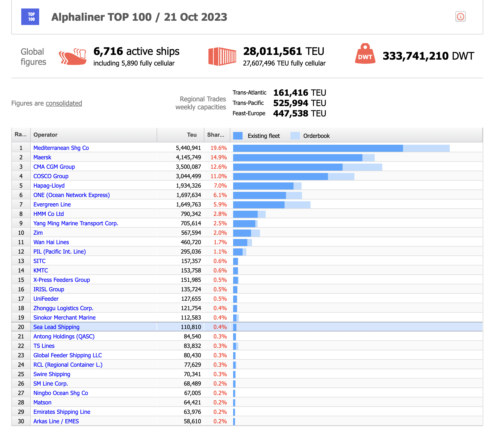

Alphaliner Top 100

  
TEU（Twenty-foot Equivalent Unit）：TEU是一个用于衡量集装箱容量的单位，表示标准20英尺集装箱的数量。它用于表示船舶或港口的容量大小。例如，一艘船的容量为5,000 TEU，则意味着它可以携带5,000个20英尺的集装箱。20GP=1TEU，40GP/40HQ=2TEU，45HQ=1.5TEU/2TEU（不同船公司不一样）。  
DWT（Deadweight Tonnage）：DWT是指船舶的载重吨位，表示船舶可以携带的最大重量（包括货物、燃料、水等）。它是船舶设计和结构的重要参数，用于评估船舶的承载能力。例如，一艘船的DWT为50,000吨，则表示它的最大载重量为50,000吨。  
Existing fleet（现有船队）：Existing fleet指的是当前正在运营的船舶总体，包括各种类型和规模的船舶。它是指已经建造并投入使用的船舶的集合，不包括尚未交付的新船。  
Orderbook（订单簿）：Orderbook是指船舶制造商或船厂接收的订单清单，即已经签署但尚未交付的新船订单。它代表了未来一段时间内将交付的新船舶数量。Orderbook是船舶市场和船舶制造行业的一个重要指标，可以用于评估船舶供需关系和市场动态。  
举例说明： 假设有一艘船的TEU为6,000，这意味着它的容量为6,000个20英尺集装箱。如果一艘船的DWT为80,000吨，这表示它的最大载重量为80,000吨，包括货物、燃料和其他物品。当我们提到现有船队时，我们指的是当前正在运营的船舶总数，包括各种类型和规模的船舶。对于订单簿，假设有一个船舶制造商的订单簿显示有10艘船的订单，这意味着该船厂有10艘新船的建造任务，并计划在未来交付这些船舶。  
  
**3****中美海运常见的船司和航线产品介绍**  
世界上有很多条航线，有很多船司， 每个船司针对不同的航线会推出不同的产品，于是就会有很多“航线产品”冒出来，不懂行的人听了之后就会很奇怪。例如我第一次接触“美森CLX”和“美森CLX+”的时候就懵逼， 完全不知道这是什么东西。接下来要介绍一下中美海运中，常见的、高频的船司和其航线产品，当然，大多数内容也是从网络和书籍上搜集而来的，如有什么错误之处，欢迎留言指出。  
**3.1****Matson（美森）快船**  
**美森快船主要有三条航线，分别是CLX（正班船）、CLX+（加班船）以及CCX航线。**美森快船的特点是航行时间稳定，正班船有独立的私人码头，能够保证十年如一日的卸船速度（够快），因此美森正班船在旺季的时候几乎不受影响，能够保持整条航线的稳定性。  
  

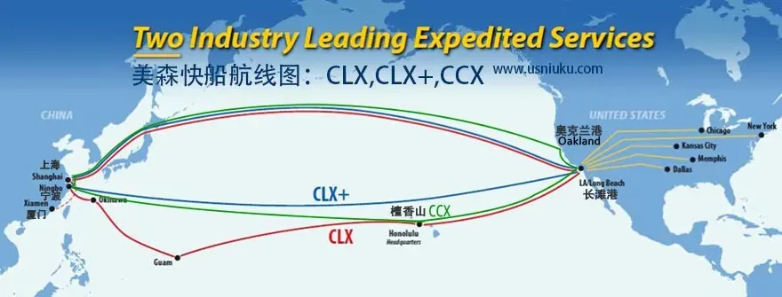

美森快船航线图

  
美森的加班船相对正班船会稍慢一些，但是在海上航行的时间都是11天。正班和加班的差异在停靠的码头不一样，加班船一般是停靠公共码头，同时加班船相对更大，装卸船都比较慢一些。加班船运气好的时候也有可能停靠私人码头，但是必须满足的条件是，这艘美森加班船上的船员都是美国籍。  
  

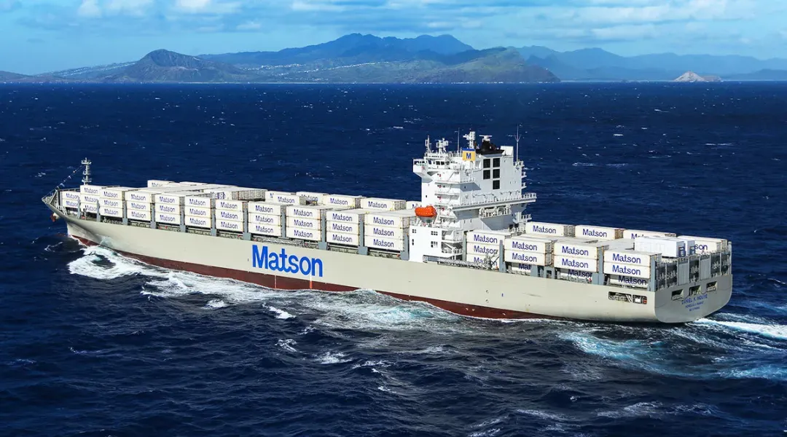

  
美森还有一大特点是服务效率不是按照天计算而是按照小时计算。美森快船不停靠深圳。华南卖家走美森都需要从宁波或者上海出发。  
**3.2****CMA（达飞）快船**  
达飞中国拥有近2万名员工（包含基华物流），经营5个品牌：CMA CGM（达飞）, [APL（美国总统轮船）](https://www.apl.com/), [ANL（澳大利亚国家航运）](http://www.anl.com.au/), [CNC（正利航运）](http://www.cnc-line.com/)和[CEVA Logistics（基华物流）](https://www.cevalogistics.com/)。  
**达飞的EXX快船是APL在市场上推出Eagle Express X (EXX)航线，11天直航到洛杉矶的精品航线服务。**这期达飞快船也是很火爆，还是首个提出暂不涨价的船司。达飞官宣决定停止所有即期运价的涨价！该措施自 2021年9月9日起立即生效，直至2022年2月1日。  
  

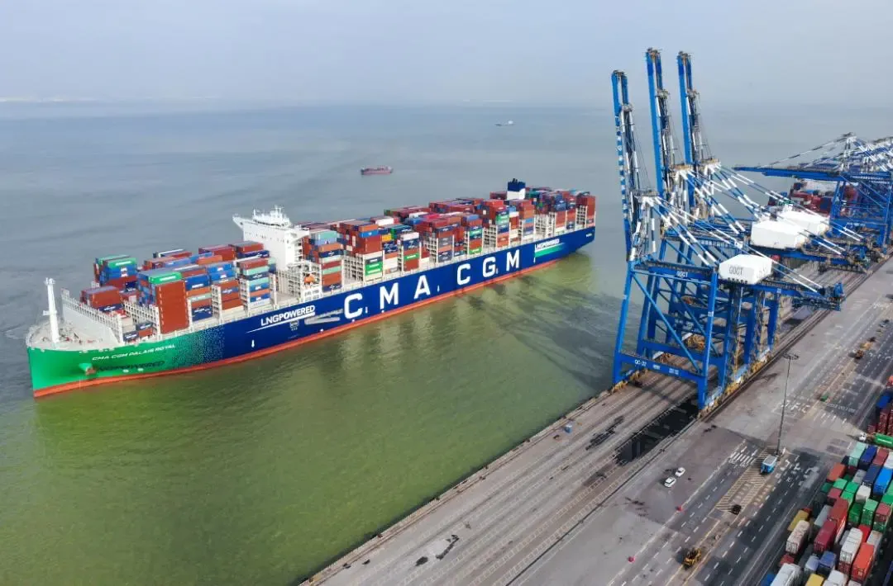

  
达飞EXX快船也有小美森的美誉，对标的是美森CLX+，离岸港口主要是上海和宁波为主。EXX快船时效不输以星快船，甚至能媲美美森快船，算作美森快船加班船，除了时效上有优势，还有个优点就是CMA EXX快线会对时间敏感的货物标记“优先货物”记号，并享有退款保证。  
  

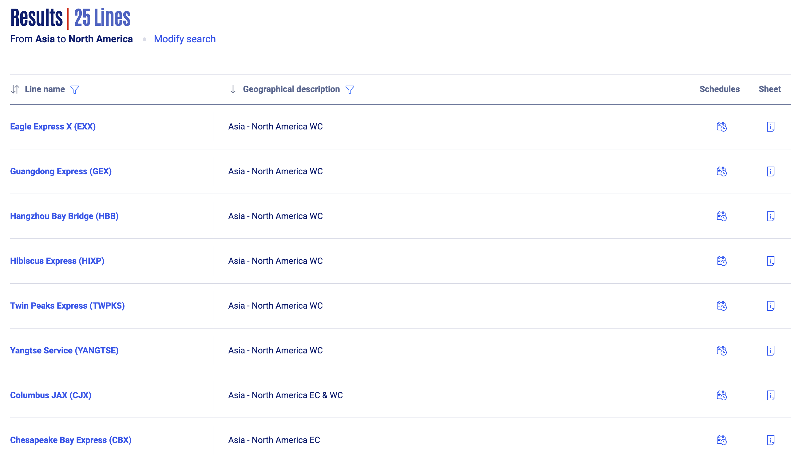

  
**3.3****ZIM(以星)快船**  
ZIM以星航运2020年6月推出了从深圳盐田始发直达美国洛杉矶的电商快船首航，直航到美国洛杉矶只需12天，12小时内大船卸柜，开船后10个工作日提取，能快速连接铁路通往美国其他目的地，例如：芝加哥、孟菲斯、达拉斯、堪萨斯和纽约。一经推出就是黑马航线。ZIM快航由于之前挂靠的码头是MSK的APM码头，时效不好，因此目前已经被通知无限期暂停。  
  

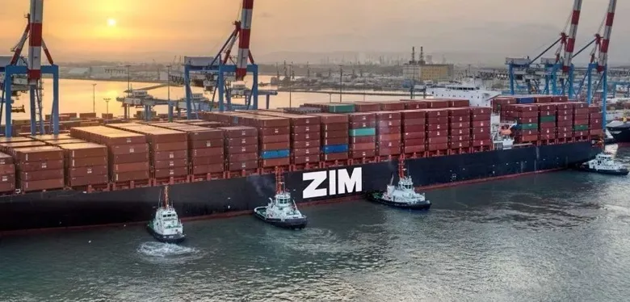

  
**3.4****EMC(长荣)快船**  
盐田快船指的是EMC长荣快船，作为在深圳到美国西海岸的快船，担当了太平洋两岸运输非常重要的角色。长荣海运作为20多年的船司，在80多个国家有固定的航线运输，实力方面是毋庸置疑的。作为南方快船，在以星快船没有开通之前，承担了华南地区大部分的有海运快船的业务。  
  

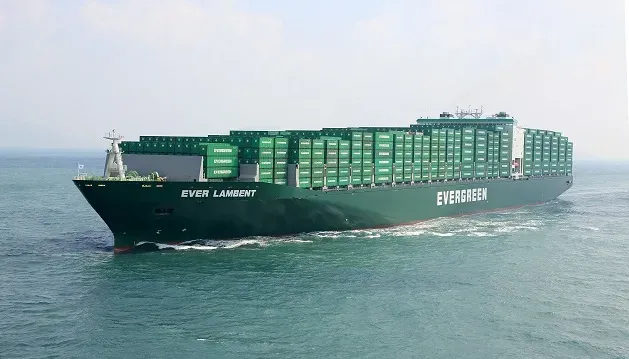

  
长荣EMC盐田快船是13-15个工作日提取。定提最大的优势在于有自己专门的码头，不用担心旺季塞港和码头拥堵的困扰。号称当天卸货，24小时内可以提柜，全年时效稳定。  
**3.5****COSCO（中远）快船**  
2021年10月COSCO中远海运推出了美线直客特快专线，中远海运通过对当前北美市场供需状况和物流情况进行精准分析，借助强大的统筹能力，积极筹措增量运力资源，在山东港口推出引领业界之先的重磅服务——“美线直客特快专线”，包括“王子港特快专线”（CEN-EXPRESS）和“洛杉矶特快专线”（CEN-PLUS）  
另外补充下COSCO的优势航线，华南是SEA，华东是AAC4和CEN。  
  

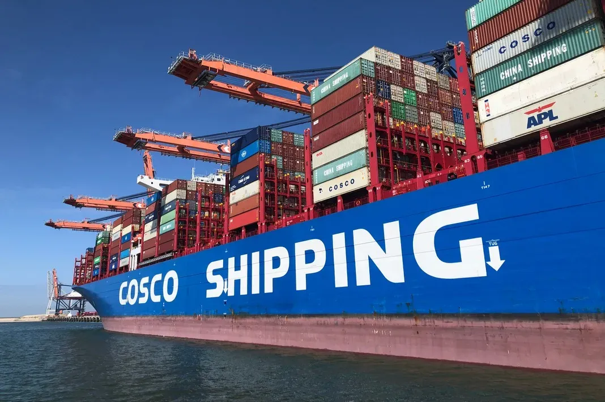

  
中远海运是中国有名的船东！新开通的“王子港特快专线”投入5条4250标准箱的船舶，每周1班，将有力提升青岛至美国的运力，有效缓解舱位供应压力。但目前COSCO只接受直客的货。  
**3.6****无忧中美快船（阿里快船）**  
无忧中美快船在2021年8月份的时候推出了中美航线，也有很多人称之为“阿里快船”。无忧中美快船（标准）（Alibaba.comOcean+Express）是阿里巴巴国际站为平台商家推出的多式联运经济型物流，船运+末端快递派送，仓到门服务，仅支持发货到美国，可承接普货/微电/微磁类物品。  
  

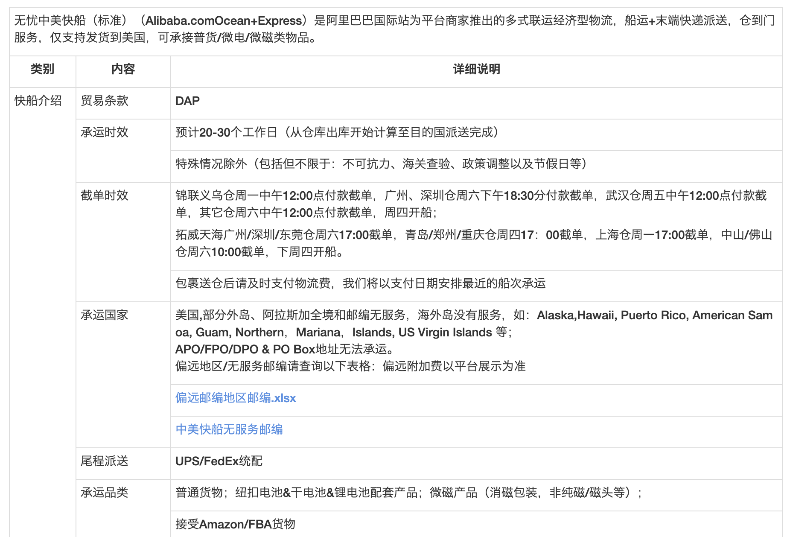

  
**海运的综合类知识介绍**  
**1****中国主要的集装箱海运港口**  
中国主要的集装箱海运港口包括如几个：  
上海港（第1）  
宁波舟山港（第2）  
深圳港（第3）  
青岛港（第4）  
广州港（第5）  
天津港（第6）  
厦门港（第7）  
苏州港（第8）  
北部湾港（第9）  
日照港（第10）  
**2****集装箱常见类型的介绍**  
集装箱市场上有多种集装箱类型，每种集装箱专门运输特定种类的货物。例如，药品等温敏货物更适合用冷藏集装箱。  
合适的集装箱不仅保证货物安全，还能节省费用。如果用标准集装箱运输药品，货物损坏和无法过海关的风险就更高。既浪费时间，又浪费金钱。  
  

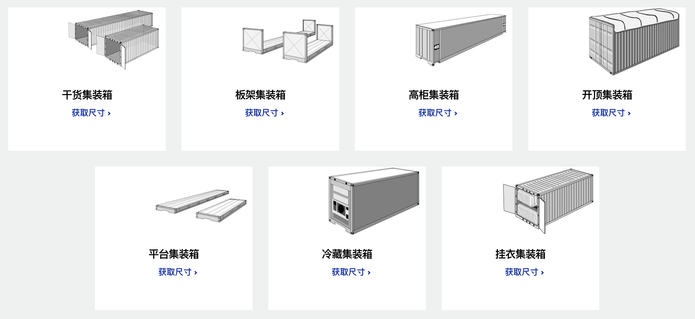

非常多种类的集装箱

  
日常我们常听说过的、常见到的一般是干货集装箱，其中最常使用的是标准集装箱和高柜集装箱。  
**2.1****标准集装箱的大小和尺寸**  
标准集装箱通常用钢铁或铝合金制造而成。铝合金集装箱的有效载荷稍高一点。一般来说，标准集装箱是密封的，并且防水，防止外界环境对货物造成损坏。  
标准集装箱能运输大多数类型的干货，例如箱子、托盘、麻袋、桶等等。内部可以定制以装载特定类型的货物。例如，运输服装时里面可以安装衣架，就可以直接把服装运输到商店。  
因为标准集装箱是基本类型，容易获取，所以价格不贵。  
  

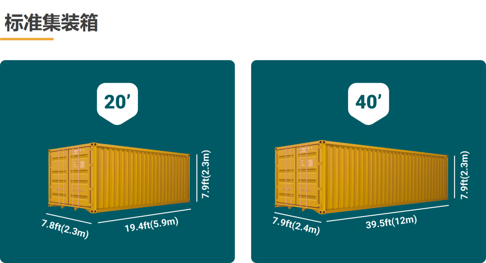

  
20尺标准集装箱和40尺标准集装箱的尺寸如下所示：  
  

| **尺寸** | **20ft** | **40ft** |
| --- | --- | --- |
| **内长** | 5.9m / 19.4ft | 12.03m / 39.5ft |
| **内宽** | 2.35m / 7.8ft | 2.4m / 7.9ft |
| **内高** | 2.39m / 7.9ft | 2.39m / 7.9ft |
| **空箱自重** | 2,300kg / 5,071.5 lbs | 3,750kg / 8,268.8 lbs |
| **载重** | 25,000 kg / 55,126.9 lbs | 27,600kg / 61,200 lbs |
| **容积** | 33.2 m3 / 1,172 cu ft | 67.7 m3 / 2,389 cu ft |

**2.2****高柜**  
高柜，英文缩写为HC，也会称为HQ。高柜与标准集装箱的结构相似，长度和宽度相同，只有高度增加了1英尺，让这种集装箱能满足更多货物需求。  
  

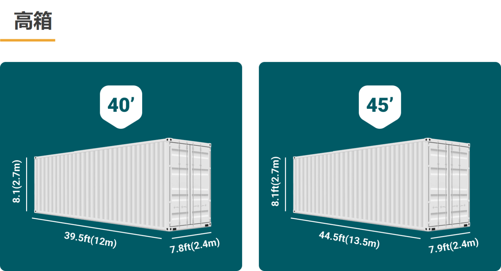

  
[高柜](https://container-xchange.cn/blog/high-cube-containers/)也有两种大小：40尺高柜和45尺高柜。因为这种集装箱加高了，以同样的价位提供更多的存储空间。如果您的货物需要更大的存储空间，标准集装箱不能满足要求的话，就选择高柜。下面是40尺高柜和45尺高柜的尺寸。  
  

| **尺寸** | **40尺高柜** | **45尺高柜** |
| --- | --- | --- |
| **内长** | 12.03m/39.5ft | 13.55m/44.5ft |
| **内宽** | 2.35m / 7.8ft | 2.35m / 7.8ft |
| **内高** | 2.70m / 8.10ft | 2.70m / 8.10ft |
| **空箱自重** | 3,900kg / 8,598 lbs | 4,800kg / 10,552 lbs |
| **载重** | 28,600 kg / 63,052 lbs | 27,700kg / 61,067 lbs |
| **容积** | 76.3 m3 / 2,694.5 cu ft | 86 m3 / 3,037 cu ft |

**3****海运货物查询与跟踪**  
要查询与跟踪中国海运到美国的货物运到哪里了，哪天开船， 什么时候到目的港， 海关是否放行等信息。  
可以访问船公司的网站，就能查询与跟踪息的货柜什么时候的船期，截止报关时间，开船时间，船名航次，预计到达目的港的时间等。  
中国海关出口是否放行需要咨询中国出口报关行与上相应的海关查询网站查看集装箱是否申报放行， 美国进口清关则咨询清关公司。  
海运拼箱的货物查询与跟踪通常需要咨询拼箱公司相应的柜号与船公司，通常海运提单不显示集装箱柜号、封条号码、船公司，所以要查询货物的信息只能联系订舱代理。  
**4****船期表和运费报价**  
中国集装箱运输到美国海运费，从中国港口到美国港口之是的海运费用不同的船公司，每星期，不同的港口与港口之间，不同的货物，不同的重量，一个集装箱的运费都不会不一样。  
很多专门做跨境物流的货代都会制作对应的头程物流报价表，如果想要了解其中的一些价格和服务内容，可以参考详细的报价表，这里我放了一个“大森林物流的预配船期表和产品报价表”，大家可以从报价表上看到很多术语或者概念的知识。  
  

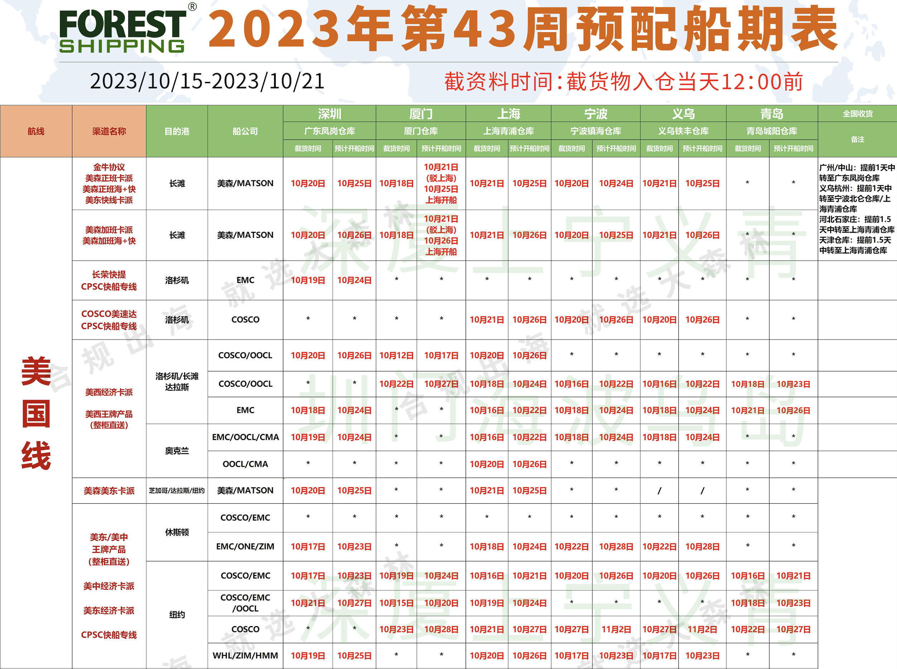

预配船期表

  
第一列表示这个航线是美国线，也就是从中国到美国。  
第二列表示具体的船司+航线构成的“航线产品”或者“物流渠道”，例如“美森加班卡派”，就是指“美森CLX+”这个航线产品，然后到了美国当地之后再用卡车派送到具体的目的地。  
第三列表示目的港是美国的哪个港口。  
第四列则表示具体服务的船公司是哪家，其中Matson（美森），Cosco（中远），EMC（长荣），CMA（达飞）都是常见的船司。  
再往后的列就是指在什么仓库收货，截止到什么时候就停止收货，预计的开船时间是什么时候。  
  

[2023.1009版大森林美国海运头程产品.xlsx](https://www.yuque.com/office/yuque/0/2024/xlsx/460219/1719298503705-56af5301-13d7-4eec-80dd-2e1772bfa500.xlsx?from=https%3A%2F%2Fwww.yuque.com%2Fjiaowovitamin%2Fotwb2%2Fmsyg7vazr4hebt75)

(2.6 MB)

具体的报价内容涉及的术语非常多，建议大家可以到需要的时候再去看，去了解，实在看不懂的也可以直接问对方的销售，这些信息应该语音或者视频来解释会更高效一些。  
**头程类的信息化系统介绍**  
有很多产品朋友会想要接触头程物流、海运的一些知识，是因为有相关的公司在招聘，然后负责的内容模块一般就是TMS（物流运输系统）。所以想知道这个方向怎么样，公司的业务发展是否有什么前景，然后自己如果去做这个方向的产品经理，未来的发展空间是否不错等。  
我对这个领域的接触程度比较浅层，所以我只能结合我身边的一些案例来谈谈我对这个行业的看法，以及我对这个方向的产品经理的一些看法。如果你希望得到更全面的洞察和剖析，建议可以找相关领域的专业人士咨询了解。  
首先，头程物流这个赛道其实还蛮大的，除了海运，还有空运、卡航，铁路等方向，中国是一个出口大国，出口业务一直在持续增加，相关的从业者还是很多的，所以从大方向上看这个行业没什么大毛病。但是如果从小处去看的话，会发现这个行业虽然发展了多年，但是还是很混乱或者说不规范。  
1头程物流具有链条长，环节多，时间周期长，参与角色多等特点，这些因素使得头程物流行业容易出现混乱、不规范、体验不太好的问题；  
2报关和清关牵涉到启运国和目的国这两个地方政府的相关事项，有很多事情可能不是纯粹的商业行为，而是会带有一定的政治色彩，所以在推动某些事情上可能没有那么顺利，可能要看对方脸色行事；  
3跨境出口物流这一块，上游的庄家（船司、货机、火车）涉及的业务体量很大，一般不太直接面向2C的客户，所以中间这一层会由货运代理来衔接，于是市面上就涌现了巨多的货代角色。而货代公司入行门槛低，行业规范约束弱，所以市场上的货代鱼龙混杂，不可靠的很多，很容易出现很多恶心事件，例如携款跑路，欺骗用户等；  
4头程物流是一个较为宽泛是说法，但是实际上细分之后可能还会有传统出口物流和跨境出口物流之分，这些不同的分支下衍生的服务产品也不一样，所以就会导致大家的规范和玩法不一样，无形中也收窄和隔离了这个领域的知识。可能做海运的人，压根不懂空运的知识，做空运的也不懂中欧铁路和卡航的知识，客户在选择这些服务商的时候，也需要付出很多试错成本。  
  

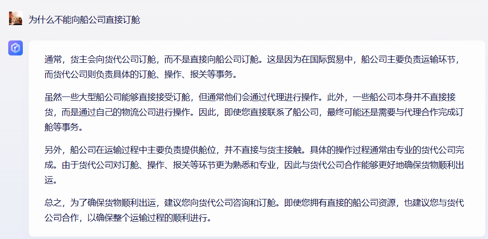

  
聊完了行业之后，可以聊聊产品经理岗位的事情，要看一个行业的产品经理岗位前景怎么样，香不香，值不值得做，就重点看这么几个点即可：  
1这个赛道下，有什么头部的大公司吗？是指会招聘很多产研岗去研发信息化系统的那种。  
2这个方向对信息化系统依赖高吗？它是实体业务驱动？还是信息化协同作用驱动？它是依赖于“表哥表姐”就能解决，还是要依赖各种信息化系统？  
3这个方向的系统和其他方向的系统有什么相似之处吗？可迁移的内容多吗？未来求职的时候是有优势的吗？  
结合上述说到的三个点，我个人认为头程物流方向的信息化系统并不是“很好”的赛道，只能说“中等偏下”，即不会太小众，也不是太主流。**而且从产品经理个人的体感上来看，如果一个公司对信息化系统的要求不高，重视程度不高，意味着相关研发的投入就会很小，体现在个人身上就是“钱少事多没发展”**。  
头程物流涉及到的环节太多，链路太长，非常吃业务经验，需要足够的业务沉淀和经验积累，对产品新手入门来说非常不友好。好不容易在这个领域积累了一些经验，下次跳槽的时候发现竟然没几家公司可以去了，这个是大概率的事情，然后被迫转行的时候又发现之前的那些经验在其他领域好像用不太上，非常的尴尬。  
综合上述所说，我个人不是很看好头程物流方向的信息化系统建设，但是并不代表说这个赛道就完全不能做。它非常适合有一定行业经验的朋友，想要在某个领域扎根一直做下去，而且也能依靠到一个不错的公司，为公司的信息化建设添砖加瓦。但如果是对一个刚工作不久的产品经理来说，我个人是不太建议选择这个方向的，除非你没得选了，不然还是建议先选择一些更有通用性，更容易上手的产品方向。  
**参考资料**  
  

[中美海运有哪些船司和航线？这份锦囊亚马逊美国站卖家一定要收藏！](https://zhuanlan.zhihu.com/p/433322421)

  
  

[美国快船天团 : CLX、CLX+、CCX、EXX航线介绍](https://www.tieheng-sh.com/blog/clx-clx-ccx-exx)

  
  

[不是所有“快船”都叫美线快船！到底快在哪？](https://www.tieheng-sh.com/blog/06c08d218b7)

  
  

[全球十大船运公司--行业动态--北京宇行天下国际贸易有限公司](http://www.yuworld.cn/newsshow.asp?id=1151)

  
  

[12种集装箱及其尺寸最佳指南，以及如何获取集装箱](https://container-xchange.cn/blog/container-types-and-dimensions/)