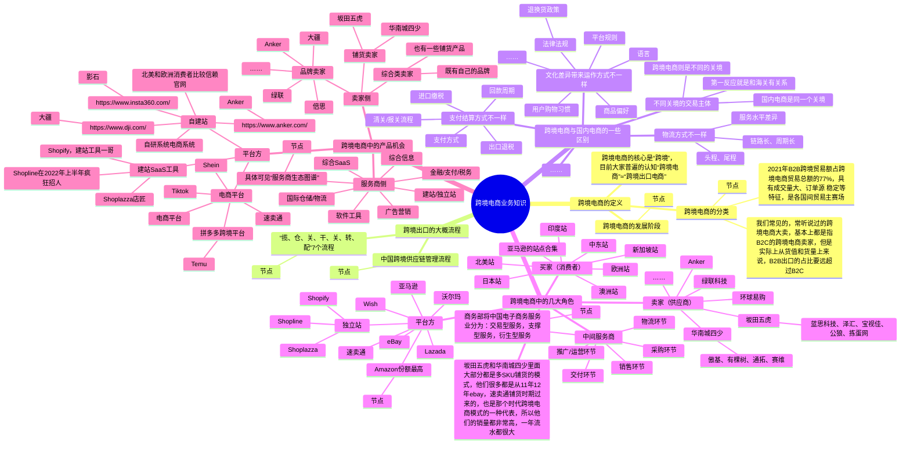
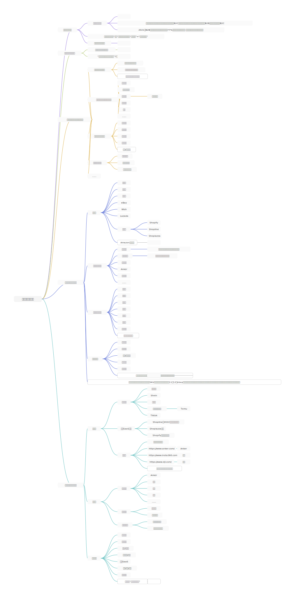
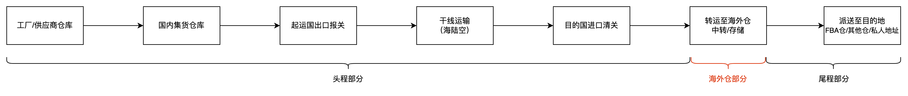
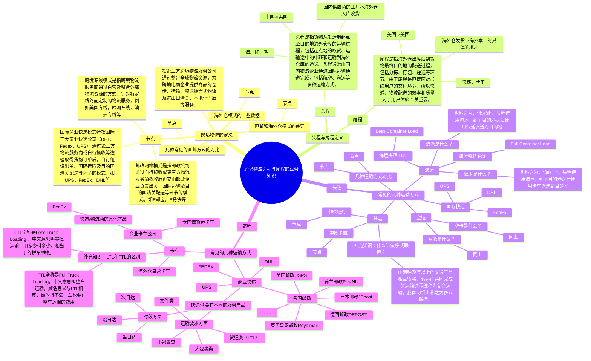
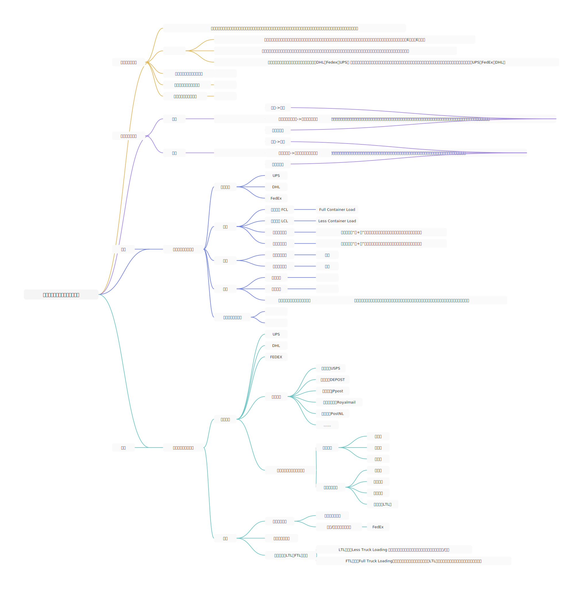
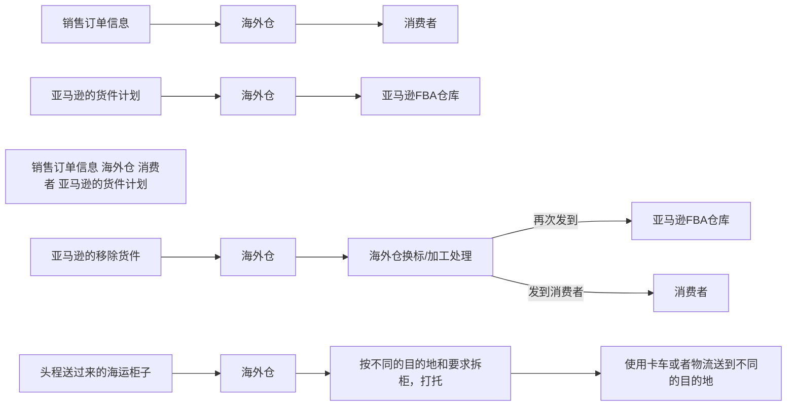
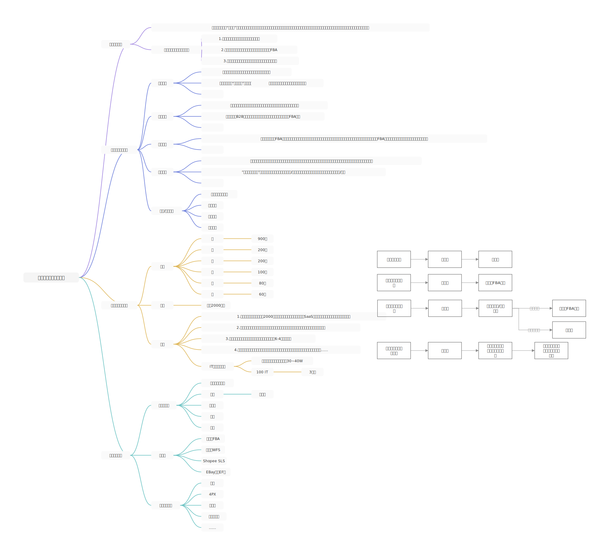
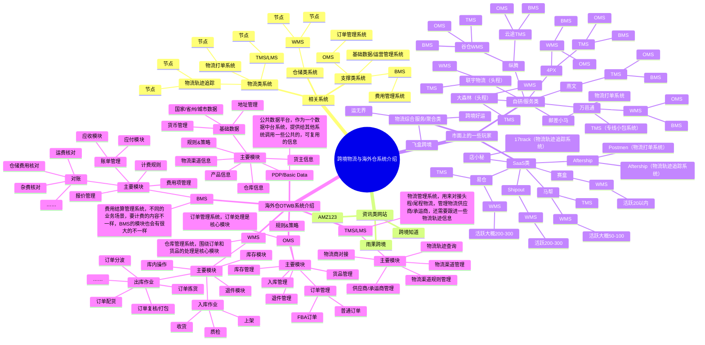
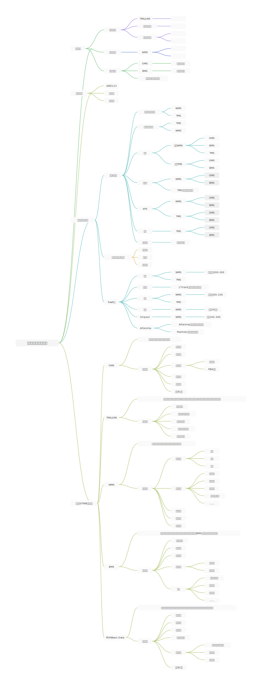

## 前言

如果想要了解海外仓相关的业务知识，那么只关注海外仓自身是不太够的，因为海外仓不是一个独立存在的个体，我们还需要关注它的上游和下游。

从实物流的角度，海外仓的上游应该是国内的供应商仓库或者国内的备货仓，因为货物会通过出口的方式从国内送到海外仓中。而海外仓的下游则是其他官方平台仓（例如FBA仓）或者终端消费者，货物会从海外仓发出到其他仓库中或者直接发到电商消费者手中。

所以，本节就来分享一下跨境电商、跨境物流和海外仓的一些业务知识，让大家可以从一个更全面的视角去了解跨境电商中有哪些角色，哪些常见的业务知识，跨境物流有哪些，海外仓有哪些，以及这些领域中有哪些公司，哪些竞品系统等。

如果是做这一行的朋友则可以查缺补漏，互相交流。如果不是做这一行的朋友，则可以丰富见识，提升一些视野等。虽然这一两年跨境的热度有所下滑，但是作为拉动经济的三驾马车之一（消费，投资和出口），跨境出口业务的重要程度非常之高，最近政府发布了多条激励措施，就是为了继续加大出口的力度，拉动经济的增长。

所以，拉长时间来看，外贸出口（B2B/B2C）未来都算是朝阳行业，哪怕目前是处于一个小谷底，只要能持续地待在牌桌上，未来一定是大有可为的。

## 一、跨境电商的知识

## 二、跨境物流的知识

## 三、跨境海外仓的知识

## 四、跨境物流与海外仓的相关的系统

## 五、补充知识（海外仓的业务知识介绍）

1.  推荐一些跨境物流和跨境仓储类的公众号

> 跨境物流充电派  
> 跨境电商物流百晓生  
> 物流沙龙  
> 跨境电商鹰熊汇

2.  推荐一些相关的学习视频，可以加入到B站收藏夹中，后续再看

[什么是出口跨境电商?_哔哩哔哩_bilibili](https://www.bilibili.com/video/BV1xW411j7PZ?spm_id_from=333.337.search-card.all.click&vd_source=610e391e2cf86c2841d101ff237109fa)[跨境电商基础入门-常见行业术语解析（上）_哔哩哔哩_bilibili](https://www.bilibili.com/video/BV1bK4y1X7F4/?spm_id_from=333.788.recommend_more_video.1&vd_source=610e391e2cf86c2841d101ff237109fa)[跨境电商常见行业术语解析（下）_哔哩哔哩_bilibili](https://www.bilibili.com/video/BV1oq4y157n4/?spm_id_from=333.788.recommend_more_video.-1&vd_source=610e391e2cf86c2841d101ff237109fa)