## 背景

在正式拆解代理海外仓的概念之前，我们需要先来对海外仓领域中常见的一些名词做一些定义和说明，避免产生一些理解上的歧义，同时也能更加高效率的掌握业务知识和产品设计的知识。

| **名词** | **解释** | **案例** |
| --- | --- | --- |
| 海外仓服务商 | 能提供具体的、真实的海外仓服务的公司或组织 | 谷仓、4PX、万邑通、荣昇海外仓等都是海外仓服务商 |
| 海外仓的客户 | 使用了海外仓服务的公司或组织，一般是电商卖家，零售商等 | 某跨境大卖使用了谷仓海外仓的服务，那么该大卖就是海外仓的客户 |
| WMS | 仓储管理系统，一般是海外仓服务商的内部人员使用，例如说仓库端的作业人员，或者是一些运营管理人员 | 可分成自研的WMS或SaaS WMS |
| OMS | WMS的客户端，一般是提供海外仓的客户使用 | 海外仓服务商可以为每个客户开通一个专属的OMS账号 |
| 海外仓代理商 | 与某个海外仓达成代理合作协议，可以独立对外承接客户，然后将客户的货物存放在海外仓服务商中 | 一个海外仓可以有多个直客，也可以有多个代理商，甚至是多级代理商 |
| 代理商的客户 | 海外仓代理商发掘的客户，一般也是电商卖家、零售商等，它们与代理商签订合作的协议 | 某个小电商卖家与一个海外仓代理商合作，谈到了一个不错的服务价格 |
| D-WMS | 代理商的仓储管理系统，一般是代理商的内部人员使用，例如说仓库端的作业人员，或者是一些运营管理人员 | D-WMS和WMS不一定是同一套系统，可以是不一样的WMS |
| D-OMS | 代理商的D-WMS的客户端，一般是提供给代理商的客户使用 | D-OMS一般会和D-WMS成对出现，作为D-WMS的客户端 |

> 维他海外仓（维他命供应链有限公司）是一家专注于服务美国地区业务的海外仓，目前有直客3个，分别是小米科技，OPPO手机，绿联科技。维他海外仓的员工们使用的是自研的WMS，而提供给直客（小米、OPPO、绿联）们使用的是配套的OMS，每个客户会有一个专属的OMS账号。

随着业务的发展，仓库的壮大等，这几个直客能提供的业务单量不太够，所以维他海外仓就想要拓展更多的客户。但是苦于市场拓展难，客户商机少。于是维他海外仓打算开始发展代理业务，和与一些代理商进行合作，让代理商去外部市场挖掘客户，拓展客户资源，最后所有的仓库服务都是由自己来处理。

代理商对外宣传自己在美国有若干个很专业，服务很不错的仓库，可以提供丰富的仓储服务，也有自研系统，可以轻松对接外部的ERP、电商平台等，但是实际上代理商可能自己并没有仓库，自己可能对仓库管理也并不懂行，因为提供真实的仓储服务的是其背后的海外仓。

当代理商与客户完成了签约、合作之后，客户可以将货物存放在维他海外仓中，但是实际上下单给指令，还是先给到代理商。代理商这边可以通过系统的对接打通，将代理商客户的订单推送到背后的维他海外仓中。代理商的客户是不会直接和维他海外仓接触的，避免客户跑单，可以保障代理商的利益。

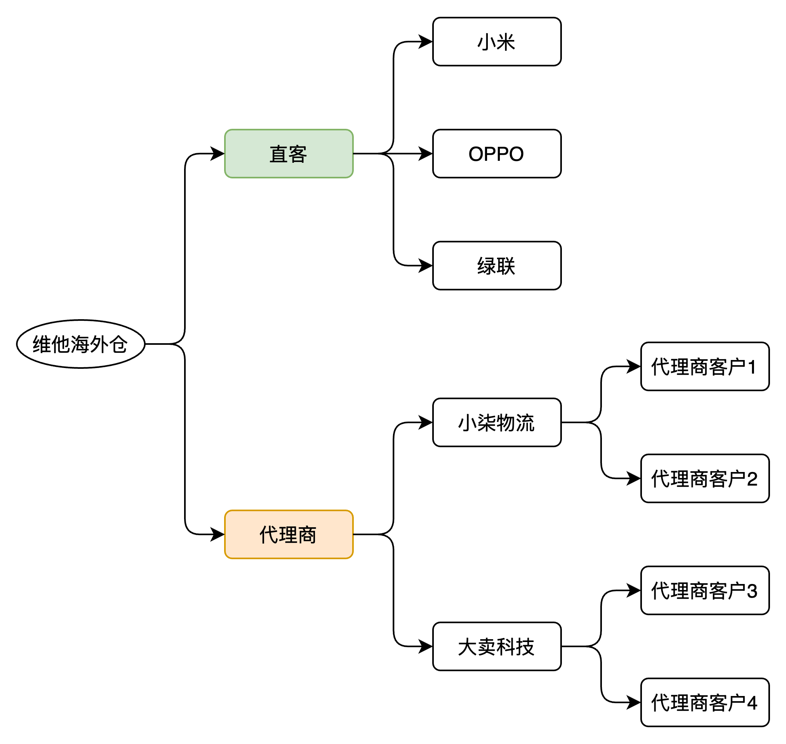

## 什么是代理海外仓？

完成了上面的背景铺垫之后，我们可以对代理海外仓来做一个定义：

> 代理海外仓，也称之为“代理仓”，本质上是一个虚拟的仓库，真正提供仓储服务的是代理商背后的海外仓服务商。代理商可能是货代公司、海外仓服务商、物流公司等，它们与海外仓服务商达成合作协议，可以自行对外承接客户，然后委托真实的海外仓服务商为其客户提供仓储服务，再进行相关费用的结算。

从上面的案例中可以知道，代理海外仓听起来有点“空手套白狼”的味道，而且听起来好像不是很靠谱，那么市场上是谁在代理海外仓，又是哪类电商卖家会和代理商进行合作呢？

### 海外仓服务商拓展自身业务

“小柒物流有限公司”是一个海外仓服务商，自己在美东和美中地区各有一个海外仓。最近小柒接了一个大客户，该客户很满意小柒物流的海外仓服务，也有意向和小柒长期合作，但是该客户的业务遍布全美国，也就是除了美东和美中地区外，还有很多订单是在美西的。客户表示如果美西的订单要从美中的海外仓去发货，那么自己的物流成本就很高，但是如果自己在美西单独去找一个海外仓服务商，那么就意味着自己要用两套系统，又要花费时间和新的海外仓服务商进行磨合。

所以该客户希望小柒可以在美西也去开一个仓库，这样就可以继续和小柒合作，之前沉淀的合作经验都可以直接迁移过来，同时也可以节省客户自己的物流成本，提升用户体验。

但是小柒这边因为公司的资金有限，而且一时半会要开一个新仓库肯定是需要提前筹备很多东西，所以小柒决定先采用短平快的方式来解决。他找到了“维他海外仓”，希望能成为“维他海外仓”的代理商，达成合作之后就会将客户的美西订单转交给“维他海外仓”来处理，而客户还是用自己的那一套系统和报价体系等，对客户来说没什么明显的感知。

在这个案例中，“小柒物流有限公司”本身也是海外仓服务商，但是由于自己的业务范围有限，贸然去拓展其他地区的业务成本和风险都太高。所以选择“代理仓”的方式，先和一些成熟的海外仓达成代理合作的协议，既能满足客户的业务需求，又能底成本地拓展自己业务，属于是一举两得的好方案。

### 货代公司增加营收的一种业务

货代公司，全称为货运代理公司（Freight Forwarding Company），是指接受进出口货物收货人、发货人或承运人的委托，以委托人的名义或者以自己的名义，为委托人办理国际货物运输及相关业务，并收取服务报酬的法人企业。

市场上有诸多的货代公司，竞争非常的激烈，而且大多数的货代公司其实都是轻资产运营的模式，所以一般不会自己在海外投资建仓、租赁仓库等。但是货代的业务场景中，往往又少不了海外仓的货物仓储、拆柜转运、库内加工等服务，所以货代公司一般都会提前和海外仓进行合作。

这里的合作方式，可能是货代成为海外仓的一个客户，让海外仓为其提供具体的仓储服务；还有另外一种模式，就是**货代成为海外仓的一个代理商**，然后货代将自己客户的货物委托给背后的海外仓，这样货代就可以确保自己全程对接客户，既能提供更好的体验，同时也能获取更高的一些利润差价。

### 想要通过海外仓分一杯羹的其他人员

任何赚钱的业务，都会有人想要加入其中，如果不能吃肉，那么可以选择喝汤，而做代理海外仓也是一种“喝汤的方式”。

所以也会有一些小公司把自己包装成一个海外仓服务商，然后通过一些市场推广、运营等方式吸引客户。他们对外宣称自己的有很多的仓储资源，可以提供很多的仓储服务，但是实际上他们只是一个小代理商，具体能提供什么水平的仓储服务，还是要看背后的海外仓服务商的实力。

## 代理海外仓的产品设计

### 代理海外仓的业务流程

了解了代理海外仓的定义和背景之后，我们先来看看代理海外仓会有哪些业务场景和业务流程，了解了这部分之后，才能知道后续的产品功能要怎么设计。

在代理海外仓的业务场景中，会存在“海外仓服务商”，“海外仓代理”，“代理的客户”这三个主要的角色，而相关的业务流程和海外仓常见的业务流程是一样的，不过就是流转的关系更复杂了一些而已。

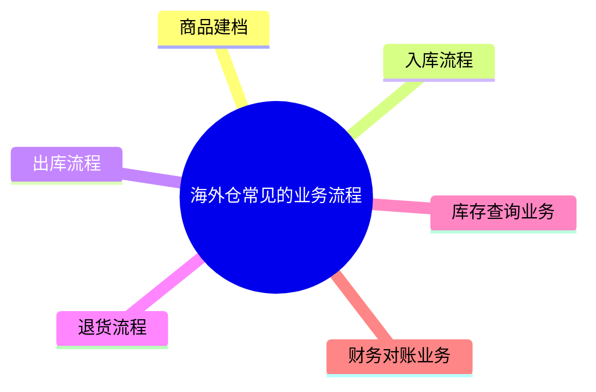

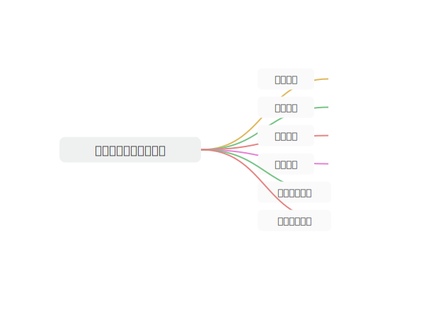

在商品建档的业务场景中，谁是货主，谁有商品的相关信息，那么就由谁来建档。在代理海外仓的业务场景中，货物是电商卖家的，也就是代理的客户，那么就由它来完成商品的建档。一般是会在代理的D-05-OMS系统中建档，然后商品信息会推送到海外仓服务商的WMS中。

在入库流程中，创建入库单的也是代理的客户，然后再将D-OMS中的入库单推送到海外仓服务商的WMS中。货物送到了海外仓之后，仓库完成了收货、上架之后，会将收货和上架的数据回传给到D-OMS中。

在出库流程中，创建出库单的也是代理的客户，然后再将D-OMS中的出库单推送到海外仓服务的WMS中。海外仓根据订单去分波、拣货、复核称重、出库等，最后再将出库的数据回传给到D-OMS中。

剩下的退货、库存查询业务也是类似的，在D-OMS中操作，背后链接的都是真实的海外仓的WMS。

而财务对账这一块则有一些不太一样，因为客户是和代理签约的，客户拿到的报价单也是代理商提供的，那么客户只需要和代理商对账即可。至于代理商怎么和海外仓对账，海外仓是怎么和代理商报价的，这些就不需要客户来关注了。

### 产品功能的设计

如果要完整地讲解代理海外仓的产品设计，那么一篇文章可能是不够呈现的，本文也不打算完整地去拆解这些详细的功能设计，所以我们重点来拆解一下其“底层业务逻辑”即可。掌握了这个底层的原理之后，再去设计相关的产品功能时，就八九不离十了。

#### 把D-WMS当作一个“小型ERP”系统

当我们把D-WMS当作一个“小型ERP”系统之后，我们需要用跨境电商ERP的思维去看待这个系统。

它需要对接外部的电商平台或者ERP，然后去拉取电商平台的订单。同时也需要去对接外部的三方仓WMS，这样可以将入库单、出库单等数据推送给下游的WMS中。

代理商和海外仓完成了代理协议的签订之后，海外仓会开通一个OMS的账号给代理商，同时海外仓也会和对待“直客”一样，给代理商维护相关的费用报价，物流产品等。此时代理商可以登录OMS中，查看自己的基础信息，签约的服务产品，费用报价，账户余额等。

代理商找到了若干个客户之后，代理商也需要给它的客户开通账号，维护报价，维护物流产品等，这个时候代理商就需要有一套相关的系统来支撑，例如说易仓的“DWMS”，还有领星的WMS都有类似的功能。

| 列 1 | 列 2 |
| --- | --- |
| 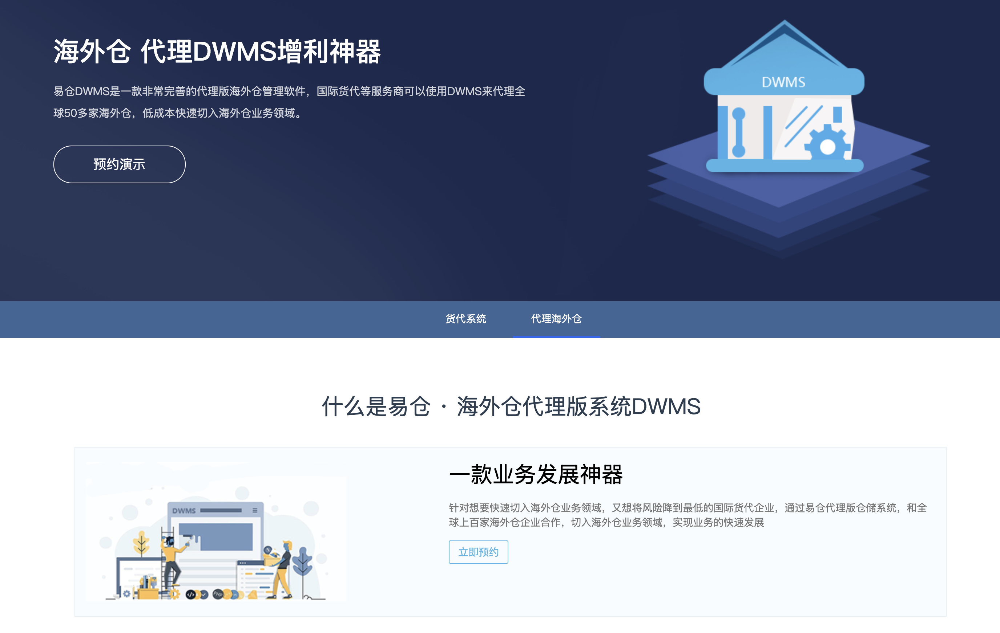 | 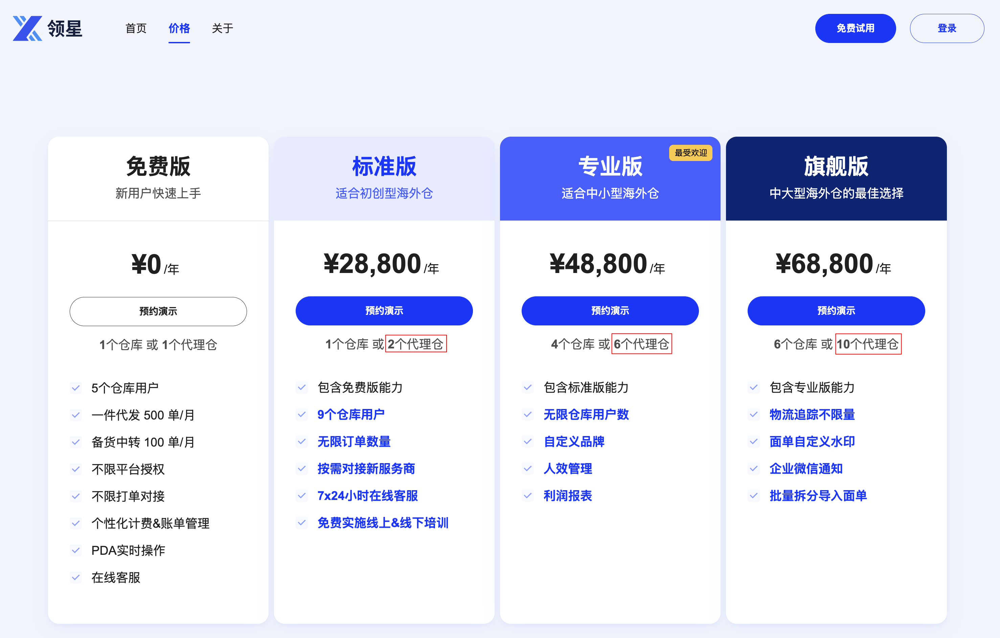 |

当代理商找到了一套DWMS之后，接下来就是要将DWMS和背后的海外仓WMS对接，这个对接可以等价于“ERP和三方海外仓的对接”。因为DWMS可以和若干个海外仓WMS对接，所以当DWMS完成了对接之后，需要在“小型ERP”（DWMS）中完成和三方仓的授权，一般是填写App key和Secret等，这操作流程和跨境ERP对接三方海外仓是一样的。

| 列 1 | 列 2 |
| --- | --- |
| 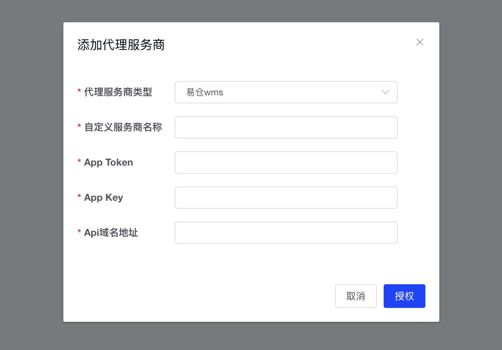 | 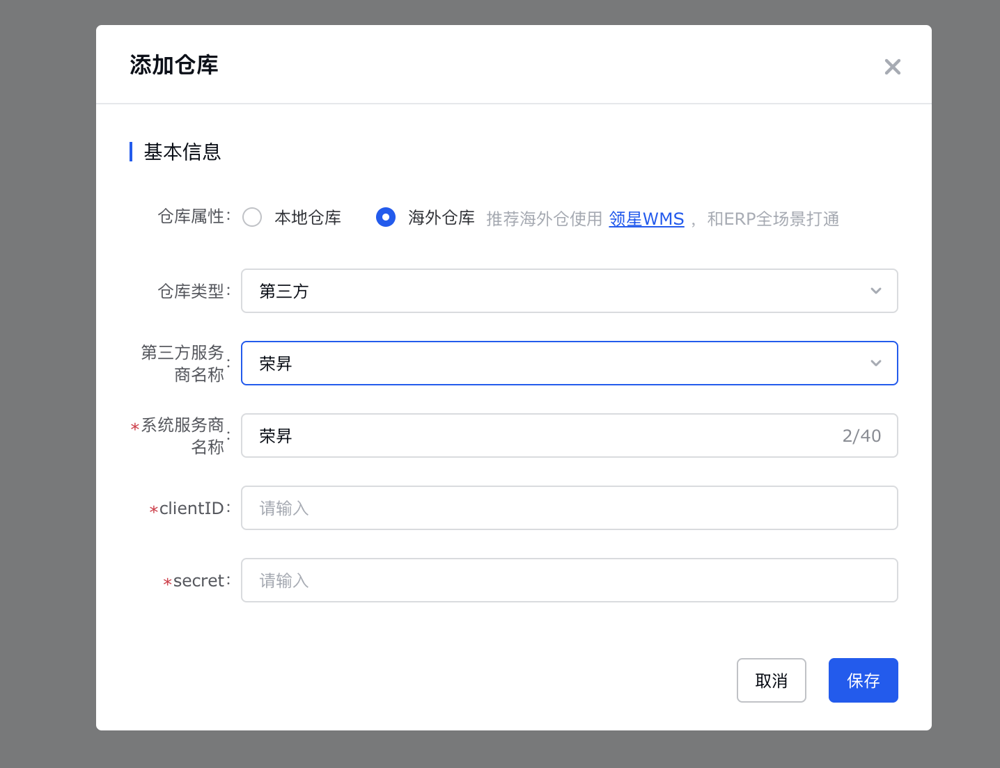 |

当我们把D-WMS当作一个“小型ERP”之后，也就意味着代理商其实是不需要使用WMS的入库、出库功能的，因为代理商都是依赖外部的三方仓来发货，所以实际上代理商提供给它的客户用的是“D-OMS”，具体的业务流程图如下所示。

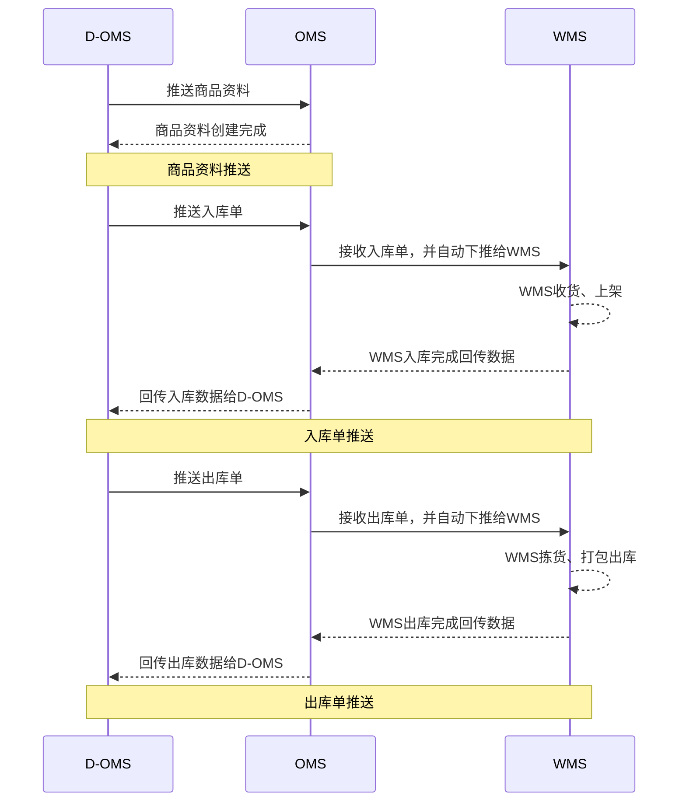

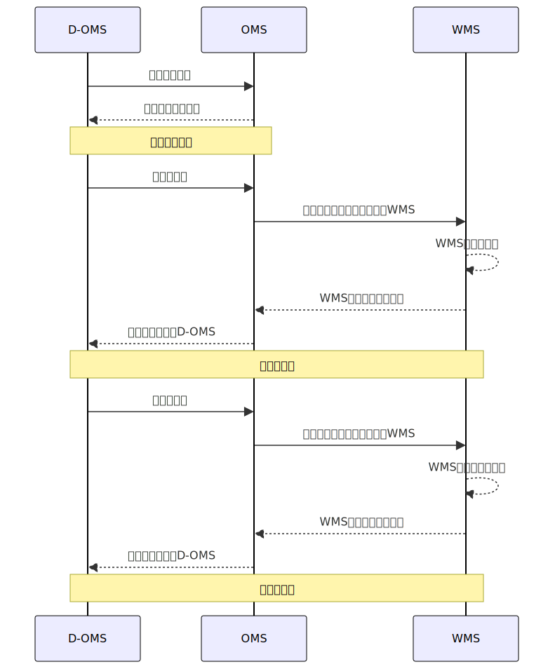

#### 把被代理商的仓当作一个特殊的仓库

上面提到过一个“小柒物流有限公司”的案例，它自己本身就是一个海外仓服务商，所以他自身就有一套WMS和OMS。WMS是自己的美东和美中仓库的管理人员、库内操作人员使用的，而OMS则是提供给自己的客户使用的。

当小柒和维他海外仓完成了代理协议的签订之后，意味着小柒成为了维他海外仓的代理商，那么小柒就可以在自己的03-WMS系统中新增一个特殊的“美西仓库”，这个仓库背后映射的是维他海外仓的美西仓。

要完成这个映射动作，就需要小柒先和维他海外仓完成接口对接，由维他海外仓提供OpenAPI，然后小柒的OMS来对接这个仓库。一切的对接动作都完成了之后，小柒的客户可以按正常的业务流程去创建商品，去创建入库单、创建出库等，小柒OMS会通过客户选择的仓库编码来确定，这个仓库是指向自己的WMS，还是维他海外仓的OMS。

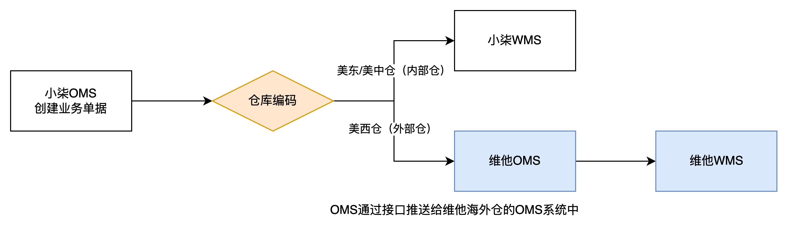

在这种业务场景中，小柒的OMS需要做一些分支判断，来决定业务单据是推送到自己的WMS，还是通过接口推送到外部的维他海外仓中。如果小柒后续还拓展了其他的代理仓，例如说加拿大仓，墨西哥仓等，都可以通过类似的逻辑推送到其他三方仓的系统中。

因为每家海外仓系统的产品设计逻辑不太一样，市面上也有很多海外仓是用WMS去对接其他的海外仓系统，所以业务流程就会变成这个样子。

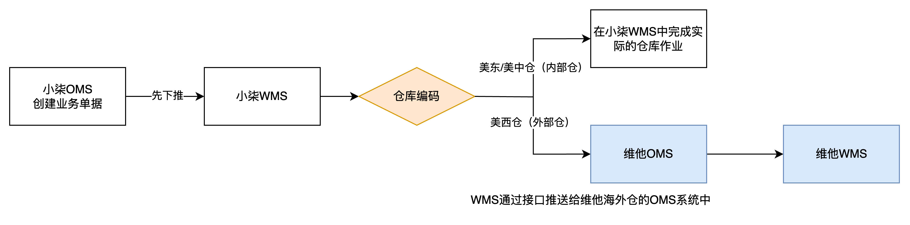

## 总结

经过上面的拆解之后，我们会发现其实代理海外仓的底层业务逻辑非常简单，就是中间多了一层转换关系而已，本质上还是“A对接B”、“A对接C”的玩法。

代理商需要使用海外仓的服务，成为海外仓的客户即可。但是代理商自身不使用海外仓的服务，而是让代理商的客户来使用海外仓的服务，于是代理商就变成了中间那一层转换的角色和环节。

要完成“海外仓”，“代理商”，“代理商客户”这三者的业务流转和数据流转，其中系统的对接打通是必不可少的环节。所以市面上会有一些SaaS WMS产品针对这种场景推出“DWMS”版本，就是因为这个业务的玩法是一定要依赖系统的，具有非常强的关联性。

当然，经过了一顿的业务拆解和产品方案的拆解之后，我们会发现海外仓行业确实是存在蛮多“生造名词”，“生造概念”的情况，对于很多初次接触这个领域的朋友很容易被这些定义给搞晕了。

在写这一篇文章的时候，我改了很多次里面的名词定义，同时也缩减了很多产品设计方面的内容。生怕讲得太绕、太复杂把各位读者朋友们搞懵了，如果有一些遗漏或者错误之处，还望各位读者朋友批评斧正。