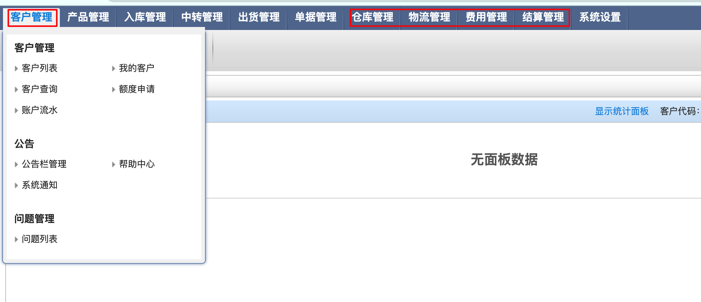
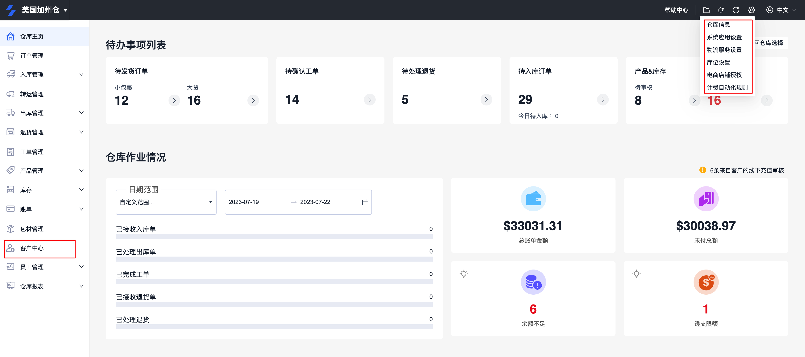
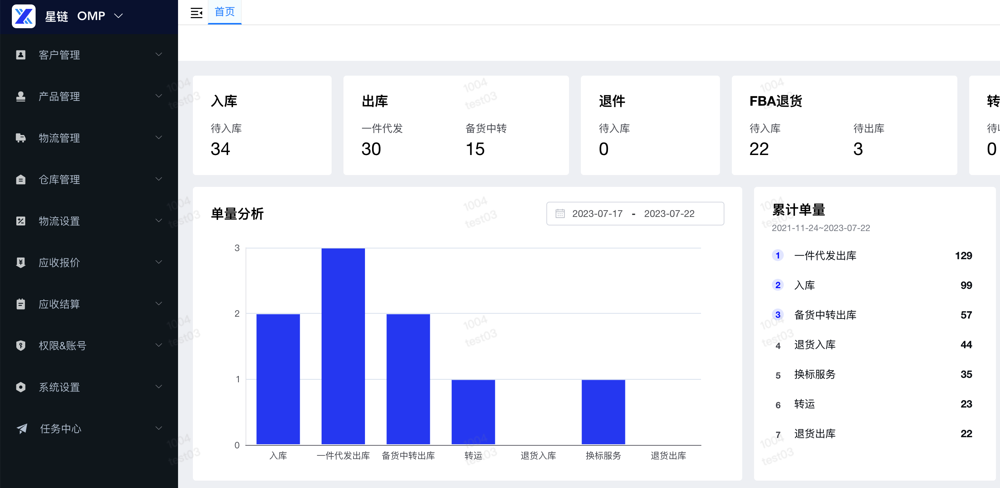
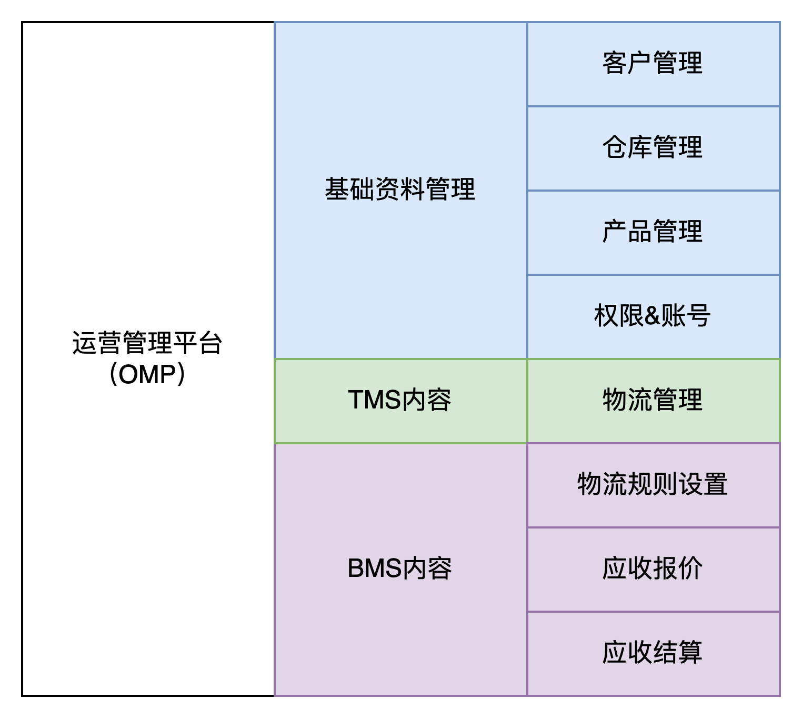
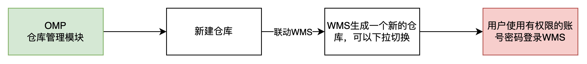
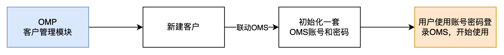
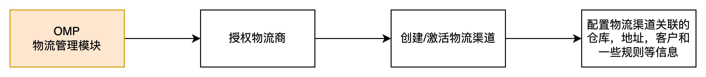
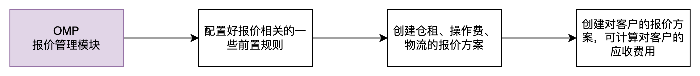
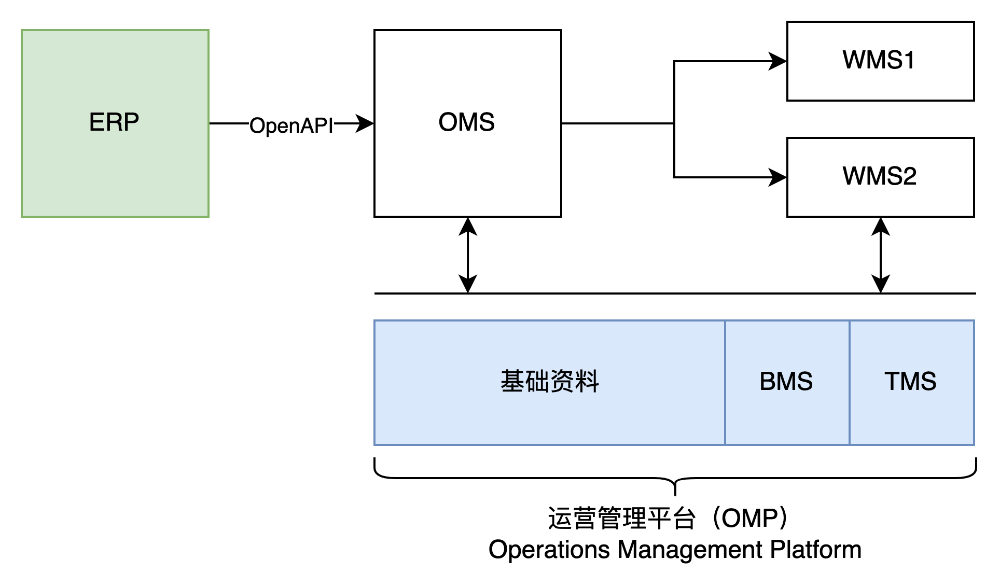
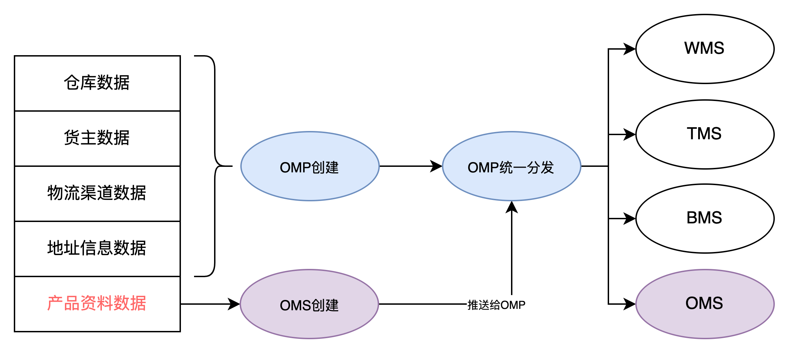

**什么是OMP？**  
OMP（Operation Management Platform）叫作运营管理平台，是一种通用型的管理系统，不是具体指某个领域专有的系统，例如很多公司的内部运营管理系统都会称之为OMP。  
对于SaaS化的WMS来说，软件服务商需要给租户（海外仓服务商）提供一套SaaS的WMS，海外仓服务商使用这一套WMS的系统既要满足自己的仓储业务管理，也要满足自己客户（电商卖家）的使用，所以就有了WMS和OMS的区别，WMS是海外仓服务商来使用，而OMS就是客户（电商卖家）使用。  
除此之外，海外仓服务商一般都会有中国的运营团队，他们需要和客户对接，需要远程统筹规划多个仓库的运营情况，需要去接入不同的物流商，也需要有专门的财务人员去梳理应收和应付账单等。  
这些运营类的工作需要有专门的系统或者功能模块去承载，有一些公司会选择将这些功能做在WMS上，纳入为WMS的功能模块，例如说易仓和Shipout都是这样的做法。  
  

易仓WMS

  
  

Shipout WMS

  
除了将这些运营工作放在03-WMS系统中之外，也可以将这些运营工作单独抽出来，放在一个单独的系统中，例如OMP，之前我们做的SaaS WMS就是采用的这种方式，单独抽出一个系统来做这些运营类的工作。  
  

星链OMP

  
**OMP的作用是什么？**  
OMP是一个综合类的后台管理系统，使用它的用户是**SaaS的租户，**也就是海外仓服务商。当某个海外仓服务商购买了SaaS WMS的系统服务之后，只需要给它开通一个OMP的主账号即可，用户可以在OMP上去完成不同内容的初始化操作。  
OMP的功能模块大致可以分成三大类，分别是：  
1基础资料管理，对一些基础资料进行集中化的管理和分发，例如客户，仓库，产品等，还有一些是基础功能的管理，例如账号和角色管理等；  
2TMS（物流）的管理，对物流相关的内容管理，例如物流商的授权，物流渠道的创建，物流规则的一些配置等；  
3BMS（报价&计费）的管理，对报价和费用结算方面的内容管理，例如配置仓租、运费、操作费的报价，创建对客户的报价方案，还有根据实际的业务数据计算费用结果，输出相关财务账单等；  
这里将TMS和BMS的内容作为功能模块一起放在了OMP中，是因为如果按OTWB的系统架构设计方式，会让用户要使用多个系统，无形中就提升了认知和使用的门槛，所以整合在一个模块中会更加简洁高效一些，同时也能用户快速上手，集中化管理一些业务数据。  
  

  
**1****初始化仓库**  
海外仓服务商会经营多个仓库，所以当拿到了OMP的主账号之后，第一步要做的就是先维护好自己的仓库信息，所以就需要先在OMP上去创建相关的仓库。 仓库创建的同时，系统会将这些仓库代码等信息提交给WMS，后续登录WMS之后就可以在右上角下拉切换选中新创建好的仓库。  
  

  
**2****初始化客户**  
海外仓服务商除了会有多个仓库之外，也会有多个客户，这里的客户是指使用海外仓仓储服务的客户，一般就是跨境电商的卖家。一个仓库会有多个卖家，一个卖家也会使用多个仓库，所以仓库和客户之间的关系是多对多的关系。创建客户的时候，也会将客户的一些系统推送给OMS，初始化一套专属于该客户的账号和密码等，然后客户就可以拿到这些信息登录OMS中去使用。  
  

  
在创建客户的时候，也可以同时配置该客户可以使用的仓库信息，因为客户需要关联仓库才可以使用，所以第一步需要做的是初始化仓库，然后第二步就是初始化客户。  
**3****配置物流**  
创建好了仓库和客户之后，客户可以推送入库单给海外仓去收货、上架，但是如果要推送出库单给仓库去拣货，打包发货等，那么就还需要在OMP中先配置好物流的信息。  
首先，海外仓能提供什么物流方式，其次，这些物流方式是哪些客户可以使用。所以第一步就是在OMP中授权物流商，输入自己的物流账号和密码等，这一步的前提是这些SaaS服务公司提前完成好了API的对接。授权了物流商之后就是创建或者激活物流服务，创建（映射）为本地的一个物流渠道，然后对物流渠道进行一些关联性数据的配置，例如物流渠道是在什么仓库下使用，给什么客户使用，发货地址是什么，有什么渠道规则要维护的等，这些具体细节可以看“第五章：TMS业务介绍&产品设计方案”，里面有详细的介绍。  
  

  
**4****配置报价**  
完成了仓库，客户，物流等基础信息的维护之后，接下来就是要配置报价相关的内容了。如果海外仓并不打算使用系统对它的用户（电商卖家）计算费用，例如说是合作共建仓库的模式或者是内部自用的模式，那么就可以省略这个部分。如果是需要对外经营服务的，那么就需要在这个环节去配置对应的价格，然后后续系统才能自动完成相关费用的计算。这一块的内容可以看“第六章：BMS业务介绍&产品设计方案”，在此就不过多介绍了。  
  

  
  
**OMP与其他系统的协作**  
对于“海外仓OTWBP”的架构模式来说，OMP中包含了基础资料、BMS和TMS相关的内容，所以OMP和其他系统的协作、交互模式也可以从下图中体现。  
  

  
**1****基础数据的分发**  
OMP中包含了多个基础数据，这些基础数据可能在OMS、WMS、TMS、BMS中都需要使用，所以OMP可以通过相关的接口去分发这些业务数据，同时也可以从多个系统中去拉取业务数据，然后在OMP中形成报表统计结果。  
  

OMP的数据分发作用

  
**2仓库的初始化**  
OMP创建仓库之后，海外仓服务商登录WMS的时候就可以切换选中新创建的仓库，所以OMP需要和WMS有相关的数据交互。  
**3客户的初始化**  
前面提到过，OMP创建客户的时候，同时也会初始化一套OMS的账号和密码，所以OMP需要和OMS有相关的接口交互来支撑客户初始化的业务场景。