**关于PDA的定义**  
聊到仓库端所使用的PDA，很多人第一印象就是一个安卓APP安装在了一个特殊的设备（手持终端）中。所以会想当然的认为PDA间接性就等于安卓APP，这个理解**在大多数场景下是可以算对的，但是肯定是不严谨的。**  
  

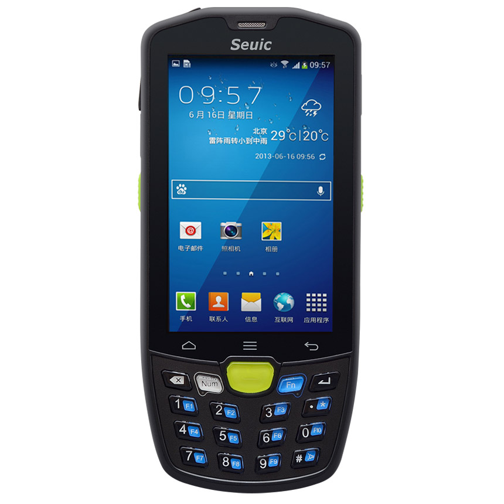

  
图源：东大集成官网  
  
因为除了安卓系统之外，WinCE和iOS都算是一种移动端的操作系统，这些操作系统可以安装在手持终端设备中，而且这些操作系统中也会有对应的APP，这些APP都可以和WMS进行联动，用来支撑仓库中的收货，上架，拣货，移位，查询等业务需求。  
  

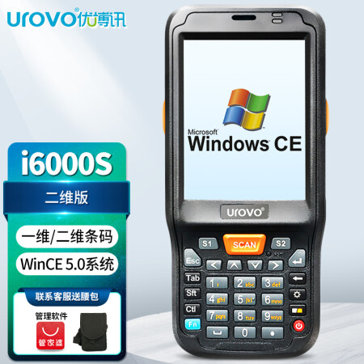

  
图源：京东  
所以，关于PDA的定义更严谨一些的说法应是：  
PDA（Personal Digital Assistant），又称为掌上电脑，可以帮助我们完成在移动中工作，学习，娱乐等。按使用来分类，分为消费级PDA和工业级PDA。消费级PDA包括的比较多，智能手机、平板电脑、手持的游戏机等都属于消费级PDA；工业级PDA主要应用在工业领域，常见的条码扫描器、RFID读写器、POS机等都可以称作工业级PDA。  
官方定义比较发散，不是很好理解，如果只是针对仓库中作业所使用的手持终端设备（PDA），我们可以简单地定义为：**带有操作系统的智能化的手持终端都可以称之为PDA。**  
**PDA的操作系统**  
早期的时候，WinCE应该是工业级PDA的主流操作系统，在之前公司我们就用了好几年的WinCE。画风比较简陋，交互动作也比较落后，而且屏幕还是电阻屏（现在主流的手机都是电容屏），尺寸也很小（3.2或者3.5英寸的居多），能展示的内容比较少。  
  

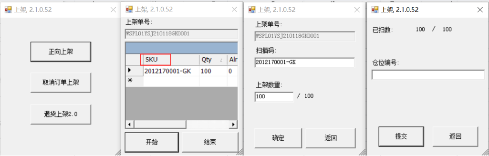

WinCE的PDA交互示意图

  
后来，随着安卓系统的普及和厂家的推广，越来越多的公司开始选择使用安卓版的PDA，相应的一些APP的产品设计也会遵循安卓的风格，给使用者带来了更好的操作体验。安卓系统有更佳的交互体验，维护成本低，电容屏，更大的屏幕，开发速度快，技术生态也比较新等，总体来说与WinCE相比，优势非常明显，所以WinCE也逐步被淘汰了。  
  

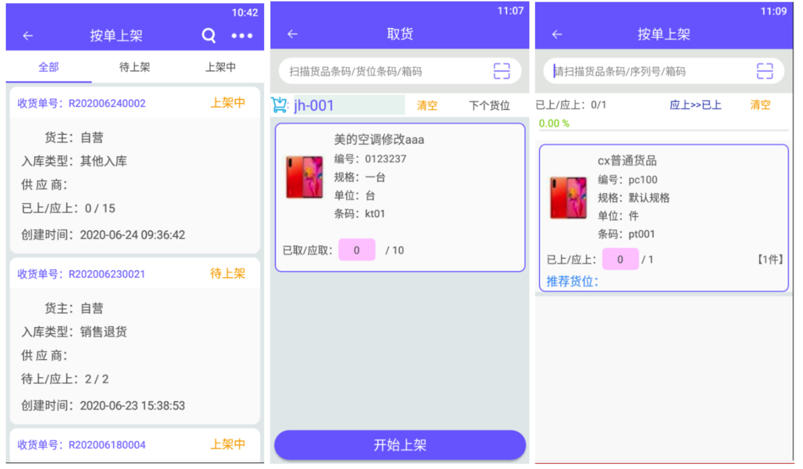

  
除了WinCE和安卓之外，还有少量的公司也会采用iOS系统的PDA，基本上就是内置一个iPhone或者iTouch设备，例如Apple Store的员工们用的就是iOS的PDA，由于这一块市面上的资料比较少，这里就暂时不多介绍了，本质上和我们使用的iPhone手机是一样的原理。  
**安卓PDA的技术选型**  
当确定了要使用安卓操作系统的PDA之后，团队接下来马上就会面临一个小难题，那就是：**技术选型选哪个？**  
对于一个安卓APP来说，目前主流的开发方式有三类，分别是：  
1原生APP（Native）  
2Web APP（HTML5）  
3混合APP（Hybrid，即“Native+H5”）  
  

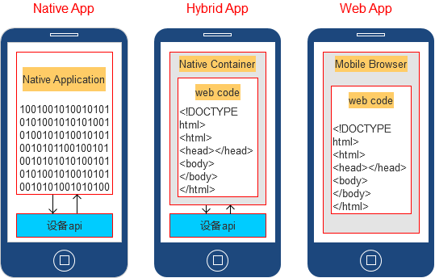

  
图源网络  
关于这三类开发方式的原理和优劣势，我只能算半吊子水，就不做过多的讲解了。我重点从用户的使用场景和研发的一些考虑点来分析一下，我们当时做技术选型的时候，是怎么考虑的，也和有相似经历的朋友们交流学习一下。  
**1\. 服务端和客户端的版本对应**  
PDA本质上是一个客户端，需要和服务端进行数据交互和通信。如果是海外仓，因为服务端可能部署在不同的国家或地区，这样会导致服务端的版本可能会有差异，从而也导致了客户端的版本有差异。  
例如，今天WMS（服务端）发布了一个V1.2版本，发布到美国的服务器上，刚好这个版本有对应的PDA功能改版更新，那么就会要求美国的仓库将PDA升级到最新版，与V1.2版本进行适配；而欧洲因为一些业务的原因，并没有直接升级发布，所以它们还是用的V1.1版本，那么PDA自然就不能升级为最新的了。  
在设计PDA的APP版本更新检测功能的时候，需要考虑这种版本对应的需求，避免出现阻塞生产的现象。  
**2\. PDA演示的频率如何？**  
之前在做内部WMS的时候，我们是给自己的仓库做PDA软件，所以不太需要考虑给客户演示的问题，因为演示的频率很低。  
但是到了做SaaS WMS的时候，因为我们是做的SaaS化的产品，所以必须要和很多客户演示交流系统怎么使用，这里就包含了PDA的使用。  
这个时候如果可以直接用网页打开PDA的功能界面（H5 APP），在演示的时候是会比较流畅的，而且将测试账号发给客户之后，客户也可以直接用网页体验PDA的功能，而不用自己再找一个安卓PDA或者安卓手机去安装一个APP，对客户试用体验来说是比较方便的。

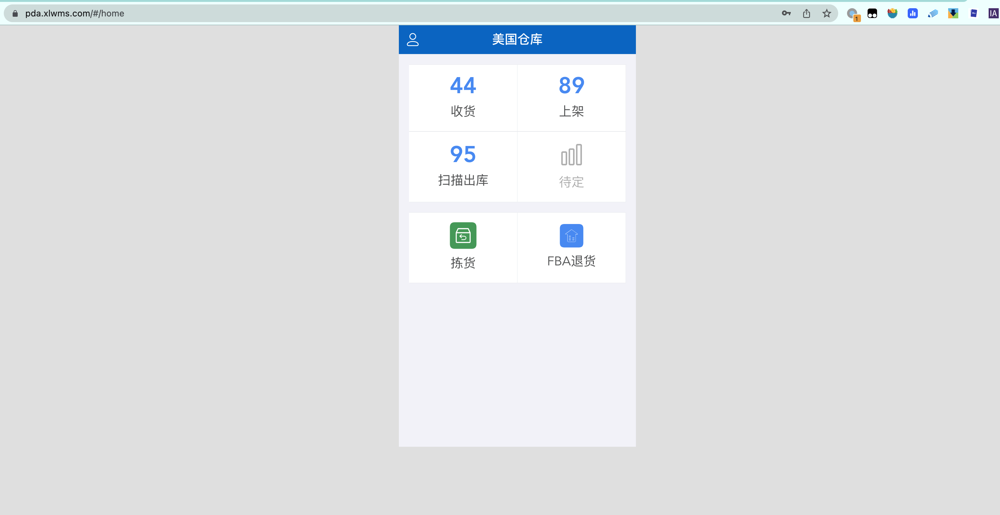

H5版本的APP页面

  
但是这样做的成本也比较高，需要研发一套H5的APP，后面又要研发一套原生的APP。  
**所以我的建议是，大家结合自己的演示频率以及客户的接受方式来综合考量**。如果有研发资源，那么就做两套，一个演示，一个真实使用；如果没有太多资源，那就直接研发原生的APP，到时候演示用虚拟机，客户体验也用虚拟机或者找个安卓设备安装APP。  
**3\. 版本升级是否频繁？**  
PDA的版本升级和多版本的兼容性也是一个不容小觑的问题，最好是尽早完成在线更新的功能，支持用户手动更新版本和系统强制升级版本的功能。  
之前在做内部WMS的时候，由于技术架构设计的问题，迟迟没有做PDA的在线升级，每次都要让仓库的人员手动去下载安装包，然后覆盖安装等，很容易出现操作遗漏或者更新失败的问题，而且仓库在海外，远程运维和指导的成本非常高。  
所以，在技术选型的时候，也要考虑这个APP的更新频率和版本兼容的问题，什么版本是必须要强制升级的？什么版本是可以稍后升级的？然后在什么环节检测升级等都需要考虑清楚。**一切以节省仓库作业时间和成本为导向。**  
**4\. 仓库的硬件是否统一？可控？**  
如果是自家的仓库，那么一般来说PDA设备都是统一采购的，型号基本上是固定的几款，APP的兼容性也比较好做，开发就不需要在安卓版本和硬件兼容性上花太多的时间。  
但是如果是做SaaS WMS，而且还让客户自行采购安卓PDA设备的话，一般很容易踩了兼容性的坑，因为市面上稀奇古怪的设备太多了。  
建议提前和客户沟通，告知硬件的基础要求，例如安卓9.0以上，屏幕4.0以上，4核以上，4G内存以上等。  
最后，我做了一个表来简单总结一下，安卓PDA的几种开发方式的优劣势，至于怎么选？请大家自行判断。  
  

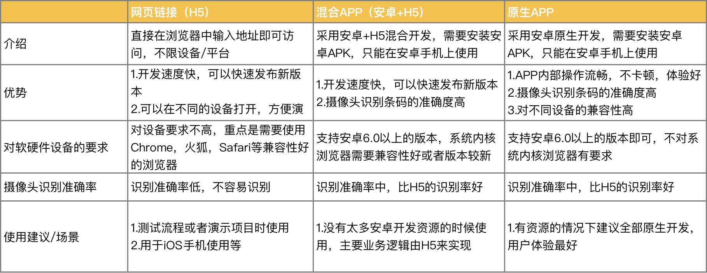

不同技术方案的对比

  
**PDA产品设计中的难点与踩坑点**  
对于B端产品经理来说，做习惯了Web端的产品设计，突然去接手APP的设计，还是有一定难度的。一方面是不熟悉APP的一些规范，另一方面是PDA可参考的资料不是很多。  
我总结了几个当时出设计方案的时候感觉比较难或者踩了坑的点，分享给大家。  
**1.竞品难找**  
当时因为没有做过APP设计，同时也没有UI，导致设计出来的界面惨不忍睹，于是去是找了很多竞品和相关的资料，最后发现“竞品的PDA也做得很丑”……  
于是只能自己硬着头皮学了一些基础的概念和知识，例如设计稿用375还是用750，状态栏应该用多少像素？导航栏应该用多少像素？设计稿的字体对应的设备的字体是多少？  
最后实在没有办法，就只能对着友商的APP截图，一个一个标注，然后进行学习了。  
  

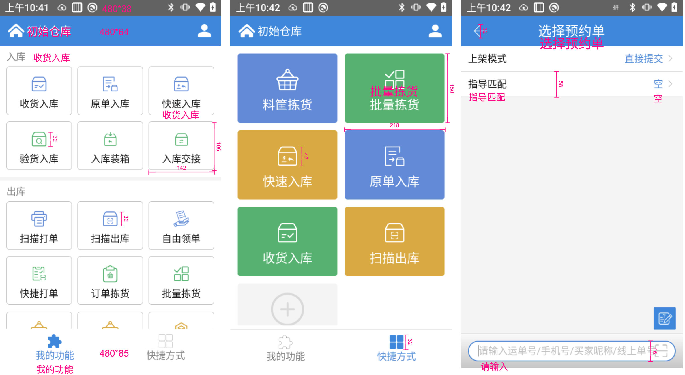

万里牛的PDA

  
这个时候可能会朋友跳出来说，哎呀，你是产品经理，你应该专注在业务和更有价值的方面，你学那么多UI的东西干嘛？  
我只能说：**有这个观点的朋友都是“没吃过苦的”，也是没有在小公司待过的**。他的内心已经默认了所有的资源都是配套的，产品经理只要拧自己的螺丝就够了……但是实际上很多小型公司或者研发团队没有配置专门的UI团队是很常见的事情，所以这些活就只能产品经理自己去干了。  
**2.布局与组件的纠结**  
再回到上面的话题，当我学习了一些基础规范之后，我发现大体上的布局已经没啥问题了，主要就是一些组件和样式方面还是有疑问。  
例如，输入框/扫描框到底是固定放在底部，还是跟普通的输入组件一样放在字段的后面？  
  

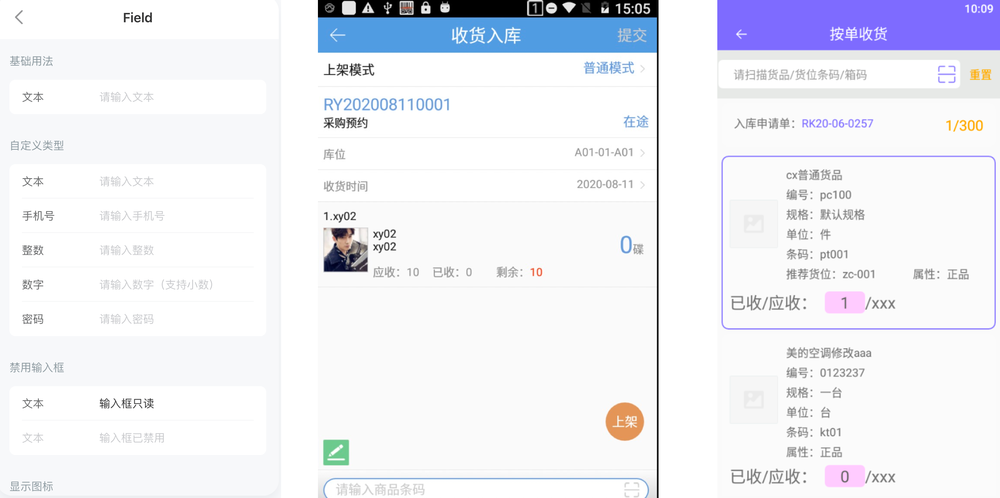

  
三种不同的组件  
例如，提交/确定按钮是放在右上角，还是底部固定？有一些文案类的组件是上下放还是左右放？列表页展示是用卡片还是分隔线，一屏要展示多少？  
总之，以上的种种难题，其实都是因为产品技能不对口导致的，说白了就是资源不够，只能让一个“小朋友去抗大梁”了，于是就边学边做，也自然而然就踩坑了。  
如果放到现在来做这件事，我可能会转头就去淘宝找个UI帮忙来搞，哪怕自己出点钱，也没必要在这个地方花费太多的时间精力，因为一整套流程下来，要学的东西太多了，最终的效果也不一定很好。  
当然，如果是作为初学者，那么我感觉这一段的经历，还是很有价值的，因为帮助自己查缺补漏了，意识到了很多专业知识的不足。  
**3.光标/激活框处理**  
抛开上面的UI问题，光标/激活框是PDA设计中要注意的点，也是体验上最容易感知到的点。  
简单来说，大多数仓库员工在使用PDA的时候，进入了某个页面之后，会直接扫描条码，而不会关注到光标是否在输入框，已经是激活状态。如果这一块没有做特殊处理，就会发现无论怎么扫描，都不能将内容录入到输入框中。  
一般有两种实现方式，第一种最简单的就是默认进入某个页面之后，将光标聚焦在输入框中，呈激活状态，同时默认隐藏键盘的弹出，这样就可以直接启用PDA的扫描头，扫描后的内容直接获取在输入框中。另一种方式是利用安卓底层的广播功能，对PDA的扫描头做监听，当进入到了某个页面之后，监听到了PDA扫描的内容之后，自动将扫描的值赋给默认的输入框（一般是第一个），然后进行数据请求。  
  

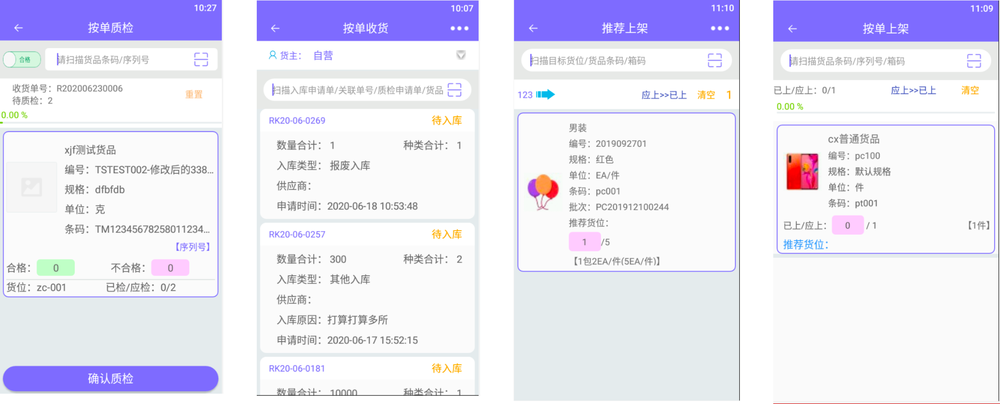

吉客云的PDA默认是激活状态

  
**4.国际化翻译难题**  
由于参考的很多竞品都是国内的，所以在布局方面一般来说相对比较成熟，但是如果是海外仓，有多语言的场景下，那么国内的很多设计可能就会出问题，最简单的问题就是文本超长，所以导致内容放不下了。  
  

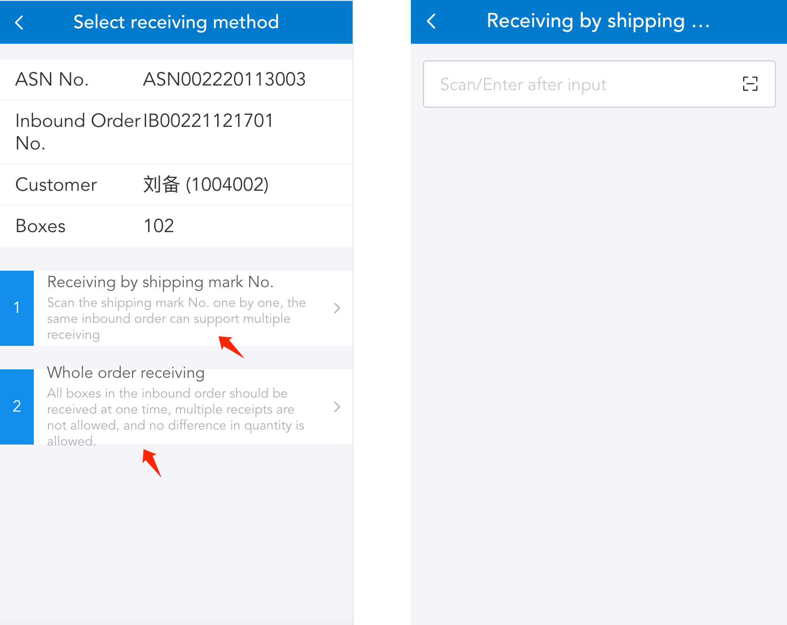

  
一方面是要在文案上进行优化和精简，另一方是在布局上，要尽量多采用“上下布局”而不是“左右布局”，这样才能尽可能地避免出现文案挤压、展示不下的问题。  
  

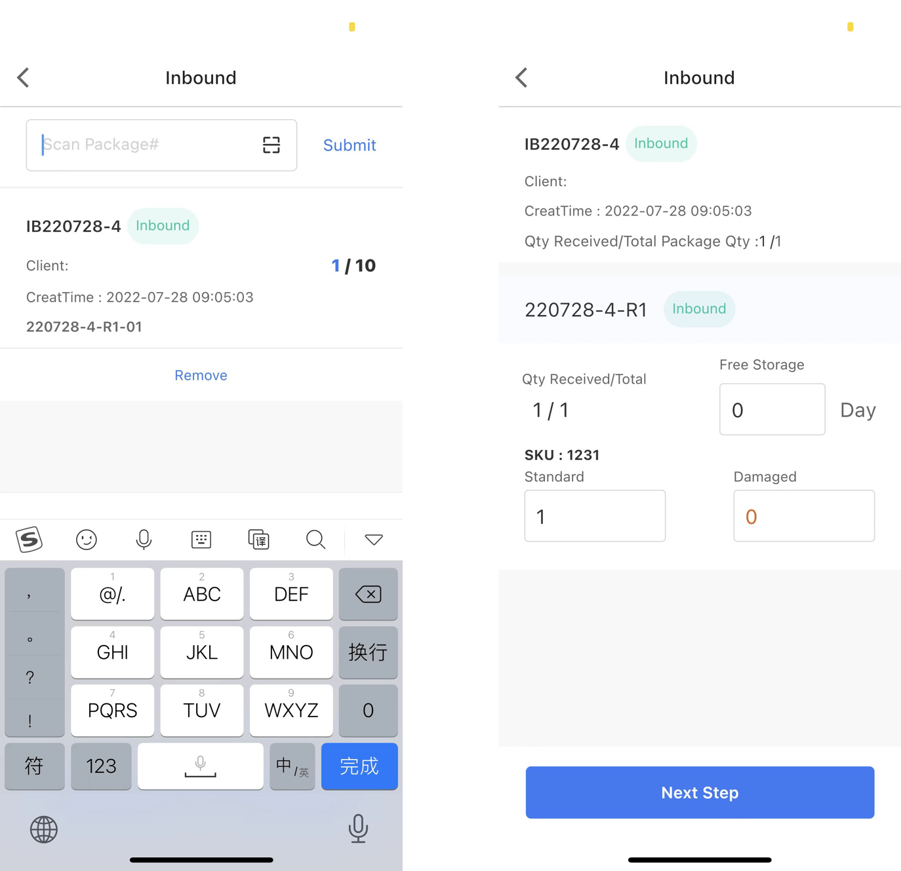

Shipout WMS的PDA设计风格

  
除了布局之外，国际化翻译还需要特别注意一些专有名词的一致性，尤其是大量采用机翻的时候，例如上架有些时候翻译为Putaway，有些时候又翻译为Shelves，要提前在内部建立好一套专业词汇翻译对照表，确保一些专有名词在不同的系统，不同的模块中能保持一样的翻译结果。  
**总结**  
PDA是仓储管理系统（WMS）衍生出来是一个附属产品，可以理解为是WMS的另一部分或者是另一个移动端的模块，**本质上是为了解决仓库在作业的时候需要通过移动设备录入数据、查询数据的需求**。因为仓库员工在实际工作的时候需要通过信息系统接收任务指令，查询相关的数据，如果来回去台式机工作站查看肯定是不方便的，如果全部用纸质单据作业效率也比较慢，所以就需要便携式的移动终端，也就是PDA来解决这些问题。  
有一些仓库get到这种本质的定义之后，发明了一种“移动式工作台” ，也就是在一个小推车上放上一台笔记本、扫描枪、打印机等设备，需要去哪里作业就推这个“移动工作台”去哪里，这其实也可以理解为是另一种PDA的解决方案。  
  

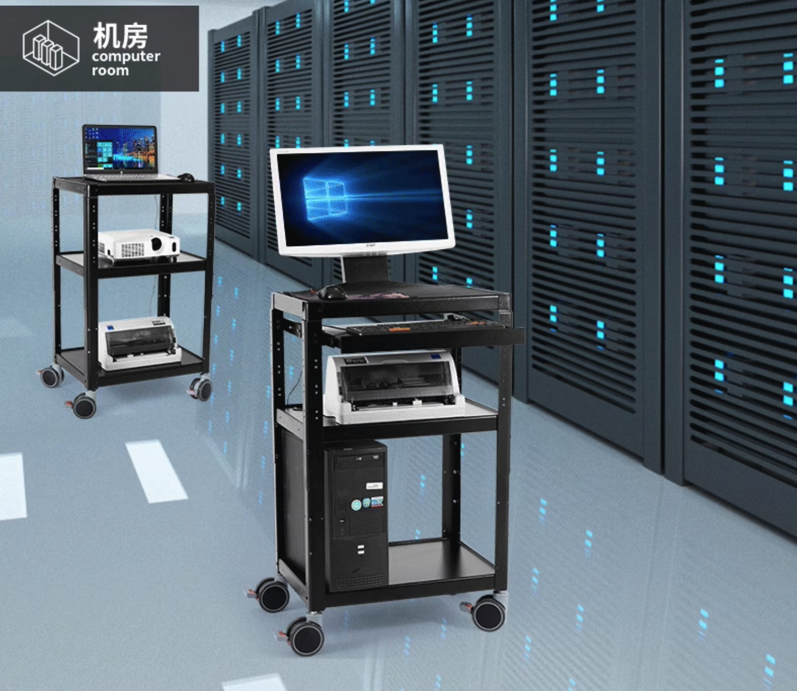

类似的移动工作台

  
PDA的底层核心就是一个移动端的APP，也可以理解为WMS的客户端，可以与WMS进行数据交换。所以产品经理在设计PDA的时候基本上和做一个简单2C的APP所需要的产品知识是类似的，只不过是在此基础上还需要加上一些业务的知识，对用户使用行为的观察等而已。其中对用户的场景熟悉，对用户的使用行为观察，还有对效率的提升等是产品经理设计出一款好用的仓库PDA的核心因素，如果这方面的知识积累的不够，则需要多花时间去仓库调研，然后持续迭代改进优化。