**什么是OpenAPI平台？**  
OpenAPI即开放API，也称为开放平台，是服务型网站常见的一种应用，网站的服务商将自己的网站服务封装成一系列API（Application Programming Interface，应用编程接口）并搭建一个对外开放的平台提供给第三方开发者使用，它提供了一套标准的API接口，让不同的业务系统可以通过这些接口进行交互和数据共享。这种行为就叫做开放网站的API，所开放的API就被称作OpenAPI或者OpenAPI平台。  
**为什么需要OpenAPI平台？**  
在海外仓WMS业务中，其他上游系统可以通过OpenAPI与海外仓进行数据交互和信息的传递，而不用从A系统导出数据，然后再登录海外仓的系统再手动导入进去，极大地提升了用户的体验。  
  

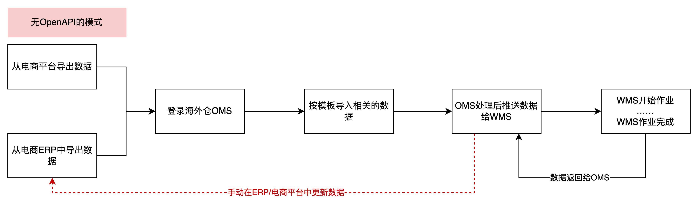

无OpenAPI的模式

  
如果没有OpenAPI的时候，用户要将数据推送到海外仓WMS中，则需要从电商平台或者电商ERP中手动导出业务数据，然后再登录海外仓OMS，根据导入模板去填写业务数据，最后再导入到OMS中，再通过OMS推送到WMS中。而且WMS作业完成之后，虽然OMS可以看到最新的业务状态，但是由于没有对外的API，所以外部的系统并不知道最新的状态，还需要人工手动根据OMS的最新状态（数据）去更新电商平台或者电商ERP的状态（数据）。  
如果引入了OpenAPI之后，只需要电商平台或者电商ERP和海外仓的OpenAPI完成了对接之后，这一切都不要手动去处理，系统可以自动完成相关的数据传递，包括上游系统主动推送给海外仓和海外仓反馈最新的数据给上游系统等。  
  

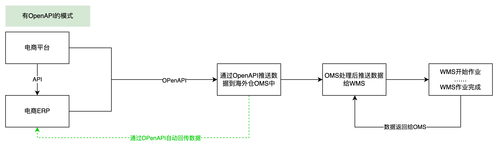

有OpenAPI的模式

  
**OpenAPI和海外仓系统的交互示意图**  
  

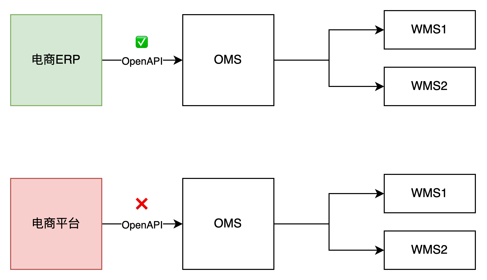

OpenAPI和海外仓系统的交互示意图

  
在前面海外仓OMS的章节有介绍过，在海外仓WMS领域中，OMS承担的是一个客户端的角色，也是WMS的上游端，所以一般来说外部系统是先通过OPenAPI这个通道触达到OMS，然后再由OMS处理、转化之后再推送到WMS中。几乎很少有直接通过OpenAPI直接触达WMS的玩法，海外仓领域中OMS和WMS一般都是配套出现的，很多业务逻辑都挂在OMS层面，当然如果需要特殊定制让OpenAPI的数据直接推送到WMS层也不是不可以，国内仓的玩法就是这样做的，稍后我们会进行介绍。  
要注意的是，文中提到的OpenAPI平台是指海外仓作为提供方去建设的平台，通俗点可以理解为是上游系统去接入海外仓WMS，而不是海外仓WMS去接入上游系统。**所以，严格来说电商平台并不是通过OpenAPI去接入海外仓OMS的，而是海外仓OMS通过电商平台的OpenAPI去接入电商平台**，这个模式和电商ERP接入海外仓OMS是不太一样的，刚好相反。  
对于国内仓WMS来说，由于各家的仓储系统不太一样，发展历程也比较悠久，很多国内仓都没有对应的OMS，而且京东，淘宝都分别做了相关的“业务系统标准化对接平台”，例如阿里的[奇门](https://developer.alibaba.com/docs/doc.htm?spm=a219a.7629140.0.0.567375femFscAO&treeId=285&articleId=106847&docType=1)，京东的[虎符](https://yd-doc.jdcloud.com/docs/5-hufu/)等，所以在国内电商领域，电商ERP会接入奇门，而国内仓也会接入奇门，大多数场景下就不需要仓库WMS单独去提供额外的OpenAPI去给ERP接入了，除非是一些耦合性比较高的特殊需求。  
  

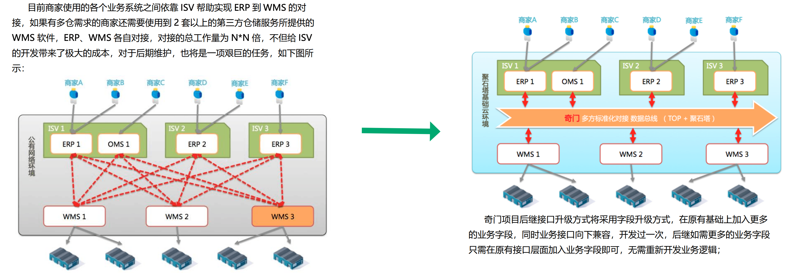

阿里奇门的作用说明

  
随着电子商务发展，商家所使用到的各类软件越来越多，各个软件之间没有相互打通，形成一个个信息孤岛，给商家的使用带来种种不便，商家要求各个系统之间的对接需求已经越来越迫切。  
目前在行业内已经有部分系统直接由服务商之间完成了系统软件的对接，但是由于没有统一的接入标准，导致接入较混乱，对接接口的版本也参差不齐，往往这样的系统对接不具有可复制性，多个系统之间的对接，需要多次开发，给商家的使用和功能迭代升级带来了诸多的不便，同时也给服务商带来额外的维护、开发成本。为了满足商家需求，让商家能够突破各个业务系统之间 的信息孤岛，提升商家在各个系统之间的操作效率，解决各个系统之间标准化对接的痛点，我们推出了奇门项目。  
奇门项目一期支持ERP、WMS 之间的系统标准化对接，通过构建 ERP、 WMS 系统之间标准通信协议来实现不同系统之间的打通。对商家来说，省去了更换系统软件所带来的额外开发成本。对 ISV 来说，省去了与多家ERP、 WMS系统对接难的问题，ERP通过一次对接奇门项目，打通与所有WMS之间的通信，WMS通过一次对接奇门项目，可以适配所有ERP软件……

**产品经理如何去参与搭建OpenAPI**  
前面大概介绍了什么是OpenAPI，为什么需要OpenAPI，以及海外仓的OpenAPI背后是用OMS来承接相应的数据，接下来就来介绍一下，作为产品经理应该怎么参与搭建OpenAPI。  
很多人以为，OpenAPI是技术相关的事情，应该全权交给技术去处理，自己压根就不用管。但是这种想法是不对的，是片面的，对于OpenAPI的技术细节方面作为产品经理确实可以不用参与，但是其它方面的内容产品经理都是需要去参与的。  
不要把OpenAPI当作一个技术名词去理解，而是要把搭建OpenAPI平台作为一个需求，作为一款产品去对待。去分析它的商业目标是什么，用户群体是谁，解决了什么问题，创造了什么价值。细化到具体的产品设计方案就是有多少套系统，有多少业务场景，有多少功能模块，这些和做一款信息化系统并无二致。  
**1****OpenAPI平台有哪些内容需要搭建？**  
  

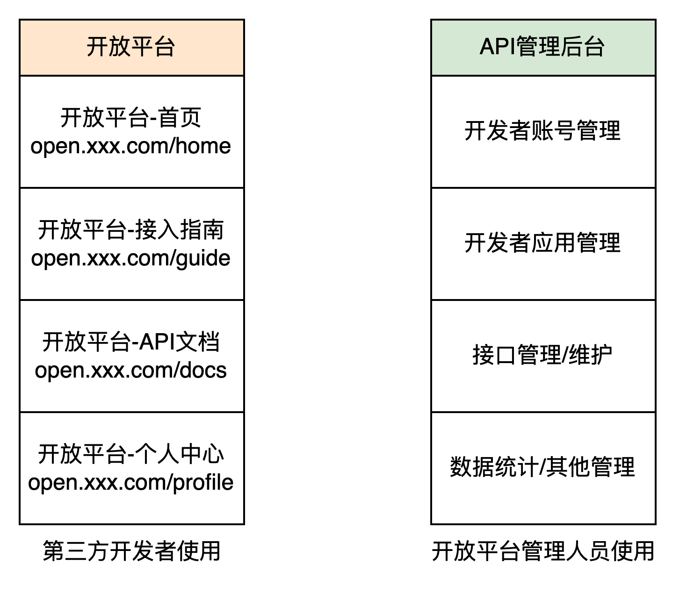

  
如果是搭建一个OpenAPI平台，一般来说会有两个端，分别的：  
1开放平台端（用户端）  
2API管理后台（管理端）  
开放平台端，也可以称之为用户端，用户是指需要接入OpenAPI的开发者们，他们需要在OpenAPI平台上查看API接口文档，查看开放平台的接入方式，查看自己申请的应用APP和接口调用的情况等。  
API管理后台，也可以称之为管理端，使用者是接口的提供商，例如海外仓需要对外提供开放平台的接口，那么海外仓就需要搭建相关的API管理后台，用来发布接口，审核开发者的资质，还有监控一些接口的日志等。  
所以，当产品经理接收到了任务需要去搭建OpenAPI平台之后，并不是说把这个事情简单翻译一下丢给技术人员就好了，实际上还是要把它当作一个大的项目，大的需求，去做业务的分析和梳理，做竞品的调研，做用户画像的梳理等。起码要搞清楚有多少个端（系统），有多少功能模块，有几类使用的用户等……  
**2****用户端的搭建**  
一般来说开放平台的用户端会分成这么几个部分：  
1API文档  
2接入指南/最佳实践  
3控制中心/工作台  
其中API文档和接入指南一般都是直接对外开放的，访问相关URL就可以直接访问，不会做权限的控制。  
  

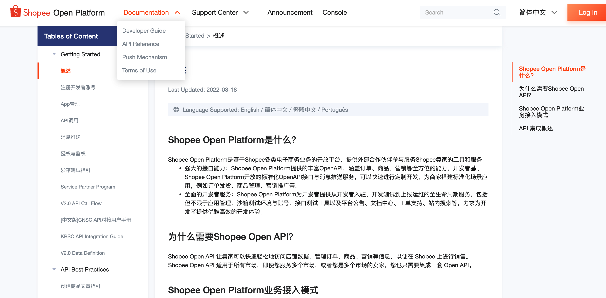

Shopee开放平台

  
  

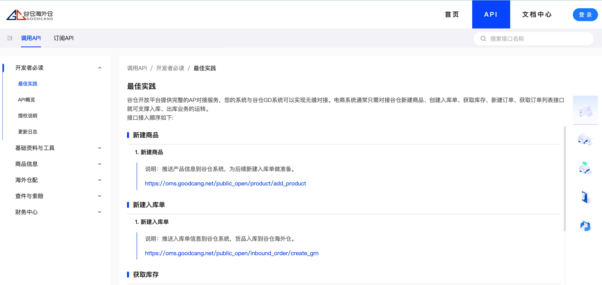

谷仓开放平台

  
而控制中心/工作台则需要注册成为了开发者，登录账号和密码后才可以访问，里面一般就是包含了自己的个人信息，接入的APP，还有一些接口调用日志，消息通知等。  
  

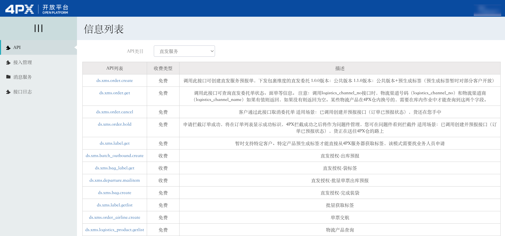

4PX的开发者工作台

  
  

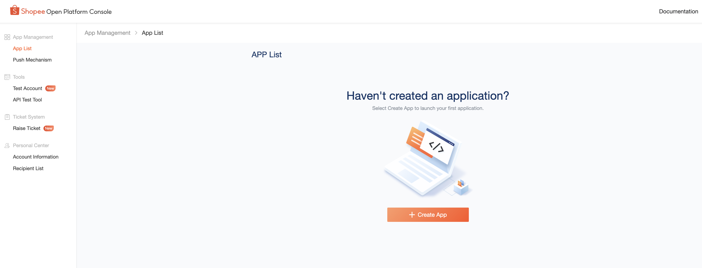

Shopee的开发者控制中心

  
**3****后台管理端的搭建**  
相较于用户端来说，内部管理端的竞品非常不好找，因为这个内容一般都是不对外开放的，所以这个时候产品经理往往要想好另一条路：就是多和研发人员沟通，确认一些技术需求，同时梳理出典型的业务场景，通过这些场景去设计内部的管理端功能。  
例如，如果需要在用户端需要开发者入驻，那么开发者入驻的时候会填写一些申请信息，后台管理端就需要有开发者资质审核的功能模块。  
同样的，如果用户端的开发者申请开通了一些APP应用，也是需要后台审核的，那么后台管理端也需要有对应的审核功能模块。  
然后前台的一些API文档和接入文档等可能会不定期的更新，那么后台管理端可能就需要有CMS（内容管理系统）的功能模块，这样才可以快速地完成修改和更新。  
针对技术部分的内容，一些API的调用可能比较敏感，需要做费用的计算，调用次数的限制，日志的统计，还有异常的监控等，所以这些都需要在后台管理端去完成。  
  

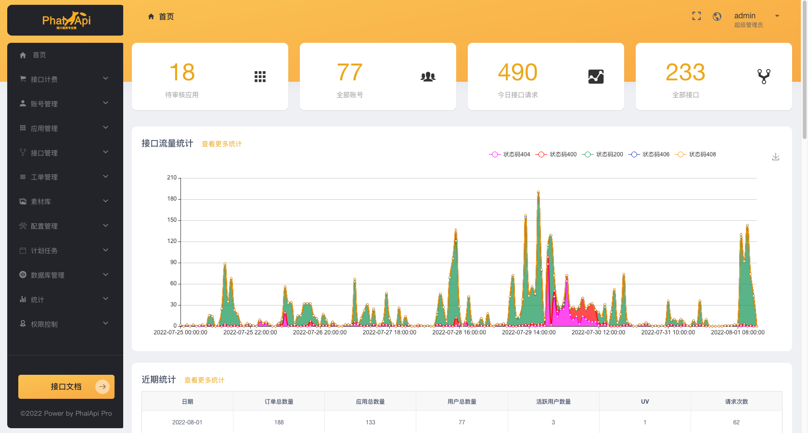

接口大师后台管理系统

  
**4****业务接口的梳理**  
通过前面3个部分内容的学习，我们知道了原来搭建一个OpenAPI平台要做这么多事情，有这么多内容，并不是想象中的做个“甩手掌柜”就够了。  
如果要从0开始去搭建一个OpenAPI平台确实要做很多事情，OpenAPI搭建成本比较高，适用于有多个开发者要接入的场景，所以一般都是业务量到了一定量级之后才会去做这件事。如果目前只有少量的用户需要接入海外仓系统，那么可以考虑用MVP的思路去实现，不是上来就搭建一个OpenAPI平台，而是先搭建对外的技术接口，然后整理相关的说明，用一个在线文档或者Word等方式交付。  
如果是以MVP的方式去交付，作为产品经理需要做的事情就稍微少一些，大概是下图中的这么一些：  
  

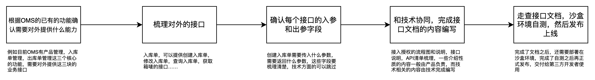

产品经理怎么输出接口文档

  
关于产品经理输出接口文档这件事，很多人都会有一个误区，觉得这个东西是技术相关的内容不需要自己参与过多。但是实际上从我的个人经验来看，如果纯粹由技术输出接口文档，对于接入方来说非常痛苦，要么看不懂文档，要么发现有些接口调不通，要么就发现文档阅读体验贼差等，对于开放平台方来说可能是偷懒了，但是接入方的产品和研发往往就很痛苦了。而且从API文档也可以看得出对方的研发能力，一般小规模的技术团队或者整体能力偏差的技术团队，输出的API文档都比较烂，会让客户产生一些不信任感，感觉不安全。  
所以我都是建议产品经理要参与到开放平台或者开放接口的搭建过程中去，要和技术进行协同，你不懂技术方面的东西那就交付给研发去搞定，但是体验方面的内容、业务和逻辑的表达方面的内容产品经理是需要把关的，大家都是同为一体的，应该共同为最后的交付结果（API功能和API文档）承担责任。  
海外仓的OpenAPI需要开放哪些接口，这个是没有标准的，需要结合实际的业务去选择，这里我把行业内做得比较好的一些友商的开放平台整理了一下，大家可以直接看他们的接口文档，对照学习和输出即可。  
其中做得最好的应该是谷仓的开放平台，整体的体验和逻辑说明都很优秀，值得反复看看。  
  

[谷仓海外仓开放平台](https://open.goodcang.com/)

（重点推荐）  
  

[wingsing开放平台](https://open.wingsing.com/#/home)

  
  

[4PX开放平台](https://open.4px.com/apiInfo/api)

  
  

[万邑通开发者网站](https://developer.winit.com.cn/)

  
**API对接方面的学习和提升**  
OpenAPI开放平台这个项目说大也大，说小也小，和业务需求有直接的关系，但是考虑到后续大家肯定还是会有机会经历这一块的，所以我整理了相关的学习资料和参考资料在文末，等后续要做这一块业务的时候再翻出来查阅即可。  
**OpenAPI平台**  
  

[微信开放平台](https://open.weixin.qq.com/)

  
  

[Shopee Open Platform](https://open.shopee.com/)

  
[Lazada Open Platform](https://open.lazada.com/)  
  

[TikTok Shop Partner Center](https://partner.tiktokshop.com/doc/page/63fd7444715d622a338c5097)

  
**接口API的一些知识**  
  

[最快1天，搭建你的OpenAPI和开放平台 - 掘金](https://juejin.cn/post/6987377856447774734)

  
  

[RESTful API 设计指南 - 阮一峰的网络日志](https://www.ruanyifeng.com/blog/2014/05/restful_api.html)

  
  

[OAuth 2.0 的一个简单解释 - 阮一峰的网络日志](https://www.ruanyifeng.com/blog/2019/04/oauth_design.html)

  
  

[接口大师[旗舰版演示]](http://www.yesx2.com/)

  
  

[JSON基础应用与实战视频教程-慕课网](https://www.imooc.com/learn/68/)

  
**接口调试工具**  
  

[21分钟学会Apifox\_哔哩哔哩\_bilibili](https://www.bilibili.com/video/BV1ae4y1y7bf/?spm_id_from=333.788.recommend_more_video.6&vd_source=610e391e2cf86c2841d101ff237109fa)

  
**接口知识的电子书**  
  

[Web API的设计与开发](https://www.yuque.com/jiaowovitamin/uizu4s/nw2mfahknxas4fqh)