**前言**  
前一篇

[7.3 海外仓的OpenAPI平台搭建](https://www.yuque.com/jiaowovitamin/dgugdp/kwlvfsho5h96uxcu)

的内容，主要是以一个海外仓WMS产品经理的视角来阐述如何搭建海外仓WMS的OpenAPI平台，这种主动去搭建对外的OpenAPI平台的机会在B端产品经理的日常工作中并不多见，反而是自己作为需求方 然后去对接外部的系统接口这种活会做的更多一些。  
很多没怎么做过相关类似工作的产品经理，同时自己可能又不太懂技术，就会在这件事上有点犯怵，有点困惑。不知道怎么去整理接口文档的核心逻辑，怎么去输出产品需求文档， 怎么去和研发交付、评审需求等。  
本篇文章，我就用“两个不同的视角”来给大家拆解一下，关于常见的ERP和WMS的对接，这背后有哪些业务知识、产品知识，技术知识和可借鉴学习的经验之谈。  
为什么说是“两个不同的视角”呢？因为在日常的工作中，我们往往要么只负责ERP项目，要么只负责WMS项目，很少会有机会同时负责ERP，又负责WMS。所以这里提到的两个视角，其实就是ERP的视角和WMS的视角。  
作为ERP的视角：我是电商ERP或者内部ERP，需要对接外部三方仓库，然后把相关的单据指令推送到仓库，让仓库按指令去完成收货、出库等。  
作为WMS的视角：我是对外提供服务的仓储服务商，有一个或者多个实体仓库，也有一套相关的03-WMS系统，我需要对外开放自己的OpenAPI，让相关的客户接入到WMS中，可以通过接口给WMS下发作业指令。  
**作为电商ERP，对接外部WMS**  
维他零售公司，之前都是做线下的批发和零售业务，对接的都是一些主要做B2B业务的仓库。最近根据业务的规划要开拓电商业务，所以想要对接B2C的电商相关的仓库，目前已经找好了一家意向的仓库，对方用的是万里牛WMS，所以需要对接万里牛WMS的接口。 [https://open.hupun.com/api-doc/wms/open/oms/bill/cancelbill/v2](https://open.hupun.com/api-doc/wms/open/oms/bill/cancelbill/v2)  
**1.调研业务需求，梳理当前诉求**  
既然要搞B2C的电商业务，那么就要先自己内部把相关的需求给调研清楚，明确清楚，可能会涉及到电商运营部门，仓储物流部门，采购和计划部门等，都需要拉通。

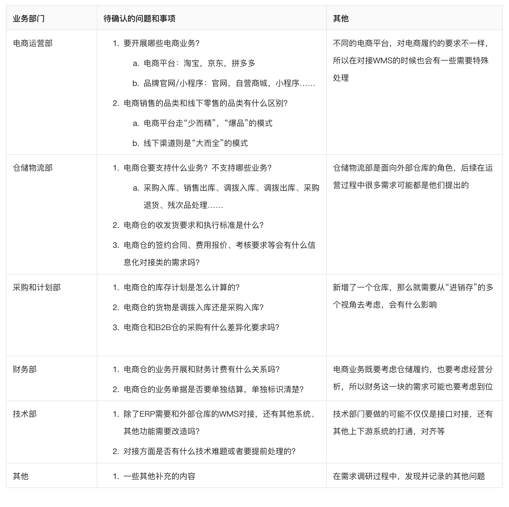

  
**2.阅读接口文档，提取有效信息**  
上述的相关分析，和正常做一些业务需求是一样的，不会因为需要接口对接就有什么特别不太一样的，所以按正常的需求分析和需求澄清的方式方法来执行即可。  
当背景信息和原始需求都搞清楚了之后，接下来就可以去阅读接口文档，提取接口文档中的一些关键信息了。  
1获取接口文档的地址或者文件附件；  
2查看对接指引，了解大概的对接流程和步骤，按对方的要求执行即可；  
3阅读具体的API文档，了解对方提供了哪些接口（API EndPoint），不同的接口有什么作用；  
4结合需求调研，再加上自己对接口文档的理解，可以梳理出要大概对接哪些EndPoint；  
  

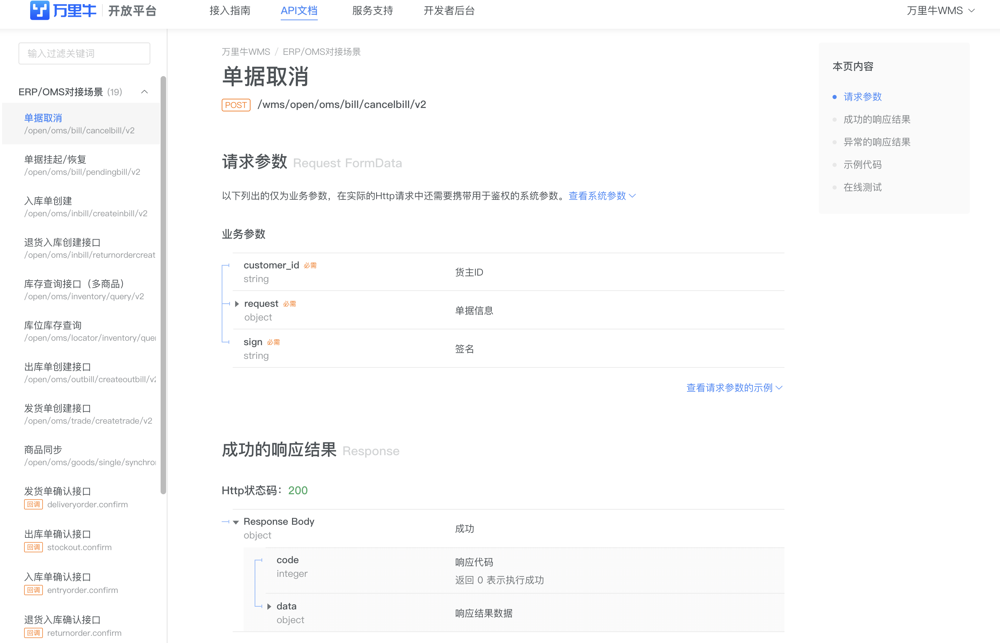

万里牛接口文档示意图

  
经过相关的调研和确认之后，产品经理就可以整理出自己要对接哪些接口了。  
1接口认证、授权、鉴权等；  
2商品同步，即从ERP推送商品资料到WMS中；  
3入库单创建，即从ERP推送采购订单到WMS中；  
4退货入库单创建，即从ERP推送退货入库单到WMS中，如果电商仓没有退货业务，则不需要对接；  
5发货单创建接口，即从ERP推送销售订单到WMS中；  
6单据取消，即从ERP发起单据的取消，可以取消入库单，退货入库单，发货单等；  
7入库单确认接口，即WMS入库之后，更新状态和数据，反向推送给ERP；（Webhook-回调）  
8退货入库单确认接口，即WMS退货入库之后，更新状态和数据，反向推送给ERP；（Webhook-回调）  
9发货单确认接口，即WMS发货出库之后，更新状态和数据，反向推送给ERP；（Webhook-回调）  
**3.对接口文档的内容做详细的批注和分析**  
WMS方提供的接口文档，可能非常丰富，文档介绍非常详实，也有可能接口文档内容简陋，表达的也不好，所以很有可能会有很多内容需要产品经理去确认，去落实。  
这是产品经理在做对接类需求需要花费比较多时间和精力的方面，如果对方的接口文档做得好，做得充分，那么对接流程就会很顺畅，执行起来就会很简单；但是如果对方的接口文档做得很烂，很多不全，那么对接过程就会很漫长，需要反复确认，修改等。  
对接口文档的批注和分析，也取决于产品经理的经验积累和认知水平。你懂得越多，很多东西你就一眼能看懂，就无需过多的求证和确认，所以批注的内容就少了。  
即使自己懂得比较少也没关系，坦诚地承认，然后把自己不知道的东西记录下来，再通过会议或者群聊的方式确认相关的事项即可。关键是要提出一个好问题，同时自己也要提前做好一些铺垫知识的摄取。  
**4.根据接口文档，输出接口对接的需求文档**  
接口对接的需求文档和日常业务需求的需求文档基本上没什么区别，这里以维他命自定义的需求文档模板为例，给展示一下和接口对接相关的需求文档该怎么写。  
  

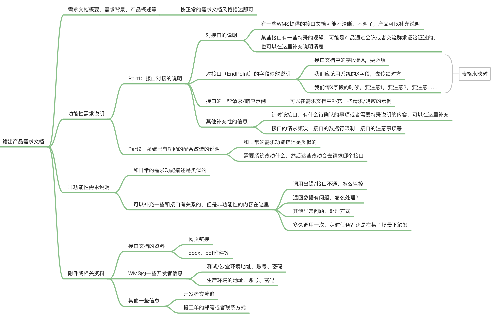

  
需求文档大纲示意图  
  

多系统之间的交互示意图

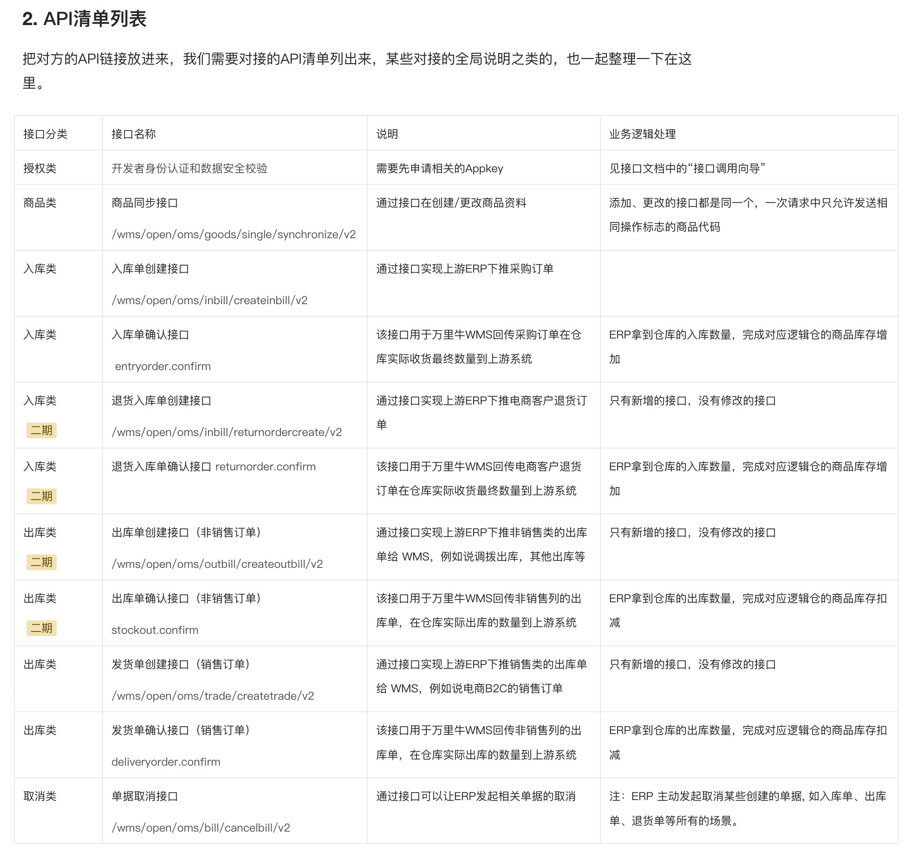

整理接口清单列表

  
  
  

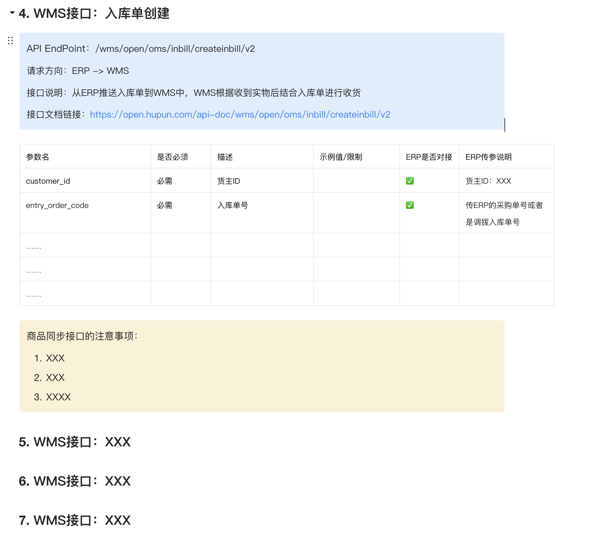

对每个单独的接口做字段解析和说明

  
接口对接的部分内容写完了之后，就可以正常去写系统相关的功能模块的需求描述了，主要是说明一下要改动什么模块，什么页面，什么功能，然后这个改动会要去请求什么接口，触发什么逻辑等。总体还是和日常的业务需求没什么区别的。  
  

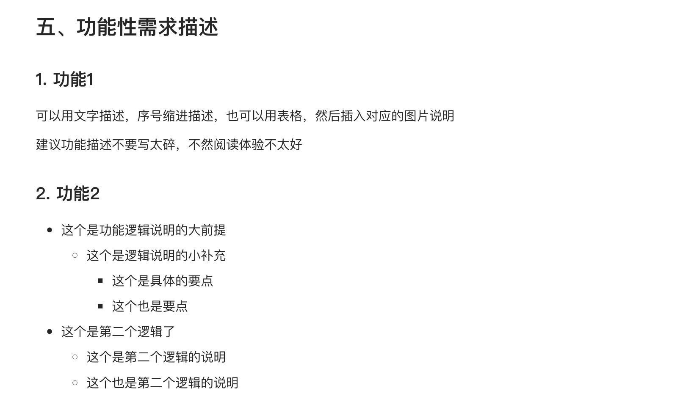

  
类似日常的业务需求描述  
作为ERP去对接外部的WMS，需要做什么事情，需要输出哪些核心的内容，我整理成了一个思维导图，大家可以按需获取。  
**作为WMS，提供对外的接口让ERP对接**  
维他海外仓是一家专注于服务欧美市场，为3C类品牌卖家提供精细化仓储服务的海外仓公司，最近刚好自研上线了自己的03-WMS系统。  
刚好最近接入了一些KA型客户，这些客户希望维他海外仓能提供一套对外的OpenAPI，然后通过接口可以实现从客户的ERP或者后台管理系统直接推送商品数据、业务单据到WMS中，而不是每次都登录海外仓OMS去手动处理单据。  
[https://open.wingsing.com/#/home](https://open.wingsing.com/#/home)  
**1.调研业务需求，梳理当前诉求**  
WMS要对外提供接口，必然是希望能做成通用的，这样的话每个外部客户要接入WMS都可以走这一套标准。但是通用的API接口，也是有发展路线的，不是一蹴而就可以达到通用、标准、规范、体验棒的。  
产品经理去调研业务需求，主要是了解一下目前的客户量级，客户诉求，客户需要接入什么功能和模块，还有当前WMS功能的发展情况，然后制定对应的方案。  
  

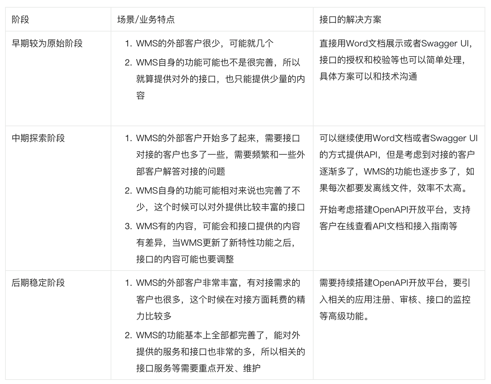

  
  

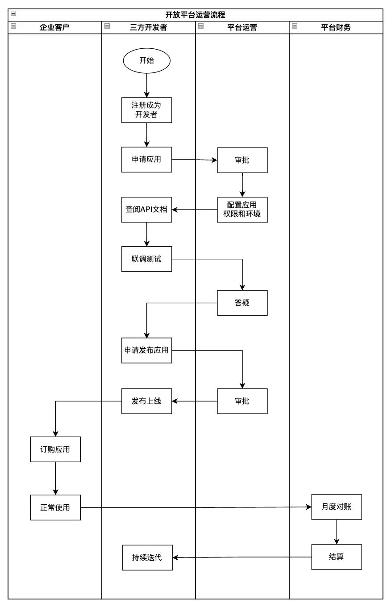

  
  

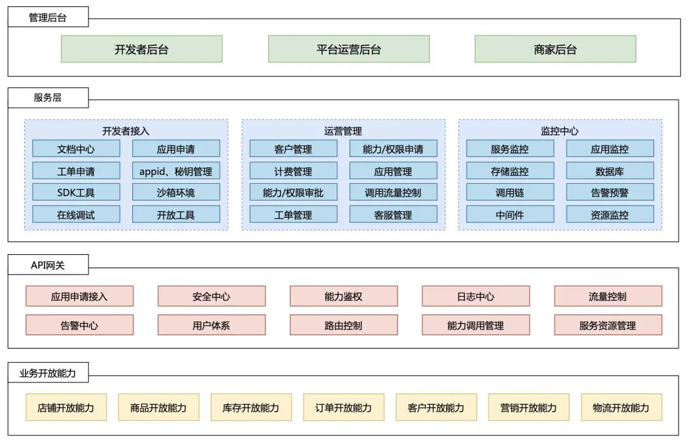

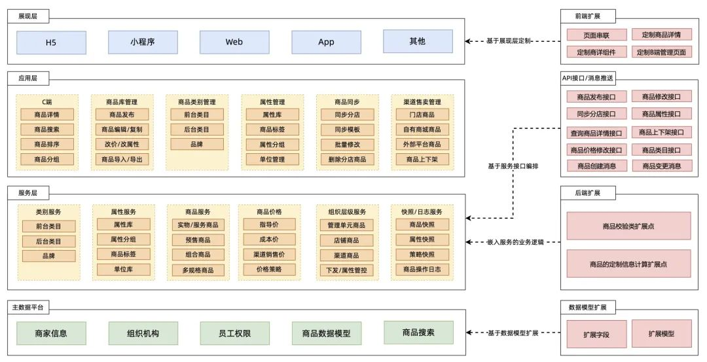

  
  
三张图均来自“新零售SaaS架构：开放平台架构设计”这篇文章  
**2.研发和产品各自负责OpenAPI的不同模块**  
当确定了要对外提供WMS的接口文档后，产品经理和研发需要分工协作来输出相关的接口文档。研发关注和技术有关的内容，而产品则关注和业务逻辑、应用参数相关的内容。  
作为WMS方，是否要搭建OpenAPI平台得要结合实际的业务来定，如果时机成熟确实需要搭建相关的平台，则可以查看“

[7.3 海外仓的OpenAPI平台搭建](https://www.yuque.com/jiaowovitamin/dgugdp/kwlvfsho5h96uxcu)

”了解相关的一些技术知识和产品知识。  
**3\. 产品经理定义对外的接口，然后通过内部评审**  
1产品经理怎么知道要提供多少个接口？  
搭建OpenAPI其实和做业务是一样的，需要逐步迭代，逐步丰富。所以产品经理也不可能一次性就把所有要提供的接口都定义出来，都是逐步迭代，逐步完善的。  
作为一个“后追型”产品，最快的方式就是对标竞品，看一下别人是怎么做的，提供了哪些接口，然后借鉴模仿即可。  
  

| **模块/大类** | **接口/EndPoint** | **用途** | **调用方式** |
| --- | --- | --- | --- |
| 授权/生成签名 | 签名接口 | 接口授权使用，接口对接的时候必备 | 外部->WMS |
| 基础资料 | 获取仓库信息 | 可以知道WMS有多少个仓库，仓库的一些基础信息是什么 | 外部->WMS |
|  | 获取物流渠道 | 可以知道WMS有多少个物流，物流的一些基础信息是什么 | 外部->WMS |
| 货品 | 创建货品 | 通过接口推送商品资料给WMS | 外部->WMS |
|  | 修改货品 | 通过接口修改已经推送的商品资料 | 外部->WMS |
|  | 查询货品 | 通过接口查询已经推送到WMS的商品 | 外部->WMS |
| 入库 | 创建入库单 | 通过接口推送入库单给WMS | 外部->WMS |
|  | 入库单取消 | 通过接口取消推送过来的入库单 | 外部->WMS |
|  | 入库单查询 | 通过接口可以查询入库单的状态，及时了解仓库的作业进展 | 外部->WMS |
|  | 入库单回传 | 仓库完成了收货或者上架之后，主动通过回调接口推送结果信息给对接者 | WMS->外部 |
| 出库 | 创建出库单 | 通过接口推送出库单给WMS | 外部->WMS |
|  | 出库单取消 | 通过接口取消推送过来的出库单 | 外部->WMS |
|  | 出库单查询 | 通过接口可以查询出库单的状态，及时了解仓库的作业进展 | 外部->WMS |
|  | 出库单回传 | 仓库完成了称重或者出库之后，主动通过回调接口推送结果信息给对接者 | WMS->外部 |
|  | 获取运单号 | 通过接口可以查询出库单的运单号，因为有一些平台要提前标记发货 | 外部->WMS |
|  | 轨迹查询 | 通过接口查询出库单的物流轨迹信息 | 外部->WMS |
| 库存 | 库存查询 | 通过接口查询库存的数量 | 外部->WMS |
|  | 库存流水 | 通过接口查询库存的流水 | 外部->WMS |
|  | 库存异动通知 | 仓库主动发起的一些库存调整、盘点、其他出入库等，需要将结果推送给对接者 | WMS->外部 |
| 退货 | 创建退货单 | 通过接口推送客户退货单给WMS | 外部->WMS |
|  | 退货单取消 | 通过接口取消推送过来的退货单 | 外部->WMS |
|  | 退货单查询 | 通过接口可以查询退货单的状态，及时了解仓库的作业进展 | 外部->WMS |
|  | 退货单回传 | 仓库完成了退货的接收或者处理之后，主动通过回调接口推送结果信息给对接者 | WMS->外部 |

2产品经理怎么知道接口中要提供哪些字段？  
很多产品经理因为自己不懂技术，所以会对接口文档天然就有一种抵触或者畏惧情绪。其实把接口文档换成是“简配版”的原型或者产品信息结构，你就会发现提供接口中的字段和画一个表单提交的原型的一样的意思。  
  

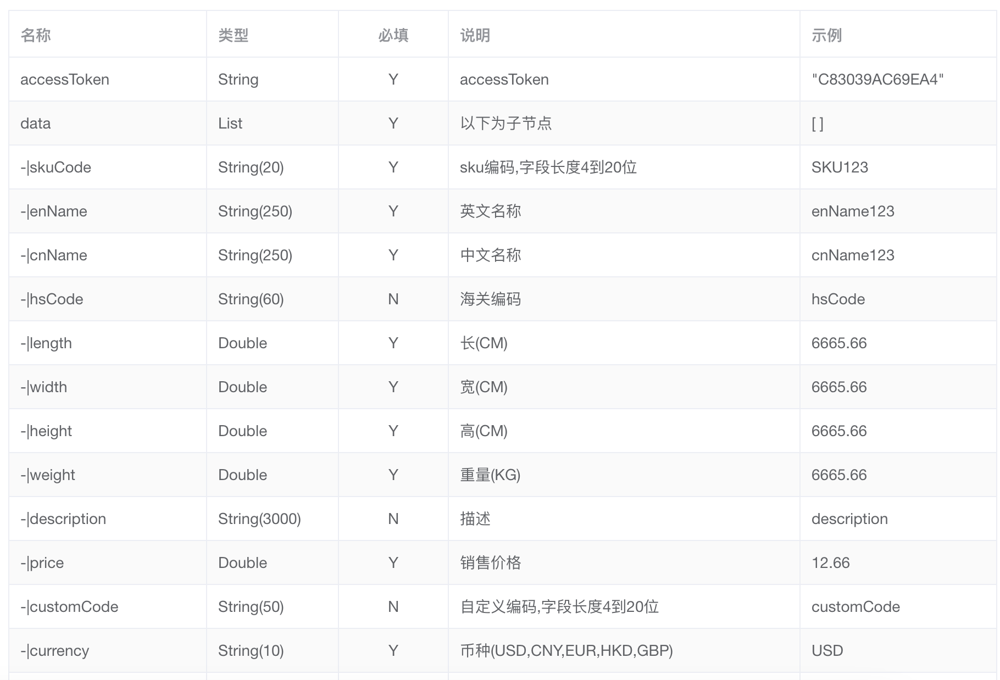

创建货品的接口

  
  

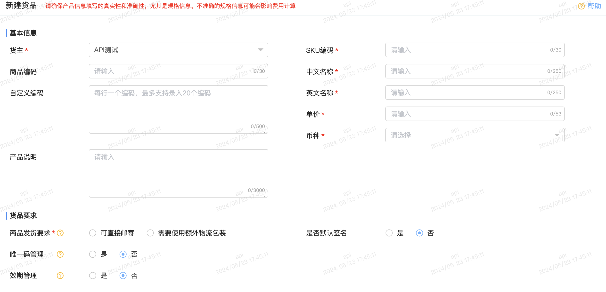

新建货品的页面

  
3产品经理怎么走查定义好的接口？  
定义好了接口之后，可以让开发发布到测试环境，然后产品经理自己用Apifox或者Postman等工具，模拟请求接口。可以走查字段是否有遗漏，然后字段的约束是否需要调整，接口反馈的信息是否需要改进优化。  
4接口文档或者接口怎么内部评审？  
一般来说，研发自己走查一遍，产品再走查一遍，最后测试再验证一遍就可以完成相关的评审了。  
接口文档在后续如果需要改动或者优化，需要考虑是否会对历史接入的客户有影响。如果有影响，那么改动之后的接口，就要用新的版本号来区分；如果没有影响，那就可以在之前的版本号上迭代。  
接口的版本号定义，需要研发来评估，如果加了某些必填字段或者结构发生了变化，那么会导致“历史用户”请求报错，那这种改动就需要用不同的版本号来划分。如果没有这种影响，那就可以不用新的版本号了。  
**4.对外发布上线，并持续迭代完善**  
接口定义好，同时也测试验证通过之后，就可以发布上线了，这个和普通业务需求发布版本是一样的。  
接口发布之后就可以让外部客户来对接使用了，在对接过程中，如果遇到了某些问题再及时解决，并持续迭代完善接口文档即可。  
**总结**  
接口对接实际涉及到的技术名词和技术知识挺多的，对于没怎么接触过技术的产品经理来说初次上手肯定是会有一定的难度，但是这并不代表说这件事就只能让懂技术的产品经来做。  
因为这些技术名词和知识，其实花点时间查一下，然后学习一下，基本上能搞懂大概意思就可以了。因为对产品经理来说，无论是接口文档的对接，还是接口文档/平台的搭建，更核心的东西还是去梳理业务，明确需求，最后整理成开发任务。  
而这些业务的需求，业务的知识，业务的流程，基本上能看懂接口文档的作用及其字段的说明等就够了，产品经理可以用通俗易懂的自然语言去表达，到时候再让研发进行转化即可。