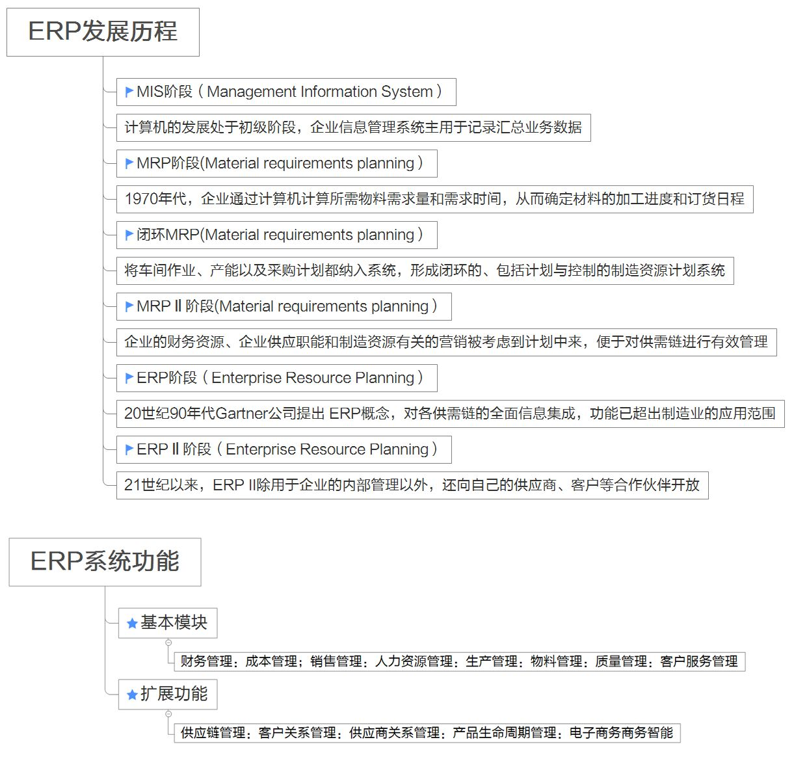
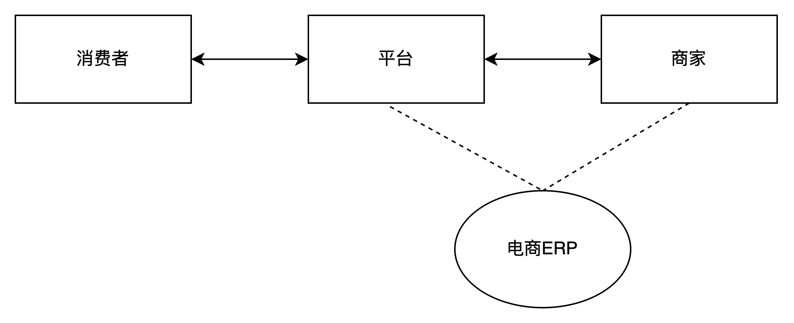
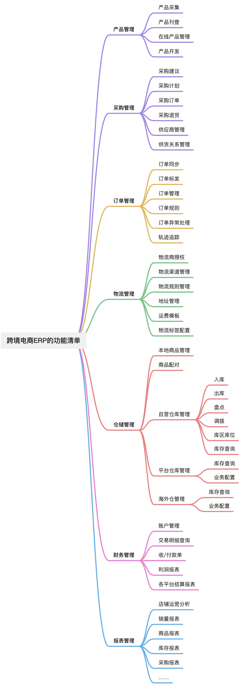
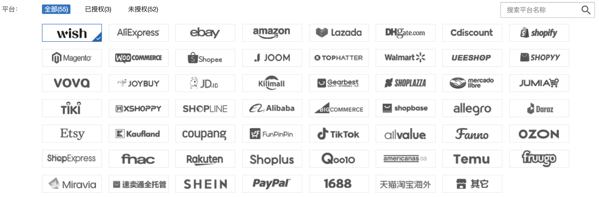
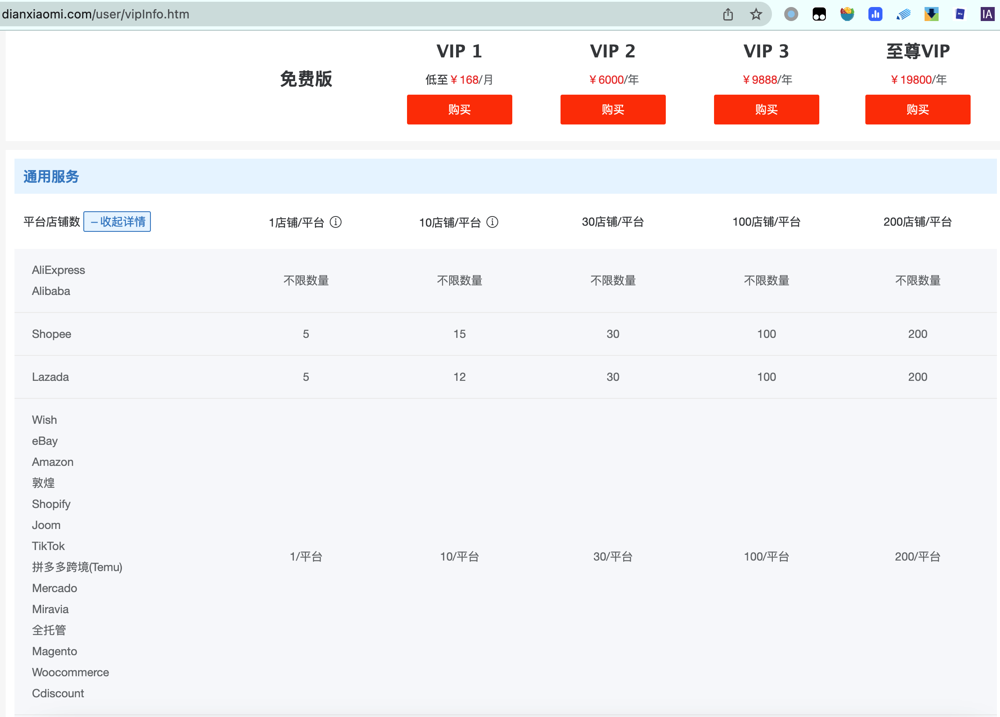
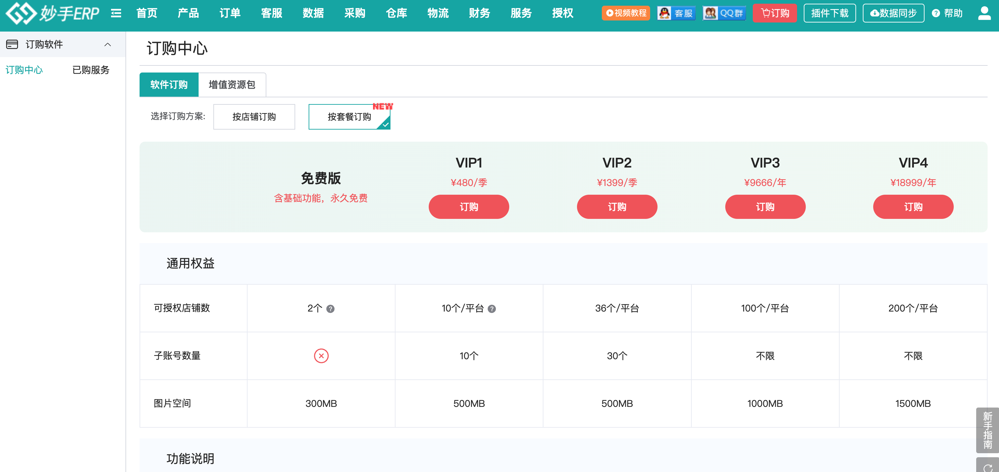

**一、什么是跨境电商ERP？**  
ERP（Enterprise Resource Planning）的中文叫作“企业资源计划”，这个词很多人都听过，但是第一次听到它的中文名称的时候基本上都会发懵，什么是企业资源计划？是指一个具体的什么计划吗？  
  

  
图片来源网络-侵删  
从上图可知，ERP是一种管理思想和理念，随着不断地发展，结合一些信息化的手段，就具象成了一类**管理软件**。  
现在大家提到ERP的时候，就已经默认它是指代一种信息化系统或者是软件了，它和CRM，WMS，MES等一样，成为了大家所熟知的典型B端软件的代表。  
不同领域，不同行业对ERP的定义都不太一样，有一些公司觉得ERP是用来管理多销售渠道，多店铺，多订单的；有一些公司觉得ERP核心就是用来算账的，财务的各种账单和报表要搞清楚；还有一些公司觉得ERP就是要大杂烩，人，物，财，资源，知识等都需要管理起来……  
本文所讲的跨境电商ERP，主要有两个关键词“跨境”和“电商”，跨境是指行业领域是跨境方向，电商是指业务范围主要是电商相关，所以组合起来就是：**围绕跨境电商业务而设计的一套综合性的信息化管理软件。**  
**二、跨境电商ERP的作用**  
跨境电商从进出口的方向可以分成跨境进口电商和跨境出口电商，一般来说提到跨境电商的时候大家默认指的是跨境出口电商，因为这个业务量比较多，受众也比较广，所以大家默认就简称为“跨境电商”。同样的道理，跨境电商ERP也是默认指跨境出口电商业务所使用的ERP。  
跨境电商ERP的用户主要是电商卖家，电商卖家需要使用ERP的原因一般有这么几个：  
1多平台，多店铺的集中式管理， 电商卖家往往会同时经营多个电商平台，多个店铺，所以这些业务需要在一个集中化的平台上进行管理，否则就会特别混乱，效率低下等；  
2更高效率地处理订单，随着卖家的业务量增长，每天都会有海量的订单需要处理，电商ERP的核心功能之一就是提升订单履约的效率，准确率等，确保卖家可以及时完成多个平台，多个店铺的订单履约要求；  
3统一的库存管理，电商卖家的另一个痛点就是库存的管理，库存积压，库存备货不足，库存数据不准确等都会导致业务串联不顺畅，甚至还会带来巨额的损失；  
4解决利润核算的问题，跨境电商涉及的费用多且杂，分散在各个业务模块和业务报表，要核算清利润情况，就需要借助ERP这种工具来完成；  
5与上下游高效率协同，电商卖家需要与电商平台、供应商、第三方物流及仓储服务提供商等各种上下游玩家业务往来，所以需要借助ERP完成相关的业务协同；  
无论是跨境电商ERP还是国内电商ERP，都可以把ERP理解为是电商平台和电商卖家之间的桥梁，它们的关系如下图所示。  
  

电商ERP是电商平台和电商卖家之间的桥梁

  
为了方便大家更好地理解跨境电商ERP到底有什么功能， 有哪些功能模块，我梳理了几个常见的业务场景，看看跨境电商ERP是如何发挥其作用的。  
1多店铺管理的需求  
●张三要在eBay上开一个店铺，需要申请入驻平台。入驻平台之后，可以在电商平台的后端管理页面查看到自己的店铺情况，例如商品的上下架，订单情况，售后情况，物流情况等。  
●eBay店铺开的非常好，于是张三决定继续在Amazon上继续开一个店铺，于是就又要登录Amazon的卖家后台去查看店铺的情况。  
●以此类推，张三还要在Walmart，Wish，Aliexpress，Tiktok Shop，Shopee等平台都要开店，于是需要登录的后台管理系统就非常的多了  
**电商ERP解决多店铺管理的问题，可以在一个软件上管理多个店铺的情况，避免重复登录、打开多个不同的系统后台。**  
2批量刊登上架产品的需求  
●张三的店铺主要是经营一些3C配件的，SKU很多，然后更新迭代也很快。每次上新品的时候，都要去不同的店铺后台编辑、维护商品信息（上架/刊登），特别麻烦。  
●当张三使用了跨境电商ERP之后，它可以在电商ERP上维护好一份基础数据，然后通过配置一些业务规则，实现一键批量刊登到不同的电商平台，而且刊登根据可以自动完成价格的调整，标题的修改，产品描述的翻译等。  
**电商ERP通过对接打通电商平台，实现商品的在线上架/刊登的功能，一个ERP系统就可以将商品信息分发到多个电商平台上，大大地提升了运营的效率。**  
3多渠道库存集中化管理  
●不同的电商平台由于销量不一样或者运营活动的差异，所以需要准备的库存也不一样，根据每天的销量不同，平台上展示的剩余可销售库存也会不一样。  
●如果平台展示的可用库存不够了，但是实物却是够的，则会导致消费者无法下单造成损失；如果平台展示的可用库存是够的，但是实物却不够，则会导致消费者下单了之后商家不能及时发货，会被平台惩罚。  
●库存的准确性很重要，同时能够灵活地调整和分配不同平台的库存也很重要，这也是电商ERP要解决的一个问题，就是多渠道库存的调度和分配，以及实物库存的抓取和管理等。  
**电商ERP通过对接电商平台，获取平台的最新库存情况，也可以修改/调整平台的库存情况，与实物库存保持一致。同时电商ERP也可以对接下游的WMS，即时获取最新的实物库存，以便于支撑灵活的运营需求。**  
4多渠道的订单及时履约  
●消费者会在不同的平台下单，下单之后张三需要知道一共有哪些订单，然后才能安排发货，所以需要将多个电商平台的订单数据及时同步到ERP中。  
●当张三为不同的店铺的订单都发货了之后，需要将这些发货信息收集归类，然后反馈给平台，这样平台才会通知消费者，您的订单已经发货，使用了什么物流，单号是什么，从哪里发出等。  
电商ERP通过对接电商平台，及时拉取平台的订单，并告知自己的仓库进行发货，然后再将发货后的物流信息回传给平台，通知给消费者。  
以上几个场景都是最常见的电商ERP能解决的场景，除了这些之外电商ERP还有其他很多相关的场景没有介绍，在此就不赘述了，我简单梳理一下跨境电商ERP一般有哪些功能模块，帮助大家更好地理解即可。跨境电商ERP系统通常包括以下功能模块：  
  

跨境电商ERP主流功能模块

**三、多平台ERP与亚马逊ERP的区别**  
在跨境电商ERP领域中，常常会听到“多平台ERP”和“亚马逊ERP”这样的定义，所以在此处我来做一个简单的介绍。  
在跨境电商领域中，主流的电商平台有非常多，例如说亚马逊（Amazon），eBay，速卖通（AliExpress），Wish，Lazada，Shopee等，还有一些卖家会采用独立站建站工具去搭建自己的自营电商平台，例如Shopify，Bigcommerce，Woocommerce，Shopline等。

店小秘对接的电商平台

  
无论是主流的电商平台，还是海外某个国家本土的电商平台，抑或是独立站电商平台，这些都可以统称为“多平台”，所以用来管理这些平台的电商ERP就称之为“多平台ERP”。  
但是随着业务的发展，Amazon（亚马逊）这个电商平台市场份额越来越大，大家发现其他平台都不太好赚钱，而且很多专门做亚马逊平台的一些品牌卖家开始被大家熟知，于是又掀起了一波“亚马逊热”，很多卖家涌入到亚马逊平台或者说加大了对亚马逊平台的重视程度。  
亚马逊平台的业务相对来说比较复杂，而且对外提供的API接口也比较丰富一些，原来的多平台ERP由于需要接入很多电商平台，所以每个都接了但是接入的功能往往比较通用或者主流，不会把一些精细化的接口也对接上去。慢慢地就会发现在多平台ERP上去管理亚马逊的店铺就比较麻烦，功能也不是很全，而且越来越多的卖家开始意识到了亚马逊的重要性。  
基于这样的背景下，开始有服务商意识到了可以针对亚马逊平台推出一个“亚马逊版的ERP”，专门垂直于亚马逊这个一个电商平台，把相关的接口都接入全，把一些业务场景都做深，做垂直，做一个精细化的管理。  
随着业务的发展，现在跨境电商ERP的市场格局就逐步形成了“多平台ERP”和“亚马逊ERP”同时存在的格局，大家分别服务不同类型的客户群体。  
市场上主流的“亚马逊ERP”产品有：  
1领星ERP  
2赛狐ERP  
3积加ERP  
4……  
而市场上主流的“多平台ERP”产品有：  
1马帮ERP  
2店小秘ERP  
3易仓ERP  
4……  
其中，有一些服务商也意识到了自己只做亚马逊或者只做多平台是不够的，于是都会考虑“两开花”，例如领星ERP除了有亚马逊版本，也有多平台版本，而且是在一套系统下进行切换使用。而店小秘则是用了两套不同的产品去承载这些不同类似的客户，店小秘ERP是针对小微型的多平台电商卖家，而赛狐则是专门推出针对亚马逊电商卖家的产品。  
**四、SaaS ERP和自研ERP的区别**  
除了要了解多平台ERP和亚马逊ERP的区别之外，建议大家还要关注一下SaaS ERP和自研ERP的一些区别，这个对于求职找工作，或者理解一些业务需求的时候都会有帮助。  
SaaS是一种商业模式，一种软件的交付形式，而对于具体的使用者或者产品经理来说可能并不是那么关注一堆高大上的介绍和价值等，我们关注的是这个SaaS产品和自研产品有什么区别？  
对于跨境ERP来说，市场上主流的产品基本上都是SaaS产品，也就是跨境SaaS ERP是居多的，上面提到的领星ERP，赛狐ERP，店小秘ERP，马帮ERP等都是SaaS产品。而谁会用自研的ERP呢？一般来说就是一些跨境电商大卖家，简称为“大卖”，它们的业务模式比较复杂，有自己的业务特性，同时也有相对多研发资源，所以他们会考虑自研ERP系统，例如通拓，赛维，易佰网络，傲基，安克等电商卖家基本上都会有自己的电商ERP，当然也会有一些电商卖家会考虑一部分自研，一部分用SaaS，这里就不做过多的介绍了。  
如果我们想要学习跨境电商SaaS ERP，那么就最简单的方式就是去注册体验SaaS产品了，例如店小秘ERP，领星ERP，易仓ERP等都是可以直接免费注册体验的，这些产品往往都会有比较丰富的帮助手册和初始化教程去帮助新用户上手使用。  
自研类的ERP一般比较难拿到竞品账号，而且他们的业务比较特殊，所以产品设计上可能不具用通用性，学习借鉴的价值可能就稍微低了一些。  
对于产品经理或者相关的业务人员求职来说，如果想要求职跨境电商ERP类的岗位，可以考虑去这些SaaS产品的公司（服务商公司），也可以考虑去电商卖家的公司，基本上技能都是相通的，可能稍微的一些差异就是在产品的交付方式，产品面向的客户群体和产品要解决的业务诉求上。  
SaaS ERP面向多种多样的用户群体，所以产品功能相对来说会简洁一些，也会更加灵活一些，要兼容更多的用户，所以就会有比较多的配置项和控制性的东西。SaaS ERP的历史包袱相对来说重一些，尤其是一些早期产品架构没设计好的地方，每次迭代发版都要考虑一堆历史遗留问题；而自研类ERP一般来说只需要满足自身的业务场景，所以相对来说产品会更重，场景会做得更深，功能会做得更加丰富和定制化一些，相对来说迭代的难度没有那么大，历史包袱没有SaaS产品那么重。  
**五、跨境电商ERP的几个误区**  
和大多数B端领域的系统相比，电商ERP的复杂度，深度和难度都算得上是偏上的，也就是说设计一套电商ERP这样一款产品其实还蛮难的，尤其是早期做产品架构的时候，基本上大家都是踩着坑过来的。如果要从头到尾讲ERP的产品架构设计那可以单独另外写一本书了，所以在此篇内容中我重点解答几个外行人存在的误区。  
**误区1：跨境电商ERP的产品经理要做所有的模块**  
很多人想要求职跨境电商ERP的产品经理岗位，然后都会有一个误区就是以为自己要学会ERP中的所有模块，然后各种领域的知识都要懂才可以去求职。这是一个很大的误区，因为很多人对ERP不熟悉，然后听到了岗位名称叫做跨境电商ERP，就以为是要一个人负责所有的或者大多数的ERP功能模块。  
实际上正是因为跨境电商ERP有很多功能模块，所以会有不同方向和领域的产品经理，例如负责订单模块的，负责物流模块的，负责仓储模块的，负责平台对接模块的产品经理，这些都是可以统称为跨境电商产品经理岗位的。  
**误区2：跨境电商ERP的产品功能比较简单**  
当时我做OMS和WMS的时候去借鉴一些竞品的时候基本上都是看同行的OMS和WMS，很少去看电商ERP的内容，一方面的对跨境电商ERP不太熟悉，另一方面的就是认为这些功能ERP可能做得不够深，比较简单。  
这个误区不是我有，应该其他很多人也会有的，实际上跨境电商ERP的产品功能并不简单，相反可能还比较复杂。ERP中也包含了仓库，物流，订单等模块，如果大家在做这些产品的时候需要借鉴一些竞品的话，可以考虑去看看ERP中的设计方案，也会有很多灵感和启发。  
**误区3：跨境电商ERP功能很多所以价格很贵**  
坦白讲，相对于国内的电商ERP来说，跨境电商ERP普遍价格都比较便宜，很多跨境电商老板觉得每年在软件上花的钱很多，但是实际上自己去研发之后会发现成本更高。跨境电商SaaS ERP的产品定价普遍来说都比较便宜，行业内大家都说这个行业“非常卷”，尤其是一些主打小微型团队的ERP，定价简直可以说是白菜价。  
  

店小秘ERP定价

  
  

妙手ERP定价

  
**误区4：一款合适的跨境电商ERP就足够了**  
很多电商卖家在选购电商ERP的时候都会有一种感觉：选好一个牛逼的ERP就可以包打天下，就够了。  
但是现实往往会打了他们的脸，很多电商卖家可能几年下来会换好多个ERP，也会同时使用多个ERP，为什么会出现这个怪现象呢？最根本的原因有这么几个：  
1每家的ERP都有各自的优势项，对不同的平台的支持程度也不太一样，几乎没有能完全碾压对手的产品；  
2即使某个ERP功能很强大，对平台的支持程度也很深，但是ERP还强调上下游协同，除了搞定电商平台不够，还要和用户的供应商，仓储，物流，财务等各种业务诉求都要打通；  
3很多跨境ERP都有夸大自己的成分，由于SaaS类产品的SLG的成分偏高，所以大多数时候都是销售去触达用户，无形中就会美化自己的产品，让客户以为自己的ERP很厉害，可以支持非常多的场景；  
对于跨境ERP丰富的功能，之前有一个老板和我调侃过，称之为“买1送10”的玩法，就是买一个ERP但是送了N多额外的功能，有些时候看似对用户来说更加友好了，但是实际上不能有一家公司能在各方面都做得很突出，啥都做意味着可能啥都没做好，所以就会出现很多ERP看似很强大，啥都能干，但是实际上用起来之后并不是那么如意了。  
**小结**  
这篇文章换了一个思路，从一个业务的视角去介绍了跨境ERP的背景，用途，用户群体，还有一些分类和误区等，没有花太多的文笔去解释产品功能模块怎么设计，业务流程怎么流转，所以看起来会有点不一样。  
对于跨境电商ERP，其实能说的内容有非常多，一篇文章基本上讲不完，因为ERP有很多功能模块和海外仓的OTWB很相似，所以就暂时略过了这些，权当是在此处留了一个未填完的坑，后续有灵感的时候继续优化补充吧。