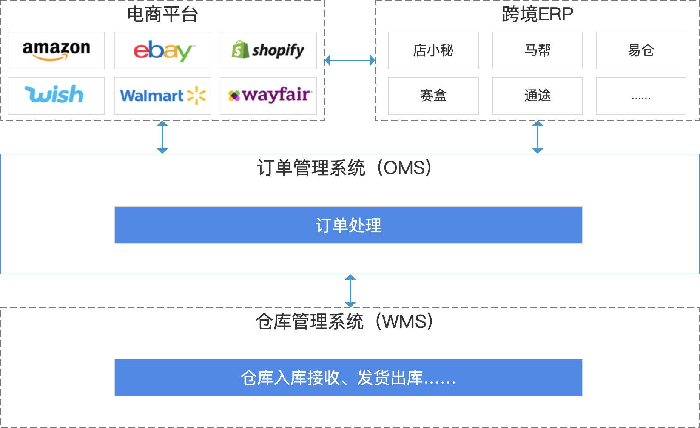
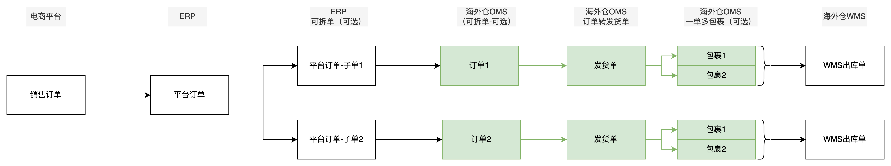
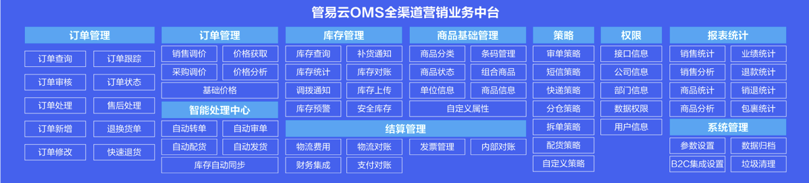
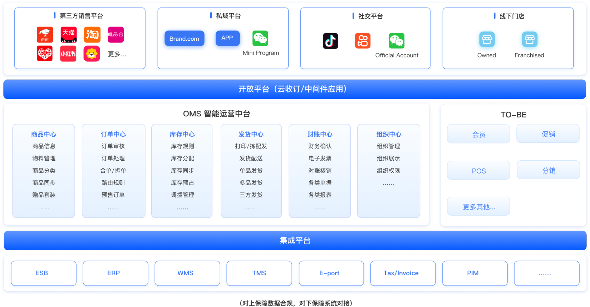
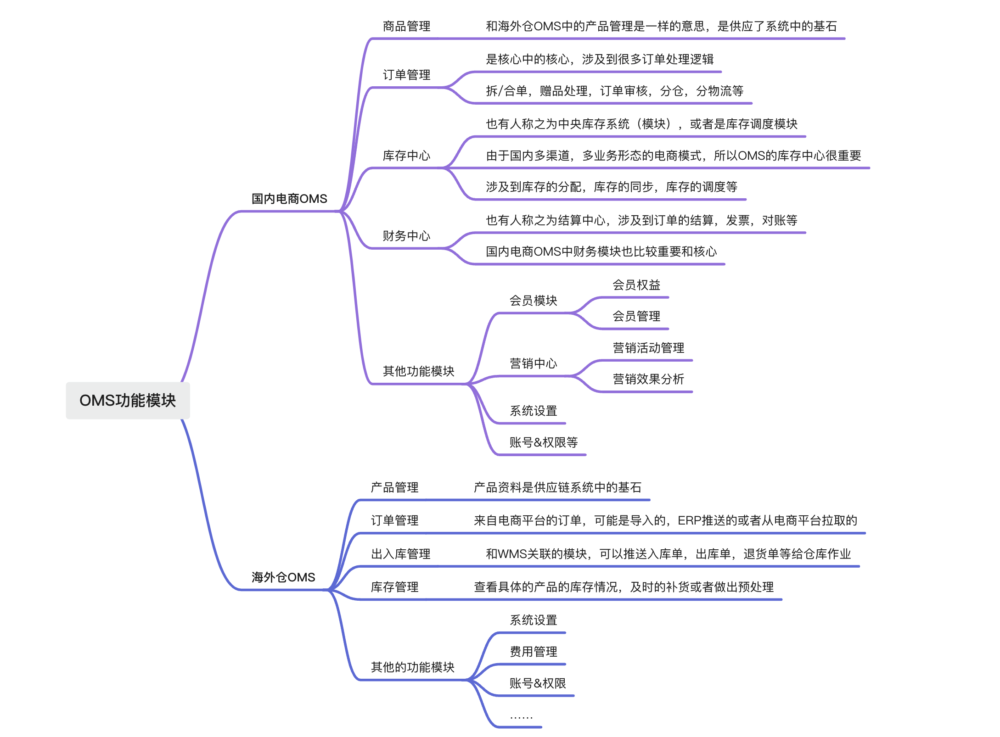
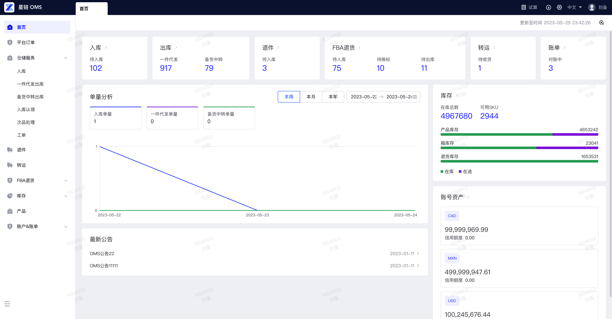
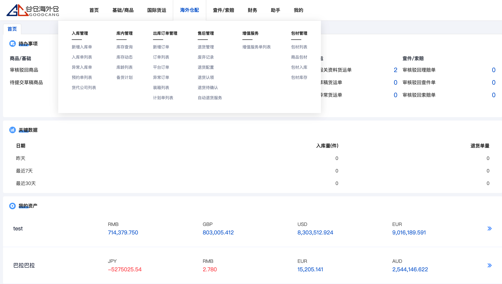
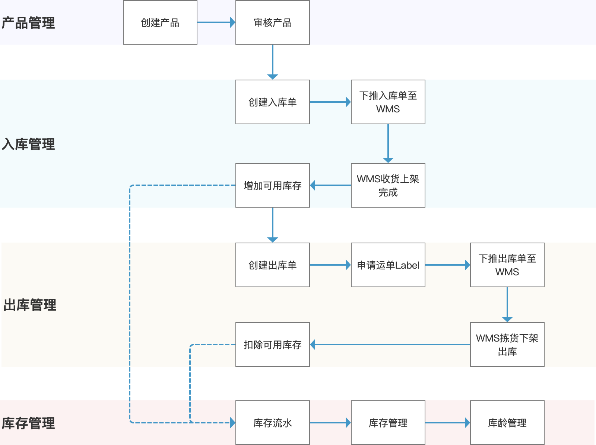

**什么是OMS?**  
OMS叫做订单管理系统（Order Management System），在不同公司，不同领域有不同的定义。  
主要原因就是因为大家对「订单」这个词的定义是有区别的，例如说点的外卖也叫做订单，滴滴打车也叫订单，寄快递也叫订单，然后在淘宝、天猫、京东电商平台购物也叫订单……  
当消费者在电商平台下单之后，商家需要及时处理这些订单，然后通过将订单推送到仓库，通知仓库安排发货，最后将订单中的实物运送到消费者手中。由于一个商家可能会同时在多个电商平台上经营自己的店铺，所以会发生多笔订单，这种术语一般称之为多渠道订单，商家如果要单独登录每一个平台的店铺后台去处理订单，效率肯定是非常慢的。于是乎，就有了OMS（订单管理系统），OMS可以打通多个销售渠道，然后自动将多个渠道的订单拉取汇总到OMS中进行集中化的处理，处理完成之后再将相应的信息回传到各个销售渠道中。  
本文中聊到的OMS是指对来自跨境电商平台的订单进行管理的一个系统，可以狭义的理解为「跨境电商OMS」，也可以理解为与海外仓WMS搭配使用的一套OMS。  
**不同领域的OMS的差异**  
跨境电商领域中的订单管理系统，这里的订单是指来自电商平台的订单，无论是直接从API推进来的，还是从ERP接进来，亦或者是手动创建/导入进来的，本质上这些订单都是来自于Amazon，eBay，Wish，Shopify等电商平台，所以很多订单数据结构和操作方式等都是相似的。  
  

  
跨境电商OMS系统粗略架构示意图  
跨境电商OMS的上游一般是电商平台或者ERP，即订单可以直接从电商平台中拉取，可以从各大主流跨境ERP中拉取，当然也可以直接在OMS中手动创建。  
当订单拉取到了OMS之后，可以在OMS的订单管理模块中进行拆合单，但是跨境领域中一般拆合单的频率比国内电商的要少一些，因为订单的来源和收件人等信息比较分散。  
OMS的订单如果拆单之后，往往会拆分成多个发货单，例如按订单商品所处的仓库去拆分，或者是使用的不同的物流方式去拆分。OMS的发货单可以对应一个或者多个包裹，如果是多个包裹，那就是一单多包裹（即子母件包裹），如果是一单一包裹那就是最简单和最基础的单包裹发货单。  
  

平台-ERP-OMS-WMS

  
  

平台-OMS-WMS

  
OMS的下游一般都是WMS，需要将处理好的一些订单数据推送给WMS进行实际的仓储作业。具体的WMS的内容，将会在后续的内容中讲到。  
而在国内电商领域中的订单管理系统，订单则是来自于淘宝、天猫、京东、苏宁、自营商城等，这类订单的数据结构和操作方式也是相似的。  
国内的电商订单管理侧重点在订单的处理，例如订单审核，订单退换货，拆合单，订单拦截，还有一系列围绕订单的策略：分仓策略、选快递策略、审单策略、库存策略等。  
  

  
截图自管易云  
  

截图自商派OMS

  
结合上述信息来看，跨境电商领域的OMS和国内电商领域的OMS其实有很多模块都是相似的、可以互相学习的，其实本质上都是一样的。不过由于国内电商和跨境电商有一些业务上的不同，所以也会导致OMS有一些功能模块的差别。  
1订单来源不一样，国内电商的丰富性比跨境电商的丰富性多很多，例如销售渠道多（多渠道），销售方式多（线上线下结合），销售品类多（商品种类多）；  
2履约要求不一样，国内电商的履约时效要求比较高，需要尽快完成履约发货；跨境电商不同的平台对履约时效要求不太一样；  
3仓库和物流形式不一样，国内电商有O2O，有纯电商，但都是在国内履约；跨境则涉及到不同的国家，不同的仓库和物流，所以有一些要求也不一样；  
  

国内OMS和海外仓OMS的区别

  
**本文重点关注的还是跨境电商领域的OMS**。所以如果大家发现有一些内容和自己对OMS的固有认知是有偏差的时候，不妨试着将两者全面对比一下，了解差异点分别是什么，这样也可以对OMS有一个更完整的认知。  
**海外仓OMS的主要功能模块**  
  

  
OMS功能模块  
即使都是跨境电商的OMS，但是由于业务不同，其中的功能模块也会有所不同。但是总体来说可以分成这么几大类：  
1订单管理相关，即平台授权，平台拉单，订单审核，订单选仓，选物流等；  
2仓储操作相关，即「进销存」，也就是入库单，出库单，库存管理这三个模块；  
3基础资料相关，例如产品（商品）管理，产品映射，仓库管理，物流管理等；  
4规则与策略相关，这是OMS很核心的一个功能，可以灵活应对复杂多变的业务场景；  
5计费相关，例如账户资金，账户流水，账单核对等，这个是指客户使用了海外仓的服务之后所产生的费用；  
  

XLWMS

  
  

谷仓OMS

  
具体的功能模块如何设计，有哪些难点和踩坑点，会在后续的文章中展开，此处还是以科普基础知识为主。  
海外仓OMS一般都是给使用海外仓服务的**客户**来使用的，作为一个偏「前台」的产品，功能和模块都会做的轻量化一些，所以上手很方便。  
对于产品设计者而言，也需要特别注意这一点，尽量操作简洁且易于上手，不要给客户造成太高的使用成本。  
**海外仓OMS的核心流程**  
  

  
OMS的核心流程  
海外仓OMS的核心流程其实就是传统意义上的「进销存」，围绕着货品的创建，货品入库和出库管理来展开的。  
对于跨境电商领域而言，很多时候大家都会用ERP而不是OMS，OMS反而是和海外仓WMS配套的居多。  
当某个电商卖家需要使用第三方海外仓的时候，就需要使用OMS来对订单进行管理，然后将数据推送到WMS中。  
跨境电商ERP和海外仓OMS相比较，主要的区别有以下几个点：  
1跨境ERP基本都有刊登功能，而OMS基本上是没有的；  
2跨境ERP会有采购模块，而OMS基本上是没有的；  
3跨境ERP的核心是在一个管理系统中完成大多数的操作，而OMS基本上还是以仓库发货为核心；  
4跨境ERP会有成本，利润的核算，而OMS中则主要是以仓库作业费用为主，不太会核算利润；  
5OMS的下游是WMS，而跨境电商ERP的下游可能是内部是内部的仓储物流模块，可能是其他OMS，也可能是其他WMS；  
除了以上几个关键的区别之外，还会有很多其他模块的区别，感兴趣的朋友可以自行了解。  
简而言之，如果是对这两个系统不太熟悉的朋友，可以大致粗略地把海外仓OMS理解成海外仓WMS的客户端，是给使用海外仓仓储服务的客户去使用的一个前台系统。**OMS的侧重点是在仓储侧的作业指令推送和管理，而ERP则是全流程、全业务面的覆盖**。