供应链领域有一个“三流”的说法，分别是“物流”，“资金流”，“信息流”。其中“物流”是指物品的流动，也可以理解为货物的流动，货物只有流动起来了才会产生交易，才会产生价值。  
货物是供应链管理中的血液，没有货物那么供应链也就没办法串起来了，于是乎，在很多供应链系统都会有相关的管理模块，用来管理这些货物的基础信息，以及一些业务配置等。有些称之为“货品管理”，有些称之为“商品管理”，还有一些称之为“产品管理”，虽然名词不一样，但是表示的意思都是一样的。**所以如果在本文中看到了一些不一样的名词，也不要过于纠结，都是指的一个东西。**  
**电商后台商品管理与OMS的商品管理**  
对于电商后台的商品管理系统而言，类目，属性（基本属性，销售属性），品牌，运费模板，扣除库存的节点等都是老生常谈的话题，属于一套非常标准化的设计方案了。  
但是对于跨境电商的OMS来说，这些数据大多数都没什么用处或者用处不大。上一节说到，跨境电商的OMS上游一般是电商平台或者ERP，而下游是WMS，所以OMS的商品管理形态需要综合考虑上下游及其他业务来决定。  
类目是为了满足电商平台海量的商品管理和便于用户浏览查找而设置的，所以一般会分前台类目和后台类目。在电商后台的商品管理中，所有的商品都需要挂靠到合适的类目下，然后一切信息维护好了之后再「上架」该商品，用户在电商前台可见，可下单。而在跨境电商领域中，「上架商品」的行为一般是在ERP中来完成，行业内称之为「刊登」，也就是将商品上架到店铺中。  
  

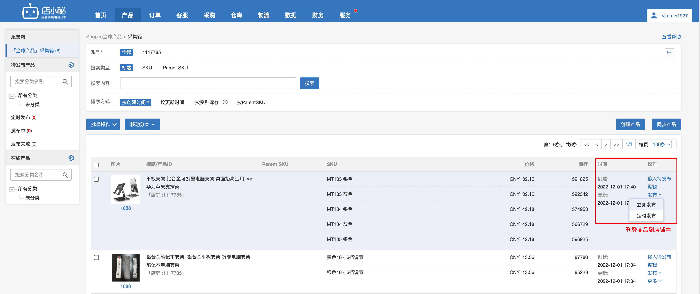

店小秘ERP刊登

  
属性一般会分为基本属性和销售属性，基本属性是SPU维度的属性，属于一些通用类的属性，例如长宽高，重量，产地，名称，品类之类的；而销售属性则是SKU维度的属性，例如规格信息，SKU编码，价格，可售库存等。在跨境电商ERP中，有少数公司采用了SPU+SKU的方式来管理商品，但是大多数公司都是采用直接管理SKU的方式，因为简洁方便，也便于用户操作。**同样的，OMS需要承接ERP中的一些数据，所以在选择商品管理的方式时，也会采用直接管理SKU的方式。**  
  

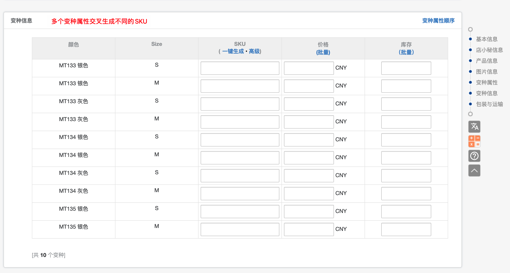

店小秘商品刊登详情

  
而品牌，运费模板等也基本上是作用于电商前后台，对OMS来说基本上没啥用处。  
经过上述简单的对比，我们会发现跨境电商OMS的货品管理模块和电商ERP或者电商后台商品管理不太一样，它更加简单，更加聚焦在订单履约，与仓储物流等模块的业务衔接。  
跨境电商OMS的货品管理模块一般可以分成三大模块：  
●基础信息；  
●报关申报（贸易）信息；  
●其他信息；  
基础信息就是常见的产品名称，SKU，尺寸，重量，规格型号等。而报关信息则是海关编码，申报中英文名，申报价值，原产地，其他报关要素，是否带电等。其他信息则是一些图片，产品备注，品牌，计量单位，包装信息等，其他信息一般都不太重要，可填可不填。  
  

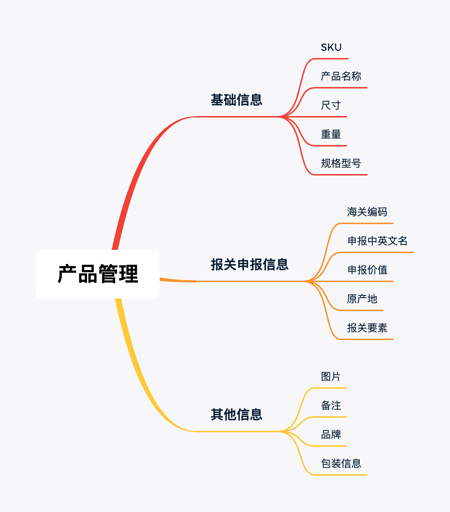

  
货品管理  
所以只要完成了基本信息和报关申报信息相关的内容，整个商品的雏形基本上就搭建好了，还是算比较简单。  
  

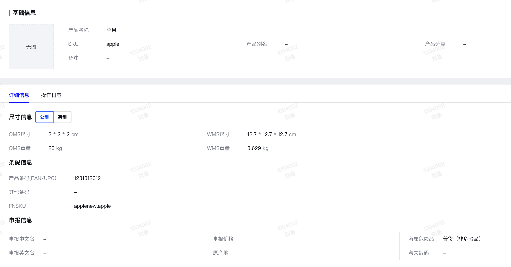

OMS的货品信息主要字段

  
**货品条码信息和申报信息的作用**  
在OMS的货品管理中，有两个比较重要、需要特别注意的模块，分别就是条码信息和申报信息。  
很多做OMS的产品经理，由于没怎么接触过仓库的实际作业场景，所以在条码这一块的产品设计往往会想得比较简单，只是简单的让用户输入一串条码即可，但实际上条码信息和后续的仓库作业是息息相关的，需要先掌握具体的仓库使用场景，才能更好地设计出对应的条码信息字段。  
**1****条码信息**  
很多第一次接触仓库知识的朋友可能都会在条码这一块翻车踩坑，所以我觉得很有必要对条码的知识进行一波科普讲解，帮助大家避开一些很容易踩的坑，只要掌握了条码的核心知识，基本上是一通百通的。  
仓库中常见的条码就是一维码，少数场景下会用到二维码。一维码和二维码都可以包含一些信息，但是二维码包含的信息量级更大，能支持的字符类型也更多。  
  

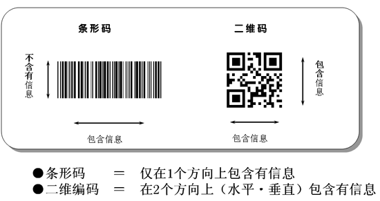

  
下方的是一个条形码，它是一个一维码，如果用手机扫描的话，应该可以知道它背后的字符是“vitamin”  
  

  
下方的是一个条形码，它是一个二维码，如果用手机扫描的话，应该可以知道它背后的字符是“vitamin”  
  

  
无论是条形码还是二维码，本质上都是将一些字符信息写入到图像中，然后使用相机或者扫描器解析的时候，可以拿到这些字符信息。通俗点来说，就是把字符信息转化为图片（条码/二维码）叫做编码，反过来扫描图片（条码/二维码）就叫做解码。  
拿条形码来举例，生成条码的时候需要进行编码，于是就有一个“编码规则”的选择，不同的编码规则生成的条码是会有一些差异的，一般来说，条形码的生成规则常见就是“Code128，EAN，UPC，ISBN”等。  
  

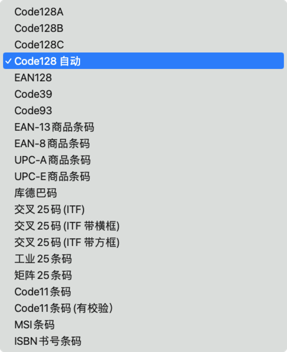

  
Code128的编码方式有三种，分别是：  
●Code128A  
●Code128B  
●Code128C  
这三种的区别，可以看我之前写的文章：  
  

[Code128相关知识普及](https://www.yuque.com/jiaowovitamin/uizu4s/ueabiz)

  
一般来说，默认使用Code128 Auto即可，Auto是根据数据内容自动选择A/B/C代码集，以最短的方式编码图形。  
  
如果使用了比较冷门的编码方式生成条形码，可能会导致扫码枪不支持，就会无法识别和解析。例如，有一些扫码枪是不能支持二维码的，就会导致无法扫描解析出结果。  
  

  
  
了解了上面的条码基础信息之后，我们再来看看常见的OMS或者WMS在条码信息这一块很容易踩的坑是什么，以及对应的解决方案是什么，我也整理好了。  
  

| 序号 | 踩坑点描述 | 解决方案 |
| --- | --- | --- |
| 1 | 编码太长，导致生成的条形码太密集或者也太长，打印出来的时候不能完整的打印，比例会有问题 | 在创建一些编码字段的时候，就要对字段进行长度约束，避免用户输入太长的条码。例如EAN码一般来说是13位，那么我们就可以限制用户最多输入15或者20 |
| 2 | 有一些字段的条码生成失败了或者是出现了一些“？？”符号 | 条形码编码的时候是有编码规则的，编码规则中会告知有一些字符是不能进行编码的，例如汉字或者一些全角的标点符号。所以在创建编码字段的时候，要对字段的字符类型进行限制 SKU支持字母、数字、符号(空格 - & _ # * () % @ ! . = / " ' < > +) |
| 3 | 仓库中有一些商品是二维码，但是用PDA扫描的时候无法识别 | 扫码枪或者PDA等设备是有不同的规格属性的，有一些设备不支持解析二维码，所以仓库在采购设备的时候要注意这个点 |
| 4 | 有一些条码识别出来之后感觉和原编码字段是一样的，但是搜索的时候就是查询不到信息 | 条形码一般是支持空格的，所以在生成条形码的时候要注意看首尾是否有空格，一般来说首尾空格要去除，否则识别出来的内容在查询的时候很容易发现查询不到信息 |
| 5 | 条码重复，导致一个条码可以查询出多个信息 | 一般来说一个商品会有一个唯一的SKU，但是不同的货主的商品可能会重复SKU。 一个商品可能会有多个不同的产品条码，但是不同的货主的商品可能也会有重复的产品条码。 所以SKU在什么场景下具有唯一性，产品条码在什么场景下具有唯一性，都是需要结合业务去仔细揣摩考究的 |

**2****申报信息**  
对于国内电商场景来说，由于不涉及货物的进出口，所以基本上ERP或者OMS或者WMS都是没有申报信息这个字段的，这个是属于跨境业务专属的字段。跨境电商如果从流向来划分，可以简单地分成“跨境进口”和“跨境出口”，无论是进口还是出口都涉及到了海关申报的环节，所以都需要申报信息。  
对于跨境ERP来说，可能会涉及到一些头程出口申报的业务，所以需要在产品资料管理模块提前维护好申报信息；也有很多铺货型卖家会使用跨境直邮的方式出口，在获取跨境直邮小包物流面单的时候，也需要录入对应的申报信息，所以需要提前维护好这些信息。  
  

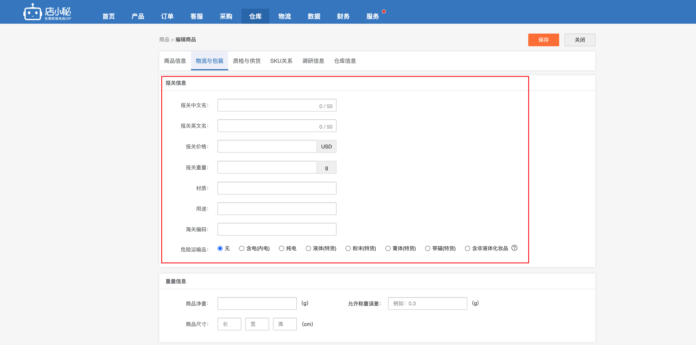

店小秘ERP的报关信息

  
  

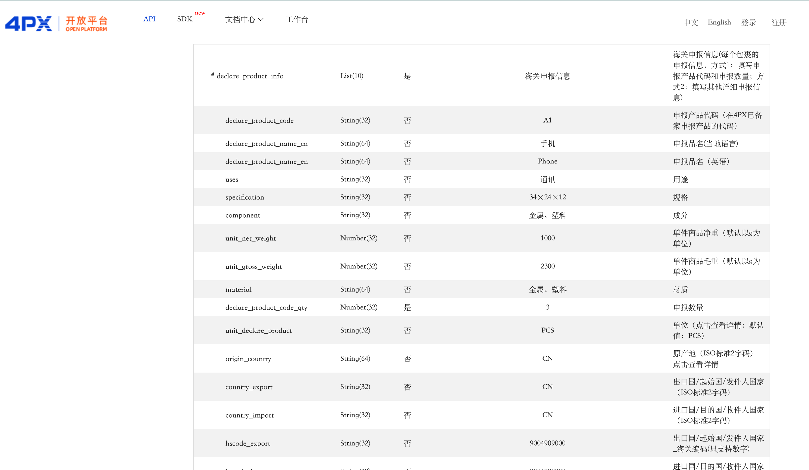

4PX的直邮物流接口

  
  

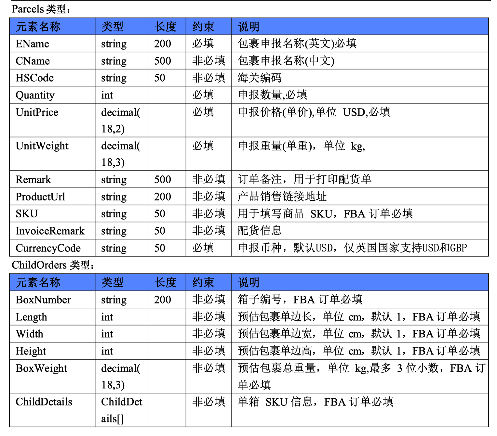

云途直邮物流的接口

  
在OMS中，需要维护的申报信息字段主要取决于使用的一些跨境物流的接口要求，本质上也是海关申报的一些要求，不过由于不同的出口申报方式对字段的要求有一些细微的差别，所以不同的ERP或者OMS对于用户要录入的一些申报信息也会不太一样。一般来说，OMS不会强制要求必填这些申报信息，但是这几个字段是常见的。  
●海关编码  
●原产地  
●申报价格  
●申报品名  
  

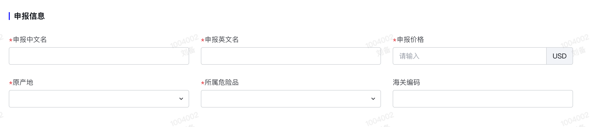

XLOMS

  
  

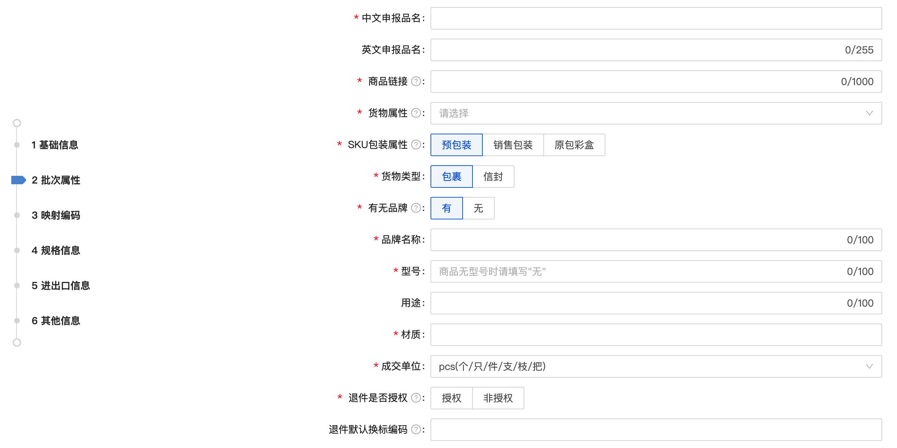

谷仓OMS

  
  

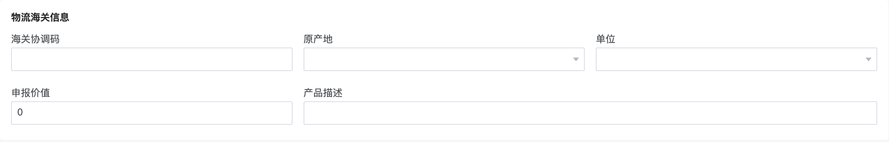

Shipout OMS

  
**货品的审核**  
货品在OMS创建好之后，一般需要提交审核，通过审核之后才可以正常使用，用来创建入库单。  
此处的审核流程需要特别注意，核心点就是：**到底谁来审核？怎么审核？**  
对于第三方海外仓来说，用户在OMS端创建好货品并提交审核之后，**海外仓运营人员**（一般是在国内）就会通过站内信或者其他方式收到通知，然后及时去审核用户创建的货品信息，一般会重点关注申报相关的信息和一些易错的信息。  
对于自建海外仓来说，运营人员创建好了货品之后可以提交给领导层审核或者仓储部门的专员来审核，也可以不审核，直接创建后就可以正常使用（不过此模式比较少见）。具体的审核流程可以自己根据业务来定义，按我过往的经验，我建议还是要引入审核，因为货品毕竟是很关键的基础数据，最好在源头上控制好错误，避免造成更大的损失。  
对于其他类型的海外仓来说，有可能运营人员和仓储人员都是同一批人，也就是说客户创建好货品提交审核之后，审核人员直接就是仓储作业人员，中间没有运营团队。于是审核就会有一点点奇怪，因为OMS的客户可能会用到不同的仓库，但是不同的仓库都需要单独审核一遍。  
**如果有运营团队，那么应该运营团队直接在某个运营后台一次性审核就够了，而不是不同的仓库都需要审核一遍**。这样可以减轻仓库的工作量，也能确保多个仓库可以同时接收到可以使用的货品数据，用户也可以快速进入下一步的作业流程。  
  

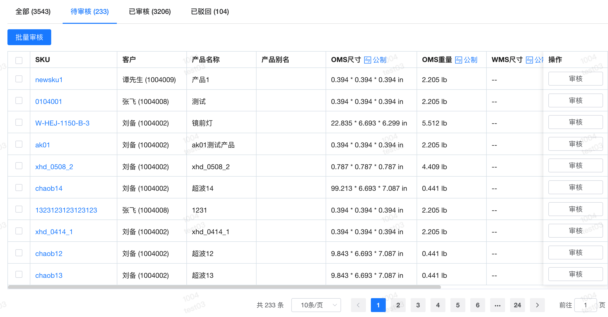

运营系统审核产品资料

  
  

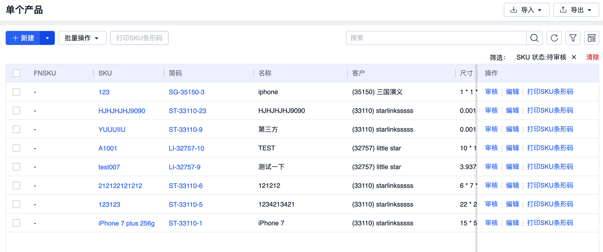

WMS审核产品资料

  
**货品的同步**  
货品资料通过审核之后就可以直接使用了，可以在OMS端创建入库单，然后推送到WMS中，仓库就可以根据到货的实物来收货了。  
**不过在收货的时候就会遇到一个问题，那就是货品资料好像不够齐全，有些业务不能跑下去。**  
因为入库单主要是两大块的内容：一个是入库单主体部分，另一个就是入库的货品明细。货品明细中一般只会告诉仓库，某个SKU这次入库了多少数量，然后就没其他信息了。  
而仓库在实际收货的时候，除了需要知道SKU和数量之外，还需要知道货品关联的条码，货品的尺寸和重量，产品是否需要扫描序列号等，这些信息在入库单中是没有的。  
所以在OMS创建好货品资料之后，需要及时的通过接口将数据分发到不同的WMS中，同时也可以将数据分发到TMS或者BMS中，因为这些系统或者模块可能也会需要使用货品资料。  
  

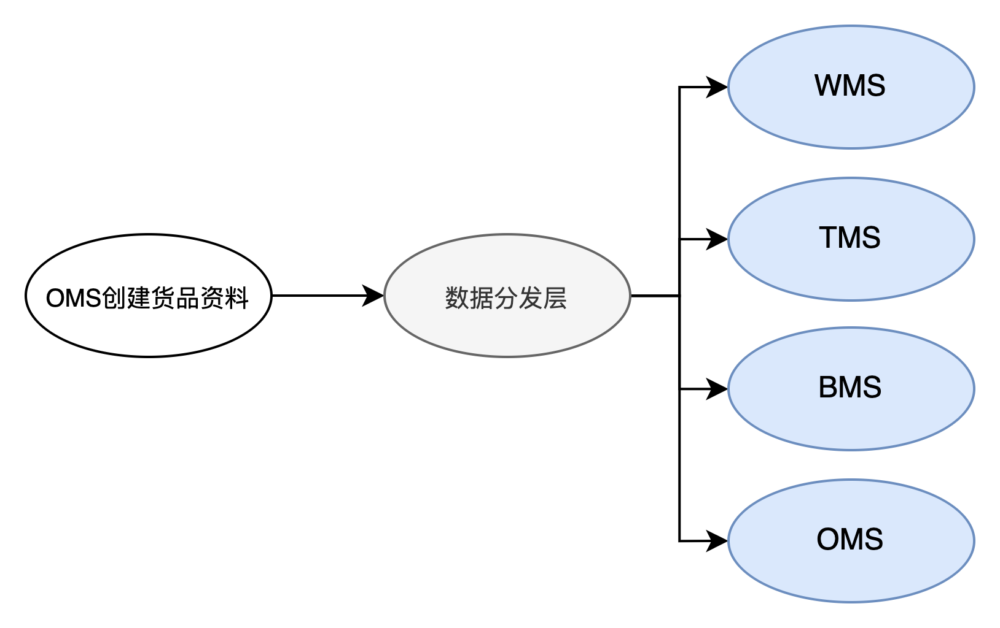

  
所以在WMS也会有对应的货品资料查看的页面，而且一般只有查看权限，没有编辑权限。不过WMS可以基于推送过来的货品资料做一些控制策略，以达到精细化管理仓库作业的要求。  
  

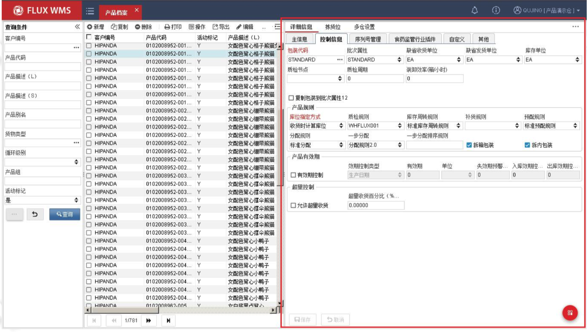

富勒WMS的货品控制信息

  
  

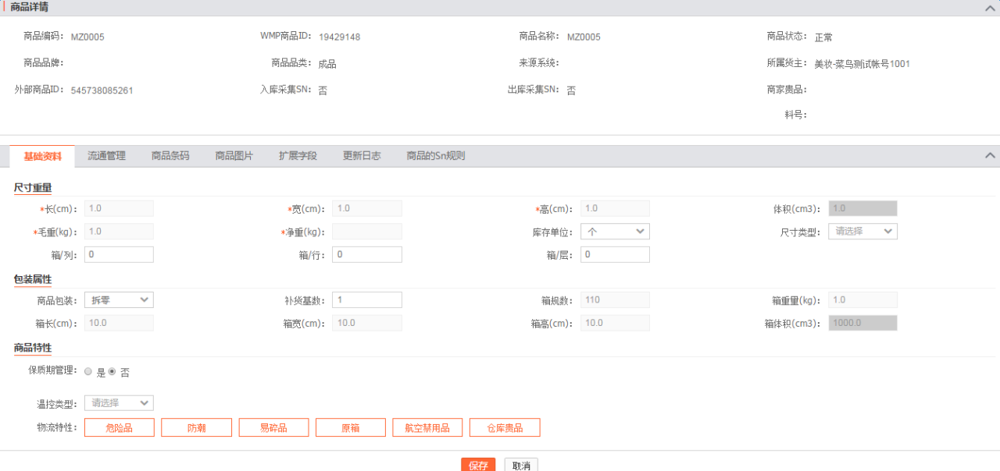

菜鸟WMS的货品控制信息