对于跨境电商中的海外仓OMS，其实严格来说不能算是OMS，只是一个WMS的客户端而已。它承担了很多功能和业务场景，综合来看反而订单管理这一块做得比较弱。真正的跨境OMS应该是跨境ERP中的订单管理模块，它才和国内电商OMS的订单中心的内容很相似，都有拉单，订单审核，拆合单，一系列的订单规则等。  
  

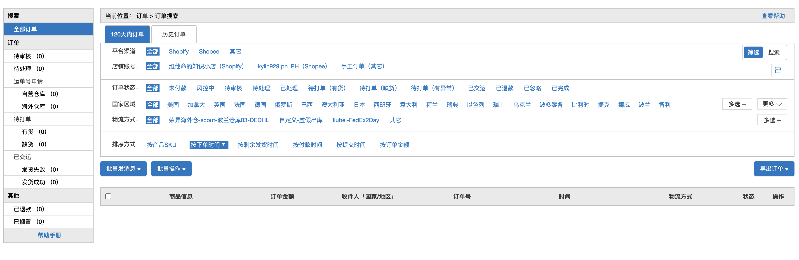

店小秘ERP的订单管理模块

  
  

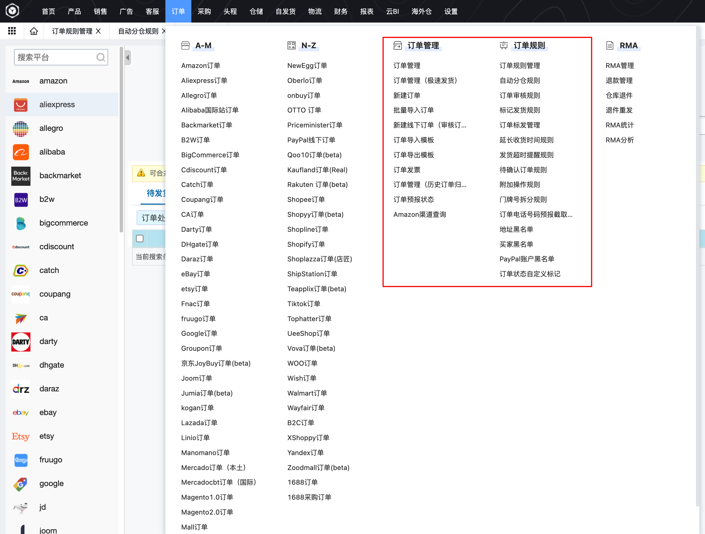

易仓ERP的订单管理模块

  
也就是说海外仓的OMS虽然是有订单管理模块的，但是做得不算重，也不会很复杂，只能简单处理一些订单的需求，反而有很多内容是和WMS进行搭配的，例如仓储管理中的，入库，出库，客户退货，FBA退货入库等，这些都是国内OMS，或者说传统概念中的OMS所不具备的内容，所以我认为海外仓OMS其实称之为“**WMS的客户端**”应该是更准确的。  
  

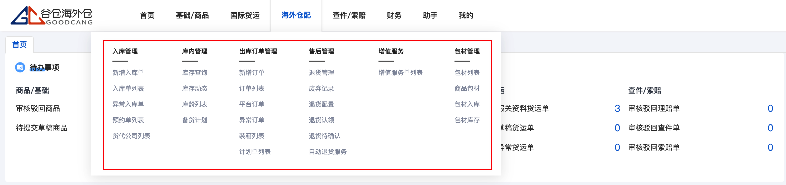

谷仓OMS

  
  

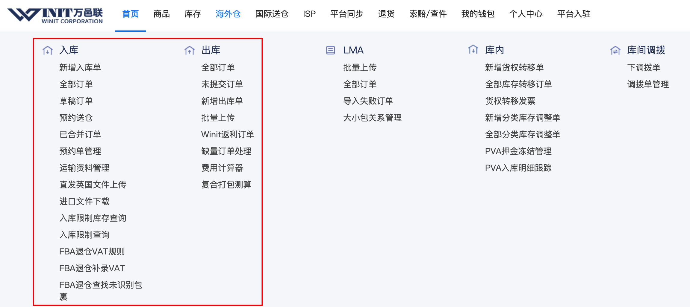

万邑通OMS

  
  

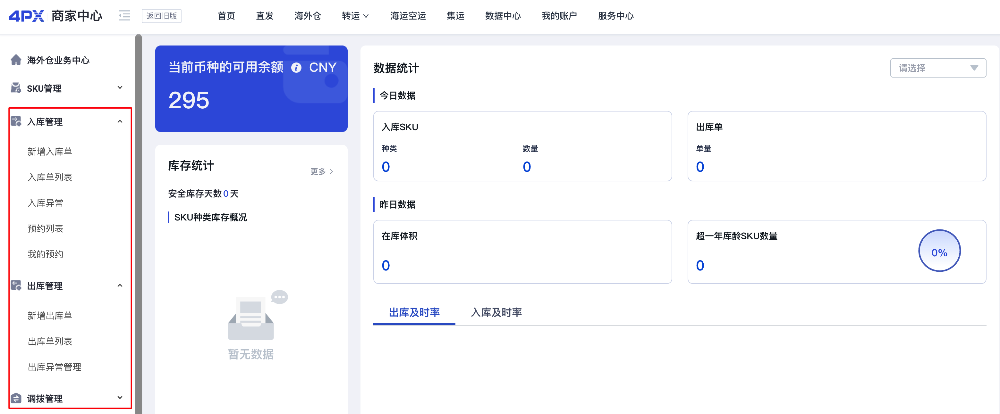

4PX OMS

  
对于海外仓OMS来说，主要承担的作用就是打通上下游，上游是第三方ERP或者电商平台，而下游就是WMS，所以OMS有很多内容是和WMS息息相关的，本文就来介绍一下海外仓OMS创建入库单并推送给WMS作业这个场景的业务知识和产品设计。  
  

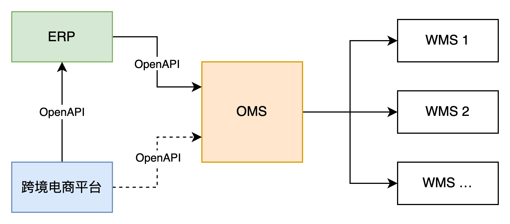

OMS的作用是打通上下游

  
**头程入库的几种方式**  
头程是将货物从国内运输到海外仓的整段过程，抛开运输方式和运输国家等外在的限制，单从系统的数据交互来看，一般会有这么2种头程入库的方式。  
●国内直发头程入库；  
●国内中转头程入库；  
从系统数据的交互角度来看，国内直发头程入库就是创建的入库单信息直接推到海外仓WMS中，然后用户再选择合适的货代及运输方式等，将货物送到海外仓库中，供海外仓入库。货物发出之前，除了要符合出口报关的一些要求之外，也要满足海外仓收货的要求。例如FBA仓库的货件计划（入库收货计划），就需要用户提前贴好FNSKU和箱唛，然后预报给FBA仓库端。  
国内中转头程就是先将创建的入库单信息推送给国内的集货仓（中转仓），然后将货物送到仓库。由该仓库帮忙做一些预检查，贴标或者装箱打板等，最后再将该入库单信息推送给对应的海外仓。接着集货仓（中转仓）帮忙订舱，拼柜，处理一系列出口报关的流程等。  
以上两种方式各有优劣，不同的海外仓能提供的服务不一样，所以会导致客户选择不同的头程方式。  
对于第三方海外仓来说，例如一些比较知名的海外仓（谷仓，万邑通，4PX等）都会有头程代发这一块的业务，客户先将货物送到他们的国内仓，然后再由国内仓将数据推送给自己的海外仓，当然头程相关的业务也要负责，这一块的费用需要向客户收取。  
而其他一些中小型的第三方海外仓或者自营的海外仓，可能就是让客户自己联系合适的货代，然后从货代再将客户的货物从国内运输到海外仓中，而不走中转代发头程的方式。  
**在本文中提到的关于OMS的仓储模块的入库设计方案，主要是针对「国内直发头程」的业务模式。**「国内中转头程」这一块我接触的不是很多，所以在此就不多展开了。  
**入库单的管理**  
在国内的电商仓储中，入库单的创建一般都是在ERP中或者02-采购系统中，OMS一般都是重点用来处理订单出库的。  
而在跨境电商仓储中，由于几乎不会有直接采购到海外仓的业务，所以入库单的创建一般都是会放在OMS中，而且创建的入库单大多数是以调拨（备货）入库为主。  
  

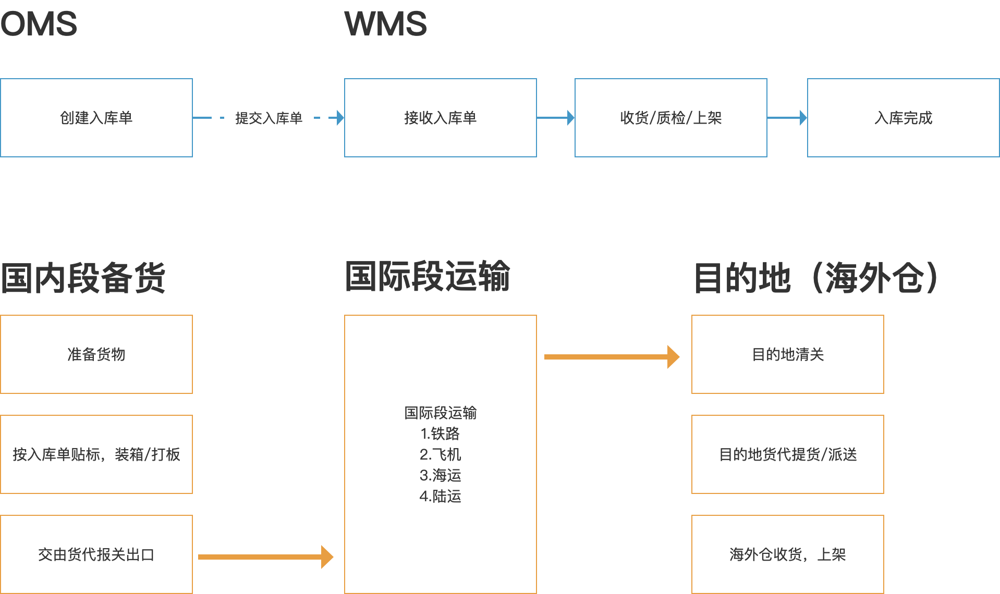

  
信息流和业务流  
如果从系统的角度来看，OMS的入库单其实算是比较简单的一个模块。  
用户创建入库单，选择需要入库的仓库，接着填写入库的明细，填写准确的装箱单，然后补充些关联信息就可以推送信息给WMS了。  
系统上创建好入库单之后，还需要准备实物，按系统填写的内容装箱或者先装箱后再填写到系统中，接着一切就绪之后就可以联系货代进行出口报关相关流程。  
出口报关的业务一般都会线下做，所以在此也不展开了。当出口报关的手续和流程都走完之后，业务人员可能还会在OMS的入库单中补充“船期”或者“柜号”等信息。  
  

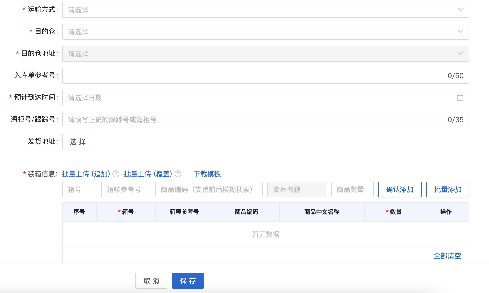

  
截图自谷仓OMS  
如果是国内电商仓储的入库单创建，可能会更加简单一些。因为运输方式简单，也不需要出口报关等，所以只需要填写入库的仓库，然后对应的商品及数量即可。  
  

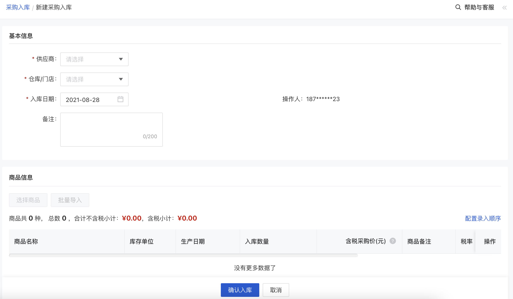

  
截图自有赞  
  

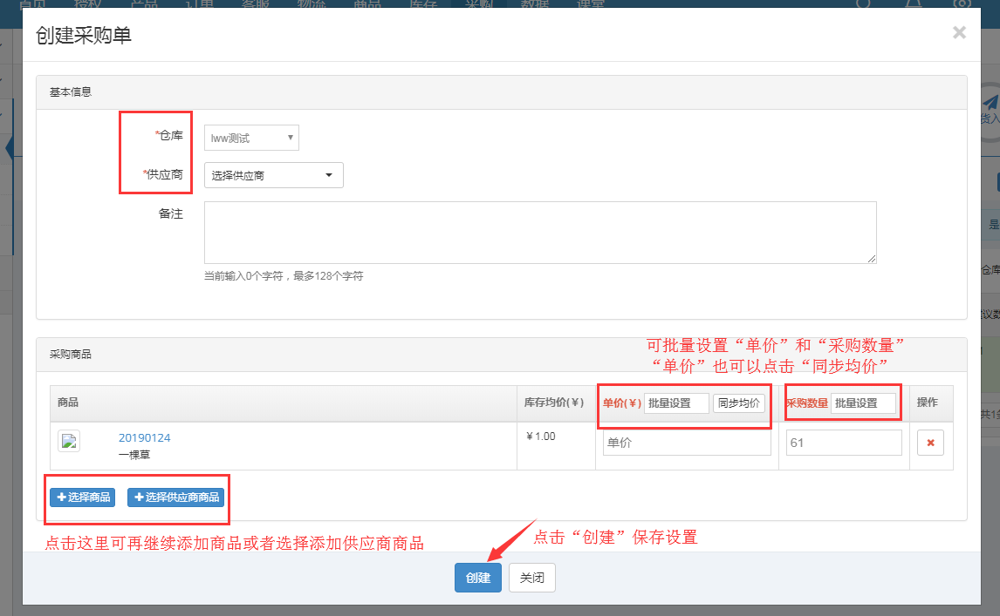

  
图片来源芒果店长  
**海外仓OMS入库单的产品设计**  
**入库单的单据结构**  
刚开始做OMS的入库单功能的时候，没有考虑仓库收货的问题，只是让用户填写了SKU和数量，类似于下面这样的结构。  
  

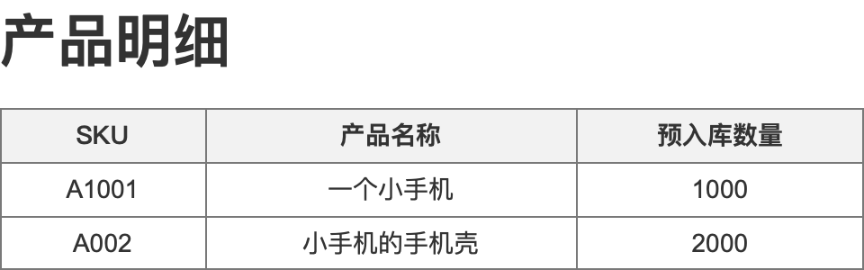

  
SKU-数量  
但是这样会有很明显的弊端，就是仓库收货的时候，如果有多个入库单同时到达，仓库很难识别到底哪一批货对应哪一个入库单。货物可能都是整箱或者整个卡板送达仓库的，甚至会有分批次陆续到货的情况出现，仓库每次看到入库单的时候只能看到SKU和数量，并不能很好对应具体的实物。  
于是后续经过调研了之后，发现整个行业已经陆续开始普及FBA箱唛收货的方式来做入库单了，所以我们就把入库单的产品明细改成了这样。  
  

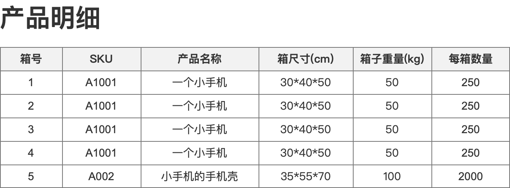

  
箱-SKU-数量  
所以目前主流的海外仓OMS的入库单单据结构都基本上改成了下图所示，引入了一个装箱明细的内容。  
  

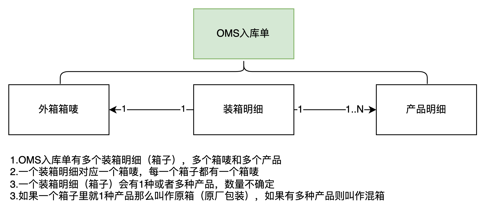

单据结构图

  
对于海外仓OMS来说，创建入库单的时候不是直接以产品明细为粒度管理，而是会在产品的基础上加一个箱子的维度。将产品装在箱子中，然后每个箱子贴上对应的箱唛，当货物送到海外仓之后，可以通过外箱的箱唛快速定位入库单和对应的箱子中的产品明细，亚马逊的FBA仓库就是这样玩的，目前主流的海外仓也是这样玩的，这点和国内的仓储入库要求是不一样的。  
  

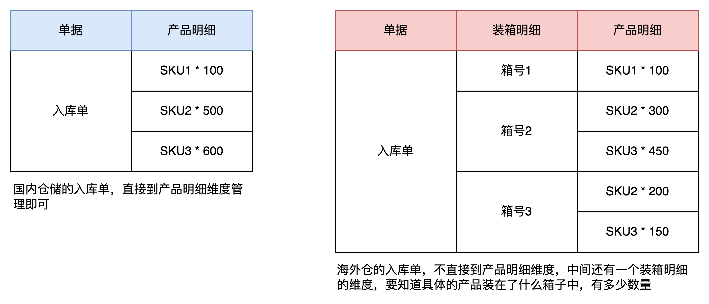

  
当创建好了入库单之后，需要打印出对应的箱唛标签，然后贴在对应的箱子上，需要注意下箱唛标签和实物的对应关系，所以在贴码的时候要注意核对，别搞错了。这一部分比较费时间和人力，所以一般都是会在国内仓库去提前做好，目的就是为了降低海外仓的操作成本。  
  

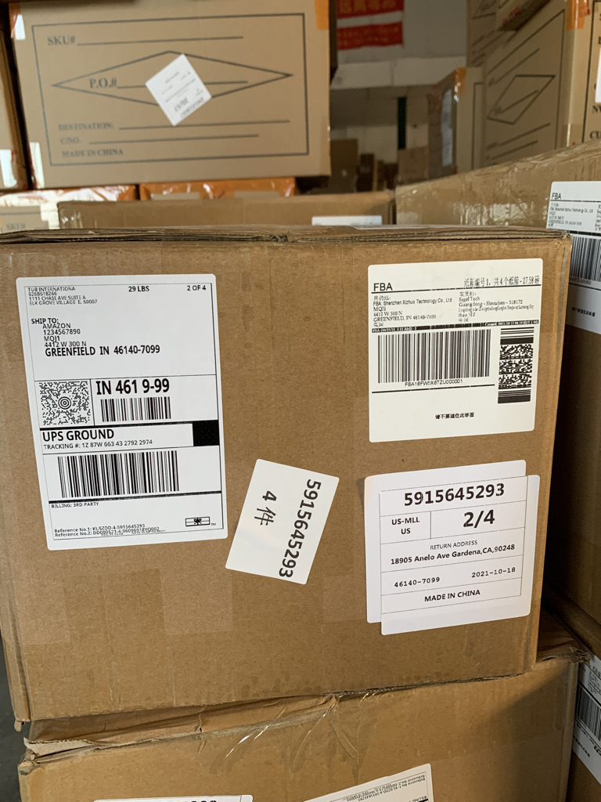

亚马逊箱唛

  
  

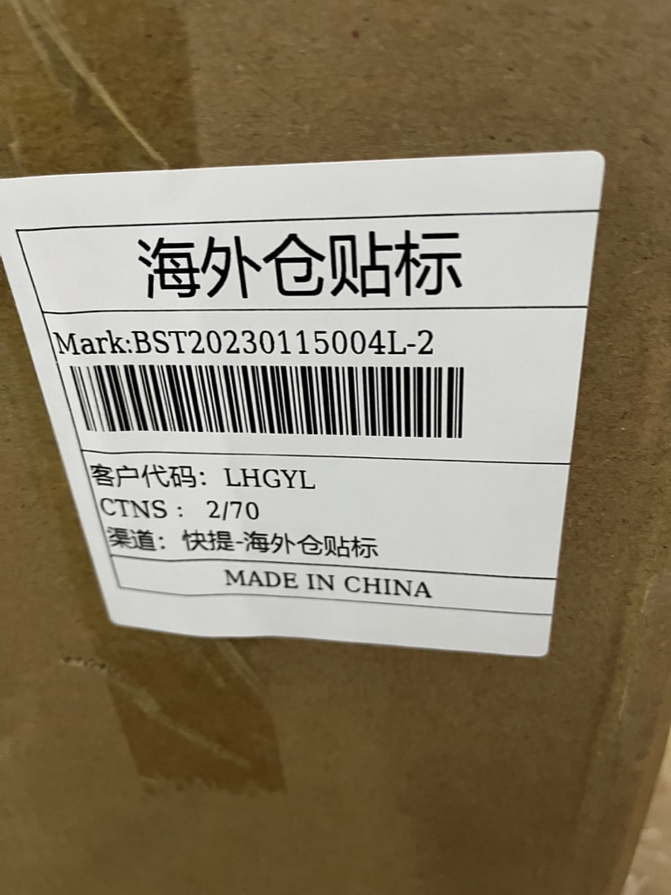

海外仓箱唛

  
上面提到创建入库单的时候要按箱为单位创建，有利于海外仓收货的时候识别。除此之外，还有一个好处，那就是支持：**多批次收货。**  
假如一个入库单有10箱，但是由于运输的问题，会分多个批次陆陆续续到达海外仓。仓库可以通过箱唛号实现多批次收货，而OMS的客户也可以根据箱唛号跟进具体的收货情况。  
所以这里就引申出了另外一个点，那就是：**海外仓收货最好是要支持多批次，这样能提升用户体验。**  
如下图所示，OMS端的客户可以清晰地看到，一个入库单中，还有第3箱和第4箱没有收货。有了这种细项的数据，就可以快速定位到底是运输问题，还是仓库收到了还没有点数处理。  
  

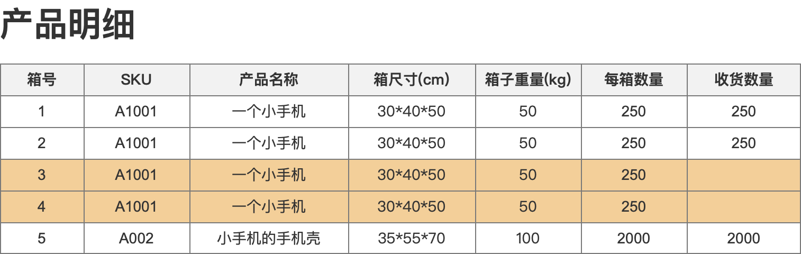

  
按箱唛来跟进多批次收货  
**入库单的状态流转说明**  
  

状态流转图

  
1刚创建好的入库单是草稿状态，可以进行修改，删除，取消，打印箱唛等；  
2在草稿状态的入库单可以提交到WMS中，单据推送成功之后，OMS的入库单状态变成为“待入库”；  
3当仓库开始收货之后，则会通知OMS变更状态为“收货中”，此时就不允许取消入库单了；  
4当仓库全部收货之后也会通知OMS变更状态，改成“已收货”；  
5当仓库全部上架之后，则会通知OMS变更状态为“已上架”，同时OMS也需要将“在途库存”转为“可用库存”，相当于在途库存减少，而可用库存增加；  
  

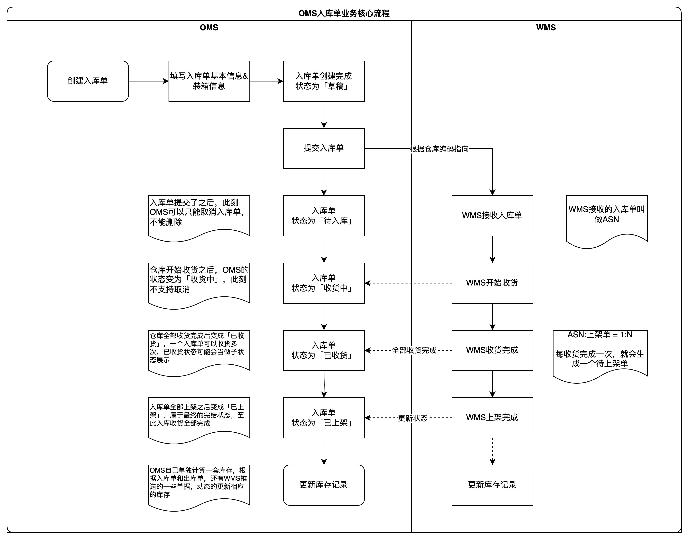

业务流程图

  
**在途库存的变化说明**  
在途库存是一个很容易被大家忽视的环节，有些时候甚至会感觉这个数据没啥用，然后在设计一些逻辑的时候直接忘记了还有这么一回事。  
关于在途库存的资料，我在网络上也找了挺久的，结果发现好像很多文章都写的很浅或者很复杂，搞得理解起来特别难受。在此我总结一下我个人认知范围内，跨境电商海外仓中的在途库存一般是怎么用的，仅为个人观点，大家注意辩证性看待。  
如果是想简单地理解在途库存，那么直接从最常见的两种产生在途库存的方式来分析就够了，它们分别是：  
1调拨在途；  
2采购在途；  
调拨在途就是从A仓库调拨到B仓库的过程中，产生的在途库存。对于A仓库来说，货物已经离开了A仓库，所以A仓库的库存是已经扣减了的；而对于B仓库来说，货物即将到达，但是还没有入库上架，所以不能算作可用库存，只是在途库存。  
采购在途和调拨在途有很多相似点，都是从某地发到另外的一个地方。只不过采购涉及到一些和外部供应商结算的问题，所以稍微有点麻烦。对于即将接收采购货物的仓库来说，货物还在路上并没有上架，所以也不能算可用库存，只是在途库存。  
在途库存可以预估未来的一段时间内的库存量，用来指导销售的决策；在途库存也是会占用资金成本的，所以需要重视和关注。  
对于跨境领域来说，由于备货到海外仓的过程（头程）时间特别长，所以在途库存对卖家来说就显得尤为重要了。除了需要统计好各个海外仓的实际可用库存之外，还需要关注备货在途的这一部分库存，及时做好库存的计划方案。  
对OMS的来说，在途库存的定义一般是指**入库单提交到仓库后，但是仓库还没有收货上架前这一段时间的库存总数**。  
如果仓库实际上架了之后，在途库存就会转化为可用库存。如果仓库实际收货少于预报数量，却又强制结束了入库单，那么在途库存也需要相应的减少。  
因为入库单已经关闭了，在途库存应该按实际上架的数量转化为可用库存，而多出来的部分因为不能再继续上架了，所以这部分应该作废释放。  
  

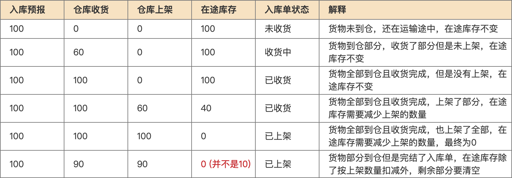

  
在途库存变化示意图  
对于OMS来说，重点需要关注入库单状态为“已收货”到“已上架”之间的入库单的SKU的数量，这一部分需要根据仓库反馈的实际上架数量来动态调整在途库存的数量，最后再特别注意一些差异收货和差异上架的节点即可。  
**小结一下**  
跨境电商OMS的入库单模块比较简单，只要理解了头程和尾程的概念，再结合海外仓实际作业的场景，以国内采购电商为参考，要设计出一套符合自身业务的入库单管理模块也就很快了。  
跨境电商OMS的本质是海外仓WMS的「用户端」系统，所以任何模块功能的设计都需要结合WMS的作业流程。  
如果你对WMS的作业流程不熟悉的话，就不太能理解为啥OMS需要这样设计，为啥OMS的某些单据需要审核，需要同步……  
所以，如果你想要做好OMS的话，不妨先去学习了解一下WMS的内容。后续我们会在第三章节详细讲解WMS相关的业务知识和产品设计。