**海外仓OMS的订单模块**  
上一篇讲到，海外仓OMS严格来说不是大家理解的那种OMS，而是一个WMS的客户端，它包含了很多功能，不仅仅是只有订单管理。  
对于国内电商OMS来说，订单管理模块是核心，因为系统叫做OMS，那么自然就是要管理订单了。  
  

  
而对于海外仓OMS来说，订单管理模块就是非必须的，属于可选项，取决于业务的需求。如果海外仓OMS需要直接对接电商平台，从电商平台拉单到OMS进行处理，那么OMS就需要订单管理模块。  
  

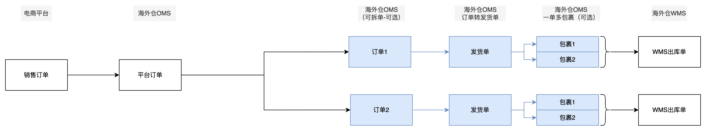

平台-OMS-WMS

  
  

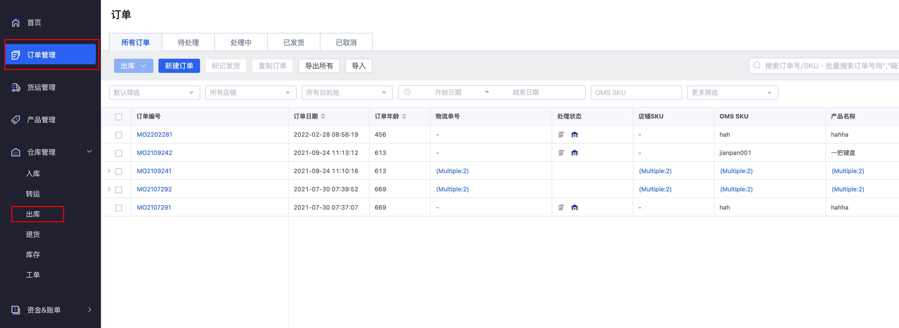

Shipout OMS可以直接对接电商平台

  
反之，如果海外仓OMS不需要直接对接电商平台，而是直接对接跨境电商ERP，那么OMS就不需要订单管理模块，只需要有仓储服务中的出库单管理即可。  
  

平台-ERP-OMS-WMS

  
  

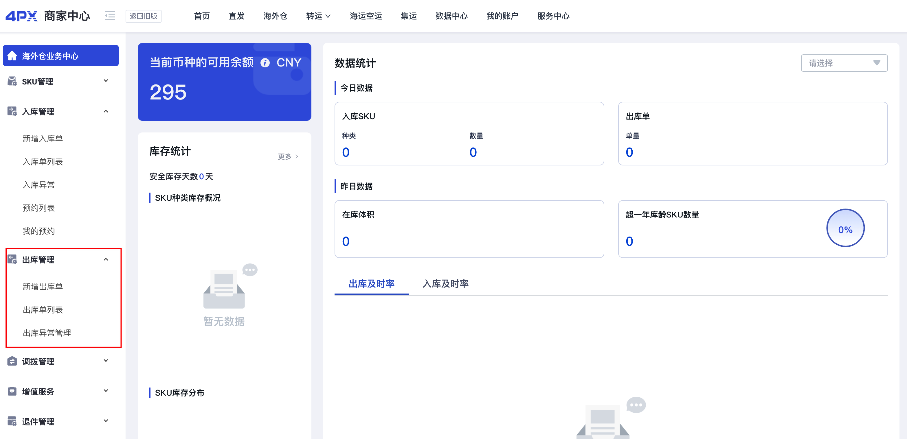

4PX的OMS不支持直接对接电商平台

  
**订单和出库单的区别**  
无论是国内电商OMS还是跨境海外仓的OMS，一般来说大家都会特别刻意地去区分“订单”和“出库单”，当然有一些系统也将“出库单”定义为“发货单”。  
总之，“订单”和“出库单/发货单”是两个不同的单据，是一种解耦的做法，也是一种主流的做法。订单和出库单的实体关系应该是1对1或者1对多的，一个平台订单可以拆分成1个或者多个出库单，拆分可能是通过仓库，通过物流或者是通过商品结构等原因来拆分，具体示意图如下所示：  
  

平台订单和出库单的实体关系

  
订单来源于电商平台，带有很多电商平台的字段和属性，例如说：  
1平台订单的信息：平台名称，店铺名称、平台订单号、下单时间、买家留言/备注……  
2买家/用户的信息：用户ID，用户名称，用户等级，收件地址……  
3订单的产品信息：平台SKU、商品编码、商品名称，数量，单价，总价，优惠金额……  
4其他信息：卖家备注，业务人员，标签……  
  

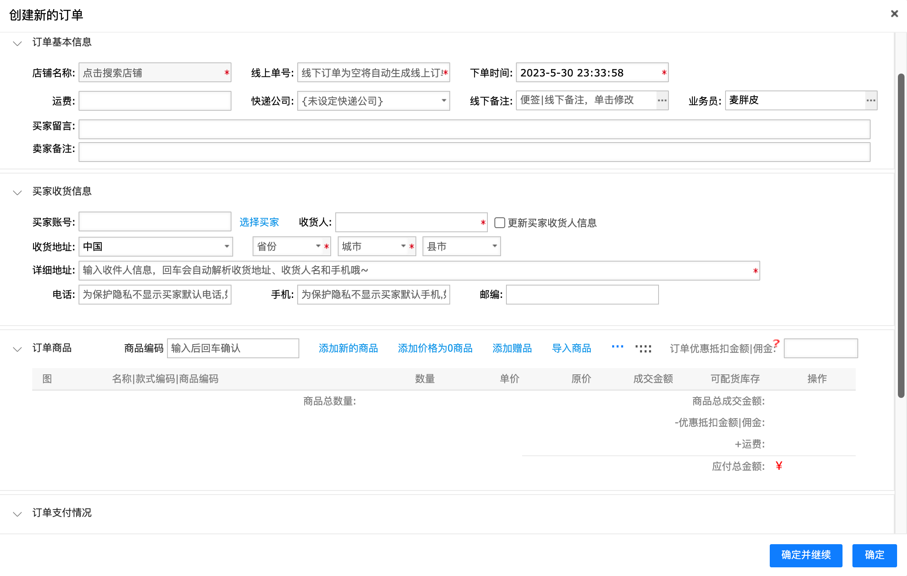

聚水潭ERP订单

  
  

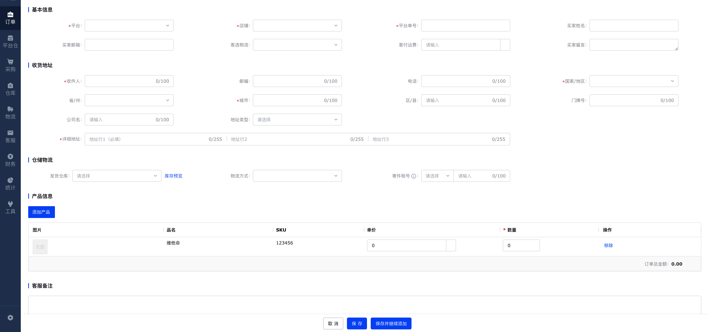

领星ERP订单

  
而出库单，则是推送给WMS作业的一个任务单据，虽然有很多字段都是来源于订单，但是又和订单不太一样，会更加精简一些，同时更侧重于发货履约。常见的字段有：  
1出库单的基础信息：发货仓库，物流方式，包裹数量，包裹尺寸和体积……  
2地址相关的信息：收件人名称，手机号，邮箱，地址……  
3发货的产品信息：商品的SKU，名称，数量……  
  

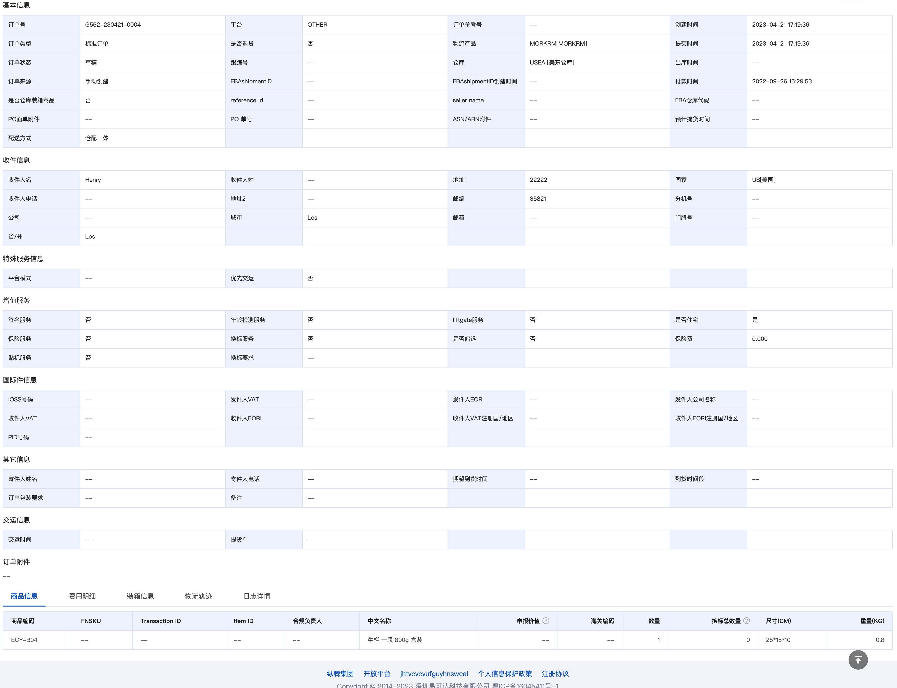

谷仓OMS的出库单

  
  

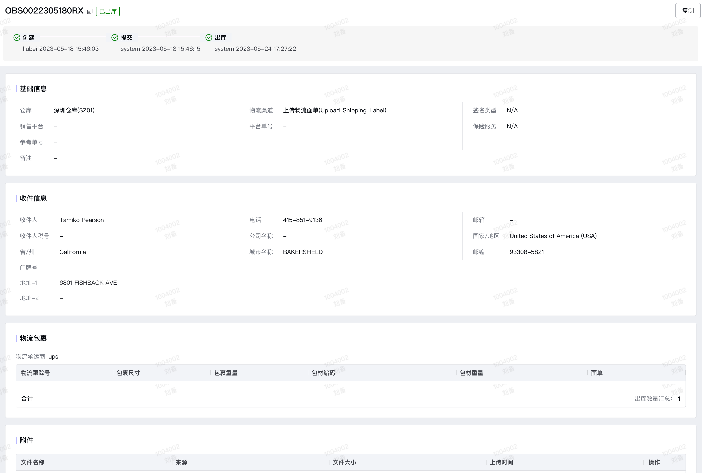

星链OMS的出库单

  
**海外仓OMS出库的产品设计**  
**出库单的单据结构**  
海外仓OMS的出库单一般来说会有多种类型，但是最为常见的是标准的2C订单，也在业内称之为“一件代发”，通俗理解为：按产品SKU出库，而且一个出库单中的产品类型和数量都不会太多，往往是一个快递包裹能装下。  
除了一件代发之外，还有一个也是比较高频的出库类型叫作“备货中转”或者“FBA出库”，意思就是将货物送到FBA仓库，类似于仓与仓之间的调拨。不过因为送往FBA仓库的货物需要做一些特殊要求（FNSKU标、箱唛、预约入库等），所以会将这种类型的出库单另外抽出来。  
对于一件代发的出库单来说，OMS出库单的单据结构如下图所示，直接是出库单包含了产品明细。  
  

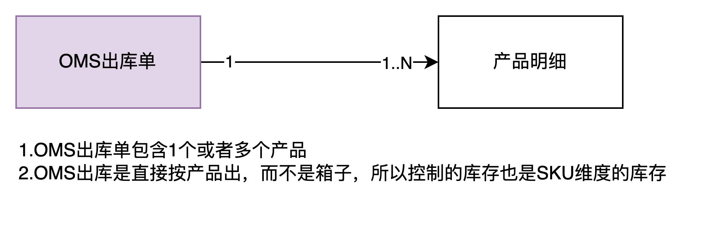

单据结构图

  
  

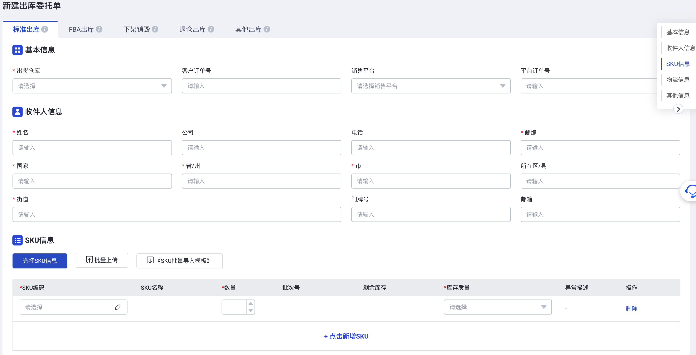

4PX 标准出库单

  
  

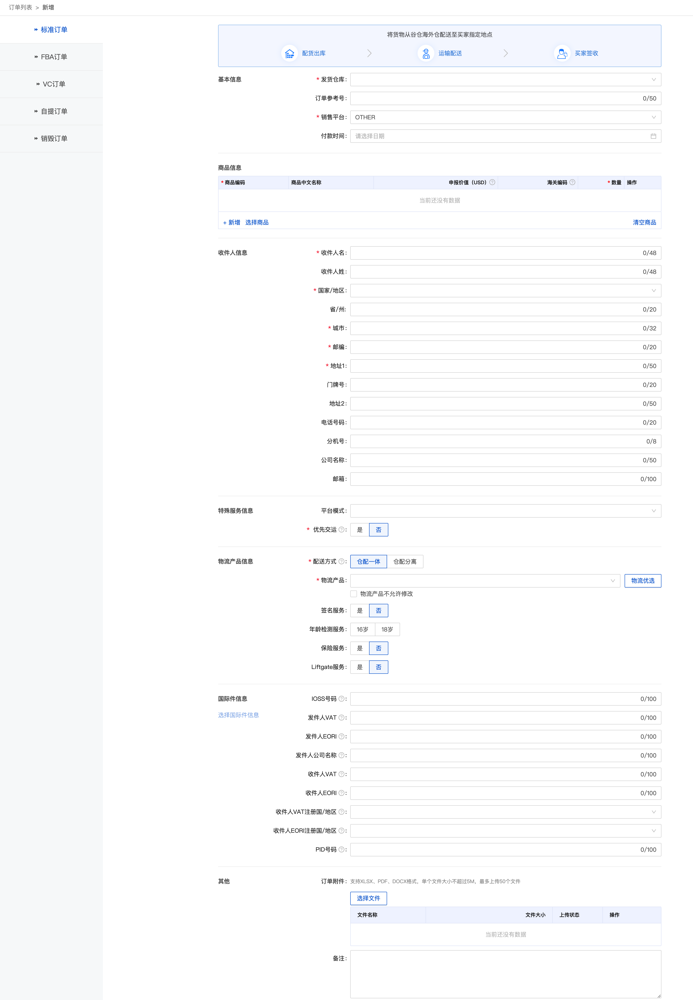

谷仓 标准出库单

  
如果是FBA出库单，由于送往FBA仓库需要用箱子或者托盘包装，所以出库单中除了有产品信息之外，还需要有箱子的信息，和入库单的装箱信息是一样的意思。因为OMS的入库单就是将货物送到海外仓收货，而海外仓收货的要求很多都是跟FBA看齐的，所以从海外仓将货物送到FBA仓库，就是类似于从国内仓头程中转到海外仓一样，需要根据目的仓（FBA）的要求做执行。  
  

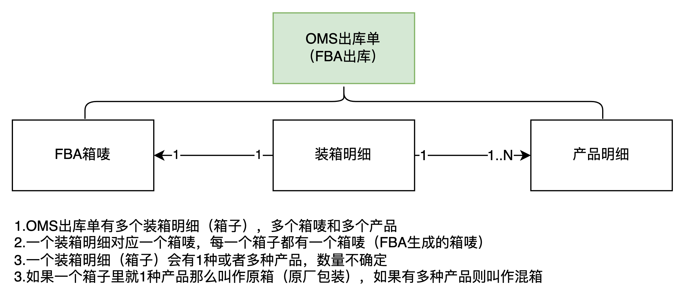

单据结构图

  
  

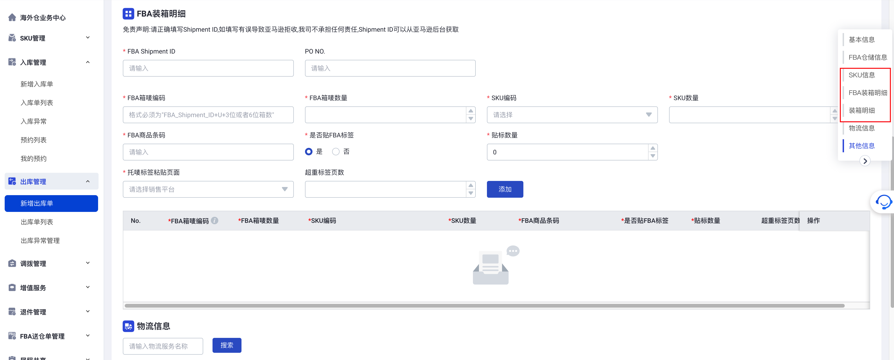

4PX FBA出库单

  
  

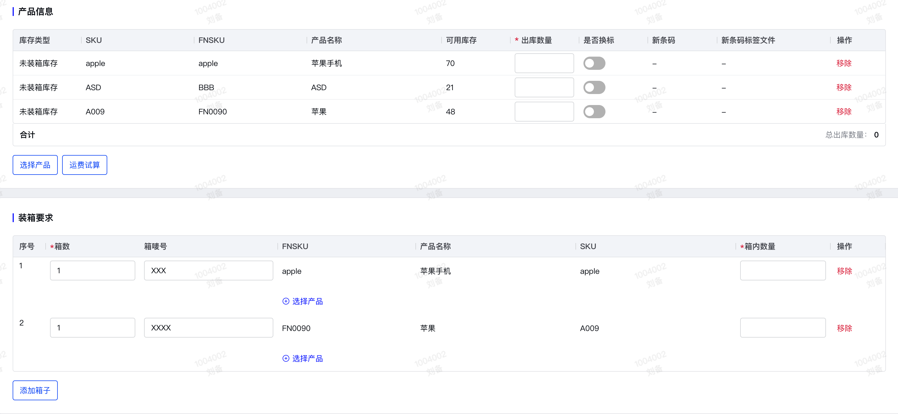

XL FBA退货换标出库单

  
**出库单的状态流转说明**  
  

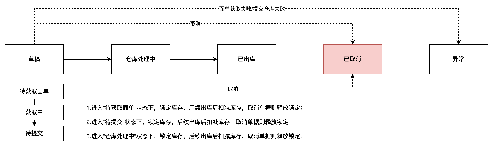

状态流转图

  
1刚创建好的出库单是“草稿”状态，可以进行修改，删除等操作。在草稿状态下会有一些子状态，这个子状态是用来标识物流渠道的面单获取情况的。  
a待获取面单，就是最初的状态，还没有获取物流渠道的面单；  
b获取中，当点击了【获取面单】的按钮之后，由于一些接口响应需要时间，所以就会有一个获取中的状态；  
c待提交，当面单获取成功之后，就会进入待提交状态，在这个状态下可以提交出库单到WMS作业了；  
2“仓库处理中”，当OMS将出库单推送到了WMS之后就会变成这个状态，在这个状态下也可以做一些子状态，查看仓库作业的细节，这取决于业务要求，是否要将仓库作业的细节暴露过多给OMS；  
3当仓库作业完成了发货出库之后，会通知OMS将单据状态变更为“已出库”，表示已经完成了出库；  
4在出库单是“草稿”或者“仓库作业中”的状态时，可以支持出库单的取消，如果取消成功了，那么单据状态会变成“已取消”；  
5在“草稿”状态下，可能由于计费原因，库存原因，获取面单的原因等，会导致发生错误或者异常，那么单据会进入到“异常”状态，可以在这里查看到异常的单，并且会展示相关的异常原因；  
对于OMS的草稿有一个“待获取面单”的功能，估计有一些做国内电商的朋友会有点疑惑，因为在国内的电商仓库中，有很多仓库是将物流面单的获取放在了WMS层，而不是在OMS层，这里我做一个简单的介绍。  
对于海外仓的物流面单获取来说，一般会有两种做法，一个叫作“前置预报”，一个叫作“后置预报”。  
前置预报就是在OMS层去向物流系统（LMS/TMS）预报物流面单；后置预报就是在WMS层去向物流系统（LMS/TMS）预报物流面单。  
  

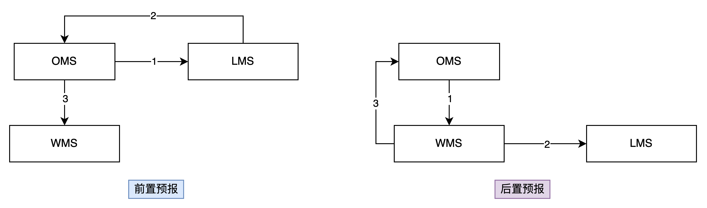

前置预报和后置预报示意图

  
1前置预报可以在OMS端提前发现问题，提前解决，缓解海外仓的一些压力、释放海外仓的人力；  
2后置预报可以根据仓库实际作业情况来进行预报，针对一单多包裹的场景比较实用；  
3国内WMS一般是后置预报，海外仓WMS一般前置+后置都有，但是前置的最多、最广；  
海外仓尾程物流派送的几个常见方式：  
1快递；  
2卡车；  
3自提（非常少）；  
其中快递是信息化程度最高的一种方式，也是最常见的一种方式，要使用快递就必须要有面单。获取的面单通过系统传递给了仓库，仓库打包的时候，打印对应的面单，贴在包裹上，等待物流商上门揽收或者自己将货物送到物流商的指定网点交货。  
面单是否可以获取成功，本质上还是要取决于物流商的信息系统是否校验通过，海外仓虽然会对接多个物流商，但是这些基本上都是代理商，背后真正承运的是一些知名快递，例如FedEx，UPS，DHL等，所以客户使用和接触到的，很多是代理，这些代理所提供的系统称之为打单系统。  
  

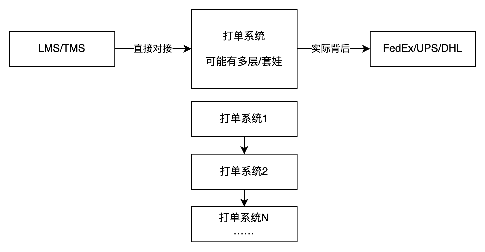

物流打单的逻辑介绍

  
**出库单中物流渠道的逻辑处理**  
LMS核心要解决的是，怎么兼容满足多家打单系统不同的要求？怎么去对接这些不同的物流商的API。而OMS核心要解决的是，怎么提供足够多的数据和信息给LMS，去满足不同物流商API的字段要求和业务逻辑要求。  
当OMS创建出库单的时候，需要选择仓库和物流渠道，物流渠道的选择有一些逻辑比较复杂，需要额外处理一下，也有很多朋友会在这个地方踩坑翻车。  
**1.物流渠道绑定仓库和客户**  
作为一个海外仓服务商，会对接很多个物流商，也会绑定自己的折扣账号，一般来说会默认指定一些物流渠道给客户使用，相当于让客户只能使用自己的折扣账号。但是有一些有议价权的客户也会有自己的折扣账号，希望能通过海外仓对接好的接口，绑定客户自己的折扣账号。  
  

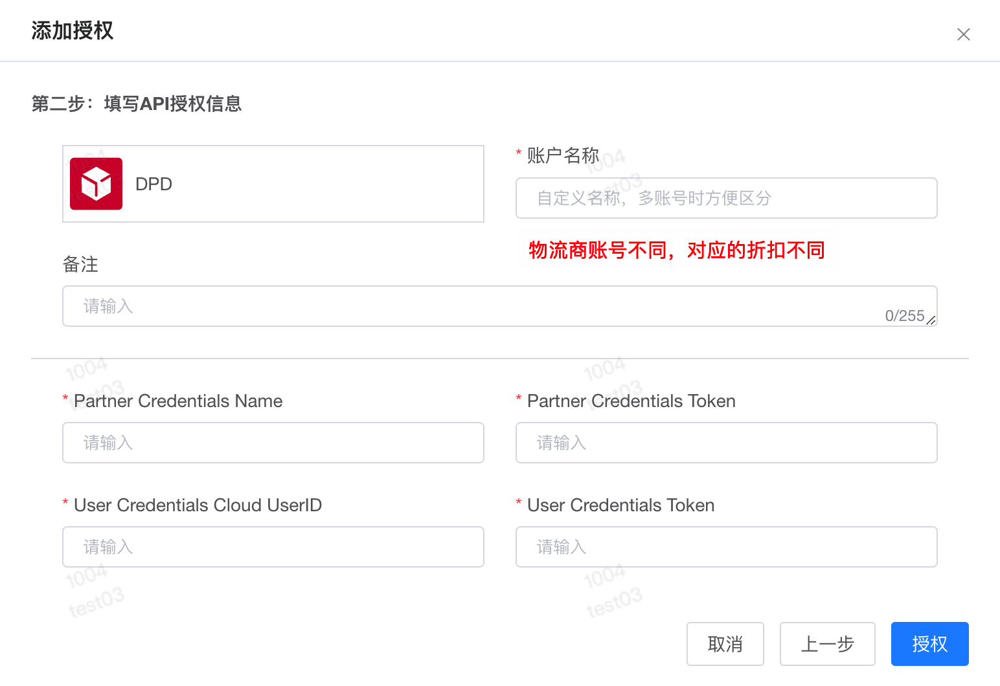

授权物流商

  
一般来说，一个物流商的API接口都是一样的，对接完一次之后可以绑定多个不同的账号，而不同的账号也会生成不同的物流渠道。所以物流渠道需要做一些逻辑处理，例如绑定仓库和客户。  
  

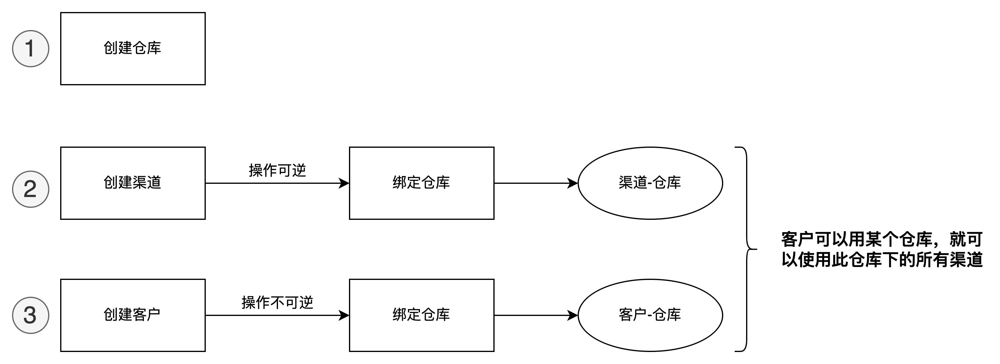

客户可以使用仓库下的所有渠道

  
  

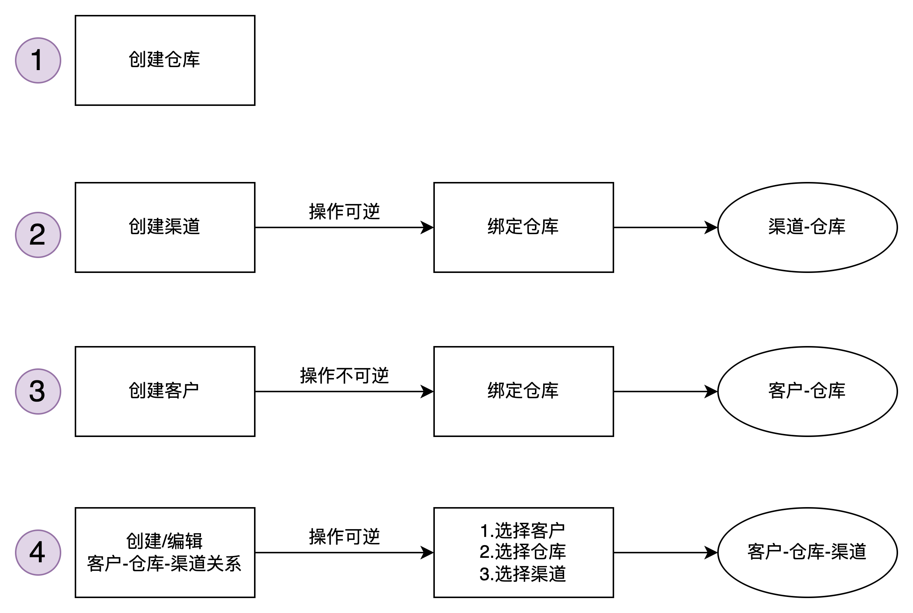

客户只能使用仓库下的某些渠道

  
对于大多数场景来说，只需要仓库绑定物流，然后客户绑定仓库即可，这样客户可以使用这个仓库下的所有物流渠道；但是对于一些特殊的客户或者场景，则需要做得更加细节一些，要实现配置客户可以使用仓库下的具体某个渠道，这样可以做到更全面的场景支持。  
**2.物流渠道的分类**  
物流渠道可以大致分成2个大类，这2类需要采用不同的业务处理逻辑去应对：  
1有对接API的渠道：对接了API的物流渠道需要通过接口的方式获取面单；  
2没有对接API的渠道：没有对接API的物流渠道则需要手动上传面单文件或者是无需物流面单；  
  

  
有对接API的物流渠道，创建好出库单之后是“待获取面单”状态，需要获取面单之后才能进入“待提交”的状态。而没有对接API的物流渠道，创建好出库单之后直接就是“待提交”状态，可以在这地方做一些额外的判断，例如：是否有上传文件，是否满足某些条件之后才能允许提交。  
**3.物流商和物流渠道的状态校验**  
物流商账号下会有多个渠道，但是物流商账号可能会出问题，或者是物流商下面的某个服务（渠道）暂时有问题，需要关闭/停用，所以就会存在两种情况：物流商账号停用和物流渠道的停用。  
  

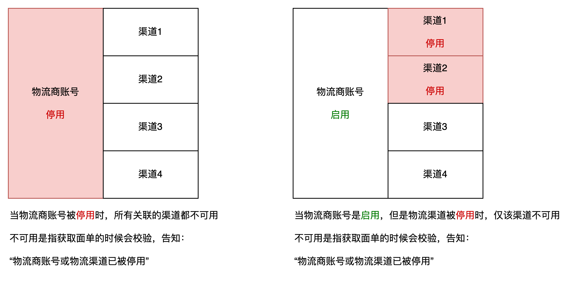

  
在OMS创建出库单或者获取面单的时候，做相关的校验，查询对应的物流商账号和物流渠道是否停用，如果停用了需要告知错误原因，流程则不继续向下走了，这种方案的优势在于可以提前让用户感知到错误。  
当然，也可以将这一层的校验放在LMS/TMS层来做，只不过这样的话可能用户不能及时拿到错误信息，每次都要在预报的时候才能知道渠道是不是正常的。  
  

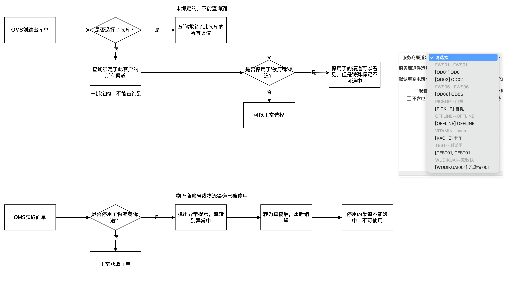

创建出库单或者获取面单的时候校验渠道

  
  
**出库单的库存变化说明**  
对于供应链类的系统来说，库存一定是一个绕不开的话题，而订单、出库单、发货单等这些单据最核心的部分一定有库存的一席之地，所以了解出库单的库存变化逻辑，对我们掌握OMS出库单的产品方案设计有很大的帮助。  
OMS的库存表结构一般如下所示，关注的是“SKU在什么仓库，有多少数量，其中数量又分成实际库存、可用库存，锁定库存和在途库存”。有一些业务场景下会关注库存的属性是正品还是次品，这是一个可选业务，并不一定通用。

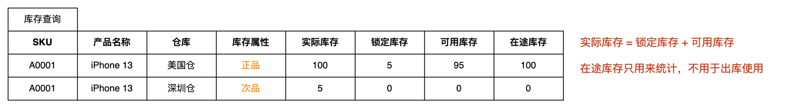

OMS的库存表

  
针对出库单而言，一般常见的业务如下所示，对应的库存变化详情也如下表所示，这种表格很适合用来说明库存随着业务的不同而产生的变化情况。  
  

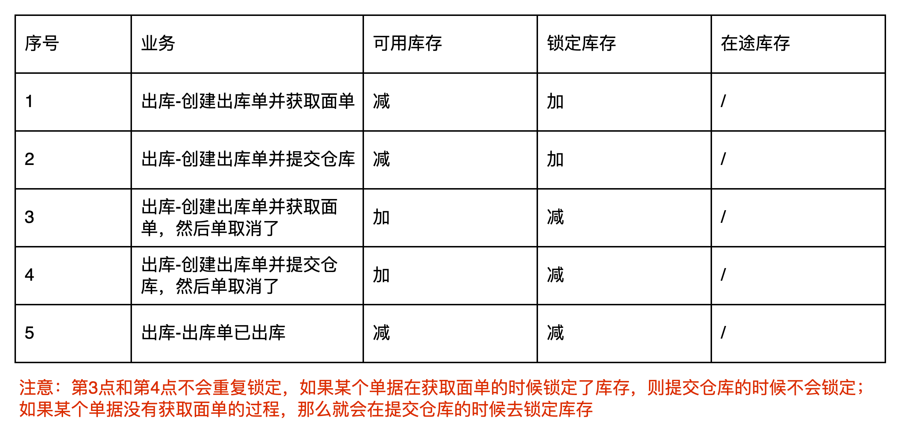

  
如果是要输出一份更全貌一些的库存变化示意图，我建议可以用流程图的方式来说明，类似于下图，将一些重点和核心的变化示意图画出来会更好。  
  

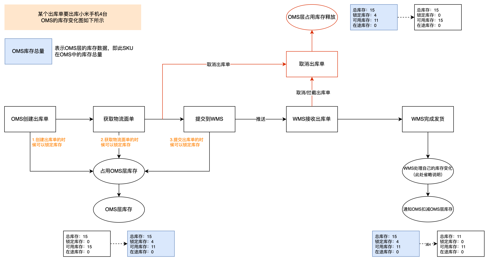

OMS出库的库存变化示意图

  
**小结**  
对于海外仓OMS来说，“出库”算是一个很核心的业务，其中涉及到很多的业务逻辑和细节，都需要小心揣摩和处理，本文只是拆解了OMS中一些比较核心和重要的内容，并不是全貌。  
所以，读者朋友们可以多研究一下市面上成熟的竞品，通过查看帮助手册或者实操系统的方式，去挖掘竞品系统背后的产品设计逻辑。这里我推荐大家可以去看看这几家的05-OMS系统：  
14PX  
2谷仓  
3万邑通  
4易仓  
5魔方云仓  
其中一些系统的帮助手册我之前已经分享在了我的知识星球中，大家可以在星球中搜索查找。