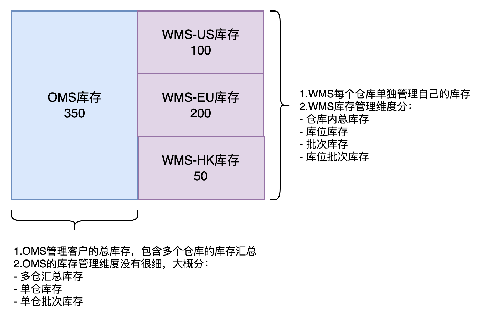
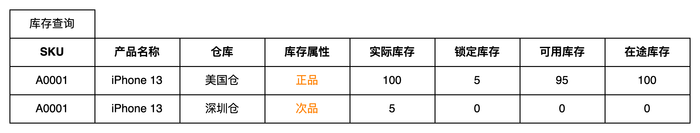
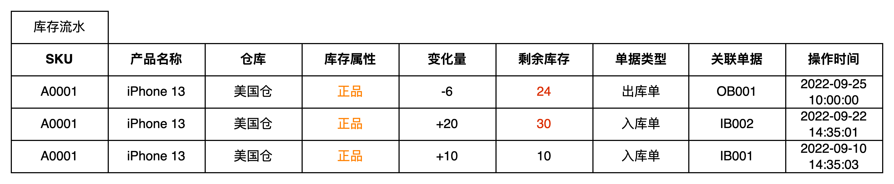
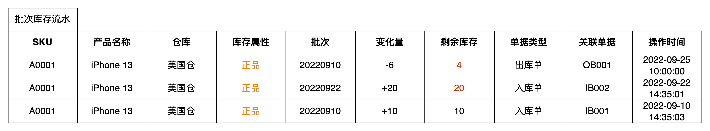
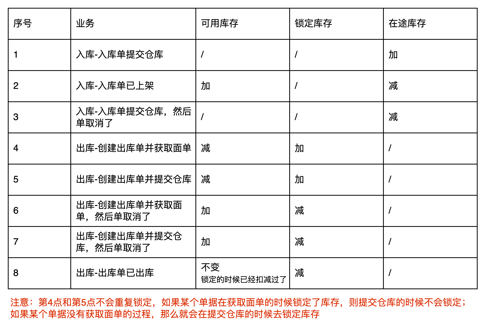
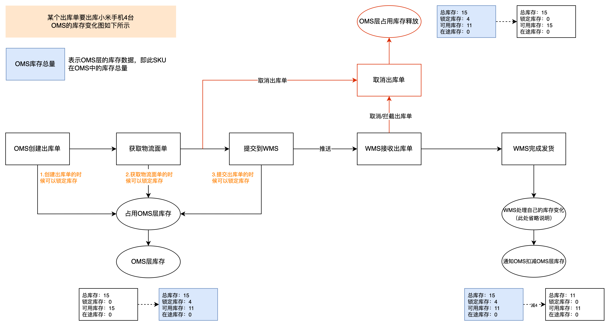
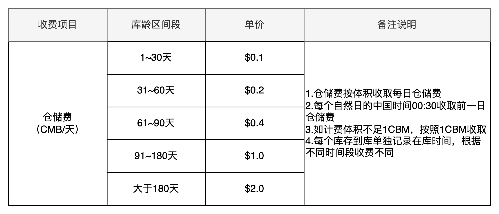
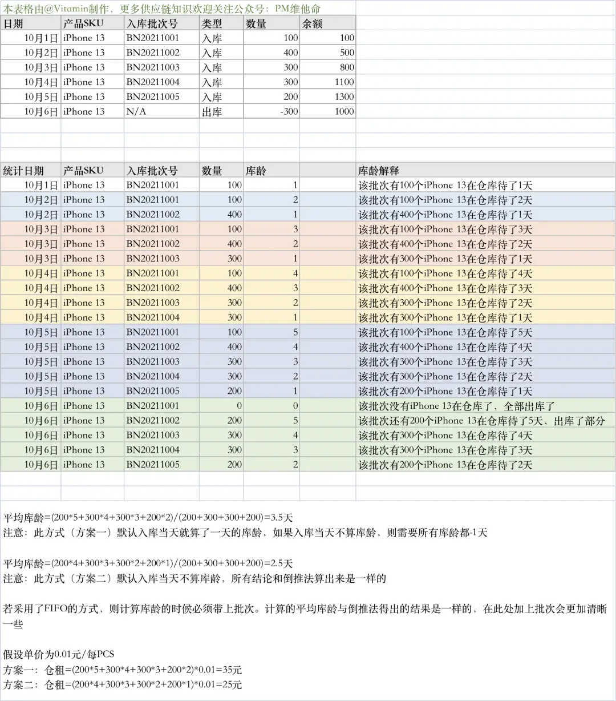

**OMS和WMS的库存区别**  
前面提到过多次，海外仓的OMS是海外仓WMS的一个客户端，用户通过OMS可以向WMS推送作业单据和一些指令，WMS作业完成之后会将数据更新反馈给OMS。无论是OMS还是WMS，都存在一个很重要的数据：**库存**。  
海外仓OMS的用户是电商卖家，而WMS的用户是海外仓的工作人员。对于电商卖家来说，它可能会同时使用多个仓库，例如：美东仓，美西仓，英国仓等；但是对于海外仓的工作人员来说，每个仓库都是实际存在的，货物都是真实存放在仓库中的。所以OMS看到的库存是多个实际仓库统计之后的汇总库存，而WMS看到的库存是实际在仓库中的库存。  
一般来说，海外仓OMS和WMS的库存是两套独立的体系，如果再加上跨境电商ERP的话，那么ERP、OMS、WMS就是三套独立的库存体系，三者互相关联，但是又各自管理着不同维度和粒度的库存，发挥的作用不太一样。  
  

OMS库存和WMS库存的区别

  
**OMS的库存结构**  
OMS的库存从管理维度上，可以分成**SKU库存，箱库存，FNSKU库存**，但是库存维度越多管理难度越大，所以建议大家尽量还是用SKU库存这个维度就够了。  
**SKU库存**维度中，比较重要的字段如下图所示：  
  

OMS的库存结构

  
库存属性：一般是指“正品或者次品”，也有人称之为“良品或者不良品”。对于仓库来说，正次品一般是会分开管理的，所以在库存的维度，也会用库存属性（正次品）来区分。  
实际库存：也可以称之为“总库存”，是指在OMS层能看到的、能使用的总库存数量有多少。  
锁定库存：也可以称之为“分配库存”，当OMS创建了出库单之后，为了防止不同的单据抢占库存，所以按“先到先得”的逻辑提前锁定库存给对应的出库单，避免超发到WMS。  
可用库存：可以正常使用的库存，一般用于出库的时候判断出库数量是否小于等于可用数量。  
在途库存：一般是指即将送到仓库的库存数量，当提交了入库单（采购入库、退货入库）到WMS的时候，就会增加对应的在途库存。  
对于OMS来说，登录OMS的是单个货主，所以在库存查询的时候，不用特别指明货主是谁（因为货主就是自己），但是可以指明具体是哪个仓库的库存，所以会有“仓库”这个字段。  
OMS的库存结构相对WMS来说比较简单，因为对OMS用户来说，并不需要关注那么多的库存细节。除了库存结构之外，产品经理还要关注一下库存流水的结构，如下图所示：  
  

OMS的库存流水

  
上图中库存流水统计的粒度是OMS的SKU库存维度，可以看到在某个时间点，因为某个单据导致了库存增加或者减少，然后变化之后剩余的库存是多少。  
但是有一些客户想要关注更细维度的库存变化流水，就会在OMS引入一个“批次库存”的概念，于是就会有一个批次库存流水的展示。  
  

OMS的批次库存流水

  
批次库存流水和库存流水，主要的区别就是数据统计的粒度不一样，批次更加下钻了一层，更加精细。如果业务不需要这个维度的数据，也可以不做这一块的内容。  
**OMS的库存变化说明**  
对于海外仓OMS而言，库存的增加和减少是很高频的事情，作为产品经理，在设计相关的库存需求方案的时候，可以把一些常见的会引起库存变化的业务场景梳理出来，然后**整理成表格**，并且将对应的变化情况罗列出来，在需求评审的时候就可以很清晰地让研发理解其中的逻辑。  
  

OMS库存变化业务梳理

  
如果觉得使用表格无法表达出业务流转过程中库存的变化细节，那么可以借助业务流程+库存变化注释，来传达其中的逻辑，这也是一个很棒的方法。这里我以“出库单”为例，梳理了一份**业务流程+库存变化注释**的说明图，可以让不懂业务的朋友快速了解其中的细节逻辑，研发看了直接含泪点赞。  
  

OMS出库业务中的库存变化示意图

  
**OMS的批次库存和库龄**  
**1.批次库存**  
“批次”或者“批次库存”这个词在WMS中很常见，但是在OMS中见的比较少，我认为主要原因可能是写这一块知识的文章太少了，并不是它不存在，而是少有人去讲解这一块的内容。  
对海外仓而言，盈利的来源主要有这么几个点：  
1尾程物流费用的差价，这个是最大的利润来源点；  
2库内操作的费用，为客户收货、上架、拣货、打包、装箱等都要收取对应的费用；  
3仓租费用，客户的货物放在仓库中，占用了仓库的固有资源，所以仓库要对此收费；  
ERP的批次库存一般用来计算批次成本，可以知道每个批次的成本大概是怎么样的，这里就是涉及到成本计算的方式，常见的是这三类：  
1移动加权平均法；  
2先进先出法；  
3月末一次加权平均；  
由于本文是讲海外仓OMS的，所以我们不对ERP的批次库存成本计算方式展开说明，感兴趣的朋友自己找相关资料看看。  
海外仓OMS的批次库存一般是用来计算库龄，从而用来计算仓租的。因为海外仓收取客户仓租的时候，一般会采用梯度计价的方式，也就是在仓库中待得越久（库龄越大）的货物，仓租单价就会越贵，所以客户希望能尽早将自己库龄大的货物发出去。  
  

  
  
对于WMS的批次来说，由于WMS的拣货分配逻辑，不一定都是先进先出，有可能是先进后出，效期优先或者是指定批次出库，所以就会导致某个货品最早的批次迟迟没有发出去，从而触发了仓租的梯度计费，产生了高昂的仓租费用。  
简单理解，计算仓租的批次库存可以来源于WMS或者OMS：  
1如果来源于WMS，那么就做不到准确的先进先出，但是和实物的批次是一致的。这种方式对客户不利，对海外仓有利；  
2如果来源于OMS，那么就可以做到准确的先进先出，因为OMS记录的是逻辑批次，而WMS的实物批次不保持一致。这种方式对客户有利，但是对海外仓来说可能就有两套不一样的批次库存了；  
库龄统计，可以在OMS端，也可以在WMS端，如果是仅仅为了计算仓租，那么建议放在OMS端会比较好，适用于梯度仓租计费的仓库，让利于用户，而且也比较简单。  
但是如果是自营的仓库或者不太考虑梯度仓租的业务，那么建议在WMS侧统计批次库龄。**两者都可以，看业务的要求是什么。**  
**2.库龄**  
什么是库龄？可以通俗地理解为：**货物存放的天数或者时长**。  
这句简短的描述，有几个核心信息需要考虑和关注：  
1货物什么时候进来的？即起始日期是什么时候？  
2是什么时候统计的结果？即什么时候去统计库龄天数；  
3统计的粒度，一般要包含“SKU+批次”，即某个批次的SKU什么时候入库的，什么时候统计的结果；  
如果想要向开发表达和阐述批次库存和库龄的关系，那么我推荐使用“表格推演法”，如下图所示，通过Excel表格逐行推演，可以很具象化地向初次接触该业务的新手朋友解释相关的业务逻辑。  
  

表格推演法解释库龄

  
**小结**  
OMS库存相关的逻辑稍微简单一些，主要是因为它统计的库存粒度比较粗糙，而且涉及到库存变化的业务也不是很多，本文已经将大多数高频遇到的场景都拆解出来了。  
后续讲到WMS库存模块的时候，相关的难度可能就会上一层楼了，所以希望读者朋友们打好基础，先搞定OMS的库存设计，后续再逐步进阶到WMS的库存设计。