提到“批次”或者“批次管理”，很多人的第一反应就是这个概念应该是和仓储系统（WMS）关系比较密切，和OMS或者ERP的关系好像不是很紧密，甚至有一些人都不知道OMS或者ERP上也有批次管理的内容。  
之前我写过好几篇关于批次的文章，大多数都是以WMS为例去展开的，但是实际上在日常的供应链系统运转过程中，上游系统（OMS/ERP）中的批次信息也很重要，因为如果下游WMS做了批次管理，但是上游系统不做相关的联动和记录的话，那么批次管理的效果就会大打折扣。  
本文就以海外仓OMS切入点，拆解一下OMS中的批次管理是怎么做的，同时也可以触类旁通用于其他业务型ERP系统中。  
**什么是批次和批次管理？**  
批次是属于商品（SKU）的一个附加属性，每一个SKU都可以有多个批次，表示同一个SKU但是不同的批次之间可能会存在一些细微的差别，例如说生产日期不一样，某些工艺不一样，或者说采购的价格不一样，采购的时间不一样等。  
批次管理则是对这些批次进行追踪、控制和管理的整个过程，确保产品质量和安全，同时提高库存和物流的效率。所以商品首先得要有批次，其次才会有批次管理。  
举个例子，想象一家饮料工厂，它在一天内生产了1000瓶同口味的可乐。这1000瓶可乐被标记为同一个批次，拥有相同的生产日期和批次号。批次管理确保这批次的可乐在整个供应链中可以被准确追踪，无论是在仓库存储、运输还是最终销售给消费者的过程中。如果出现质量问题，工厂可以迅速追溯到这个特定批次，并采取相应的措施，如召回或替换。通过这种方式，批次管理有助于保护消费者利益，并维护企业的品牌形象。  
**OMS为什么要批次管理？**  
站在海外仓OMS的角度，批次管理可以要，也可以不要，因为**批次管理是属于一种精细化的商品库存管控方式**。  
如果说客户不需要或者仓库端做不到这么精细化的管控粒度，那么就不会有批次管理，反之就会有批次管理。  
那么什么情况下会需要有批次管理呢？站在海外仓的角度来看，常见的场景一般是：  
1商品是有保质期管理的，例如说食品，饮料等；  
2商品是有外部批号的，例如说医疗器械，化妆品，保健品等；  
3商品是有多个供应商且需要溯源的，例如说商品的采购来源渠道多，各个渠道的质量和品控需要严格把关；  
当商品是有保质期的时候，仓库在入库的时候需要采集效期的信息，会生成对应的批次库存。然后OMS推送出库单给WMS的时候可能会存在“指定效期信息出库”的场景，例如说，指定商品的“**生产日期=XXX**”时才能出库。  
当商品是有外部批号的，仓库在入库的时候也会采集产品外包装上的生产批号，并生成对应的批次库存。当OMS推送出库单给WMS的时候，可以指定商品的“**生产批号=XXX**”时才能出库。  
当商品有多个供应商且需要溯源的时候，货主希望在OMS指定先出某个采购单入库的商品或者是指定出某个供应商采购的商品，这个时候需要OMS支持指定商品的**“采购订单=XXX**”或者是“**供应商=XXX**”才能出库。  
  

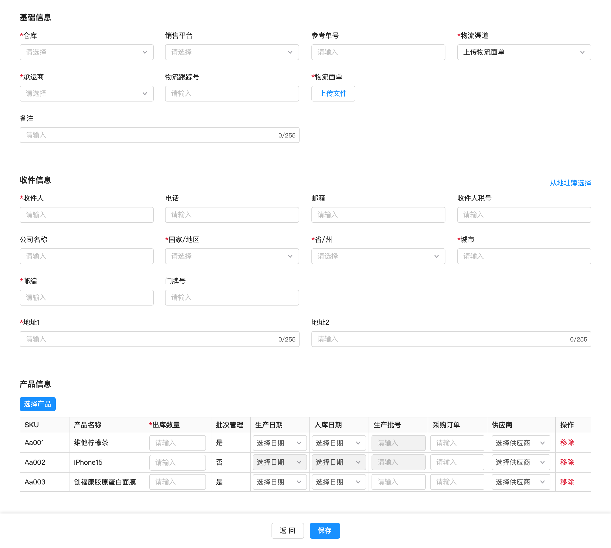

OMS创建出库单示意图

  
上面提到的“生产日期”，“生产批号”，“采购订单”，“供应商”等都是属于批次的属性，是定义商品批次的因子，术语则称之为“批次属性”。  
如果OMS需要启用批次管理，那么在OMS创建商品的时候就要启用相关的配置项，一般是勾选“批次管理”，然后再勾选相关的“批次属性”。  
  

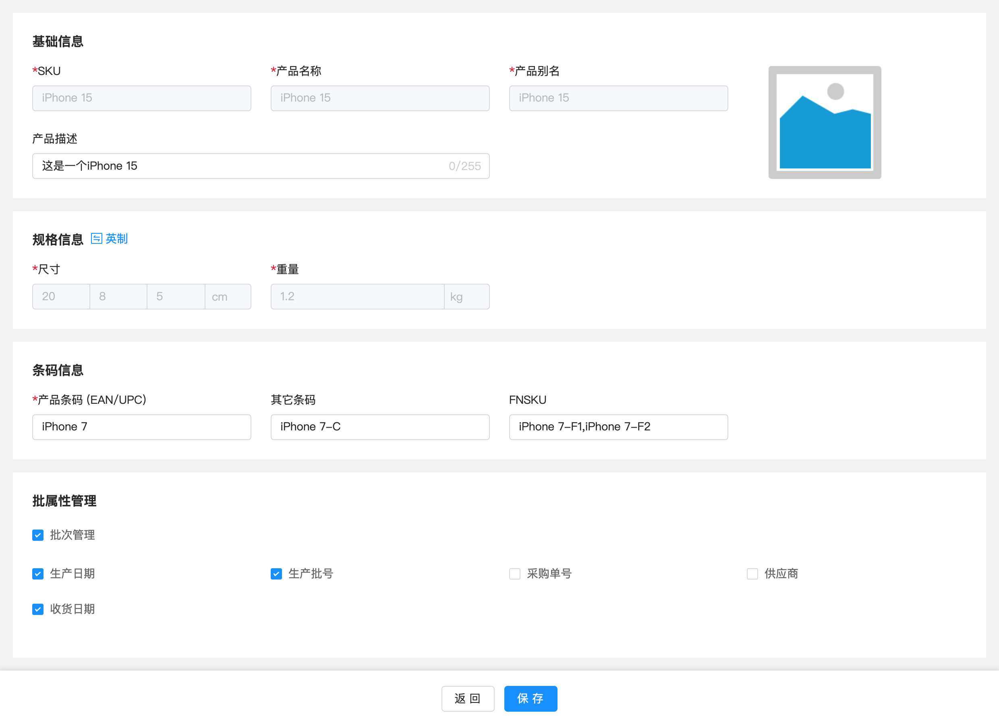

OMS创建商品页面

  
一般来说，批次属性的参数是可以灵活配置的，这些一般放在WMS中会比较多。但是有一些货主有强烈的批次管理意向，所以就会在OMS创建商品的时候，把商品需要哪些批次属性进行管控当作商品的业务配置信息，直接推送给到仓库中。  
例如说富勒的WMS中批次属性可以自由定义很多个，这些WMS中定义好的批次属性，有一些也是可以推送给OMS，让货主在OMS端去配置。  
  

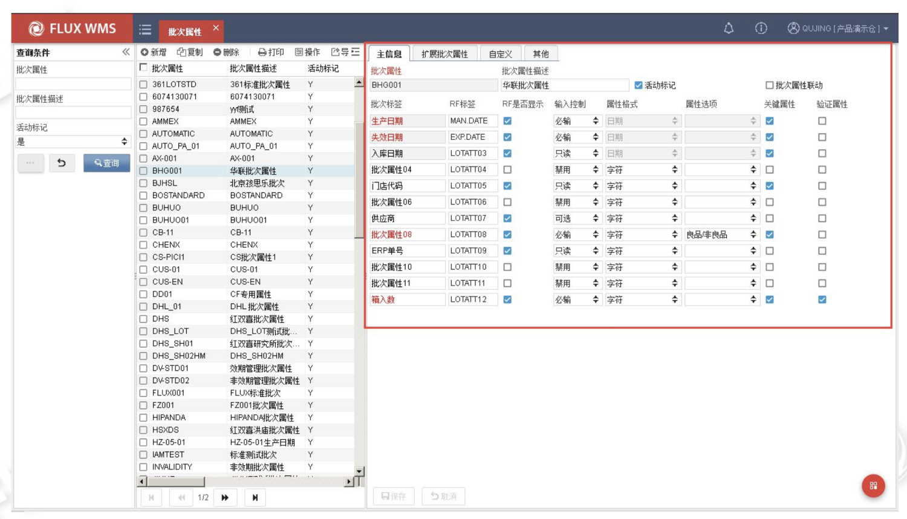

  
富勒的批次属性管理  
针对同一个SKU，只要在收货的时候发现批次属性中有一个属性不一样，那么就会生成一个新的“批次”。  
批次属性配置的越多，那么就意味着仓库的一次收货入库可能会生成很多个批次（同一个SKU），对应的就要对批次进行精细化管理，那么成本也会变得很高。所以一般的仓库，在维护批次属性的时候，不会搞太多，这样仓库在收货的时候要采集的信息也会很多，生成的批次号也会很多，不利于仓库实际的管理。  
综合上述的分析，我们可以得出结论：  
1OMS需要批次管理的原因，是因为某些商品需要进行精细化的管理，所以要用到批次管理的功能；  
2OMS的精细化批次管理一般是指OMS可以在某些单据的指令上，细化到商品的批次属性维度，而不是仅仅是商品维度；  
3在OMS创建商品的时候就配置好启用批次管理，并勾选批次属性的参数，这样可以直接把OMS的配置推送到WMS中；  
4OMS的批次管理启用了之后，那么WMS在执行的时候也要配合对应的配置参数，这样才可以达到最终的精细化管控目的；  
**OMS的批次和WMS的批次区别**  
当OMS启用了批次管理之后，在OMS推送入库单给WMS的时候，就需要将一些批次属性的信息也一起推送给WMS。例如说采购单号，供应商名称等，而其他的一些信息则交由WMS收货的时候自行采集，例如说生产日期，生产批次，收货日期等。  
WMS收货的时候会根据OMS推送的信息，和自己采集的信息一起作用，去生成对应的批次号，然后关联到对应的库存上，就有了常说的批次库存。  
  

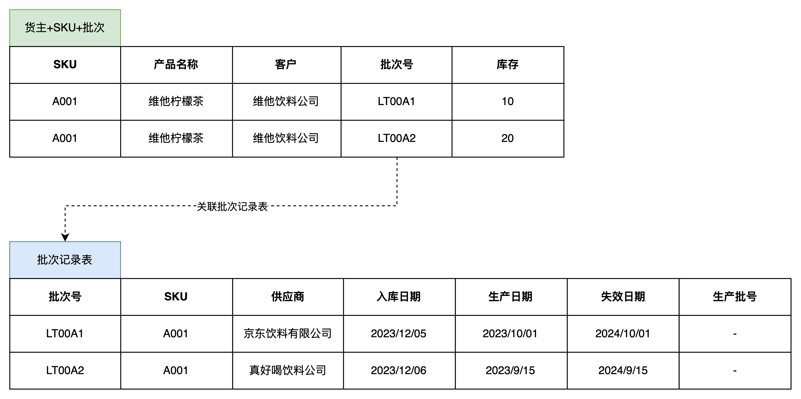

WMS的批次库存和批次记录表

  
一般来说，WMS的库存颗粒度可以分成这么几层：  
1仓库+货主+SKU的粒度，也可以称之为SKU维度；  
2仓库+货主+批次+SKU的粒度，也可以称之为SKU-批次维度；  
3仓库+货主+批次+SKU+库位的粒度，也可以称之为SKU-批次-库位维度；  
对应的库存展示情况如下所示：  
  

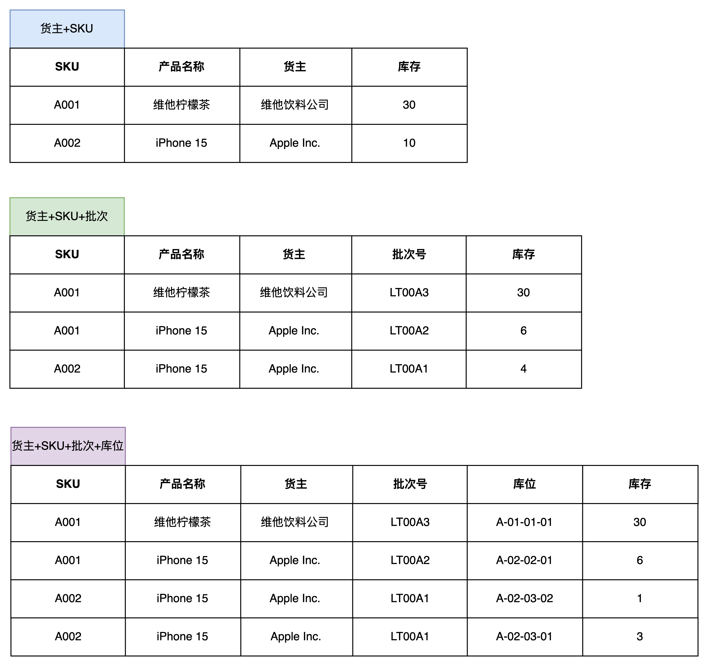

WMS的三层库存

  
当WMS启用了批次管理之后会有三层库存，而OMS和WMS相比就是少了库位的信息，那么是不是OMS启用批次管理之后就应该会有两层库存，分别是：**SKU维度和SKU-批次维度呢？**  
这种理解方式没什么问题，OMS确实应该是有两层库存，分别是SKU维度和SKU-批次维度，但是这样实际操作的时候会有一些弊端，所以虽然OMS是两层库存，但是实际在做相关的产品设计的时候还是要特别注意一下。  
  

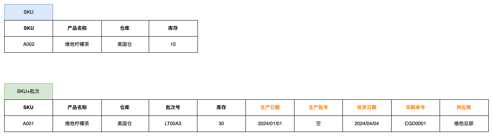

OMS的两层库存

  
当OMS使用了上图中的两层库存形式之后，OMS的库存需要和WMS的库存严格保持一致，这样才能保证后续的库存管理是清晰的，是准确的。  
1当OMS推送入库单给了WMS之后，WMS会生成批次库存，然后同步批次信息给到OMS，OMS也需要生成对应的批次库存信息，且需要记录下对应的批次属性；  
2当OMS推送出库单给WMS时，如果OMS没有指定具体的批次信息，那么WMS记录实际出库的批次库存并且反馈给OMS，让OMS也要对应地扣减批次库存，而且批次属性要一致；  
3当WMS在库内发起了库存调整，盘点，批属性调整之后，WMS也需要将对应的批次库存信息反馈给OMS，让OMS的批次库存和WMS端维持一致；  
经过上述3个简单的案例分析可以知道，如果OMS层也使用两层库存来记录库存，那么就**意味着所有和WMS的单据交互（推送/回传）都要考虑到最细的批次维度**，这样会导致OMS端和WMS的端的接口改造成本很高，而且一旦出现了批次库存不准确的情况，那么要调整两边的库存就会很痛苦。  
  

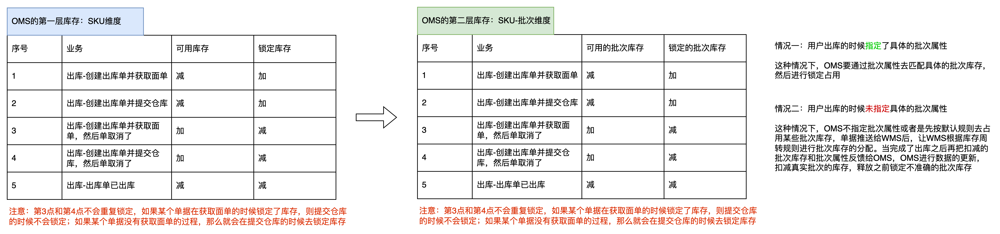

OMS出库单的库存锁定：当有两层库存时

  
在上面我们分析OMS为什么需要批次管理的时候，得出了一个结论：**OMS的批次管理可以让一些单据的指令细化到商品的批次属性维度。**  
既然我们是核心目的是为了让OMS能做到精细化的批次管理，那就不一定非要让OMS去记录两层库存，因为这样会增加系统的改造成本，同时对已有流程的改动也比较大。  
既然WMS端有三层库存，而且WMS的管控都是到最细维度的，那么OMS就不要记录自己的批次库存了，直接从OMS端开一个接口去查询WMS的批次库存即可。当货主需要知道自己的批次库存信息时，直接从OMS上去查询，背后调用的是WMS的批次库存，也就是“SKU-批次维度”的库存。  
当OMS创建销售出库单的时候，需要去选择商品的批次属性信息，在单据保存或者提交到WMS的时候，**可以调用WMS的批次属性库存接口，去校验一下这些批次库存在仓库中是否足够**。  
如果批次库存不足，则不允许推送到WMS中，需要修改批次属性信息或者是出库数量；如果批次库存足够，则可以推送到WMS中，WMS在分配库位库存的时候，结合OMS推送的批次属性，去锁定具体的“SKU-批次-库位”库存。  
虽然OMS和WMS都需要进行批次管理，但它们的侧重点和功能有所不同。OMS主要关注订单层面的批次管理，它需要处理订单接收、处理、跟踪和交付等环节，确保订单中的商品能够按照客户的要求和批次属性进行准确配送。  
而WMS则更侧重于仓库内部的操作，如入库、出库、移库和盘点等，它通过商品自身的批次属性或者是“库位-批次”的关联关系，来实现来实现对每个批次的精确控制。  
**OMS可以自己记录两层库存（SKU库存、SKU-批次库存），也可以只记录一层库存（SKU库存）。**  
前者的好处是所有的库存校验都可以直接在OMS层面完成，但是带来的弊端就是SKU-批次库存需要和WMS的SKU-批次库存同步，在库存管控和记录的场景上比较难操作；  
而后者的好处就是OMS端的库存逻辑相对简单一些，不会有那么多复杂的逻辑，缺点就是有部分库存的取数和校验都要通过WMS的库存接口来完成。  
**适合海外仓的批次库存管理方式**  
经过上面的一顿分析，我们会发现客户虽然想要做精细化的批次管理，但是对于海外仓来说完成这些功能的改造和操作上的兼容，其实成本很高，甚至有可能都会亏钱。  
此时，作为产品经理可以反过来思考一下，到底客户想要精细化的批次管理，这个“精细化”到了什么地步？是不是一定要精确到每一个“批次属性”，是不是客户一定能做到这么精准的指令下达？  
从我过往的业务调研结果来看，大多数海外仓可能都没有做效期管控，更别提精细化的批次管理了。即使部分做了效期管控的海外仓，能提供给客户精细化批次管控的粒度也比较粗糙，一方面是客户没办法下单这么精准的指令，另一方面是这种精细化的操作对仓库的要求很高，会加重客户的操作费成本，所以一番妥协之后，就有了主流海外仓的批次库存管理的方式。  
对于效期类型的产品（食品、化妆品、保健品）来说，只需要能够做到指定“效期类型”出库，就已经足够满足绝大多数的海外仓客户的批次管控需求了；而针对一些特殊的批次管控要求（指定生产批号，采购订单，供应商等），由于业务发生的频率很低，所以这部分可以通过线下和仓库沟通去处理。  
效期类型的产品，当启用了“批次管理”并且勾选了“生产日期”之后，就需要维护相关的保质期信息，主要是：  
1保质期天数，该商品有多少天的保质期；  
2允许入库天数，当商品的剩余保质期天数低于此天数的时候就不允许入库了；  
3预警天数，当商品的剩余保质期低于此天数就会产生预警，可以通过邮件或者其他方式告知仓库和客户；  
4临期天数，当商品的剩余保质期低于此天数就会转为临期商品，可以通过邮件或者其他方式告知仓库和客户；  
  

OMS创建商品页面

  
这些信息都会同步推送到WMS中，WMS在收货环节可以校验“允许入库天数”是否满足要求，如果不满足就提醒仓库不允许收货。  
WMS每天固定时间去跑“效期状态更新的任务”，更新商品的剩余保质期天数，当低于“预计天数”的时候，商品的效期状态就是“预警”；当低于“临期天数”的时候，商品的效期状态就是“临期”；当低于“0”的时候，意味着商品的效期就是“过期”，它们的关系可以用一张图来定义。  
  

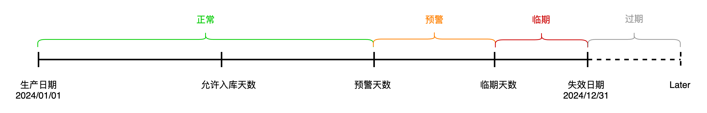

商品效期的多个状态

  
  

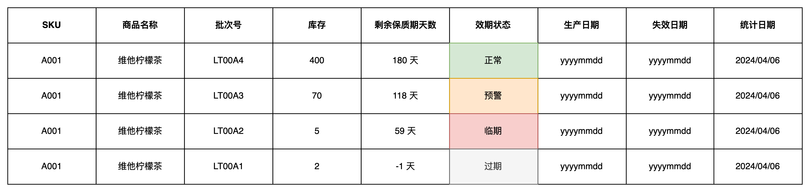

WMS的批次库存效期状态

  
根据前面所讲的方案，我们可以在OMS层开放一个“批次库存”查询的功能，用户可以在这个界面查看到更细一层的库存，包含商品的批次号，各种批次属性等，但是这些信息都不是OMS自己单独记录存储的，而是从通过接口从WMS端获取的。**针对海外仓的效期管理场景，OMS调用WMS的批次库存信息时，也可以不用把WMS的所有批次属性都展示出来，只需要重点展示“生产日期”， “失效日期”，还有“效期状态”即可。**  
针对效期类型的产品，海外仓客户希望能指定“效期类型”出库即可，此时OMS创建销售出库单的时候就只需要让用户指定“效期类型”，若客户不指定效期类型，则默认按“**临期先出**”的规则，由WMS进行批次库存的分配。  
  

OMS创建订单页面

  
当OMS支持用户指定效期状态的出库的时候，需要注意最好是**要支持多选效期状态，也就是同时出库多个效期状态的商品**。因为有一些客户对效期的管控没有那么精细化，正常、预警状态的商品都可以正常出库，甚至临期的商品也可以和正常的商品一起出库，支持多选可以兼容更多的场景。  
**OMS的库存查询**  
在没有深入讲解OMS的批次管理之前，前面的章节中也有提到“批次库存”的概念，这是一个逻辑层的“批次”，仅仅是用来统计库龄使用，没有其他的用途。  
逻辑批次的生成时间是OMS增加库存的时候，生成规则是按库存增加的日期来定义的，而且OMS的逻辑批次号和WMS的批次号并不一致，是OMS内部的逻辑。例如说下方OMS的批次流水中的批次，就是按库存增加的日期来生成的批次，仅用于统计库龄使用。  
  

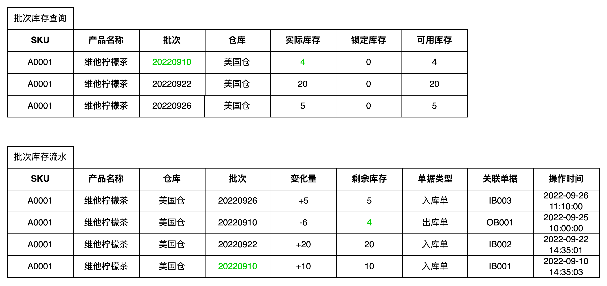

逻辑批次库存和批次库存流水

  
当海外仓OMS引入了精细化的批次管理之后，OMS层面应该会出现3种库存：  
1SKU维度的库存，这是OMS最粗糙的一层库存，也是大多数用户最关注的一层库存；  
2SKU-逻辑批次维度的库存，这是OMS自己为了统计库龄而定义的逻辑批次号，仅仅是用来统计库龄使用；  
3SKU-批次维度的库存，这是从WMS中获取的批次库存，具有较为详细的批次属性信息，可以便于OMS的用户指定某些批次属性（效期状态）出库；  
上述的3种库存中，2和3太容易让用户搞蒙了，很难向客户解释到底什么是逻辑批次，什么是WMS的批次，然后为什么要用2种库存来区分它，用户在查询的时候要怎么去识别和理解……  
所以，我们必须要对OMS的库存查询做出一定的改进，让用户可以通俗易懂地就理解这些库存的概念。我们可以将库存查询分成这么几个菜单：  
1SKU库存查询  
2SKU库龄查询  
3批次库存查询  
**1****SKU库存查询**  
SKU库存查询，指的是查询货主的SKU在仓库中的数量，可用数量，锁定数量，在途数量等，这些数据都是OMS自己记录的，入库之后，出库之后，仓库盘点之后等，OMS都会对应更新库存。  
  

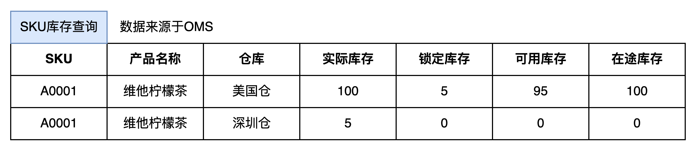

SKU库存查询

  
**2****SKU库龄查询**  
SKU库龄查询，指的是查询货主的SKU在仓库中存放了多久，库龄分别是多少天，因为计算仓租的时候需要使用到库龄的数据。这些数据都是OMS自己记录的，也是根据入库、出库、仓库库存调整等单据而更新记录的。在库龄查询的界面中，可以省略“逻辑批次”的概念，而是用“上架日期”来做批次的划分，这样可以避免05-OMS系统中出现多个“批次”而让用户搞不清楚区别。因为只要SKU+仓库+上架日期相同，那么就意味着是可以合并为一行数据的，即同一天入库上架。  
  

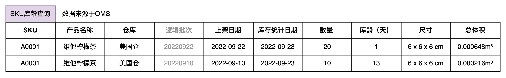

SKU库龄查询

  
**3****批次库存查询**  
批次库存查询，指的是查询货主的SKU在仓库中更细一层维度的库存数量，可用数量等，这些数据并不是OMS自己记录的，而是通过接口从WMS中获取到的。从WMS的批次库存中可以获取到所有的批次属性信息，但是有一些批次属性可能对OMS来说用途不大，所以可以省略一些。针对海外仓的业务场景下，推荐重点获取“生产日期”，“失效日期”，“收货日期”，“效期状态”即可。  
  

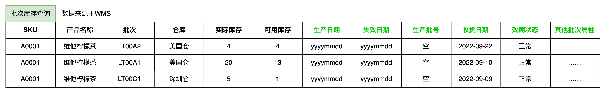

批次库存查询

  
**总结**  
批次管理在供应链系统中扮演者非常重要的角色，无论是OMS还是WMS，都有它的身影。日常我们在聊批次的时候往往代入的是WMS的场景视角，但是实际上WMS作为执行层，是不能独立于其他上游系统而单独存在的，所以OMS层面的批次管理也非常重要。  
在海外仓OMS中，精细化的批次管理往往会做得比较弱一些，一方面是因为海外仓的货物一般以普通货物居多，比较少有那些效期管理，批号管理的货物，所以相应的功能也就会尽量简单；另一方面是精细化的批次管理带来的仓储运营成本比较高，海外仓的执行和管理难度较大，所以这一块也会稍微降低要求和标准。  
如果大家想要更全面的了解OMS层面的批次管理，建议可以看看国内仓库的一些OMS，例如说京东，菜鸟，顺丰，富勒等，这些功能相对更完善很多，能学习到的东西也更多。