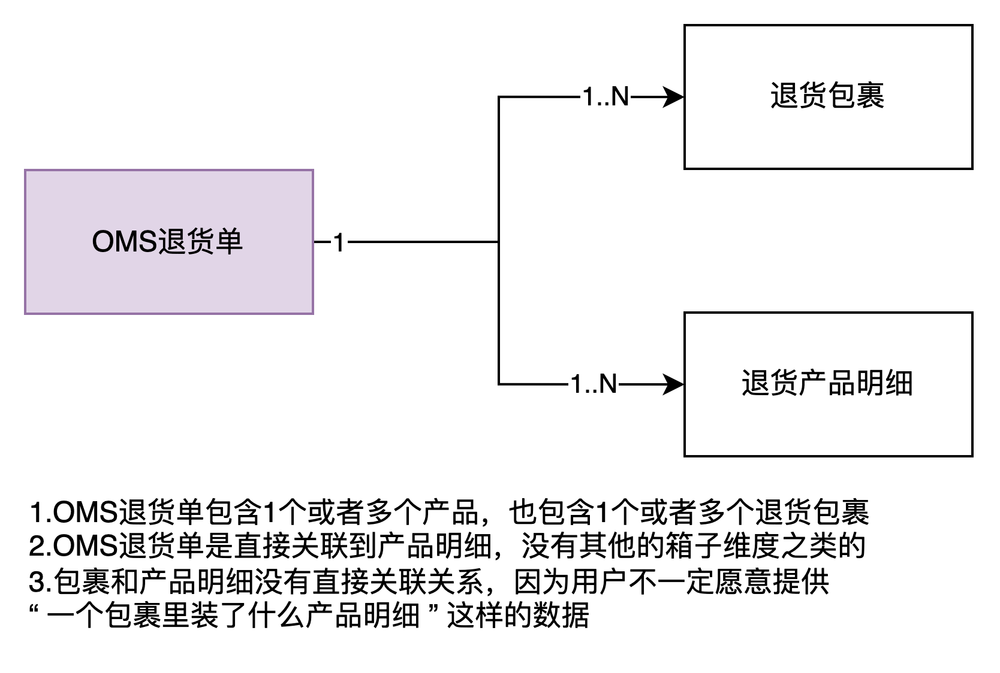
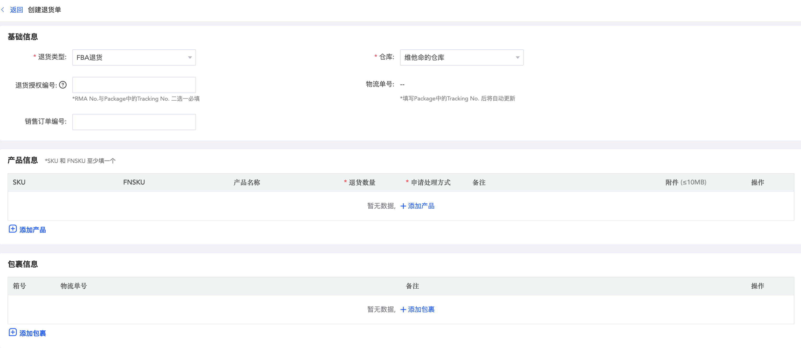
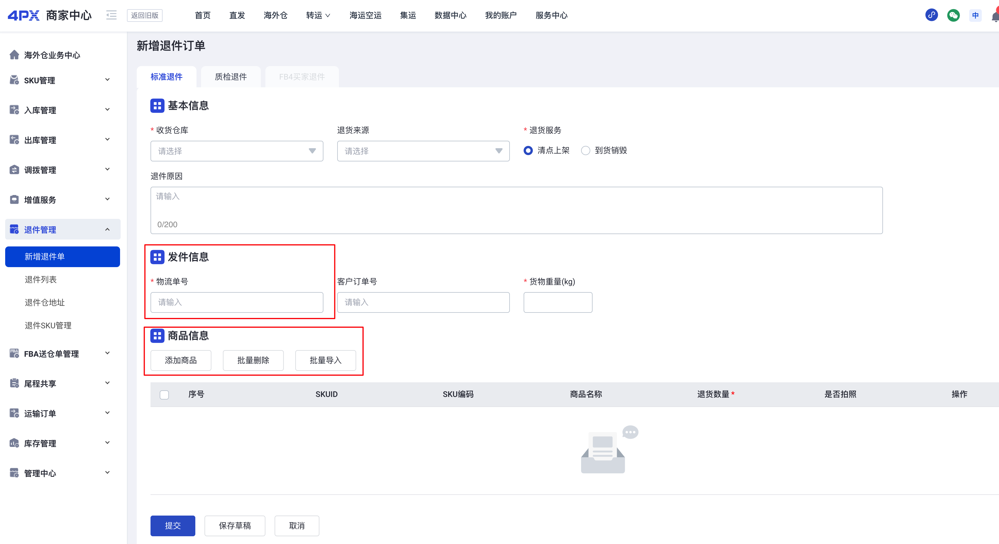
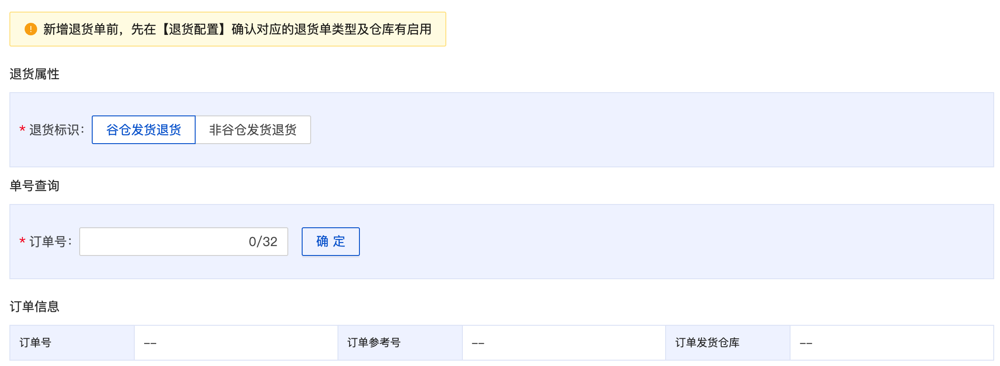
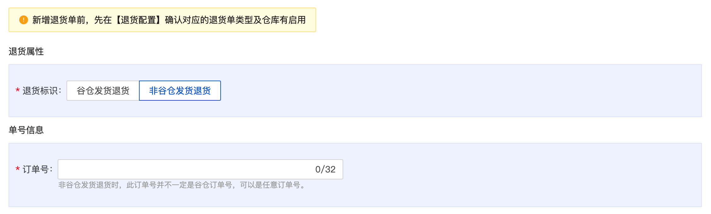
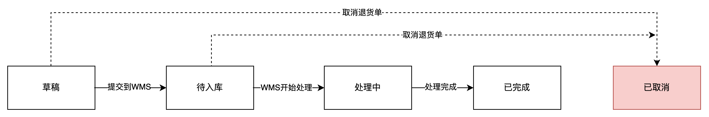
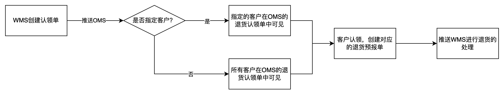

**海外仓退货的几个场景**  
之前介绍海外仓业务的时候提到，海外仓主要有4个业务，分别是：  
1一件代发  
2备货中转  
3FBA退货换标  
4拆柜转运  
这4个业务确实是比较主流和高频的，大多数仓库都会提供其中1~2个业务服务，但是也有一些海外仓为了给客户提供更丰富的服务场景，会引入“退货”的业务，有一些海外仓称之为“RMA”业务。  
RMA的全称为Return Material Authorization，即退料审查，退料审查指的是消费者对商品不满意从而产生退货换货，这时就需要对退货或换货商品进行审查。  
RMA是出货产品经过客户使用后发现问题（软件硬件功能，外观等质量）而退回给生产商的产品工序，这个工序包括产品维修，产品的升级，产品的维修报告和记录，还有当前状态指示和整体流程。  
一般来说，海外仓会接收到退回的货物，是基于这么几个原因：  
1客户发起的退货，客户对产品不太满意，进而产生的退货；  
2物流派送失败导致的退货，物流商派件的时候多次投递失败，就会自动退回到发件地址或者预设好的退件地址；  
3FBA移除订单产生的退件，卖家在亚马逊的店铺或者Listing出现了问题，相应的产品不能继续售卖，卖家就会在亚马逊后台创建移除订单，然后让FBA仓库把对应的货物退回到指定的地址，一般就是退回到海外仓，这个也就是上面提到的“FBA退货换标”的业务；  
4FBA仓或者第三方仓拒收而导致的退货，由于派送问题或者货物问题，导致FBA仓库或者第三方海外仓拒收这批货物，所以要将这些货物退回到原来的发货仓库（海外仓）；  
**本文所讲解的OMS退货业务，主要是针对第1种和第2种场景**。第3种场景一般会单独搞一个“FBA退货换标”的业务流程，而第4种比较少见，很低频，一般不需要系统单独搞一个功能模块去支持，发生了之后人工处理一下就好了。  
**海外仓退货的难点**  
从海外仓经营的角度来看，海外仓退货不是一门好生意，据我粗略的调研所知，很多做退货的海外仓服务商都会提到“不赚钱”，甚至是“亏钱做”。因为处理退货是一个很麻烦，很繁琐的业务，用户并不太愿意为此付出过高的成本，再加上海外仓人力成本又很高，而恰好退货是一个很吃人力的活。所以，海外仓退货业务，一边是比较低廉的客户应收报价，另一边则是比较高昂的海外人力成本，这样一结合，留给海外仓的利润就非常少了。  
从海外仓实际操作的角度来看，海外仓退货的处理涉及到多道流程、工序，有很多不确定性的场景发生，然后没有很好的办法进行批量化处理，所以导致退货的处理效率始终提不上去。哪怕是借助了WMS+PDA这样的信息化解决方案，也有很多难点和痛点没有被满足。  
常见的海外仓退货的难点有：  
1退货预报不可控，由于退货的方式和场景可能很多，所以导致仓库并不能很好地规划人力、场地来应对这些退货；  
2退回的货物千奇百怪，退货的理由有很多，而且消费者退回的货物也可能和销售的货物不符，这些都会导致海外仓处理退货的难度加大；  
3退回的货物处理方式很多，不同货值的货物，不同客户的货物会有不同的的处理方式，这让海外仓处理的时候也比较头痛；  
4退回包裹太多，分类困难，货物退回的时候会使用不同的物流方式寄送到仓库，每个包裹大大小小的都不太一样，仓库人员收到之后要分类、整理，然后逐个拆包核对，都非常费时费力；  
**具体的海外仓退货业务场景和流程介绍等后续我们会在WMS的章节详细讲解，在此只做一些大概的陈述。**  
**海外仓OMS的退货产品设计**  
**单据结构**  
  

OMS退货单的单据结构

  
海外仓OMS在创建退货单的时候，一般会让客户录入包裹信息和退货产品明细两大数据， 因为客户退货大多数情况都是通过寄快递包裹的形式送到仓库中，所以有包裹的跟踪号可以很方便地找到对应的退货单，然后通过退货单查看到对应预报的退货商品明细是什么。  
还有一些海外仓会给每个客户生成一个专门的退货地址，通过快递包裹如果找不到是哪个客户的单据，也可以通过地址上的一些特殊编号来识别是什么客户。  
  

Shipout OMS创建退货单

  
  

4PX OMS创建退货单

  
退货单可以分成“原单退回”和“非原单退回”，原单退回的意思就是之前是从OMS出库单发出去的包裹，然后整个都原单退回来，可以输入OMS的出库单号或者跟踪单号快速带出产品信息和包裹信息等；非原单退回的意思就是原先不是从OMS出库单发出去的包裹或者不是整个出库单完整的退回，这样输入OMS的出库单就带不出什么的数据。  
  

谷仓发货退货

  
  

非谷仓发货退货

  
谷仓发货退货可以通过原来的订单号查询到相关的订单信息，而非谷仓发货退货就查不到相关的订单信息了。  
退货回去的货物也会有不同的处理方式，一般来说常见的有：  
1重新上架  
2销毁  
3维修  
4二次加工（贴标、换箱等）  
但是其中用得最多的还是重新上架，因为其他的处理方式或多或少都比较麻烦，指令传递和作业处理都需要一定的条件，所以大多数海外仓接收到退货之后还是重新上架。有一些仓库会有严格的要求，退货回来的商品要专门放在退货上架区域；有一些仓库则要求退回来之后做一个简单的质检，如果是好的可以正常销售的，那么就重新上架到良品区，如果是不良品则上架到不良品区；还有一些则将退回来的货物直接暂存在待处理区，后续统一集中式销毁或者是转运回香港，进行统一的处理。  
**状态流转说明**  
  

状态流转图

  
1刚创建好的退货单是“草稿”状态，可以进行修改、删除等。相关信息检查无误之后，也可以提交到WMS中，此时状态就会变更为“待入库”。  
2OMS提交了退货单到WMS之后，单据状态会变更为“待入库”，此时消费者可能已经将货物寄送到了海外仓的退货地址，仓库收到了退回的包裹之后，就可以在“待入库”的状态下查到相关的单据。  
3当WMS接收到了退回的包裹并开始处理之后，OMS的单据状态会变更为“处理中”，这里的WMS处理包含好几步，看不同的仓库要求而定。  
a一般会先对包裹进行签收，确认包裹已经收到，然后拍照记录包裹的外观；  
b然后对包裹进行拆开点数，输入相应的产品信息，如果需要做质检的话，可以在清点的时候也顺带质检，把良品和不良品分开；  
c当收到包裹并清点完成之后，就可以执行上架动作了。因为前面提到了，仓库对退件的处理最常见的就是重新上架，哪怕是要销毁也要先放到（上架到）某个暂存区域，后续再集中式处理；  
4当仓库完成了上架操作之后，则会反馈数据给OMS，OMS的状态就会变更为“已完成”。这里特意没有叫作“已上架”是因为终态不一定是上架，所以就用了“已完成”这个字段。  
OMS的退货单和入库单的业务逻辑比较相似，提前创建单据预报给WMS，然后仓库作业完成了之后会反馈结果给OMS，最后也会增加对应库存。  
所以，OMS退货单也要关注在途库存的内容，当提交到WMS之后会增加对应的在途库存，当WMS上架完成之后则对应地将在途库存转化为可用库存。  
**其他逻辑的补充**  
**1.包裹无法识别**  
如果客户没有创建OMS退货单推送到WMS，那么仓库收到了退货的包裹之后就无法识别是哪个客户的，是哪个单。所以海外仓会存在大量的无头包裹，针对无头包裹的处理，重点还是要通过业务要求来规范OMS用户的操作，例如不预报的包裹将会额外增收操作费，不能识别的包裹要增加拍照费用，还有无头包裹超过了7天不认领之后就自动丢弃等。  
物流包裹无法识别，可能是有这么几个原因：  
1客户没有预报  
2客户预报了，但是单号填错了  
3系统数据出错了  
为了提升包裹的识别效率，海外WMS除了要支持扫描跟踪号来定位退货单之外，还可以根据包裹的地址信息还有包裹内的产品明细等去定位，虽然说这样的操作更加费时间，不够高效，但是相比于产生一堆无头包裹来说，这种方法也算是一种无奈之举。  
**2.物流退货的自动识别**  
海外仓退货，不一定都是客户退货，也有可能是物流退货，也就物流派送失败之后自动退回到原发货仓库。这种退货单一般客户自己也不知道，除非它一直监听出库单的包裹轨迹，才能在货物退回到海外仓之前及时去预报给WMS。  
所以针对这种场景，海外仓WMS需要针对物流退货做一些特殊处理。例如当仓库扫描物流包裹跟踪号的时候，可以顺带去查一下最近出库单的跟踪号，看这个包裹是不是物流退货回来的，可以带出原始出库单的产品明细。  
当然，有一些物流商，正向物流和逆向物流的单号是不一样的，所以通过出库单的跟踪号去查产品明细，只是一种补充，但是不能很好地解决这些问题。  
**3.仓库创建认领单**  
如果想尽各种办法，还是识别不了这个包裹到底是谁的，包裹的SKU是什么，那么就只能让仓库根据收到的包裹去创建认领单。仓库录入包裹的跟踪号，地址信息，还有一些照片等信息，先通过地址信息初步判断一下是属于哪个客户的单据，如果能确定是哪个客户的，那么就会进入该客户的OMS认领池，客户可以在里面看到WMS创建的认领单。如果无法确认是哪个客户的，那么WMS就会默认推送给所有的客户，每个客户在OMS的认领池都可以看到这些认领单。  
  

认领流程

  
待认领的包裹如果超过7天没有被认领，那么仓库就会集中销毁这些无头包裹，以减轻仓库的存储空间压力和成本等。  
**4.预报和实收不符**  
虽然客户在OMS预报了退货的包裹和产品明细，但是海外仓收货清点时，发现实物和预报不相符，也是很常见的场景。预报和实收不符，一般有这么几种类型：  
1产品品种不符，即SKU不符，例如：预报是退回手机，但是实际上退回了手机壳；  
2产品数量不符，例如：预报退货SKU1是2个，但是实际收到的可能是1个或者3个；  
针对第一种场景，品种不符的，一般海外仓只能收相符的部分，不相符的部分需要单独通知OMS建单或者WMS自己建单入库。前提是要知道这个产品的SKU是什么，如果不知道这个SKU是什么，那么不符的部分可能会被海外仓贴上一些关联单号，然后放置到待认领区，等客户自己通过图片外观等识别认领，再创建其他的工单来处理。  
针对第二种场景，数量不符的，一般海外仓退货清点的时候都要支持多收或者少收，然后将这种异常的状态反馈给OMS，让客户知道多了还是少了，但是一般不会等客户确认后再执行上架，而是直接海外仓就按实际收到的数量处理了。毕竟来来回回的交互，所花费的时间太多，对海外仓来说成本太高，不太值得这样做。  
  
**小结**  
海外仓退货场景非常复杂，实际上可能难度系数和出库流程差不多，但是退货的业务价值却低了很多。因为这里面的流程繁琐，步骤节点很多，不确认的东西太多了，所以很多海外仓都在这一块踩坑之后开始反思有没有什么更好的解决方案。  
普遍来说，大家达成的共识可能是：**退货可以做，但是一定不能太精细化**。越精细化的退货流程，海外仓要支付的成本越高，而且对整套系统功能模块的串联也有很高的要求，所以要么只给部分KA客户做退货服务，要么就专门搞退货仓，深耕退货、维修、售后这一块的内容，通过提高客单价和做丰富功能服务来盈利。  
如果一件代发，备货中转，FBA退货换标，拆柜转运，客户退货等多个业务都同时去做的话，踩坑的风险非常高，很有可能每一个业务都做得不会太好。