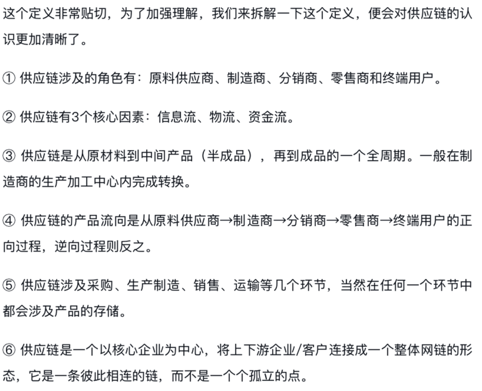
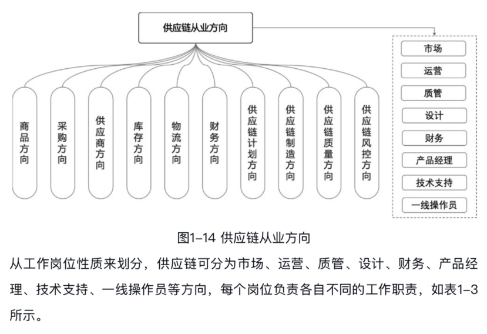
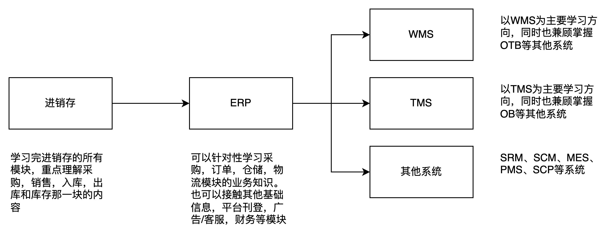

**前言**  
最近有好几个朋友咨询我一些“供应链产品经理”的问题，大致上有这么一些问题：  
●想往供应链产品方向发展，像我这种供应链零基础的，想请教您，可以从哪方面的知识开始学起呢？  
●我明年秋招，有一定的产品经验，比较看好供应链产品这个方向，想准备准备，想听听您有没有什么建议？  
●之前听说供应链产品的缺口比较大，但是我网上找了一下感觉没什么岗位呀？这是为什么呢？  
●老师，供应链产品经理有发展吗？我应该怎么去学习这一块的知识呢？  
●……  
之前一直没怎么写过这个话题的文章，刚好最近在重温学习一些供应链的书籍和资料，所以就趁这个机会把我的一些观点和看法写下来。如果有朋友也有类似的问题的话，也可以直接用这一篇文章来解答了。  
**什么是供应链？**  
我大概看了好几本书，然后也查了一些资料，其实关于供应链的定义大家一直没有统一标准，大家有各自的理解和定义。我比较认同的就是刘宝红老师提到的“盲人摸象”的故事：“供应链管理的范畴非常广泛，对它的认识就像盲人摸象，不同的背景不同的行业的人对供应链的定义是不一样的。”  
这里我找了两个比较主流的定义分享给大家，第一个是马士华的《供应链管理》中的定义：  
供应链是围绕核心企业，通过对信息流、物流、资金流的控制，从采购原材料开始，制成中间产品以及最终产品，最后由销售网络把产 品送到消费者手中的将供应商、制造商、分销商、零售商、直到最终用户连成一个整体的功能网链结构模式。它是一个范围更广的企业结构模式，它包含所有加盟的节点企业，从原材料的供应开始，经过链中不同企业的制造加工、组装、分销等过程直到最终用户。它不仅是一条联接供应商到用户的物料链、信息链、资金链，而且是一条增值链，物料在供应链上因加工、包装、运输等过程而增加其价值，给相关企业都带来收益。  
第二个是刘宝红的《采购与供应链管理：一个实践者的角度》中的定义：  
供应链是从客户的客户到供应商的供应商，供应链管理是对贯穿其中的产品流、信息流和资金流的集成管理，以最大化给客户的价值、最小化供应链的成本。它是一个综合管理、全局优化的思想，以摆脱单个公司、单个职能层面的局部优化，实现供应链条的全局优化为目标。  
如果只是看这两个定义，其实大家还是对供应链没什么概念和感触，这里我不得不称赞一下《实战供应链》的罗静老师，他的书中除了抛出了这样的枯燥定义之外，还抽出来了一些通俗易懂核心知识，一起来看一下:  
  

摘自《实战供应链》

  
如果通过一些精简的概念无法对供应链有一个具象化的了解，不妨将一些核心的要求抽出来，像“盲人摸象”一样去理解它，慢慢地有一个全局的认识。  
**什么是供应链产品经理？**  
对供应链有了大概的了解之后，我们再来看一下，到底什么是供应链产品经理？  
将这几个字拆开来看，就是“供应链”+“产品经理”，类似的定义有“SaaS产品经理”，“B端产品经理”，“C端产品经理”，“数据产品经理”等等。  
所以，供应链产品经理，其实就是负责供应链网链结构中的信息系统的产品定义、产品设计的人，也可以理解为负责供应链相关系统的产品经理。  
于是，我们就会面临另一个问题：**供应链网链结构中有哪些信息系统**？**这些信息化系统分别是干嘛用的？**  
**供应链系统有哪些？**  
要知道供应链产品经理有哪些就业方向，就要知道供应链网链结构中有哪些信息系统，毕竟狭义上大家聊到的产品经理肯定是和某些系统关联的。例如张三说自己是供应链产品经理，主要负责的是采购相关的系统；李四也说自己的供应链产品经理，主要是负责订单履约的系统；王五也说自己的是供应链产品经理，主要是负责仓储作业的系统……  
这里以《实战供应链》中提到的供应链从业方向为例，跟大家分享一下市面上常见的一些信息化系统，这些系统都是与供应链相关，所以负责这些系统的产品经理都可以称之为：**供应链产品经理**。

摘自实战供应链

  
**1.进销存系统**  
进销存系统是一个比较容易被大家忽略的存在，进销存系统可以理解为一个“小型的ERP”，一般都会包含供应链模块（采购，销售，仓储/库存）和财务模块（应收，应付，对账）等。市面上也有比较多的进销存系统，就业机会也还OK。  
**2.ERP（Enterprise Resource Planning）**  
ERP产品经理应该是市面上最常见、最高频的一个方向了，除了像金蝶、用友、Oracle等传统ERP外，还有比较火热的电商ERP。电商ERP又可以分为国内电商ERP和跨境电商ERP，就业机会还算比较多。  
**3.WMS（Warehouse Management System）**  
WMS也是比较常见的一个就业方向，按上述提到的分类，也可以分成国内WMS和跨境WMS。一般来说，WMS不会光溜溜的独立存在，围绕上下游的业务，还会有OMS，TMS，BMS等，所以这几个系统统称为“OTWB”，都算是供应链系统。  
**4.TMS（Transportation Management System）**  
提到了仓储，那么就必须要提到它的好兄弟，也就是物流，TMS就是指运输管理系统。如果还是按上述的分类，也可以分成国内TMS和跨境TMS，不过根据我的了解跨境TMS和国内TMS差距还是很大，很多核心业务和功能都不太一样，所以要注意辨别。对于TMS来说，也不会光溜溜的独立存在，一般会和OMS和BMS搭配，所以统称为“OTB”，这里的“OTB”和上面的“OTWB”有一些些不太一样，名字虽然一样，但是一个是针对物流业务，一个是针对仓储业务。  
**5.MES（Manufacturing Execution System）**  
MES系统简单来说也就是生产制造的执行系统，它是一套面向现在所有制造类型企业之间的一个生产信息化的管理系统。整个系统在进行实际体验的过程当中，涵盖了所有的数据管理或者是计划的管理，还有库存管理，质量管理以及人力资源的管理，在工装管理或者是采购管理这一方面，将能带来更好的全过程控制。一般是有制造、生产、加工能力的公司才会配备这个系统，算是一个比较垂直的领域。  
**6.其他供应链系统**  
除了上述提到的这个高频常见的系统之外，还有SRM（供应商关系管理），SCM（供应链管理），SCP（供应链计划），PMS（采购管理系统），ASM（售后管理）等系统，都可以算作是供应链信息化系统，负责这些系统的产品经理们，也可以称之为供应链产品经理。  
所以，当新人朋友们问“想做供应链产品经理”的时候，我一般会反问他：  
你理解的供应链系统有哪些？你想做什么方向？  
如果你只是傻傻的在招聘网上搜索“供应链产品经理”，那么搜出来的结果肯定是偏少的，因为供应链本身就是一个很大的概念，而供应链产品经理自然也是一个很广的范畴了。  
**从什么方向入门供应链产品？**  
之前群里有很多朋友分享自己刚入职做WMS产品经理的心路历程，得出的一致结论就是：**WMS太吃业务知识了，并不适合入门学习。**  
当年我也是从WMS入门供应链这一行的，也确实是吃了不少的苦头。没去仓库之前被一堆术语和概念绕晕，去了仓库之后又被一堆花式操作给搞蒙了，很长一段时间内都觉得自己产品成长及其缓慢，十分痛苦。  
所以，如果新人们想要入门供应链产品方向，我是第一个不推荐WMS方向的，同理TMS方向也是如此，上手难度比较大，如果公司没有很好的培养机制，那么个人的成长就会非常的痛苦，踩坑，走歪也是有可能的。  
那么，应该从什么方向入门供应链产品呢？我个人是推荐这个路线的。  
  

  
进销存是我个人建议第一个要学习的系统，而第二个到底是ERP还是WMS还是SCM等其实没有严格的要求，只是我个人感觉学习完了进销存之后再去学习ERP会有一种熟悉和亲切感，也能相互印证对比，加深理解。  
需要说明的是，**这个推荐是针对一个新人小白用户去学习供应链知识和系统，然后达到入门和进阶的效果而制定的**。实际的工作中，对于打工人来说并没有那么多可选择的机会，先选什么，再选什么，最后再做什么。基本上就是你面试了什么岗位，就直接丢上去干活了。  
如果你是一个有工作经验的产品经理，想要转行到供应链领域，也可以推荐这样的学习路径，相对来说比较平滑。  
**有哪些供应链资料可以推荐吗？**  
如果要学习一个供应链相关的知识，那么我推荐可以从这几个方向去去发力，分别是：  
1从成熟的信息化系统中学习。  
2从书本、文章、视频等媒体渠道学习。  
3从行业前辈、大佬、博主等身上学习。  
**1.信息化系统推荐**  
上面聊到了入门供应链产品的学习路径，那么我顺带也推荐几个比较容易拿到试用账号或者操作手册的具体系统吧。  
进销存：推荐注册“七色米”，“网上管家婆”，“金蝶精斗云”。 ERP：推荐“万里牛ERP”，“网店管家ERP”，“店小秘ERP”，“领星ERP”。 WMS：推荐“万里牛WMS”，“吉客云WMS”，“微仓WMS”。 TMS：推荐“易流TMS”，“唯智TMS”，“富勒TMS”。 其他系统：自己百度一下，或者加入我的知识星球，会有一些资料分享。  
从优秀的、成熟的系统上学习是产品经理需要掌握的最基础，也是最高效的学习方式，这个方法适用于所有行业和方向的产品经理。  
**2.书籍推荐**  
如果是供应链的知识，那么就建议阅读《采购与供应链管理：一个实践者的角度》《实战供应链》这两本书。既然要做供应链产品经理，那么产品基本能力还是要具备的，所以这方面的知识也是要学习的，我推荐《启示录》《写给大家看的设计书》《决胜B端》这三本书。  
这几本书微信读书上基本上都有，如果没有的可以自己买实体书看看。  
**3.行业前辈、大佬、博主等**  
这一块可以自己搜索了解一下，最好是可以加入相应的供应链产品群，和诸多群友们一起沟通交流一下。这里给自己打个广告，推荐一下我的读者群和知识星球，目前已经有400多个产品朋友加入了群聊，200个朋友加入了知识星球了。如有需求，可以通过文末的微信我联系，注明来意即可。