**前言**  
之前有很多产品朋友咨询我怎么入门供应链行业，供应链产品经理是否值得选择，供应链未来的前景怎么样等问题，然后我也在前不久写了一篇文章进行了一些解答。  
这篇文章的阅读量和反响都不错，再加上我的产品私享课的课程安排就是从进销存系统开始的，所以我决定拓展这一块的内容，做成一个系列，希望对一些想入门供应链行业的朋友有一些帮助。同时也进一步加深我对供应链相关系统的一些认知和细节方面的查缺补漏。  
**进销存系统，听过的人多，做过的人少**。听过但是没做过大都认为这个系统很简单，多个供应链系统中有一定的“鄙视链”存在，而进销存系统显然是在底层的那个。虽然我也认为进销存系统确实简单，但是产品水平并不一定是通过业务复杂度和系统复杂度来体现的，把一个简单的事情做到极致和完美也是一种高水平的体现。  
接下来，我们就来一起看看进销存系统一般都包含什么内容吧。  
**进销存产品结构**  
之前我整理了一个进销存系统的核心功能清单，如下图所示，基本上大多数的进销存系统都会有这些模块，类似于“珍珠奶茶”的基底，然后在此基础上可能会拓展一些网店管理，数据报表，精细化管控，硬件设备等模块。如果是为了快速入门进销存或者供应链，那么我建议重点关注“货”相关的模块即可，例如：  
1采购管理，采购退货，入库管理；  
2销售管理，销售退货，出库管理；  
3库存查询，库存流水，调拨，盘点；  
  

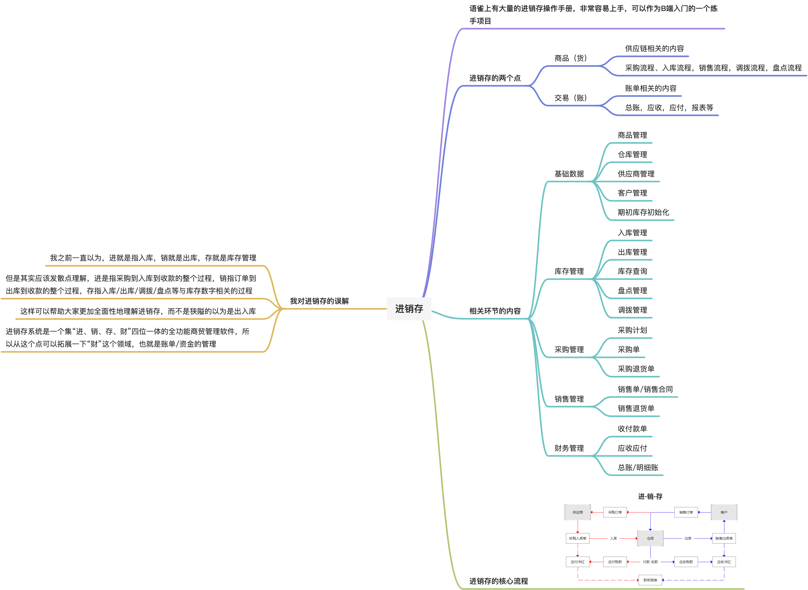

  
**进销存的核心模块**  
**采购管理**  
采购方面的内容应该是很多供应链书籍都会提到的，里面有非常多的门道和细节，但是对于进销存系统来说，我们姑且可以不用考虑那么复杂，只需要关注一些核心的点即可。当我们想要做采购相关的系统的时候，可以试着从这么几个点去发散一下，就可以理解，为什么进销存系统会有这些基础数据/资料的管理。  
当要采购东西的时候，首先得要知道需要采购什么（商品管理），然后向谁采购（供应商管理），接着是以什么价格去采购（采购价格管理），采购多少数量，最后采购的东西要放到哪里去（仓库管理）。  
  

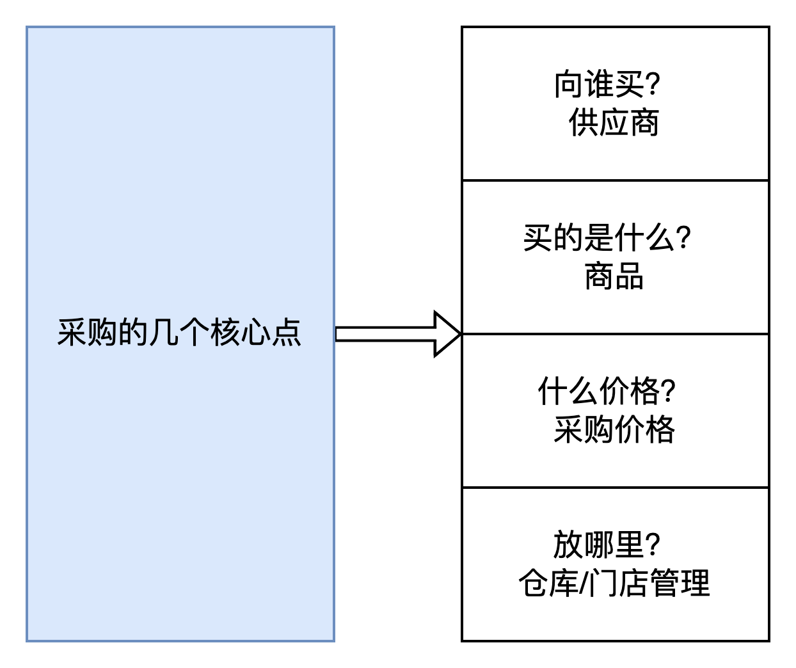

  
通过上面的一串问题，我们发现，如果要设计采购管理方面的系统功能，那么需要先提前把对应的基础数据给维护起来，于是我们就要先搭建好基础数据管理的模块，这样才能支撑未来的业务数据流转。  
  

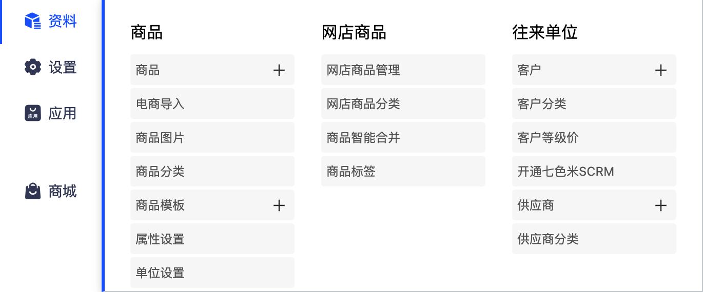

截图来源：七色米进销存

  
有了基础数据之后，我们就可以根据实际的业务流程来设计对应的单据流转了。采购可以分成正向流程和逆向流程，正向流程就是采购到入库的流程，逆向流程就是退供应链的流程，从仓库退货回供应商。  
不同的进销存系统要解决的业务场景不太一样，所以采购流程也会些微的不太一样，这里我以一个比较简单和通俗的采购正向流程为例，为大家拆解一下进销存的采购流程。采购流程中，可以重点关注两个单据的流转，一个是采购单，一个是采购入库单。采购单由采购部门创建，然后通过审批之后会自动生成对应的采购入库单，仓库对着采购入库单进行收货、清点、入库……  
  

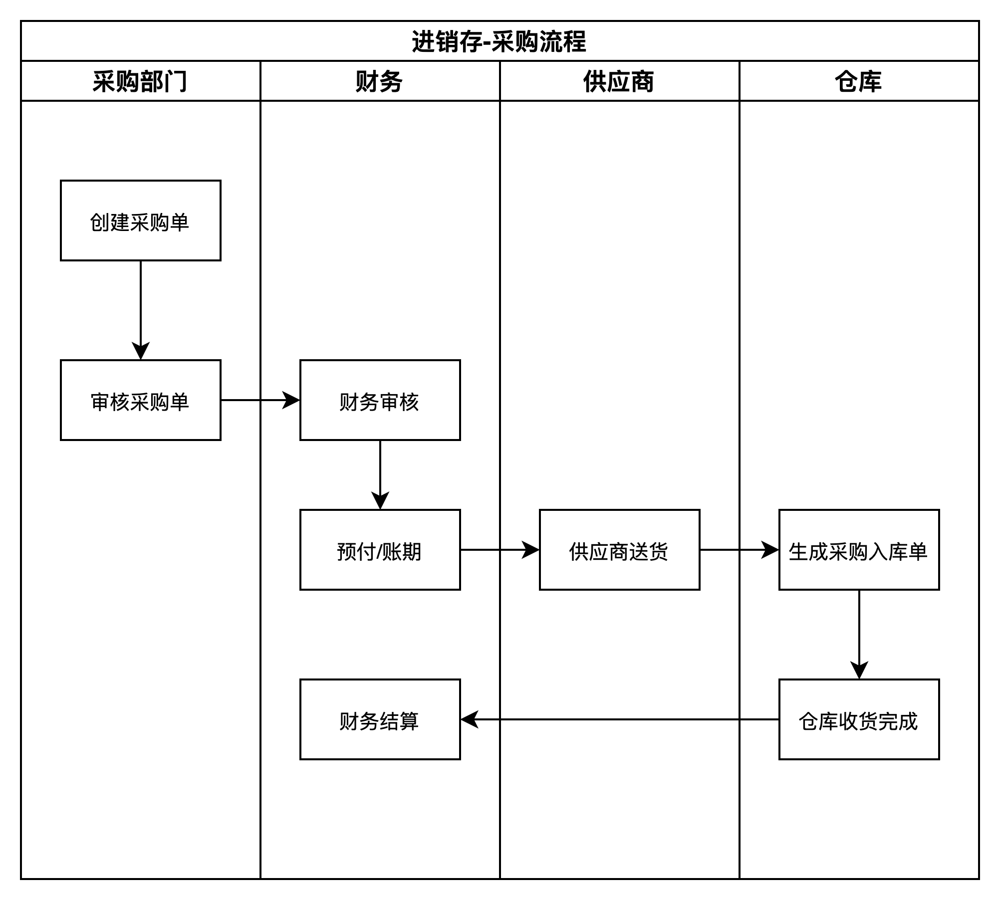

  
在采购的逆向流程中，也是重点关注两个单据的流转，一个是采购退货单，一个是退供出库单。采购退货单由采购部门创建发起，然后审批之后会生成对应的退供出库单，然后仓库按出库单的要求进行出库，退回给到供应商。  
  

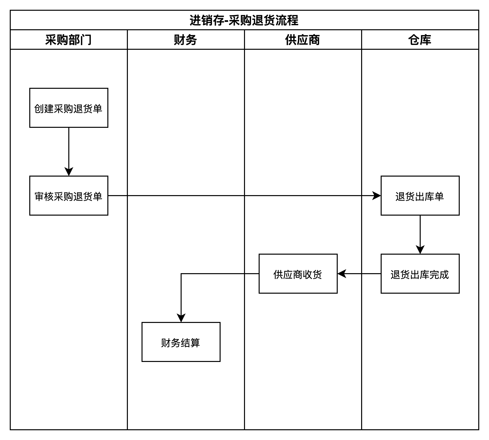

  
**销售管理**  
进销存的销售管理和常见的2C的电商玩法有一些不太一样，主要就是2C的电商一般不太会对客户进行管理，也就是不需要记录客户的信息，因为客户太多了，只需要把一些共性抽出来做用户画像即可。而进销存系统中销售，由于存在一些批发单或者是高价值的单，还有一些赊欠账等，再加上客户数量可能不会太多，所以反而会有客户管理的需求。  
销售单和采购单有点“镜像对称”的感觉，采购是把货物买进来，而销售就是把货物卖出去，一个入，一个出。销售单需要关注卖给谁（客户管理），卖的是什么东西（商品管理），卖了多少，卖多少钱（销售价管理），然后从什么地方发出（仓库/门店管理），是用什么方式发出（物流管理）。  
  

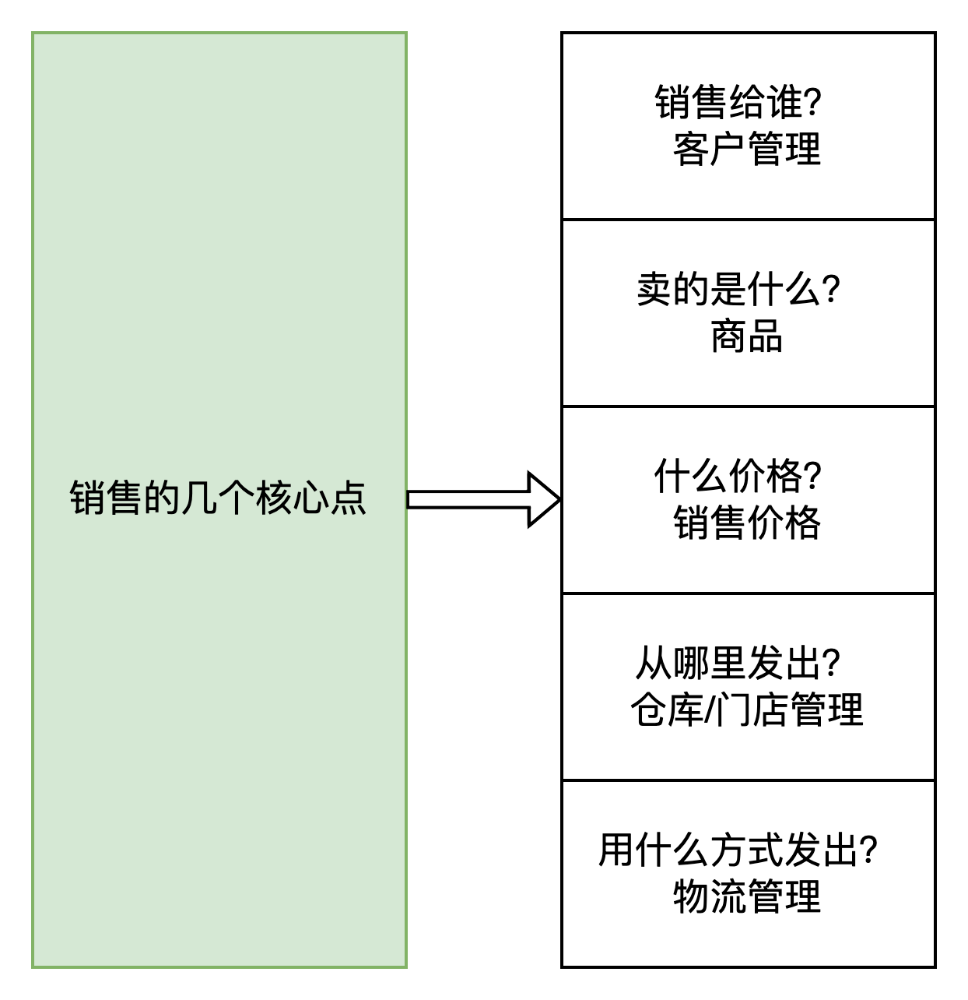

  
对应的，销售管理的环节中，也会有一些基础资料的模块需要提前维护和管理，这点和上面的采购管理是类似的，就不多赘述的。只是从我的个人经验来说，我会**建议大家在上手体验一个新的系统的时候，一定要先多关注基础数据，再去看业务流程**，因为基础数据往往能帮助你更好地认识到业务是怎么串联起来的。  
正向的销售流程中，也是重点关注两个单据。一个是销售单，一个是销售出库单。相关的细节流程我就不过多介绍了，大家自己看图理解即可。

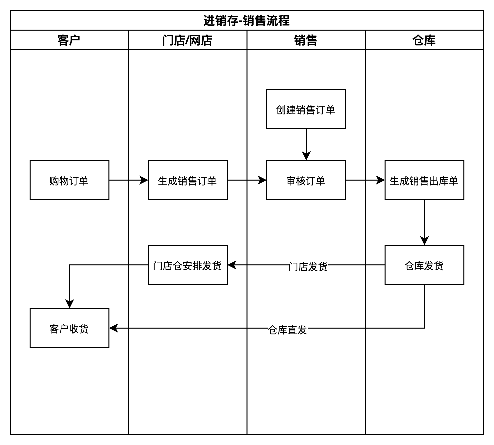

  
除了正向销售流程之外，逆向的销售流程，即退货流程也是一个很重要的环节。一般也是关注两个单据，一个是销售退货单，一个是退货入库单。从过去的经验来看，很多时候，**逆向流程由于有太多的不可控性，在设计方案的时候往往会比正向流程更加复杂**，需要提前分好多一些的时间精力去应对。  
  

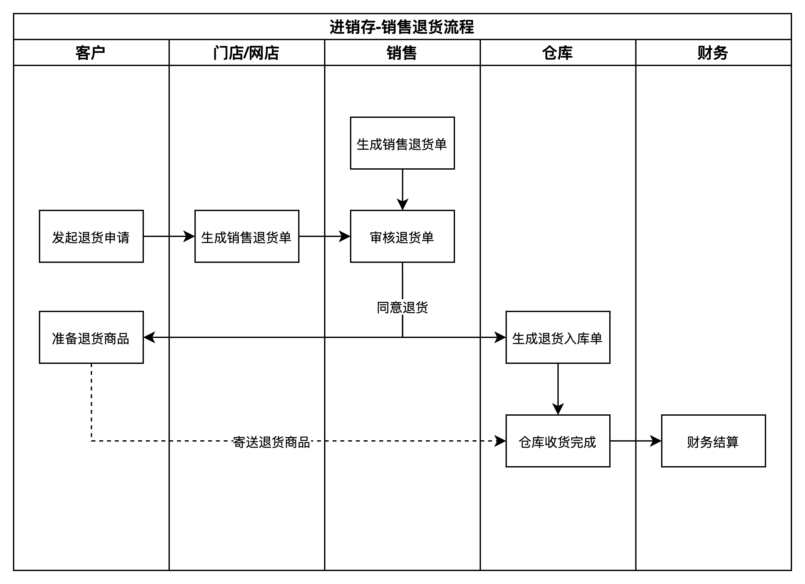

  
**库存管理**  
“进销存”三个字，进就是代表采购->入库的业务，销就是指销售->出库的业务，而存就是指和库存相关的业务了。其中库存相关的业务中，我个人认为最重要的就是要搞懂“库存流水”和“库存查询”的关系，以及库存变化的一些形态。  
首先是关于库存变化的一些方式，这里我借鉴网上看到的一张图，做了一个高清版，一般来说进销存/ERP/OMS/WMS等都会有包含这里面的一些场景，只不过不同的系统之间会有一些少量的差异而已。  
  

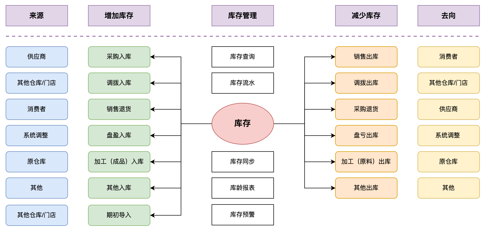

  
了解了库存变化的常见场景和形式，接下来就应该要重点关注一下库存流水和库存查询之间的关系，理清楚了这个点，基本上就对库存管理入门了。  
每一次的库存数据变动，无论是增加还是减少，都要生成对应的库存流水。库存流水一般包含如下几个关键字段：  
●产品/SKU  
●仓库/门店  
●变化的数量，是增加还是减少  
●变化后的数量  
●变化的原因，是什么业务类型导致的变化  
●变化的时间  
●变化的单据，是因为什么单据导致的变化  
  

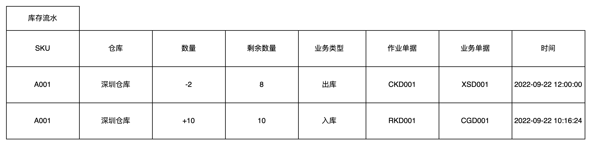

  
库存流水最新的一条记录展示的数量，就是库存查询的结果数量。  
例如说A001这个产品最新的库存流水是出库了2个，剩余8个库存，那么在查询库存的时候，就会看到深圳仓库中A001的库存是8。  
库存查询除了能展示实际的库存余额之外，还可以根据时间的业务需要，展示锁定的库存和在途的库存。**而锁定的库存和在途的库存，其实也有库存流水或者库存明细**。因为系统要知道有多少锁定和在途，就一定要记录是什么原因而导致的锁定和在途，需要对这个详情记录，而这个详情，其实就是流水。  
  

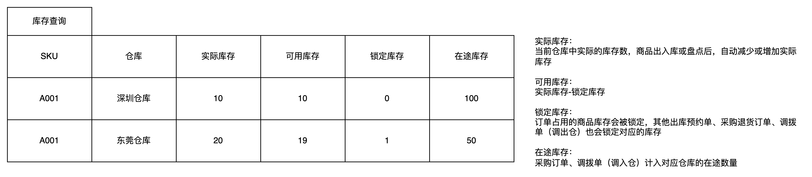

  
如果系统做的细节一些的时候，点击锁定库存和在途库存的数字是可以用小弹窗来展示具体的单据和时间等信息的，这些数据都来源于流水，分别是锁定库存流水和在途库存流水。只不过由于这一部分的内容不是特别重要，一般不会专门用一个页面去展示而已。  
库存和库存流水的关系就类似于微信的钱包和账单一样，每一笔交易都会生成账单明细，而账单明细通过加减计算，会得出最终的余额。  
讲到这里，再补充一个我之前在知识星球科普的一个关于盘点的案例，帮助大家更好的理解库存流水和库存查询的关系。  
  

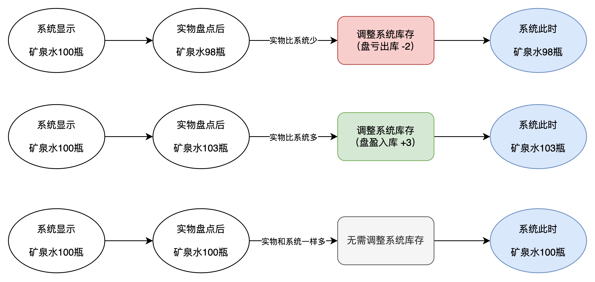

盘点示意图

  
盘点就是实物数据和系统数据进行对比，因为实物是不能调整的（凭空创造或者消失），所以一般的盘点都是按实物为准，然后去调整系统的库存数据。  
实物多于系统，那就是盘盈了；实物少于系统，那就是盘亏了。  
盘盈了，那盘点结束了之后，就会生成一条多了的库存流水，一般的业务类型是“盘盈”或者“盘盈入库”；盘亏了，那盘点结束了之后，就会生成一条少了的库存流水，一般的业务类型是“盘亏”或者“盘亏出库”；  
这里最关键的点就是，盘点完成之后不是直接调整系统库存，例如把100变成98。而是需要插入一条“-2”的库存流水，业务类型是“盘亏出库”，然后通过流水的计算，让库存从100变成了98，最后查询的时候发现系统的库存就变成了98。  
**记住，所有的库存变化都要和流水挂钩，切不可直接修改库存结果，因为这样未来才好核对，也符合实际的业务需求。**  
**从进销存学供应链**  
听我讲完了进销存的“进”，“销”，“存”业务之后，好像感觉进销存好简单，那作为一个新人应该怎么去验证自己对进销存的掌握情况呢？  
我个人建议是直接注册一个进销存软件，然后体验一遍所有的供应链相关的模块就好，在这里我推荐的是七色米进销存，可以无需注册，直接体验试用，地址如下：  
  

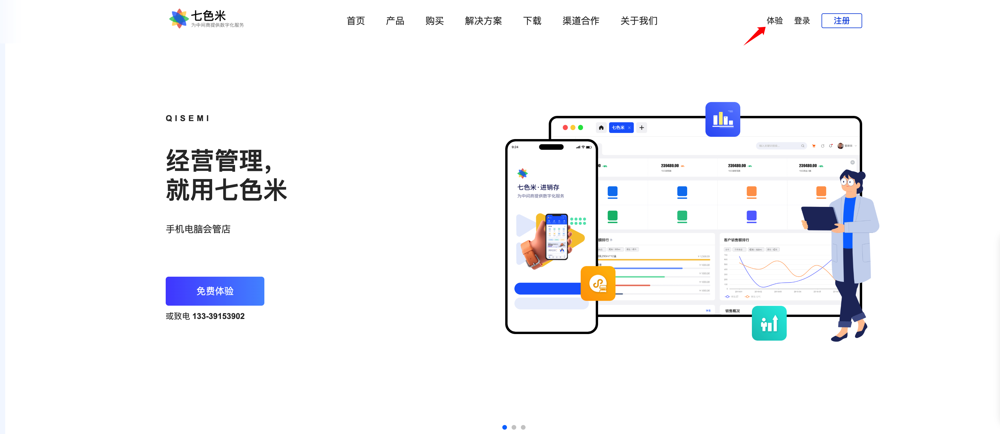

https://www.qisemiyun.com

  
当体验完了一整套进销存系统之后，我相信大家又会产生一个新的疑问：**这就是供应链？这就是供应链系统吗？我学完了这个之后我就入门供应链了吗？**  
我的答案是：这就是供应链，但又不全是供应链。  
什么是供应链？这个定义很官方，也很庞大，不太好理解。  
供应链是围绕核心企业，通过对信息流，物流，资金流的控制，从采购原材料开始，制成中间产品以及最终产品，最后由销售网络把产品送到消费者手中，将供应商，制造商，分销商，零售商，直到最终用户连成一个整体的功能网链结构模式。它不仅是一条连接供应商到用户的物流链、信息链、资金链，还是一条增值链，物料在供应链上因加工、包装、运输等过程而增加其价值，给相关企业带来收益。  
从这个定义中，我们摘出一些关键词，然后通过这些词来帮助我们更好地理解供应链。  
1供应链的三流：信息流、实物流、资金流。  
2供应链涉及的角色有：原料供应商、制造商、分销商、零售商和终端用户。  
最近看了一本书，里面提到了供应链五流的概念，我感觉这个定义会帮我们更好的理解供应链。  
  

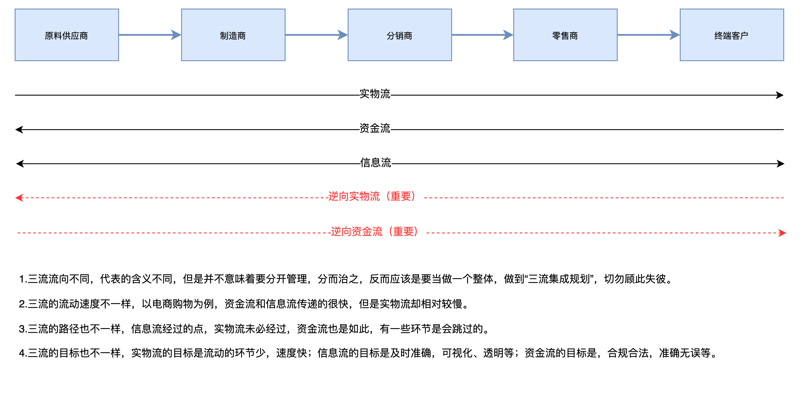

  
例如上面提到的采购退货和销售退货，其中就包含了逆向实物流，因为实物要退回；逆向资金流，对应的资金也要退回。而信息本身就是双向流动的，所以不存在正向和逆向的区分。  
所以通过上述的定义，我们可以发现，供应链系统其实就是围绕供应链各个环节而产生的信息化管理系统，通过信息系统来帮助我们更好地管理供应链的各个角色，各个环节，各个场景等。  
所以，进销存系统当然可以算作是供应链系统，但是也不全是供应链系统，虽然供应链的含义非常庞大，进销存系统也有一些衍生的模块和场景是不属于的供应链的。我们也不用特意去纠结哪一块属于供应链，哪一块不属于供应链，只需要关注实际业务和对应的系统解决方案即可。  
**总结**  
关于进销存系统，上面的内容拆解的都很粗糙，如果要拆解的很细，估计得要用视频直播的方式来做了，篇幅非常的大。  
所以，我希望这个文章能给大家一些启发性思考，帮助大家更好的理解进销存系统，从而找到一些入门供应链的窍门和平滑路径。进销存系统虽然简单，但是里面的细节很多，七色米是一款不错的SaaS进销存软件，非常适合没有做过或者接触不多SaaS&2B领域的产品经理上手学习。  
如果对七色米的一些核心功能玩熟了之后，建议大家去注册「有赞」体验一下，你会发现关于进销存相关的模块，几乎可以直接无缝迁移，快速上手。再体验完了「有赞」之后，可以考虑找一些轻量级的ERP或者OMS体验一下，也可以非常平滑的过渡。