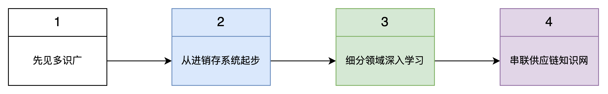
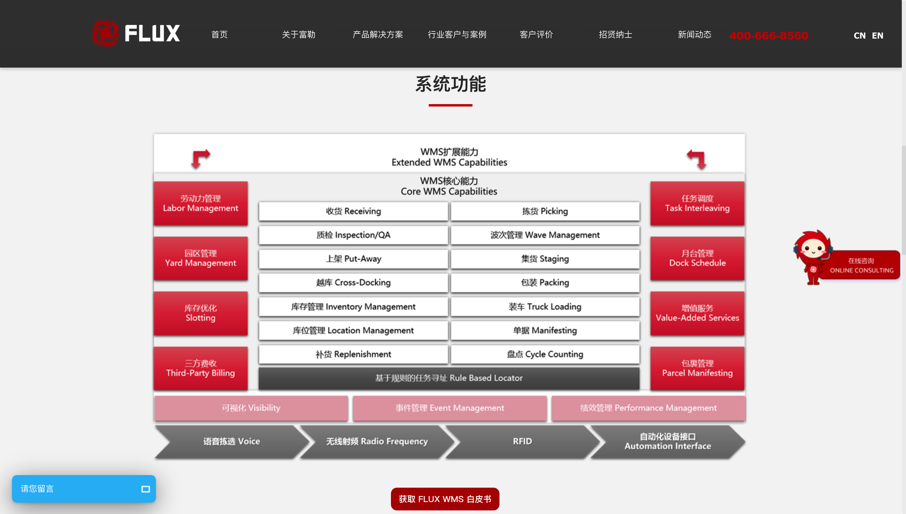
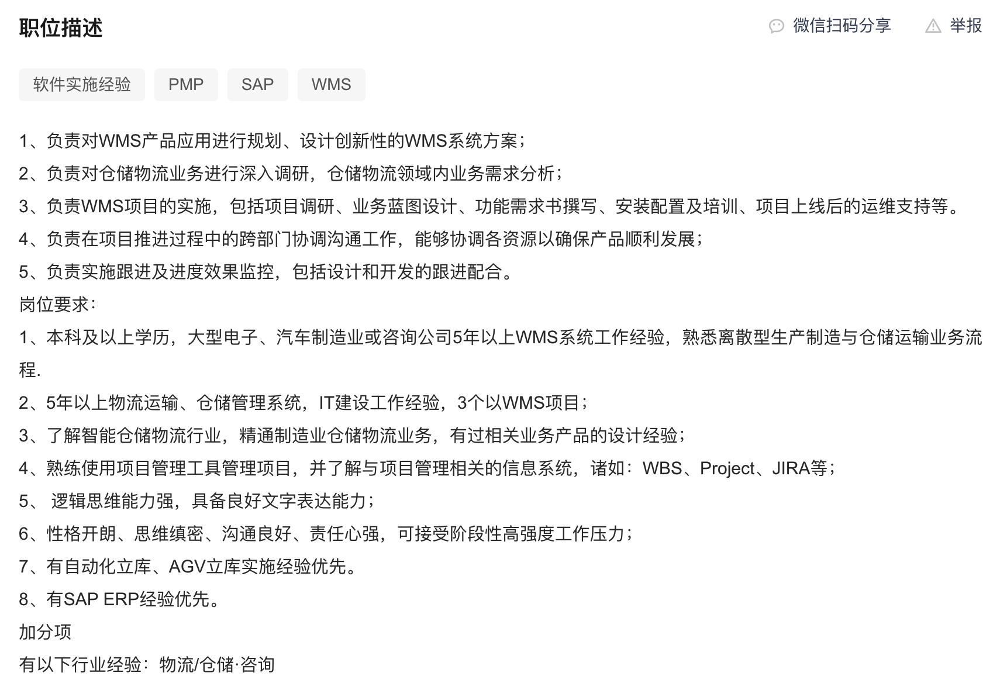
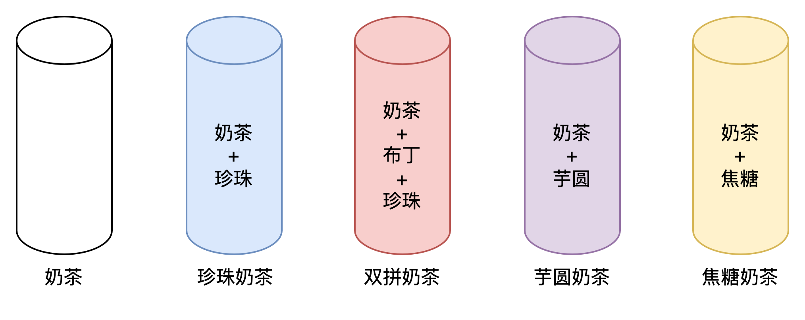

**供应链产品经理学习的四个阶段**  
很多产品朋友会在不同的渠道接触到一些供应链业务或者供应链系统的碎片化知识，然后其中一些朋友就逐步对这个方向的产品经理岗位有了一些好奇和向往。**想知道这个赛道到底怎么样？自己是否可以转岗到这个方向？供应链赛道方向众多，自己应该从什么点去切入？**  
鉴于我之前做了好几期的“供应链产品项目实战课”的经验，所以这一篇文章就特来分享一下关于供应链产品经理怎么入门学习，怎么成长的一些心得。  
供应链系统有非常多，不同的供应链系统侧重点不太一样，所以学习起来的路径都不太一样。我会建议先“见多识广”，有机会就多体验和见识一下有哪些供应链系统，它们长什么样子，有哪些功能模块，大概是解决什么问题的，这些系统的优势分别是什么……  
可以先从通用性广，普适性强，上手简单的业务场景或者系统入手，例如说进销存系统。“进销存”大多数01-供应商系统的基石，通过对进销存系统的学习，可以掌握很多底层的业务知识和产品方案的设计。  
掌握了进销存的基础知识之后，可以深入某个领域去钻研学习，例如采购，仓储，物流，订单，库存，生产制造，质量管理，计划等，这些细分领域一般都会有单独的系统。例如SRM（采购），WMS（仓储），TMS（物流），订单（OMS），库存（中央库存系统），生产制造（MES）等。在掌握了其中一个或者多个细分领域的系统设计之后，后续在工作中如果有机会的话就可以横向拓展其他供应链业务和系统，然后串联成自己的供应链知识网。  
  

新人学习供应链的路径

  
前一篇文章是关于进销存系统的拆解文章，展示了一个进销存系统大概有什么功能模块，能解决什么业务场景，然后也得出了一个结论：**如果大家要入门供应链方向的话，可以考虑先从进销存系统着手，这是一个很平滑的学习曲线**。  
当深入体验并拆解了进销存系统之后会发现好像SaaS版本的进销存系统普遍来说复杂度不够深，然后业务逻辑也不会特别绕，对一些上手比较快的朋友来说就会觉得“好像没什么很有挑战”，同时也有一些朋友会觉得“好像供应链产品经理也没什么壁垒和门槛”。  
如果你已经到了这个阶段，有这种感受了的话，那么我就开始建议你可以往更加深入的方向去学习，例如说：**WMS（仓库管理系统）**。  
对于03-WMS系统来说，复杂的WMS可以做到特别复杂，简单的WMS也可以做到非常简单，它是一个相对来说“比较标准”的产品，或者说对于大多数供应链类信息化系统来说都算是“比较标准”的产品，这里的“比较标准”可以体现在：  
1大多数业务场景和知识是可以共用的，好的解决方案会逐步沉淀、传播开来，所以大家的解决方案等也会大差不差；  
2行业内有相对比较知名的头部产品，这类产品用户规模广，产品竞争力强，兼容覆盖的业务场景也多，可以给其他追随者带来充分的借鉴参考作用；  
3产品能覆盖的行业，领域，用户，场景等比较全，不会轻易出现隔行如隔山的情况，可以通过差异化实施来满足不同的个性化需求；  
对比上述三个特征，国内的电商WMS相对来说已经是比较标准了。这里特意提到电商WMS，是指目前电商仓的数量多，面积大，需要使用电商WMS的企业多，而且电商的业务也相对来说比较标准统一。  
而海外仓的WMS经过这么几年的发展，也逐步趋于标准化，大多数海外仓WMS都能满足“一件代发”，“备货中转”，“FBA退货换标”，“拆柜转运”，“客户退货”这几个常见的跨境电商仓储履约场景。  
**“标准化产品”的产品经理价值在哪里？**  
很多人可能听到“标准化产品”后，第一个反应就是这个赛道是不是很成熟了？相关产品经理的工作是不是就只能修修补补，没什么大刀阔斧的改进了？  
之前在社群的时候也有人提到了这个话题，问：**WMS都比较标准了，为什么还有那么多公司要招WMS产品经理？**  
这个问题挺有意思的，虽然是在聊WMS，但是也可以引申到其他“标准化产品”上面去，例如CRM，HRM，OA等。我针对WMS这个场景，分享一下我自己的观点和看法。  
首先，WMS确实是相对来说标准化的产品，这意味着很多公司会选择采购第三方成熟的WMS，例如富勒WMS，唯智WMS等，这些产品功能强大，可以动态配置，也可以支持二次开发，所以如果遇到一些特殊的场景或者需要定制化的时候，也可以比较低成本的去响应。但是一般来说，找第三方的实施人员或者开发人员去做二次开发成本都比较贵，而且响应的速度、效率、态度、服务质量等都不太可控。所以即使是采购了标准化的产品，也会有很多公司去招聘自己的技术团队，用于应对一些特殊场景，定制开发等。  
  

富勒WMS官网

  
其次，除了定制化的需求改造开发之外，有些时候标准化的产品可能也有一些场景是不满足的，那么就需要自己去搭建相应的支撑工具或者系统，然后和外采的WMS进行对接联调，丰富WMS能解决的业务场景。如果要涉及到对接联调，那么自然也是需要懂行的产品经理去梳理外采WMS的逻辑，还有自己业务所需的东西，然后两者结合才能更好地落地方案。  
除此之外，也有一些公司不太信任外采的系统，可能是担心数据安全的问题，可能是觉得价格不合适的问题，也可能的觉得服务不到位的问题，还有觉得自己做会做得更好、更符合自身定制化的需求……综合上述的原因，还是有不少的公司会选择自研WMS，所以这一块必然就需要招聘对应的WMS产品经理了。  
  

BOSS直聘的要求

  
最后，WMS的标准化更多的是指解决方案的标准化，例如大家都会有出入库管理，有批次策略，上架策略，波次策略，支持多货主，支持存拣分离，支持多维度库存查询，支持各种作业方式等。但是这些解决方案也不是一蹴而就的，必然是要逐步打磨，逐步完善，然后逐步串联起来的，所以看起来WMS产品已经很成熟、很标准了，但是里面各个细分场景下，还是有很多功能模块可以迭代、可以创新、可以改造。  
综合上述的分析，我们再来看一下之前的问题：**“标准化产品”的产品经理价值在哪里？**  
看似好像做“标准化产品”的产品经理没什么可发挥的空间了，没什么体现自我价值的地方了，但是深入分析之后就会发现这个观点其实很片面。  
第一，产品经理的价值并不一定体现在“创造”上，很多初入行的朋友会有一种天然懵懂的憧憬，觉得好像要自己从0到1创造某个产品这样才能体现自己的价值，如果自己只是负责一些修修改改，从1到2或者从1到N的工作，那么就没什么价值了。这显然是一个很大的误区了，因为企业的运转过程中不可能有那么多从0到1的过程，后续的从1到N也一样很重要，而且要做的事情更多。  
第二，很多看似迭代很成熟、很完整的产品，背后其实还有很多隐性的东西是需要修复和完善的。因为随着业务的快速增长，功能迭代累积的越来越繁杂，很多早起看似很不错的产品设计可能就过时了，那就得要重构优化，这一块的工作量是循环往复的，所以对产品经理的需求并没有显著减少，反而是对产品经理的这种架构能力要求更高了很多。  
第三，产品经理的价值体现在很多方面、很多维度，但是有一个最基本的内核，那就是“推动解决问题”，如果要接上一些定语，那就是“高效率的、低成本的、创造更多收益的，去推动解决问题”。所以，哪怕是一款成熟的产品也会有需求，有问题，那么此时对产品经理的要求就是去满足需求、解决问题。  
**“珍珠奶茶学习法”**  
对“标准化产品”的产品经理的价值有了一个更深入的领悟之后，接下来我们再来看看如果初学者要学WMS，应该走什么路径会比较好。之前我在私享课上分享过一个“珍珠奶茶学习法”，很适合用于研究和学习一些新领域的产品，例如入门学习WMS就非常适合使用此方法。  
为不同的仓库类型，不同的仓库属性，不同的仓库大小，会有不同的业务模式，就会有不同的系统解决方案，所以对应的03-WMS系统设计也会有所不一样。国内仓和海外仓的一些差异比较大，国内仓与国内仓之间的差异也有不少，当我们在研究相关的WMS的时候，很容易被一些定制化的、繁琐复杂的、甚至是一些看不懂的功能模块给误导，进而导致学习的效率不是很高或者说自己吸收理解的时候就会比较吃力。  
虽然WMS的业务模块不是很多，主要还是围绕货物的入库，出库和库内的管控，但是大型的WMS一般会有很多精细化管控的模块，其中很多的产品设计都是针对很垂直、很细分的业务场景去设计的，对于没有实际接触过复杂仓库或者了解业务背景的新人来说是很难快上手的。所以，对于初次接触WMS的学习者来说，如果一股脑就想把所有的内容模块都吸收学习完是不切实际的，而且学习轨迹不不平滑，也很容易让学习者坚持不下去，中途就放弃了。  
所以，当我们初次接触学习一个较为复杂的新产品的时候，一定要分辨清楚，哪些模块是必须掌握的（基底），哪些模块是可选掌握的（加料），有不同的侧重点，学习起来才会又快又稳。  
不同的WMS的玩法，就好像奶茶店的各种奶茶一样，基底都是一样的，但是加的料不一样，就会变成不同的产品。所以，在学习WMS的时候应该先掌握基础核心且通用的内容（奶茶），然后根据业务的不一样而增加不同的处理逻辑（加的小料），最后就能逐步了解一个较为全面的WMS是如何设计的。  
  
  

珍珠奶茶学习法

  
WMS的内核是也是“进销存”管理，主要还是围绕着货物的“入库”，“出库”和“库内管理”等业务场景而设计的信息化管理系统。根据我的观察，很多新手初次学习WMS比较难的点主要有两个：  
1初学者对于仓库内的具体场景没有画面感，一些业务术语、流程、实操细节等听过但是没见过，始终还是很陌生，所以如果只是对着一个管理界面去研究，很难有成就感，也不知道自己掌握的知识是否牢固扎实；  
2如果迈过了上面一个门槛之后接着就会遇到第二个难点，就是WMS功能设计**要求高度匹配实际操作场景**，不是想当然就能设计出好的解决方案的。有一些功能看似很简单，竞品也都是这样做的，但是产品经理实际去推动落地的时候会发现可能业务并不太能理解或者接纳这种方案。所以在研究WMS的时候会发现好像大家看似都是用的同一种解决方案，但是背后又有挺多的不太一样的点；  
为了解决上述两个难点，更好地让大家入门学习WMS，我们可以做出如下的应对方式：  
1不要只花时间去研究WMS的系统，研究产品方案的设计，还要多花时间去看一些仓库实操类的视频，结合视频中的实操说明去思考系统应该怎么设计，有机会的话也可以去现场观察，调研实际的用户反馈。  
2先学习WMS最核心的功能模块（奶茶），一些看不懂的复杂模块（珍珠），可以适当跳过，先确保自己能将WMS的整套业务流程串起来，有一个整体清晰的脉络。例如说富勒的WMS就很复杂，不太适合新人上手的时候就深入研究各个模块，反而是一些更简单的WMS（例如海外仓WMS）就更加适合新手学习。  
3在学习的过程中，可以针对具体的场景、业务流程去请教他人，或者交流群提问，例如WMS的多批次收货应该怎么做？批次生成应该怎么处理？上架推荐要考虑什么？这些具象的问题会逐步丰富你对WMS理解。  
4找到合适的竞品，从自己熟悉的业务场景中入手学习。例如说海外仓WMS收货的时候和国内电商仓WMS的收货就不太一样，因为海外仓的入库预报单中一般会用“箱维度”来展示预报的货品，这是学习亚马逊的“FBA箱唛模式”而形成的行业惯例。而国内电商仓，则一般入库预报单中是用“单品/单PCS维度”来展示预报的货品，所以再参考入库的竞品方案的时候就要想清楚自己是做海外仓WMS，还是国内电商仓的WMS。  
  
**总结**  
“珍珠奶茶学习法”听起来好像也比较简单，实际上执行起来的时候也有一定的门槛，最大的门槛就是：**作为一个新人，我怎么知道哪些是我要学习的，哪些是我可以后续学习的？**  
如果是比较常见的一些标准化供应链系统，我建议可以多加一些供应链产品经理的交流群或者相关的分享者，直接站在巨人的肩膀上效率和收益都是最大的。除此之外，也可以通过对比多个产品，找出其共同的模块和相似之处，这样也可以缩小自己试错的范围。  
如果是一些不太常见的供应链系统，那么我也不建议刚开始上手学习的时候就选择这样的产品，因为没有足够的学习资料和信息，后续的学习肯定是会很麻烦的。例如我个人不太建议新手去学习MES，工业制造等领域的供应链系统，难道会比较大。  
建议开局先学习进销存相关的系统，后续可以针对性学习仓储，物流，订单，采购，计划，库存等相应的供应链系统，最后再把相关的知识串联成知识网络。