根据网络上的搜索词条，可以查询到这个名词最开始是由唯智公司在2010年的时候提出的，然后慢慢地在国内仓物流领域成为了主流认知，接着又逐步传递到了跨境供应链领域中，被跨境物流圈的从业者们所熟知。

> **OTWB是唯智公司在2010年最早提出，而现在已经被业界公认的一种物流软件系统搭建框架。  
> **O是指物流订单管理系统，即物流订单的全生命周期的管控，它如同物流系统中的大脑。T是指运输管理系统，管控运输订单的每个环节，包括前端取货、干线、零担、整车、中转发运、落地配等的管控。W是仓储管理系统，实现在仓库四堵墙之内的精细化管理，涵盖了货物的收、发、盘、补、移以及内部管理的流程。B就是物流财务控制系统，是对于运输、仓储各种费用进行计费，通过对于前台各类订单数据的抽取，调用相应费率表以及计费引擎进行结费计算。
> 
> 原文链接：[https://www.sohu.com/a/224369208\_99914377](https://www.sohu.com/a/224369208_99914377)

| 列 1 | 列 2 |
| --- | --- |
| 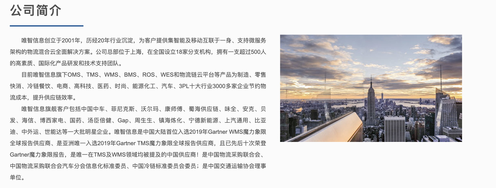 | 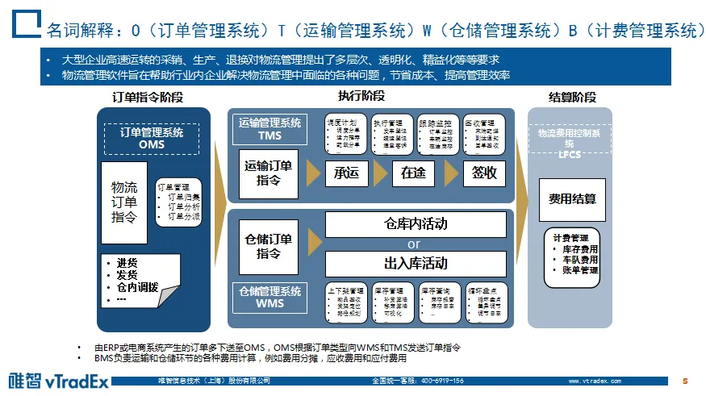 |

| 列 1 | 列 2 |
| --- | --- |
| 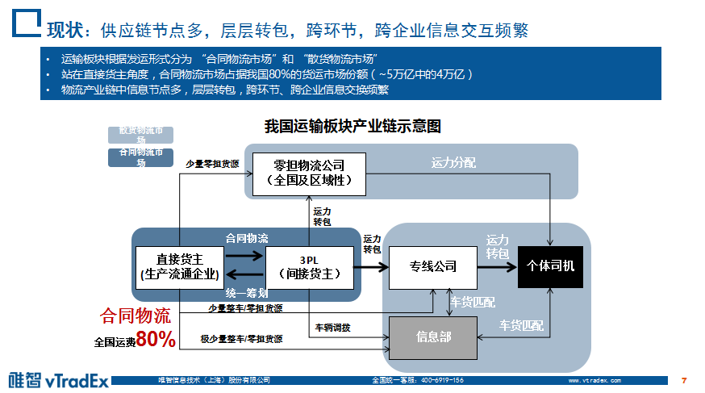 | 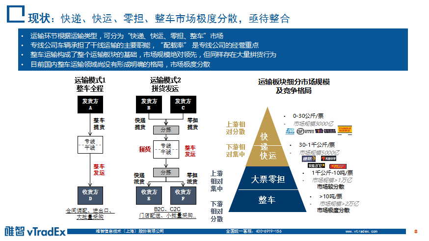 |

## 什么是OTWB？

OTWB是OMS、TMS、WMS、BMS这四个系统的统称，由唯智公司在2010年最早提出，所以通过唯智公司官网的一些产品介绍，可以知道当时他们对这个几个系统的定义和理解分别是：

1.  **订单管理系统（Order Management System, OMS）**：指的是物流订单管理系统，对物流订单进行全生命周期的管控。例如说订单创建并接收，订单处理、分发，订单流程跟进，订单逆向、异常处理等。
2.  **运输管理系统（Transportation Management System, TMS）**：指的是运输管理系统，管控运输订单的每个环节，包括前端取货、干线、零担、整车、中转发运、落地配等。
3.  **仓库管理系统（Warehouse Management System, WMS）**：指的是仓储管理系统，用于管理实体仓储内的所有业务，涵盖了收货、发货、仓内加工处理、内部各大事项的管理等。
4.  **费用管理系统（Billing Management System, BMS）**：有时也称为财务管理系统（Financial Management System, FMS），负责对运输、仓储过程中产生的各种费用进行计费。它通过抽取前台订单数据，调用相应的费率表和计费引擎进行结费计算。

在唯智定义的“OTWB”概念中，可以看得出，相关的信息化系统主要面向的业务场景是“物流场景”，即上文中提到的“**快递、快运、零担、整车市场**”。

但是随着时间的推移，随着OTWB这个业务概念的拓展和延伸，在不同行业中大家会对OTWB的概念有一些细微的偏差和侧重点，而不是仅仅局限在前面提到的“物流场景”中。

## 同城货运中的OTB

在“同城货运”的业务场景中，最常见的场景是：客户发布运输的需求，然后物流平台接单，并分配车辆、司机，同时规划运输线路。司机接收到了物流平台的订单指令后，前往货物所在地，并将货物运输到指定的地点中。

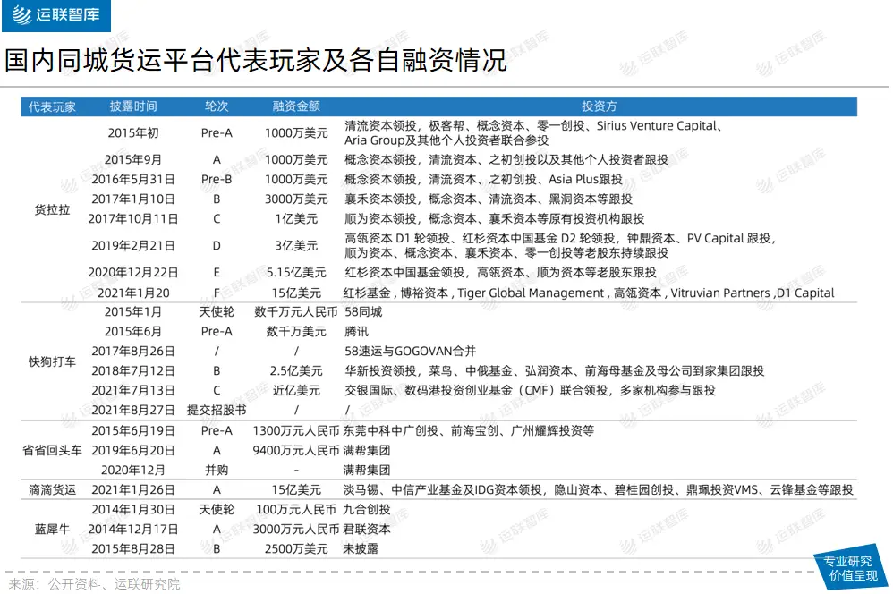​

在此过程中，一般不需要用到WMS，因为货物不需要再中转入库，而是直接从A点到了B点，所以针对“同城货运”类似的物流公司或平台来说，它们需要搭建的就是“OTB系统”，并没有“W”系统。

1.  **订单管理系统（Order Management System, OMS）**：接收来自多个渠道的订单，如外部系统订单自动导入、手工下单、APP下单等，然后通过订单处理规则生成后续的运输计划或运输单。
2.  **运输管理系统（Transportation Management System, TMS）**：包含了基础资料管理，订单处理、运输计划、车辆和司机调度、车辆跟踪等功能，是物流公司中最核心的业务系统。
3.  **费用管理系统（Billing Management System, BMS）**：包含了各类费用的计费规则维护，费用计算，财务账单核对，与客户、司机端的结算等。

> 通过这个例子可以知道，OTWB是由4个系统构成的，其实背后的关系是可以自由组合的，一般来说“OTWB”最为常见，其次是“OTB”。也有一些只有“OW”，因为有一些自研仓库不要计费。

## 跨境领域中的OTWBP

### OMS

OMS叫做订单管理系统（Order Management System），在不同公司，不同领域有不同的定义。主要原因就是因为大家对「订单」这个词的定义是有区别的，例如说点外卖也叫做订单，滴滴打车也叫订单，寄快递也叫订单，然后在淘宝、天猫、京东电商平台购物也叫订单……

海外仓领域中的订单管理系统，这里的订单是指来自电商平台的订单，无论是直接从API推进来的，还是从ERP接进来，亦或者是手动创建/导入进来的，本质上这些订单都是来自于Amazon，eBay，Wish，Shopify等电商平台，所以很多订单数据结构和操作方式等都是相似的。

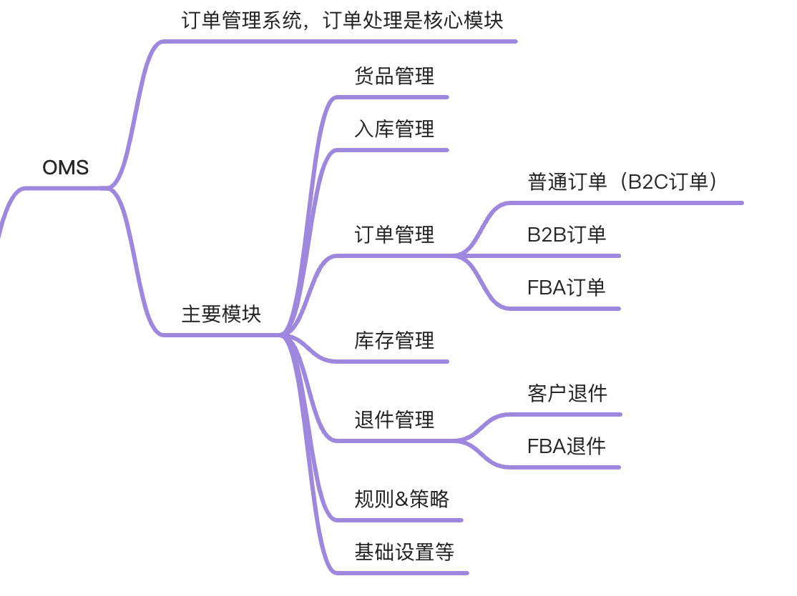

### TMS

TMS叫做运输管理系统（Transportation Management System），一般在国内物流领域用的比较多。在跨境电商领域也有这个词，应该是某位大佬从国内物流的管理的经验中借鉴过来的，但其实我觉得叫TMS不太准确。

因为一说到TMS大家普遍认知里就会觉得TMS应该是有车辆五维状态管理，车辆调度，GPS，配载路径算法等，但是跨境领域的TMS其实更多的是一些物流服务商的管理，物流渠道的对接，轨迹的抓取与分析，渠道派送时效统计分析，小包专线，空海派渠道管理等之类，和国内的TMS其实完全不搭边。

所以我之前做的项目就把TMS改名叫做了LMS（Logistics Management System），感觉这个定义会更加准确一点，也有意于区分开国内的TMS，避免理解上有歧义。

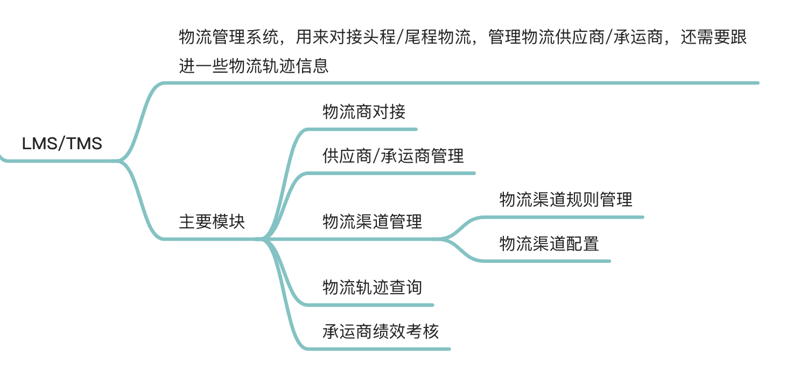

### WMS

WMS叫做仓库管理系统（Warehouse Management System），WMS是比较标准的一套系统，只要大家叫做仓库管理系统，那么里面涉及到的一些功能模块和实际操作流程都大同小异，不管是国内的电商仓库，还是海外仓。

WMS的行业经验是最容易复用的，而且通用型最强的，所以这一块反而是比较清晰简单的，一提到WMS大家的潜意识理解基本不会相差太大。海外仓和国内仓的产品架构基本上是相同的，主要的差异点一般来说是因为语言文化、当地工作人员的工作习惯，跨境物流的要求，还有商品类型和目的终端的要求等而导致的，这些因为跨境业务的特殊性所以导致WMS也要做一些适配。

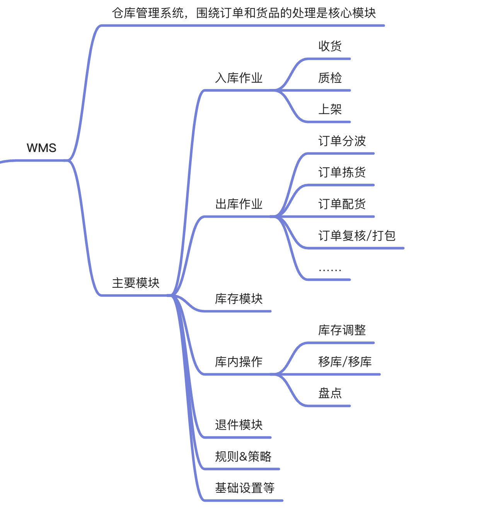

### BMS

BMS叫做费用结算管理系统（Billing Management System），有些公司也会叫做FMS，意思是指财务管理系统（Financial Management System）。BMS和TMS一样很有具有行业特色，也比较容易有歧义。很多公司对BMS的定义是基于物流行业繁冗的计费模式，针对物流仓储各环节的计费复杂性与重复性，制定多种计费模型的仓储计费系统。可根据客户需求配置不同计费标准，从而清楚计算并记录仓储各环节费用，解决人工计费误差、超时、繁琐易出错等问题。

在海外仓系统中，BMS主要也是用于费用的结算管理，这一块的费用主要分两大方向：应收和应付。应收就是对客户的计费，应付就是对供应商（物流承运商和仓库供应商）的计费。

而主要收费的模块一般是仓租费，运费还有仓储操作费（拆板，上架，拣货，打包等）这三大块，其中还有一些琐碎的内容一般都会放在杂费中。

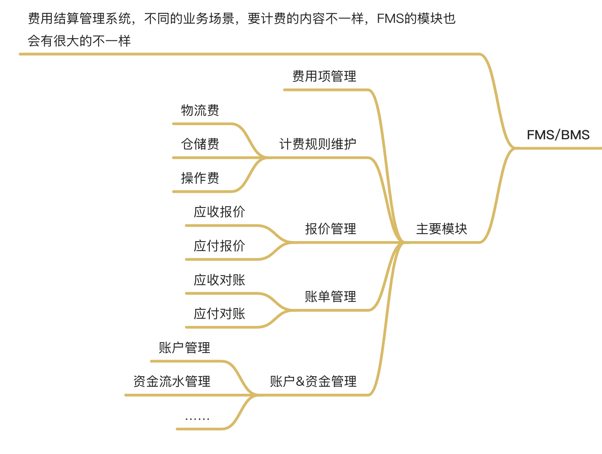

### PDP

除了OTWB之外，还有一个系统叫作PDP（Public Data Platform）。之前调研竞品的时候有看到类似的系统，但是不是叫做这个名字，为了便于团队统一认知，所以我给它定了一个名字叫PDP。

公共数据平台可以算是数据中台，也可以算是公共数据池。由于「OTWB」的存在，多个系统间其实有很强的业务关联性，必然就会有很多数据是冗余的，例如说货品资料，货主资料，仓库资料，渠道资料，还有一些基础信息（国家/地区，省州，城市，地址，币种，汇率等），这些信息在OMS中，在BMS中有，在WMS中也可能有，有些数据需要在多个系统保留多份副本，不便于后期的维护和管理……

于是就抽象出一些公共的数据对象，将其放在PDP中，提供给多个系统使用。例如货主资料只要在PDP中创建一次，然后OMS，WMS，BMS则会自动同步拉取，避免在多个系统维护相同的数据。

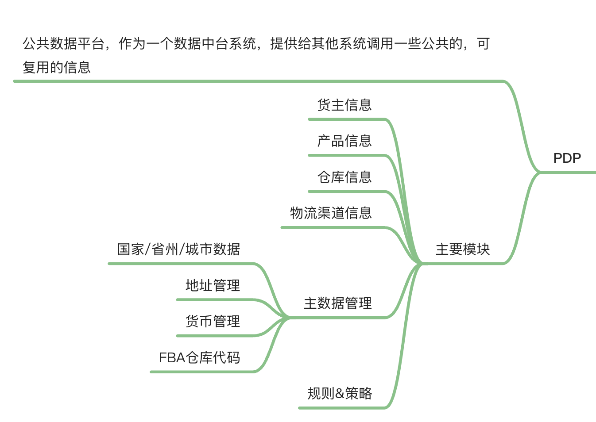

  

## 总结

无论是OTWB、OTB还是OTWBP，其实本质就是几个业务系统的串联和聚合，只要抓准了这几个系统的核心定义和功能，那么做出来的产品应该就不会偏差太多。不过我还是衷心地希望这几个词能更火一些，让更多的从业人士能形成统一共识，一方面可以避免踩坑，另一方面也能推动这个行业的标准化和覆盖面。

作为初学者们，除了要关注这几个系统的定义之外，也要关注一下这几个系统之间的数据交互和关系流转。这部分的内容，会在后续的文章中，逐步为大家揭晓。

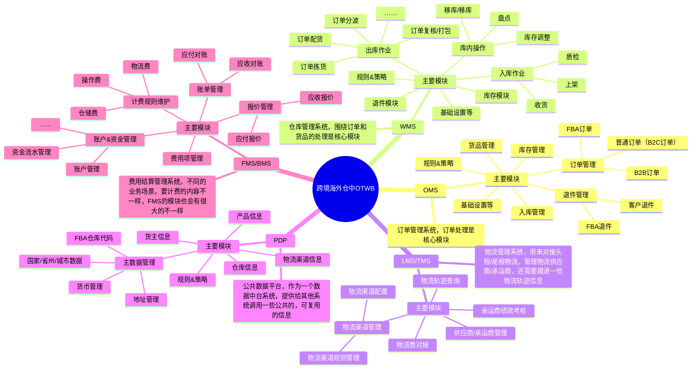

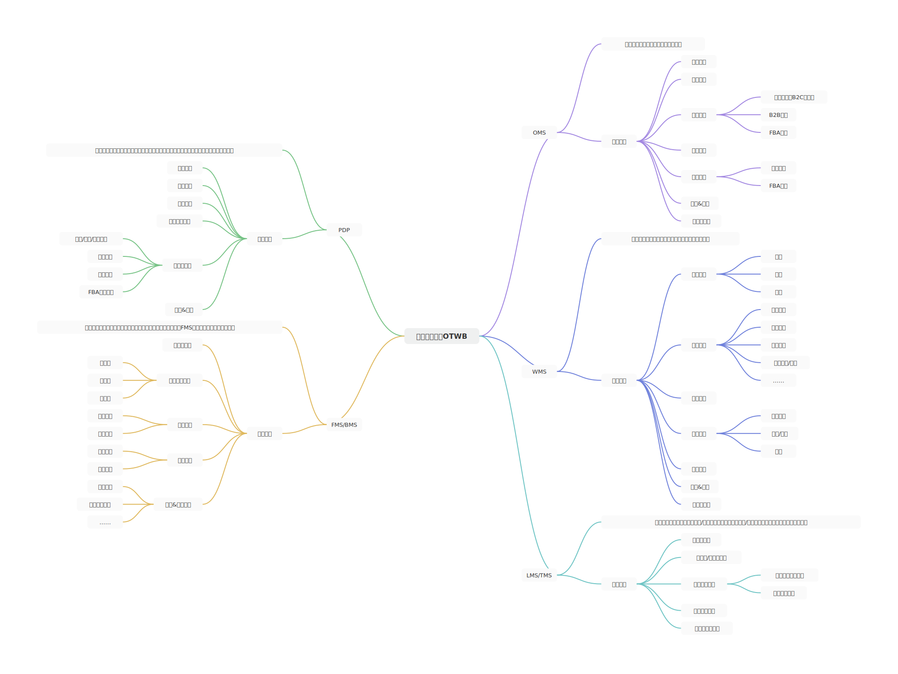
[洞隐公司与产品介绍v5.pdf](https://www.yuque.com/attachments/yuque/0/2025/pdf/48385069/1738735879125-859c033e-482d-41e4-9fc7-df1996883aa3.pdf)[Arpa OTWBS 数字供应链解决方案.pdf](https://www.yuque.com/attachments/yuque/0/2025/pdf/48385069/1738735879286-ec8adf99-b20e-4ca6-82d4-eebdc99a75c1.pdf)